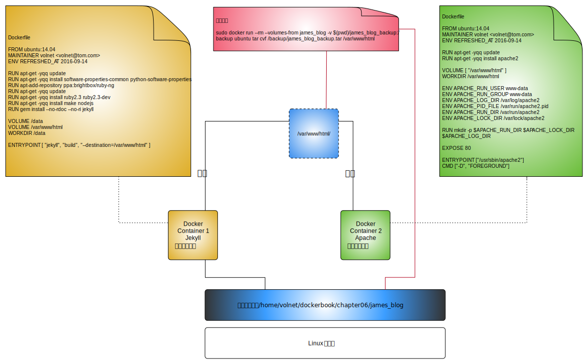
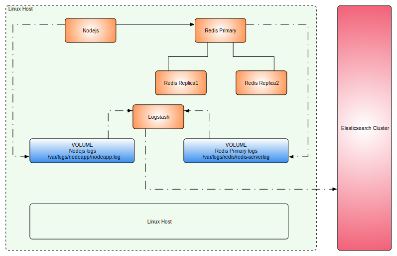
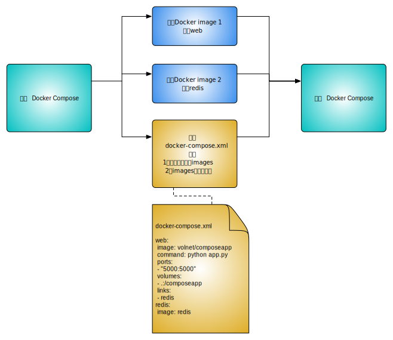
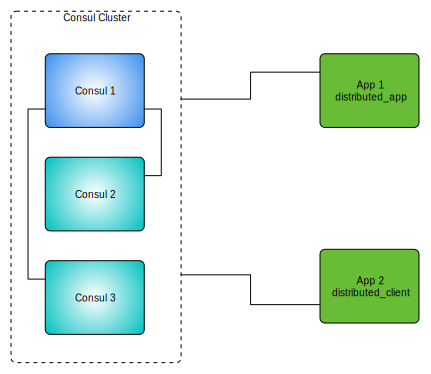

第一本Docker书
==============

作者：[澳]James Turnbull著

李兆海 刘斌 巨震 译

[本书网站](https://www.dockerbook.com)、[本书示例](https://github.com/jamtur01/dockerbook-code)

第1章 简介
----------

容器被称为“操作系统级虚拟化”，容器技术可以让多个独立的用户空间运行在同一台宿主机上。
而“管理程序虚拟化”（Hypervisor Virtualization，HV）通过中间层将一台或多台独立的机器虚拟运行于物理硬件之上。

正因为容器“客居”于操作系统，所以容器只能运行与底层宿主机相同或相似的操作系统。比如：Ubuntu之上可以运行RedHat，但是不能运行Windows。

相对于“管理程序虚拟化”，容器被认为是不安全的。而也有人认为“管理程序虚拟化”因为暴露了操作系统，而显得更不安全。

随着技术的发展，容器不再仅仅是单纯的运行环境。而更像是一个完整的宿主机。

容器有较小的开销，因此宿主机可以运行更多的容器。

但是容器本身比较复杂，不易安装，管理和自动化也很困难。Docker就是为改变这一切而生。

### 1.1 Docker简介

Docker的目标是要提供：

- 提供一个简单、轻量的建模方式：上手快、启动快、性能高

- 职责的逻辑分离：开发、测试、生产的一致性，保证了开发和运维之间的职责清晰

- 快速、高效的开发生命周期：缩短了开发、测试、部署、上线的周期

- 鼓励使用面向服务的架构：推荐（鼓励）单个容器只运行一个应用程序或进程，形成一个分布式的应用模型，在这种模型下，应用程序或服务都可以表示为一系列内部互联的容器。

### 1.2 Docker组件


- Docker客户端和服务端，也称为Docker引擎


Docker是一个客户端/服务端（C/S）架构程序。

Client端：命令行工具（CLI）

Server端：[REST API](https://docs.docker.com/engine/reference/api/docker_remote_api/) + 守护进程(Daemon Process)

- Docker镜像：可以把镜像当作容器的“源代码”。镜像是Docker生命周期中的构建或打包阶段。

- Registry：可以使用公共的Registry——[Docker Hub](https://docs.docker.com/docker-hub/)，也可以架设自己的私有Registry。

- 容器：容器是Docker生命周期中的启动或执行阶段。

Docker借鉴了标准集装箱的概念，唯一不同的是：集装箱运输货物，而Docker运输软件。

> 补充阅读：《[Docker Overview](https://docs.docker.com/engine/understanding-docker/)》

### 1.3 能用Docker做什么

- 加速本地开发和构建的流程，使其更加高效、更加轻量化。

- 能够让独立服务或应用程序在不同的环境中，得到相同的运行结果。这一点在面向服务的架构和重度依赖微型服务的部署中尤其实用。

- 用Docker创建隔离的环境来进行测试。

- Docker可以让开发者先在本机构建一个复杂的程序或架构进行测试。

- 构建一个多用户的平台即服务（PaaS）基础设施。

- 提供独立的沙盒环境。

- 提供软件即服务（SaaS）应用程序。

- 高性能、超大规模的宿主机部署。

### 1.4 Docker与配置管理

Docker一个显著的特点就是，对不同的宿主机、应用程序和服务，可能会表现出不同的特性与架构。

在未来的一段时间内，Docker这种理想化的工作负载可能会与传统的基础设备部署共存一段时间。在绝大多数的组织中，Docker和配置管理工具可能都需要部署。

### 1.5 Docker的技术组件

- 一个原生的Linux容器格式，Docker中称为libcontainer

- Linux内核的命名空间（[namespaces](http://lwn.net/Articles/531114/)），用于隔离文件系统、进程和网络。

- 进程隔离：每个容器都运行在自己的进程环境中。

- 网络隔离：容器间的虚拟网络接口和IP地址都是分开的。

- 资源隔离和分组：使用[cgroups](https://en.wikipedia.org/wiki/Cgroups)（即control group，Linux的内核特性之一）将CPU和内存之类的资源独立分配给每个Docker容器。

- [写时复制](https://en.wikipedia.org/wiki/Copy-on-write)：文件系统都是通过写时复制创建的，也就意味着文件系统是分层的、快速的，而且占用的磁盘空间更小。

- 日志：容器产生的STDOUT、STDERR和STDIN这些IO流都会被收集并记入日志，用来进行日志分析和故障排错。

- 交互式shell：用户可以创建一个伪tty终端，将其连接到STDIN，为容器提供一个交互式的shell。

### 1.6 本书的内容

作者将全面讲解并演示Docker。

第2章 安装Docker
---------------

本节主要以Docker的安装为主，讲解了各种常见Linux发行版的安装以及使用[Docker Toolbox](https://www.docker.com/products/docker-toolbox)在OS X和Windows上的安装。

Docker安装的先决条件是：

- 64位CPU构架的计算机（目前只能是x86_64和amd64），不支持32位。可以用Linux命令`uname -a`查看。

- 运行Linux 3.8或更高版本内核。

- 内核必须支持一种适合的存储驱动（storage driver）

- 内核必须支持并开启[cgroups](https://en.wikipedia.org/wiki/Cgroups)和命名空间（[namespaces](http://lwn.net/Articles/531114/)）功能。

至于具体的安装步骤，书中说的并没有Docker安装文档详细，建议直接查看[Docker官方文档](https://docs.docker.com/engine/installation/)。

第3章 Docker入门
---------------

> 《[Docker命令行参考文档](https://docs.docker.com/engine/reference/commandline/cli/)》

```
parallels@ubuntu:~$ sudo docker run -i -t ubuntu /bin/bash
Unable to find image 'ubuntu:latest' locally
latest: Pulling from library/ubuntu
952132ac251a: Pull complete 
82659f8f1b76: Pull complete 
c19118ca682d: Pull complete 
8296858250fe: Pull complete 
24e0251a0e2c: Pull complete 
Digest: sha256:f4691c96e6bbaa99d99ebafd9af1b68ace2aa2128ae95a60369c506dd6e6f6ab
Status: Downloaded newer image for ubuntu:latest
root@019b21d670f7:/#
```

命令解释：docker run

- -i：保证容器中的STDIN是开启的。

- -t：告诉Docker为要创建的容器分配一个伪tty终端。

- ubuntu：镜像的名字

- /bin/bash：启动容器后执行的语句

可以使用`docker ps -a`查看当前系统中容器的列表。

```
parallels@ubuntu:~$ docker ps -a
CONTAINER ID        IMAGE                 COMMAND                  CREATED              STATUS                        PORTS               NAMES
87a430a359ef        ubuntu                "/bin/bash"              About a minute ago   Exited (0) 11 seconds ago                         ubuntu-web-001
```

```
docker run -i -t --name ubuntu-web-001 ubuntu /bin/bash
```

使用`--name`可以指定一个容器名称。

可以使用`docker start [container-name]`启动服务，类似的还有`docker stop`、`docker restart`、`docker create`

```
sudo docker start ubuntu-web-001 
```
也可以使用Container ID启动
```
parallels@ubuntu:~$ docker start 87a430a359ef597af9da14dcfc77290b35d8e1b5ccde6756f326f05efd458b0f 
87a430a359ef597af9da14dcfc77290b35d8e1b5ccde6756f326f05efd458b0f
parallels@ubuntu:~$ docker ps
CONTAINER ID        IMAGE               COMMAND             CREATED             STATUS              PORTS               NAMES
87a430a359ef        ubuntu              "/bin/bash"         5 minutes ago       Up 13 seconds                           ubuntu-web-001
```

可以使用`docker attach`附着到已经启动的容器上。

```
docker attach ubuntu-web-001
```

交互式的容器用`docker run`之后会启动，用`exit`后，就退出，状态为关闭，用`docker start`后，会重新启动，但是不进入交互式界面，此时就可以使用`docker attach`命令进入。

与交互式容器不同，守护式容器可以用-d来指定。它不会将当前的命令提示符切换到docker容器中。

```
parallels@ubuntu:~$ docker run --name daemon_dave -d ubuntu /bin/sh -c "while true; do echo hello world; sleep 1; done"
8fbd7e9720089b647e8a70e974d0e541e1b3050375c75d148af9321ae8b85b79
```

使用`docker logs daemon_dave`可以查看容器的日志，但是是一次性的。`docker logs daemon_dave -f`增加了`-f`参数，类似于`tail -f`命令，可以监控Docker的日志。

```
parallels@ubuntu:~$ docker logs daemon_dave -f
hello world
hello world
hello world
hello world
hello world
```
增加`-t`参数可以增加时间
```
parallels@ubuntu:~$ docker logs daemon_dave -f -t
2016-08-28T15:49:41.292969746Z hello world
2016-08-28T15:49:51.293822132Z hello world
2016-08-28T15:50:01.295697278Z hello world
2016-08-28T15:50:11.297390260Z hello world
2016-08-28T15:50:21.299265255Z hello world
```
增加`--tail 0`可以查看最新的日志，增加`--tail 10`可以查看最新10条日志。

可以使用`--log-driver="syslog"`将默认的`json-file`日志驱动换掉，这将导致`docker logs`命令不再有效，日志将被重定向到syslog中。

同样地，还可以使用`--log-driver="none"`关闭日志。

使用`docker top daemon_dave`可以查看容器内的进程。

可以用`docker stats`查看容器的统计信息。

```
CONTAINER           CPU %               MEM USAGE / LIMIT    MEM %               NET I/O             BLOCK I/O           PIDS
2945eb23b5a4        0.10%               328 KiB / 5.74 GiB   0.01%               4.383 kB / 648 B    0 B / 0 B           0
```

使用`docker exec -d daemon_dave touch /etc/volnet_config`可以在容器内执行一个不需要交互的命令。

使用`docker exec -i -t daemon_dave ls /etc ｜ grep volnet`可以在容器内执行一个需要交互的命令。

`docker stop`和`docker kill`的区别在于，前者发送SIGTERM信号，后者发送SIGKILL信号。

使用`docker run --restart=always ……`等命令可以保持在容器停止后重启，具体的参数详见[run reference --restart](https://docs.docker.com/engine/reference/run/#restart-policies-restart)。

使用`docker inspect ubuntu-web-001`命令，可以获得容器的更多信息。

```
parallels@ubuntu:~$ docker inspect --format='{{ .State.Running }}' ubuntu-web-001
false

parallels@ubuntu:~$ docker inspect --format='{{ .NetworkSettings.IPAddress }}' ubuntu-web-001
172.17.0.2
```
目录`/var/lib/docker`存放着Docker镜像、容器以及容器的配置。
```
parallels@ubuntu:~$ sudo ls /var/lib/docker
[sudo] password for parallels: 
aufs  containers  graph  image	linkgraph.db  network  repositories-aufs  swarm  tmp  trust  volumes
```

使用`docker rm`删除单个容器（不包括运行中的），`docker rm -f`删除单个容器（包括运行中的）

使用下面语句删除所有容器：

```
sudo docker rm `sudo docker ps -a -q`
```
以上命令中，`-q`标志表示只需要返回容器的ID而不会返回容器的其它信息。这样我们就得到了容器ID的列表，并传给了`docker rm`命令，从而达到删除所有容器的目的。

第4章 使用Docker镜像和仓库
-----------------------

### 4.1 什么是Docker镜像

官方文档：《[Understand images, containers, and storage drivers](https://docs.docker.com/engine/userguide/storagedriver/imagesandcontainers/#understand-images-containers-and-storage-drivers)》

从底向上：
    
bootfs（引导文件系统）（只读，启动后从内存中移除）

-> rootfs（root文件系统，可以是一种或多种操作系统（如Debian或者Ubuntu文件系统））（只读，在传统Linux引导过程中，root文件系统最先会以只读的方式加载，当引导结束并完成了完整性检查之后，它才会被切换为读写模式。），延伸阅读：[Union Mount](https://en.wikipedia.org/wiki/Union_mount)

-> 其它镜像（Apache、emacs等）

-> 可写容器（Container Layer(R/W)）

顶层的可写容器，采用了写时复制（copy on write）


### 4.2 列出镜像

列出Docker镜像：

```
sudo docker images
```

使用`docker run`命令的时候，如果镜像不存在，则默认会从官方的Registry中获取，也就是Docker Hub。

- Docker Hub：官方的Registry

- Docker Trusted Registry：可以运行在公司防火墙内部的产品，之前被称为“Docker Enterprise Hub”。[官方文档](https://docs.docker.com/docker-trusted-registry/) | [安装文档](https://docs.docker.com/docker-trusted-registry/install/)

### 4.3 拉取镜像

使用`sudo docker pull volnet/helloworld:1.0`可以只拉取镜像，不运行。其中，`volnet`是用户名，`helloworld`是仓库名，而`1.0`是TAG。如果镜像是由Docker官方提供的或者是合作厂商提供的，则没有“用户名”。

默认如果不指定TAG则拉取`TAG=lastest`的镜像。

### 4.4 查找镜像

使用`sudo docker search helloworld`查找所有Docker Hub上的镜像。

### 4.5 构建镜像

以下两种方式都可以构建镜像：

- 使用docker commit命令

- 使用docker build命令和Dockerfile文件（推荐）

官方文档：[从零构建一个全新的镜像](http://docs.docker.com/engine/userguide/eng-image/baseimages/)

#### 4.5.1 创建Docker Hub帐号

使用`docker login`命令可以登录Docker Hub，使用`docker logout`命令可以退出。

#### 4.5.2 用Docker的commit命令创建镜像

先对Docker进行修改，然后退出（`exit`）后使用`docker commit [docker_id] username/imagename`命令，提交创建容器的镜像与容器的当前状态之间有差异的部分。这样就不用每次都创建一个新容器并再次在里面安装了。

#### 4.5.3 用Dockerfile构建镜像

首先需要创建一个目录，用来放置Dockerfile文件，这个目录就是构建上下文（build context）。

Docker会在构建镜像时将构建上下文和该上下文中的文件和目录上传到Docker守护进程。这样Docker守护进程就能直接访问用户想在镜像中存储的任何代码、文件或者其他数据。

```
parallels@ubuntu:~$ mkdir docker_test
parallels@ubuntu:~$ cd docker_test/
parallels@ubuntu:~/docker_test$ touch Dockerfile
parallels@ubuntu:~/docker_test$ vi Dockerfile 
parallels@ubuntu:~/docker_test$ docker build -t="volnet/docker_nginx_to_volnet.github.io" .
```

最后一句话，最后的“.”是告诉Docker到本地目录中去找Dockerfile文件。

也可以指定一个Git仓库的源地址来指定Dockerfile的位置，如代码：

```
sudo docker build -t="volnet/docker_nginx_to_volnet.github.io" git@github.com:volnet/docker-static_web
```

此处指出的Git仓库仍然是指一个构建上下文（build context）也就是一个包含了Dockerfile的目录。

```
FROM ubuntu:14.04
MAINTAINER volnet "volnet@tom.com"
RUN apt-get update && apt-get install -y nginx
RUN echo 'Welcome to http://volnet.github.io/' > /usr/share/nginx/html/index.html
EXPOSE 80
```

每个Dockerfile的第一条指令必须是FROM。FROM指令指定一个已经存在的镜像。后续指令都将基于该镜像进行，这个镜像被称为基础镜像（base image）。

#### 4.5.4 基于Dockerfile构建新镜像

可以在构建上下文的根目录下放置`.dockerignore`文件，来设置哪些文件不会被当作构建上下文的一部分。[匹配规则](https://golang.org/pkg/path/filepath/#Match)：文件按行分割，每一行都是一条文件过滤匹配模式。

#### 4.5.5 指令失败时会怎样

因为每一行Dockerfile指令都会被作为一个单独的镜像，所以在`docker build`的过程中，如果某一行出现错误，可以使用上一行生成的image id来`docker run`这个镜像，然后手工调试出错的语句，当确诊后再将正确的语句修改到Dockerfile中。

#### 4.5.6 Dockerfile和构建缓存

默认情况下，docker会将每一行执行的镜像都进行缓存，当我们对Dockerfile做出修改的时候，如果前面的步骤没有修改，默认会使用缓存。但是有时候我们需要避免使用缓存，比如`RUN apt-get update`，这是一个需要实时数据的语句，如果使用缓存可能无法满足需求。因此可以使用`--no-cache`参数来强制要求不使用缓存。

```
sudo docker build --no-cache -t="volnet/volnet.github.io"
```

#### 4.5.7 基于构建缓存的Dockerfile模板

除了使用`--no-cache`的方式禁用缓存，还可以使用更取巧的方式。因为Dockerfile文件是按顺序执行的，缓存只在Dockerfile未发生变化的行中有效，一旦出现一条语句发生了变化，则后续的语句无论是否发生过变化都不再使用缓存。考虑下面的代码：

```
FROM ubuntu:14.04
MAINTAINER volnet "volnet@tom.com"
ENV REFRESHED_AT 2016-08-31
RUN apt-get -qq update
```

如果需要让最后一句RUN语句不使用缓存，只要更新上一句ENV语句即可。

#### 4.5.8 查看新镜像

使用`docker images`查看镜像，使用`docker history`查看镜像历史。

```
parallels@ubuntu:~/docker_test$ docker images volnet/docker_nginx_to_volnet.github.io
REPOSITORY                                TAG                 IMAGE ID            CREATED             SIZE
volnet/docker_nginx_to_volnet.github.io   latest              1a155826eab3        49 minutes ago      228.3 MB
parallels@ubuntu:~/docker_test$ docker history volnet/docker_nginx_to_volnet.github.io
IMAGE               CREATED             CREATED BY                                      SIZE                COMMENT
1a155826eab3        50 minutes ago      /bin/sh -c #(nop)  EXPOSE 80/tcp                0 B                 
dca31a843cfe        50 minutes ago      /bin/sh -c echo 'Welcome to http://volnet.git   36 B                
d78dc5c186ef        50 minutes ago      /bin/sh -c apt-get update && apt-get install    40.3 MB             
ea1a93f42352        53 minutes ago      /bin/sh -c #(nop)  MAINTAINER volnet "volnet@   0 B                 
4a725d3b3b1c        4 days ago          /bin/sh -c #(nop) CMD ["/bin/bash"]             0 B                 
<missing>           4 days ago          /bin/sh -c mkdir -p /run/systemd && echo 'doc   7 B                 
<missing>           4 days ago          /bin/sh -c sed -i 's/^#\s*\(deb.*universe\)$/   1.895 kB            
<missing>           4 days ago          /bin/sh -c rm -rf /var/lib/apt/lists/*          0 B                 
<missing>           4 days ago          /bin/sh -c set -xe   && echo '#!/bin/sh' > /u   194.6 kB            
<missing>           4 days ago          /bin/sh -c #(nop) ADD file:ada91758a31d8de3c7   187.8 MB 
```

#### 4.5.9 从新镜像启动容器

以下语句使用`-p`或者`-P`参数指定docker容器的端口。

```
sudo docker run -d -p [IPAddress]:[host_port]:[container_port] --name container_name volnet/imagename
```

或者

```
sudo docker run -d -P --name container_name volnet/imagename
```

第一句`-p`可以指定端口映射。如果`IPAddress`为空，则默认为127.0.0.1，如果`host_port`为空，则默认为32768～61000之间的一个随机端口，`container_port`为必填。

第二句`-P`则是给所有Dockerfile中EXPOSE的端口号都指定随机端口。

使用`docker port`命令或者`docker ps -l`命令都可以查看端口映射情况。

关于网络映射的更详细说明可以参考：[官方文档](https://docs.docker.com/engine/userguide/networking/default_network/dockerlinks/#network-port-mapping-refresher)

#### 4.5.10 Dockerfile指令

官方文档：[查看Dockerfile中可以使用的全部指令的清单](https://docs.docker.com/engine/reference/builder/)

- 1. CMD

CMD指令是指定容器启动时要运行的命令（而RUN则是指定容器构建时要运行的命令）

```
CMD ["/bin/bash", "-l"]
```

要运行的命令放在数组中，这将告诉Docker按指定的原样来运行该命令。当然也可以不使用数组而是指定CMD指令，这时候Docker会在指定的命令前加上`/bin/sh -c`。这在执行该命令的时候可能会导致意料之外的行为，所以Docker推荐一直使用以数组语法来设置要执行的命令。

在`docker run`中指定运行的命令，如：`docker run -i -t ubuntu /bin/ps`，将取代Dockerfile中的CMD指令。

在Dockerfile中只能指定一条CMD指令。如果指定了多条CMD指令，也只有最后一条CMD指令会被使用。如果想在启动容器时运行多个进程或者多条命令，可以考虑使用类似Supervisor这样的服务管理工具。

- 2. ENTRYPOINT

ENTRYPOINT命令也是在容器启动的时候运行。`docker run`命令行中指定的任何参数都会被当做参数再次传递给ENTRYPOINT指令中指定的命令。

假设在Dockerfile中指定了ENTRYPOINT指令

```
ENTRYPOINT["/user/sbin/nginx"]
```

那么下面的命令

```
docker run -t -i volnet/nginx -g "daemon off;"
```

中的`-g "daemon off;"`就会被作为参数传递给`/user/sbin/nginx`指令。

考虑到在`docker run`的时候，如果指定任何参数，则会覆盖CMD指令，否则则执行最后一条CMD指令。那么下面的语句：

```
ENTRYPOINT ［"/user/sbin/nginx"]
CMD["-h"]
```

将在运行

```
docker run -t -i volnet/nginx -g "daemon off;"
```
命令的时候，覆盖`CMD["-h"]`指令，而在运行

```
docker run -t -i volnet/nginx
```

命令的时候，执行`ENTRYPOINT ［"/user/sbin/nginx", "-h"]`指令。

当存在ENTRYPOINT的时候CMD指令不能执行，只会被作为参数传递给ENTRYPOINT指令。

- 3. WORKDIR

WORKDIR指令用来在从镜像创建一个新容器时，在容器内部设置一个工作目录，ENTRYPOINT和/或CMD指定的程序会在这个目录下执行。

- 4. ENV

ENV指令用来在镜像构建过程中设置环境变量。

语法：

```
ENV RVM_PATH=/home/rvm RVM_ARCHFLAGS="-arch i386"
```

在其他Dockerfile指令中使用环境变量。

语法：

```
ENV TARGET_DIR /opt/app
WORKDIR $TARGET_DIR
```

- 5. USER

USER指令用来指定该镜像会以什么样的用户去运行。

可以指定用户名或UID以及组或GID，甚至两者的组合：

```
USER user
USER user:group
USER uid
USER uid:gid
USER user:gid
USER uid:group
```

也可以在`docker run`命令中通过`-u`标志来覆盖该指令指定的值。

如果不通过USER指令指定用户，默认用户为root。

- 6. VOLUME

VOLUME指令用来向基于镜像创建的容器添加卷。一个卷可以存在于一个或多个容器内的特定的目录，这个目录可以绕过联合文件系统，并提供如下共享数据或者对数据进行持久化的功能。

    - 卷可以在容器间共享和重用。

    - 一个容器可以不是必须和其他容器共享卷。

    - 对卷的修改是立时生效的。

    - 对卷的修改不会对更新镜像产生影响。

    - 卷会一直存在直到没有任何容器再使用它。

关于卷功能，可以参考[Manage data in containers](https://docs.docker.com/engine/tutorials/dockervolumes/)

- 7. ADD

ADD指令用来将构建环境下的文件和目录复制到镜像中。

```
ADD software.lic /opt/application/software.lic
```

指向源（前面一个参数）可以是一个URL，或者构建上下文或环境中文件名或者目录。不能对构建目录或者上下文之外的文件进行ADD操作。

ADD指令会使得构建缓存变得无效，这一点也非常重要。如果通过ADD指令向镜像添加一个文件或者目录，那么这将使Dockerfile中的后续指令都不能继续使用之前的构建缓存。

- 8. COPY

COPY指令非常类似于ADD，它们根本的不同是COPY只关心在构建上下文中复制本地文件，而不会去做文件提取（extraction）和解压（decompression）的工作。

```
ADD mylocalfile.tar.gz /opt/upload/ADD/
COPY mylocalfile.tar.gz /opt/upload/COPY/
```
面对同样的文件，不同的命令表现出了不同的特征。
```
root@a5a85a0f104f:/# ls /opt/upload/ADD /opt/upload/COPY
/opt/upload/ADD:
mylocalfile.txt

/opt/upload/COPY:
mylocalfile.tar.gz
```

- 9. LABEL

LABEL指令用于为Docker镜像添加元数据。元数据以键值对的形式展现。

```
LABEL version="1.0"
LABEL location="New York" type="Data Center" role="Web Server"
```

推荐将所有的元数据都放到一条LABEL指令中，以防止不同的元数据指令创建过多镜像层。可以通过`docker inspect`命令来查看Docker镜像中的标签信息。

会在"Config\Labels"标签下增加相关值：

```
"Labels": {
    "author": "volnet",
    "email": "volnet@tom.com",
    "homepage": "http://volnet.github.io",
    "version": "1.0"
}
```

- 10. STOPSIGNAL

STOPSIGNAL指令用来设置停止容器时发送什么系统调用信号给容器。这个信号必须是本节主要讲了Docker镜像及如何与其交互内核系统调用表中的合法的数，如9，或者SIGNAME格式中的信号名称，如SIGKILL。

官方文档参考[这里](https://docs.docker.com/engine/reference/builder/#stopsignal)。

信号列表参考[这里](https://en.wikipedia.org/wiki/Unix_signal)

- 11. ARG

ARG指令用来定义可以在`docker build`命令运行时传递给构建运行时的变量，我们只需要在构建时使用`--build-arg`标志即可。用户只能在构建时指定在Dockerfile文件中定义过的参数。

要想使用这些预定义的变量，只需要给`docker build`命令传递`--build-arg <variable>=<value>`标志就可以了。

官方文档参考[这里](https://docs.docker.com/engine/reference/builder/#/arg)。

- 12. ONBUILD

ONBUILD指令能为镜像添加触发器（trigger）。当一个镜像被用做其他镜像的基础镜像时（比如用户的镜像需要从未准备好的位置添加源代码，或者用户需要执行特定于构建镜像的环境的构建脚本），该镜像中的触发器将会被执行。

触发器会在构建过程中插入新指令，我们可以认为这些指令是紧跟在FROM之后指定的。触发器可以是任何构建指令（但不能是FROM、MAINTAINER和ONBUILD，防止递归调用）。

```
ONBUILD ADD . /app/src
ONBUILD RUN cd /app/src && make
```

### 4.6 将镜像推送到Docker Hub

```
docker push volnet/helloworld
```

还可以使用Docker Hub的自动构建（Automated Build）功能，连接[GitHub](http://github.com)或[BitBucket](https://bitbucket.org/)。在每次代码签入变更后都会引发Docker Hub的自动构建工作。

### 4.7 删除镜像

`docker rmi`命令可以删除本地镜像。删除Docker Hub上的镜像，需要登录Docker Hub后删除。

```
docker rmi volnet/helloworld volnet/my_test
```

删除所有镜像

```
docker rmi `docker images -a -q`
```

### 4.8 运行自己的Docker Registry

直接从Docker容器安装一个Registry。最新官方说明见[这里](https://docs.docker.com/docker-trusted-registry/)

```
sudo docker run -p 5000:5000 registry:2
```

### 4.9 其他可选的Registry服务

比如[Quay](https://quay.io)提供了私有的Registry托管服务，允许用户上传公共的或者私有的容器。

### 4.10 小结

本章主要讲了Docker镜像及如何与其交互。

第5章 在测试中使用Docker
---------------------

### 5.1 使用Docker测试静态网站

```
docker run -d -p 80 --name website -v $PWD/website:/var/www/html/website volnet/nginx nginx
```

卷在Docker里非常重要，也很有用。卷是在一个或者多个容器内被选定的目录，可以绕过分层的联合文件系统（Union File System），为Docker提供持久数据或者共享数据。这意味着对卷的修改会直接生效，并绕过镜像。当提交或者创建镜像时，卷不被包含在镜像里。

### 5.2 使用Docker构建并测试Web应用程序

考虑到ubuntu中的apt-get安装的ruby是1.9.1版本，所以这里需要作出微调。

```
parallels@ubuntu:~/dockerbook/sinatra$ cat Dockerfile 
FROM ubuntu:14.04
MAINTAINER volnet "volnet@tom.com"
ENV REFRESHED_AT 2016-09-04

RUN apt-get -yqq update
RUN apt-get -yqq install software-properties-common python-software-properties
RUN apt-add-repository ppa:brightbox/ruby-ng
RUN apt-get -yqq update
RUN apt-get -yqq install ruby2.3 ruby2.3-dev
RUN apt-get -yqq install build-essential 
RUN apt-get -yqq install redis-tools
 
RUN gem install --no-rdoc --no-ri sinatra json redis

RUN mkdir -p /opt/webapp

EXPOSE 4567
CMD ["/opt/webapp/bin/webapp"]

```

使用`docker top [container_name]`可以查看容器内运行的进程。

使用`docker port [container_name] [port]`可以查看该端口映射。

Docker容器间互联：

- Docker的内部连网（不推荐）

- 从Docker 1.9及之后的版本开始，可以使用Docker Networking以及docker network命令。（version > 1.9 的时候推荐）

- Docker链接。一个可以将具体容器链接到一起来进行通信的抽象层。（version < 1.9 的时候推荐）

#### 5.2.5 Docker的内部连网

在安装Docker时，会创建一个新的网络接口，名字是docker0。每个Docker容器都会在这个接口上分配一个IP地址。

```
ip a show docker0
```

接口docker0是一个虚拟的以太网桥，用于连接容器和本地宿主网络。如果进一步查看Docker宿主机的其他网络接口，会发现一系列名字以veth开头的接口。

当出现下面的错误的时候，说明ip指令不存在：

```
root@354bc20c9fa5:/# ip a
bash: ip: command not found
```

ip命令包含在iproute包中：

```
apt-get update && apt-get install iproute
```

当遇到下面错误的时候，需要使用`--privileged`选项来启动

```
root@688ce720a710:/# iptables -t nat -L -n
iptables v1.4.21: can't initialize iptables table `nat': Permission denied (you must be root)
Perhaps iptables or your kernel needs to be upgraded.
```

```
parallels@ubuntu:~/dockerbook/ubuntu$ docker run -t -i --privileged volnet/ubuntu /bin/bash
root@223d7f2524b5:/# sudo iptables -t nat -L -n
Chain PREROUTING (policy ACCEPT)
target     prot opt source               destination         

Chain INPUT (policy ACCEPT)
target     prot opt source               destination         

Chain OUTPUT (policy ACCEPT)
target     prot opt source               destination         

Chain POSTROUTING (policy ACCEPT)
target     prot opt source               destination   
```

#### 5.2.6 Docker Networking

官方文档：[Understand Docker container networks](https://docs.docker.com/engine/userguide/networking/)

使用`docker network create [network_name]`命令可以创建一个桥接网络。

```
parallels@ubuntu:~$ docker network create app
d422677e0f6165906881e6e57aba0459d4593fa538f2a39df5f3d21ed6dc0102
```

使用`docker network inspect [network_name]`命令查看新创建的网络。

使用`docker network ls`查看当前系统中的所有网络。

使用`docker network rm`命令删除一个docker网络。

使用`--net=[network_name]`参数，可以指定新容器将会在哪个网络中运行。

```
docker run -d --net=app volnet/redis
```

使用`docker network connect [network_name] [container_name]`可以添加已有容器到网络。

使用`docker network disconnect [network_name] [container_name]`可以断开一个容器与指定网络的连接。

### 5.2.7 使用容器连接来通信

使用`--link [container_name]:[alias]`创建服务端。其中`[container_name]`代表要链接的容器的名字，`[alias]`代表链接的别名。

```
docker run -p 4567 --name webapp --link redis:db -t -i \
-v $PWD/webapp_redis:/opt/webapp volnet/sinatra /bin/bash
```

有关`--link`参考[这里](https://docs.docker.com/engine/userguide/networking/default_network/dockerlinks/#/communication-across-links)。

Docker在父容器里的以下两个地方写入了链接信息。

- /etc/hosts文件中。

- 包含连接信息的环境变量中。使用`env`命令可以查看。

### 5.3 Docker用于持续集成

> 本节的内容比较偏向于操作，所以不太容易总结，如需实践，还请购买原著。

本节使用Jenkins持续集成工具进行实践，大致步骤如下：

1. 安装一个jenkins环境，这里编写了一个[Dockerfile](contents/docker-jenkins-sample/Dockerfile)，并直接在Docker容器里安装jenkins，然后启动docker守护进程以及jenkins。

    值得注意的一点是：这里使用VOLUME指令告诉Docker进程，在容器内部使用宿主机的文件系统作为容器的存储。这样，容器内嵌Docker的/var/lib/docker目录将保存在宿主机系统的/var/lib/docker/volumes目录下的某个位置。

2. 在Jenkins里面配置“自由风格”（单一任务）项目。

    从作者的[git](https://github.com/volnet/docker-jenkins-sample.git)里面下载项目，并执行[Shell脚本](contents/docker-jenkins-sample/execute-shell-1.sh)（对应jenkins配置项里面的构建脚本）。

3. 在Jenkins里面配置“多配置”（多任务）项目。

    从作者的[git](https://github.com/volnet/docker-jenkins-sample.git)里面下载项目，并执行[Shell脚本](contents/docker-jenkins-sample/execute-shell-multi.sh)（对应jenkins配置项里面的构建脚本）。

    多配置较之前不同的一点在于，多任务可以配置任务的子集，通过`User-defined Axis`指定“OS”，jenkins引擎会将这些值的迭代分别传入，变成参数`$OS`，并最终在shell中应用。

作者通过以上例子，完整描述了如何进行持续集成的工作。具体配置过程可以参考[相关截图](contents/docker-jenkins-sample/)。

第6章 使用Docker构建服务
---------------------

### 6.1 构建第一个应用

本节作者使用一个例子来说明，为了简化描述，我用一幅图来描述：

 

首先，创建了一个Jekyll的镜像，目的是每次启动后，就重新编译将固定模板的网页生成静态页面，并使用卷（volume）共享出来。

然后，创建一个apache的镜像，目的是使用`--volumes-from`命令，从上一步中共享卷（volume），并将其运行起来。

最后，创建一个普通的ubuntu的镜像，用简单的命令，备份前面共享的卷，并将其保存在宿主机上。

### 6.2 使用Docker构建一个Java应用服务

本节作者实现了两个容器，一个获取war包，并通过卷共享给另一个容器，tomcat 7，然后在里面运行。

然后作者实现了一个应用[TProv](https://github.com/jamtur01/dockerbook-code/tree/master/code/6/tomcat/tprov)可以通过docker命令行，展示所有的应用。

### 6.3 多容器的应用栈

本节作者使用一个Nodejs前端，Redis后端，且共享一个网络（`docker create network express`）的例子来说明，为了简化描述，我用一幅图来描述：

 

### 6.4 不使用SSH管理Docker容器

传统上讲，通过SSH登入运行环境或者虚拟机里来管理服务。在Docker的世界里，大部分容器都只运行一个进程，所以不能使用这种访问方法。

可以使用：网络端口（如果是基于端口进行管理的话）、卷（共享资源）、`docker kill -s <singal> <container>`命令发送信号来操作容器。

如果确实需要在容器内运行进程，可以使用：[nsenter](https://github.com/jpetazzo/nsenter)（适用于Docker 1.2或者更早的版本，Docker 1.3之后引入了`docker exec`命令，替换了它大部分功能），具体详见原文，或者[这里](http://www.open-open.com/lib/view/open1407721300457.html)，或者[这里](https://blog.docker.com/2014/06/why-you-dont-need-to-run-sshd-in-docker/#comment-527)。

第7章 Docker编配和服务发现
-----------------------

编配（orchestration）是一个没有严格定义的概念。这个概念大概描述了自动配置、协作和管理服务的过程。在Docker的世界里，编配用来描述一组实践过程，这个过程会管理运行在多个Docker容器里的应用，而这些Docker容器可能运行在多个宿主机上。

本章关注以下3个领域：

- 简单的容器编配：Docker Compose

- 分布式服务发现：Consul

- Docker的编配和集群：Swarm

### 7.1 Docker Compose

使用Docker构建一个简单的多容器应用程序栈，下图做了个简单的描述：



docker-compose.xml
```
web:
    image: volnet/composeapp
    command: python app.py
    ports:
        - "5000:5000"
    volumes:
        - .:/composeapp
    links:
        - redis
redis:
    image: redis
```

### 7.2 Consul、服务发现和Docker

服务发现是分布式应用程序之间管理相互关系的一种机制。一个分布式程序一般由多个组件组成。这些组件可以都放在一台机器上，也可以分布在多个数据中心，甚至分布在不同的地理区域。这些组件通常可以为其他组件提供服务，或者为其他组件消费服务。

服务发现允许某个组件想要与其他组件交互时，自动找到对方。由于这些应用本身是分布式的，服务发现机制也需要是分布式的。而且，服务发现作为分布式应用不同组件之间的“胶水”，其本身还需要足够动态、可靠、适应性强，而且可以快速且一致地共享关于这些服务的数据。

另外，Docker主要关注分布式应用以及面向服务架构与微服务架构。这些关注点很适合与某个服务发现工具集成。每个Docker容器可以将其中运行的服务注册到服务发现工具里。注册的信息可以是IP地址或者端口，或者两者都有，以便服务之间进行交互。



### 7.3 Docker Swarm

使用默认的DockerHub用作服务发现服务，并创建集群ID。
```
sudo docker run --rm swarm create
```

向集群ID注册多个Swarm代理节点。
```
sudo docker run -d swarm join --addr=10.211.55.6:2375 token://c136d60d9cad6569747c3b81af3f71e5

sudo docker run -d swarm join --addr=10.211.55.8:2375 token://c136d60d9cad6569747c3b81af3f71e5
```

列出所有Swarm代理节点：
```
sudo docker run --rm swarm list token://c136d60d9cad6569747c3b81af3f71e5
```

启动Swarm集群管理者
```
sudo docker run -d -p 2380:2375 swarm manage token://c136d60d9cad6569747c3b81af3f71e5
```

在Swarm集群中运行docker info命令

```
docker -H tcp://localhost:2380 info
```

在Swarm集群中执行docker ps命令
```
sudo docker -H tcp://localhost:2380 ps
```

Swarm根据过滤器（filter）和策略（strategy）的结合来决定在哪个节点上运行容器。

#### 7.3.4 过滤器

- 约束过滤器（constraint filter）

- 亲和过滤器（affinity filter）

- 依赖过滤器（dependency filter）

- 端口过滤器（port filter）

- 健康过滤器（health filter）

详细信息可以参考[这里](https://docs.docker.com/swarm/scheduler/filter/)

#### 7.3.5 策略

- 平铺（Spread）策略：选择已运行容器最少的节点

- 紧凑（BinPacking）策略：根据每个节点上可用的CPU和内存资源为节点打分，它会先返回使用最紧凑的节点。这将会保证节点最大程度地被使用，避免碎片化，并确保在需要启动更大的容器时有最大数量的空间可用。

- 随机（Random）策略：随机选择一个节点来运行容器。这主要用于调试中，不建议生产环境使用。

第8章 使用Docker API
-------------------

### 8.1 Docker API

在Docker生态系统中一共有3种API：

- Register API：提供了与存储Docker镜像的Docker Regisry集成的功能。

- Docker Hub API：提供了与Docker Hub集成的功能。

- Docker Remote API：提供了与Docker守护进程进行集成的功能。

### 8.2 初识Remote API

本节主要描述了常见的docker命令的RESTful用法

在本地查询Docker API
```
echo -e "GET /info HTTP/1.0\r\n" | sudo nc -U /var/run/docker.sock
```

### 8.3 测试Docker Remote API

本节主要测试了docker命令的RESTful用法

### 8.4 改进TProv应用

本节用Docker Remote API改进了第6章使用命令行解析的[TProv应用](https://github.com/jamtur01/dockerbook-code/tree/master/code/6/tomcat/tprov)

代码详见这里：

[https://github.com/jamtur01/dockerbook-code/tree/master/code/8/tprov_api](https://github.com/jamtur01/dockerbook-code/tree/master/code/8/tprov_api)

### 8.5 对Docker Remote API进行认证

本节描述了如何使用TLS/SSL证书确保用户与API之间连接的安全性。步骤如下：

- 建立证书授权中心

- 创建服务器的证书签名请求和密钥

- 配置docker守护进程

- 创建客户端证书和密钥

- 配置Docker客户端开启认证功能

第9章 获得帮助和对Docker进行改进
----------------------------

本章主要说明了在使用Docker的过程中遇到问题，如何求助，以及如何通过在本地构建开发环境，并向Docker GitHub提交Pull Request的一些说明。

> 补充阅读：《[Quickstart code or doc contribution](https://docs.docker.com/opensource/code/)》