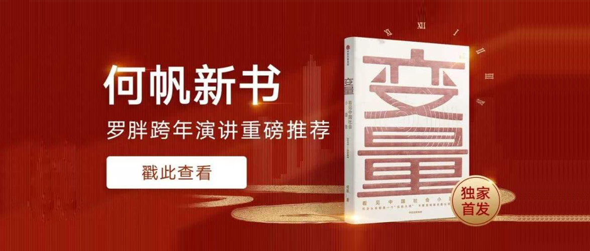

变量
==========================

> 罗辑思维在2019年的跨年晚会上，罗胖为何帆老师打Call的这本《变量》，是一本从第一年就开始写，并励志要写30年的书。
>
> 该书想要描述每一年发生在中国的社会变量，这些变量都是何帆老师认为，在未来回过头来，都是影响深远的变量。
>
> 何帆老师通过走访中国大街小巷的方式，深入了解那些具体的人和事，并以叙事的方式将它呈现出来，再对照到这些事件背后的底层原理，推导出这些影响中国社会的小趋势。
> 
> 虽然何帆老师是一名经济学家，但是这本书里并没有什么图表和太多的数字，更多的是从微观的视角切入去描述和推导。大多时候你看到的是一段段的故事，而道理也都在故事里。
>
> 也正因为如此，我在整理这篇笔记的时候，可能也没有很好地将何帆老师要表达的意思转述出来，如果你对内容感兴趣，可以购买原版来阅读。

作者：何帆

前言
--------------------------

这是一套会写30本的书，这是第一本，而且今年是第一年，它是一本历史书，但是它不是在回顾历史，而是边走边记录。

作者用前言部分把整本书要讲的内容简要概括了一遍，作者会用大树模式（后面会介绍）来看这段历史，从2018年作为一个时间的切入点，以2018年的历史事件作为突破口，切入中美贸易摩擦，找到问题的根源来自民粹主义。

然后再回来看中国这棵大树，决定大树是否能经得住风雨，主要看树干能不能扛得住，进而推出树干的组成部分是工业化、城市化和技术创新，这些都是慢变量，是日积月累的结果。在这些变量上再找到小趋势。而这些小趋势，未来都可能会成为燎原之火。

第一章 怎样观察一棵树
--------------------------

如果30年是一个代际，那么只要有100个人，每人只写30年，连起来就可以从孔子写到现代。作者希望用接下来的30年来完成这样一个使命。

大树模式是什么：一个国家，好比一棵树，有的部分是树干，有的部分是叶子，要回答这个国家对应的问题，就要经常回到树干来看一下，如果树干健康，那么叶子的问题就不是致命的问题。

2018年是一个焦虑的年份，很多事情变了，和以前不一样了，但它注定是一个新的起点。

快变量是那些日常掺杂着噪音的信息，它大多是表象，而真正影响巨大的是慢变量。比如电的发明是慢变量，电灯、洗衣机、冰箱甚至计算机都只是这个慢变量催生出来的快变量。中国经济中，工业化、城市化和技术创新是慢变量。

找到了慢变量，我们就能找到定力，但是找到了小趋势，我们才能看到信心。

按照美国未来学家马克·J.佩恩的定义，小趋势就是占人口1%的群体出现的变化。作者的小趋势略有不同，不限定于1%。小趋势不是凭空而来，它是大趋势演变后逐渐分化出来的。

在2018年，出现了5个新“变量”。

**第一个变量是大国博弈**，不能片面地看待中美贸易问题，这是两个互补的经济体，是因为时代变迁，人工智能这类的技术持续出现，引起了像美国国内的民粹主义极端化，先影响了内政，进而影响了外交，才导致的大国博弈的问题。两个国家因为所处的发展周期不同，所以两边的人民的心态也不一样，在中国，所有人都积极向上地认为一切都会越来越好，而美国的人民则因为在社会中越来越边缘化而产生焦虑。

> 美国的经济体制过于追求短期利益，过分追求股东利益，人数最多的普通民众难以参与这种资本主义体系。它的政治体制过于强调精英观点，过分信仰自由主义理念，人数最多的普通民众也难以表达自己的声音。这些内在的缺陷导致美国更难以应对人工智能社会的挑战，于是，被忽视和被排挤的力量会从所有能够释放的地方释放，哪怕是从极端主义的孔隙。

**第二个变量是技术赋能**，有些新技术在看起来离新技术最为遥远的领域找到了广阔的应用天地，并能通过为普通人赋能，将这种潜能进一步放大。比如无人机没有在制造业发光发热，却在新疆的农田上空得到了很好的应用。

这样的技术有两个重要的评判纬度：一是技术和市场的匹配程度，二是这些技术是如何为人赋能的。

**第三个变量是新旧融合**，一个小趋势是传统企业在学习新兴行业的打法，叠加互联网、人工智能等能力，而新兴行业也在向传统行业渗透，学习传统行业的经验和方法。

**第四个变量是自下而上**，一个小趋势是“多核城市”是城市群未来的发展方向；很多城市已经开始“收缩”，而保持了开放性的城市才能更好地实现“精神收缩”；很多城市正在爆发“颜值革命”，街道和社区正在变得更美、更有生活情趣。

**第五个变量是重建社群**，一个小趋势是，在某些地方，不管是在城市还是乡村，由于条件的变化和核心人物的推动，出现了一种“从云到雨”的趋势，原本松散的社群开始自发组织、自发生长。

第二章 在无人地带寻找无人机
--------------------------

大部分技术都是已有技术的混搭。在创业阶段，比技术更重要的是寻找应用场景。寻找应用场景有三个步骤：一是选择，二是适应，三是改造。

- 选择：无人机既可以做航拍、也可以做物流，但新疆广阔的农田也是一个非常好的机会。在少有人注意的边缘地带、交叉地带往往更容易找到新技术的应用场景。
- 适应：就是要到真实的场景中逐步迭代。在你找到应用场景之后，必须根据场景和需求调整技术。
- 改造：在无人地带，新技术能够充分发挥自己的先行优势，掌握更多的信息，为更多的普通人赋能，并进一步创造出新的需求，直至重建一个更生机勃勃的生态系统。

同样的例子也发生在了机器人领域，通过选择“酒店服务取送货”领域，通过不断适应复杂的真实环境迭代产品，最终不断改变机器人和周边其他产业的关系，进而才有了云迹科技的今天。

而2018年的一股新生力量拼多多，在中国已经进入红海的电商市场中杀出一片血路，但是作者并不看好这种模式，就像水稻和稗草的关系一样，拼多多就像稗草一样，不可能靠仿冒品长期占领市场。也许拼多多的未来要进行基因重写，回归拼好货的思路。

2018年，美国商务部对中兴的制裁让人们开始反思中国缺乏核心技术。那么未来是否一定要优先发展核心技术呢？答案其实是，未必。中国独有的工程师红利和市场红利，将决定了我们既可以通过群众路线不断试错，走出自己技术的迭代路线，同时我们拥有的市场红利可能是其他国家无法比拟的，就像是中国高铁、中国的老龄化规模，而这些都是我们应该优先发展应用技术的理由。

第三章 老兵不死
--------------------------

汽车制造是一个传统的行业，它不止是资本的堆积和用户体验的创新，更多依赖于流程化的可靠质量。新势力造成似乎成为了一个主流，但他们绕不开对传统行业的敬畏。等他们扎得越深，才可能越明白其中的难处。

海尔过去是一个传统的制造业，但现在是个创业的生态，张瑞敏将去海尔化作为海尔的新的工作思路，充分发挥每一个员工的主动性。现在的海尔已经不是大家以为的传统制造型企业，它是互联网化的。

现在的互联网巨头，正在成为下一代创新绕不过去的砍。

电竞产业即是一个新兴的产业，它同时也在不断向传统体育产业学习，不论是运作模式、职业化、赛事直播、产业思路，既是一个创新的过程，也是一个融合的过程。

旧的不一定是过时的，旧事物中同样蕴含着创新的基因：新的不一定是更好的，甚至新的并不一定是新的。创新不是简单地弃旧扬新，而是不断地回到传统，在旧事物中重新发现新思想。

2018年，新和旧之间的界限已经很难区分。

第四章 在菜市场遇见城市设计师
--------------------------

从菜市场的小贩，我们看到了城市自下而上的源动力。

城市化到底是自下而上更好还是自上而下更好？中国早期通过土地改革等政策，自上而下搞城市化，但是这几年，更多的城市化实际上是通过自下而上完成的。自下而上生长出来的城市更具多样性，抗风险能力更强。

东莞就是一个自下而上生长出来的城市，它的GDP已经远超过很多经济发达城市。这是一个没有中心的城市。

义乌，一个有大量靠出口生存的企业的地方，在中美贸易摩擦的大背景下，很多人以为义乌会由此受损，而实际情况则大相径庭。

义乌企业之所以能够具有如此强大的抗风险能力，一是因为义乌的企业更为务实，它们总是会把风险考虑进来。二是因为义乌的企业更重视分散风险。义乌的企业善于在市场的夹缝中求生存，通过强大的信息渠道相互交流、高效地试错。三是因为义乌的企业不求天，不求地，只靠自己。

中国未来的城市化必然会遇到收缩的问题，很多城市已经开始争夺不断减少的人口，要能够做到精明收缩，必须要保持足够的开放性，才能吸引更多的人。

自下而上，还体现在业态创新上，现在地咖啡吧不仅仅是卖咖啡的地方，也必须是一种不一样地生活方式，未来地年轻人因为更追求个性化，而需要被我们用心对待。做更有针对性的场景化的经营，才更有可能在未来的商业竞争中，赢得消费者地青睐。

中国的城市正在爆发一场“颜值革命”。城市正在从碳基城市转变为硅基城市。有了互联网，那些原本地段不好的地方，比如城中村、菜市场，反倒是减少了硬件上的劣势。而这些城中村、菜市场，其实正是人们自发形成的一种商业形态。

第五章 阿那亚和范家小学
--------------------------

从北戴河有一个叫阿那亚的小区，它是重建社群的代表，这里的业主们大多来自北京，他们择邻而居，在这里找到了自己的第二人生。当人们在这样自发选择的社群里生活的时候，更能表现出积极、和谐，而这也将是未来的一个趋势，特别是当人们选择度假房和养老房的时候尤为如此。

不止是阿那亚，在福建省泉州市的聚龙小区，业主的画像和阿那亚不一样，更多以老年人为主，这个社群虽然内容上更偏向老人，但是无疑也是重建社群的良好例子。

除了居住，在教育问题上，农村小学也一改大家的偏见。范家小学就是这样一个例子。

范家小学是个典型的留守儿童组成的小学，也正因为如此，这里的师生比更高（学生太少了），这里的师生关系更亲密，这里的学业目的性更弱，孩子们的身心也得到了更好的发展。在我们质疑留守儿童会成为社会遗留问题的时候，这样的例子无疑为我们反证了这一点。

高考已不是人们改变自己命运的唯一方式，甚至都不是最好的方式，大部分最后获得了成功的人，并不是因为自己是大学生，而是因为他们知道了怎么成为终身学习者。

重建社群和新的教育格局，必将是2018年一个值得注意的小趋势。