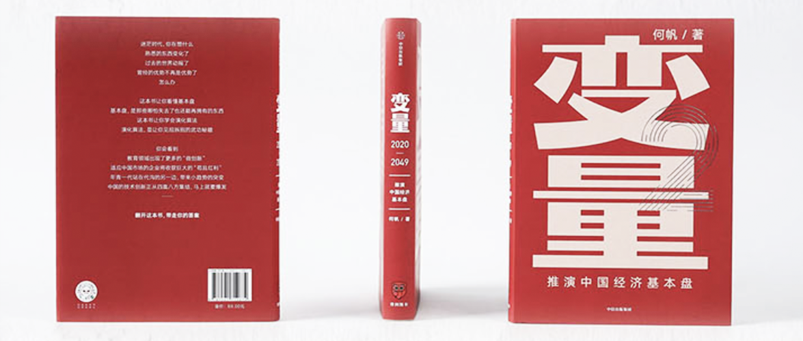

变量2
==========================

> 罗辑思维在2019年的跨年晚会上，引入了这套书的第一本《变量》，在2020年的跨年晚会上，又带来了《变量2》（当前这本）。

作者：何帆

前言
--------------------------

这册书的中心问题是：什么是中国经济的基本盘？

作者的方法论是：从演化算法解读中国经济的基本盘。

演化算法的5个重要招数：

- 试错：教育领域出现的微创新，避免了教育体制的继续僵化。今天的问题将会成为改变明天的真正动力。
- 突变：60后到80后，驱动力是“贫穷动力”，90后和00后的年轻人，驱动力是“嗨动力”，二者之间的突变也会给组织管理带来严峻的挑战。
- 适应：中国强大的生产能力和旺盛的消费能力缺少一个桥梁，中国最大的“苟且红利”，是指只要你比别人多付出一点努力，就会轻松地淘汰掉数不清的苟且者，从而赢得属于自己的市场机会。
- 协作：全球供应链已经从链变成了一张网，中国在全球供应链中的地位不仅没有下降，反而在提高。
- 混搭：混搭是这个时代技术创新的主题，也是中国最擅长的技术创新方式。

第一章 演化算法
--------------------------

### 生于2019年

一个2019年生孩子的中国年轻家长的观念，表达了他们眼中的育儿观念。他们可能不再是追求伟大梦想的一代人，他们可能更在乎孩子们作为一个个体是否会更快乐幸福的一代人。

### 调查过失业的失业者

一个名叫增永的年轻人，因工资太低，从事业单位辞职，先后去了e租宝、一家号称做智慧城市的企业、华夏幸福，工资水涨船高。但最终决定命运的不是你努力不努力，而是公司的钱够不够。

### 逃离委内瑞拉

一个国家由盛转衰，也许10年都用不了。宇通公司的委内瑞拉业务代表，荀春晖在别人的国度，见证了这一切。一旦危机到来的时候，富人还是富人，穷人还是穷人，只有中产阶级受到的影响最大。

### 好消息，坏消息

2018年的关键词是：恐慌；2019年的关键词是：迷茫；

但从“华为不倒，香港不乱”两件事看来，你会发现好消息有可能是坏消息，坏消息有可能是好消息。

而实际上，世界已发生了变化，而很多人还在用旧观点看待它。

### 乌镇模式

乌镇的东栅、西栅、南栅、北栅，各自不同的特点，是中国经济的一个缩影。规模效应很重要，而规模效应背后的“复杂红利”更重要。

### 演化算法

作者所观察到的中国经济的演化算法是这样的：在中国的经济发展到一定阶段之后，规模效应首先彰显，复杂红利随之发力，多种多样的小趋势纷至沓来，如同基因出现的突变。中国的市场辽阔纵深，为不同类型的小趋势提供了生存的机遇，同时，这又是一个急剧变化的市场，给各种小趋势提供了竞争的舞台。于是，那些最能适应中国国情的小趋势，会被选择机制放大，迅速地成长起来。最终，在中国的市场环境中，各种不同的物种形成了一个经济生态圈，它们互相协作、互相混搭、也互相竞争、互相抗衡。这使得中国经济变得更有活力、更具韧性。

借鉴生物学的思路，演化算法中存在两种重要的机制：

- 微观的抗争：个体依靠各种小的负反馈机制应对周遭的变化。活着，才能启动演化算法。
- 宏观的扩散：那些能够适应宏观变化的突变，优势会被放大。于是，突变带来继续突变，适者生存，而且适者会更加适应。这种正反馈的变化会决定演化的路径。

这套演化算法有5个重要的绝招：

- 试错：意义在于小的错误能够让我更快地逼近成功，大的错误会改变历史进程的方向。从长期看，凡事不可持续的，都不能持续。
- 突变：也就是小趋势，它为演化算法提供了丰富的素材。一个拥有复杂红利的大国，必然会出现更多的方方面面的突变。不一样的东西时时发生在我们的身边。
- 适应：更适者生存，当熊追上来的时候，你虽然跑不赢熊，但得跑赢你的同伴。
- 协作：你不可能独乐，而不与众乐。本地经济的多样性带来行业之间的协作，面对全球经济网络，我们还得参与全球协作。
- 混搭：新技术不过是已有旧技术的新组合，但只有大胆跨界、别出心裁的组合，才是真正的创新。

### 中国经济的基本盘

中国的优势并不单纯是过去我们说的规模大，而是规模复杂。复杂中蕴含着突变，突变就是小趋势。那些能够适应环境变化的小趋势，就会演化为未来的新物种。

本书会按照下面的题目去组织：

- 教育：试错的案例。教育的目标和观念都在发生改变，未来的20年可能会爆发一场教育革命
- 组织：突变的案例。年轻人的想法变了，那么很多“组织”关系也会发生改变
- 市场：适应的案例。你只需要消灭苟且者，就能获得很大的市场机会，这个“机会窗口”可能会很短暂，或许在5年之内。
- 生产：协作的案例。全球化的发展，从“互联网”到“互利网”到“互信网”。对国家而言，这意味着要更好地保护本国的经济生态系统，但对企业来讲，中国必须诞生一批真正的跨国公司。
- 技术：混搭的案例。中国的很多企业也将像丰田当年做的一样，重新定义制造业，重新定义互联网，甚至重新定义技术革命。

教育、组织、市场、生产、技术，分别讲的是小趋势背后的5种人——年轻人、接班人、沉默的大多数、隐形冠军和技术探路者，也分别对应演化算法中的5个案例——试错、突变、适应、协作、混搭。

我们要做的就是找准自己的生态位。一个生物在生态系统中能够利用的各种资源的总和，我们把它叫作“生态位的宽度”。

第二章 南墙效应
--------------------------

### 一所可以通宵打游戏的学校

和传统教育机构不同，在“[先锋学校](http://xianfengedu.org)”这个问题儿童汇集的学校里，与众不同才是大家的共同特点。这个学校的教学在于鼓励孩子们发挥自己的特长，并将所学知识作用于这些领域，在兴趣中达到教学的目的。美国作家亨利·梭罗在《瓦尔登湖》里写道：“如果一个人跟不上他的同伴，也许是因为他听到的是不同的鼓声。让他踏着他所听到的音乐拍子走吧，不管节奏如何，或是能走多远。”先让周围的世界安静下来，你才能听到自己内心的鼓声。

### 刘校长

刘校长说，先锋学校的办学理念来自于毛泽东。在中国革命实践的一个核心方法论：干起来再说。如果你去看中国的体制，一方面，你会发现有强调计划性、自上而下的传统；另一方面，你又能发现强调实干、基层创新的传统。如果看不到这一点，就无法理解中国历史中的辩证法：有的时候，我们看起来非常成功，但在成功中蕴含着危机；有的时候，我们看起来经历了惨痛的失败，但这些惨痛的失败可能蕴含着创新的基因，为未来的革命扫清障碍。

先锋学校的理念是：百分之百地信任每一个孩子。你要相信，他们每个人都会通过自己选择的路径，探索、尝试，或渐或顿，但最终一定能“自识本心，自见本性”。

### 黄宗羲教育改革定律

黄宗羲观察指出，历代税赋改革，每改革一次，税负就重一次，而且一次比一次重。

中国教育现在的问题也是如此，2014年就近入学的政策反倒成了房价上涨的原因之一。孩子们的课外时间也被占的满满的。所谓的教育体制缺陷，其实是全社会合力挖的一个大坑。教育被社会裹挟着前行。

### 百年职校

[百年职校](https://www.bnvs.cn)是一所公益性的职业技术学校，2005年由姚莉等一批各界爱心人士在北京发起创办。他们在挑选学生的时候，首先要看他们是不是真的来自贫困家庭，在那么多贫困孩子中，他们主要不是看成绩，而是看哪些孩子内心还有火焰。百年职校想的是如何把最普适的价值和做人的道理教给学生。

百年职校的英文名是BN，不是百年的拼音缩写，而是beacon（灯塔）的缩写。百年职校的校训是：教育照亮人生（Education lights the journey of life）。

### 为什么这一代父母如此焦虑

教育变成了一场军备竞赛，家长的看待就像看待投资，会觉得自己是孩子的“经纪人”，孩子的前途，取决于你今天给不给他报班、给他报什么班。教育投资组合的扩大，也会给你一种能获得巨大收益的幻觉，总是让你觉得，投入越多，回报越大。

即便你可能希望他能够活得快乐、自在，但受社会的裹挟，你也会不由自主地跟着大家做同样的事情。

社会的招聘体系也是幕后推手，存在着严重的文凭歧视：一定要应试者读的是211高校、985高校，甚至恨不得只招北大、清华的毕业生。

百年职校关心的是教育如何照亮人生。而我们的大学，甚至包括最精英的大学，关心的仍然是如何让学生学好专业知识。

反思教育，最大的挑战是老师，因为老师放不下身段，最大的障碍是家长，因为家长放不下执念。

### 汤敏的故事

汤敏是友成企业家扶贫基金会常务副理事长，同时被聘为国务院参事。

由他发起的乡村支教计划，先后发展出了多个版本：

1.0版本只是鼓励退休教师去支教。

2.0版本是和人大附中的刘彭芝校长合作的“双师计划”，先在人大附中录制课堂视频，再由乡村教师学习，然后由学生们一边看人大附中老师教学，再由乡村教师“助教”。

3.0版本看到了教师培训中对年轻教师的培训短板，开发了针对年轻教师的在线课程，增加乡村教师的存在感，教师们在线打卡学习相互交流建立社群，再通过“青椒计划”进一步学习专业课程，同时还联合社会资本设立奖金来鼓励学习。

从汤敏的故事我们可以看到教育改革的种种创新正在我们身边悄然发生。

### 南墙效应

现在的教育问题，一种最为直接的方法就是剑指应试教育，改革现有的教育体制。遗憾的是，这种办法的效果可能是最差的。

另一种办法是绕开应试教育，尝试其他的教育创新。我们已经看到了一系列发生在中国教育领域的创新：小而美的山村学校范家小学、特立独行的创新学校先锋学校、重视学生全面发展的百年职校、由点及面的“青椒计划”。它们都是微创新。

所谓不撞南墙不回头，应试教育模式也将如此。在没有碰到南墙之前，我们看不到教育改革的希望。只有当危机来临，才有可能置之死地而后生。这就是我们在历史中一次又一次看到的南墙效应：危机往往会成为改革的最大动力。

德国著名物理学家马克斯·普朗克在他的《科学自传》里写道：“新的科学真理与其说是靠说服反对者并使他们看到光明而获胜，莫不如说是因为反对者终于死去，而熟悉它的新一代成长了起来。”教育理念的转变也会遵循“普朗克规律”。应试教育的终结，不是因为曾经相信应试教育的父母改变了想法，而是因为不相信应试教育的新的一代终于长大了。

南墙效应和普朗克规律将同时发挥作用，于是我们可以做出一个预言：在未来的20年，中国将会爆发一场教育变革。

第三章 代际革命
--------------------------

### 穿女装的码农老板

阎晗，996.ICU的发起人，[Maskbook](http://www.maskbook.org)的创始人。

996.ICU的出现，代表了两代人的思想。在996事件出来后，马云、刘强东发表了自己的看法，也很多人觉得很有道理。但反对的声音并不小，这其实是“时代变了”的一种反应。最早出现996的时候，大家会感到兴奋，而现在996给人的感觉却是，要想保持速度，靠的却是加班。这导致边际激动效应递减：年轻人抱怨的不单单是加班时间长，他们抱怨的是工作变得越来越无聊。

### 杨超越编程大赛

杨超越编程大赛是一个以程序员网友自发组织的在Github上的编程比赛。很多人为此倾注了心血，为之熬夜。一没股权，二没奖金，三没提拔，只因为兴趣，大家找到了“意义”，他们为“有趣”的事情愿意全情投入，和996遭到抱怨形成了强烈的对比。

### 全村的希望

杨超越，1998年出生的一个农村孩子，父母离异，初中辍学打工。做过缝纫厂的女工、餐厅服务员、婚纱店店员。但她所代表的正是中国正在发生的一些社会变化。

这个社会可能会有两种主要的模式：

- 登山者模式：你可以通过自己的努力去改善生活，但是却很难做到阶级跃迁。无法改变命运或许能够博得不少人的同情，但也能让更多的人感到放心：这个世界的秩序没有被破坏，规则还是公平的。没有人加塞，没有人插队。排在我前面的还在我的前面，排在我后面的还在我的后面。在登山者的世界里，人们告诉杨超越，她应该在多年奋斗之后，平静地说一句：“我奋斗了这么多年，就是为了能平等地跟你喝一杯咖啡”
- 探险者模式：每个人在其中都能制定自己的规则，找到自己最舒服的活法。在这个世界里，实力的定义也完全不一样。实力不再是一种可以像勋章一样挂出来的东西，而是一种只有你自己才能暗自感受到的力量。这股力量只来自你的内心深处，你要使劲地挖，才能发现被埋藏起来的真实的自我。真实的自我是这个世界里最强大的实力：学会和真实的自我和解；学会从自我中抽离出来，站在一边欣赏自己；坦然地面对自己的人生。别人有别人的活法，我有我的活法。每个人都有自己的独立世界。能请你跟我一起喝咖啡吗？哦，对不起，我只喝奶茶。

杨超越代表了一种新时代的精神。

2019年暑期热档播放的一部动画片《哪吒》告诉你：“我命由我不由天。”

疲惫的人们、厌倦的人们、犹豫的人们、懊悔的人们、好奇的人们、逆反的人们、立志的人们、独立的人们，一队一队的人马，慢慢从登山者世界向荒凉的探险者世界迁移。离开舒适区的人们，在内心里渴望一种慰藉、一个偶像。

人们需要杨超越。

### 饭圈女孩

饭圈不是只有女孩，饭圈也没有囊括所有年轻人，它只是一类人。通过饭圈，是因为这是一个年轻人的小趋势。在这个小趋势中，我们发现了一些属于年轻人的特质，这些特质将会影响到中国社会未来的变化。饭圈女孩给我留下最深的三个印象是：

- 她们是具有强大组织能力的“行动派”；
- 她们是颠覆了爱豆与粉丝关系的“翻唱者”；
- 她们是生活在自己世界里的“部落人”。

一旦加入饭圈，就会发现每天有干不完的事情。饭圈的运营和互联网运营的思路很相似，大体上可以分为内容运营、用户运营和活动运营。内容运营会搜集各种资料，再进行宣传。用户运营，则需要组织粉丝们打榜、投票、“反黑”。活动运营则需要做线上线下的应援。

现在的饭圈和以前的追星已经不一样了，看似脑残，但实际上却是一个新物种。其实她们更在意的不是追星，而是自我表达。她们不是单纯的观众和听众，她们更像是一群借爱豆的酒杯，浇自己块垒的“翻唱者”

两个来自饭圈的术语，一个是“圈地自萌”，一个是“粉随爱豆”，前者是一群有着相似爱好的年轻人自己画地为界，形成一个小圈子，自己玩自己的。这个术语刻画了饭圈界的圈子化。后者讲的是爱豆什么样，粉丝就什么样。这个术语刻画了饭圈社群内部的同质化。

这些就是饭圈文化。

### 河两岸

面对2019年的香港动乱局势，倒是反映了一些时代线下。一开始几位艺人在网上支持了香港警察，遭到了香港青年的网络攻击，而这些无力的网络攻击，不小心触发了一股强大的民间力量。饭圈女孩最初只是为各自的爱豆撑腰，最后发现，还有一个最大的偶像，那就是自己的祖国。她们把中国称为“阿中哥哥”。

上一代人只是把自己当作祖国的打工仔，下一代人已经把自己视为“阿中哥哥”的投资人。

### 贫穷动力和嗨动力

虽然人们习惯于用10年来作为一个代际，但换个角度看，“90前”是一代人，“90后”是另一代人。之所以是90年成了坎儿。是因为2008年爆发了全球金融危机，这是世界经济的分水岭。出生于1990年的孩子，恰好在2008年完成了他们的“成人礼”。

90后和00后应该算是“衰退的一代”，他们虽然也坐上了车，但坐的是“慢车”。

为了理解这种代际差异，我先来介绍两个规律。

- 拉斯蒂涅规律：拉斯蒂涅是《[高老头](https://item.jd.com/12146685.html)》中的一个人物。他本是个很有野心的外省青年，到巴黎想学法律。他最初的人生规划是通过学法律出人头地。但最后在这个城市，受到大环境的影响，最后改变了自己的规划，转而改为勾引高老头的女儿。每一代的拉斯蒂涅，站在他人生的关键时刻，都会思考一个问题：我到底是靠自我拼搏，还是走别的道路呢？是跟这个世界同流合污，比如去“拼爹”、抱富人大腿，还是没爹可拼，走向跟社会对抗的道路呢？
- 钟摆规律：赫希曼在《[转变参与](https://item.jd.com/11704794.html)》这本书里说，一个社会像钟摆一样，在关心私人利益和关心公共行动这两极之间摆动。

由于有“拉斯蒂涅规律”，上一代人看到的是经济增长带来的个人成长机会，于是，相信每个人都能通过个人努力实现财富自由的人越来越多，而下一代人看到的是与经济增长结伴而来的收入不平等程度加剧，于是，相信每个人都能通过个人努力实现财富自由的人越来越少；由于有“钟摆规律”，上一代人更珍惜在社会稳定条件下努力赚钱的机会，于是，相信经济增长能够自动带来社会进步的人越来越多，而下一代人看到的是财富积累导致的社会僵化和庸俗化，于是，质疑经济增长能自动带来社会进步的人越来越多。

如果不了解这种代际差异，我们就总是会想拿着已经过期的船票去登下一趟渡轮。

### 接班人

从2019年开始，在今后的10年里，中国企业界将会经历一代企业家密集的退休。想退的，不想退的，总有一天都得退。说来有意思，那一代企业家，来的时候是争先恐后来的，散场的时候，又是成群结队离去。

接班人问题，是中国很多企业在未来10年将遇到的最大挑战。

接班人思维的背后，是父辈希望子女辈跟自己一样，于是按自己的标准来要求子女，这来自一种强烈的基因复制的冲动。子女一代则有一种被压抑的基因突变的冲动，这是复制和突变之间的冲突。

复制有什么不好呢？复制很快会导致退化。一个民族的退化，可能比我们想象的更快。日本的前车之鉴就呈现出年轻人失去欲望的现象。

在一次调研中，大部分二代都不愿意接班；愿意接班的二代更喜欢自己另起炉灶，干一些父辈不熟悉、插不上话的事情；二代最讨厌的职务就是总经理助理，他们不知道在这个位置上到底要干什么。

得到CEO脱不花一次跟二代代表团聊天，感觉这些孩子各个素质都很高，清一水儿的名校毕业生，又都很努力，不骄不躁，但总觉得他们缺点啥。缺的是啥呢？脱不花后来终于想明白了，他们缺的是应对真实世界的能力。

父辈没有教会他们，也舍不得叫他们的，是一种血性和杀气，是那种置之死地而后生的狠劲儿，是敢于反抗命运、敢于众叛亲离、敢于从零开始的勇气。伟大的创新始于颠覆，最终的传承来自回归的逆子。接班问题，考验的不是老年人的智慧和年轻人的胆量，相反，它考验的是老年人的胆量和年轻人的智慧。

第四章 苟且红利
--------------------------

### 莆田鞋

中国人怎么看莆田，就像外国人怎么看中国。

中国80%的民营医院掌握在莆田系手上。

莆田北高镇从事黄金珠宝首饰行业的生产经销商在全国各地超过2万家，其销售额占全国珠宝销售总额的1/3。

忠门镇是莆田最早做生意的，也是第一个富起来的镇，其木材生意遍布全世界，控制了国内90%的木材贸易。

莆田籍商人经营的加油站，占据全国民营加油站一半以上的份额。

莆田有2万名油画画师，油画产量占全球30%。

莆田系医院创始人不算传统医药世家后代，莆田的油画师不是美术专业出身，莆田本地不产黄金白银，不产木材，更不产石油。莆田所有的特色产业都是无中生有、裂变生长的。

莆田的假鞋让马云都为之头疼，莆田的假鞋不仅能以假乱真，甚至比被抄袭的大牌正品质量更好。但是鞋厂的老板也深知，莆田所拥有的能力，充其量也只能叫加工业，甚至只能称自己为鞋匠，制造和加工是两码事，制造要有研发能力，要有产品实现能力，要有产品保障能力，要有产品服务能力，而莆田系虽然也做鞋，但不具备这些要素。有了很好的质量为什么不做自己的品牌呢，莆田人也自知，品牌的核心能力其实是市场营销，而不是制造业，而他们不懂资本运作，也不可能做出真正意义上的品牌。

但是，虽然做鞋不难，但是把这样一件简单的事坚持做下去，就是不容易。

### 小镇之旅

中国的每一个小镇都在述说着自己的故事。

2019年，我向读者发出邀请：请你帮我寻找中国的特色小镇。结果收获颇多：

- 哈尔滨人重新发明了麻辣烫：杨国福麻辣烫
- 齐齐哈尔市拜泉县富强镇的县长提倡绿化，标语是：树是我爹
- 辽宁阜新，全国第一个资源枯竭城市，当地好又多超市，每天一个低价的引流品，把很多其他超市淘汰了
- 青海互助县大泉村8社，整个村庄只有一个小卖部
- 维尔康是个地方碳酸品牌，当地家喻户晓，到了外面的市场却默默无闻
- 三胖蛋瓜子在得到App商城有售，但是当地读者却闻所未闻
- 许昌的胖东来商贸公司，号称商业中的“海底捞”。
- ……

### 断裂的循环

中国有个现象令人费解，很多特色小镇都具备了世界级的生产能力，高端的商品大多都是“中国制造”，但是走在中国的大街小巷，人民的消费品却同质化严重，档次很低。中国人民有着强烈的消费欲望，然而却没有合适的商品可以满足。这是什么原因？

中国人民大学的刘向东解释：

- 中国的经营模式主要分为：沃尔玛模式和家乐福模式
- 沃尔玛早期来中国不是来卖货的，而是来寻找制造厂的，生产的产品主要是销往海外。中国有大量的制造厂生产的产品是销往海外的。沃尔玛的生产商不关心货卖给谁，产品生产出来，沃尔玛就照单全收。百货业也属于这种模式。
- 家乐福和沃尔玛不一样，它是来中国卖货的，家乐福仅作为渠道的角色存在，为生产商提供了卖货的机会，但不负责帮你卖，所以生产商不仅要承担风险，还要被压账期。购物中心属于这种模式，京东、天猫、苏宁、万达，也都是这种。

本来商业竞争的纬度是很多的，不仅有价格的竞争，还有品质的竞争、品位的竞争、体验感的竞争，但在电商的诱导下，如今的竞争只剩下一个纬度，那就是价格的竞争。

所以中国超级小镇的强大的生产能力，在很大程度上是为海外市场生产的，中国的出口增长无形中借助了国外的流通体系、金融体系的东风，所以才发展得如此迅猛。然而，生产成本不断上升，海外订单量不再增长、庞大的海外军团好像被困在敦刻尔克的盟军将士，想跨海回家，却无路可寻。做外销和内销的是两群不同的人，做外销的干不了内销，也干不了电商。你所看到的红红火火的国内消费，在很大程度上被误导为单一纬度的价格竞争。残酷的价格竞争导致生产商的利润薄如刀片，他们很难获得提高品质、研发创新的从容机会。于是，我们看到，中国辽阔的经济腹地就这样被分割成了两个平行宇宙。巨大的生产能力和巨大的消费潜力擦肩而过，一个朝左，一个朝右，相思终日，却无缘相遇。

### 假货终结者

拼多多早期的卖假货形象，导致拼多多上市后开始试图和假货划清界限自证清白。但作者认为，拼多多打架的初衷是好的，但方法不太对。目前采用的方法是消灭那些造假品牌，不给他们流量，惩罚，扶植新品牌等。

但是实际上假货在中国的三四线城市遍地可见，因为品牌商促达这些市场的成本很高，也给了假货一定的空间。

而拼多多则有机会占领这个市场。是将这些“假货”制造商纳入到体系里，很多三四线的消费者并不关心品牌，只关心质量，那些“造假”企业又有多少是为了造假而造假？与其把他们扼杀，不如让他们有机会接触到消费者。

拼多多可以做这件事的理由：

- 技术优势：可以利用大数据打击制假售假者。假的精准打击，优质的大力扶持。
- 时机：传统的营销模式投入大量的资源去打造品牌，而这个过程就会增加商品的最终售价，回归到三四线城市的消费者需求，可能要的无非是个高质量的商品，那么中间这些不必要的成本则可以省略掉了，拼多多可以对接这样的需求。
- 动机：拼多多更需要划清和假货的界限。

拼多多的真正使命不是打假，而是把自己打造成一个令人望而生畏的假货终结者。

### 苟且红利

得到App的胡雯说，每一个细节都关注到，就是苟且红利。苟且红利就是在别人觉得没必要的地方，坚决不吝惜地投入；在别人不那么认真的地方，多较劲一点。深想一步，认真一点，你就能享受到别人苟且为你带来的红利。

画个重点：苟且的反义词是有信仰地认真。

你可以认真地先问自己三个问题：

- 你是不是真的相信这个时代？
- 你是不是真的相信你自己？
- 你是不是真的相信你的用户？

在中国，那么多的苟且者，一开始就不学好，想着干一票走人，想抄别人现成的，想把用户当流量当韭菜，根本不想去体察消费者的真实需求。

你只要做事情讲本分，讲诚信，多数企业你不用跟它们竞争，它们自己慢慢就死了，这些企业中的多数都是被自己作死的。

### 回头浪子

沙集镇是个远近闻名的“淘宝村”，沙集镇政府为了减少污染、减少低价低质竞争，设立了集中喷涂中心，还给予了补贴，政府还自创“沙集镇”品牌，授权符合资质的企业使用，用政府信用为产品背书。这样的做法是否有效尚无定论，但一定要有人来扮演“修路者”的角色。

重要的不仅仅是方便的基础设施，也不仅仅是配套的资源支持，更是提供一个长期稳定的预期。经济增长依赖于长期投资，长期投资依赖于稳定预期。有了稳定的预期，创新的活力才会被激发出来，创业者们才不会退化为苟且者。

再回头来看莆田，是否也可以沿用这样的思路，把那些能够生产好质量的工厂，加入到新的时代呢？80年代的“千禧一代”更具有品牌忠诚度，更喜欢国际知名品牌，更愿意到固定的网站购物。他们喜欢富足、稳定，再带一点点扬扬自得的奢侈。比他们更年轻的一代，也就是90后和00后，对品牌和名气并不看重，他们看重的是产品的质量和产品的气质。气质这个东西很玄妙，说不清楚，而且多变。据调查，只有不到10%的95后会长期认准同一品牌的所有业务和全部商品。

如何为新一代消费者制造一个又一个的“国潮”呢？

第五章 互信网
--------------------------

### 越南故事

从宏观层面看，越南和中国2007年的经济水平差不多，所以很多人会问，现在去越南投资，是不是一个好时机。

但是从微观层面看，越南此时的基础设施发展水平和2007年的中国比，还差一截。越南人也没有中国人那么拼命，像中国这样的人才结构是几个东亚经济体才有的极为特殊的现象。中国人已经习惯了激烈的高考竞争，千军万马过独木桥，不考上大学好像一生就毁掉了。越南的年轻人对上大学没有太多的执念，上了大学的人也未必好好学习。

中国制造业不是对外迁移，而是对外扩散。现在的越南工厂，从中层到高层都少不了“中国干部”的身影，即便是在台资、日企、韩企也不例外。越南本地的供应商尚未形成完整的体系，外资企业到了越南，最方便的办法还是到中国去找供应商。

### 中国是怎么上船的

中美贸易摩擦，美国原本以为自己的对手是中国，但没想到，当真正摩擦产生的时候，遇到了一个比想象中强大的多的竞争对手，全球供应链。而中国在全球供应链中又有着举足轻重的作用。

中国是如何登上全球供应链这艘大船的呢，三个原因：

- 互联网技术的出现：在生产的过程中都会有劳动密集型的环节，这些生产环节就可以被外包到像中国这样的劳动力相对便宜的国家，这样一来，中国参与国际分工的机会就会变得无穷无尽。
- 地缘政治因素：美苏冷战结束后，美国对中国的态度是拉拢。中国加入了WTO，正式获得了参与全球经济分工的机会。
- 美国制造业的空心化：美国里根革命思潮，目标是股东利益最大化，这样的思想影响下，美国的企业开始产业剥离，美国的制造业就这样外流了。与此同时，制造业空心化，还损害了美国的技术创新。因为大部分创新都跟生产有关。最后，虽然美国企业在研发方面还有优势，但缺乏了制造商，美国的发明创新很难在本国实现大规模量产。

美国里根革命的思潮，给企业管理带来了冲击。企业的目标就是让股东利益最大化，用金融的思路做企业。比如制造业企业就得剥离“非核心资产”。说白了，就是把能卖掉的都卖掉，把能外包的都外包。因为这样一来，企业就变得“轻资产”了。也就是说，我同样还是赚这么多钱，但用的资产少了，财务报表就好看多了，公司的股票价格就会涨，股东们当然高兴了。

### 从链条到网络

从宏观看，中国在全球供应链中的地位，没有下降，反而在上升。

第一步是用贸易数据和人均GDP数据计算出产品的技术密集度。中国在中等难度的技术密集度产品上占比较高，低端制造业的占比在2008年就已趋于稳定。

第二步是看看中国和新兴经济体之间的竞争关系。中国在中等技术难度的产品出口规模上仍然高于EM10国的总和（南非、墨西哥、巴西、土耳其、泰国、越南、印度、印度尼西亚、马来西亚、菲律宾）。它们也很难在可预见的未来替代中国。但是中国与发达国家相比，未来中国制造业出口升级会面临越来越大的阻力。这又一次提醒我们，国内市场很重要。用高水平的产品跟发达国家抢夺国际市场，这条路会越走越难，但用高水平的产品满足国内需求，对中国制造业来说是一条康庄大道。

从微观角度看，以汽车这个制造业集成程度最高的行业来分析，虽然中国供应商在全球汽车企业的供应商清单中，但重要性却不高。中国还没有培养出一批能够在全球供应网络中扎根深、覆盖广的“核心节点企业”。因此，未来要想提升中国在全球供应网络中的地位，最重要的任务是培养一批真正的国际化大企业。

### 互信网

能够影响到全球供应链变化的三种新力量是：需求、技术和信任。

需求，正从过去的追求价格更低，向追求个性和品质，那么与之对应的供应链也就随之发生了重大变化。美国的市场特点适合连锁店和大批量生产，同质化程度高。日本的市场特点是产品追求极端精细化，有很多细分市场，小众产品，日本消费者对完全雷同的产品不感兴趣。中国市场则在二者之间，规模足够大，绝大部分产品都能达到量产的规模。区域化色彩浓厚，呈现出梯度分布的特点，这给很多特色产品提供了生存空间。

技术，材料科学、自动化等技术不断推陈出新，也让生产的过程和过去大不相同。而且未来的产品，不单纯是产品，而是产品+服务的样子，就像小米的产品，单说产品，并不一定是单品最优，但是把它们连起来，所提供的服务则让人体验更好，更省心舒适。过去我们学习的是如何发挥自己的特长加入一个分工体系，但未来，我们要同时在研发和制造上发力，只有这样，我们才能走得更远。

信任，未来的产品里面也包含了各国之间的信任，比如我卖给你的手机会不会用来收集信息等。全球化和中美关系正处于一个关键的十字路口。中美两国都在销售能够深入对方社会的技术，但双方还没有发展起足够的信任，无法放心地购买并安装使用这些重要的技术。

所以，最早的全球生产网络是互联网，是技术层面的，一旦实现了突破就不会出现倒退，接着是互利网，全球化是个经济问题，一旦建立在利益的基础上，就会把根扎得很深。唯独信任是反复变化、随风摇摆、境由心生的。信任是这个世界上最脆弱的东西，我们又该怎样把全球生产网络建立在如此脆弱的基础上呢？

### 万里长城建造时

一味的强调改革开放，那么各国的政策就会趋同，比如都会力争实行小政府、低税率、放松市场管制、私有化、降低关税、资本项目自由化、更灵活的劳工福利条例等政策。只要别的国家这么做，你就不得不跟着别的国家一起这样做，哪怕可能会对国内经济带来一定的冲击。

另一种选择就是暂时或部分地放弃经济全球化。全球生产网络已经变成了“互信网”，只有保持一定的信任，才能保证经济全球化不至于倒退。但是，由于各国内部的社会矛盾更加复杂，国与国之间的关系更加复杂，一味地强调对外开放反而可能进一步激化矛盾。越是在经济低迷时期，各国间的政府协调就越困难，能守住底线不出问题就已经很好了。没有坏消息就是好消息。经济全球化也需要一段时间的“休养生息”。

未来，政府应该做的不是更激进地对外开放，相反，国内政策的重要性高于国际政策。一个国家的政府总要更多地关注国内的和谐稳定，才能提高执政的合法性，而一个政府受民众支持的程度越高，它越能更好地引领人们去适应全球化带来的变化，不管是好的变化，还是坏的变化。

面对国内政策，有太多事情要解决了：

- 怎么应对即将到来的老龄化社会？
- 怎么解决“上学难、看病难”的问题？
- 怎么提高基础研究的水平？
- 怎么缩小贫富差距？
- 怎么提高社会流动性？
- 怎么跟年轻人对话？
- 怎么形成新的凝聚力？
- 怎么建立一种对话的机制、交流的机制、制衡的机制？

### 全球化绿洲

国际政治学家阿克塞尔罗德曾经做过一个实验，模拟人与人之间的交往，观察哪一个规则能够胜出。最终胜出的规则叫“一报还一报”，这是所有规则中最简单的一个。一报还一报规则：

- 我不会先背叛
- 别人背叛，我会反击
- 如果对方悔过，我会继续跟他合作

从这个实验得到一个启发，如果世界上绝大多数人都选择背叛，那么选择合作的人会吃亏。但是如果这些想要合作的人都选择“一报还一报”策略，团结在一起，在这群人的数量超过一个最低门槛之后，这个小群体之间产生的收益就足以抵消他们被外人欺骗的成本。也就是说，只要抱团取暖，就能度过寒冬。

在一片民粹主义的沙漠之中，依然存在着全球化的绿洲，而这些绿洲连点成线，就是新的丝绸之路。在这两年的调研中，隐约看到了一个新物种的出现，他们关心的是技术和创新会把人类带到什么样的未来，他们从来没有想过怎么回到过去的假想的“黄金时代”。

第六章 混搭时代
--------------------------

### 九又四分之三车站

九又四分之三车站，一个你只有相信，掌握微妙的平衡，才能找对的车站。搭上它，意味着享受到了中国的人口红利、市场规模红利以及曾经的全球化红利。

富士康、华为、中国航天业、中国航空业、优必选（机器人企业），都是找到了九又四分之三车站的企业。

### 卫星和火箭

2014年，国务院60号文件鼓励民营资本进入航天领域。2015年被称为中国商业航空元年，国内首颗商业卫星“吉林一号”成功发射，长光卫星、蓝箭航天、天仪研究院、零壹空间等企业先后成立并获得融资。

很多人从体制内到了体制外，机制变了，做事方式也变了，从做事方式到控制成本，从体制内供应商到整合民营供应商，航天业从来也没有得到美国的技术支持，所以贸易摩擦就是到了限制技术这个级别，也不会有太大影响。

### 一条长长的跑道

回顾中国航空业经历的浮沉，我们会发现，所有犯过的错其实都是宝贵的经验。我们通过试错，终于认识到最重要的东西，那就是：开发平台。

“开发平台”这个概念是北京大学路风教授提出来的。路风教授讲道，重要的不是你能生产出什么产品，也不是你有什么样的技术，而是在生产一种产品的过程中，一个企业能够获得的所有知识、经验和技能。这些知识、经验和技能不会自己离开企业，而是会跟随连续的产品开发和改进不断增长。这种无形而庞大的体系，就形成了企业技术能力赖以发展的“开发平台”。

经过大约10年的时间，中国的大飞机串起了长长的全球供应链。虽然很多供应商还是只能依靠进口，但是有了这样一个开发集成平台，中国的人才和企业慢慢就被聚集起来了。

### 我和2035年有个约会

每一个地方都有市场，但只有在中国，你才能有更多的机会去体验那种突然涨潮式的市场扩张。

[优必选](https://www.ubtrobot.com/cn/)就是一家这样的深圳公司。2015年11月，中央电视台找到了优必选，希望能够在春晚亮相，随着亮相成功，订单涨了30多倍。因为他在深圳，所以量产的风波很快就过去了。

为了吸引技术，优必选还引进了日本科学家[高桥智隆](http://www.robo-garage.com/)，他在日本独立完成了很多机器人项目，而且机器人也是日本的技术强项。但是高桥智隆很快加入了优必选，因为在日本造机器人多是靠企业资助，而且日本人做机器人更多是兴趣出发，产品小众，因此无法形成规模化，成本也降不下来。但是在中国就不一样，产品能够很快实现量产并且降低成本，规模的优势可以进一步巩固市场地位。

### 华为狼

华为为什么成功，这个问题可以有1000种答案。2019年如果从演化算法的角度去看，你会发现，决定华为成功的秘诀不是英明的战略，而是其强悍的组织能力和快速的反应能力。如果再总结一下，我们可以把华为的经验概括为：规模决定触角，触角决定反应速度。也就是说，在规模变得更大之后，华为的触角变得更多，所有这些触角都在探索市场上出现的各种微妙变化。一旦发现变化，华为就会迅速行动。这套打法能够克服很多大企业都有的僵化症。

在面对未来的不确定时，最好的办法不是妄加猜测，也不是坐等最终的结局，而是把你所有的雷达都打开，把你所有的触角都伸出去，把你所有能够想到的准备工作都做好，然后，等待未来的检验。假如你的运气还不算差，你会发现，总有一种努力，能让你抓住未来的机会。

再把这种思想提炼一下，其实只有8个字：

批量上传，等待爆款。

### 混搭时代

去了CES，看了华为5G，并没有特别让人觉得新奇的事情，这是怎么回事？因为新技术的应用场景还没有跟上，回顾历史，新技术革命最为相近的，莫过于工业革命。

工业革命的三个特征：

- 技术是个慢变量——所以不要着急，越是革命性的技术变革，等到其充分发挥潜力，需要的时间越长，工业革命平均需要25～30年。这是因为，越是重大的技术进步，需要改变的配套系统越多。
- 技术是个革命者——所以不要大意。越是早期，越多动荡。工业革命摧毁了传统社会的生活方式，进而带来了第一次世界大战、大萧条、第二次世界大战等大的动乱。
- 技术是个插线板——所以不要害羞，赶紧把自己的充电器插上去。不要去找看起来最酷最炫的技术，要找那些最终会变得很平庸、很无聊的技术。真正带来革命的技术最后都会变得很平庸。如果你不在新兴行业也不必担心，因为别人已经为你铺好了技术的路了，你要做的就是看看这些新技术怎么能够用到你的行业里。

总体看来，我们现在正处在两次技术革命中间的高原区，而在这个时期，技术创新的主题仍然是混搭。这是一个混搭的时代。

- 中国航天的故事，告诉我们体制内和体制外可以混搭
- 中国航空的故事，告诉我们国内技术和国际技术可以混搭
- 优必选的故事，告诉我们市场和科研可以混搭
- 华为的故事，告诉我们原来不同的力量是可以揉在一起的

### 丰田故事

流水线是美国福特发明的，但是却被丰田重新发明了一次。丰田基于自己的特点，提出把人和机器的优势充分结合起来的思路，从而实现了一次革命性的本土创新。

如果现在问中国企业做出了对世界经济影响最大的技术创新是什么，可能答不上来，但是也可能只是还没有被察觉罢了。

未来的历史学家或许会这样写：美国发明了互联网，但是中国重新定义了互联网；欧美科学家发明了人工智能，但中国重新定义了人工智能；国外的科学家发明了基因工程，但中国重新定义了基因工程。

未来已来，但我们很难意识到它们的存在。

第七章 结局就是开始
--------------------------

### 重返委内瑞拉

荀春晖又回到了委内瑞拉，如果有个时光机，回到1980年，那大概是中国最好的投资机会，而委内瑞拉或许就是当时的样子。

委内瑞拉适合养虾，利润比国际市场高一倍。还有铁矿，在委内瑞拉开矿的利润很高。

### 奋力游泳

增永后来又换了两次工作，他找了新的女朋友打算2019年底结婚，他想在重庆买房，不买房只怕是会更穷。他坚持锻炼，害怕身体一旦出问题，一切就都没有了。

### 十四亿分之一

登登，一个2019年出生在北京的孩子，在这座中国人拥有户口比北京人考上北京大学还要难的城市里诞生了。未来的路很长，她会见证这个国家的奇迹。
