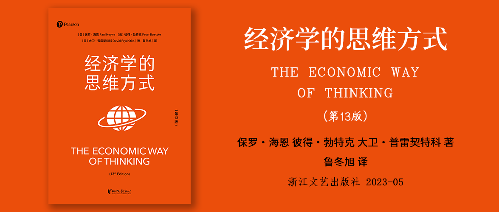

# 经济学的思维方式（第13版）

作者：保罗·海恩 彼得·勃特克 大卫·普雷契特科 著

译者：鲁冬旭

出版社：浙江文艺出版社

## 版权信息

## 致敬保罗·海恩

## 《经济学的思维方式》中文版推荐序

## 写在正文之前

## 少即是多

## 第13版的变化

## 致谢

## 关于作者

## 第1章 经济学的思维方式

### 学习目标01

### 1.1 认识秩序

### 1.2 社会协作的重要性

### 1.3 社会协作如何发生

### 1.4 思想的工具——经济学家有哪些技能

### 1.5 通过相互调整达成协作

### 1.6 信号

### 1.7 游戏规则

### 1.8 产权是一种游戏规则

### 1.9 经济理论的偏向性：是长处还是弱点

### 1.10 是偏见还是结论

### 1.11 经济学家的技能

### 简要回顾01

### 供讨论的问题01

## 第2章 效率、交换和比较优势

### 学习目标02

### 2.1 正商品和负商品

### 2.2 物质财富的迷思

### 2.3 贸易创造财富

### 2.4 值不值？效率和价值

### 2.5 认识取舍：对生产的机会成本进行比较

### 2.6 分工和交换带来的效益

### 2.7 为什么要进行专业分工

### 2.8 从个人贸易到国际贸易，再从国际贸易回到个人贸易

### 2.9 交易成本

### 2.10 降低交易成本的动机：中间人

### 2.11 中间人创造信息

### 2.12 市场是一种发现的过程

### 2.13 全景图：关于经济增长的初步思考

### 2.14 寻找一种解释

### 2.15 鼓励专业分工和交换的规则如何演进

### 简要回顾02

### 供讨论的问题02

## 第3章 无处不在的替代品：需求的概念

### 学习目标03

### 3.1 关于“需要”这个词

### 3.2 边际价值

### 3.3 分岔路口：日常选择是边际选择

### 3.4 需求曲线

### 3.5 需求法则

### 3.6 需求和需求量

### 3.7 需求本身也可以变化

### 3.8 所有东西都取决于其他东西

### 3.9 通货膨胀导致的误解

### 3.10 时间站在我们这边

### 3.11 需求的价格弹性

### 3.12 对弹性的思考

### 3.13 弹性和总收入

### 3.14 竖直需求曲线的迷思

### 3.15 需求应该扮演怎样的角色

### 3.16 金钱是唯一重要的因素吗？货币成本、其他成本和经济计算

### 简要回顾03

### 供讨论的问题03

## 第4章 成本与选择：供给的概念

### 学习目标04

### 4.1 回顾机会成本的概念

### 4.2 成本是行为的成本，而不是东西的成本

### 4.3 我现在该怎么做？“沉没成本”的无关性

### 4.4 生产者的成本是机会成本

### 4.5 边际机会成本

### 4.6 成本与供给

### 4.7 供给曲线

### 4.8 供给本身也可以变化

### 4.9 边际成本与平均成本

### 4.10 志愿兵役制度的成本

### 4.11 供给的价格弹性

### 4.12 用成本论证正当性

### 简要回顾04

### 供讨论的问题04

## 第5章 供给与需求：一种协调过程

### 学习目标05

### 5.1 市场是计划协调的过程

### 5.2 基本过程

### 5.3 竞争、合作与市场出清

### 5.4 市场情况的变化

### 5.5 从自由市场价格中获取信息

### 5.6 计划经济与知识问题

### 5.7 产权与制度

### 延伸思考：货币和利息的协调角色

### 简要回顾05

### 供讨论的问题05

## 第6章 意外之果：供给与需求的更多应用

### 学习目标06

### 6.1 灾难中的困惑

### 6.2 灾难中的协调

### 6.3 解决价格问题的冲动

### 6.4 价格锁定时的竞争

### 6.5 恰当的信号与不恰当的信号

### 6.6 想在城里找间公寓？去看讣告栏吧

### 6.7 烈酒和烈性毒品：犯罪的激励机制

### 6.8 脱脂奶、全脂奶和牛奶黑帮

### 6.9 价格下限与商品过剩

### 6.10 供给、需求和最低工资

### 6.11 国际奴隶交易死灰复燃

### 6.12 昂贵的体育，廉价的诗歌，谁之过

### 6.13 成本是否决定价格

### 6.14 “退学者”乐队发行了首张专辑

### 6.15 “山里有金子！”那又怎么样

### 6.16 连肉贩也没这个胆子

### 6.17 为什么换个便盆那么贵

### 延伸思考：正确表达经济学问题

### 简要回顾06

### 供讨论的问题06

## 第7章 利润与亏损

### 学习目标07

### 7.1 工资、租金和利息：通过合同事先规定的收入

### 7.2 利润：可正可负的收入

### 7.3 利润的计算：哪些因素应该纳入成本

### 7.4 经济利润与财会利润的比较

### 7.5 不确定性：利润的必要条件

### 7.6 企业家

### 7.7 企业家是获得余值的人

### 7.8 非营利机构

### 7.9 企业经营与市场过程

### 7.10 仅靠运气？

### 7.11 利润与亏损是协调的信号：货币计算扮演的角色

### 7.12 小心专家

### 延伸思考：期货市场上的投机行为

### 简要回顾07

### 供讨论的问题07

## 第8章 寻价

### 学习目标08

### 8.1 流行的定价理论

### 8.2 有请艾德·塞克登场

### 8.3 最大化净收入的基本法则

### 8.4 边际收入的概念

### 8.5 为什么边际收入低于价格

### 8.6 让边际收入等于边际成本

### 8.7 空座位怎么办

### 8.8 差异化定价者面临的两难境地

### 8.9 大学的寻价问题

### 8.10 一些差异化定价策略

### 8.11 艾德·塞克找到了出路

### 8.12 消费者的不满情绪和商家对差异化定价策略的合理化解释

### 8.13 午餐和晚餐的价格

### 8.14 重新考虑“成本加利润”的定价模型

### 简要回顾08

### 供讨论的问题08

## 第9章 竞争与政府政策

### 学习目标09

### 9.1 竞争是一个过程

### 9.2 竞争的压力

### 9.3 控制竞争

### 9.4 对竞争的限制

### 9.5 对关键资源的竞争：价值100万美元的出租车牌照

### 9.6 竞争与产权

### 9.7 政府政策的矛盾性

### 9.8 以低于成本的价格销售

### 9.9 什么是合理成本

### 9.10 “掠食者”与竞争

### 9.11 价格管控

### 9.12 “反托拉斯”政策

### 9.13 反托拉斯法的解释和应用

### 9.14 纵向兼并：促进竞争还是抑制竞争

### 9.15 各方意见

### 9.16 政策评估

### 简要回顾09

### 供讨论的问题09

## 第10章 外部效应与权利冲突

### 学习目标10

### 10.1 正的外部效应和负的外部效应

### 10.2 完美的情况不可能达到

### 10.3 协商

### 10.4 通过裁决（adjudication）降低外部效应

### 10.5 房主的抱怨

### 10.6 前例的重要性

### 10.7 剧烈变化导致的问题

### 10.8 通过立法（legislation）减少外部效应

### 10.9 成本最小化

### 10.10 另一种解决方案：对废气排放征税

### 10.11 污染许可证？

### 10.12 效率与公平

### 10.13 泡泡法

### 10.14 权利与污染造成的社会问题

### 10.15 交通堵塞是一个外部效应问题

### 简要回顾10

### 供讨论的问题10

## 第11章 市场与政府

### 学习目标11

### 11.1 私有还是公有

### 11.2 竞争与个人主义

### 11.3 经济理论与政府行为

### 11.4 强制的权力

### 11.5 政府究竟有没有必要存在

### 11.6 排除不付钱的人

### 11.7 “搭便车”问题

### 11.8 正的外部效应与“搭便车”的人

### 11.9 法律与秩序

### 11.10 国防

### 11.11 公路和学校

### 11.12 收入的再分配

### 11.13 对自愿交换进行管制

### 11.14 政府与公共利益

### 11.15 信息与民主政府

### 11.16 民选官员的利益

### 11.17 收益是集中的，成本却是分散的

### 11.18 正的外部效应与政府政策

### 11.19 人们如何界定公共利益

### 11.20 囚徒困境

### 11.21 政治制度的局限

### 简要回顾11

### 供讨论的问题11

## 第12章 收入分配

### 学习目标12

### 12.1 供给方和需求方

### 12.2 资本与人力资源

### 12.3 人力资本与投资

### 12.4 产权与收入

### 12.5 实际权利、法律权利和道德权利

### 12.6 预期与投资

### 12.7 是人还是机器

### 12.8 对生产性服务的派生需求

### 12.9 谁在与谁竞争

### 12.10 工会与竞争

### 12.11 贫困与收入不平等问题

### 12.12 为什么收入不平等问题在不断加剧

### 12.13 收入的再分配

### 12.14 改变规则和社会合作

### 简要回顾12

### 供讨论的问题12

## 第13章 衡量经济系统的总体表现

### 学习目标13

### 13.1 国内生产总值

### 13.2 GDP还是GNP

### 13.3 GDP是国内经济创造的总收入

### 13.4 GDP衡量的不是经济体中的所有购买支出

### 13.5 GDP是所有增加价值的总和

### 13.6 增加价值是否总是正数

### 13.7 尚未解答的零散问题：未售出的商品和二手商品

### 13.8 总量波动

### 13.9 失业和未就业

### 13.10 就业人口、未就业人口与失业人口

### 13.11 劳动力市场的决策

### 13.12 失业与经济危机

### 13.13 通货膨胀

### 13.14 1960年以来的经济危机与通货膨胀

### 13.15 哪些因素导致了总体经济表现的波动

### 延伸思考：国家收入统计的局限性

### 简要回顾13

### 供讨论的问题13

## 第14章 货币

### 学习目标14

### 14.1 货币的演化

### 14.2 法定货币（Fiat Money）的故事

### 14.3 今日货币的性质

### 14.4 究竟有多少钱在市面上流通

### 14.5 信用和信心

### 14.6 受管制的银行：法定准备金要求

### 14.7 存款扩张与货币创造

### 14.8 美联储的角色是监督者和规则执行者

### 14.9 美联储使用的工具

### 14.10 贴现率

### 14.11 公开市场操作

### 14.12 货币平衡

### 14.13 究竟谁说了算

### 延伸思考：那黄金呢？

### 简要回顾14

### 供讨论的问题14

## 第15章 经济表现和现实世界中的政治

### 学习目标15

### 15.1 大萧条

### 15.2 经济衰退期间究竟发生了什么

### 15.3 一堆错误的聚集

### 15.4 信贷与协作：自由市场上的储蓄与投资

### 15.5 信贷与协作失败：不可持续的经济繁荣

### 15.6 经济衰退是一种修正过程

### 15.7 货币政策在什么情况下有效

### 15.8 为财政政策辩护

### 15.9 掌握时机的必要性

### 15.10 联邦预算是一种政策工具

### 15.11 任期和政治

### 15.12 无限制的赤字

### 15.13 为什么赤字没有成为各级政府的普遍现象

### 15.14 自由裁量与规则

### 15.15 究竟由谁说了算

### 15.16 理解近期的经济情况

### 简要回顾15

### 供讨论的问题15

## 第16章 国家的财富：全球化与经济增长

### 学习目标16

### 16.1 哪些国家富裕，哪些国家贫穷

### 16.2 历史数据

### 16.3 经济增长的来源

### 16.4 外国投资

### 16.5 人力资本

### 16.6 石油来自我们的头脑

### 16.7 经济自由指数

### 16.8 私有产权在经济发展方面的力量

### 16.9 亚洲纪录

### 16.10 亚洲以外

### 16.11 对不同国家的GDP进行比较时面临的困难

### 16.12 全球化及人们对全球化的不满

### 16.13 民意的力量

### 16.14 特殊利益集团的力量

### 16.15 外包的争议：口号与分析

### 简要回顾16

### 供讨论的问题16

## 后记：经济学家知道什么

### 经济学以外

## 核心词汇
