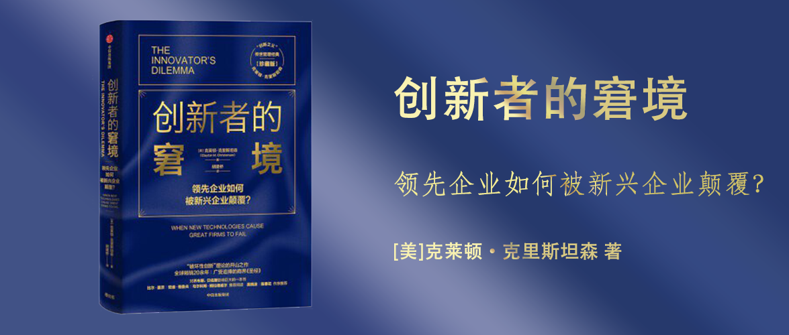

创新者的窘境
========================================

领先企业如何被新兴企业颠覆？

[美]克莱顿·克里斯坦森 著

胡建桥 译

推荐序 1 最先拿到“螃蟹”的企业不一定有机会吃下“螃蟹”
------------------------------------------------------

《创新者的窘境》第一次系统性地研究了大公司无法进行破坏性创新的原因：

1. 延续性技术与破坏性技术之间存在重大战略差异。
2. 技术进步的步伐可能会且经常会超出市场的实际需求，这就导致以市场需求为主导的科技创新型企业可能会错失潜在的新技术市场。
3. 拥有一整套管理模式的成熟企业为了融资，更在乎公司的资本结构和资本回报率是否能吸引投资者，上市企业尤其如此。

推荐序 2 企业如何应对破坏性创新技术的挑战
------------------------------------------------------

破坏性创新不意味着一定是新技术，也可以是旧技术的组合和细分市场中被忽视的需求或者创新的需求实现模式。

领先企业有一套流程来巩固它的成功，但这套流程和破坏性创新相违背。

企业能力的分析框架是：资源、流程、价值观。原有的流程会阻止资源在破坏性创新上的投入，流程背后反映的是价值观，原有的价值观和破坏性创新不一致，因此也无法推动破坏性创新。企业越优秀，价值观就越清晰，越难以进行破坏性创新。如果要靠“英雄人物”来力挽狂澜，也是很难成功的，因为他很难凭一己之力弥补组织的能力缺陷。

推动破坏性创新很难通过在现有组织内加大资源来实现，可能需要另立机构。

引言
------------------------------------------------------

失败的案例不胜枚举，所有失败案例都有一个共同点，那就是导致企业失败的决策恰好是领先企业在其被广泛誉为世界上最好的企业时做出的。经过研究，主要是因为他们成功之后做决策的方式最终埋下了它们日后失败的种子，即良好的管理正是导致领先企业马失前蹄的主因。准确地说，因为这些企业倾听了客户的意见，积极投资了新技术的研发，以期向客户提供更多、更好的产品。因为它们认真研究了市场趋势，并将资金系统性地分配给了能够带来最佳收益率的创新项目。最后，它们都丧失了其市场领先地位。

本书中的一些名词解释：

- 技术：一个组织将劳动力、资本、原材料和技术转化为价值更高的产品和服务的过程。包括工程、制造业、市场营销、投资和管理等。
- 创新：某项技术发生的变化。

首先构建一个失败理论框架：

1. 延续性技术与破坏性技术之间的价值主张不同，客户也就不同。
2. 市场需求轨道与技术改善轨道不同，导致技术进步的步伐要快于市场需求增长的速度，也就是只看市场需求可能你看不到破坏性技术的价值。
3. 从财务上看，大企业投资破坏性技术的早期产品通常利润低、市场小、没有优质客户。

管理者可以利用什么措施来利用和适应这些原则：

1. 企业的资源分布取决于客户和投资者：成熟企业的资金和人力无法适用于开拓小型新兴市场。
2. 小市场并不能满足大企业的增长需求：财务指标不匹配、资源分配流程不匹配。
3. 企业无法对并不存在的市场进行分析：缺乏对未知市场的调研分析，导致企业无法进行投入决策。
4. 机构的能力决定了它的局限性：机构的能力是它的流程和价值观，这一点是很难调整和改变的，再强的员工在这个原有企业的机构里也是无法改变创新失败的命运的。
5. 技术供应可能并不等同于市场需求：随着市场竞争加剧，成熟产品会努力提升性能，导致性能超出了主流用户的真实需求（用户的选择会从功能性→可靠性→便捷性→价格），当他们去追逐高端市场的时候，而破坏性技术的产品则可以乘虚而入占领低端市场。

第一部分 为什么优秀的大企业会失败？
------------------------------------------------------

第1章 从硬盘行业获得的启示
------------------------------------------------------

> 在商业史上，还没有哪个行业像硬盘行业那样，经历如此广泛、快速、残酷的技术变革和市场结构的转变，以及全球范围纵向整合方面的变化。

科技泥流假设（technology mudslide hypothesis）：企业在面对永无止境的科技变革时，就像在泥流上求生，它必须永远保持在泥流之上移动，稍一停顿下来，就会遭遇灭顶之灾。

硬盘行业的两种创新：

1. 延续性创新：对产品性能的改善幅度（总容量和磁录密度是最常见的两种指标），而且其性能改善的难度可划为一个从渐进到突破的范围。在研发和采用这些技术方面，硬盘行业的主流企业总是处于领先地位。
2. 破坏性创新：重新定义了性能改善模式，这常常导致行业领先企业走向失败。

从硬盘的发展史上看，在新技术的迭代和使用上，领先企业始终保持领先，并且没有掉队。但是随着尺寸不断缩小，硬盘的使用场景和主流客户类型在发生变化，从14英寸（大型计算机）→8英寸（微型计算机）→5.25英寸（台式个人计算机）→3.5英寸（便携式计算机）→2.5英寸（笔记本电脑）→1.8英寸（便携式心脏监护装置），每一次发生尺寸变化都迎合了新客户的需求而不是老客户，以3.5英寸向2.5英寸过渡的例子为例，这一次是没有发生破坏性创新的，原因是便携式计算机和笔记本电脑的客户并没有发生变化，2.5英寸能够满足的市场需求没有质变，只是在追求性能上的更优。

通过硬盘行业的创新史，可以总结3种创新模式：

1. 破坏性的技术：技术上较为简单、直接的破坏性创新，以一种独特的结构重新组合，使得它具备到别的领域去应用的能力。
2. 延续性的技术：硬盘产业开发先进技术的目的，总是延续产品性能改善的固有轨道，以实现更好的性能和更高的利润率。
3. 将破坏性的技术用在新的领域：通常由新兴企业领导。

第2章 价值网络决定创新驱动力
------------------------------------------------------

> 价值网络的概念（即一种大环境，企业正是在这种大环境下确定客户的需求，并对此采取应对措施，解决问题，征求客户的意见，应对竞争对手，并争取利润最大化的）是这一综合理论的核心。在价值网络内，每一家企业的竞争策略，特别是过去它对市场的选择，决定了它对新技术的经济价值的理解。

当技术变革破坏了企业以前培养的能力价值时，企业将会遭遇失败；当新技术提升了企业一直在发展的能力价值时，企业则会取得成功。如果企业的客户需要某种创新，领先企业就会利用各种资源和手段来开发和实施这一创新；反过来，如果企业的客户不想要或不需要某种创新，这些企业就会发现它们根本不可能将——哪怕是在技术上很简单的——创新应用到市场上。

总结希捷公司的3.5英寸硬盘的决策模式：

1. 破坏性技术首先由成熟企业研发成功：希捷公司的工程师早就研发出了3.5英寸硬盘。
2. 市场营销人员随后收集公司主要客户的反馈：客户不太关注尺寸变小，导致市场营销部门判断这项改进没有价值，财务人员反对推进这项成本高收益低的业务。
3. 成熟企业加快对延续性技术的研发补发：客户（小型计算机行业）关注的是容量、更好用的磁头、开发新型记录码等技术，并愿意为此付费，于是企业将重心放在这些延续性技术上。
4. 新企业已经出现，破坏性技术市场在反复尝试中逐渐成形：新的客户（微型计算机、台式计算机、便携式计算机行业）对3.5英寸硬盘有需求。
5. 新兴企业向高端市场转移：新兴企业改进产品的性能，并达到旧客户（小型计算机行业）的要求。
6. 成熟企业在维护客户基础方面棋慢一招：新兴企业已经在新一代产品的制造成本和设计经验上建立了不可逾越的优势，因此成熟企业很难再超越，而且可能会经受一场残酷的价格战。

使用价值网络理论来理解，就是旧市场和新市场是两套价值网络，价值网络反映了产品结构（Page 35-37），它有自己的产品部件和供应链。如何筛选这些特定的部件，依靠的是价值的衡量标准，按照产品部件不同属性的重要性由高到低来排序，不同的价值网络的产品的成本结构也不一样（Page 39-41）也就造成了不同的企业内部的资源分配方式，导致满足于旧市场的领先企业很难在现有组织机构下，直接满足新市场的产品需求。以硬盘市场为例，满足小型计算机和便携式计算机的硬盘行业就是两套价值网络，两类客户对于硬盘的需求不一样，前者看重的是容量、质量等属性，而后者首先要求尺寸小，在很长一段时间内，小型计算机市场的客户对“尺寸”不感兴趣，导致为其提供硬盘的供应商会将研发的重心放在改进容量和质量。直到新兴企业研发出了尺寸小巧的产品并推动了便携式计算机的发展。新兴企业会快速提升容量和质量方面的性能，直到达到“小型计算机市场”的需求，这时候在满足需要的情况下，尺寸小成了新产品的竞争优势。同时，新兴企业已经建立起了自己的护城河，旧企业很难追赶或超越。

第3章 挖掘机行业的破坏性技术
------------------------------------------------------

> 虽然在硬盘行业，破坏性技术从开始出现到侵入成熟市场只用了短短几年，但在挖掘机行业，液压挖掘机却花费了20年才成“燎原之势”。尽管如此，事实证明，在挖掘机行业，破坏性技术的侵蚀力量正像在硬盘行业一样具有决定性的影响，而且这股力量是难以抗拒的。

在挖掘机市场，技术所带来的颠覆比硬盘行业慢得多，花了20多年。一些延续性的技术，像蒸汽机→汽油机→电动机，并没有带来质变。而液压控制系统的出现，在早期的挖掘机客户（1-挖掘市场；2-较长的沟渠和下水道；3-露天采掘或采矿市场）那里并没有得到应用，因为最初的液压控制系统的性能达不到对应行业的要求，以至于新兴企业只能投向新客户（1-牵引车制造商；2-民用建筑承建商；），随着液压技术性能的不断提高最终超越了原有缆索技术。

个别缆索挖掘机制造商意识到液压技术的破坏性，并尝试将其应用到自身的产品改良中。但因为价值网络仍是旧的，因此新的破坏性技术并没有帮助到他们成功转型。

成熟企业致力于在成熟市场引入破坏性技术，而成功的新兴企业发现了一个看重这种技术的新市场。

我们发现，不管是面临延续性技术创新时取得成功的企业，还是面临破坏性技术变革时遭遇失败的企业，它们竟然都是良好的管理决策自然或合理发展的结果。实际上，这也是破坏性技术会使创新者陷入窘境的原因。更努力地工作，更聪明地管理，更积极地投资，更认真地听取客户的建议，这些都是应对新型延续性技术所带来的的问题的解决之道。但这些经营原则在应对破坏性技术时却完全失效，在很多情况下甚至还会产生相反的效果。

第4章 回不去的低端市场：来自小型钢铁厂的冲击
------------------------------------------------------

> 为什么领先企业总是能够很快进入高端市场，而进入低端市场却如此艰难？正如我们即将分析的那样，理性的管理者很少能找到充分的理由进入规模小、需求不明确且利润率更低的低端市场。

企业总是在追求更高的利润率，在一个价值网络里，他们总是在不断优化自己的成本，而服务于高端市场可以不断提高自己的利润率。因此对于这类的产品改进和成本优化方案总能获得更多的资源。

投入研发资源来推出利润率更高、性能更高的产品，不但能确保更高的收益率，还能让企业减少投入。因此，是理性的资源分配流程，导致了企业经常满足“东北角牵引力”的发展规律。

两种资源分配的方式，一种是自上而下，一种是自下而上。最终都会倾向于利润率更高，需求明确的迭代方向。

有三个因素一起对企业向下流动构成了巨大障碍：

1. 高端市场的利润率；
2. 企业的许多客户同时向高端市场移动的现象，削减成本进入低端市场并获取利润的难度；
3. 削减成本进入低端市场并获取利润的难度；

因此，在对新产品研发展开的内部辩论中，建议采用破坏性技术的提案总是会输给建议进入高端市场的提案。实际上，创造一种系统性方法来淘汰可能会降低利润率的新产品研发计划，是任何管理良好的企业最重要的成就之一。这一种向高端市场移动的理性模式，产生了一个重要的战略影响，它使得低端价值网络形成了竞争真空，吸引技术和成本结构与这个价值网络更加匹配的新兴企业参与竞争。

小型钢铁厂用废钢进行生产，综合性钢铁厂从铁矿石进行生产，前者投资小、后者投资大。小型钢铁厂从一开始只能满足螺纹钢市场的需求，而这对于综合性钢铁厂而言是客户忠诚度低、利润率低的市场，于是小型钢铁厂赢得了这个市场客户的信任，随着技术的不断提高，小型钢铁厂沿着钢条、棒材、角钢的市场进军，而综合性钢铁厂在每一次投资评估中，不断向利润率更高的市场“退守”，最终失去了各个市场。

第二部分 管理破坏性技术变革
------------------------------------------------------

在于破坏性技术竞争的铩羽而归的成功的企业是如何利用五大原则建立自己的优势的？

1. 它们在某个机构内设立项目来研发和推广破坏性技术，而这个机构所拥有的客户群正好需要这种技术。当管理者为破坏性创新找到“适宜的”客户时，客户的需求就能提高企业的盈利能力，这样创新项目也能得到其所需要的资源。
2. 它们在小型机构内设立项目来研发破坏性技术，而且这些机构的规模足够小，很容易满足于抓住小机遇和获得小收益。
3. 它们在为破坏性技术寻找市场的过程中，会利用一些节省成本的方式来降低失败率。它们的市场通常都会在不断的尝试、学习和再尝试过程中得以成形。
4. 它们会利用主流机构的一些资源来应对破坏性变革，但它们会对主流机构的流程和价值观避而远之。在价值观与成本结构主要针对当前破坏性变革的机构中，它们建立了一套不同的企业运作方式。
5. 它们在开展破坏性技术的商业化运作时发现，或者说是发展了重视这种破坏性产品的属性的新市场，而不是寻求技术突破，使破坏性产品能够作为一种延续性技术参与主流市场的竞争。

第5章 打破资源依赖理论
------------------------------------------------------

> 在面对客户明确说“不”的破坏性技术时，管理者该何去何从？一种选择是说服企业内的每一个人，无论如何都应该研发这种技术，因为它对企业的长远发展有着非常重要的战略意义；另一种选择是创建一个独立的机构，让这个机构直接面向确实需要这种技术的新兴客户群体。哪一种选择更加有效呢？

资源依赖理论，用近似适者生存的进化论，真正对哪些能做，哪些不能做有决定权的是企业的客户，而不是公司的高管。是客户决定了企业的资源。当一个机构的员工和系统满足客户和投资者的需求，给他们提供其所需要的产品、服务和利益时，这个机构才得以生存和发展。

在回答上面哪种方法更有效的问题上，选择第一种方法的管理者实际上是选择了与机构内的一股强大的趋势——实际控制企业投资模式的是客户，而不是管理者——进行对抗。与之相比，选择了第二种方法的管理者则顺应了这种趋势——选择利用而不是对抗这股力量。通过第二种方法取得成功的概率，要远远高于第一种方法。

计算机行业、零售业（传统零售→折扣零售）、打印机行业（激光→喷墨），这些行业的经典案例都证明了，试图在一个企业内部建立两种价值网络通常是徒劳，更有效的做法是成立两个公司面对两个价值网络提供服务。

第6章 让机构规模与市场规模匹配
------------------------------------------------------

> 增长导向型大型企业还必须面对小市场无法满足大机构的短期增长需求这一难题。所有由破坏性技术催生的市场在最开始时的规模都很小，领先企业在这些市场上接到的第一笔订单也都是小订单，培育了这些新兴市场的企业所建立的成本结构也必须能使企业以很小的规模实现盈利。

在延续性革命方面，充当追随者也能保持领先地位和竞争优势。在破坏性技术方面，率先进入这些新兴市场的企业将赢得巨大的回报，并建立明显的先发优势。

在技术投入上，会面对很多挑战：

1. 当前客户（原有价值网络里的客户）对破坏性技术不感兴趣，或者新技术暂时无法满足原有客户的性能要求。
2. 增长导向型企业，在原有的资源决策流程中，如何避免小市场无法满足大机构短期增长需求的难题（增长率不够将影响股价，但是新市场太小，对增长率帮助不大）。

针对破坏性技术对企业的增长率贡献不足的问题，有三种应对之策：

1. 试图改变新兴市场的增长率，使这个市场变得规模足够大，发展足够迅猛，能对大型企业的利润和收入增长轨道产生足够的影响。例如：苹果公司的Newton PDA产品，推出后对公司的收入仅贡献1%。
2. 等到市场已经出现，并且市场定位变得更加清晰，在市场“发展到一定规模”后再进入。例如：希捷硬盘发展到一定规模时再进入，以至于在3.5英寸硬盘市场上输给了康诺公司。最后3.5英寸硬盘虽然也生产出来了，但是并没有获得便携式计算机厂商的青睐，反而销售给了本来仅需要5.25英寸硬盘的台式计算机的老客户。
3. 将对破坏性技术进行商业化推广的职责交给规模足够小的机构，而且这些机构的表现从一开始就会受到破坏性业务的收入、利润和少量订单的重大影响。

**前两种方法存在很多问题**，第三种方法也有一些缺陷，但显然有更多证据表明这种方法更加行之有效。

**结论**：在对破坏性技术进行商业化推广时，身处破坏性技术变革中的管理者必须成为领先者，而不是追随者。要做到这一点，企业管理者就必须让与目标市场的规模匹配的商业机构来负责研发破坏性技术项目。

第7章 发现新市场：先行动再制定计划
------------------------------------------------------

第8章 如何评估机构的能力和缺陷
------------------------------------------------------

第9章 产品性能、市场需求和生命周期
------------------------------------------------------

第10章 假如让你负责电动汽车项目
------------------------------------------------------

第11章 本书观点回顾
------------------------------------------------------