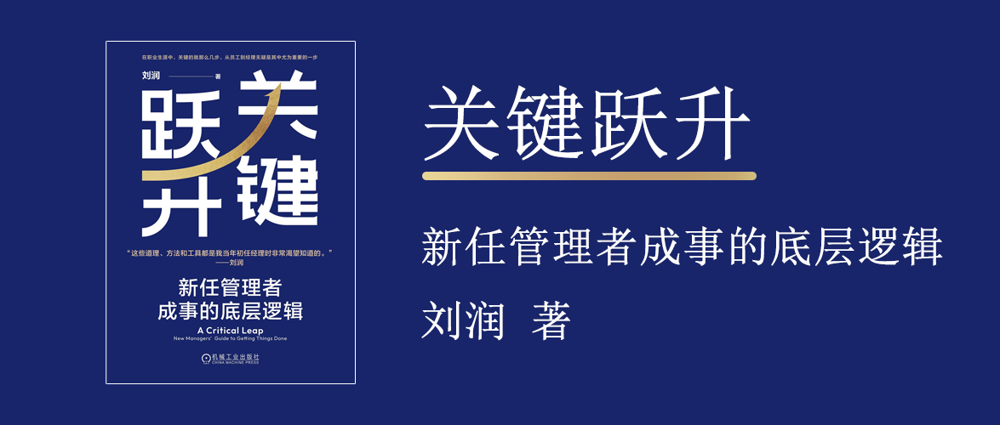

# 关键跃升

新任管理者成事的底层逻辑

刘润 著



## 序言

无

## 导论 为什么越“不干活”的人收入越高

管理者的价值，是用管理效率打败自然效率。

书名中的“关键跃升”是指从“个人贡献者”到“团队管理者”的跃升，是从自己独立作战到带领团队“突破自然效率”。

```
管理效率 = 动力（愿不愿干）×能力（会不会干）×沟通×协作
```

经理突破自然效率的底层逻辑，是通过优化流程，高效地连接更有动力、更有能力的人，以此创造最大的价值。

## 第1章 心法

## 第2章 动力

## 第3章 能力

## 第4章 沟通

## 第5章 协作
