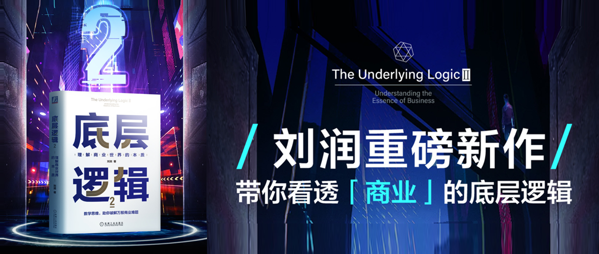
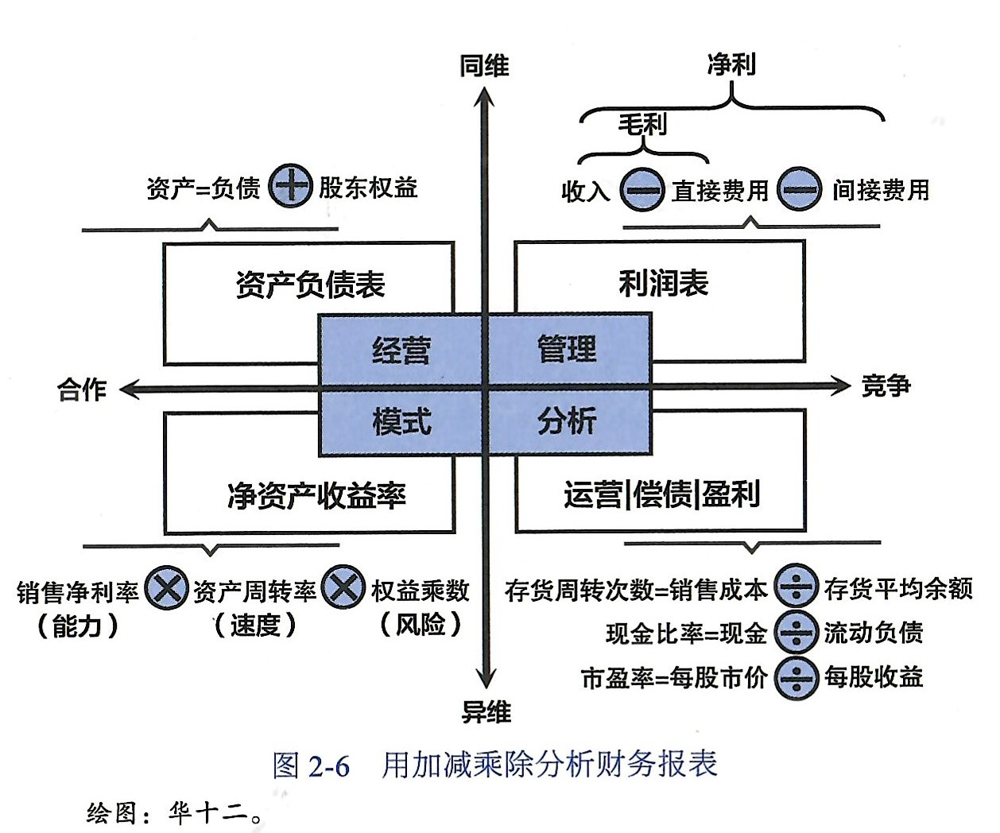

# 底层逻辑2

> 商业的世界看似纷繁复杂，但有其运行的自然规律，这些规律可以用数学来描述。我们熟知的大量商业概念背后都蕴含着数据原理，财务报表、投资融资、创业成败、产品质量、公司治理，这些背后都有其数学原理，掌握了这些本质才不会让我们在信息的洪流中迷失方向。

理解商业世界的本质

刘润 著

## 前言

数学是用来描述万物本质的语言，是理解这个世界的底层逻辑。只有从数学上理解了一件事情，你才真正从本质上理解了这件事情。数学，是一门不能被证伪的学科，是所有自然学科的终点。经济学的尽头，是数学；物理学的尽头，是数学；所有自然学科的尽头，都是数学。

## 第1章 为什么学好数学对洞察商业本质很重要

商业界对企业成功的基本共识是：永续经营。中国企业平均存活率在2.5年。

如果要分析创业的成功率，可以用“基础成功率”和“整体成功率”两个数学工具来测算。

基础成功率是指一次创业成功的概率，它始终在在0到100%之间。但是一次创业就成功的概率毕竟小。如果多次创业，每一次创业就有一个独立的基础成功率。如果任何一次创业成功就算是创业者创业成功的话，那么这个成功率就是整体成功率，也就是把1减去每一次失败的概率乘起来后的概率值。这个数学模型比较简单，如果再加上每一次创业者都能进行学习自我提升，那么每一次创业的基础成功率就会提升也就是说失败率会下降，那么它的整体成功率就会提高。

另一个概念叫均值回归，一个典型的案例是针对一个家族的每一代子孙的智商进行跟踪，发现了均值回归的规律。也就是聪明的老爸未必能生聪明的孩子。这件事映射到古代皇帝，为了能够长治久安，就要尽可能保证每一代的“基础成功率”高。但是因为均值回归的存在，要保持更高的成功率，就要提高“尝试次数”，也就是要“多生”，通过这样的方式，提高整体成功率。

小米的米聊和腾讯的微信，最终的胜利也来自腾讯的“赛马机制”。米聊先出的，腾讯感到压力，三个团队赛马，最终张小龙团队胜出，也正是因为这样的机制，才导致最终胜出的产品足够好。

数学是有趣且有用的。

1. 进制：如十进制来自于人们用十根手指计数；十二进制，则是人们用单只手除拇指以外的手指指节的数量，如生肖、星座；六十进制，则是左右手并用，一只手用十二进制，一只手用指头，也就是12×5=60，如时钟等。
2. 乘法：除了中国的九九乘法表，世界上还有很多其他的乘法方式，如俄罗斯农夫乘法、古埃及乘法，还有什么印度乘法、划线乘法等。九九乘法表的效率是比较高的，13世纪，“九九乘法口诀”传入西方国家。但是，汉语里1-9都是单音节，而英语里的1-9音节却有单有双，所以西方国家的人们很难用英语有韵律地背诵中国的“九九乘法口诀”。

## 第2章 四则运算：数字化最重要的是什么？数字

很多公司要引进数字化，但是却连最基本的财务报表和Excel都用不好，花重金引进数字化工具，大概率也是束之高阁。

商业世界的加减乘除：

1. 加法：同维合作，简单地把不同人的工作成果相加，就是加法思维。体育比赛中的四程接力（4×100米）就是典型的加法思维。公司里不同销售各自为公司赚取收入的过程，也是加法。
2. 乘法：异维合作，让不同分工的人协作创造价值，就是乘法思维。如果是加法思维，一个人的业绩翻倍，整体业绩不会翻倍，但是用乘法思维，一个人的业绩翻倍，则整体业绩也会翻倍。比如用公式：销售=流量×转化率×客单价×复购率，如果不同人负责不同的因子，那么如果其中一个环节效率增加了，则整体都会增加。
3. 减法：同维竞争，所有“分蛋糕”的问题，本质上都是同维竞争。比如分预算，大家都希望自己能够有更多的预算，最后预算的竞争就变成公司内部不同部门之间的竞争，或者说，是每条产品线的竞争对手，是同维的其他产品线。
4. 除法：异维竞争，要让不同维度的数字之间产生竞争，比如将预算问题的跨部门竞争调整成ROI（投资回报率）评价，每个产品的ROI都需要大于2，那么就比单纯地评价预算多少要科学合理了。

用加减乘除看财务报表：

1. 加法：资产负债表，`资产=负债+股东权益`，`资产（现金+存货+应收账款+固定资产）=负债（预收账款+应付账款+借款）+股东权益（自己权益+投资人权益）`。公司的运转从资产负债表上看，存在两个循环，一个是增值循环`现金→存货→应收账款`，一个是贬值循环`固定资产 不断贬值`。所谓经营，就是有策略地把资产分配在现金、存货、应收账款、固定资产这四个展开项上，让它们彼此之间进行最有效的配合，使增值循环远远大于贬值循环，从而赚钱。差值越大，循环越快，越赚钱。看资产负债表，先看看你向3个债主借了多少钱，再看看你向2个股东融了多少钱，再看看这些钱在4个资产篮子里的分配策略是否高效。
2. 减法：利润表，`毛利=收入-直接成本`，`净利=收入-直接成本-间接成本`。看利润表的第一个核心目的就是看毛利率。如果你的毛利（率）低于同行，而这不是你有意为之的短期战术、长期战略，你就要万分警惕了，要反思：是品牌价值不够吗？是产品品质不行吗？是成本控制不力吗？但是毛利不含公司各项管理费用的支出，这些间接成本反映在了净利里，所以看管理效率就要看净利。所谓有市场竞争力，就是毛利高；所谓管理有效率，就是净利高。
3. 乘法：净资产收益率（Return On Equity，ROE），这个指标是巴菲特投资时最看重的一个指标，他称之为“全能指标”。`净资产收益率=净利润/净资产×100%`。其中分母净资产是不需要考虑借来的钱的，因为分子净利润已经刨除掉借钱的利息了。用杜邦分析法，在这个公式的右边分子、分母同时乘以销售收入、总资产，就会得到一个全新的公式：`净资产收益率=(净利润/销售收入)×(销售收入/总资产)×(总资产/净资产)×100%`，这个公式和之前的公式是对等的，而三个括号里面的就是3个新的指标：`销售净利率=(净利润/销售收入)`，`资产周转率=(销售收入/总资产)`，`权益乘数=（总资产/净资产）`。
    - 提高销售净利率，靠能力提升：一个产品成本80，能卖100元，赚20元，销售净利率=20%，同样这个产品如果能卖200元，就能赚120元，销售净利润=60%，这中间的差值40%就是创造产品的能力差异。典型的公司像苹果、华为。——所以主要针对“产品部门”。
    - 提高资产周转率，靠速度提升：一个公司库存和渠道管理的不好，导致一个产品生产出来后1年卖出去，赚了20元，而另一个公司管理地好，一个产品生产出来一个月就卖出去，然后又生产了一个又一个月卖出去，一年卖出去12次，赚了20×12=240元。这中间的差异就是“速度”。——所以也主要针对“销售部门”。
    - 提高权益乘数，靠风险提升：假设能力和速度都保持一致，原本投资2亿元，现在新借债8亿变成10亿元用于投资，那么整体利润也将以5倍速度增长，但获得对应收入的同时风险也提升了。

    从本质上说，杜邦分析法是运用乘法法则把一个宏观的大问题拆成三个可操作性很强的微观小问题，然后逐个击破。
4. 除法：除法是用来给企业做“体检”的重要办法。除法表示具有异维竞争特性，非常适合用于给企业做“体检”。一家公司的能力可以简单分为三种：运营能力、偿债能力和盈利能力。
    1. 运营能力：是公司有效运作资产的能力。存货周转得快不快，客户欠款多不多，资金流转是否高效，体现的都是公司的运营能力。衡量运营能力，需要找到两个高度相关但维度不同的指标，让它们进行“异维竞争”。比如：
        - 存货周转次数=销售成本/存货平均余额。其中存货平均余额是指公司仓库里的货占用了多少资金、销售成本即不算利润的货值。让销售成本战胜存货平均余额。比如一年卖200万的货，库存的货是50万，也就是存货周转次数等于4。然后就要看这个值是否高于行业平均值。
        - 应收账款周转次数=销售收入/应收账款平均余额。
        - 流动资产周转次数=销售收入/流动资产平均余额。
        - 总资产周转次数=销售收入/总资产平均余额。
    2. 偿债能力：就是有一天债主突然要你还钱，你能不能偿还的能力。什么是债务？预收账款、应付账款、借款都是债务。因为这些债务都是随时产生、随时归还的，所以我们将其统称为“流动负债”。我们可以拿现金、应收账款、存货去还债，从左到右难度越来越大。用一些除法公司可以来衡量偿债能力，比如：
        - 短期偿债能力：
            - 现金比率=现金/流动负债，说明直接用现金偿债的能力。
            - 速动比率=(现金+应收账款)/流动负债，如果还需要抵押应收账款才能还债，就用这个公式。
            - 流动比率=(现金+应收账款+存货)/流动负债，如果还需要甩卖存货才能还债，就用这个公式。
        - 长期偿债能力：
            - 资产负债率=总负债额/资产总额。
            - 利息保障倍数=(税前利润+利息支出)/利息支出。
            - 权益乘数=资产/所有者权益。
    3. 盈利能力：是股东出1元钱，公司一年能帮他挣多少钱。我们可以从以下几个角度衡量一家公司的盈利能力，比如：
        - 净资产收益率=净利润/净资产平均余额。
        - 总资产收益率=净利润/总资产平均余额。
        - 每股收益=净利润/股数。
        - 市盈率=每股市价/每股收益。

通过这些不同的加减乘除，就可以看懂一家公司的经营情况。在创业的过程中，每天都面临大量的数字，如客户的购买数量、产品的销量、畅销的款式数量、App下载量、日活用户、私域的转介绍数量、内容点赞次数等。这些数字里面蕴藏着巨大的宝藏。

## 第3章 笛卡尔坐标系：思考维度越多，理解商业越深

笛卡尔坐标系，是笛卡尔卧病在家的时候，观察蜘蛛和空间关系所想出来的。笛卡尔开创了用代数方法研究几何问题的数学分支——解析几何。

笛卡尔坐标系（直角坐标系）到底了不起在哪里？了不起在它创建了一个重要的思维工具——维度。

### 我们应该招聘态度好的还是能力强的员工呢？

如果将二者视为一条线的两端，这就是一维视角，这二者不能兼得，只能妥协。但实际上这个问题的本质并不是一维的问题，而是二维的问题，态度好坏是一维，能力强弱是一维，把两个维度组合起来应该是个直角坐标系，而不是一条线的两端。因此在阿里巴巴，用明星、野狗、小白兔、土狗来区分能力强态度好、能力强态度差、能力差态度强、能力差态度差的员工。在招聘的时候，招到人的难易程度通常是土狗最多、小白兔次之、野狗更少、明星最难得。

大家都希望招到明星，但明星不但贵而且可遇不可求，除此之外，到底应该是把改善小白兔的能力，还是改善野狗的态度呢？如果仅在这个二维里面看是很难得出结论的，这时候就要引入一个新的维度“可塑性”，那么问题就变成了，到底能力可塑性强还是态度可塑性强？答案是能力，因为每个人的当前能力虽然不一样，但是天花板却差不多，只要态度好能力是可塑的。反之，态度是长期价值观的体现，几十年下来已经定型，可塑性比较差。因此在招聘的时候，我们除了明星之外更倾向于小白兔，在公司内建立好的人才培养体系，让他们从小白兔成长为明星。所以我们招聘的时候要用三维视角，不仅要招到今天的“明星”，更要招到未来的“明星”。

微软有句话，We hire attitudes，and train skills（我们招聘态度好的员工，然后培养他们的能力）。微软的成功，是在二维视角里招到了很多“明星”，同时，在三维视角里建立了强大的员工培养体系，把“小白兔”也训练成了“明星”。

### 如何评价公司是否赚钱呢？

可以用波士顿矩阵，把公司按照市场份额和增长潜力分成四个象限。

1. 现金牛（Cash Cows）：今天能赚钱的业务。市场份额大、增长潜力小。如微软Office、Google搜索，赚来的钱要投入到“问号”业务中，也就是用于“创新”。
2. 明星（Stars）：明天能赚钱的业务。市场份额大、增长潜力大。如亚马逊AWS业务，刚开始不赚钱，但是一旦赚钱就会变成现金牛，这样的业务要做“增长”。增长是指继续扩大明星业务的市场份额，增强业务的盈利能力，直到明星业务变成帮公司稳定赚钱的现金牛业务。
3. 问号（Question Marks）：市场份额小、增长潜力大。如谷歌的无人驾驶，能不能成还不可知，但是一旦做成，未来可期。如果它做成了就是明星，如果失败了就是瘦狗。
4. 瘦狗（Dogs）：市场份额小，增长潜力小。如微软的智能手机，当断即断，尽可能最大化它最后的收益，然后将其结束。

### 如何扩大自己的业务，增加自己的盈利呢？

这个是个复杂的问题，不能只从“赚不赚钱”这个单一维度进行思考，需要升级维度。比如可以用三个维度（案例是一家连接上门维修师傅和有需求客户的平台公司）：

1. 公司价值：财务上盈利。简单表达就是`毛利>运营成本`，拆细了就是`{[(工时费+配件费×毛利率)+其他毛利-员工成本]×复购率-流量成本}×客户数>运营成本`。
2. 员工价值：员工工资不比别的地方少。简单表达就是`员工收入≥机会成本`，拆细了就是`(工时费×工时费提成比例+配件利润×配件利润提成比例)×月单数≥机会成本`。
3. 客户价值：比别的地方维修便宜；比买新的便宜；觉得服务值某个价。三个维度：
    - `工时费+配件费<对手总价×70%`，体现你相对于竞争对手的优势。
    - `工时费+配件费<产品单价×30%`，体现维修相对于新购的优势。
    - `工时费<配件费×50%`，体现要解决用户根深蒂固不愿意为服务买单的心理账户问题。

设计上面这些公式的问题，就是升维的过程，那下面还原到具体问题中，就可以叫“降维执行”。先看所有的变量，哪些应该升，哪些应该降，再研究怎么升怎么降，这样原本无法讨论明白的问题，就可以展开到更具体的层面来进行思考。

### 五维思考，让你站得更高，看得更远

在商业世界，我们看待同一件事，有零维到五维六个视角。

1. 零维（战术维）：把当下做到极致，美好自然呈现。点是零维，它是孤立的，是与外在世界隔绝的。守着这一点，你将无处可去，也无处可退。你不知道机遇在哪里，也不知道风险会不会来，你只能守在这里。按照现代经济学的基本逻辑，分工带来了效率。分工才能专注，专注才能精益求精。而我们也把这些人叫做“匠人”，每个领域都有自己的匠人。但是如果只守着独门技艺，死守这个点，可能会错失这个时代。所以，作为一个“点”的你，心中必须要有一条线，然后沿着这条线前进。例如：高速公路上的收费员被自动收费取代，银行点钞员不再有用武之地。
2. 一维（战略维）：不要用战术的勤奋掩盖战略的懒惰。一维，在几何学上就是一条直线。线只有长度，没有宽度。战略是远方的目标，有了目标，脚下的“点”就可以和目标连成一条线。知道自己的目标，并找到一条“适合自己的路”，才有可能到达目标。
3. 二维（模式维）：商业模式就是利益相关者的交易结构（北大魏炜教授的定义）。二维，在几何学上就是一个面。面，有长度，有宽度，但是没有高度。在商业世界里，商业模式就是把所有一维战略都展示给你看的二维地图。所谓利益相关者，是指和企业的经营行为有联系的所有群体和个人，比如股东、员工、客户、供应商、竞争对手、监管部门等。所谓交易结构，是指这些利益相关者之间的联结关系，是商业价值从一个利益相关者流向另一个利益相关者的通路。商业模式就好比一张二维地图，上面展示了所有的一维战略路径，供你做出最优选择。这意味着，不懂商业模式的人，就算是战略高手，也很难制定出真正有效的战略。比如：早期的谷歌作为雅虎的搜索服务商，在雅虎背后提供搜索技术赚取服务费。后来它发现了在整个大地图上，雅虎不仅有用户，还有广告主，于是谷歌就开始思考如何直接在用户和广告主之间形成交易结构，于是后来谷歌就利用上下文广告的方式，直接在用户和搜索服务之间建立了联系。
4. 三维（创新维）：颠覆式创新让不可能成为可能。三维是个体，体有长度、有宽度、也有高度。商业世界一旦有了真正的颠覆式技术，传统商业模式就会被颠覆。跨境电商出现了，那些挡在跨境贸易之间的高墙就被打破，商品直达欧洲客户。无人机、区块链这些技术的出现都在改写商业模式。用旧地图找不到新大陆。能站在三维视角思考的人，才是真正拥抱创新的人。但是，这很难。昨天越成功，今天就越难突破。
5. 四维（时间维）：原因通常不在结果附近。今天华为的成功与辉煌，不在于它今天做了什么，而在于它10年前，20年前甚至30年前做了什么。研究商业世界，一定要懂得给万物加上时间维。一旦加上时间维，你就会看到隐藏在成败背后的各种周期，比如产品生命周期、企业生命周期、技术发展周期等。万物皆有周期。
6. 五维（概率维）：正确的事情，重复做。“永远向有结果的人学习，因为结果不会撒谎”，这句话到底错在哪里？错在它认为确定的行为会带来确定的结果。这当然是错的，甚至是“有毒”的。结果的正确并不能证明行为的正确。真正的高手，看到运气好的人不会羡慕，而是会坚持做大概率成功的事情。例如有两个罐子，A蓝球占80%，B蓝球占20%，在你前面一个人从B罐子里面拿出了一个蓝球，如果你想拿蓝球，应该是从A还是B中拿呢？如果你知道了前面的概率，你自然知道从A中拿，但是如果你只看别人成功就学别人，那你可能就会从B中拿。我们知道前面一个人能拿到蓝球，只是因为他运气好，去掉感情色彩，运气就是概率。真正的高手，都会站在概率维的视角看待万物。真正的高手，会研究行为，更会研究行为的概率。（`行为×概率=结果`）

## 第4章 指数和幂：在非线性世界获得成功的秘诀

指数是原因，幂是结果。如果才能获得指数增长：建立每一步之间的前后关联，从而把昨天的收获连本带利地变成今天的本金。前后关联是获得指数增长的数学基础。在商业世界中，每个人拥有的生产要素都不一样。在这些生产要素中，有些有天然的前后关联属性（小麦棋盘型），而另一些则没有（智商棋盘型）。

- 小麦棋盘型：借用国际象棋每一格都是上一格子麦粒数量的(1+100%)倍。
- 智商棋盘型：一个家族的智商无法从上一辈传递给下一辈。

古典增长理论，三个生产要素：劳动力、土地、资本。新增长理论，两个生产要素：科技、数据。

“三驾马车”，投资、消费、净出口，是GDP的统计口径，“五大要素”，是GDP的推动力量。

- 劳动力：前后关联性弱，劳动力的能力增长无法呈现指数特征，人的能力增长是有自身规律的。一个劳动者，想要靠劳动获得指数增长，几乎不可能。
- 土地：前后关联性弱，土地不可能永远增值，房租是由供需关系决定的。
- 资本：前后关联性强，通过复利的方式，每一年把投资收益再投入，是可以呈现指数特征的。
- 科技：前后关联性强，用亚马逊的飞轮效应来表示，就是`后一圈=前一圈×(1+新增用户%)`，商品越多、越便宜，用户就越多；用户越多，商品就越多、越便宜。贝佐斯的厉害不在于提出飞轮效应，因为规模大一直是商业世界的常识，而他的厉害在于通过互联网这个“棋盘”，它足够大（格子足够多），所以当它的飞轮越往后指数的结果就越大，传统的线下商业体，受服务人数的刚性限制，无法达到那么大的用户规模，因此很快就进入发展瓶颈期。
- 数据：前后关联性强，数据是科技的副产品，具有和科技一样的数学属性。数据越多，价值就越高。

资本、科技、数据带来了个人财富的指数增长，带来了全球经济的持续繁荣，但同时也带来了贫富差距的扩大。这几乎是必然的，因为指数增长的反面是幂律分布。

如果要在绘画和音乐之间二选一，该怎么选，可以看看这两个行业的数学差异。绘画行业趋向分散，符合正态分布（钟形），每个阶层的画家都能有自己的生存空间；音乐行业趋向集中，符合幂律分布（尖刀形），金字塔尖的明星可以赢者通吃，但是下层的可能赚不到钱。

### 社会效率和公平如何兼得

[罗纳德·哈里·科斯（Ronald Harry Coase）](https://en.wikipedia.org/wiki/Ronald_Coase)：资源，总会落到用的最好的人手里。

假设`价值=生产要素×使用效率`，那么社会总成本，应该是每个人所使用生产要素产生的价值总和，根据[排序不等式](https://baike.baidu.com/item/%E6%8E%92%E5%BA%8F%E4%B8%8D%E7%AD%89%E5%BC%8F/7775728)，只有`大数×大数+小数×小数`，才能使得社会总成本最大化，但这样大数×大数永远比小数×小数创造更多的价值，获得更多的财富，也就是越厉害的人越来越有钱，越一般的人越来越穷。但是为了维持社会稳定就不得不兼顾公平，但是如果直接将好的生产要素给了使用效率低的人，那么社会总成本就无法实现效率最优。因此为了解决这个问题，大部分国家选择了三次分配。

- 一次分配：将最好的生产要素给最能利用好他的人，让他创造更多的社会价值。第一次分配是生产要素的分配，一次分配负责效率。
- 二次分配：通过失业救济、再就业培训、减免低收入人群的税收、提供更多便宜的社会服务甚至现金补助等手段，把部分社会财富分给“小张”，以求一定程度上的公平。二次分配负责公平。
- 三次分配：就是在自愿的原则下，部分人以募集善款、捐赠、资助、义工等慈善与公益方式，把自己拥有的资源和财富分配给需要的人。这是对前两次分配的补充。

餐饮业和互联网页不同，即便用了互联网思维去改造餐饮业，餐饮业也很难像互联网一样一家独大，占据70%以上份额。以百胜中国为例，其年营收600亿已经是中国最大的餐饮上市公司，它借助资本的力量，也只占中国1.5%的市场份额。因为每一个具体的汉堡，需要具体的人将其生产、包装，换句话说，餐饮业的收入不是遵循幂律分布，而是遵循正态分布。餐饮业之所以会呈现正态分布，是因为其最重要的生产要素是劳动力，资本和科技只能发挥辅助价值。而劳动力的前后关联性很弱，所以，餐饮业的财富分配很均衡，谁也不可能赢家通吃。其实不只是餐饮业，整个服务业都是如此，比如理发、维修、美容、医疗等。对于所有服务业来说，最重要的生产要素都是劳动力，所以，这些行业里的财富分配都遵循正态分布。

理解了数学的指数和幂之后，你才会明白，“打打杀杀”都是小事；选择在哪里“打打杀杀”，才是大事。

正因为有这样的正态分布规律，才保证大部分行业都还能容纳下普通人。但如果一定想进入有指数增长特征的行业，站在幂律分布食物链的顶端，做点轰轰烈烈的事。那一个非常重要的建议：跨越奇点。

建议：

1. 找投资人：在指数分布的行业，在奇点之前的收益可能非常小，难以自给自足。
2. 找指数增长特征的行业：《[指数型组织](https://item.jd.com/11795228.html)》认为4~5年收入翻10倍的可以算作指数型组织，意味着年增长率在60%~80%，而且是连续的，这个增长只可能来自资本和科技，而不会是劳动力。劳动密集型行业，服务业就不能获得指数增长了吗？也可以，这时，你要做的关键一点是：把劳动力密集的部分交给别人去做，自己只做资本和科技的部分。
3. 耐心地等待奇点的到来：指数型企业的一个特征就是在奇点到来之前，增长特别慢，因此要有耐心，做时间的朋友，不要放弃。

## 第5章 方差与标准差：理解群体的差异性，管理更高效

平均是我们在日常生活和商业世界中经常使用的一个词。有时我们感觉平均是有意义的，有时我们又感觉“被平均”了，为什么？这是因为平均是描述群体共性的数学概念，但是，在这个非线性世界里，个体的差异是在太大了，因此，有时研究一个群体的差异比研究其共性更重要。比如，在贫富差距、员工收入结构、质量管理等经济和商业问题中，深刻理解群体的差异性比理解它们之间的共性重要得多，对指导企业经营也更有意义。深刻理解群体的差异性，并指导企业经营，你需要：方差和标准差。

- 方差，通过对原始数据与平均数的差异性，求平方（去掉负号）再平均（量化差异），得到一组数的差异性大小。
- 标准差，因为方差与原始数据的单位不一致（是原有单位的平方），所以引入标准差的概念，在单位一致的情况下，可以与原数据进行进一步的分析和计算。

管理，就是缩小该缩小的差异性。以坐地铁和开车为例，坐地铁时间的标准差小，而开车的标准差大，因此如果二者通常时间一致，但考虑到地铁标准差小，坐地铁的“质量”比开车高。

质量的本质就是标准差，所谓“质量”，就是标准差，而所谓“质量高”，就是标准差小。

下面这些都需要标准差越小越好：

- 产品质量：军用产品>商用产品>民用产品，标准差越小，品质越稳定，投入的成本也越高，因此价格也越高，但是质量也越好。
- 比赛型选手：能够稳定发挥的人，才可能成为比赛型选手。
- 靠谱的员工：员工的标准差是衡量是否靠谱的一个重要标准，这样的员工你才能把重要的事项委托给他。
- 好的老板：老板要有可预测性（Predictable），而不是一惊一乍的出奇制胜，因为好的老板，员工可以预测，奖惩分明，员工敢做决策，否则员工畏首畏尾，势必会影响公司运营。

提高质量只有一个办法，那就是持续改进。

标准差控制不住的原因，是因为大量的独立随机事件。标准差控制到什么程度才叫“好”呢？我们通常用DPPM（Defective Parts Per Million，百万不良数）来衡量标准差控制的好坏。很多全球最优秀的企业都把“[六西格玛](https://en.wikipedia.org/wiki/Six_Sigma)”当成自己的质量标准。这个标准大概是1亿个产品，不良品340个。六西格玛的管理核心是一套呗成为“[DMAIC](https://en.wikipedia.org/wiki/DMAIC)”的管理工具。要把影响标准差的独立的随机事件控制到这种程度，没有任何拿来就能用的方法，**只能发现一个独立的随机事件就消灭一个，做到持续改进**。

除了需要不断缩小标准差，在另一类事上，可能需要扩大该扩大的差异性。比如创造力，因为差异性≈创造力。在企业发展的不同阶段，也需要不同的差异性。

- 创业期：天马行空的员工扩大标准差
- 成熟期：靠谱的员工缩小标准差
- 转型期：天马行空的员工扩大标准差

企业在文化、知识结构、性别上要尽可能地扩大差异性，那么在薪酬上应该尽量缩小差异性还是扩大差异性呢？这个可以用基尼系数（用于衡量一个国家的贫富差距的）来衡量。之所以不用方差或者标准差，是因为它们无法比较两个差异性很大的组织之间的差异性。

基尼系数，可以用来衡量两家公司的差异性大小，它的好处在于，通过一系列的计算，用“数值差”来表示差异性，就转化成了用“比率差”来表示差异性。这个转化，抹平了除“内部相对差异性”之外的所有外部因素。公司内部工资的基尼系数既不是越大越好也不是越小越好。

- 低于0.2，表示指数等级极低（高度平均）；
- 0.2~0.3，表示指数等级低（比较平均）；
- 0.3~0.4，表示指数等级中（相对合理）；
- 0.4~0.6，表示指数等级高（差距较大）；
- 0.6以上，表示指数等级极高（差距悬殊）；

基尼系数太低，容易陷入“[死海效应](https://baike.baidu.com/item/%E6%AD%BB%E6%B5%B7%E6%95%88%E5%BA%94/19825342)”，太高容易产生内斗。

## 第6章 概率与统计：看清创业的真相，依然热爱创业

要用概率与统计看清创业的真相，就要彻底理解以下三个重要的概念：数学期望、大数定律和条件概率。

- 数学期望：每一种可能都真实存在构成两个平行世界。永远要选数学期望高的选项。同时永远不要选数学期望小于0的选项。
- 大数定律：平均收益率≈数学期望（随机变量序列的算术平均值，向各随机变量数学期望的算术平均值收敛），个体的不确定性→群体的确定性。
- 条件概率：筛选条件。

投资是一件符合大数定律的事情，一次两次的投资成功是偶然的，但长期的投资，是看投资原则的数学期望。顶尖的专业投资人之所以顶尖，是因为他独有的投资原则的数学期望比其他人高，同时他对大数定律的信仰比别人强。

条件概率就是改变概率的分母，骗子之所以听起来像骗子，就是为了在第一次电话诈骗的时候，将难骗的人过滤掉，这就是用到了条件概率的知识。

创业就是管理概率。创业者的概率游戏，投资者的统计游戏。

1. 天使轮投资：排除产品风险。用“能组建团队、做出产品”这样的条件，把10万名创业者筛选到只有1万名。
2. A轮投资：排除收入风险。用“创建收入模型成功率概率较大的团队”这样的条件，把1万名创业者筛选到只有1000名。收入能力是指明确谁会购买你的产品，为什么而付钱，付多少钱，有多少人付钱。
3. B轮融资：排除盈利风险。用“创建盈利模式成功率概率较大的团队”这样的条件，把1000名创业者筛选到只有100名。盈利能力是指在一个单点上验证你的模式最终是赚钱的。
4. C轮融资：排除运营风险。用“构建强大的运营能力成功概率较大的团队”这样的条件，对100名创业者进一步筛选。运营能力是指能把单点成功的商业模式扩张到线下的全国市场或线上的全网市场？你能管理迅速扩大的团队吗？
5. D轮投资：能走到D轮投资人面前的创业者，基本上已经是赢家了。D轮投资人大多是为上市做准备的投资银行等机构。经过规范化、股改、业绩冲刺，创业公司终于满足了上市的要求。

整个过程就是递进式投资的创业风险管理机制。这个机制的本质是每一轮投资人为下一轮排除风险，提高条件概率，并因此获益。

在这个过程中，投资人的策略就是“数学期望+大数定律”，这个策略用得好的投资人就是顶级投资人。而创业者在这个概率游戏中的策略，就是“贝叶斯改进”。

贝叶斯定理的公式：`P(A|B)=P(A)×P(B|A)/P(B)`（后验概率=先验概率×调整因子），可以用来改进策略。真正的高手每天都在用贝叶斯定理不断复盘、改进自己的流程，从而总结出那些“大概率会带来成功的事情”，也就是“正确的事情”，然后通过重复做这些正确的事情，在ABCD轮的每一轮竞争中战胜竞争对手，获得下一轮融资，最终赢得巨大成功。这就是“正确的事情，重复做”。

讲完概率这个针对个体、用来衡量一件事情将要发生的可能的概念，我们还必须讲讲统计这个针对群体、用来计量一群样本满足条件的比率的概念。

三个关于统计的谬误：

1. 基本比率谬误：以谷歌是否垄断的裁断为例，谷歌的广告营收究竟占搜索引擎广告市场份额、还是互联网广告市场份额、还是整体广告市场份额，将导致谷歌市场占用率有巨大的不同。
2. 辛普森悖论：辛普森悖论和田忌赛马的数学本质是一样的，一个好的分组策略，可以在整体统计数据处于劣势的情况下，让部分的统计优势得以保留。
3. 幸存者偏见：一些不幸未留下来的样本丢失之后，导致仅基于幸存者进行的统计容易以偏概全，正如我们向成功的企业家学习，但我们只问了成功的企业家，他们可能会说自己是靠坚持才成功的，但是如果你去采访那些失败的企业家，会发现他们也很坚持，因此坚持本身可能并不是成功的秘诀，而成功的秘诀可能在于对“坚持什么”的选择。

## 第7章 博弈论：找到“最优解”，成为最后的赢家

在之前的章节，我们的假设的交易对手，都是客观的，可以被量化的，或者是目前尚未可知但一定按照确定的方式运行的规律（即使是概率）。但是真实的市场，可能还存在博弈对手，会导致你的决策结果大不同。

博弈论是个数学问题，要理解博弈论，你首先要理解三个概念：收益矩阵、占优策略、纳什均衡。

- 收益矩阵：又称支付矩阵、报酬矩阵、赢得矩阵、得益矩阵，其中都有“矩阵”二字。因为一旦决策者从单人变为至少双人，决策就从一堆的得失问题变为二维的利害关系问题了。石头剪刀布就是一个博弈，参与双方的收益就在收益矩阵中，没有人能稳赢，双方互相在猜。每个用语文来描述的游戏规则翻译成数学语言，都是一个收益矩阵。在这个收益矩阵里，决策双方都在研究如何扩大自己的赢面，最好让自己稳赢。
- 占优策略：又称优势策略、支配性策略，它指的是这样一种策略：如果你采取行动，我会占据优势；如果你不采取行动，我也会占据优势；无论如何，两次我都能占据优势。
- 纳什均衡：就是一种博弈的“稳定结果”，谁单方面改变策略，谁就会受到损失。纳什均衡是一个最稳定的状态，但不一定是好的状态。稳定在好的状态上的纳什均衡，是“好的纳什均衡”；稳定在不好的状态上的纳什均衡，是“坏的纳什均衡”。“好的纳什均衡”一旦出现，就非常稳定。只要你不“作死”，数学的力量会让你的生意越来越好。

### 智猪博弈：“搭便车”策略

从智猪博弈中学到，“搭便车”是小猪的策略，对小公司来说，等大公司教育好市场后“搭便车”是最佳策略；而对大公司来说，在一个小公司都想搭便车领域里，只好选择“还是我来吧”。早期小米想要做智能手表，但是它没做，直到等到苹果教育完市场之后，再推出自己的智能手环，反而卖到了“全球第一”。如果小公司执意要去“拉杆”，大公司则求之不得守在“槽边”，等小猪真的教育了市场，并且真的“掉食物”了，迅速推出自己的产品，抢夺胜利的果实。

但小公司并非只能搭便车，如果要这么做，你进入的领域最好是大公司“跑不到的地方”。比如巴奴和海底捞的竞争中，巴奴的广告语：服务不过度，样样都讲究。海底捞无法“弱化”服务的价值，这就是它“跑不到的地方”。不仅是大公司和小公司之间有智猪博弈，在优秀员工和落后员工之间也有，落后员工搭了优秀员工的便车，这样的现象如果持续发生可能会导致优秀员工的离开。

### 胆小鬼博弈：怎么才能让对方相信我比他先疯

在胆小鬼博弈里，没有纳什均衡也没有占优策略，在这种博弈中，一种是退让，一种是死磕。在这种情况下，整体最优的方法只能各让一步，否则将是双输。

### 金球游戏：承诺、信任以及贪婪的终极考验

金球游戏中，两个人都选全拿，将一无所获，如果只有一个人选全拿，那么他将拿走全部奖金，而如果都选择平分，则各拿一半。在真实的案例中，A将自己会“全拿”的选项说出来给对方，并确保自己在拿到全部奖金后能够分一半，也就是等效于双方都拿“平分”。B不得不做出了“平分”的决定，而不是选择“全拿”导致两手空空。最后在揭晓答案的时候，双方都是“平分”。A的策略是“明牌：全拿，暗牌：平分”，也就是逼迫B不敢出“全拿”。

这个游戏告诉我们，我们无法假设对方是好人还是坏人，人性是经不起考验的，而与“坏人”打交道的最佳方式就是把他逼至墙角，让他为了自己的利益做出你想要的选择。

## 附录A 对话吴军：每个人都要有数学思维

五种数学思维：

1. 从不确定性中寻找确定性：正确的事情重复做，只有重复做，才能累积成功的概率，20%的成功率做14次，就可以达到95%的整体成功率。
2. 用动态的眼光看问题：用微积分的思想来看人生的发展，今天你努力了你学习了不一定立刻就能进步，但是累积到一定的程度就会量变产生质变。
3. 公理体系：欧氏几何和罗巴切夫斯基几何，有两个不同的公理体系，因此得出了完全不同的定理。公司也一样，愿景、使命、价值观不同会导致每家公司的行事风格也完全不同。很多公司的老板一直在做决策，是因为没有建立起好的公理和定理。公理没有对错，不需要被证明，公理是一种选择，是一种共识，是一种基准原则。
4. 数字的方向性：在代数里，一开始我们学习了整数，数看起来是离散的，后来学习了分数，数开始出现了连续性，后来学习了无理数，发现无限不循环小数，在现实生活中，我们必须要承认，世界是复杂的，就像无理数，你无法定义它拆解它，你只需要接受它。后来学习了向量，我们发现了数是有方向的。两个有能力的人如果在一起，同方向会形成合力，反方向会形成互斥，与其让他们一起使劲，不如让他们分开做事。如果你也不知道一件事应该往哪里使劲，就让不同方向有能力的人都来试试吧。
5. 全局最优和达成共赢：在博弈论里，你需要和别人进行博弈，要记住你要的是全局最优而不是局部最优，因此你需要在一些关键决策上达到妥协。除了零和博弈以外，还存在非零和博弈，非零和博弈需要的是大家之间的信任，信任很难建立，有两个建议：一个是要找到那些能够建立信任的伙伴。一个是要主动释放值得信任的信号。

## 附录B 五道微软面试题

1. 有三个连续的、大于6的整数，一直其中两个是质数，求证第三个数能被6整除。

    考点：分解问题的能力。因为6=2×3，既然最后第三个数能被6整除，那么它一定能被2和3整除。而任意连续两个数，总有一个被2整除，任意连续三个数，总有一个被3整除，而前面两个数又是质子，也就是能只被自身和1整除，因为是大于6的整数，因此又不能是2、3。那么2和3必然就会落在第三个数上。

2. 有两个骰子，每一个骰子都是六面正方体，每一面上只能放0-9中的一个数字，这两个骰子如何组合才能达到显示日历的效果（从01~31）？

    考点：跨越思维。两个骰子12个面，0-9有10个数，也就是有2个数需要重复，因为日期中有11和12，因此，1和2需要在两个骰子上都有。但是因为其中一个立方体仅有部分数字，因此当要表达01~09的时候，就需要有0来补位，比如0和5在同一骰子上，要表示05的时候，0就也需要出现在另一个骰子上。那么把谁换下来呢，关键点就是6和9在数字上表达，是可以颠倒的，因此，这个两个数可以仅占用一个。

3. 昨天，我从早上8点开始爬山，晚上8点到达山顶。睡了一觉后，今天，我从早上8点开始从山顶原路下山，晚上8点到达山脚。请问，有没有一个时刻，昨天的我和今天的我站在同样的位置？

    考点：转换思维。简单的做法就是假设上山和下山是两个人，两人同时开始走，总有会碰面的时候。复杂的做法就是建立一个二维坐标系，x轴是时间，y轴是海拔，一条曲线是从左下角到右上角，一条曲线是从右下角到左下角，二者总能相交。

4. 上海有多少辆自行车？

    考点：系统思维。这个问题没有标准答案，两个可供参考的思路，一个是通过人口、街道数等进行估算。另一个是通过随机上街找自行车并基于挂牌号取中位数。也许还有很多办法，而且这两种思路并不完美，但是需要的是分析的过程。

5. 如何用两个指针来判断一个链表是否有环？

    考点：相对思维。让两个指针，一个是1倍速，一个是2倍速，走同样的链表，这样如果有环，那么2倍速的一定会赶上1倍速的。
