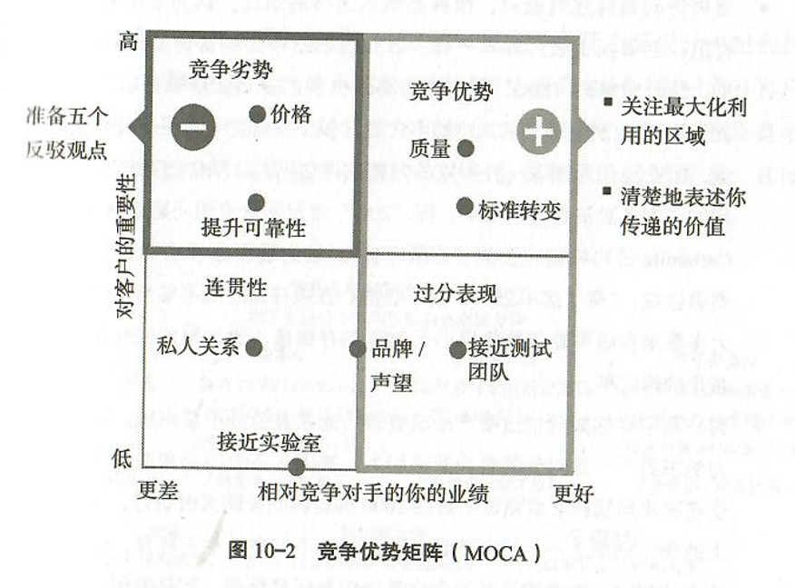

# 创新变现 - 以价格为核心的产品设计策略

[美]马德哈万·拉马努詹

[德]乔治·塔克 著

武鑫 张笑 译

> 从市场中获得客户对于产品的需求，了解他们真的需要什么，以此为起点，针对客户的需求、支付意愿等设计产品，将避免很多传统创新过程中可能潜在的风险。因此需要在组织内部组织跨部门团队，在产品研发之前就对这些问题进行仔细研究，然后制定出详细的策略，在确定了这个产品的必要性之后再投入研发。这样的改变很难，需要打破旧有的观念，因此也需要企业高管层全力以赴地进行推广和实践。

## 第一部分 关于创新变现的问题

### 第1章 创新者为何与数十亿美元失之交臂

全书开篇就介绍了两个产品研发的案例，一个是保时捷卡宴，通过对市场调研的重视，严格定义了一款客户需要的SUV，因此获得了巨大的市场成功。另一个是菲亚特克莱斯勒公司的FCA达特车型，设计并制造了工程师团队自认为的完美车型，但在市场上非常失败。保时捷公司的成功在于在研发卡宴时将客户需求、价值、支付意愿和价格放在首位。

新产品的失败有多种原因，而根本原因在于研发部门没有将客户购买新产品的意愿置于设计新产品的核心位置，这也是“硅谷钢铁侠”埃隆·马斯克所说的“第一性原理”。

创新变现失败的模式是重复的，只有四种类型：

- 功能冲突：在一种产品上附加了太多的功能，甚至是客户不想要的某些功能。其结果往往是制造出了一种无法完全满足客户需求而价格又过于昂贵的产品。
- 估值过低：尽管产品迎合了市场，但是过低的定价导致某种创新无法实现其收益潜力。
- 被埋没的宝藏：一种极具潜力的产品，却因为在核心业务之外而没有被很好地推向市场。
  亡灵产品：由于企业错误地判断了市场需求，导致客户对创新不感兴趣，却仍然被推向市场的一种创新。

本书归纳了九条产品设计创新变现的新法则：

1. **在产品研发初期，及时与客户进行“支付意愿”沟通。** 如果你没有提早这样做，你将无法确定应当重点开发哪些功能，而且直到产品上市之前，你也无法知道你的产品是不是客户愿意购买的。
2. **具体问题具体分析，不要妄想找到一劳永逸的解决方案。** 你必须接受客户之间存在差异这一事实，所以对客户进行细分非常有必要。但是，大多数企业使用的基于人口统计的客户细分具有一定的误导性，**你应当根据客户对新产品的支付意愿不同来创建客户细分。**
3. **产品配置和捆绑销售是一门艺术，更是一门科学。** 你需要仔细设计，并让它们与目标客户实现匹配。
4. **选择合适的定价和收益模式，** 因为你如何收费往往比你收多少钱更重要。
5. **制定你的定价策略。** 制定一个看似有些超前的计划，保证你能够在短期和长期内实现收益最大化。
6. **根据消费者支付意愿数据起草你的商业案例，并在价格、价值、数量和成本之间建立联系。** 如果没有这些，你的商业计划只能告诉你所希望听到的东西，这可能与真实的市场需求相去甚远。
7. **清晰且有理有据地向客户传达你的产品价值，** 否则他们不会坚定地选择购买。
8. **理解客户不理智的一面。** 无论你面对的是企业还是消费者，最终，这些客户都是人。你需要全面考虑他们的心理，比如他们在做出购买决策时的情绪。
9. **保持价格稳定，严控折扣幅度。** 如果市场对新产品的续期低于预期，而且已经别无他法时，降价才是最后一招。

### 第2章 创新变现失败的四种类型

导致创新失败的原因，经常来源于企业文化：

- 工程文化至上：可能导致功能冲突。
- 规避高风险：可能导致估值过低。
- 过分关注核心业务：可能导致被埋没的宝藏。
- 遵循自上而下管理文化：可能导致亡灵产品。

四种类型分别是：

- 第一类，功能冲突：功能过多而受众面过小。
	- “适合所有人”=“令少数人满意”。
		- ⇒ 整体价值<每个部分的总和
		- ⇒ 通常是由于“不确定/雄心勃勃的目标造成的。
	- 例如：
		- Amazon Fire Phone：过多华而不实的功能。
		- 美国有线电视行业：数百个频道。
		- 金融服务业：各类业务线。
		- 电子产品：高端高清电视的各种功能。
		- 家用电器：高端洗碗机的各种功能。
- 第二类，估值过低：当你要求过少时，这就是你得到的结果
	- 这个组件能为我们的客户以及它的客户带来多少价值呢？
	- “恰到好处”的思维方式是罪魁祸首。
	- 例如：
		- 直销产品卖断货，eBay卖高价。
		- 华硕公司电脑卖售罄。
		- 奥迪定价策略导致预期销售数量大于生产产能（也就是实际上可以卖贵一点）。
		- 法雷奥公司泊车辅助系统卖给大众，大众加价很多卖给终端用户。
		- 电信服务公司3G升级4G，不仅没有很好变现，甚至强调不加价。
- 第三类，被埋没的宝藏：如果你不仔细观察，你就不会发现它们
	- 没有认识到被埋没的宝藏的潜在价值，是大多数企业犯下这种错误的问题关键，但是大多数的企业并没有人对此负责。
	- 例如：
		- 柯达公司早在数码相机被发明前的21年前就发明了数码相机背后的技术。
- 第四类，亡灵产品：没人想要买你的产品
	- “亡灵”是指那些在市场中存在、而实际上已经不存在需求的产品。
	- 这些产品来自那些努力将技术可行性与商业实用性分离开的组织。
	- 由于把与消费者“愿意支付多少钱”的沟通推迟到了创新过程之后，这些企业让自己陷入了太迟说“不”的境地。此时，他们已经投入了太多的资源。在某些情况下，如果这是高管层最喜欢的项目，情况会变得更加复杂，没人敢说这种想法不好。
	- 例如：
		- Segway平衡车
		- Google Glass
		- 吸入式胰岛素
		- ……

### 第3章 失败的根源：为什么人们总是在产品开发完成的最后一刻才思考变现问题

大家认为过早地提出产品定价问题会扼制创新，而且在美国，乔布斯的成功又给创新增加了艺术家的成分。——这就是大家对于这件事的主流思维模式。

主流思维模式是建立在五个谬论和误区之上的：

1. 谬论1：如果你只是创造了一种了不起的新产品，客户会为它支付合理的价格。
2. 谬论2：新产品或者新服务必须全权由独立工作的创新团队控制。——艺术家必须与他人隔离并且摒弃一切与之相反的观点。
3. 谬论3：创新的高失败率是正常的，甚至是必需的。——与风险投资的思路相似。
4. 谬论4：客户必须要在确定以多少价格购买新产品前体验这种产品。——客户都没有见过产品，怎么可能知道多少价格？
5. 谬论5：直到企业明确知道正在生产的是什么产品时，它才能够衡量其价值。——没有成本，哪里来的定价？

## 第二部分 产品设计创新变现的九大法则

### 第4章 进行关于“支付意愿”的早期沟通

进行关于“支付意愿”的早期沟通，可以获得以下几个好处：

1. 限制在产品上添加过多无用的功能。
2. 证明这些产品有潜在市场。
3. 避免将“伪需求”的产品研发出来。

关于如何进行支付意愿沟通，书中给出了一些建议和常见误区。（P43）

内容比较多，这里不做摘抄。

简单地讲，就是有时候可能仅仅需要直截了当的问题，每个问题之后都尽可能问一下“为什么”，避免描述有歧义或者容易产生误导性错误回答的问题。

### 第5章 不管你喜欢与否，你的客户千差万别：有效的客户细分方法

有很多客户细分的方法：人物角色、行为、态度和人口特征等，但是在创新方面，只有一种正确的细分方法：客户需求、价值及其对能够为其带来价值的产品和服务的支付意愿。

从支付意愿数据开始；让常识来指导你使用数据；创建更少的细分，而不是更多；不要尝试为每一个细分都提供服务；详细描述细分以便于面对它们。

### 第6章 产品配置和捆绑销售是一门艺术，更是一门科学

产品配置和捆绑销售是实现收益最大化的途径。

产品配置的时候可以把基础功能、增值功能、终结功能区分开，并设置不同的价格。

不同产品配置之间一定要界限清晰，否则客户可能会购买基础产品而损害高级产品的购买。

捆绑销售则是将不同的产品进行组合销售，作者举例了通过不同的组合，实现销售额大幅增加的例子。麦当劳、微软Office都通过这种策略实现了盈利。与此同时，并非所有的捆绑销售都应该是低于产品组合的总价，一些组合也有可能是高于每个产品独立销售的价格之和。

### 第7章 深入了解定价策略：五个给力的变现模型

米其林通过创新研发了寿命更长的轮胎，但如果沿用传统收费方式，将可能损害原有利润，适得其反。通过收费模式的创新，按行驶里程付费，解决了这个问题。

作者总结了5个常用的变现模型。  

1. 订阅模型  
2. 动态定价模型  
3. 基于市场定价：拍卖  
4. 替代计量定价/现买现付  
5. 免费增值模型  

不同的模型都有自己的适用范围。

可以单独应用也可以组合使用。

### 第8章 低价获取市场份额还是高价保证品牌品质？选择能够制胜地定价策略

定价策略：简单说，就是短期和长期的变现计划。合理的定价策略一定要有清楚的目的、可量化的目标和执行的时间框架。

一个定价策略应该包含以下四个部分：

1. 制定明确的目标；
	1. 一些常见的目标：收入（收益）、市场份额、总利润、利润率、消费者、每单位平均收益、销量、产品结构、销量增长、成本减少。
	2. 这些目标也可以同时存在。
2. 选择正确的定价策略类型；
	1. 最大化策略：确定了最优的价格，即在价格弹性曲线上，利润或者收入曲线达到最大值的点。
	2. 渗透策略：故意将产品定价低于用最大化策略的定价，从而快速获得市场份额。
		- 适用场景：依赖网络效应的市场、客户对其选择的第一个品牌高度忠诚的市场。
		- 例子：
			- Facebook：通过免费抢夺更多用户，通过广告实现巨额收入。
			- 雷克萨斯进入美国：通过低价扩大市场份额，同时借助规模降低成本，然后再涨价。同样的还有亚马逊和优步。
			- 也有不成功的例子，如团购网站LivingSocial，利用这一策略融资，鼓吹先亏损后盈利，但是最终也没能实现。
	3. 高价策略：先推出高价产品，再推出低价产品，分别针对早期采用者和其他客户细分。
		- 适用场景1：那些为了获得同龄人炫耀资本的用户，如购买电影、音乐、在线游戏、高清电视、游戏机、智能手机和一些汽车的买家，在产品一上市就希望抢购。
		- 适用场景2：当产品代表一种突破时。
		- 适用场景3：当你的产能在产品上市初期受限，但未来必须大量生产时。
		- 例子：
			- 保时捷公司推出的四门轿车帕拉梅拉（Panamera），首先推出八缸车型以进军市场并脱颖而出，然后在一年后发布了低价的六缸车型。
3. 制定定价原则：在制定定价原则前需要先做5个步骤（每一个的详细解释见P97）：
	1. 变现模型
	2. 价格差异
	3. 价格底线
	4. 价格尾数
	5. 价格上涨
4. 制定定价对策原则：在产品引起市场反响后，你应当作何反应？
	- 两种类型
		1. 基于客户行为的对策：如促销：价格、目的、什么时候使用、形式……
		2. 基于竞争对手的对策：如预测对方反应、怎么应对对方的价格、希望起到什么作用……
	- 巴菲特：评估一家企业的最重要准则之一就是定价能力。

### 第9章 新产品开发的关键步骤：创建由外而内的商业案例

在新产品开发的过程中，创建一个商业案例非常重要，而且不应该是由内而外创建，而应该由外而内创建。这里的由外而内是指利用外部的信息对这个案例进行修正。

通俗的讲，就是需要假设你要造的这个产品推向市场，那么你会反复问自己这个产品的价值、价格、成本、销量、客户这些变量调整的预期反应、竞争对手对你的产品会做出的反应等，并通过这些反应，持续修正这个商业案例。

很多公司没有构建这样的商业案例，很多公司构建商业案例的目的只是为了获得预算但并不用于指导产品设计。而作者要求，我们需要结合外部数据来对充分研究这个商业案例，而且不能是一次性的静态工作，而是要有动态的过程，比如产品推向市场之后，价格过高，那么我们是否需要调整价格，如果调整了，然后又会发生什么？

书中也介绍了建立动态商业案例的九个步骤：

1. 忘记你现在创建商业案例的方法：传统方法通常是静态的，书中要求这个方法是动态的——需要在新产品上市前和上市后用**价格、成本、销量和价值**等新数据对其进行更新。
2. 收集基本要素：整合市场规模、销量、客户细分、供应结构（产品配置和捆绑）、价值、支付意愿、变现模型、成本以及竞争产品及其定价等相关数据和信息。
3. 考虑价格弹性：应该考虑价格变化对销量的影响。
4. 应用经过数据验证的事实：可以防止夸大市场规模，然后造成销量远低于预期。
5. 增加风险假设：预估一些最坏的情况，算是给业务做压力测试了。可以用蒙特卡洛模拟法（Monte Carlo simulation）。
6. 现实看待目标权衡：综合评估你要什么，需要在收益、利润、销量和利润率等指标上排出优先级，想要同时最大化是不可能的。
7. 考虑竞争反应：需要对竞争性的场景提前制订计划。
8. 商业案例不要只专注新产品：不仅要评估当前这个新产品，还要评估它对现有产品销量的影响。
9. 保持记录：定价、销量、成本和价值模型需要支撑起开发过程的每个阶段。

### 第10章 创新不会为自己说话：你必须学会传达价值

> 彼得德鲁克：客户买的不是产品。他们买的是产品和供应商为他们带来的好处。

几个月甚至几年的创新：

- 销售人员可能只有10分钟介绍产品。
- 客户可能只有在网站上停留5分钟。
- 一则广告的时间大约只有15秒。

如果没有有效传递价值，可能就会失去潜在客户。

造成这个问题的常见根源：负责沟通的人们通常都会与创新过程脱节，因此为时已晚。

两个例子都通过将焦点放在价值上，而解决了销售问题：

1. 一家SaaS公司提供的功能是帮客户降低库存提高周转率等，但是过去都是在和客户介绍功能，导致产品销售卖不上价，改变思路后，改成用一个测算模型帮助客户看到使用产品后，投资回报率有显著提升（客户可以通过这个产品赚钱），从而解决了价值问题。
2. SmugMug公司通过重新梳理不同的产品组合，然后将每个组合的价值“清晰化”为每一类组合提出了“价值主张”并为之定价，让顾客对产品选择更加了解，也愿意为满足自身需求，支付收费版的价格。

通过以下三个步骤创造良好的价值沟通

1. **步骤1：制定清晰的利益陈述，而不是功能描述。**

	一家擅长价值沟通的企业会用有意义的方式向客户清楚地说明产品的优势。这不是描述产品的功能。功能属于产品，而优势属于客户。价值是给客户带来的好处。沟通的是这些好处，而不是功能。针对每一项功能问自己：“客户会因为这项功能而得到什么？”如何你仍然不确定如何表述产品的优势，那么就与客户讨论他们的痛点以及你的产品会如何解决这些痛点。在理想情况下，你应当了解客户如何衡量他们的业绩以及你的产品将如何影响衡量标准。一旦你知道了这些，你既可以针对客户的偏好完善信息的内容，还可以量化产品的相对截止：将产品交付的价值与客户从其他产品中获得的价值进行对比。
	
	更具体地说，当你创建一条价值信息时，你应当确定客户的交易标准，以及与现有的可选方案相比，你的产品或者服务在这些标准上可能的表现。这样的信息可以被放置在一个2×2的矩阵内，我们称这个矩阵为竞争优势矩阵或者短期MOCA。

	

	我们应该主要强调第一象限的能力，第二象限的因素代表你的竞争劣势，你应该准备论据反驳它，第四象限则无需向客户强调（他们不太关心）

2. **步骤2：让你的利益陈述具象化**

	为不同的客户细分，陈述适合各自利益的价值点。

3. **步骤3：衡量影响并完善价值信息**

	应当反复检查你的营销和销售信息的可行性。具体地说，你需要衡量客户对你所传达的价值的认知。如果客户认为价值既不那么明确也不吸引人，你就应当着手完善这些信息。

需要将营销和销售团队和创新团队联合在一起，并且按照三个步骤去创建能够吸引眼球的信息。这些信息需要传达价值（而非功能），要根据客户细分创建，并能够被监测和不断完善。

### 第11章 使用行为定价策略来说服和销售

人们购买产品并不总是只因为价值，而会受到商品定价的影响。一些产品的组合（不同版本）之间的价格设计，可能影响到人们的选择，从而影响利润。

具体而言，一些公司会设计基础版、标准版、高级版、旗舰版的产品，并对应进行定价，基础版可能免费，标准版做了一点点改进但是需要付费，依此类推。如果基础版的功能过于强大，将会影响到其他利润品的销售。

下面是六种不同的行为定价策略：

1. 折中效应：使那些无法做出选择的客户更容易做出决策。在最便宜和最贵之间设置一个居中的价格，这个定价通常会满足大多数人不愿意走极端的心态。
2. 锚策略：为价值设定情境。例子：经济学人杂志通过设置59美元在线订阅、125美元纸质订阅、125美元在线/纸质订阅，三个版本，让用户觉得第三个选项中，59美元在线订阅似乎让在线版变得免费，从而增加了第三个选项的销量。在B2B销售中，通常可以以这样的话题开头：“因为高额的开发成本和领先的技术优势，新的特供版本的售价超过标准版本的40%。但是由于你一直是我们的优质客户，所以可以得到一些价格优惠”。
3. 用价格来表示质量：如果要价更高，就会强化客户对质量的认知。产品定价过低将比产品定价过高更糟糕。如果定价开始很高，后续可以降下来；如果定价开始很低，几乎无法再提上去。iPhone发售的例子，就成功地把高价和高质量绑定在了一起，为智能手机市场奠定了丰厚的利润空间。
4. 剃刀模式：迈出第一步。客户很在乎初始成本，哪怕长期总成本一致。因此可以通过提供这种分摊初始成本的方式，在后期再赚回对应成本。建议是：只有当你百分百确信你能把下游产品（比如剃须刀片和打印机墨盒等）卖给客户时才能够使用这个策略。例如：吉列剃须刀和刀片、打印机设备和墨盒、软件从一次性售卖变成卖SaaS服务。
5. 每日定价：减少价签冲击，建立忠诚度。例如亚马逊的云服务，则将一次性硬件投资变成了按需付费。与之相似且更普遍的做法是分期，例如每月收取订阅费。
6. 心理价格阈值：避免从价格悬崖上跌落。这里的价格悬崖就是指类似期望定价70美元的时候，可以定义成69美元，71美元则跌入悬崖，因为从用户心理的角度，71美元比69美元贵的可不只是2美元。

在实施行为定价策略之前，首先要通过焦点小组、A/B测试和大规模测试对它们进行测试。（而不要臆想）

> 在记录这一章的时候，偶然知道了“老铺黄金”这个品牌，搜了一下它的品牌发展史，发现它陡然成功逆势开店的秘诀就在于成功地找对了客群定位和价格锚，可以进一步了解一下这个品牌。

### 保持价格的完整性：避免下意识地重新定价

在产品上市后，可能因为销量惨淡，企业会选择降价，这种降价就是产品失去了价格的完整性。

失去价格的完整性将带来两大危机：

1. 利润被侵蚀
2. 损害客户的终身价值

降价很多时候并不能解决问题：

1. 产品质量出现问题，你降价，产品质量问题也不会因此而解决。
2. 客户不喜欢产品的外观，你降价，不喜欢的客户还是不喜欢。比如欧洲客户认为宝马7系不好看，管理团队没有选择降价而是调整了销售预期，并花时间去改进外观。

就算最终同意降价，也应该从消费者那里获得一些回报，例如一个长期承诺、更多的订单数量、介绍未销售过的部门、背书和推荐或者联合新闻稿，或者是其他东西，只要你能从中获得价值即可。

面对价格战：唯一的制胜方案就是不参与。

## 第三部分 成功者的故事

### 第13章 向成功者学习：围绕价格设计的成功创新

以下7个例子都是围绕价格设计的成功创新：

1. 保时捷设计制造了卡宴和帕拉梅拉的例子：通过提前锁定目标人群、分析客户需求、产品为这些用户提供哪些价值、客户的支付意愿等，从而成功地将产品推向市场并大获成功。
2. 领英公司：将世界最大的职业网络平台变现。领英公司的InMail功能充分考虑了会员价值，并为双边都带来了收益从而为公司创造了利润。他们在内部建立起了一套从假设开发、内部细化、初始客户验证、“直觉”检查、建立精准的模型、有偿试用的流程。
3. 德尔格医疗设备公司：在设计前收集成功的工业产品规范。过去，这家公司的创新都是由工程师通过头脑风暴做出的，最终导致了过度设计、一刀切式的产品规格、范围蔓延（功能一直在增加）、不清晰的销售故事和一般的利润率。该公司通过对客户流程监控，了解客户真实的需求，实现了产品研发由内而外向由外而内的转变。
4. 优步公司：通过创新价格模式将颠覆式创新变现。优步公司通过动态定价和渗透定价，让供需得到平衡，动态定价是指用车高峰的涨价、渗透定价则是降低价格会扩大用车的人群和范围，优步还通过客户细分，为不同人群提供了拼车、专车、关怀服务（简单理解成残疾人或老年人用车，带一定的医疗急救服务）、外卖送餐服务等。
5. 施华洛世奇：清楚了解客户需求所带来的回报。公司寻找影响支付意愿的关键：一个是切工复杂、一个是光泽度强。因此，公司设定了五级标准来进行区分。然后基于客户进行定价，从而为产品研发指明了方向。
6. Optimizely公司：如何为突破性创新定价。通过围绕为细分客户提供价值，来不断设计他们的定价模型，从而为每一种新的产品及组合提供合适的定价。
7. 某创新型制药企业：客户价值驱动的研发方式如何获得成功。通过围绕目标客户定价，不仅可以筛掉一些不必要的研发项目，将资金聚集在更有可能成功地新药开发上，还能有利于在产品上市后确保能够更快被市场接纳。将价值分析提到产品开发过程之前。传统方法通过推出更多配方来规避风险，而新的方法则在产品研发早期筛选掉一些产品。没有前途的产品（一些无法获得市场前景的产品）将被扼杀在摇篮中。

### 第14章 实施“围绕定价设计产品”的创新流程

1. 重新启动和初步实验：
	- 重新启动：提高创新水平的关键首先是要绝对坦诚。然后把本书的核心想法告诉团队。
	- 初步实验：挑选一个项目负责人，这个人得有过硬的产品经验，并且熟悉公司原有的创新过程。每个人都要为自己提出的意见负责，并且敢于说不。然后需要对市场规模以及客户对新产品的期望有一个定量理解。
2. 规模化和坚持：
	- 规模化：组织一个跨职能的团队，完成流程文档和工作手册。
	- 坚持：及时和没有价值的产品说再见，鼓励那些从市场获得反馈所构建的真正成功地产品并奖励这些产品的员工。

避免新产品变现过程中的九个陷阱：

1. 孤注一掷：应该要共同创造这些流程和文化，这样才能把这样的思想变成创新的DNA。
2. 不设立跨职能团队：必须尽早让营销和销售团队加入到产品创新的过程中。
3. 依赖大变革：需要循序渐进地推进改进的流程，否则很难成功。
4. 设想万全之策：必须根据企业的能力、技术、工具、现有流程和文化确定自己的步骤。
5. 太多人选择退出：需要坚持，避免因为太多人退出，导致回归现状。
6. 被科学蒙蔽：从市场获得的反馈仅供参考，你要避免这种错误的精确感。
7. 避免杂乱的信息：收集的数据可能不完美，不要理会那些与结论不一致的数据。
8. 吝啬：这些改变是需要大量的人力和财力作为支撑。
9. 让高管层委派任务：高管层必须全身心投入，才有可能推动创新变现。
