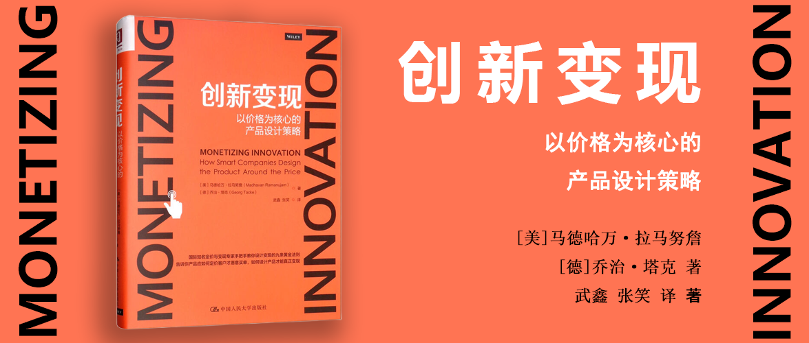

# 创新变现 - 以价格为核心的产品设计策略

[美]马德哈万·拉马努詹

[德]乔治·塔克 著

武鑫 张笑 译

## 第一部分 关于创新变现的问题

### 第1章 创新者为何与数十亿美元失之交臂

全书开篇就介绍了两个产品研发的案例，一个是保时捷卡宴，通过对市场调研的重视，严格定义了一款客户需要的SUV，因此获得了巨大的市场成功。另一个是菲亚特克莱斯勒公司的FCA达特车型，设计并制造了工程师团队自认为的完美车型，但在市场上非常失败。保时捷公司的成功在于在研发卡宴时将客户需求、价值、支付意愿和价格放在首位。

新产品的失败有多种原因，而根本原因在于研发部门没有将客户购买新产品的意愿置于设计新产品的核心位置，这也是“硅谷钢铁侠”埃隆·马斯克所说的“第一性原理”。

创新变现失败的模式是重复的，只有四种类型：

- 功能冲突：在一种产品上附加了太多的功能，甚至是客户不想要的某些功能。其结果往往是制造出了一种无法完全满足客户需求而价格又过于昂贵的产品。
- 估值过低：尽管产品迎合了市场，但是过低的定价导致某种创新无法实现其收益潜力。
- 被埋没的宝藏：一种极具潜力的产品，却因为在核心业务之外而没有被很好地推向市场。
  亡灵产品：由于企业错误地判断了市场需求，导致客户对创新不感兴趣，却仍然被推向市场的一种创新。

本书归纳了九条产品设计创新变现的新法则：

1. **在产品研发初期，及时与客户进行“支付意愿”沟通。** 如果你没有提早这样做，你将无法确定应当重点开发哪些功能，而且直到产品上市之前，你也无法知道你的产品是不是客户愿意购买的。
2. **具体问题具体分析，不要妄想找到一劳永逸的解决方案。** 你必须接受客户之间存在差异这一事实，所以对客户进行细分非常有必要。但是，大多数企业使用的基于人口统计的客户细分具有一定的误导性，**你应当根据客户对新产品的支付意愿不同来创建客户细分。**
3. **产品配置和捆绑销售是一门艺术，更是一门科学。** 你需要仔细设计，并让它们与目标客户实现匹配。
4. **选择合适的定价和收益模式，** 因为你如何收费往往比你收多少钱更重要。
5. **制定你的定价策略。** 制定一个看似有些超前的计划，保证你能够在短期和长期内实现收益最大化。
6. **根据消费者支付意愿数据起草你的商业案例，并在价格、价值、数量和成本之间建立联系。** 如果没有这些，你的商业计划只能告诉你所希望听到的东西，这可能与真实的市场需求相去甚远。
7. **清晰且有理有据地向客户传达你的产品价值，** 否则他们不会坚定地选择购买。
8. **理解客户不理智的一面。** 无论你面对的是企业还是消费者，最终，这些客户都是人。你需要全面考虑他们的心理，比如他们在做出购买决策时的情绪。
9. **保持价格稳定，严控折扣幅度。** 如果市场对新产品的续期低于预期，而且已经别无他法时，降价才是最后一招。

### 第2章 创新变现失败的四种类型

导致创新失败的原因，经常来源于企业文化：

- 工程文化至上：可能导致功能冲突。
- 规避高风险：可能导致估值过低。
- 过分关注核心业务：可能导致被埋没的宝藏。
- 遵循自上而下管理文化：可能导致亡灵产品。

四种类型分别是：

- 第一类，功能冲突：功能过多而受众面过小。
	- “适合所有人”=“令少数人满意”。
		- ⇒ 整体价值<每个部分的总和
		- ⇒ 通常是由于“不确定/雄心勃勃的目标造成的。
	- 例如：
		- Amazon Fire Phone：过多华而不实的功能。
		- 美国有线电视行业：数百个频道。
		- 金融服务业：各类业务线。
		- 电子产品：高端高清电视的各种功能。
		- 家用电器：高端洗碗机的各种功能。
- 第二类，估值过低：当你要求过少时，这就是你得到的结果
	- 这个组件能为我们的客户以及它的客户带来多少价值呢？
	- “恰到好处”的思维方式是罪魁祸首。
	- 例如：
		- 直销产品卖断货，eBay卖高价。
		- 华硕公司电脑卖售罄。
		- 奥迪定价策略导致预期销售数量大于生产产能（也就是实际上可以卖贵一点）。
		- 法雷奥公司泊车辅助系统卖给大众，大众加价很多卖给终端用户。
		- 电信服务公司3G升级4G，不仅没有很好变现，甚至强调不加价。
- 第三类，被埋没的宝藏：如果你不仔细观察，你就不会发现它们
	- 没有认识到被埋没的宝藏的潜在价值，是大多数企业犯下这种错误的问题关键，但是大多数的企业并没有人对此负责。
	- 例如：
		- 柯达公司早在数码相机被发明前的21年前就发明了数码相机背后的技术。
- 第四类，亡灵产品：没人想要买你的产品
	- “亡灵”是指那些在市场中存在、而实际上已经不存在需求的产品。
	- 这些产品来自那些努力将技术可行性与商业实用性分离开的组织。
	- 由于把与消费者“愿意支付多少钱”的沟通推迟到了创新过程之后，这些企业让自己陷入了太迟说“不”的境地。此时，他们已经投入了太多的资源。在某些情况下，如果这是高管层最喜欢的项目，情况会变得更加复杂，没人敢说这种想法不好。
	- 例如：
		- Segway平衡车
		- Google Glass
		- 吸入式胰岛素
		- ……

### 第3章 失败的根源：为什么人们总是在产品开发完成的最后一刻才思考变现问题

大家认为过早地提出产品定价问题会扼制创新，而且在美国，乔布斯的成功又给创新增加了艺术家的成分。——这就是大家对于这件事的主流思维模式。

主流思维模式是建立在五个谬论和误区之上的：

1. 谬论1：如果你只是创造了一种了不起的新产品，客户会为它支付合理的价格。
2. 谬论2：新产品或者新服务必须全权由独立工作的创新团队控制。——艺术家必须与他人隔离并且摒弃一切与之相反的观点。
3. 谬论3：创新的高失败率是正常的，甚至是必需的。——与风险投资的思路相似。
4. 谬论4：客户必须要在确定以多少价格购买新产品前体验这种产品。——客户都没有见过产品，怎么可能知道多少价格？
5. 谬论5：直到企业明确知道正在生产的是什么产品时，它才能够衡量其价值。——没有成本，哪里来的定价？

## 第二部分 产品设计创新变现的九大法则

### 第4章 进行关于“支付意愿”的早期沟通

进行关于“支付意愿”的早期沟通，可以获得以下几个好处：

1. 限制在产品上添加过多无用的功能。
2. 证明这些产品有潜在市场。
3. 避免将“伪需求”的产品研发出来。

关于如何进行支付意愿沟通，书中给出了一些建议和常见误区。（P43）

内容比较多，这里不做摘抄。

简单地讲，就是有时候可能仅仅需要直截了当的问题，每个问题之后都尽可能问一下“为什么”，避免描述有歧义或者容易产生误导性错误回答的问题。

### 第5章 不管你喜欢与否，你的客户千差万别：有效的客户细分方法

有很多客户细分的方法：人物角色、行为、态度和人口特征等，但是在创新方面，只有一种正确的细分方法：客户需求、价值及其对能够为其带来价值的产品和服务的支付意愿。

从支付意愿数据开始；让常识来指导你使用数据；创建更少的细分，而不是更多；不要尝试为每一个细分都提供服务；详细描述细分以便于面对它们。

### 第6章 产品配置和捆绑销售是一门艺术，更是一门科学

产品配置和捆绑销售是实现收益最大化的途径。

产品配置的时候可以把基础功能、增值功能、终结功能区分开，并设置不同的价格。

不同产品配置之间一定要界限清晰，否则客户可能会购买基础产品而损害高级产品的购买。

捆绑销售则是将不同的产品进行组合销售，作者举例了通过不同的组合，实现销售额大幅增加的例子。麦当劳、微软Office都通过这种策略实现了盈利。与此同时，并非所有的捆绑销售都应该是低于产品组合的总价，一些组合也有可能是高于每个产品独立销售的价格之和。

### 第7章 深入了解定价策略：五个给力的变现模型

米其林通过创新研发了寿命更长的轮胎，但如果沿用传统收费方式，将可能损害原有利润，适得其反。通过收费模式的创新，按行驶里程付费，解决了这个问题。

作者总结了5个常用的变现模型。  

1. 订阅模型  
2. 动态定价模型  
3. 基于市场定价：拍卖  
4. 替代计量定价/现买现付  
5. 免费增值模型  

不同的模型都有自己的适用范围。

可以单独应用也可以组合使用。

### 第8章 低价获取市场份额还是高价保证品牌品质？选择能够制胜地定价策略

定价策略：简单说，就是短期和长期的变现计划。合理的定价策略一定要有清楚的目的、可量化的目标和执行的时间框架。

一个定价策略应该包含以下四个部分：

1. 制定明确的目标；
	1. 一些常见的目标：收入（收益）、市场份额、总利润、利润率、消费者、每单位平均收益、销量、产品结构、销量增长、成本减少。
	2. 这些目标也可以同时存在。
2. 选择正确的定价策略类型；
	1. 最大化策略：确定了最优的价格，即在价格弹性曲线上，利润或者收入曲线达到最大值的点。
	2. 渗透策略：故意将产品定价低于用最大化策略的定价，从而快速获得市场份额。
		- 适用场景：依赖网络效应的市场、客户对其选择的第一个品牌高度忠诚的市场。
		- 例子：
			- Facebook：通过免费抢夺更多用户，通过广告实现巨额收入。
			- 雷克萨斯进入美国：通过低价扩大市场份额，同时借助规模降低成本，然后再涨价。同样的还有亚马逊和优步。
			- 也有不成功的例子，如团购网站LivingSocial，利用这一策略融资，鼓吹先亏损后盈利，但是最终也没能实现。
	3. 高价策略：先推出高价产品，再推出低价产品，分别针对早期采用者和其他客户细分。
		- 适用场景1：那些为了获得同龄人炫耀资本的用户，如购买电影、音乐、在线游戏、高清电视、游戏机、智能手机和一些汽车的买家，在产品一上市就希望抢购。
		- 适用场景2：当产品代表一种突破时。
		- 适用场景3：当你的产能在产品上市初期受限，但未来必须大量生产时。
		- 例子：
			- 保时捷公司推出的四门轿车帕拉梅拉（Panamera），首先推出八缸车型以进军市场并脱颖而出，然后在一年后发布了低价的六缸车型。
3. 制定定价原则：在制定定价原则前需要先做5个步骤（每一个的详细解释见P97）：
	1. 变现模型
	2. 价格差异
	3. 价格底线
	4. 价格尾数
	5. 价格上涨
4. 制定定价对策原则：在产品引起市场反响后，你应当作何反应？
	- 两种类型
		1. 基于客户行为的对策：如促销：价格、目的、什么时候使用、形式……
		2. 基于竞争对手的对策：如预测对方反应、怎么应对对方的价格、希望起到什么作用……
	- 巴菲特：评估一家企业的最重要准则之一就是定价能力。

### 第9章 新产品开发的关键步骤：创建由外而内的商业案例

在新产品开发的过程中，创建一个商业案例非常重要，而且不应该是由内而外创建，而应该由外而内创建。这里的由外而内是指利用外部的信息对这个案例进行修正。

通俗的讲，就是需要假设你要造的这个产品推向市场，那么你会反复问自己这个产品的价值、价格、成本、销量、客户这些变量调整的预期反应、竞争对手对你的产品会做出的反应等，并通过这些反应，持续修正这个商业案例。

很多公司没有构建这样的商业案例，很多公司构建商业案例的目的只是为了获得预算但并不用于指导产品设计。而作者要求，我们需要结合外部数据来对充分研究这个商业案例，而且不能是一次性的静态工作，而是要有动态的过程，比如产品推向市场之后，价格过高，那么我们是否需要调整价格，如果调整了，然后又会发生什么？

书中也介绍了建立动态商业案例的九个步骤：

1. 忘记你现在创建商业案例的方法：传统方法通常是静态的，书中要求这个方法是动态的——需要在新产品上市前和上市后用**价格、成本、销量和价值**等新数据对其进行更新。
2. 收集基本要素：整合市场规模、销量、客户细分、供应结构（产品配置和捆绑）、价值、支付意愿、变现模型、成本以及竞争产品及其定价等相关数据和信息。
3. 考虑价格弹性：应该考虑价格变化对销量的影响。
4. 应用经过数据验证的事实：可以防止夸大市场规模，然后造成销量远低于预期。
5. 增加风险假设：预估一些最坏的情况，算是给业务做压力测试了。可以用蒙特卡洛模拟法（Monte Carlo simulation）。
6. 现实看待目标权衡：综合评估你要什么，需要在收益、利润、销量和利润率等指标上排出优先级，想要同时最大化是不可能的。
7. 考虑竞争反应：需要对竞争性的场景提前制订计划。
8. 商业案例不要只专注新产品：不仅要评估当前这个新产品，还要评估它对现有产品销量的影响。
9. 保持记录：定价、销量、成本和价值模型需要支撑起开发过程的每个阶段。
