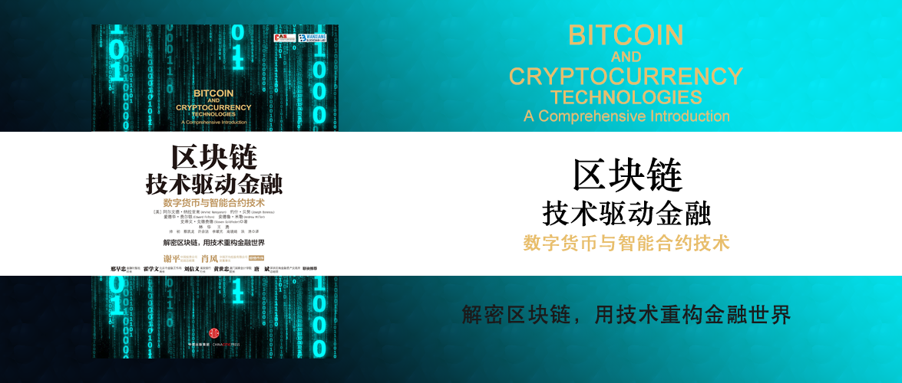

区块链技术驱动金融
========================================

数字货币与智能合约技术

[美]阿尔文德·纳拉亚南（Arvind Narayanan） 约什·贝努（Joseph Bonneau） 爱德华·费尔顿（Edward Felten） 安德鲁·米勒（Andrew Miller） 史蒂文·戈德费德（Steven Goldfeder） 著

林华 王勇 初帅 蔡凯龙 许余洁 李耀光 高晓婧 洪浩 译

解密区块链，用技术重构金融世界

中文版序 资产证券化可能成为区块链最好的一个应用 谢平
----------------------------------------

区块链概念随着比特币而逐渐被人所知，区块链技术给我们创造了一个用“共信力”来解决公信力问题的途径。

互联网科技与传统金融机构有待进一步的融合，区块链为银行、保险等机构提供当前许多问题的解决方案，帮助他们寻找新的机会服务客户。

资产证券化与区块链有一个很好的结合点，资产变成货币，就是一种证券化，然后把它们记录到分布式账本，通过场景建立起映射关系，实现所谓的货币化，其中最有可能的场景就是交易所。

区块链技术仍不成熟，它极有可能被滥用，因此要加强金融监管和行业规则的技术创新，才能保证不会出现新的非法集资或者金融不稳定的来源。

区块链不仅仅是货币创造，而且是价值传输或公共账户，是推动诚信社会建立的有效手段。

中文版序 区块链到底是什么？ 肖风
----------------------------------------

区块链首先是一种社会思潮。凯文·凯利《失控》一书里观察及论述到的基于生物逻辑的自然、社会、技术的进化规律：分布式、去中心；从边缘到中心再到边缘，从失控到控制再到失控。

区块链其次是一串技术组合。分布式账本、新型数据库、智能合约、TCP/IP模型（互联网模型）里的点对点价值传输协议（可以利用互联网传递价值物）。

区块链还是FinTech（金融科技）的核心。互联网金融侧重于场景革命，而科技金融侧重于技术革命。金融科技侧重的是云计算、大数据、机器学习、人工智能等创新技术。

译者前言
----------------------------------------

这本书起源于业内所熟知的比特币和加密货币技术的普林斯顿网络公开课。本书讨论的是比特币的一系列重要问题。比特币是如何运作的？它因何而与众不同？你的比特币安全吗？比特币用户如何匿名？我们可以在比特币这一平台上创建什么应用程序？加密数字货币可以被监管吗？创建一种新的数字货币将会带来什么样的变化？未来将会如何发展？本书中，作者承认比特币及区块链技术为各种领域带来了颠覆性的创新，但他们并不认可那种以去中心化为目的的观点。

原版引言
----------------------------------------

原版前言
----------------------------------------

第1章 密码学及加密货币概述
----------------------------------------

第2章 比特币如何做到去中心化
----------------------------------------

第3章 比特币的运行机制
----------------------------------------

第4章 如何储存和使用比特币
----------------------------------------

第5章 比特币挖矿
----------------------------------------

第6章 比特币和匿名性
----------------------------------------

第7章 社区、政治和监管
----------------------------------------

第8章 其他挖矿算法
----------------------------------------

第9章 比特币“平台”
----------------------------------------

第10章 另类币和加密货币生态系统
----------------------------------------

第11章 去中心化机构：比特币的未来？
----------------------------------------

结束语
----------------------------------------
