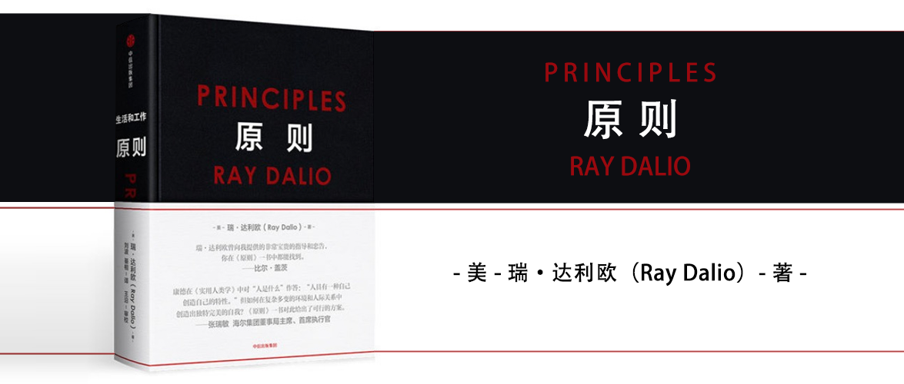

原则
==========================

作者：瑞·达利欧

导言
--------------------------

1. 每个人都应该有自己的原则，在此基础上不断迭代变得更好。
2. 犯错不可怕，而要学会正确地犯错，而不是错误地犯错，即在犯错后失败，应该在犯错后成功。
3. 要有将犯错可能性最大化的决策方式。
4. 以可信度加权的方式做决定。要从别人的视角看问题，对他们的观点加权。

第一部分 我的历程
--------------------------

1 我的探险召唤(1949~1967年)
--------------------------

我的机械记忆能力差，不爱上学，对学校认为重要的事缺乏兴趣。我从小打了很多零工，从中学到了很多学校没有的知识，我的童年是美国经济腾飞的时候，股市只涨不跌，让大家都赚到钱，后来我才对股市有了正确的了解。

我认为：很好的事>糟糕的事>平庸的事。

2 跨越门槛（1967～1979年）
--------------------------

从进入哈佛商学院到美元不允许自由兑换黄金，从看不懂消息发布后的市场上涨到对大宗商品产生兴趣，从大宗商品在华尔街默默无闻，到（从事大宗商品交易）工资在哈佛商学院毕业生中排列靠前，直到经历了几次公司倒闭后，成立了桥水。

在桥水始终帮助客户管理风险，了解学习底层资产的生产链条，把数据转化成模型，不断优化迭代，相比于专注于赚更多的钱，更有意义的是关注自己想要什么，钱不能买来一切，当你知道你要什么之后，才能知道为了这些你该做些什么？

对我而言，拥有有意义的工作和人际关系要比赚钱好得多。

当管理鸡肉未来价格的时候，脑子里出现了一个念头，从经济学的角度出发，可以把一只鸡看作一部简单的机器，该机器包含一只小鸡和它的饲料。鸡肉生产商最需要担心的波动最剧烈的成本，是饲料的成本。

3 我的低谷（1979～1982年）
--------------------------

邦克亨特以1.29美元1盎司的价格买入白银，直到接近50美元后一泻千里最终破产。我觉得美联储已采取更保守的态度，准备将短期利率提高到长期利率之上，每当发生这种情况时，对冲通胀的资产价格都会下跌，经济都会下滑，于是我在10美元左右的时候就退出了，这使我错过了后来的40美元涨幅，但也使我免于破产。

其间我邀请保罗科尔曼加入桥水，并成为彼此的好伙伴。

在1979～1981年的大萧条时期，我观察到“下一场萧条已经显现”，我们的（美国）债务规模已经超过其他国家的资产规模，于是我同时持有黄金和债券作为对冲，使我躲过了这次危机。

1982年8月墨西哥债务违约后，我预判会有更多同类事件发生，我预感经济会走向崩溃，并买入了黄金和国债期货，但我预感的事并没有发生，这让我损失惨重，直到我发不出工资，员工们不得不相继离开。

在经历了重大失败之后，我总结了我能够成功的唯一途径将是：

1. 找到与我观点不同的最聪明的人，以便自己能够努力理解他们的推理。
2. 知道自己在什么时候不能有明确的意见，不急于下结论。
3. 逐步归纳永恒和普适的原则，对其进行测试，将其系统化。
4. 通过平衡风险来保持较大的回报，并降低下行波动。

4 我的试炼之路（1983～1994年）
--------------------------

我将我的决策思路写成计算机程序，并让他去历史数据中验证，并不断改进它。我不觉得预测未来会有用，因为那可能得到对各种可能性的一组概率，我觉得有用的是当经济环境发生变化时，利用长期积累的规则，快速作出反应，调整投资组合。从1983年底起，我们开始拓展我们的业务，增加了出售打包研究服务，我们向客户展示如何保持“风险中性”，同时也提供替客户投机的操作并获得利润分成。

我们也发明了“阿尔法叠加”投资管理方式。

后来我们发展成为了机构投资管理者，这也是今天所知的桥水奠基的样子。

1984年我来到了中国，并和他们一起建立了中国证券市场研究设计中心，我成立了“桥水中国合作伙伴”公司，但最终因为复杂度远超想象而关闭。

我和不同国家的领导人有联系，并从他们那里得到很多启发。我喜欢在有趣的地方认识有趣的人，并通过他们的眼睛看世界。

我的家庭以及我和同事一起组成的大家庭，很长一段时间都工作生活在一起。我希望我周围的人都是和我有相同需求的人，即那些为了自己而把事情弄明白的人。我说话很坦诚，也希望我周围的人说话坦诚。我为追求我觉得最好的东西而奋斗，而我希望他们也一样。当我觉得谁做了什么蠢事时，我会直说，同时我也希望他们在我干了蠢事时直言相告。这样做将让我们所有人获益。在我看来，强大而富于创造力的人际关系就是这个样子的。以任何其他方式运行的组织都将是低效的，不符合伦理的。

1987年10月我们成功做空股票，业绩增长22%，1988年，因为自动决策系统未发现异常，而导致我们受到损失。比直接弃而不用，我们选择改进系统，用更好的价值衡量与风险控制手段取代了技术性的趋势跟踪过滤系统，使之可以根据我们的信心程度决定自己押注的规模。

我喜欢使用新毕业生，与经验相比，我更看重个性，创造力和常识感，桥水的下一个起点是从开始管理柯达养老金风险开始的。我们利用一系列资产组合工程理念来分析这部“机器”。

我们掌握着约1000个回报流。我们发现投资组合中，拥有几个良好的互不相关的回报流，要比只有一个好，而且知道如何结合不同的回报流，要比能够选出好的回报流更有效果（不过显然你必须二者都做）。

我们给这种方法起名叫“精华5%”，后来改名叫“纯粹阿尔法”。超过26年的时间里23年里取得收益，其余3年只有小幅亏损。

**把我们的“杀手系统”国际化**

“纯粹阿尔法”是我们所知的最好的积极理财方式，但即便如此也只有10%的客户选择它。

我们还把它用于交易外国政府债券、新兴市场债券、通胀挂钩债券、公司债券以及海外投资带来的外汇风险敞口。

我们还在1991年成为了机构投资者的货币外包管理人。在全球市场中，我们替客户管理外汇风险敞口。我们还创造了很多其他的新型、有效的理财方式，这都取决于我们有一套基于系统化的决策程序，在大量不同条件下对决策的表现进行压力测试。

**把我们的从错误中总结的教训系统化**

曾经我们发现过一些严重的错误，但我没有怪罪任何人，每个人都会犯错，怪罪只会让大家把问题藏起来，我的做法是发明了错误日志工具，当大家犯错的时候，要求大家详细记录下来，便于找出根源，规避隐患。

**我“顽固难治”的人事管理问题**

因为我的严苛要求给其他同事带来了压力和焦虑，直到有人告诉我，我才意识到。但并非所有人都是这样的感受。那些熟悉我的人能够理解我的初衷，但为了避免那些不熟悉我的人受到我的管理风格的影响，我最终决定在组织内，将这些原则事先写下来，就我们一致同意的相处规范而言，最重要的一条是，我们需要做三件事：

1. 把我们的真实想法摆在桌面上；
2. 存在经过深思熟虑的分歧，但人们更愿意在相互了解的过程中更改观点；
3. 如果分歧依然存在，拥有一种大家一致同意的决策方式（如投票或者拥有清晰的权威），以便我们能够不带怨气地把分歧留在身后。

5 终极恩惠（1995～2010年）
--------------------------

我利用计算机固化决策，利用机器运行系统解放了我们。

**发现通胀挂钩债券**

如何创造比美国通胀率高5%回报的投资组合，我的回答是：杠杆化的外国通胀挂钩债券，加上与美元对冲的该国货币。

后来在美国是否应该发行本国的通胀挂钩债券时，他们请我去，并采纳了我的建议。

**发现“风险平价”**

我为了能让留给后代的财富抵抗风险，创造了“全天候资产组合”。后来很多人效仿我们，推出了自己版本的投资组合。现在这种模式统称为“风险平价”投资。

**继续做一个出色的精品店，还是发展成一个大机构**

到2003年，我已经认定，我们需要把桥水发展成一家真正的大机构，这么做将在许多方面让我们变得更好：更好的科技，更好的安全掌控，更丰富的人才资源——这些都将让我们变得更稳定、更持久。

**充实原则**

想要拥有真正的创意择优，就必须透明，以便人们自己找到真相。因此，除了罗列所有的原则，我还要求对所有的会议录音，并向全员公开。我们引导针对各自行为展开非常坦率的讨论，加深对彼此的理解。

**发现心理测试**

我发现MBTI心理测试很准，并用它给员工做测试，准确率>80%。

**创建“棒球卡”**

我发现虽然心理测试很准，但还是很难把这些结果和具体的人联系起来。我决定为每个人创建“棒球卡”，类似一种个人画像，并用这些画像指导用人。

人和人的行为和它的心理密切相关，人和人各不相同。

**让桥水坚如磐石，利如刀刃**

我带领桥水作答的过程也遭遇了瓶颈，我很多时候无法把我的工作让别人替代，这也严重影响了我自己的工作和生活的平衡。

**2008年金融与经济危机**

我们很早意识到我们的原则应该适应所有历史，而不仅是我们自己经历过的事，我们在系统设立了“萧条测量仪”，我们在很早就预测到了经济会出现危机，并为客户做好了应对方案，成功渡过了危机。

**帮助决策者**

2008年经济危机意味着模型的失败，传统经济学遭到了挑战。政治经济学家和金融学家都是自身所处环境的产物，投资者独立思考，预测尚未发生的事情，使用真金白银冒险投资。而决策者所处的环境鼓励形成共识而非表达分歧，培养他们针对已经发生的事情作出反应，训练他们的谈判能力而非冒险投资能力。

**获得优异回报**

2010年两个纯粹阿尔法和全天候资产组合都收益很好，这都仰仗了我们是依赖计算机而非大量的基金经理。

**从幕后走到台前**

我的盈利战果获得了媒体的关注，这些不必要的关注让我感到不安，我决定自己公开这些原则，这一决定不容易，但现在看来是个不错的决定。

**未雨绸缪，让没有我的桥水继续保持成功**

我用高标准要求员工，新入职者通常会经历18～24个月的调适期，之后才会真正适应桥水企业文化的精髓——探寻真相和透明，尤其是承认自身的错误并学会对待错误的正确办法。

6 回报恩惠（2011～2015年）
--------------------------

我开始考虑寻找继任者，但不同于直接辞职，我选择了先成为一名顾问。

**认识塑造者**

塑造者有很多共性：他们都是独立的思考者，不会让任何东西或任何人妨碍自己追求大胆的目标。对于事情应该怎么做，他们在头脑里有十分坚定的规划，同时又始终愿意在现实中检验这些头脑规划，调整做法，从而使规划效果变得更好。他们都极为坚韧，因为相对于他们在追求梦想的过程中经历的痛苦而言，他们实现梦想的决心更强烈。也许最有意思的是，他们关于未来的视野要比多数人宽广，或者他们自己就有这样的视野，或者他们善于从能看到更多东西的人那里学习。

他们都能同时看到大图景和小细节（以及中间的层次），并能综合在不同层次上总结的观点，而大多数人通常是见此不见彼。创造性、系统性、现实性在他们身上合而为一。他们既是坚决的又是开明的。最重要的是，他们对自己的事业充满热情，对表现一般的手下不能容忍，同时想给世界带来巨大、有益的影响。

他们通常都有一项缺点，就是不太“顾及他人”。而之所以如此的原因在于：每当面对是实现自己的目标还是取悦他人（或不让他人失望）时，他们都会选择实现自己的目标。

很多人看起来像塑造者，他们提出了好点子，并将其发展到一定程度后卖掉从而赚很多钱，但他们并不会持久地塑造。硅谷有很多这样的人，也许他们应该被称为“发明者”。我还发现有些卓越的组织领导人并不是典型的塑造者，也就是说，他们没有提出原创性想法并落实，只是进入已有的组织并将其领导得很好。

**把我们的创意择优系统化**

人分为不同类型，而类型大体相同的人在相同类型的情况下，会创造相同类型的结果。

但很多管理者不愿花时间在了解人上，使得管理变得困难，一个来自投资管理方面的经验，让我想到“良好的管理也应该系统化”。

**预见欧洲债务危机**

从2010年开始，我就意识到欧洲债务危机的可能性，我试图联系决策者，但大多数人都不以为然。各国经济运行的规律其实都是差不多的。

当市场表现不佳时，决策者希望能做些事增强市场信心，他们以为只要建立了信心，资金就会到来，问题就会消失。他们没有看到的是，具体的买家不管有没有信心，都没有足够的资金和贷款来购买所有需要出售的债券。

当国家彼此谈判的时候，他们通常会表现得比个人更为自私，聪明的领导人知晓本国的弱点，利用别国的弱点，并预期其他国际的领导人也会这么做。

之后我录制了视频“[经济机器是如何运行的](https://www.bilibili.com/video/BV15s411b7xr)”，希望把我的理解告诉大家。

**回报恩惠**

坎贝尔的《千面英雄》里总结了英雄打怪升级不断淬炼的过程，并通常都在最后选择回报恩惠，这让我意识到当我年事已高的现在应该做些什么。

**努力做慈善**

帮助穷人、资助教育、关心海洋保护、推动科技普及、动物保护等，如何衡量这些慈善的回报？这很难，我们养成了*优先支持可持续性社会事业的习惯*。

**桥水40周年**

桥水这些年成长为一家优秀的公司，一些东西随着时间变化，而另一些没有，最重要的是文化——我们通过极度求真和彼此间极度透明追求工作和人际关系两方面的卓越。

7 最后的一年和最大的挑战（2016～2017年）
--------------------------

转型的进展并不像想象的那么顺利，两位CEO已不堪重负，我不得不重新担任CEO并就此反省。

一个岗位成功的人在另一个岗位不一定也会成功，对一个人有效的做事方式未必对另一个人也有效。

想要转型成功，只需要做两件事：

1. 让胜任的人做CEO
2. 拥有一套有效的治理机制，可以在CEO无法胜任的情况下替换他。

8 从更高的层面回顾
--------------------------

我回顾自己看法改变的过程：

1. 遇到挑战，总结经验，从别人的历史经验中学习。
2. 形成原则，在往后不断修正更新，不抱怨，通过更具建设性的方式找到有效的应对方法。

第二部分 生活原则
--------------------------

1 拥抱现实
--------------------------

做一个超级现实的人，要坦然面对生活的真相，包括那些糟糕的结果，从结果中寻找失败的经验。做到头脑极度开放、极度透明，不要担心别人的看法而因此影响到自己，学会用开放去面对工作和人际关系。

人类远比自己以为的要渺小，要观察自然，学习现实规律。整个世界运行的底层逻辑就是不断进化，人不应该先入为主地看待事物，当发现事与愿违时，这些都是客观存在的，要从这些现象中不断进化，进化是痛苦的，这是因为你在突破极限，突破极限本身就是痛苦的。

遇到痛苦你要接受它，并学会反思，从而得到进步。人不能仅依靠结果做决策，要考虑后续，再后续的结果，比如健身看起来很痛苦，但进一步的后果会变得健康。

要学会接受结果，换一种方式来理解结果，有助于获得快乐，并从中得到反馈。

把自己理解成一部机器，你既是设计者也是工作者，大多数人只把自己作为工作者，但其实把自己作为设计者更为重要。设计者的意思大抵就是定义我想要什么，而工作者则负责将它实现。如果你发现你自己并不能胜任这项工作，那么你不应该为之沮丧，应该果断把他开掉换一个能够胜任的人来。你也可以向其他人请教，这将帮助你建立起安全护栏，避免自己做错事。

|    不好       |       好       |
|:------------:|:---------------|
| 拒绝直面“严酷的现实” | 直面“严酷的现实” |
| 担心自己的形象 | 关心如何实现目标 |
| 只根据直接结果做决策 | 根据直接结果、后续结果和再后续结果做决策 |
| 让痛苦阻碍自己进步 | 理解如何管理痛苦以取得进步 |
| 不自己负起责任，也不会从其他人那里找原因 | 从自己和其他人那里找原因，负起责任 |

2 用五步流程实现你的人生愿望
--------------------------

要想获得成功，你可以做5个步骤：

1. 有明确的目标。
    - 排列优先顺序：尽管你几乎可以得到你想要的任何东西，但你不可能得到你想要的所有东西。
    - 不要混淆目标和欲望。
    - 调和你的目标和欲望，以明确你在生活中真正想要的东西。
    - 不要把成功的装饰误认为成功本身。
    - 永远不要因为你觉得某个目标无法实现就否决它。
    - 谨记伟大的期望创造伟大的能力。
    - 如果你拥有灵活性并自我归责，那么几乎没有什么能阻止你成功。
    - 知道如何对挫折和知道如何前进一样重要。
2. 找到阻碍你实现这些目标的问题，并且不容忍问题。
    - 把令人痛苦的问题视为考验你的潜在进步的机会。
    - 不要逃避问题，因为问题根植于看起来并不美好的残酷现实。
    - 要精准地找到问题所在。
    - 不要把问题的某个原因误认为问题本身。
    - 区分大问题和小问题。
    - 找出一个问题之后，不要容忍问题。
3. 准确诊断问题，找到问题的根源。
    - 先把问题是什么弄明白，再决定怎么做。一瞬间就确定一个严峻的问题并提出解决方案，是一种常见的错误。战略思考急需要诊断也需要规划。
    - 区分直接原因和根本原因。直接原因是导致问题的行动，根本原因是更深层的原因，只有消除根本原因才能真正解决问题，为此你必须区分症状和疾病本身。
    - 认识到了解人（包括你自己）的特性，有助于对其形成合理预期。
4. 规划可以解决问题的方案。
    - 前进之前先回顾。
    - 把你的问题看作一部机器产生的一系列结果。
    - 谨记实现你的目标通常有很多途径。
    - 把你的方案设想为一个电影剧本，然后循序渐进地思考由谁来做什么事。
    - 把你的方案写下来，让所有人都能看到，并对照方案执行。
    - 要明白，规划一个好方案不一定需要很多时间。
5. 做一切必要的事来践行这些方案，实现成果。
    - 规划做得再好，不执行也无济于事。
    - 良好工作习惯的重要性常被大大低估。
    - 建立清晰的衡量标准来确保你在严格执行方案。

为了快速进化，你必须迅速、持续地这么做，不断设定更高的目标。你要成功就必须做好每一步，而且必须按顺序一步一步来。

6. 谨记：如果你找到了解决方案，弱点是不重要的。
    - 考察你犯错误的类型，并识别你通常在五步流程中的哪一步上做得不好。
    - 每个人都至少有一个最大的弱点阻碍其成功，找到你的这个弱点并处理它。你可以自己把它处理掉，也可以找人帮你更好地处理。
7. 理解你和其他人的“意境地图”与谦逊性。有的人很擅长自己把问题和解决办法搞明白，这样的人拥有良好的“意境地图”。同时，还有一些人比其他人更谦逊，头脑更开放。同时做到两者，总是可以击败不是两者皆有的人。

3 做到头脑极度开放
--------------------------

人们很难做到头脑极度开放，有两个原因：

一个是自我意识障碍，来自于人脑存在颞叶和前额叶皮层，前者处理情绪，简单化本能反应，后者决策执行、应用逻辑和推理。两者在争夺对你的控制权，如果是前者夺得了控制权，那么你可能表现出来的行为就是为自己的“正确性辩护”，而忽略了“追求真相”。

一个是思维盲点障碍，思维方式会阻碍你准确看待事物。人们都是有思维盲点的，但是人们不愿意看到这个事实。当你指出某个人的心理弱点时，对方的反应通常像你指出他的身体缺陷一样，感到不舒服。

这两大障碍造成的最终结果是，出现意见分歧的各方通常始终坚信自己是对的，而且往往以彼此发怒告终。这是不理性的，也会导致人们无法做出最优决策。

### 奉行头脑极度开放

头脑极度开放的基础是一种真诚的担忧：你在决策时看到的情况也许并不是最符合事实的情况。头脑极度开放是一种能力：有效地探析各种不同的观点和不同的可能性，而不是让你的自我意识和思维盲点阻碍你。要做到头脑极度开放你必须：

1. 诚恳地相信你也许并不知道最好的解决办法是什么，并认识到，与你知道的东西相比，能不能妥善处理“不知道”才是最重要的。
2. 认识到决策应当分成两步：先分析所有相关信息，然后决定。
3. 不要担心自己的形象，只关心如何实现目标。
4. 认识到你不能“只产出不吸纳”。
5. 认识到为了能够从他人的角度看待事物，你必须暂时悬置判断，只有设身处地，你才能合理评估另一种观点的价值。
6. 谨记，你是在寻找最好的答案，而不是你自己能得出的最好答案。
7. 搞清楚你是在争论还是在试图理解一个问题，并根据你和对方的可信度，想想哪种做法最合理。

### 领会并感激：深思熟虑的意见分歧

人们习惯于避开“意见分歧”，这会让你损失很多探讨最优解的机会，在深思熟虑的意见分歧中，双方的动机都是真诚担忧错过重要观点。你们彼此要真正看到对方看到的东西，也就是说，你们两人“更高层次的自我”努力探寻事实，这样的交流使双方受益匪浅，并能释放出巨大的未被发掘的潜力。

### 和可信的、愿意表达分歧的人一起审视你的观点

为最坏的情况做准备，以尽量使其不那么糟糕。我的经历让我从避免了一场食道癌手术，这就是来自于我和不同的专家就相同的问题进行了讨论，专家也不免出错，而我要做的就是接受更多的观点，降低作出错误决定的概率。

### 识别你应当注意的头脑封闭和头脑开放的不同迹象

| 头脑封闭   | 头脑开放 |
|:----------|:------------|
| 不喜欢观点被挑战 | 想了解为什么出现分歧 |
| 喜欢陈述而不是提问 | 真诚相信自己可能是错的，提出真诚的问题 |
| 关心是否被理解，而不是理解他人 | 觉得有必要从对方的视角看待事物 |
| 敷衍表态，固守观点 | 知道何时做陈述，何时提问 |
| 阻挠其他人发言 | 喜欢倾听而不是发言 |
| 难以同时持有两种想法 | 考虑其他人的观点的同时保留自己深入思考的能力 | 
| 缺乏深刻的谦逊意识 | 看待事物时，时刻在心底担忧自己可能是错的 |

### 理解你如何做到头脑极度开放

1. 经常利用痛苦来引导自己进行高质量的思考。
2. 将头脑开放作为一种习惯。
3. 认识自己的思维盲点。
4. 假如很多可信的人都说你正在做错事，只有你不这么看，你就要想想自己是不是看偏了。
5. 冥想
6. 重视证据，并鼓励其他人也这么做。
7. 尽力帮助其他人也保持头脑开放。
8. 使用以证据为基础的决策工具。
9. 知道什么时候应当停止为自己的观点辩护，信任自己的决策程序。

4 理解人与人大不相同
--------------------------

5 学习如何有效决策
--------------------------

生活原则总结
--------------------------

生活原则概要与列表
--------------------------

第三部分 工作原则
--------------------------

工作原则概要与列表
--------------------------

打造良好的文化……
--------------------------

1 相信极度求真和极度透明
--------------------------

2 做有意义的工作，发展有意义的人际关系
--------------------------

3 打造允许犯错，但不容忍罔顾教训、一错再错的文化
--------------------------

4 求取共识并坚持
--------------------------

5 做决策时要从观点的可信度出发
--------------------------

6 知道如何超越分歧
--------------------------

用对人……
--------------------------

7 比做什么事更重要的是找对做事的人
--------------------------

8 要用对人，因为用人不当的代价高昂
--------------------------

9 持续培训、测试、评估和调配员工
--------------------------

建造并进化你的机器……
--------------------------

10 像操作一部机器那样进行管理以实现目标
--------------------------

11 发现问题，不容忍问题
--------------------------

12 诊断问题，探究根源
--------------------------

13 改进机器，解决问题
--------------------------

14 按既定计划行事
--------------------------

15 运用工具和行为准则指导工作
--------------------------

16 千万别忽视了公司治理
--------------------------

将工作原则融会贯通
--------------------------
