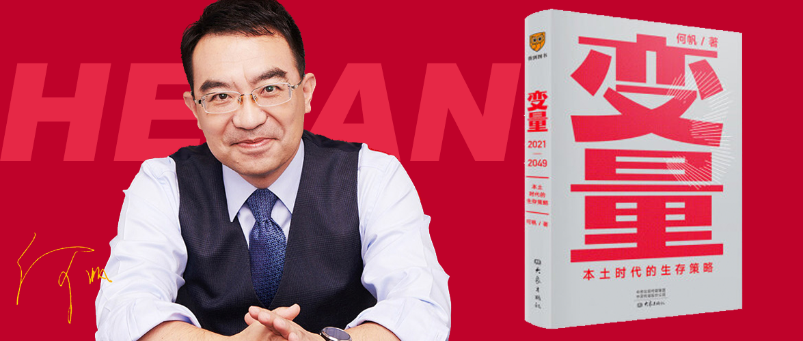

变量3
==========================

本土时代的生存策略

作者：何帆

前言
--------------------------

2020年是时代转变的一年，我们即将进入本土时代，本土时代不是历史的倒退和封闭时代的开始，而是从过去向别人学习标准答案，到遇到新问题谁都没有标准答案，只能自己寻找解题方法的时代，你要发动自己的原生力。

全书按照以下顺序来描述这种变化：

1. 唤醒本土力量，用变形金刚式的创新，实现创造性的转化，用你最擅长的经验，应对最新的问题。
2. 在利用好外部网络的同时，要逐步构建自己的内部网络，发挥自己的优势，形成网中网。
3. 利用技术创新带领组织创新往前冲，才能加速创新。
4. 随着本土意识的逐渐兴起，会释放出一系列新的裂变，适应这些变化，坦然面对别人的非议和歧视。
5. 新冠疫情教会了我们，如何对自己好，对本国人民好。

第一章 本土时代
--------------------------

### 1.1 一座城

武汉是一个包容像涂鸦青年这样特色人群的城市；自古都是南来北往的交汇点；以长江为纽带贯穿古今；有着现代商业、传统美食和市井文化。

### 1.2 两个演员

2020年的历史舞台上有两个演员。一个是各种意外，一个是新冠病毒。

各种意外：

- 科比·布莱恩特坠机；
- 金斯伯格去世；
- 安倍晋三辞去首相职务；
- 东京奥运会延期；
- 美国黑人被警察致死引起美国混乱；
- 瑞幸因财务造假被退市；
- 孙杨被禁赛8年；
- 肖战因粉丝举报AO3导致两个亚文化之间起正面冲突；
- 全球范围内火灾、蝗灾、水灾络绎不绝；
- 亚美尼亚和阿塞拜疆在纳卡地区爆发军事冲突，无人机攻击坦克；

### 1.3 分水岭

黑死病、殖民时期的美洲瘟疫、SARS、亚洲流感、副霍乱、上海甲肝，历史总是惊人地相似，人类总是很快遗忘，但每一次疫情都没有阻止历史的前进，甚至推动了历史的变革。

如果没有新冠疫情，历史会如何演进？

1. 全球化依然会黯然退潮。民粹主义成为风潮。
2. 全球经济会继续萎靡不振。贫富差距加速扩大。全球化退潮速度加快。
3. 技术进步仍然会加速前行。互联网向传统行业渗透、人工智能、生物技术、AR、VR、MR、5G、大数据。

新冠疫情不会凭空创造出石破天惊的新事物，也不会逆转已经出现的大趋势的方向，但却能起到激化的作用。

### 1.4 本土时代

2020年只是过去全球化时代终结的一个时间点，那些习以为常的事情，那些保持过去经济增长的主要因素，都会在这一年之后发生改变。

过去对外开放是经济增长的动力，在本土时代，靠近消费者，利用市场的力量诱导技术创新与之同行也能带动经济增长。

全球化和本土化只是两个交替进行的时代而已，就像冰川期和间冰期一样。

### 1.5 新物种

生物的演化因为环境的变化而变化，产生新物种，经济的变化也一样。当美国决意和中国脱钩的时候，我们要学会做第一批两栖动物。

像芯片、互联网、数据应用、物流行业、内陆城市，这些都会迎来新的改变。

### 1.6 三种能力

当遇到突如其来的灾难的时候，我们需要具备三种能力：

1. 反省力：需要我们跳出框架，从另一个角度审视自己熟悉的生活，敢于打破常规，解构日常生活的意义。
2. 忘却力：不会长久地沉湎于往日的痛苦和惊慌，将积极的和消极的回忆分离，把消极的回忆妥妥地放在盒子里收藏好，带着积极的回忆重新上路。
3. 叙事力：常见的叙事方式有三种：
    - 受难者模式：总是设法归因，撇清责任。
    - 英雄模式：希望有英雄出现，拯救一切。
    - 重建模式：向前看而不是向后看，设定更高的目标，重建未来。

本书将以“重建模式”来回答本土时代的那五个修炼难题。这个重建模式，或许能够唤醒你内心埋藏得最深的能量，同时让你和千万个有共同经历的人形成共鸣。

第二章 变形金刚
--------------------------

### 2.1 对抗风险的力量

面对复杂的新冠病毒，当遇到外部冲击的时候，求天求地，还不如求自己。你最能依赖的就是自己的自愈能力，这种自愈能力来自你经历的所有磨难，以及你的父辈、祖辈经历的所有磨难（遗传的免疫能力）。你经历的风险越多，就越能提高自己应对风险的能力。这时候，想起过去的种种挫折、种种不幸、所有的烦恼和悲痛，你就不会感到厌恶，也不会感到后悔，相反，你会觉得庆幸。你是由你经历的所有苦难铸造出来的。

### 2.2 悲喜剧

口罩随着疫情的出现而走俏，从无人问津到高价难求，甚至成了馈赠佳品。

生产口罩的企业应激扩大产线，却因原本不生产口罩的企业大举进入后反而出现了亏损，简单的针对疫情的进出口口罩强制标准导致那些非防疫使用的口罩出口企业反而受到了限制，正常的普通口罩出口被视为滥竽充数。

面对口罩需求的激增导致整个口罩供应链价格飞涨，甚至失控。

这种应激的反应是面对变化的自然反应，但危机的时候也可能加速混乱。

### 2.3 变形金刚

比亚迪是疫情中转型做口罩最典型的企业，简单看是一家生产汽车的企业降维“打击”口罩行业，实际上这么说并不准确。生产口罩和生产汽车不同，需要对软性材料的生产，而且是完全不同的整个产业链，同时要在极短的时间完成口罩的生产，需要强大的组织体系，这都需要“变形金刚式”的创新：一种把生产能力转化成另一种生产能力，把一套组织体系改造为另一种组织体系，把已有的管理经验移植到另一个领域，同时，在这种转化的过程中，激活一个组织内在的强大潜力。

### 2.4 强大法则

强大法则：

1. 激发：如果前面有两条路可以选，选那条更难走的路。华为面对美国制裁，从单纯设计芯片到生产芯片，从传统智能手机到云手机的思路转变都是这句话最好的例证。
2. 转化：如果遇到了新的劲敌，去武器架上找你最称手的那件兵器。演化不是设计出来的，而是尝试出来的。诸多历史（包括比亚迪生产口罩）都告诉我们，适应能力造就了恢复力。
3. 重启：一个组织也需要“断舍离”。在一段时间的运行之后，我们会发现有些事情做对了，有一些做错了，当系统陷入混乱的时候不如重启一下，可以恢复到“初始状态”，准备更好地迎接未知的挑战。

第三章 网中网
--------------------------

### 3.1 巨型网络

新冠病毒让我们重新意识到网络的力量，我们每个人都在这个巨型网络之中，以至于病毒也可以通过这个网络到达我们。我们又都因这个网络而受益。

在社会网络中，有大网络和小网络之分。

大网络就是成员之间彼此差异很大，或者说他们是异质性的成员。好处也恰在于此。由于成员来自五湖四海，他们就能传播更多的新鲜信息，建立更广泛的社会联系。很多人找到工作，或是找到对象，都是通过这种弱联系，不是通过亲朋好友之间的强联系。

小网络就是你身边的那些人，但是小网络不适合传播信息，反而可能屏蔽信息，因为你知道的，你的朋友也知道，你赞成的，你的朋友也赞成。但是小网络能建立信任，而信任是一种非常珍贵的社会资本。

耶鲁大学历史学家提摩希·史奈德（Timothy Snyder）的忠告：老朋友是你能依赖的最后依靠，而结交新朋友则是改变现状的第一步。

### 3.2 施坚雅模型

施坚雅从中国的田野调查中发现了集市超过行政区划定义了一个网络，从农村的基层市场到中间市场到中心市场，从熟人网络到陌生人网络，从简单的商品到复杂的商品，都可以通过这些网络进行连接。

它是个简单模型，难以解释复杂的社会现象，但是却可以提醒我们：你在网络中处于什么位置，决定了你的重要性。

过去，中国经济最关注的也是向外扩展，建立和全球市场的联系。如今，当我们遇到越来越多的外部冲击和不确定性时，建立内部网络的重要性显得尤为迫切。这样一张有着强联系的小网络，能够提高中国经济的稳健性，激发中国经济的原生力。

有两种办法建立这种强联系的小网络：

1. 通过交通和物流将各地经济更紧密地连接起来，并改变市场的网络结构；
2. 通过产业改造，构建出一个新的生机勃勃的本土经济生态系统，为中国经济的新物种提供更多的生态位。

### 3.3 在路上

疫情期间，每天收快递是最快乐的日子，这不禁让作者想起了跟着货车去看一看物流业。

### 3.4 物流中国

鄂州顺丰国际机场，第一个五年的建成吞吐量就超过香港机场的货邮吞吐量。在这里建设的机场将成为辐射全国的中心市场，以这里为圆心的1000公里覆盖占中国90%GDP、80%的人口和5大国家级城市群，距离世界主要城市也不过一夜之隔。来自全国各地的货物，凌晨1点左右到达武汉，4点多再飞出去，到绝大部分城市都能实现次日达。

近年来中国的内陆地区发展速度加快，甚至超过了不少沿海城市。成都、合肥、郑州、武汉、西安，甚至贵阳、乌兰察布，都成了耀眼的新星。

### 3.5 重建生态

重建中国经济的生态系统，需要三个步骤：

1. 连接：像鄂州顺丰国际机场这样的更加高效的交通网，将城市连接起来。中国的内陆地区可能会出现一种从中心到周围的“施坚雅模式”：不是先有基层市场，再向中心市场聚集；而是先有中心市场，再向基层市场扩散。
2. 协作：城市和城市之间加强协作。深圳和东莞、惠州，上海和苏州、常州，类似这样的协作，随着交通网的越来越发达，协作将打破时空界限，越来越紧密。
3. 发动：是自上而下地引导自下而上的积极性。只有发动群众，团结更多的支持者，才能把自己变成网络的中心节点。

### 3.6 开辟鸿蒙

华为鸿蒙系统在美国制裁下提前诞生了，它原本是为了万物互联的市场而准备的，它所倡导的未来将催生千亿级的市场。

### 3.7 第一批上岸的鱼

2020年，互联网行业最关注的动向：

- 电商直播：市场有望突破万亿元，大约占网络零售规模的8.7%
- 自动驾驶：百度的Robo Taxi向公众开放，但体验太差，还需要安全员介入复杂场景。Google的无人驾驶公司Waymo开放了没有安全员的完全自动驾驶出行服务。特斯拉的FSD（Full Self-Driving）全自动驾驶系统Beta版也开始向部分用户推送。
- 5G：5G套餐选择少、费用高、杀手级应用缺少、中低端手机不够丰富。

这些新技术虽然看起来都还不成熟，但也预示着新的技术革命的到来，未来制造业将像现在的农业一样只需要20%的人口，工作会发生变化、城市会发生变化。

第一条上岸的鱼可能会死于烈日暴晒，第一批上岸的鱼却有可能建立自己的新王国。抢滩的策略是先建网中网，让自己活下来，再发动群众，建立根据地，等到有一天，一片一片的根据地连接在一起，就可以发动“农村包围城市”的进攻。

在这个过程中，技术不是最重要的，利益的分配比技术更有挑战性。

第四章 兔子，快跑
--------------------------

### 4.1 倒金字塔

居委会是居民自行选举的结果，既不是政府机构，也没有上级单位，他们的日常是解决社区中的各种琐事，生活中的科斯定理，他们不像国家治理中自顶向下的金字塔结构，而是像大树根茎般与环境协同进化，面对问题解决问题的组织形态。它们是介于政府和物业之间的模糊地带，也是疫情中不可或缺的组成部分。

### 4.2 微光

微光是武汉的一个志愿者车队的名字，在疫情期间有很多这样的自发的志愿者车队加入到物流配送中，除了自发的还有政府组织的志愿者车队，他们都极大地为武汉抗疫提供了帮助。

### 4.3 瀑布、喷泉和地下水

疫情发生之后，房产中介干了物业的活儿，物业干了居委会的活，居委会干了快递的活，社区中的热心人成了社区电商的主力，社区成了社会最活跃的单元。

疫情过后，商业创新、公益活动和社区治理都会出现变化：

- 商业创新：像瀑布，找到机会，就会爆发。
- 公益活动：像喷泉，疫情来了突然就热情高涨，疫情过去可能就消失了。
- 社区治理：像地下水，默默地深埋地底，也需要我们去保护好。

### 4.4 通行证

随着疫情的发展，健康码也出现了不同的迭代，从繁琐的健康认证流程，一直演化到到现在的常用版本，很多城市也都有了自己的健康码，这些看似简单的程序，后台是强大数据的支持，是政府数据的部分公开，也是对社会治理的一次升级，健康码带来了健康的同时也引入了新的社会问题，有公司提出要将个人数据也加入健康码的范畴，引来了一片哗然，有公司想要将健康码扩展到文明行为的监督上，又引起了嘘声一片。

疫情推动这数据在社会中的应用，而这些数据使用的公共问题则是新的研究范畴。

### 4.5 兔子，快跑

兔子是对马拉松配速员的绰号，在技术创新和组织创新中，技术创新就是这只兔子，而组织创新就是参加马拉松的其他队员。技术创新能加速组织创新。技术是从组织中产生的，也会应用于组织之中。当组织变革落后于技术创新的速度时，技术创新会拉组织变革一把。技术创新会为组织赋能，提高组织的效率，激发组织的活力。这相当于技术创新一次次地把组织创新所走的直线路径拉高，从而缩小了两者之间的差距。

### 4.6 C型弯道

2020年10月7日，美国对谷歌、苹果、亚马逊和脸书的反垄断调查报告。2020年11月2日，中国银行保险监督管理委员会会同央行发布《网络小额贷款业务管理暂行办法（征求意见稿）》，规范小额贷款公司网络小额贷款业务，统一监管规则和经营规则。同一天，中国人民银行、中国银保监会、中国证监会、国家外汇管理局对蚂蚁集团实际控制人马云、董事长井贤栋、总裁胡晓明进行了监管约谈。这些都反映了技术创新所累积的一些社会问题。

第一次工业革命技术进步，把人变成了机器，激化了社会矛盾，带来了工会的出现，政府摸索出了一套福利国家的制度。

第二次产业革命伴随电的使用，带来了20世纪20年代的繁华盛景，也触发了1929年的大萧条，以及随后的30年代大萧条，带来了第二次世界大战。后来催生了反垄断法，通过了《格拉斯-斯蒂格尔法案》。

第三次产业革命是互联网，推动了全球化，把整个世界更紧密联系在了一起。但是随之而来的网络泡沫，金融危机的出现，至今这些影响还未完全消除。

技术进步的速度超过了社会调整的速度，就会出现“市场质量”的退化。虽然产品质量仍有改善，但竞争的质量、信息的质量却会恶化。我们不知道企业在竞争的时候是否遵循了公正、诚实的原则，我们也不知道企业是否隐瞒了至关重要的信息。如果“市场质量”持续恶化，技术创新最终也难乎为继。

我们正在拐入一条C型弯道。不要着急，不要抢道，沿着这条C型弯道，技术创新将迂回而谨慎地到达最终的目的地。

第五章 成长的烦恼
--------------------------

第六章 相信奇迹的人
--------------------------
