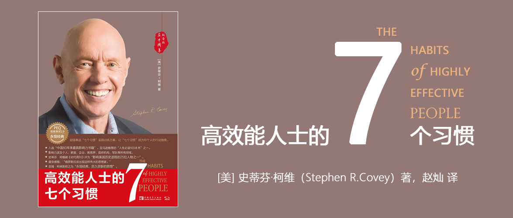

# 高效能人士的七个习惯（30周年纪念版）

[美] 史蒂芬·柯维（Stephen R.Covey） 著

## 说明

本文为阅读过程中，在电子书中划线的重点，它并非行文流畅的总结性文字，但作为一个记录，依然有价值。

## 划线笔记

《高效能人士的七个习惯 (30周年纪念版)：打造一套全新的思维方式和原则体系 = The 7 Habits of Highly Effective People 30th Anniversary Edition ([美] 史蒂芬 · 柯维》

史蒂芬·柯维, SoBooKs.cc
105个笔记

序言

◆ 柯维首先写的是“塑造性格”而不是“获得成功”，因此，不仅要帮助人们变成高效能人士，还要能成为更好的领导者。

◆ 我领悟到西点军校培训的关键点在于：伟大的领导始于塑造性格，要做一个领导首先你要知道自己是谁，这是你做事的基础。如何塑造领导？你要先塑造自己的个性。《高效能人士的七个习惯》不只发挥个人效能，而且培养领导力。

柯维家族致一位高效能的父亲

◆ 父亲一直提倡“积极主动”，让我们苦恼的是，从小到大，父亲绝不允许我们从环境、朋友或老师那里为我们的困难或问题找借口，抑或推卸责任，父亲教我们要么“顺其自然”要么“换种回应方式”。

◆ 父亲的“R （足智多谋resourcefulness） & I （采取主动initiative）”原则十分经典。一次他遇上交通堵塞，差点误了飞机。父亲觉得不能再坐视不管，他告诉司机他要下车指挥交通，这样道路就会通畅，然后司机再在路口接他。司机震惊了，“你不能那样做！”他说。父亲则开心地回答：“看我的。”下了车，他真的开始指挥交通，路上的车果然开始移动（司机们都欢呼雀跃，为父亲叫好），最后父亲上了出租车，并且赶上了飞机。

◆ 父亲给领导力下了一个很美的定义：领导力就是清晰地指出别人的价值和潜力，使对方受到鼓舞从而有所意识。

2004版前言

◆ 稍加思索，你就会发现，别人在诉说时，你并非努力聆听并试图理解对方，而常常是忙于思考自己接下来该怎么说。而影响力的初显，始于他人发觉你正在受他们影响。当对方感觉你敞开心扉，虔诚地聆听，并理解他们的时候，他们就感觉自己有了影响力。

第一章 由内而外全面造就自己

◆ 此时我们才开始觉悟：要改变现状，首先要改变自己；要改变自己，先要改变我们对问题的看法。

◆ 那人抬起眼看我，如梦初醒般轻声说：“是啊，我是该管管他们。他们的母亲一小时前过世了，我们刚从医院出来。我手足无措，孩子们大概也一样吧。”

◆ 球技和琴艺如何，很容易判断，可品德和情感就不一样了。在陌生人或同事面前，我们可以伪装得很好，暂时蒙混过关，至少不会被当众拆穿，可能连自己都被骗了。但我相信，多数人都知道自己骨子里到底什么样，而且与自己共同生活和工作的人也心知肚明。 				我在企业界看过太多投机取巧的例子，那些主管试图通过激昂的演说、微笑训练、外界干预或是接管、收购以及善意或恶意的并购，来“购买”一种新的企业文化，从而达到提升生产力水平、质量水平、道德水平以及服务水平的目的，但却忽略了玩弄权术会让信任度低下的事实。一旦发现这些并不奏效，他们就转而求助于其他个人魅力的技巧，却从不尊重和遵循自然法则与成长历程，而这些恰恰是高度互信的企业文化的基础。

◆ 或许女儿需要先经历拥有，然后才会付出。（事实上，我自己在未曾拥有的时候，又何曾付出？）她希望从我这个情感应该更加成熟的父亲身上得到这种经历。

◆ 或许只有真正经历过拥有，才会真正懂得分享。许多人在家庭或婚姻中只知机械式地付出，或者拒绝付出和分享，可能正是由于他们从未体验过拥有，而且缺乏自我认同和自尊。所以教育孩子应该要有充分的耐心让他们体会拥有的感觉，同时用足够的智慧告诉他们付出的价值，另外还要以身作则。

◆ 对于那些坚守原则的个人、家庭和团体，一旦有好事发生，总会让人好奇不已。人们会羡慕他们的个人能力和成熟魅力，家人的团结合作，以及组织内部协同一致的企业文化。一般人往往会立刻提出问题：​“你们是怎么做到的？教我一些技巧吧。​”这也反映出普通人的基本思维方式，其实他们真正想问的是，​“有没有能快速让我脱离现状、摆脱痛苦的诀窍？​”这种人最终能找到满足他们需求和教会他们方法的人，短期来看，技巧和诀窍似乎很管用，实际作用却和阿司匹林、创口贴一样，只能缓解一时之痛。

◆ 有没有可能老板看待员工的方式就是管理不善的原因？

◆ 2025/11/12发表想法

由内而外是发自本心的，由外而内则是那些用“套路、方法”伪装的，后者短期内看起来有效，但是却难以持久。

原文：“由内而外”的意思是从自身做起，甚至更彻底一些，从自己的内心做起，包括自己的思维方式、品德操守和动机。

◆ “由内而外”的意思是从自身做起，甚至更彻底一些，从自己的内心做起，包括自己的思维方式、品德操守和动机。

付诸行动

◆ 显然，如果我们只想让生活发生相对较小的变化，我们可以把注意力集中于自己的态度和行为。但是，如果我们想让生活发生实质性的变化，我们必须关注自己的思维方式—我们观察自己和周围世界的方式。

第二章 七个习惯概论

◆ 本书将习惯定义为“知识”​、​“技巧”与“意愿”相互交织的结果。

◆ 生理上无法独立（瘫痪或残疾）的人需要别人帮助；情感上不能独立的人，其价值和安全感都来自他人的看法，一旦无法取悦别人便会极度沮丧；智力上无法独立的人需要他人帮忙思考和解决生活中的大小问题。相反地，生理上独立的人可以自食其力；智力上独立的人可以有自己的思想，兼具想象、思考、创造、分析、组织与表达的能力；情感上独立的人信心十足，能自我管理，不因他人好恶而影响自我价值评价。

◆ 人生本来就是高度互赖的，想要单枪匹马实现最大效能无异于缘木求鱼。

◆ 互赖是一个更为成熟和高级的概念。生理上互赖的人，可以自力更生，但也明白合作会比单干更有成效；情感上互赖的人，能充分认识自己的价值，但也知道爱心、关怀以及付出的必要性；智力上互赖的人懂得取人之长，补己之短。一个能做到互赖的人，既能与人深入交流自己的想法，也能看到他人的智慧和潜力。但只有独立的人才能选择互赖，尚未摆脱依赖性的人则无此条件，因为他们无论在品德还是在自我把握方面都尚有欠缺。

◆ 伊索寓言中有一则关于鹅生金蛋的故事，足以说明这个常遭违背的原则。一个穷困的农夫，有一天在他的鹅圈里发现一个闪闪发光的金蛋。开始他以为这是个恶作剧，正准备把金蛋扔掉的时候，他转念一想决定拿去验证一下。结果鹅蛋竟然是纯金的！农民简直不敢相信自己会有这样的好运。第二天他越发怀疑，跑到鹅圈一看，还是和昨天一样。此后他每天早上一睁眼，就去鹅圈拿金蛋。不久他就成了富翁，一切都那么不可思议。可是财富却使他变得贪婪又急躁，已无法满足于每天一个金蛋，于是他异想天开地把鹅宰杀，想将鹅肚子里的金蛋全部取出。谁知打开一看，鹅肚子里并没有金蛋。鹅死了，再也无法得到金蛋。而毁掉这一切的，正是农民自己。这则寓言中蕴含了一个自然法则，即效能的基本定义。许多人都用金蛋模式来看待效能，即产出越多，效能越高。而真正的效能应该包含两个要素：一是“产出”​，即金蛋；二是“产能”—生产的资产或能力，即下金蛋的鹅。在生活中“重蛋轻鹅”的人，最终会连这个产金蛋的资产也保不住。反之，​“重鹅轻蛋”的人，最后自己都可能会被活活饿死，更不用说鹅了。

◆ 2025/11/12发表想法

内卷，其实也是一种相似的行为。让在岗的员工干到根本不想再干，然后还得再招个人重头开始。

原文：急功近利常常会毁掉宝贵的物质资产。保持产出与产能的平衡会帮助你更有效地利用物质资产。

◆ 急功近利常常会毁掉宝贵的物质资产。保持产出与产能的平衡会帮助你更有效地利用物质资产。

◆ 我们最宝贵的金融资本就是赚钱的能力。如果不能持续投资以增进自己的产能，眼光就会受到局限，只能在现有的职位上踏步，每天忙忙碌碌，就怕老板对自己的印象不佳，既在经济上受制于人，又担心职位不保。这同样称不上效能。

◆ 有些公司一方面大谈顾客至上，另一方面却完全忽略为顾客提供服务的员工。产出与产能平衡的原则告诉我们：你希望员工怎样对待顾客，就要怎样对待员工。

◆ 在一次集体活动中有人问我：​“怎样对付那些懒散、不称职的员工？​”一位仁兄回答：​“投几颗手榴弹！”有几个人颇附和这种霸权式的主张—“不好好干就走人。​”接着又有一个人问：​“谁来收拾残局呢？​”“不会有残局。​”“那你怎么不这样对待顾客呢？‘不想买就滚蛋！’”“那怎么行呢？​”“那这样对待员工就行吗？​”“因为他们是我雇来的。​”“原来如此。请问你的员工是否忠心耿耿？是否勤奋工作？人员流动率如何？​”“开什么玩笑？现在根本找不到得力助手，人人都想请假、兼职、跳槽，对公司毫不在乎。​”

◆ 再比如，你强迫别人按你的意志行事，结果却发现你们的关系变得空洞无物；反过来，如果你能用时用心经营人际关系，就能赢得信任与合作，通过开诚布公的交流获得实质性的进展。

第三章 习惯一 积极主动——个人愿景的原则

◆ 事实上，我们如果不能客观地考虑看待自己的方式，也就不能理解他人感知他们自己和世界的方式。因此我们无意间就会把个人意愿强加在别人身上，内心却还觉得已经很客观了。

◆ 然而，这些零星的评语不一定代表真正的你，与其说是影像，不如说是投影，反映的是说话者自身的想法或性格弱点。

◆ 这三种地图都以“刺激—回应”理论为基础，很容易让人联想到巴甫洛夫（Pavlov， 1849~1936，曾获1904年诺贝尔生理学医学奖—译者注）所做的关于狗的实验。其基本观点就是认为我们会受条件左右，以某一特定方式回应某一特定刺激。（见图3-1）

◆ 弗兰克尔在狱中发现了人性的这个基本原则，并用其绘成了一幅精准无误的地图（见图3-2）​，由此发展出高效能人士在任何环境中都应具备的、首要的，也是最基本的习惯—“积极主动（Be Proactive）​”​。

◆ 积极主动是人类的天性，即使生活受到了外界条件的制约，那也是因为我们有意或无意地选择了被外界条件控制，这种选择称为消极被动（Reactive）​。这样的人很容易被天气状况所影响，比如风和日丽的时候就兴高采烈，阴云密布的时候就无精打采。而积极主动的人则心中自有一片天地，无论天气是阴雨绵绵还是晴空万里，都不会对他们产生影响，只有自己的价值观才是关键因素。如果认定了工作第一，那么即使天气再坏，敬业精神依旧不改。

◆ 埃莉诺·罗斯福（Eleanor Roosevelt，美国小罗斯福总统的夫人—译者注）曾说：​“除非你愿意，否则没人能伤害你。​”圣雄甘地（Gandhi）也曾经说过类似的话：​“除非拱手相让，否则没人能剥夺我们的自尊。​”可见最刻骨铭心的伤害并非悲惨遭遇本身，而是我们竟然会放任这些伤害戳在我们心上。

◆ 弗兰克尔曾指出人生有三种主要的价值观，一是经验价值观（Experiential Value）​，来自自身经历；二是创造价值观（Creative Value）​，源于个人独创；三是态度价值观（Attitudinal Value）​，即面临绝症等困境时的回应。这三种价值观中，境界最高的是态度价值观。我多年的经验证明，这种说法的确有道理。逆境往往能激发思维转换，使人以全新的观点看待世界、自己与他人，审视生命的意义，进而思考应该如何回应，这种更宽广的视角反映的就是可以提升和激励所有人的态度价值观。

◆ 我经常建议有意跳槽的人采取更多主动，不妨做几个关于兴趣和能力的测验，研究自己心仪行业的状况，甚至思考自己的求职单位正面临何种难题，然后以有效的表达方式，向对方证明自己能够协助他们解决问题。这就是“解决方案式的推销（自己）​”​（Solution Selling）​，是事业成功的重要诀窍之一。

◆ 由于个人的成熟度不同，对尚处于情绪依赖阶段的人，不必期望太高。但至少可以创造有利的气氛，逐渐培养他的责任感。

◆ “老兄，爱是一个动词，爱的感觉是爱的行动所带来的成果，所以请你爱她，为她服务，为她牺牲，聆听她心里的话，设身处地为她着想，欣赏她，肯定她。你愿意吗？​”在所有进步的社会中，爱都是代表动作，但消极被动的人却把爱当作一种感觉。好莱坞式的电影就常灌输这种不必为爱负责的观念—因为爱只是感觉，没有感觉，便没有爱。事实上，任由感觉左右行为是不负责任的做法。

◆ 他们专心做自己力所能及的事，他们的能量是积极的，能够使影响圈不断扩大

◆ 反之，消极被动的人则全神贯注于“关注圈”​，紧盯他人弱点、环境问题以及超出个人能力范围的事不放，结果越来越怨天尤人，一味把自己当作受害者，并不断为自己的消极行为寻找借口。

◆ 时刻想着“我可以”而不是“如果”​，

◆ 对待错误的积极态度应是马上承认，改正并从中吸取教训，这样才能真正反败为胜。正如俗语说“失败是成功之母。​”如果犯了错却不肯承认和改正，也不从中吸取教训，等于错上加错，自欺欺人。文过饰非、强词夺理无异于一错再错，结果是越描越黑，给自己带来更深的伤害。

◆ 实际上伤我们最深的，既不是别人的所作所为，也不是自己所犯的错误，而是我们对错误的回应。就仿佛被毒蛇咬后，一心忙着抓蛇只会让毒性发作更快，倒不如尽快设法排出毒液。

◆ 积极主动的本质和最清晰的表现就是对自己或别人有所承诺，然后从不食言。

◆ 两种能够直接掌控人生的途径：一是做出承诺，并信守诺言；二是确立目标，并付诸实践。即便只是承诺一件小事，只要有勇气迈出第一步，也有助于培育内心的诚信，这表示我们有足够的自制能力、勇气和实力承担更多的责任。一次次做出承诺，一次次信守诺言，终有一天我们会克服情绪的掣肘，获得人生的尊严。

第四章 习惯二 以终为始——自我领导的原则

◆ 假设你正在前往殡仪馆的路上，去参加一位至亲的丧礼。想象你开着车抵达教堂，找到车位后走下车。走进教堂，花香伴随着风琴音乐，一路上你见到好多亲友。看着他们的面孔，你能体会失去至亲的痛苦，感受这种心情，你能分享他们曾经的欢乐。到达前厅，看到棺木时，你赫然发现亲朋好友齐聚一堂，是为了向你告别，你在参加自己的葬礼。也许这是三五年，甚至许久之后的事，但是姑且假定这时亲族代表、友人、同事和社团伙伴，即将上台追述你的生平。你找到一个座位，阅读手上的葬礼程序说明，等待仪式开始。一共有四位发言嘉宾。第一位是你的亲戚，可能是你的子女、兄弟姐妹、祖父母这样的近亲，也有可能是表侄、表姐妹、叔叔婶婶等远道而来的亲戚。第二位是你的挚友，这个朋友总会使你了解自己。第三位是你的同事。第四位是牧师或者来自你曾参加的社团组织。现在请认真想一想，你希望人们对你以及你的生活有什么样的评价？你是个称职的丈夫、妻子、父母、子女或亲友吗？你是个令人怀念的同事或伙伴吗？你希望他们怎样评价你的人格？你希望他们回忆起你的哪些成就和贡献？你希望对周围人的生活施加过什么样的影响？

◆ 许多人拼命埋头苦干，到头来却发现追求成功的梯子搭错了墙，但是为时已晚，所以说忙碌的人未必出成果。

◆ 当我们了解生命中最重要的事情时，生活将会不同。头脑中要时刻牢记：每天希望自己成为什么样的人，当务之急是什么。

◆ 我们做任何事都是先在头脑中构思，即智力上的或第一次的创造（Mental/First Creation）​，然后付诸实践，即体力上的或第二次的创造（Physical/Second Creation）​。

◆ 创办企业也是如此，要想成功，必须先明确目标，根据目标来确定企业的产品或服务，然后整合资金、研发、生产、营销、人事、厂房、设备等各方面的资源，朝既定目标奋力前行。​“以终为始”往往是企业成功的关键，许多企业都败在第一次创造上—事先缺乏明确目标，以致资金不足，规划不周或对市场的解读有误。

◆ 习惯二“以终为始”的另一个原则基础是自我领导，但领导（Leadership）不同于管理（Management）​。领导是第一次的创造，必须先于管理；管理是第二次的创造，具体会在习惯三中谈到。

◆ 领导与管理就好比思想与行为。管理关注基层，思考的是“怎样才能有效地把事情做好”​；领导关注高层，思考的是“我想成就的是什么事业”​。用彼得·德鲁克（Peter Drucker）和华伦·贝尼斯（Warren Bennis）的话来说就是：​“管理是正确地做事，领导则是做正确的事。​”管理是有效地顺着成功的梯子往上爬，领导则判断这个梯子是否搭在了正确的墙上。

◆ 再成功的管理也无法弥补领导的失败，而领导难就难在常常陷于管理的思维方式难以自拔。

◆ 但是根据我多年来担任婚姻顾问的经验，事情却向着另一个方向发展。很多以配偶为中心却即将破碎的婚姻都源于一条导火索，那就是情感过度依赖。

第五章 习惯三 要事第一——自我管理的原则

◆ 还有一些人将大部分时间花在紧急但并不重要的第三象限事务上，却自以为在致力于第一象限事务。他们整天忙于应付自认为十分重要的紧急事件，殊不知紧急之事只是别人的要事，对别人重要，对自己就不一定了。​（见图5-2）

◆ 因此，不论大学生、生产线上的工人、家庭主妇，抑或企业负责人，只要能确定自己的第二象限事务，而且即知即行，一样可以事半功倍。在时间管理领域称之为帕雷托原则（Pareto Principle） —以20％的活动取得80％的成果。

◆ 对人不可讲效率，对事才可如此。对人应讲效用，即某一行为是否有效。

◆ 第四代个人管理理论的特点，在于承认人比事更重要。而芸芸众生中，首要顾及的便是自己。

◆ 有一条主线贯穿这五个方面，那就是将人际关系和结果放在第一位，将时间放在第二位。

◆ 授权是事必躬亲与管理之间的最大分野。

◆ 授权基本上可以划分成两种类型：指令型授权和责任型授权。

◆ 因为他们的关注重点是方法，他们自己为最后的结果负责。

◆ 责任型授权责任型授权的关注重点是最终的结果。它给人们自由，允许自行选择做事的具体方法，并为最终的结果负责。起初，这种授权方式费时又费力，但却十分值得。通过责任型授权，可将杠杆的支点向右移动，提高杠杆的作用。这种授权类型要求双方就以下五个方面达成清晰、坦诚的共识，并做出承诺。预期成果双方都要明确并理解最终的结果。要以“结果”​，而不是以“方法”为中心。要投入时间，耐心、详细地描述最终的结果，明确具体的日程安排。指导方针 确认适用的评估标准，避免成为指令型授权，但是一定要有明确的限制性规定。不加约束的放任，其最终结果只能是扼杀人们的能动性，让人们回到初级的指令型要求上：​“告诉我你想要我做什么，我照做就是了。​”事先告知对方可能出现的难题与障碍，避免无谓的摸索，但不要告诉做什么。要让他们自己为最后的结果负责，明确指导方针，放手让他们去做。可用资源 告知可使用的人力、财物、技术和组织资源以取得预期的成果。责任归属 制定业绩标准，并用这些标准来评估他们的成果。制订具体的时间表，说明何时提交业绩报告，何时进行评估。明确奖惩 明确告知评估后的结果—好的和不好的—包括财物奖励、精神奖励、职务调整以及该项工作对其所在组织使命的影响。

◆ 信任是促使人进步的最大动力，因为信任能够让人们表现出自己最好的一面。但这需要时间和耐心，而且还有可能需要对人员进行必要的培训，让他们拥有符合这种信任水平的能力。

◆ 成功的授权也许是有效管理的最好体现，因为不管是对个人还是对组织，有效授权都是发展成长的最基本因素。

付诸行动

◆ 成功人士习惯去做失败者不爱做的事。他们当然也不喜欢干这些事，但他们让这种不喜欢服从于对自己目标的追求。

第六章 人际关系的本质

◆ 所谓情感账户，储存的是增进人际关系不可或缺的“信赖”​，也就是他人与你相处时的一份“安全感”​。能够增加情感账户存款的，是礼貌、诚实、仁慈与信用。

◆ 我们都知道银行账户就是把钱存进去，作为储蓄，以备不时之需。情感账户里储蓄的是人际关系中不可或缺的信任，是人与人相处时的那份安全感。能够增加情感账户存款的，是礼貌、诚实、仁慈与信用。这使别人对我更加信赖，必要时能发挥相当的作用，甚至犯了错也可用这笔储蓄来弥补。有了信赖，即使拙于言辞，也不致开罪于人，因为对方不会误解你的用意。所以信赖可带来轻松、坦诚且有效的沟通。反之，粗鲁、轻蔑、威逼与失信等等，会减少情感账户的余额，到最后甚至透支，人际关系就得拉警报了。

◆ 这就仿佛如履薄冰，不得不谨言慎行，察言观色。到处都弥漫着紧张的空气，步步为营，处处设防。事实上很多团体、家庭和婚姻中都充斥着这种气氛。如果没有追加的储蓄来维持较高的信用度，婚姻关系就会恶化。好一点的同床异梦，勉强生活在同一屋檐下，各自为政。恶劣一点的则恶言相向、大打出手，甚至劳燕分飞。越是持久的关系，越需要不断的储蓄。由于彼此都有所期待，原有的信赖很容易枯竭。

◆ 你是否有过这种经验，偶尔与老同学相遇，即使多年未见，仍可立刻重拾往日友谊，毫无生疏之感，那是因为过去累积的感情仍在。但经常接触的人就必须时时投资，否则突然间发生透支，会令人措手不及。

◆ 这种情形在青春期子女身上尤其明显。如果亲子交谈的内容不外乎“该打扫房间啦，扣好衬衫的扣子，用功读书，把收音机音量开小一点，别忘了倒垃圾”等等，情感账户很快就会透支。于是，当你的儿子面临人生重大抉择的时候，他不会敞开心扉接受你的建议，因为你在他那里的信用度太低，你们之间的交流是封闭的、机械式的。尽管你睿智而又博学，可以助他一臂之力，但是就因为你已经透支，他不会为了你短期性的感情投资而影响自己的决定，结果可能是长期的负面影响。

◆ 千万不要这样去指责他：“我们为你做了那么多，牺牲了那么多，你怎么这么没良心？我们想要做得好一点，你这叫什么态度？真是太不像话了！”

◆ 很多人都倾向于主观臆断他人的想法和需要，觉得在自己身上适用的感情投资，一定也适用于他人。一旦发现结果并不如自己所期望的那样，就会觉得自己一片好意成了空，变得心灰意冷起来。黄金定律说：想要别人怎样待你，就要怎样待人。字面意思是你对待他人的方式最终会被返还给自己，但我认为其内涵是，如果你希望别人了解你的实际需要，首先要了解他们每一个人的实际需要，然后据此给予帮助和支持。正如一个成功养育了几个孩子的家长所言：​“区别对待他们，才是平等的爱。​”

◆ “怎么啦？孩子，有什么不对吗？​”他转过头来，有点不好意思地问：“爸，如果我也觉得冷，你会不会也脱下外套披在我身上？​”那天晚上我们一起做了那么多事，可是在他看来，最重要的却是我不经意间对他弟弟流露出的父爱。这件事无论在当时还是现在，对我来说都是深刻的教训。人的内心都是极其柔弱和敏感的，不分年龄和资历。哪怕是在最坚强和冷漠的外表下，也往往隐藏着一颗脆弱的心。

◆ 联合国前秘书长哈马舍尔德（Dag Hammarskjold）曾说过一句发人深省的名言：​“为一个人完全奉献自己，胜过为拯救全世界而拼命。​”

第七章 习惯四 双赢思维——人际领导的原则

◆ 公众领域的成功并非意味着压倒旁人，而是通过成功的有效交往让所有参与者获利，大家一起工作，一起探讨，一起实现单枪匹马无法完成的理想，这种成功要以知足心态为基础。

◆ 关系确立之后，就需要有协议来说明双赢的定义和方向，这种协议有时被称为“绩效协议”或“合作协议”​，它让纵向交往转为水平交往，从属关系转为合作关系，上级监督转为自我监督。

◆ 传统权威型监督以赢/输为模式，是情感账户透支的结果。正因为对预期结果缺乏信任和共识，才不得不一遍遍地检查和指示，没有信任，就想对下属时时操控。如果信任存在，你会怎样做呢？对他们放手，只要事先制订双赢协议，让他们知道你的期望，接下来只要扮演好协助与考核的角色就好。自我评估更能激励人上进。在高度信任的文化氛围里，自我评估的结果更精确，因为当事人往往最清楚实际进度，自我洞察远比旁人的观察和测量要准确。

◆ 有四种管理者或家长都可以掌控的奖惩方法：金钱、精神、机会以及责任。其中金钱奖惩包括薪资、股份、补贴的增减；精神奖惩包括认同、赞赏、尊敬、信任或者相反—除非温饱没有保障，不然精神奖励的价值通常超过物质奖励；机会奖惩包括培训、进修等；责任奖惩一般同职务有关，比如升职或者降职。

◆ 我曾为中东一家大型房地产公司工作，第一次接触是在他们的年度表彰大会上，有八百多名销售人员参加。现场热闹非凡，还有乐队助兴，不时传出兴奋的尖叫声。在参会的八百多名员工中，有大约四十人因为业绩出色而获得奖励，奖项包括“销售最多”​、​“收入最多”​、​“佣金最高”等等，在掌声雷动和欢呼雀跃中，这四十个人无疑是赢家，而另外七百六十个人则在品味失败。

◆ 哈佛法学院的教授罗杰·费舍（Roger Fisher）和威廉·尤利（William Ury）在二人合作出版的《走向共识》一书中建议在谈判中坚持“原则”​，而不是“立场”​。虽然他们并没有使用“双赢”一词，但是倡导的精神和本书不谋而合。他们认为原则性谈判的关键是要将人同问题区分开来，要注重利益而不是立场，要创造出能够让双方都获利的方法，但不违背双方认同的一些原则或标准。

第八章 习惯五 知彼解己——移情沟通的原则

◆ 如果要让我用一句话总结人际关系中最重要的一个原则，那就是：知彼解己。这是进行有效人际沟通的关键。

◆ 如果你要和我交往，想对我有影响力，你首先要了解我，而做到这一点不能只靠技巧。如果我觉察到你在使用某种技巧，就会有受骗和被操纵的感觉。我不知道你为什么这样做，有什么动机。你让我没有安全感，自然也不会对你敞开心扉。你的影响力在于你的榜样作用和引导能力，前者源于你的品德，是你的真我，别人的评论或者你希望别人如何看你都没有意义，我在同你的交往中已经清楚了解了你。你的品德时刻发挥着影响力，并起着沟通的作用。久而久之，我就会本能地信任或者不信任你这个人以及你对我所做的事情。如果你与人交往忽冷忽热，时而刻薄时而亲切，或者表里不一，很难让人敞开心扉。如果我需要收获爱和影响力，我觉得把想法、经历和真实感受暴露在你面前没有安全感。谁能预料会发生什么呢？但除非我开诚布公，或者你真的理解我以及我的特殊处境和感受，否则你也不知道如何建议和开导我。尽管你说的是对的，但是无法引起我的共鸣。你会说你真的在意、欣赏我，我也极想相信，但是假如你不了解我，又怎么会欣赏我？这种空洞无物的赞美是不可信的。

◆ “知彼”是交往模式的一大转变，因为我们通常把让别人理解自己放在首位。大部分人在聆听时并不是想理解对方，而是为了做出回应。这种人要么说话，要么准备说话，不断地用自己的模式过滤一切，用自己的经历理解别人的生活。“是的，我知道你的感受。​”“我也有过类似的经历，我的经验是……”他们总是把自己的经验灌输给别人，用自己的眼镜给每一个人治疗。

◆ 事实上，大部分人都是这么自以为是。我们的聆听通常有层次之分。一是充耳不闻，压根就不听别人说话；二是装模作样， “是的！嗯！没错！”​；三是选择性接收，只听一部分，通常学龄前儿童的喋喋不休会让我们采取这种方式；四是聚精会神，努力听到每一个字。但是，很少有人会达到第五个层次，即最高层次—移情聆听。

◆ 移情聆听是指以理解为目的的聆听，要求听者站在说话者的角度理解他们的思维方式和感受。

◆ 除了物质，人类最大的生存需求源自心理，即被人理解、肯定、认可和欣赏。

◆ 销售方面也是这样。平庸的业务员推销产品，杰出的业务员销售解决问题、满足需求之道。万一产品不符合客户需要，也要勇于承认。

◆ 公司总裁在谈判桌上说：​“希望您能按照您的方式草拟合同，以便我们清楚地了解您的需要和顾虑，之后再谈论价格。​”对方谈判队伍的成员有些吃惊，他们没想到能有机会自己拟定合同。三天之后合同定好了。总裁看到合同后，为确保了解对方机构的需要，他仔细审阅，理解其中的内容和思路，直到他明白了对方认为最重要的事。

第九章 习惯六 统合综效——创造性合作的原则

◆ 统合综效的基本心态是：如果一位具有相当聪明才智的人跟我意见不同，那么对方的主张必定有我尚未体会的奥妙，值得加以了解。与人合作最重要的是，重视不同个体的不同心理、情绪与智能，以及个人眼中所见到的不同世界。与所见略同的人沟通，益处不大，要有分歧才有收获。

◆ 统合综效不正好能够培养我们下一代的服务和奉献精神吗？让他们少一些防御意识、针锋相对和自私自利，多一些坦诚相待、相互信赖和慷慨大方，少一些自我封闭、自我防御、玩弄权术，多一些仁慈爱心和关心同情，少一些占有欲望和主观臆断。

◆ 所谓统合综效的沟通，是指敞开胸怀，接纳一切奇怪的想法，同时也贡献自己的见地。乍看之下，这似乎把习惯二“以终为始”弃之不顾，其实正好相反。在沟通之初，谁也没有把握事情会如何变化，最后结果又如何。但安全感与信心使你相信，一切会变得更好，这正是你心中的目标。

◆ 低层次的沟通源自低信任度，其特点是人与人之间互相提防，步步为营，经常借助法律说话，为情况恶化作打算，其结果只能是赢/输或者输/赢，而且毫无效率可言，即产出/产能不平衡，最后只能是让人们更有理由进行自我防御和保护。

◆ 中间一层是彼此尊重的交流方式，唯有相当成熟的人才办得到。但是为了避免冲突，双方都保持礼貌，但却不一定为对方设想。即使掌握了对方的意向，也不能了解背后的真正原因，也不可能完全开诚布公，探讨其余的选择路径。这种沟通层次在独立的，甚至在相互依赖的环境中尚有立足之地，但并不具创造

◆ 2025/11/23发表想法

因电子书排版原因，原文为：1+1=1.5（1又1/2）

原文：在相互依赖的环境中，最常用的态度是妥协，这意味着1+1=1，双方都有得有失。这种沟通中没有自我防御和保护，也没有愤怒和操控，有的只是诚实、坦率和尊重。但是，它不具创造性和统合综效的能力，只能引致双赢的低级形式。１2统合综效意味着1+1等于8或16，甚至1600。源自高信任度的统合综效能带来比原来更好的解决方案，每一个参与者都能认识到这一点，并全心享受这种创造性的事业。由此产生的文化氛围即使不能持久，至少也可以在当时促成产出/产能的平衡。

◆ 在相互依赖的环境中，最常用的态度是妥协，这意味着1+1=1，双方都有得有失。这种沟通中没有自我防御和保护，也没有愤怒和操控，有的只是诚实、坦率和尊重。但是，它不具创造性和统合综效的能力，只能引致双赢的低级形式。１2统合综效意味着1+1等于8或16，甚至1600。源自高信任度的统合综效能带来比原来更好的解决方案，每一个参与者都能认识到这一点，并全心享受这种创造性的事业。由此产生的文化氛围即使不能持久，至少也可以在当时促成产出/产能的平衡。

◆ 缺乏安全感的人认为所有的人和事都应该依照他们的模式。他们总想利用克隆技术，以自己的思想改造别人。他们不知道人际关系最可贵的地方就是能接触到不同的模式。相同不是统一， 一致也不等于团结，统一和团结意味着互补，而不是相同。相同毫无创造性可言，而且沉闷乏味。统合综效的精髓就是尊重差异。

◆ 个体差异的重要性从教育家里维斯（R. H. Reeves）的著名寓言《动物学校》中可见一斑。有一天，动物们决定设立学校，教育下一代应付未来的挑战。校方订立的课程包括飞行、跑步、游泳及爬树等本领。为方便管理，所有动物一律要修满全部课程。鸭子游泳技术一流，飞行课的成绩也不错，可是跑步就无技可施。为了补救，只好课余加强练习，甚至放弃游泳课来练跑。到最后磨坏了脚掌，游泳成绩也变得平庸。校方可以接受平庸的成绩，只有鸭子自己深感不值。兔子在跑步课上名列前茅，可是对游泳一筹莫展，甚至精神崩溃。松鼠爬树最拿手，可是飞行课的老师一定要他自地面起飞，不准从树顶下降，弄得他神经紧张，肌肉抽搐。最后爬树得丙，跑步更只有丁等。老鹰是个问题儿童，必须严加管教。在爬树课上，他第一个到达树顶，可是坚持用最拿手的方式，不理会老师的要求。到学期结束时，一条怪异的鳗鱼以高超的泳技，加上能飞能跑能爬的成绩，反而获得平均最高分，还代表毕业班致词。另一边，地鼠为抗议学校未把掘土打洞列为必修课，而集体抗议。他们先把子女交给獾做学徒，然后与土拨鼠合作另设学校。

◆ 我经历过几次这样的谈判：谈判双方剑拔弩张，纷纷聘请律师为自己辩护。大家明知道法律程序的介入会让人际关系日益恶化，让问题变得更加复杂，但是超低的信任度让双方都觉得已经别无选择。“您想不想找到一种双赢的解决方案来让双方都好过一些？​”我这样问。对方通常都会给予肯定的答复，但是大部分人又同时怀疑这种结果的可能性。“如果对方也同意的话，你愿意和他们来一次真正的交流吗？​”他们对这个问题的回答通常也都是肯定的。于是，几乎每一个这种案子的结局都让人瞠目结舌—在法庭上和心理上纠缠了几个月的问题只用了几个小时或者几天的时间就解决了。这种统合综效的结果不同于通过法律途径实现的和解方案，它好过任何一方最初的提议。而且，不论双方原来的关系有多么恶劣，彼此的信任有多么淡薄，通常都能在问题解决之后继续友好交往。

第十章 习惯七 不断更新——平衡的自我提升原则

◆ 歌德（Goethe）说：​“以一个人的现有表现期许之，他不会有所长进。以他的潜能和应有成就期许之，他定能不负所望。​”

第十一章 再论由内而外造就自己

◆ 基本规则也已经确立：一是不要刨根问底，二是如果一方或双方感到痛苦就搁置话题。

◆ 几代同堂的和睦家庭可能蕴含着最富有成效、回报最高、最令人满意的相互依赖关系，许多人都能感觉到这种关系的重要性。想想我们在多年前对电视系列片《根》是多么着迷，事实上我们所有人都有自己的根，也有溯根和认祖归宗的本能。

对史蒂芬·柯维博士的最后一次访问

◆ 假如你工作中被当作控制狂，你意识到自己需要学会信任并且不能样样都管，很简单，你只需重新定义自己的角色，也许你将看到不同的自己——有时是“主管”，有时是“顾问”——角色的转换和思想的转变，会让你把自己当作团队的顾问，成员们就有权做出决定。如此一来，他们只需要向你咨询，你不必独揽大权还要不停地跟踪进度。

◆ 我主要的注意力都集中在用“七个习惯”培养整体文化氛围，改变由工业时代形成的自上而下管理控制的思维方式。 				工业时代仍然影响着我们的思想。那时候人像物品一样被控制。一种思维方式是人可以被取代，人和人之间没有区别，但是我们都知道每个人都有特殊的天赋并且能做出无可替代的贡献。财务报表把人当作消费品，而不是最有利的资源。即使你是一个仁慈的独裁者，你仍然是在控制，这也是当下很多机构都有的缺陷。 				“七个习惯”能够改变这个现状。“七个习惯”系统下，每个人都被赋予权利参与其中，每个员工在这种文化中都有无穷的价值。公司会认真安排互补的团队，保证团队所有成员的产出效率最高，他们的缺点也能得到弥补，就像合唱团里的女低音不会想要取代女高音或者男低音。重中之重是让他们释放自己，找到自己的位置，找到他们爱做的事情，以及他们为满足需要能做好的事情。

附录一 第四代时间管理：办公室的一天

◆ “待处理”文件和信件 与其一味忙于处理“待处理”文件，不如花一点时间（也许是半小时到一小时）训练你的秘书，使他（她）逐渐具备处理“待处理”文件（和第五项中的信件）的能力。训练可能持续数周甚至数月，直到秘书或助手真正能把结果，而不是方法，作为思考重点为止。秘书在接受训练后可以做到：浏览所有的信件和“待处理”文件，对它们加以分析，尽可能自行处理。如果无法自行处理，则细心整理，分出轻重缓急并附上建议或说明，由你做出决定。这样一来，过不了几个月，秘书或行政助手就能处理80%～90%的“待处理”文件和信件，往往比你自己处理得还要妥帖，因为你集中考虑的是第二象限事务的机遇，而不是第一象限事务的问题。

◆ 或许你有必要让销售经理及其主要下属明白，你的首要职责是领导而不是管理。他们慢慢会明白，与秘书打交道，其实能更妥善地解决问题。这样你就能解放出来，专注于第二象限事务的领导工作。