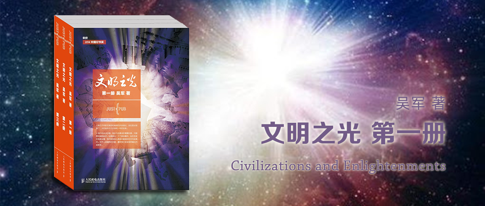

文明之光 第一册
========================================

Civilizations and Enlightenments

吴军 著

引子 一年与半小时——年轻的人类
----------------------------------------

本章共分为三节，分别是“我们的星球”、“生命的诞生和进化”、“最后的半小时”，从宇宙大爆炸到生命演化到现代人的形成。

本来是一个满是干货的章节，不知从哪里梳理开始，作者倒是直接提供了一张“地球的历史 时间表”解决了这个问题：

表0.1 地球的历史（表中的日期，是将整个历史浓缩为1年来看，方便读者有相对位置的直观印象）

|   日期           |   距今天的时间（年）  |    大事      |
|:---------------:|:------------------:|:------------:|
| 1月1日           | 45.3亿   | 月亮形成              |
| 1月11日          | 44亿     | 液态水形成            |
| 1月底            | 38～42亿  | 海洋形成             |
| 2月初            | 40亿     | 超分子出现            |
| 2月底            | 38亿     | 古菌出现              |
| 3月中            | 36亿     | 光合作用的细菌出现      |
| 7月初            | 18亿     | 复杂的单细胞生物出现     |
| 9月中            | 10亿     | 多细胞生物出现          |
| 11月中           | 6亿      | 海藻和海绵出现          |
| 11月下旬          | 5.4亿    | 寒武纪生物大爆发        |
| 12月初           | 4.2亿    | 脊椎动物出现            |
| 12月中           | 2.5亿    | 二叠纪-三叠纪生物大灭绝   | 
| 12月中           | 2.3亿    | 恐龙出现                |
| 12月15日         | 2亿      | 被子植物出现，恐龙主宰地球 |
| 12月26日         | 6500万   | 恐龙灭绝，哺乳动物兴起    |
| 12月30日         | 1500万   | 古猿出现                |
| 12月31日17点     | 350万     | 人类出现               |
| 12月31日23点30分  | 25万      | 现代人出现             |
| 12月31日23点52分  | 7万       | 现代人走出非洲          |
| 12月31日23点56分  | 3万       | 人类成为地球的主人       |
| 12月31日23点59分  | 1万       | 文明开始               |

第一章 金字塔和死者之书——古埃及文明
----------------------------------------

阶级的产生和城市的出现，意味着**文明**（Civilization）的开始。

西方“文化”一词，本意为农耕和养殖，也就是说，在人类定居下来，有了农业和畜牧业，就开始有了**文化**（Culture）。

人类最早的文明始于非洲尼罗河下游，即现在的埃及地区，或者美索不达米亚。

### 第一节 偶然的伟大发现

1798年拿破仑占领了埃及在尼罗河下游的主要地区。有一天，一个叫皮埃尔·弗朗索瓦·布沙尔的下级军官在散步时，走到一座古神庙的遗址，无意中发现了一块破碎的古埃及石碑，上面刻有三种语言：除了古希腊文，还有古埃及象形文字和古埃及拼音文字。这个石碑也成为人们翻译古埃及文献秘密的金钥匙。这块石碑以其发现地罗赛塔（Rosetta）命名。

### 第二节 最古老的文明

人类只有在能够获得稳定的农业收成后，才有可能定居下来，进而建立城市，开始创造文明。

为了准确预测洪水到来和退去的时间，当时的埃及人根据天狼星和太阳在一起的位置来判断一年中的时间和节气。

大约在公元前40世纪（甚至更早），埃及出现了**世界上最早的城市**——当时文明的中心是孟菲斯和底比斯（Thebes），即今天的卢克索等地。在这个时期古埃及从石器时代向青铜时代过渡了。又过了几百年，到了公元前31世纪，一个名叫纳尔迈（Narmer）的国王统一了埃及，建立了埃及的第一个王朝，这是**人类历史上的第一个王国**。

后来，埃及先后经历了十几个王朝，统一和分裂不断地交替。

### 第三节 金字塔

金字塔不仅是古埃及的象征，而且体现了全世界古代文明的最高成就。

金字塔每块巨石平均重2.5吨。

金字塔的结构设计巧妙，说明了当时对几何和力学有很深入的了解，并且运用自如。

金字塔至今看来都是一项复杂的工程，以至于有人将它们归功于外星人。巨石的开采、搬运、撂起，都是不可思议。而工程难度更高的方尖碑，则比这些更具挑战。

金字塔的内部构造，也蕴含着不少数学原理，像勾股定理、圆周率等也有了不成文的应用。

### 第四节 灿烂的古埃及艺术

> 约翰·亚当斯：我必须学习政治和战争，这样我的孩子才有可能学习数学和哲学，以及地理、自然历史等等，然后我的孙子才有机会学习绘画、诗歌、音乐、建筑、编制女红和瓷艺。

古埃及的绘画、雕塑都有了很高的造诣。

古埃及的法老、贵族等富裕阶层死后都会留有《死者之书》，其中一副《亚尼的死者之书》宽约40厘米，长达20多米，使用的颜料相当于今天的水粉，善不知用了哪种矿石配制，以至于距今依然保持着它们原有的鲜艳。在大英博物馆里也保存了一些一千五百年前东方的绘画，但是经年累月，画面上原本亮丽的颜色变成了暗灰色，而且内容模糊难辨。从绘画风格上来看，《亚尼的死者之书》更接近于中国宋代以后的工笔画，而不是西方的壁画和优化。在美国历史学家和通俗作家房龙看来，欧洲14世纪（文艺复兴之前）的油画和古埃及这些绘画相比，则显得颇为幼稚，要知道这前后可差了18个世纪。

《死者之书》也用绘画的形式描述了当时人们对于死亡的观念，古埃及对于死亡的理解有点像基督教，人们死后如果心称重后和羽毛一样轻，则可以去一个美好的世界，在那里没有了现世的黑暗与不公，永远充满着快乐。

古埃及的绘画当然不仅仅限于画在纸莎草上，他们还留下了大量的壁画。

古埃及的绘画还能把人们的神态，而不是具体的形态抽象出来，这也是艺术的精髓所在。它让你看到这些画作的时候，就能通过人物的神情知道它的身份，而无需多余的诠释。

古埃及的雕刻和绘画一样出色，细分起来，他们的雕刻又可以分成人像的雕塑和浮雕。古埃及的神庙就是这些艺术的传世载体。

### 第五节 埃及文明和青花瓷

著名的青花瓷之所以后来能享誉世界，和它上面葡萄藤不无关系。

在宋朝之前的传统绘画中，并没有采用过蔓藤图案，而这些图案其实是伊斯兰元素，而这些伊斯兰元素最初来自于古埃及。

古埃及-希腊-罗马-阿拉伯帝国-奥斯曼土耳其帝国-蒙古-中国，蔓藤图案也随着文明的迁徙，最终呈现在了青花瓷上。

第二章 轮子、拼音文字和铁器——美索不达米亚的文明
----------------------------------------

美索不达米亚文明发源于两河流域（底格里斯河和幼发拉底河），是距今研究仅次于古埃及文明之后出现的文明，甚至有研究表明美索不达米亚文明比古埃及文明更早。

古巴比伦文明实际上只是美索不达米亚文明中某个特定民族的一个历史发展阶段，这个和我们过去谈论的四大文明古国，有冲突，需要纠正。

### 第一节 轮子和楔形文字（苏美尔人）

美索不达米亚在前6500～前3800的最后一千年，已经有了多余的农产品，用于交换其他产品，即出现了商业；社会分工明确，社会等级分明，农村变为了城市，在埃里都地区还发现有多座神庙，它们是城市的中心。

公元前3500年左右，在乌鲁克时期，住的房子用粘土烧纸的砖头盖成，同时期的古埃及人似乎并没有掌握这项技术仍以石头作为建筑材料。

公元前3300年左右，楔形文字便在乌鲁克产生了。我们以前认为这是另一种象形文字，但是后来的研究表明这其实是人类最早期的拼音文字。

苏美尔人是世界上最早开始冶炼金属的民族，他们在公元前3300年便进入了青铜时代。

苏美尔人在公元前3200年左右发明了轮子和车辆。这比大金字塔建成时间还早了六百年。

苏美尔人还创造了很多世界第一，他们制定了最早的法典——《乌尔纳姆法典》（Ur-Nammu Code），编写了最早的药典，颁布了第一部太阴历（农历）的历法，留下了最早的史诗和地图（绘制在泥板上）。

### 第二节 汉谟拉比法典（古巴比伦人——闪米特人的一支）

在古埃及，社会靠的是伦理道德来维系；而在美索不达米亚，社会则是靠法律来维系。包括古巴比伦在内的美索不达米亚各个文明时期，法律的文献和这种合同都占到泥板书的很大比例。

汉谟拉比建立的文明功业比他建立的强大王朝更经得起时间的考验。他规划了现代城市的模样，建立了一个完整的政府管理体系。

### 第三节 冶铁的发明和人类最早的条约（赫梯人——印欧语系民族的一支）

当公元前1595年赫梯人（Hittite）取代古巴比伦人开始统治美索不达米亚时，中国第一个有文字记载的王朝——商朝正好开始建立。

今天世界上大多数历史学家都认为是赫梯人发明了冶铁术，并且世界各个文明的冶铁技术都是从赫梯人那里慢慢传过去的。

在赫梯人和拉美西斯二世征战后，双方签订了《埃及赫梯和平条约》，这是人类历史上最早的国与国之间的书面条约，它表明人类开始懂得通过谈判而非武力解决纠纷。

### 第四节 亚述——血腥与文明（亚述人——闪米特人的一支）

在公元前12世纪，崛起的亚述人取代赫梯人成为美索不达米亚的主任。亚述人是闪米特人的一支。在长达将近一千年的时间里，亚述人只是给其他民族当雇佣兵，而没有建立起自己的文明，因此他们总是游离于美索不达米亚的边缘地区。

亚述人是为战争而存在，他们很早就有了不同兵种的明确分工。在战术上，亚述人也有很多创新，他们发明了人类历史上最早的重装步兵方阵，可以有效地对付横冲直撞的战车部队。除了作为雇佣军替其他民族打仗，一些亚述人还以高利贷为业。

赫梯人衰落后，公元前12世纪，亚述王提格拉特·帕拉沙尔一世乘机开疆拓土。但亚述人不善经营，导致繁荣通常不会持续太久。

亚述人以残忍著称，以杀戮为荣，有点像后来的蒙古人。

亚述到了末期，开始了崇文的风尚，开始尊崇文化和科学，并且建立了**人类历史上最早的大规模博物馆**——巴尼拔图书馆。

### 第五节 最后的辉煌——空中花园（迦勒底人——新巴比伦人）

公元前626年，新巴比伦王国建立。

在新巴比伦时期，西亚人掌握了在陶器表面上釉的技术。世界七大奇迹之一的巴比伦空中花园相传也是在这个时候修建的。

> 人们说起东方古国之一的巴比伦时，常常提到《汉谟拉比法典》和空中花园，但实际上一个属于古巴比伦王国，一个属于新巴比伦王国，完全是两个不同的国家，中间差了将近一千年。

除了传说中的空中花园，巴别通天塔（Babel）则是他（尼布甲尼撒二世）建造的另一个奇迹。

新巴比伦人统治的时间虽然还不到一百年，但是却创造了高度的文明。他们奠定了西方数学和天文学的基础。在艺术和建筑方面对西方世界的影响也很大。

第三章 垄耕种植法和科举——中国的农业文明
----------------------------------------

在农业时代，至少从以下几个方面可以证明中国人的成就：

首先，是物质生产，其次，是科技水平和工程水平。

### 第一节 水利、垄耕种植法和农具

中国历史上的水利工程很有水平，郑国渠、都江堰都是著名的水利工程，引水灌溉系统，让农业得以良好发展。

延续至今的垄耕种植法，这个看似不起眼的发明比四大发明对世界的贡献还要大。它是除了灌溉之外农业高产最重要的保证。

中国古代的牲畜使用效率，农具的先进性也远高于同时期的欧洲。

### 第二节 先进的选官制度

政治体制和文官制度对于任何文明、任何国家的发展都是至关重要的。

在西方近代真正的民主政治出现之前，世界上只有古希腊和罗马的民主制，以及中国的文官选拔制度，打开了平民进入上层社会并且参与管理国家的途径。

客观地讲，中国的科举制度对中华文明的贡献远远超过它的弊端。它的诸多好处是显而易见的。

首先，它在专制时代是相对公平的人才选拔方式。其次，考试的内容实际上是考察读书人的治国之策，而非文采。另外，科举制度还造就了中国古代知识分子对国家和百姓的使命感与责任感。

当然，科举也有很多弊端，首先到了唐代以后，这成为读书人唯一的出路。另外，因为科举考察的内容以孔孟经典为主，尤其是明代之后，科举的考试内容（八股文）日趋僵化。大部分读书人为应科考，思想渐被狭隘的四书五经、迂腐的八股文所束缚，无论是眼界、创造能力、独立思考都被大大限制，以至于到了近代无法适应世界“三千年未有之变局”。

中国的科举制度对中国东南亚乃至世界都产生了深远的影响。相对于世袭、举荐等选材制度，科举考试无疑是一种公平、公开及公正的方法。

### 第三节 宋代——幸福的农业社会的顶峰

中国从南北朝后期开始，在经济和社会发展上全方位（文明程度、商业和贸易、科技水平和百姓的生活水平）领先于欧洲。

在国人的印象里，唐代盛极一时，宋代则走向衰弱，但实际上，从数字上看，宋朝才是最繁荣的。

- 税收：北宋中后期，国家税收为5000万-6000万两白银。
- 收入结构：收入中的非农业税从35%占比（1238万贯）陆续上升到70%（4911万贯）。
- 粮食：单亩产量从唐朝的亩产二石，增产到了二～三石，唐朝每年送往首都的粮食大约30万石，宋朝约60万石。
- 铁：产量超过了英法两国工业革命初期的总和。
- 造船：已能载重5000石的货物或者五六百人。
- 科技水平：四大发明中的三个（火药、指南针、活字印刷术）在宋代得以普及应用，瓷器制造技术发展成熟，各种发明、工程方法、物理学发现以及在冶金、石油工业上也有成就。
- 城市建设：大量城镇兴起，货币流通量增加，出现了世界上最早的纸币。
- 海上贸易：泉州是全世界最大的港口和瓷器集散地。对外贸易港口近20个，与南宋有外贸关系的国家和地区增至60个以上。
- GDP：国际普遍承认，宋朝的人均GDP约450美元，相当于中国1949年的水平。
- 生活水平：贫民穿得起丝质的袜子，居民建筑雕梁画栋，穷人有肉吃，集市兴盛，酒楼夜夜笙歌。
- 高福利：现代消防局，安济坊，居养院，漏泽园。

第四章 科学之路——从毕达哥拉斯到托勒密
----------------------------------------

古希腊人在两千多年前就具有了其他民族缺少的逻辑推理能力和抽象思维能力。他们善于归纳和演绎，把经验上升为系统化的理论和科学。

西方人从文艺复兴开始继承了古代希腊的思辨和逻辑传统，首先发展起近代的自然科学。到了17世纪，法国思想家和数学家笛卡尔又在古希腊研究方法的基础上建立起一整套系统的自然科学研究方法，这些方法至今仍被自然科学家（和大部分社会学家）们所采用。

### 第一节 几何学

毕达哥拉斯和孔子生活在相同的年代。毕达哥拉斯在哲学、音乐和数学上都颇有建树。在数学上，毕达哥拉斯最早将代数和几何统一起来，并通过逻辑推演而非经验和测量得到数学结论。

毕达哥拉斯和以前东方学者的区别在于，他坚持数学论证必须从“假设”出发，然后通过演绎推导出结论，而不是通过度量和实验得到结论。这种方法对数学的发展影响很大。

柏拉图在雅典城郊创立柏拉图学院，这所学院是西方文明史上最早的有完整组织结构的高等学府之一，也是西方中世纪期间发展起来的大学的前身。

柏拉图学院受毕达哥拉斯的影响很大，课程设置包括毕达哥拉斯学派的传统课题，比如算术、几何学和天文学。

柏拉图时代正是中国处于从春秋到战国转变的时代，那是中国历史上各种学说百家争鸣的时代。

他的学生亚里士多德的学生亚历山大大帝，征服埃及后，在开罗附近建立了亚历山大城，并且在成立建造了著名的亚历山大图书馆，这样，世界学术的中心也从古希腊本土转到了埃及的亚历山大城。

在亚历山大城出了一位了不起的学者，他就是被称为“几何之父”的欧几里得。欧几里得的名字可能是后人对他的尊称，而非本名。欧几里得的最大成就，是在总结东西方历史上几个世纪积累的几何学成果的基础上，创立了基于公理化体系的几何学。

欧几里得将他的公理化体系几何学写成了《几何原本》一书，这本书被认为是对世界影响力最大的一本书。

《几何原本》传到中国是在明朝灭亡前。意大利传教士利玛窦将这部巨著的拉丁文版带到中国，并与明代学者、官员徐光启将一共十五卷中的前六卷合译成中文，定名为《几何原本》，几何的中文名称就是由此而来的。但是，在接下来的两百多年间，这本书在中国并未产生什么影响，直到19世纪中叶，才由曾国藩的幕僚李善兰和英国人伟烈亚力将后九卷译出，并由曾国藩的长子曾纪泽作序，曾国藩出资刊印。之后，随着洋务运动的兴起，中国一些有识之士抱着了解西方科技的心态，开始学习《几何原本》，这样几何学才在中国开始开始普及。

### 第二节 物理学

亚里士多德被后世认为是古希腊的百科全书，他涉足的研究领域非常广泛，有人说他研究过的自然科学包含了生物学、天文学、地理学、地质学、气象学、物理学等，这些在当时被统称为自然哲学。而在人文和社会学科方面，他写了关于政治学、心理学、美学和神学的诸多著作。

他超越了他的前辈，将过去广义上的哲学（即知识或所有学科的总称）分为三个大的领域：理论的科学（理工科）、实用的科学（文科）、创造的科学（诗歌、艺术）。

他和毕达哥拉斯和欧几里得不同，亚里士多德开创了通过归纳方法研究科学的先河。他创造了一种新的研究方法——格物致知（意思是探究事物原理，而从中获得智慧（或从中感悟到某种心得））。

由于认知的局限性，亚里士多德对科学的大多数结论都是定性而非定量的，而且亚里士多德在物理学上的很多结论都是错误的。

阿基米德则完成了从定性研究到定量研究的这一飞跃。

阿基米德不仅是古希腊时期最有建树的科学家，而且被誉为世界三大数学家之一，另外两个是大名鼎鼎的高斯和牛顿，不过阿基米德对物理学的贡献和影响其实更加深远。

阿基米德总结了浮力定律，系统研究了简单机械原理，提出了力矩的物理概念，发明了投石机和起重机。在数学上，用近似的方法计算出球的面积和体积，以及椭圆的面积。发明了一种求圆周率的方法。在天文学上，发明了一种天象仪或者说太阳系的模型，显示了太阳、月亮和五大行星的运动，从他的手稿显示，他是提出日心说的第一人。

古希腊人靠着抽象思维能力和总结概括能力以及对科学不断探求的精神，奠定了自然科学的基础。

### 第三节 天文学

西方语言中，行星planet一词的意思就是漂移的星球。因此，苏美尔人对这五颗星格外关注，认为每颗星对应一个神仙，加上太阳神和月神，让这七个星辰的主神每个掌管一天，循环反复，就成了现在的“星期”。

- 毕达哥拉斯：将天文学看作数学的四个分支之一（另外三个是算术、几何和音乐）。
- 柏拉图：总结了前人天文学的成就。
- 欧克多索：柏拉图的学生，做了三件有意义的事：
    - 指出五大行星的运动是漂移的
    - 建立了一个以地球为中心的两个球面的模型，里面的球面代表地球，而外面的球面代表日、月、星辰运动的轨迹
    - 认识到需要建立一个数学模型，使得计算出来的五大行星轨迹与观测一致。
- 喜帕恰斯：发明了“三角学”数学工具，测出地球绕太阳一周的时间，月亮绕地球一周的时间，地球的轨迹不是正圆，留下了很多观测数据。
- 克劳第斯·托勒密：真正创立了天文学，并且计算出诸多天体运行轨迹：
    - 地心说的创立者
    - 发明了球坐标
    - 定义了包括赤道和零度经线在内的经纬线
    - 给出了一度经线的距离（比实际的小了10%，让哥伦布得出从西面到亚洲的距离比往东绕过非洲到亚洲更近的结论）
    - 提出了黄道
    - 发明了弧度制
    - 利用大圆套上小圆的方法，精确地计算出了所有行星运动的轨迹
    - 另一大贡献在地理学，详细说明如何将球体的地球绘制到平面上，提出投影的方法
    - 最早用数学模型定量描述天体运动

### 结束语

无论是古希腊奠定的几何学、天文学和物理学，还是后来笛卡尔发明的解析几何或者牛顿发明的微积分，无不遵循古希腊人建立科学学科分支的方法。

第五章 罗马人三次征服世界——罗马法
----------------------------------------

罗马人一共三次征服了世界，第一次是靠武力，第二次是靠拉丁语，而第三次则是靠罗马的法律体系。

罗马人发明了拉丁语，很多著作都是先有了拉丁语，后来才被翻译成了英语，比如牛顿的《自然哲学的数学原理》。随着工业革命的兴起，英语渐渐取代了拉丁语的国际地位。

### 第一节 罗马的崛起与司法制度的形成

罗马的历史：

1. 拉丁族的一支在台伯河畔建立了罗马城。
2. 大酋长阶段：罗马早期，罗马的“王”是终身的，但不能世袭。因此，古罗马在立国之前，基本上就形成了一种共同执政的民主政治制度。
3. 真正的国家（王政时期）：罗马的第五个“王”老塔克文时期，城市开始兴起，罗马才算是在一群氏族部落的基础上建立起了真正的国家。
4. 共和时期：罗马的最高统治者是两名由议会选举出的执政官，两人相互制衡。
5. 帝国时期：屋大维·奥古斯都，实行君主制。

公元前454年，罗马成立了立法委员会，公元前450年，罗马法律的第一部成文的立法《十二铜表法》诞生。此时中国正处于三家分晋时代。

罗马的司法制度与其他文明不同，古罗马（和古希腊）实现了司法和行政的分离。法官不管行政事宜，只管司法。法官不管收集证据，只管判决。法官常常是兼职，比如通过抽签选出一批公民组成法官群体。随着案件越来越复杂，诞生了律师这样的职业。

### 第二节 罗马法的体系和法学的发展

罗马人在法律体系上的第一个创举，是将法律分为公法和私法。

罗马法律还发明了法人的概念，给社会团体赋予独立的“人格”。

随着罗马外国人的逐渐增加，衍生出了“万民法”，它是今天国际法的起源。

罗马法中的物法是私法的主体，它包括物权法、债务法和继承法等几部分。罗马法明确指出，物品不再是分享的，而是具有所有权的，这个所有权归物品的主人拥有，他人不得分享。这实际上是从法律上保护了私有制。

罗马的司法权和行政权分离，法律不再由执政官解释，而是由专门的法学家解答，避免了早期由执政官解释潜在集权和暴政的风险。

在查士丁尼时期的重要法学论著《法学阶梯》中，罗马法被明确地区分为三部分：自然法、公民法和万民法。

罗马的各代国王，都乐于修订法律，定期将历史上的法官判案整理成法律。《永久敕令》、《安托尼努斯敕令》、《狄奥多西法典》、《查士丁尼民法大全》、《查士丁尼法典》、《学说汇集》（《查士丁尼学说汇编》）、《查士丁尼新律》。

### 第三节 罗马法的复兴和影响

西罗马帝国灭亡后，欧洲大部分地区进入了漫长的中世纪，也就是欧洲的封建时期。法律由封建领主确立与执行，经济上没有发展，政治上大倒退。而后，教会控制了大量的土地，宗教作为最有权势的权力机构，不仅管人的灵魂，还掺乎世俗的事情，并且在很多时候拥有了司法权，以至于后来很多民主国家为了防止宗教干政，不得不把政教分离的原则写入宪法。

随着十字军东征打开了东方的大门，随着商业和手工业开始发展，在东西方的连接地意大利，出现了资本主义萌芽。到11世纪末，意大利的博洛尼亚设立了以教习罗马法为主的法律专科学校，它的学生来自整个欧洲，这直接引发了全欧洲研习罗马法的热潮。

法国著名启蒙思想家，孟德斯鸠写下巨著《论法的精神》，被视为人权保护和确立三权分立（立法权、行政权、司法权）原则的经典著作。提出了天赋人权的重要性。

另一位重量级思想家，卢梭，也强调人人平等，他认为“政府的最重要的任务之一，就是要防止财富分配的极端不平等”。

拿破仑创立了《拿破仑法典》并随着征战，带到了欧洲的每个角落，成为了后来大陆法的基础，它本身在很大程度上继承了罗马法的精神和很多条款。

各种文明都有自己的法律，**为什么只有罗马法对今天世界各国的社会和司法产生了全面的影响**？

1. 罗马法不是立法者意志的体现，而是要符合自然的法则。
2. 由于自然法的正义化身形象以及自然普遍存在的理论，导致了自然法在时间和空间上具有普遍性的结果。
3. 基于自然法的罗马法除了在体系上和基础上明显优于其他文明的法律外，在严谨性和完备性等方面也几乎无懈可击，这也是它后来被广泛采用的重要原因。

### 结束语

罗马法是古罗马人对世界最大的贡献，它所蕴涵的人人平等、公正至上的观念，具有超越时间、地域与民族的永恒价值。

第六章 人造的奇迹——瓷器
----------------------------------------

第七章 一个家族的奇迹——文艺复兴
----------------------------------------

第八章 香料的诱惑——大航海和地理大发现
----------------------------------------
