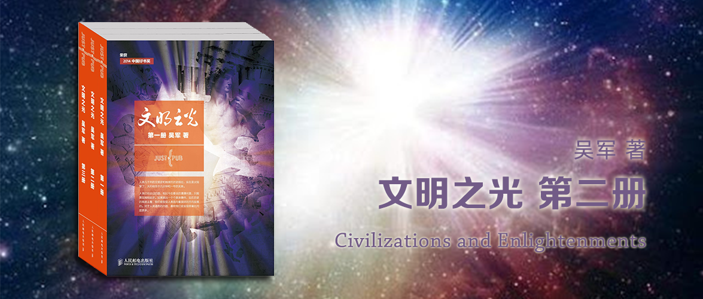

文明之光 第二册
========================================

Civilizations and Enlightenments

吴军 著

第九章 艾萨克·牛顿——理性时代的开拓者
----------------------------------------

牛顿被葬在了英国国教的主教堂威斯敏斯特教堂。他是一位空前绝后的划时代人物，在他之前，科学在欧洲并未深入人心，人类对自然规律的了解还非常有限，自然科学尤其是物理学和天文学的体系相当不完整，数学的工具也非常弱；在他之后，欧洲进入了崇尚科学的理性时代。经典的物理学和天文学完全建立了起来，人们对数学的认识从静止的变量，上升到变化的函数。没有牛顿的工作，我们无法制造出今天各种复杂的机械、发动机、火箭和光学仪器，对于大部分数学问题，我们也无法找到答案，我们对宇宙的认识也将是肤浅的。正是牛顿的贡献，为后来的工业革命奠定了科学基础。

### 第一节 从故乡到剑桥

牛顿出生在了一个农民的家庭，但这不妨碍他成为一名伟大的科学家。

和一般大学生习惯于接受书本知识不同，牛顿从来不轻信书本上的结论，他总是需要用实验和数学计算验证前人的看法，得出自己的结果。

### 第二节 万有引力定律的发现和微积分的发明

在牛顿和莱布尼茨对微积分的发明权争论不休中，今天的数学界只能说：牛顿先发明了微积分，莱布尼茨先发表了这项成果。

莱布尼茨对微积分最大的贡献在于他使用了一整套完整的数学符号，而不是微积分本身。牛顿首先是物理学家，他的兴趣更多地在于物理学和实验科学，微积分只是他在研究物理的过程中发明的数学工具，因此他设计的那套微积分符号虽然自己用起来非常自如，但是其他人用起来并不方便。而莱布尼茨是数学家，并且对符号运算很有兴趣，因此他使用的微积分符号不仅方便书写，而且容易学习。正是靠他的贡献，微积分理解起来才容易。

我们今天学习的微积分，已经既不是牛顿的，也不是莱布尼茨的，而是一个半世纪后法国数学大师柯西的微积分，它建立在公理化的体系下，最为完备和严密。他使用的符号则是混合了拉格朗日和莱布尼茨的符号。

### 第三节 站在巨人的肩上

牛顿和欧几里得或者托勒密一样，他是建立了科学体系，他的贡献不仅仅在于一项项孤立的发现和发明，而在于他的工作几乎为所有这些相关学科奠定了理论基础。由他确立的科学体系包括：

1. 以微积分为基础的高等数学
2. 以牛顿三定律为主线建立的经典力学
3. 以光子说为基础的光学
4. 以万有引力为基础的天文学

此外，他还完善了笛卡尔建立的解析几何学，这是微积分的基础。

#### 3.1 数学

笛卡尔在解析几何上开了头，而牛顿站在笛卡尔的肩上完成了整个体系的构建。微积分、解析几何和后来的线性代数，是整个高等数学的基础。

#### 3.2 光学

在牛顿之前不少科学家都做过三棱镜实验，观察到光的散射现象并且考虑了颜色的问题，不过他们的解释都很混乱。

牛顿没有机械地接受前人的理论，而是经过自己的思考和实验，给出了更好的解释——不同颜色的光折射率不同。

了解了不同颜色光的折射率不同后，牛顿改进了望远镜。这是一次完全靠理论指导的发明。牛顿用凹面镜发明了反射式望远镜，改进了伽利略折射望远镜，改善了影像边沿模糊的缺点。

对于光的本质，牛顿提出并完善了光的微粒说。

#### 3.3 力学

牛顿清晰定义了 力、质量、加速度，而且为世人示范了一个自然科学的研究方法，即自然科学的结论必须能够证实或者证伪，如果不能证实或者证伪（比如上帝的存在）则不属于自然科学的范畴。

#### 3.4 天文学

万有引力定律是牛顿最著名的科学发现之一，正是这个发现奠定了天体力学的基础，并使牛顿建立起他的“宇宙系统”。

拉普拉斯在《宇宙系统论》一书中写道：“用地球的运动去解释天体运动所表现的简单性，得到天文学家们的一致赞同，它被认为是万有引力原理的一种新的验证，使其达到物理科学可能达到的最高境界。”

牛顿在开普勒的（椭圆）模型基础上，进一步发现太阳也不在太阳系各个行星椭圆轨道的焦点上，而是在各天体运动的共同重心上，二者稍有差别。

在这些巨人的研究成果的基础上，牛顿发现引力和距离平方成反比，并进而发现了万有引力定律。在此基础上，牛顿建立起他的宇宙系统，包括行星运动的理论、彗星理论、潮汐理论和月球理论。牛顿的力学三定律，加上万有引力定律，被后人评价为人类科学史上最伟大的发现。

### 第四节 生活中的牛顿

牛顿的一生，除了幼年时期贫穷而坎坷外，应该讲一直都非常顺利。

1. 剑桥大学毕业后不久就接任他的老师巴罗在剑桥大学担任的卢卡斯教授的教席。
2. 29岁当选为英国皇家学会会员。
3. 担任英国皇家造币局总监，三年后担任局长。
4. 胡克去世，年底当选英国皇家学会主席。——经常举办学术讨论会
5. 牛顿对钱财很重视
    - 去造币局工作，是为了高薪
    - 参与金融投机，赶上了南海泡沫
6. 对宗教兴趣大增，写了《关于但以理书和圣·约翰启示录的意见》。
7. 一生未婚，谈过两次恋爱。

### 第五节 科学与伪科学之间

牛顿的晚年在炼金术和神学上花了很多的时间。期间还对占星术进行了研究，但他从不盲信任何东西，用三角学知识对剖析所谓占星术的理论，发现里面空洞无物，全是伪科学的结论，从此再没碰过占星术。

牛顿在炼金术上的研究，让他的物质观由向以太说妥协转变为后期比较坚定的原子论。还发现了置换反应，但是他没有办法对化学实验进行合理解释，甚至得出了一些错误结论，而最终没能成为一名合格的化学家。

牛顿在炼金术上多少解决了一些化学问题，而神学的研究则毫无意义。

### 第六节 遗产

牛顿留下的财产遗产已不值得一提，但是他留下的精神遗产却造福着全人类。

除了牛顿发现的一些基本定律，他的贡献还在于发展并完善了自伽利略和笛卡尔开始的自然科学的研究方法。他强调一切从实验和现象出发，并把实验和数学推理相结合作为治学之道，巧妙地运用归纳法和演绎法，得到科学的结论。他在处理数学与自然科学的关系上，致力于数学与自然科学的相互印证、渗透和补充。

为什么是牛顿发现了这些？这是建立在自文艺复兴以来科学发展的基础上的，是在当时引领世界发展的国家英国，是他具备了相应的科学才能、素质，是他的聪明和勤奋，是他持续思考和锲而不舍的钻研所共同造就的结果。

### 结束语

牛顿是人类历史上最伟大的科学家。1978年，[美国评出了世界历史上最有影响力的100位人物](https://en.wikipedia.org/wiki/The_100:_A_Ranking_of_the_Most_Influential_Persons_in_History)，牛顿名列第二，这是因为他开创了科学的时代、理性的时代。

第十章 荷英时代——为什么英、荷统治世界
----------------------------------------

### 第一节 罗卡角的太阳——葡、西的殖民时代

葡西早期殖民是为了到达东方，而不是掠夺原住民。因此他们的早期财富积累并不是大家误以为的靠殖民掠夺得来。

同样，虽然是第一批发家的国家，两国致富的手段也各不相同。

葡萄牙财富的来源：
- 东西方贸易的暴利
- 贩奴贸易（贩卖到欧洲）

西班牙财富的来源：
- 美洲开金银矿
- 荷兰地区的税收（依靠神圣罗马帝国的统治，以及无敌舰队武力上的威慑）

钱的用途却不约而同地用于：
- 购买奢侈品
- 建造美轮美奂的宫殿
- 发动宗教战争

遗憾地是，没有用来发展工商业和科技。

因此，这些财富带来的影响，更多是负面的：
- 让国民更加懒惰
- 扼杀了早期手工业和造船业
- 习惯了高价从外国购买商品，导致国内的工商业极度萎缩

随着西班牙的无敌舰队（很多战舰也不是自己造的）被英国人和荷兰人打败后，荷兰便从西班牙人的统治下独立了，接着西班牙在整个美洲的殖民地也纷纷独立。这个曾经的日不落帝国从此断了财路，很快沦落为欧洲最穷的国家。

究其原因，这些财富就像暴发户的钱一样，得来容易，又没有用来发展科技，反倒是让宗教和王权得到了强化，这和欧洲文明的趋势正好相反。他们和中国的康乾盛世一样，不过是在维护一个没落的制度而已。

> 到葡萄牙旅游，很多人都要去[罗卡角（Cabo da Roca）](https://j.map.baidu.com/ce/ei9)看日落，那里是欧洲大陆的最西端，景色非常优美，那里也是当年恩里克亲王训练水手的地方。500多年前，伊比利亚半岛从那里开始崛起。两百年之后，曾经拥有广袤殖民地和数不尽财富的葡萄牙和西班牙开始退出世界的舞台。当我站在欧洲大陆最西头的海边，看着最后一抹阳光从海平面上消失时，不禁感慨在伊比利亚半岛能看到的只是落日，而不是日出。

### 第二节 海上马车夫——荷兰的崛起

荷兰是一个自然资源匮乏的国家，只有鲱鱼可以捕捞。但是捕鱼只有一季，剩下的时间，荷兰人琢磨给其他国家运输货物，因此有海上马车夫的称号。他们还从英国进口棉花，纺织成布匹卖到欧洲各地。

荷兰的样子，像极了中国的温州。一样是资源匮乏，需要靠勤劳致富，依靠海上贸易赚取的钱，再发展工商业。

荷兰人精打细算，而且善于合法地利用规则的漏洞来谋取最大的利益。

荷兰人很务实，喜欢经商，由于没有什么资源可卖，因此他们的商业活动必须是可持续发展的，比如荷兰人喜欢对原材料进行加工以获取附加值。

他们对政治没有太多兴趣，对于名义上的统治者，他们唯一的要求就是：不要干涉他们挣钱。

西班牙对尼德兰的统治，要向荷兰人收税，动了荷兰人的钱袋子，二者发生了矛盾，先后求助了法国和英国，前者忙于内战，后者收取的保护费也不便宜，最后只好独立建国。

建国后，被西班牙贸易封锁，导致资源匮乏的荷兰必须另谋出路。他们早先的藏富于民起了巨大的作用，他们通过民间募资的方式组建了股份公司——荷兰东印度公司。

荷兰人敢于将自己的积蓄投入这项冒险，原因包括：
- 荷兰人喜欢冒险。
- 东印度公司有政府背书。
- 荷兰商人信誉良好，并且是世界上最早恪守信托责任的群体。

信托责任，不同于简单意义上的守信用和不欺诈，信托责任包括三方面：
- 法律责任：不能将投资人的钱占为己有。
- 道德责任：经理人有责任将公司管理好，并为公司股东谋利益。
- 专业责任：受托人必须具有专业知识和技能才能管理得好。

巴伦支北极探险运送货物，最后宁可冻死也不动委托人的货品的做法，就是信托责任的最好说明。

荷兰还建立了阿姆斯特丹银行，阿姆斯特丹立法规定，任何人不得以任何借口干涉银行的商业自由。后来即便是西班牙和荷兰打战，阿姆斯特丹也没有冻结西班牙的白银。这让大量的外国的钱都涌入了荷兰，就如同今天世界各国的钱涌入瑞士一样。

东印度公司到达东方后，长达十年没有分红，期间的获利全部用于投资基础设施建设，在世界各地建立了大量的码头、仓库、船坞，同时大量造船，扩大船队规模。

十年没有分红却没有得到股东的反对，究其原因，是因为阿姆斯特丹建立了世界上第一个股票交易所。东印度公司的股东只要愿意，就可以自由交易手中的股票变成现金。

从荷兰和葡西两国之间的巨大的反差，主要有三点差异：
- 制度差异：一个靠王权，一个靠资本主义新制度。
- 利益分配：一个仅限王公贵族冒险家，一个靠全民。
- 开创了现代商业体系：现代的银行、证券交易所、信用和有限责任公司、信托责任制度。

### 第三节 从重商主义到自由贸易——英国的崛起

英国的历史从中世纪演进到：
1. 亨利一世：为了离婚自创了英国国教，和天主教闹掰。
2. 爱德华六世（亨利一世儿子）：10岁当了英国国王，6年后去世。
3. 血腥玛丽（凯瑟琳和亨利一世的女儿）：信奉天主教。
4. 伊丽莎白一世：打败了无敌舰队，但是终身未婚。
5. 詹姆斯一世（苏格兰斯图亚特家族）：昏庸自大，干涉议会。
6. 查理一世（詹姆斯一世儿子）：比父亲还要独裁，和议会开战。
7. 克伦威尔（革命军）：自封护国王，独裁。
8. 查理二世（查理一世儿子）：短暂复辟，想要报复革命党，被英国国会废除。
9. 威廉三世（荷兰国王，荷兰开国国王威廉一世的曾孙）：受到英国人的邀请，赴英国担任国王，并且和妻子玛丽（英国公主）一同治理，史称光荣革命。

英国在光荣革命之后，确立了一个民主制度，解决了体制问题。然后做了两件事跃居世界第一强国：

1. 从重商主义到自由贸易的过渡
2. 完成工业革命

重商主义的真正含义是重视**生产**，尤其是重视工业生产，概括起来有以下几点：

1. 尽可能多地拥有硬通货，因为只有这样国家才能搞基础建设、军备和从事对外扩张；
2. 为了做到第一条，国际贸易必须优先于国内贸易，必须保证贸易顺差；
3. 既然各国都在生产，那么保证顺差的前提是要从事高附加值的劳动，在当时就是从事来料加工而不是出口原材料；
4. 鼓励生育，因为社会需要大量的劳动力；
5. 国家引导，并且监督产品质量，以保证全球竞争力。

随着工业革命的展开，人类经济的发展首次从缺乏劳动力和资源变成了缺乏市场，在这个大前提下，英国从重商主义迈向自由贸易，因为它的工业品需要卖到世界各地区。

亚当·斯密认为：

1. 人的社会活动尤其是经济活动是以谋求个人的利益为目的，虽然存在慈善，但不是社会生活的主流。
2. 他阐述了分工协作对提高生产率的重要性。
3. 他还提倡劳动价值论。

基于这些理论，亚当·斯密提出了一个全球贸易的战略——自由贸易，这样英国可以赚更多的钱。

1. 开放市场，换取他国市场的开放。
2. 让别国有钱，才能购买英国的产品。

亚当·斯密，认为政府的职责：

1. 对外保卫国家
2. 对内维持治安和司法
3. 建设和经营公共工程

对于经济生活，政府少操心为好。让商业发展的最好办法就是通过自由竞争，优胜劣汰。

此后，英国解散了东印度公司，并允许所有英国公司展开和殖民地的贸易。

- 荷兰人：奠定了现代的商业基础。
- 英国人：确定了现代经济和商业的游戏规则。

一个奉行自由贸易的国家，要想走在世界的前列，**前提条件是它能够比其他国家生产出更多、更好，同时还要更便宜的商品**。

### 第四节 工业革命

因为商品经济的发展导致农产品成为了商品，从而刺激了农民生产的动力。短短几十年间英国的农业收入上涨了四倍，养活了更多的人口，这为工业革命提供了条件。

除了吃，就是穿，也就是纺织业。随着珍妮纺织机（手摇）的出现，后来被卡特赖特改进成依靠水力驱动，后来由瓦特改进成依靠蒸汽机驱动。

瓦特的成功依靠：

1. 英国的专利制度和对发明的重视
2. 博尔顿的配合
3. 也是最重要的，瓦特开创了与前人不同的发明创造的方式。

前人发明创造的方式：

1. 从劳动中获得经验
2. 根据经验改进工具、发明创造
3. 再根据发明创造提炼出技术
4. 从技术里总结出科学的原理

瓦特开创的发明创造的方式：

1. 系统地学习了数学、力学、化学和热力学
2. 做了很多实验
3. 仔细计算热能转化成机械能效率的问题
4. 着手改进蒸汽机

对他影响最大的一本书是牛顿的《自然哲学的数学原理》。

后人这样评价这两位英国杰出人物：牛顿找到了开启工业革命大门的要是，而瓦特拿着这把钥匙，开启了工业革命的大门。因此，后世评价瓦特为工业革命之父。

### 结束语

荷兰、英国和美国崛起并主导世界长达四百多年，并非单一原因可以解释。

但是制度上的创新，政治体制上的创新，市场经济规则体系的建立、自由贸易、全球市场的建立、现代商业法则和金融制度等一系列创新，在其中起到了至关重要的作用。

第十一章 谈出来的国家——美国的建国过程
----------------------------------------

### 第一节 本杰明·富兰克林

富兰克林童年家里兄弟姐妹多，经济条件不好，没有条件坚持上学。后来他在他同父异母哥哥的印刷厂工作，他热爱阅读，后来到了费城还创办了自己的印刷厂，因在报纸上长期发表文章而受到民众的尊重。

他热衷于公益事业，建立消防队、创办大学、建立医院、还是一名科学家，他搞明白了雷电并设计了避雷针，降低了居民房屋火宅的风险。他还是一名政治家和外交家，多次为了殖民地的利益和英国本土进行交涉。

富兰克林的一生诠释了什么是美国梦。他出身贫穷，凭借自己的努力获得成功，关注社会并服务于社会。

### 第二节 托马斯·杰弗逊

杰弗逊是《独立宣言》最重要的起草者，他崇尚科学，主张民主，和富兰克林一开始效忠英国王室不同，杰弗逊从一开始就主张独立。

杰弗逊和汉密尔顿、亚当斯政见不合，前者强调民主，后者强调集权。杰弗逊和詹姆斯·麦迪逊创立了共和民主党，就是今天民主党的前身。与此同时，汉密尔顿创立了联邦党，他力推政见与自己相同的约翰·亚当斯作为党的领袖，他则深居幕后。

杰弗逊崇尚科学，并热衷于发明自动化工具，他创立了弗吉尼亚大学。杰弗逊认为，弗吉尼亚应该有一所让任何居民经由单一共同的评判标准就有机会进入的大学。

杰弗逊和约翰·亚当斯，在1826年的同一天（7月4日）去世，虽然二人政见不同，也不乏互相攻击的言论，但是他们始终遵循彼此尊重、和平协商和互相妥协的原则，解决分歧，为后来美国的民主政治奠定了良好的基础。

### 第三节 乔治·华盛顿

乔治·华盛顿缺乏凯撒或者拿破仑那样的军事天才和铁腕，他也不像杰弗逊和麦迪逊那样高瞻远瞩、对国体有深刻的见解，他更不像汉密尔顿那样善于玩弄权术。在外交上，华盛顿几乎没有任何经验，在需要精明、耐心和谈判技巧时，都是由富兰克林、杰弗逊和亚当斯那样雄辩，而且在美国历届总统中口才算是非常差的。在政治上，华盛顿天生保守，他没有法国革命家那些激进的思想，他的理想就是建立一个秩序井然的平等社会，如此而已。在独立问题上，他显然不如杰弗逊和塞缪尔·亚当斯来得坚决，但是当北美殖民地到了生死存亡之际，他便义不容辞地担起了领导独立战争的重任。今天，几乎所有的美国人都感谢这位来自弗吉尼亚农庄的国父，他不仅把北美殖民地从英国人的统治下解放出来，并且实现了这块新大陆的高度自治。华盛顿一生不贪求权力，不计较得失，对荣誉也看得很淡，在这些方面，他是历代领导者的楷模。

### 第四节 从大陆会议到独立

十三个殖民地相互独立，有四分之三都来自英伦三岛，北美北方气候寒冷，但水路发达、有良港，工商业和造船业发达。南方土壤肥沃，适合种植园。英法争夺殖民地，英国获胜，但英国随后对殖民地增加了关税，导致日后双方冲突不断升级。

第一次大陆会议，推动《权利宣言》，但是无济于事。第二次大陆会议，推动《独立宣言》和《邦联条例》，最终发展为独立战争。

有几个细节需要强调：

1. 不止是英美之战，交战双方：一方（华盛顿领导的美军+北美战场法国军队+欧洲战场法国西班牙联军+荷兰军队），另一方（英国在北美的正规军+北美战场德国雇佣军+北美印第安人和殖民地忠实于英国王室的五万民兵）
2. 华盛顿的作用更多是粘合剂和促进剂，而不是像拿破仑那样的英雄人物。
3. 富兰克林对法国参战起到了至关重要的作用。

### 第五节 谈出来的国家

美国的国父们没有“打江山，坐江山”的想法，独立战争之后有六年时间，处于无人统治的时代。但与之而来的确实一些无法解决的其他问题，于是他们才决定修定一部宪法。正因为这样的观念和背景，美国至今在各州都保留有较大的权利，也致使美国很难成为独裁的国家。

美国宪法的起草也充满了争议：

1. 各州代表了各自的利益，直到最后也没有办法令所有人满意，而这正是妥协的结果。
> **参议院，众议院的由来？**
> 
> 由于美国各州大小不一，人口数量也各不相同，在制宪会议的时候，小州则不同意以人口数量来决定国会议员代表人数，于是产生了国会两院制，成立了众议院，代表的名额由各州人口数确定，成立了参议院，名额各州平等两票。
2. 废奴和蓄奴的矛盾。主要由南北两派不同的经济基础结构决定的立场上的分歧。最终决定延至20年后废奴，实际到杰弗逊担任总统期间开始禁止奴隶贸易，林肯担任总统期间奴隶得到解放。
3. 众议院人数和各州人数有关，因此引出了奴隶是否算人的争论。这一观点和废奴观点存在矛盾，南方各州既要求蓄奴，即承认奴隶不属于人，但又希望能够增加众议院话语权，因此又希望承认奴隶属于人。最终的妥协版本是黑奴算作3/5个人，史称“五分之三条款”。

从最后的宪法修正案中可以看到美国宪法赋予民众的权利非常大。

### 结束语

美国的立国，是人类历史上第一次通过协商而非武力解决纠纷，从而达成一致，最终建立起一个多民族统一的国家。

第十二章 科学时代——从笛卡尔到达尔文
----------------------------------------

第十三章 缩短的距离——交通和通信的进步
----------------------------------------

第十四章 闪烁的能量——电的发现和使用
----------------------------------------

第十五章 打开潘多拉的盒子——原子能的使用
----------------------------------------

第十六章 两个人的竞赛——苏美航天发展的历程
----------------------------------------
