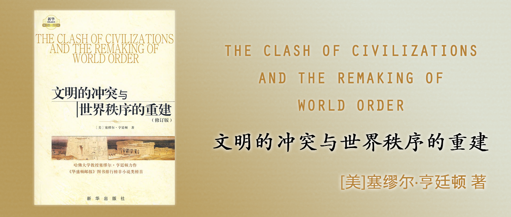

# 文明的冲突与世界秩序的重建

THE CLASH OF CIVILIZATIONS AND THE REMAKING OF WORLD ORDER

[美]塞缪尔·亨廷顿 著

## 中文版序言

这本书是美国哈佛大学教授塞缪尔·P·亨廷顿于1993年夏季由在《外交季刊》上发表了一篇题为[《文明的冲突？》（英语：The Clash of Civilizations）](https://en.wikipedia.org/wiki/Clash_of_Civilizations)文章中的观点。

## 前言

1993年夏，美国《外交》季刊发表了我的一篇文章《文明的冲突？》这篇文章中提出的论点：正在出现的全球政治主要和最危险的方面将是不同文明集团之间的冲突，引起了人们的各种反应，包括新奇、义愤、恐惧和困惑。

这本书是这篇文章的延伸，目的在于提出一个对于学者有意义的和对于决策者有用的看待全球政治的框架或范式。

## 第一部分 一个多文明的世界

### 第一章 世界政治的新时代

冷战时期的世界被分为两极三部分，美国阵营（富）、苏联阵营（略穷）、其他（穷）。

20世纪80年代后，随着共产主义世界的崩溃，冷战的国际体系成为历史。对国家最重要的分类不再是冷战中的三个集团，而是世界上的七八个主要文明。美国、欧洲、中国、日本、俄罗斯、印度、伊斯兰国家。未来的冲突将由文化因素而不是经济或意识形态所引起。而最危险的文化冲突是沿着文明的断层线发生的那些冲突。

冷战是杜鲁门提出的对于美苏格局的一个简化的范式。在冷战结束后，也出现了类似一些必要的范式，它们都或多或少地从不同的视角解读了冷战后的新的世界秩序：

1. 一个世界，欢欣而和谐。但事实上，虽然冷战结束了，但是各方势力并没有就此进入全面和平，各方势力慢慢形成了新的冲突和意识。
2. 两个世界：我们和他们。人们喜欢用二元论来区分我们的和你们的。前者包括西方和日本，它拥有大约15％的世界人口，后者包括其他所有的人。
    - 以富裕程度进行划分：前者富有后者贫穷，但冲突通常是在富有国家之间或贫穷国家之间的冲突，而富有国家和贫穷国家之间，则只有在前者想要殖民后者的前提下才会产生，但随着各个解放战争的胜利和殖民者自身放弃殖民，相对而言富余国家和贫穷国家之间的冲突其实是越来越少的。——所以基于富余程度划分，难以解释各个阵营之间的冲突。
    - 以文化差异进行划分：把世界分成西方的和非西方的。这种划分方式没有太大的意义，因为非西方的国家之间，事实上在宗教、社会结构、体制和普遍价值观方面是各不相同的。
3. 以国家为边界，将世界分成184个国家。这种划分有其一定的道理，主要是因为在国际政治中国家是常见的单元，国家和国家之间处于无政府状态，依靠实力来平衡各自的关系。但这样的划分的问题是：所有的国家都以同样的方式看待自己的利益，并以同样的方式行动。它简单地假定实力是理解国家行为的唯一出发点，但却没有达到深入的理解。
4. 完全的混乱。它以世界所发生的冲突为主脉络来描绘世界。它虽然构造于现实，但是世界并不是完全无序，也并非由冲突构成的，它对于理解世界秩序可能帮助不大。
5. 从七八个文明来看待世界（本书所提倡的看待世界的范式）。它不像一个世界和两个世界的范式那样，为了简化而牺牲现实；但它也不像国家主义和混乱范式那样为了现实而牺牲简化。它提供了一个易于把握和易于理解的框架，可以用来理解世界，在越来越多的冲突中区分不重要的和重要的，预测未来的发展，为政策制定者提供指导路线。它也建立在其他范式的要素的基础之上，并结合了这些要素。它与其他范式之间较之那些范式彼此之间更加相容。
    - 世界中的整合力量是真实的，而且正在产生对文化伸张和文明意识的抵消力量。
    - 世界在某种意义上是一分为二的，主要的区分存在于迄今占统治地位的西方文明和其他文明之间，然而，其他文明之间几乎没有任何共同之处。简言之，世界是划分为一个统一的西方和一个由许多部分组成的非西方。
    - 民族国家是而且仍将是世界事务中最重要的因素，但它们的利益、联合和冲突日益受到文化和文明因素的影响。
    - 世界确实是无政府主义的，充满了部落和民族冲突，但是给稳定带来最大危险的是那些来自不同文明的国家和集团之间的冲突。

### 第二章 历史上的文明和今天的文明

### 第三章 普世文明？现代化与西方化

## 第二部分 变动中的各文明力量对比

### 第四章 西方的衰落：力量、文化和本土化

### 第五章 经济、人口和挑战者文明

## 第三部分 正在形成的文明秩序

### 第六章 全球政治的文化重构

### 第七章 核心国家、同心圆和文明秩序

## 第四部分 文明的冲突

### 第八章 西方和非西方：文明间的问题

### 第九章 多文明的全球政治

### 第十章 从过渡战争到断层线战争

### 第十一章 断层线战争的动力

### 第十二章 西方、各种文明和全球文明

## 附录

## 脚注

## 注释

## 《文明的冲突与世界秩序的重建》导读

## 数量优势下的恐惧

## 编后记
