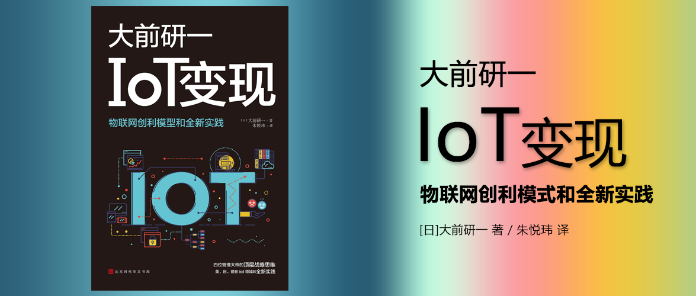

# IoT变现

物联网创新模型和全新实践

[日]大前研一、村井、岛田太郎、维尔纳·凯斯特勒 著

朱悦玮 译

ISBN: 9787569932171

## 物联网场景

- 餐饮
  - 传感器监测成分比率
  - 温度实时监测，精准控温
- 安保
  - 可疑人物自动识别预警
- 交通
  - 车辆雨刷监测，实时优化运营，增派服务车辆
  - 公交车加装座位重量传感器，收集拥挤程度数据
  - 车站售票机
  - 乘客门
  - 车流量与信号灯同步系统，改善交通
  - 高速公路利用图像传感器抓拍车辆，分析拥堵情况
- 智能家居
  - 自动调节空调温度

---

以下为原文“想法”与“划线”：

## 第一章　IoT战略的关键

### 什么是IoT

 2023-02-25

可口可乐公司与麦当劳等销售店铺进行合作，建立起了一个通过传感器来检测产品中各个成分的比率，并利用远程终端收集与传送数据的系统。

 2023-02-25

对便利店展示柜内部的温度进行管理。为了让展示柜内部的温度保持在7~8℃，就必须在监测外部温度的同时，对制冷的功率进行调整。

### 作为社会系统刚刚起步的IoT

 2023-02-25

安保服务，只要安装在大门上面的170°超广角摄像头发现可疑目标，就会立刻将信息传送给事先登陆过的手机或者电脑。

 2023-02-25

出租车上安装了传感器，给每一个雨刷器都分配了IPv6地址，从而能够通过互联网实时掌握雨刷器的运转情况。这样以来，一旦某个区域的出租车雨刷器同时启动，就说明这个区域下雨了。而下雨的话必然会导致民众对出租车的需求增加，只要将位于其他区域的出租车调过来，就可以实现更高效率的运营。不过，实际上出租车总是过于集中在某一个地方，事情发展的并不如预料之中那么顺利。

 2023-02-25

在山顶附近设置一个检测降雨量的传感器，通过数据传输网络来传送数据。这样以来，位于山脚下露营场地的登山者就可以通过智能手机上的应用程序来事先确认山上是否有雨，从而避免遭遇泥石流或山崩的危险。

 2023-02-25

在房间里没有人的时候，自动调节空调温度达到省电效果的智能家居系统就是其中之一。

 2023-02-25

通过在公交车的座位上安装重量感应装置，可以使在车站候车的乘客提前了解到公交车上的拥挤情况，从而能够及时地做出“不搭乘这辆拥挤的公交车，等候下一辆公交车”的判断。这种做法也能够使公交车的运行更加顺畅，因此已经被许多公交公司采用。

 2023-02-25

车站的售票机

 2023-02-25

全世界第一个乘客门（Passenger Gate）。

 2023-02-25

车流量与信号灯同步的系统。这个系统可以通过线性规划（Linear Programming）计算出应该何时改变信号灯的颜色才能使车流量实现最大化。

通过在十字路口的地下埋设涡电流传感器检测上面是否有车辆行驶，然后利用遥控器改变信号灯颜色的系统。这样可以使主干道在辅路没有车的时候一直保持绿灯，从而缓解交通拥堵的情况。

 2023-02-25

通过在高速公路上的特定地点设置图像传感器，可以对过往车辆的图像进行解析，然后将解析数据送往下一个地点，从而计算出车辆通行所花费的时间，不但可以把握高速公路上有多少千米的距离出现了拥堵的情况，还可以计算出通过拥堵路段所需的平均时间。也就

### 从今往后是IoT的时代

 2023-02-25

IoT就是将收集原始数据、进行解析、获取结果、找出隐含在结果之中的意义这一系列流程都交给电子设备进行处理而已。因为现在是所有一切都通过互联网连接在一起的时代（Internet of Everything），所以只要有发信器与传感器，上述的一切都完全可以实现。

 2023-02-25

在进行远程教育的时候，如何把握学生的听课状况，对校方来说一直以来都是非常难以解决的问题。曾经与BBT进行合作的南加州大学（USC）就因为远程教育无法确认出席情况而拒绝授予学位。于是我开发了一个系统，这个系统与接受远程教育的学生所使用的电脑中的内置时钟同步，当学生按下开始上课的按钮之后，每一小时出现5次随机的字母或数字，学生必须在一定时间内通过键盘输入同样的数字，这就证明学生在授课期间并没有缺席。这个系统在日本和美国都申请了专利。

 2023-02-25

利用iPad和iPhone内置的水平传感器，使学生可以通过上下或者左右晃动设备来表示对老师提问的赞成或反对，这样授课教师也能够第一时间把握学生赞成和反对的比例。

### IoT设备的基本结构（图4）

 2023-02-25

老年人起床传感器

 2023-02-25

在工作现场，监测气体泄漏的传感器

### 从M2M扩大的IoT世界

 2023-02-25

以保险领域为例。一直以来，保险公司都是根据顾客的年龄、性别、驾龄、出险率等来决定顾客的保险费。也就是被动保险（Passive insurance）。但导入IoT之后，保险公司就可以要求顾客在车辆上安装酒精监测传感器和急刹车传感器等与安全驾驶相关的传感器，然后根据这些传感器的数据来决定保险费，从而实现主动保险（Active insurance）。

 2023-02-25

信用卡领域也是如此。按照正常的业务流程，信用卡公司只需要收取1％的手续费就足够了。既然如此，为什么信用卡公司要收取4％的手续费呢？因为有一部分恶意透支并且拒不还款的客户存在。信用卡公司为了从这些人手中追讨欠款，需要发送催款通知、派遣专人追讨，甚至告上法庭。而追讨欠款的费用就要分摊到所有客户的头上，所以手续费就变成4％了。如果信用卡公司能够根据每个客户的风险情况收取手续费，那么绝大多数的客户都只需要支付不到1％的手续费即可。

 2023-02-27

比如在“健康管理”领域，近年来像Fitbit那样的可穿戴设备愈发受到人们的关注。只要戴上Fitbit的智能手环，就可以将自己的健康数据记录下来，甚至还可以将每一餐吃了什么都拍摄下来，远程发给营养师，寻求对方的指导。

 2023-02-27

在“员工培训”领域，小松集团将IoT应用于推土机驾驶员的培训。如果驾驶员在前方有人的时候进行了操作，或者因为对向车辆踩了刹车，报警器就会发出声音。同时电脑还会通过自动控制使设备停止，或者改变方向盘的角度。

 2023-02-27

“仪表读数·记录”。从今往后再也不用专人挨家挨户地去查水表和煤气表的读数了。因为所有的计量器都将被更换成能够远程传输数据的遥测仪。

 2023-02-27

在“医疗”领域，远程诊断将成为可能。这原本是美军为了对在前线负伤的士兵进行及时的救治而开发的系统，如今美国最先进的医院都导入了这一系统，通过将数据传输到医疗机构，不管患者在哪里都可以进行诊断。

 2023-02-27

约翰斯·霍普金斯大学甚至还研究出了可以远程进行手术的遥控手术刀。

 2023-02-27

办公设备的IoT就是“预先维护”。通过在打印机和复印机上安装传感器，可以及时地把握墨水与纸张的剩余数量以及卡纸的位置。另外，维修公司还可以直接掌握橡胶衬垫的状态等数据，一旦出现问题，维修人员就会第一时间赶到提供维修服务。

### IoT发达国家的应用事例

 2023-02-27

在“安保”领域，监控摄像头已经得到了普及。

 2023-02-27

在“营销”领域，许多设备都得到了开发和利用。比如通过类似于Line“摇一摇”功能的系统，当商场的老顾客进店时，相应的信息会第一时间传达到所有的楼层。

 2023-02-27

IoT还被活用于“提高业务用车辆的使用效率”和“提高飞机等运输工具的安全性”等方面。

 2023-02-27

如果通过IoT能够实现远程监测的话，那么像修理与维护之类的售后服务也可以在德国本国进行应对，对于将这一体系在全世界范围内展开非常有利。

 2023-02-27

所谓智能工厂，就是在生产设备和零件上加装传感器，利用网络将所有数据连接起来的工厂。智能工厂能够自动运转，从而实现包括大规模定制（Mass Customization）在内的各种生产方法。另外，要想实现智能工厂必须具备相应的软件技术，西门子通过收购德国、美国、法国、巴西、比利时、加拿大、英国等国家的软件企业，获取了必不可少的软件技术。

 2023-02-27

GE还计划从依靠产品销售与售后维护赚取利润的“合同模式”，转变为通过工业互联网对数据进行分析来帮助客户企业提高效率的“按需销售”模式（图11）。

 2023-02-27

比如，到目前为止飞机引擎的维护和保养都需要等飞机降落之后由人工进行，但今后通过IoT，即便在飞机飞行中维保人员也能够实时把握引擎的状态，一旦发现问题能够在飞机降落后第一时间进行维修。也就是说，生产企业不只销售飞机引擎，更在销售后对引擎进行二十四小时不间断的监测。预计对飞机引擎的远程维保将来会有6兆~10兆日元的市场。如果能够将远程维保扩展到整个飞机的所有设备和零部件，那么这一市场的规模将达到22兆日元。如果更进一步将服务范围扩大到制定运行计划、提供最优路线、降低运营成本等领域，那么这一市场的规模将达到80兆日元。

注: IoT设备制造商的商业模式，可以由销售产品，转化为“为客户企业提供服务”，提供实时监测、自动更换等服务。

 2023-02-27

小松集团推出了一项利用位置信息对工程机械进行管理的服务“KOMTRAX”。这项服务的主要内容是通过在工程机械上安装GPS，对零件的损耗情况、机油的老化状态等设备信息以及车辆的位置信息等数据进行监测，及时地将维保信息发送给代理店或顾客的手机。除此之外，还可以通过位置信息来找出被盗的工程机械，或者通过远程操作将没有按时支付贷款的工程机械的引擎锁定。小松之所以能够在中国市场与行业排行第一的卡特彼勒公司一争高下，全凭“KOMTRAX”。

小松集团还利用无人机对现场进行3D扫描，制作出现场的3D图，将最终的完成图3D模型化，通过模拟制定施工计划，对土质与地下埋设物等的风险进行调查和分析，通过搭载ICT的工程机械使施工进程可视化，利用施工后的数据对建筑与土木现场的施工作业提供支援。小松将这项业务命名为“KomConnect”。通过将与上述一系列流程相关的所有信息都输入到处理系统之中，将建筑现场的一切都通过ICT连接起来，能够大幅提高生产效率。此外，这其中还包括在危险区域进行安全施工的无人工程机械计划。

注: KOMTRAX：维护、售后、监测等；KomConnect：建模、计划排期、进度管理等。

 2023-02-27

农业机械生产企业久保田开发出了一个名为“KSAS（Kubota Smart Agri System）”的管理系统。该系统通过在农业机械上搭载传感器和通信设备，利用无线局域网和手机网络将数据收集到云端，然后对作业记录进行管理。有了这个系统，就可以通过传感器来把握必要的信息，对撒农药和浇水的时间以及除草的时期进行控制。

另外，有研究表明大米中蛋白质含量为5％~6.5％的时候味道最佳，而且收获量也比普通状态下多15％。如果利用KSAS的传感器监测土壤的状态，自动施加适量的肥料，就可以培育出蛋白质含量最理想的“美味大米”。

 2023-02-27

Weather News将通过信标传感器和会员的智能手机收集到的信息，与公共机构的观测信息组合到一起构筑起大数据。然后对大数据进行分析，向用户提供比传统的天气预报范围更小且内容更加详细的气象信息。

 2023-02-27

法国的米其林集团面向运输公司提供了一项基于实际行驶距离收取轮胎租赁费用的“轮胎维护服务（Tire as a Service）”。米其林通过在汽车的引擎和轮胎上加装传感器，收集油耗、轮胎气压、气温、车速、定位等数据。然后通过3G线路将这些数据上传到云端，再由米其林的专家对数据进行分析，最后向运输公司提出“轮胎需要更换”“轮胎气压太高”之类的建议。

 2023-02-27

米其林集团不只将轮胎作为硬件销售，更提供后期维保的软件服务并以此来赚取利润，这属于一种崭新的商业模式。轮胎销售的市场规模大约为6兆~7兆日元。与之相对的，轮胎维保的市场规模大约有50兆日元。

 2023-02-27

以前，特斯拉的电动汽车出现过在高速行驶过程中车载电池着火的事故。经过检查发现造成事故的原因是车辆的程序设定为在高速行驶时自动降低底盘，导致路面上的石子击中车载电池引发着火。于是特斯拉汽车让经销商给车载电池加装了保护罩，又提供了在高速行驶时不会降低底盘的程序供该款车型的车主下载安装。通过这种方式，不但防止了同类事故的再次发生，还大幅降低了对应的成本。

 2023-02-27

美国前进保险公司（Progressive Insurance）是一家以汽车保险为主的保险公司。这家公司推出了在客户汽车上安装M2M通信设备，让保险公司能够监测客户的驾驶状况，使客户享受保险费折扣优惠的车险服务。保险公司会用6个月的时间收集客户的驾驶时间、地点、速度、急刹车频率等数据，然后将这些数据与根据所有驾驶者的驾驶状况和事故状况构筑起来的大数据模型进行比对，计算出客户发生事故的风险，最后根据风险情况决定客户需要缴纳多少保险费。

 2023-02-27

在机器人行业处于领先地位的发那科（FANUC），通过收集工业机器人的运转数据来预先发现可能出现的故障，从而大幅降低设备出现意外停止的情况，帮助工厂提高设备运转率。

 2023-02-27

一直以来，企业只能通过销售人员提交的销售报告来把握销售人员的业务状况。但是，这种方法无法准确地把握实际情况，因为业务人员就算只去跟客户打了声招呼就回来了，也一样能写出一份非常详尽的销售报告。cyzen完美地解决了这一问题。通过cyzen，公司能够把握销售人员在客户处滞留的时间，还可以通过Web上的画面对现场的销售人员实时地做出指示。另外，销售人员在访问客户之后可以第一时间将商谈的结果整理成报告发送回公司，这样就不用每次拜访过客户之后都回公司进行报告，从而提高销售效率。

 2023-02-27

cyzen的出勤管理、行为管理、成本削减等管理功能同样也可以应用于工厂的管理之中

 2023-02-27

未来非常值得期待的一项进步，就是利用IoT实现的智能家居。虽然全世界有许多企业都已经参与到这一领域的竞争之中来，但取得有价值成果的企业可以说一家也没有。亚玛达电器（YAMADA DENKI）于2011年收购了住宅制造公司SXL，意图扩张自身的智能家居事业，但到目前为止也没取得预期的效果。日本在这一领域进展速度最快的当属松下，但仅凭远程操作和可视化难以从顾客手中赚取利润。

更进一步说，智能家居的重心究竟应该放在哪里呢？能源管理，安保，还是护理？不同的使用目的对智能家居的功能要求也截然不同。

智能家居的市场规模预计有200兆日元。其中规模最大的能源管理领域或许会成为突破口，今后得到更大的发展吧。

注: 需求分散导致方案差异大，2C市场难以产生利润

 2023-02-27

西科姆的“西科姆无人机”是全世界第一款民用安保自动飞行监视机器人。现在西科姆从接到报警信息到派遣警卫人员抵达现场至少需要15分钟的时间，坦白说这个时间有点太长了。

 2023-02-27

在全球无人机市场占据70％份额的中国大疆（DJI）还与德国汉莎航空合作，将无人机应用于飞机的维保上。

 2023-02-27

Safie推出了一项可以利用PC和智能手机随时进行监控的安保摄像头，这款摄像头可以安装在户内和户外的任何位置，并且能够高清保存7天内的影像信息。客户使用这项服务需要每个月缴纳980日元的费用，还需要另外购买Safie的专用摄像头（19800日元）。

 2023-02-27

亚马逊向Prime会员免费提供了一个名为Dash按钮的IoT设备。会员无需打开电脑和智能手机的应用程序，只要按下这个按钮就可以通过Wi-Fi自动将商品放入亚马逊的购物车。

亚马逊还推出了亚马逊自动下单（Amazon Dash Replenishment Service）。如果家庭中使用的是能够对应这项服务的打印机和净水器等家电，那么传感器就会自动检测墨水和滤芯等耗材的使用状态，在有需要的情况下自动在亚马逊上订购耗材。

 2023-02-27

除此之外，亚马逊还推出了一款名为亚马逊Echo的能够识别声音的音箱。用户除了可以直接语音下单购物之外，还可以实现播放音乐、查询天气和交通信息、设定时间表与提醒、网络检索、照明等操作，甚至还可以网约车。

这项服务乍看起来非常便利，但我预计其只会引起暂时性的关注，终将销声匿迹。我之所以敢做出这样的预言，是因为我之前经营过一家名为Everyd.com的公司，在声音识别系统上投入了6亿日元。

用户只要对电脑说出“买东西”的指令，电脑屏幕上就会立刻显示出购物的页面，接下来只要继续说“购买××”，该商品就会直接放进购物车。这是全世界第一款可以语音购物的系统，最开始用户们都很喜欢使用，甚至给出了“比老公更听话”的评价。但几乎所有的用户在使用过一两个月之后就再也不用了。调查结果显示，用户之所以不再使用该系统并不是因为其不好用，而是因为“一个人自言自语很奇怪”“总是对着电脑说话会产生一种很惨的感觉”等生理上的原因。说白了就是不符合人类的生理习惯。

 2023-02-27

JR东日本最初是为了提高列车运行效率而导入IoT，现在又尝试着将这一技术应用于其他方面。

比如电力方面。JR东日本拥有自己的发电厂，可以为其提供相当于总耗电量三分之一的电力，除此之外JR东日本还和东京电力签订了一份合同使其能够以非常低廉的价格购买电力，如果这部分电力仍然不够用的话，那么JR东日本就必须花高价购买合同份额之外的电力。因此，JR东日本根据大数据与列车的运行状况，计算出不同时间的电力使用情况，通过制定最优化的列车运行组合，实现了成本的大幅削减。

过去，每当列车线路上出现事故时，都需要工作人员向等候在车站的乘客进行说明，并引导乘客换乘其他线路的列车，但今后类似这样的换乘信息将直接发送到乘客的智能手机上。另外，今后还可以通过在座位下方安装传感器，来使车上的拥挤情况可视化，这样在车站等候的乘客可以非常直观地看到下一趟车上的人员情况，从而能够做出合理的选择。

注: 运营计划与电力能耗优化，拥挤程度可视化

 2023-02-27

最初，鹰巴士公司并没有考虑到观光游客的实际情况，按照相同的间隔设置每趟车的发车时间，因此乘客的变动率极高。后来鹰巴士公司通过在车上安装红外线传感器和GPS，把握了每个车站上下车的乘客数量以及车辆运行时间的延迟等信息。根据这些信息，鹰巴士公司采取了在乘客数量较多的时间让车辆只在乘客较多的区间往返的措施，不但给乘客带来了便利，更成功地降低了运营成本。这种方法还被位于美国宾夕法尼亚州的威廉斯堡殖民地保护区等景点所采用，今后或许会普及到全世界所有的观光地吧。

注: 旅游线路班次优化，降本增效

 2023-02-27

DoCoMo InsightMarketing的人口动向分析服务“移动统计空间”，可以提供200万名访日外国人的位置数据。通过这项服务，可以把握滞留在日本各地的外国人的国籍比率。比如在中国人较多的地区可以增加懂汉语的店员，当俄罗斯人达到一定数量后就应该准备俄语翻译等。虽然对访日外国人来说这是一项非常便利的服务，但因为会同时泄露自己的国籍与行动路线，涉及侵犯个人隐私的问题，所以这项服务是否真的会被访日外国人所接受还要打个问号。

注: 提示：潜在个人隐私问题，导致顾客使用意愿下降。

 2023-02-27

位于美国佛罗里达州的迪士尼乐园度假区，要求每位游客在进园时都佩戴一个植入了RFID（Radio Frequency Identification）芯片的“魔法手环”。迪士尼乐园方面可以通过这个手环掌握进园的游客选择了怎样的观光路线，游玩了哪些娱乐设施，在哪家餐厅吃了什么食物等数据，通过对这些数据进行分析可以帮助其更好地进行运营。比如防止特定的娱乐设施在短时间内涌入大量的游客，让游客可以更好地体验园区里的娱乐设施。

 2023-02-27

在“设施”“能源”“运输与物流”等诸多领域之中，面向社会基础设施的IoT也得到了巨大的发展。在“设施”领域，富士通与METAWATER将IoT应用于故障预测，日本微软和竹中建筑公司则将IoT应用于设备管理。在“能源”领域，SAP将IoT应用于设备管理、美国国家仪器（National Instruments）将IoT应用于制造工程。在“运输与物流”领域，日本IBM与日本通运将IoT应用于物流管理，微软和伦敦地铁则将IoT应用于故障预测。在导入IoT之后，这些领域的社会基础设施的安全性和效率都得到了相应的提升。

 2023-02-27

亚马逊利用收购的Kiva物流机器人系统，极大地提高了自身的物流效率。

 2023-02-27

从总体上来说，智能城市的特点在于将重心放在安全、安心、节能等部分。比如利用搭载红外线摄像头的无人机找出热量流失特别严重的住宅，然后对其加装双层玻璃或者在窗户内侧贴封条，从而帮助整个街区实现节能。

 2023-02-27

现在搭载各种充满创意的传感器的设备越来越多。在家用社交机器人领域就有感情识别机器人“Pepper”、会说话的机器人“OHaNAS”、家庭机器人“JIBO”以及幼儿园看护机器人“MEEBO”等。除此之外，搭载传感器的设备有可穿戴式排泄预警装置“Dfree”，配合行动发光的鞋“Orphe”，搭载加速度传感器和陀螺传感器、可以根据手臂的动作模拟出乐器演奏效果的智能玩具“Moff”，在应用程序中输入身高与体重就可以根据跳跃次数计算出消耗卡路里与BMI值的智能跳绳等。

虽然这些设备作为商业项目还不足以取得可观的利润。但在生产这些设备的过程中开发出来的这些充满创意的传感器却很有可能被应用于其他具有极大发展潜力的领域，因此非常值得关注。

### IoT商业模型的思考方法

 2023-02-27

如果想利用IoT创造价值，那就不能只将其看做是单独的终端、设备或者互联网，而要将其看做是一个相关系统的复合体来进行思考（图32）。

 2023-02-27

也需要将思考领域从“产品”扩大到“服务与平台”上面来（图33）。

 2023-02-27

特斯拉汽车以及今后意图进军汽车市场的谷歌和亚马逊都对这一领域十分关注。他们采取的并不是销售汽车硬件这种商业模式，而是为消费者提供实用性和满意度的商业模式。汽车市场也确实存在朝着这一方向发展的趋势。

### 设计收益模型

 2023-02-27

设定价格和收费的方法包括从量收费、成果报酬、定额制、会员制与免费增值、动态定价等。

### IoT对企业来说意味着什么

 2023-02-27

今后，IoT将消除产业之间的屏障（图35）。除此之外，像特斯拉汽车那样超越行业之间的屏障从软件领域进军汽车领域的情况将会频繁出现。在这种情况下，一直以来都保持着稳定的行业结构和秩序必将悄无声息地瓦解。来自其他行业的大量新参与者，以及全新的商业模式带来的残酷竞争，这对于行业内所有的企业来说都是一个坏消息。但与此同时，企业也拥有了许多进军其他行业的机会，只要应对得当，也可以凭借新的商业模式来提高自身的竞争力。这样以来，IoT又变成了所有企业的福音。

 2023-02-27

比如一直以来企业都要派遣专人前往生产现场进行巡视，但如果将这项工作交给监控摄像头来完成，那么不但可以削减成本，还可以将这一系统商品化。

 2023-02-27

一切的关键在于转变思想。总之现在能够明确一点。那就是如果在IoT的浪潮下不采取任何行动，便无法避免与新加入企业之间的残酷竞争。既然如此，还是积极地利用IoT把握新的事业机会更好，重新定义自身的事业领域、发掘新的商业模式。

注: 如果不投入创新，就会面临被淘汰的风险。

### 通过IoT创造价值及具体步骤

 2023-02-27

IoT商业活动的本质，在于对设备收集到的数据进行分析和利用，创造新的价值，从而获取经济利益（图36）。

 2023-02-27

在导入IoT商业活动时，不管企业规模大小都应该从小做起（图37）。最好是先建立起一个小团队，大胆地起用年轻人和外国人。因为如果只依靠那些在该行业内工作多年、思维已经僵化的人，不管进行多少次头脑风暴，最终的结果都是可以预见的。如果在公司内部找不到合适的人才，那从公司外部引进人才也是不错的选择。

### 【疑问解答】

 2023-02-27

优步只用了短短5年时间就扩展到全世界351条街区。注意是街区而非国家。因为对优步来说，只有占领街区才算占领了市场，就算宣布进军日本市场但如果在日本的街道上只有一辆优步的汽车在行驶的话那有什么意义呢。优步之所以能够以街区为单位划分市场，离不开智能手机的帮助。

注: 在虚拟世界拥有一个全新的业务边界，淡化了国界的限制让区域市场变成全球市场。

 2023-02-27

在乘客支付的车费之中，80％由驾驶员获得，剩余的20％则由优步收取，而在这20％之中除掉运营成本后的纯利润全都集中到百慕大的免税地区。虽然优步的总公司位于旧金山，但这里的收入只有其总利润的1.45％，所以美国政府无法收取税金。这种避税的方法也是优步在5年时间内成长为市值5兆日元公司的原因之一。

上述这一切都因为优步是一家个人创业的公司才能够得以实现。如果三菱汽车也想到了类似优步的创意，想要将其发展成为一项事业，那么光是向相关人员进行说明就要花上5年的时间，而真正实现恐怕要花上一个世纪。

公司本身就是缺乏灵活性的组织。如果大企业想推行IoT，最好的办法就是挑出三个头脑灵活的人，让他们自由发挥，只要每半年进行一次汇报就好。

注: 大型企业进行创新的真实现状。

 2023-02-27

对众包一窍不通，完全没有利用外部人才想法的企业，未来的发展前景令人担忧。

 2023-02-27

Q2： 我们公司以硬件为主，今后想收购一些以提供解决方法为主的企业。需要注意哪些问题？

大前： 以硬件为主的公司收购以提供解决方法为主的企业并取得成功的例子并不多见。搞硬件的人都追求立竿见影的效果，而提供解决方法的人则不能用这种态度去工作。如果真的想让收购取得成功，那就应该往收购对象处多派遣一些拥有解决方法工作经验的人，并且利用这些人构筑起两家公司交流的接口。否则的话，就算将对方公司收购了过来，也会因为交流不畅而无法使被收购的企业充分地发挥其应有的作用。在进行交流时必须以人为单位，而不能以公司为单位。绝大多数并购失败的原因都在于此。

此外，还可以通过派遣过去的人来改变被收购企业的企业文化。改变被收购企业的企业文化是收购方的责任和义务。

改变企业文化时，效率尤为重要，关键在于收购后的头三个月。必须在这个时间段内将“我们对你抱有这样的期待”这一内容明确地传达给对方，并且让对方彻底理解清楚。一旦过了这个时间段，那么对方就会产生出“还像以前一样工作就好”的心理惰性，到了这个时候再想对其进行改变就非常难了。所以还是趁热打铁最好。

毫无疑问，想要仅凭硬件盈利是不可能的。所以就连IBM这样的大企业都向提供管理顾问和整体解决方案等服务转型，但因为硬件与软件的企业文化完全不同，因此这种转变非常困难。IBM也是在路易斯·郭士纳这一来自外部的“铁血宰相”的帮助下才取得成功。

从这个意义上来说，硬件公司在收购以提供解决方法为主的企业时，必须有将自己企业的未来都押在被收购企业身上的觉悟和热情才能够取得成功。

 2023-02-27

有许多在中西部和东北部工作的美国白领，都会在温暖的南部地区购买第二套房子。他们会在夏季和家人一起来这套房子度假，其他时间则将房子委托给管理公司帮忙出租。这样以来，就算这套房子是贷款买的，也可以通过租金来偿还部分的贷款，使家庭不必承担太多的压力。而等他们退休之后，就可以将北部的房子卖掉，直接搬到更适宜生活的南部。日本人常说美国人没有存款，但实际上美国人可以在退休之后卖掉一套房子换取现金，这样就算不用特意攒钱也一样可以安享晚年的生活。

 2023-02-27

怎样才能促使民众们花钱呢？德国的事例可以供我们参考。德国人以前和日本人一样，拼命工作却很少休息，但现在夏季享受两周休假，冬季享受一周休假。其中冬季的一周休假是滑雪假，如果像日本的黄金周一样全国一起放假，那么滑雪场里肯定是假期的时候人满为患，而假期之外的日子则冷冷清清。于是德国政府将每所学校的滑雪假时间错开，学生家长可以根据孩子学校放假的时间申请休假。这样以来，谁都可以悠闲自得地享受滑雪，滑雪场也能够在整个冬天都得到充分的利用。

 2023-02-27

为什么日本的老人不敢花钱呢？因为他们害怕自己将来有一天会躺在床上动不了，需要依靠别人的照顾。但实际上真正病倒卧床不起的情况在每7位老人之中才有1位，而其他6人都是“突然死亡”。如果真的为国家的经济发展考虑，政治家就应该将这个情况准确地传达给老年人，并且制定一些让老年人能够充分享受老年生活的计划。

 2023-02-27

只有不断涌现出敢于大胆进行尝试的人，国家才能得到持续的发展。但要是像现在这样，所有人都对机会视而不见，只是一味地存钱却什么也不做，那10~20年后日本将没有未来可言。

## 第二章　IoT怎样改变未来

### 日本的互联网起源于JUNET

 2023-02-27

违反法律绝对不是什么值得提倡的行为，但如果一味地等待法律条款改变，就无法引发像爱彼迎和优步那样的创新。在商业活动之中要想挑战新技术，就必须敢于承担风险，走在规则的前面。

现在“特区”是解决上述问题的方法之一。可以提出某种理由，申请一个仅限在当地进行某种行为的特区。比如千叶市现在就是无人机特区，我工作的SFC（庆应义塾大学湘南藤泽校区）所在的藤泽市是机器人特区。

### After the Internet

 2023-02-27

接下来，就是所有设备都被连接起来（图1）。也就是所谓的IoT。但是，关于这个IoT的“T”则必须慎重对待。说得更清楚一点，那就是希望政府不要过多干预，不要提供资金之类的支援。“T”与互联网相连之后会变得非常便利，这一点不言自明。所以让想要进行发明创造的人可以按照自己的想法自由地创造才是最好的选择。

 2023-02-27

另外，创造者也必须认识到，硬件很快就会变成免费的。哪怕在开发上投入了30亿日元，但当全人类都要用你开发的东西时，那么这件东西就会变成免费的。

 2023-02-27

到目前为止数据都是被从四面八方集中于某处之后再进行处理，但今后能够对这些数据进行分散处理的计算机的重要性将越来越高。最近“自动分散处理”的密码化就是对这一事实的最佳证明。

 2023-02-27

如果能够将这些相互独立的智能手机连接起来，那么就将形成一个非常可怕的局域计算机集群，能够处理一切数据。当然，相关的整备活动如今正在进行当中。这也是现在计算机系统结构的有趣之处。

### T is for Transportation

 2023-02-27

后来当我们的这项实验公开之后，立刻遭到警察的投诉。因为只要掌握了车速的数据，就可以知道哪些道路出现了拥堵，而民间是不允许拥有这些信息的。

 2023-02-27

对于农业来说，明天的天气是非常重要的信息，如果民间组织企图擅自通过IoT获取相关信息，也会遭到政府的阻挠。因为擅自预测明天的天气违反气象法。

 2023-02-27

在数据的隐私和安全性问题上最棘手的就是标准化以及横向共享。

 2023-02-27

现在的问题在于，任何一家企业和政府部门都不愿意将自己拥有的数据共享出去，所以执行起来也是困难重重。

### 3D打印机

 2023-02-27

如果能够利用3D打印机和数据来制作乐器，而且材料也可以在当地获取的话，那么全世界的人都可以通过一封邮件就自己制作出与雅马哈的产品一样的东西。这样的话连物流都省了，那关税要怎么办呢？

 2023-02-27

还有一个就是产品责任问题。如果一个人从雅马哈的官方网站上下载了设计图，根据这个设计图用3D打印机制作了一把小提琴，然后在演奏这把小提琴的时候受了伤，那么究竟应该由谁来承担这个责任？是雅马哈，打印小提琴的人，还是提供材料的人呢？如果不能搞清楚这些问题，3D打印技术就无法在社会上得到进一步的发展。

 2023-02-27

该项目组的目的之一是制作人造器官。随着研究的不断深入，该项目组已经能够用非常廉价的材料制造出非常接近真正器官的人造器官。医生们可以利用这些人造器官进行高频手术刀的练习。

 2023-02-27

如今和贝纳通一样同为服装公司的优衣库也在自己公司的商品上附加RFID来进行商品管理。不过优衣库在隐私保护上采取了一些措施，比如消费者可以自行将标签拆下，店里也提供破拆服务，这才终于被社会所接受。

 2023-02-27

三次元的物品如何通过网络进行QIP（Quality Control：品质管理，Intellectual property：知识产权，Product liability：产品责任）的管理是今后非常重要的课题，而在3D打印的物品上附加RFID毫无疑问是解决这一问题的最佳方案。

### T is for TV

 2023-02-27

日本是发达国家中唯一电视广告收入还在持续增长的国家。也是发达国家之中唯一互联网广告收入没有超过电视广告收入的国家（图3、图4）。这究竟是为什么呢？其实只要打开电视看一看就会找到答案。电视广告中的绝大多数都是谷歌、乐天、雅虎等互联网企业的广告。在日本，只要利用电视广告进行宣传，商品的销量就一定会得到提高，所以就连互联网企业也积极地通过电视来打广告。这在全世界都是非常少见的情况。

### 将数据作为社会基础

 2023-02-27

在数据大国日本有两个宝贝，一个是汽车，另一个就是手机。

 2023-02-27

我认为，应该将汽车和手机的相关数据也作为社会基础，并且允许其被应用于商业活动之中。这样的话，一旦发生自然灾害，就可以利用这些数据维护公众的利益。事实上已经有一些初创公司开始制作相应的应用程序来提供类似的服务。当然，可以采用降低用户电话费的方式作为提供隐私数据的回报。

在汽车和手机等隐私数据的管理方面，由一桥大学堀部政男名誉教授担任委员长的个人信息保护委员会正在制定相关的法律法规。另外，在使用国情普查时收集到的数据时，如何保护个人隐私也是这个委员会的工作之一。

### IoT怎样改变未来

 2023-02-27

比如在农业领域，通过价格低廉且购买方便的传感器，可以掌握播种和浇水的时间、对土质进行最优化调整、控制收获物的品质和收获量，实现农业生产的高精度化。农业机械自动化的速度也在不断加快，如今利用无人机在农作物上方三十厘米处高效地撒播农药已经成为现实。

 2023-02-27

分散在世界各地的计算机正在连接起来。现在利用WebRTC（Web Real-Time Communication：网页实时通信）技术连接网页浏览器的技术得到了长足的发展。

 2023-02-27

当网络系统结构发生改变，安保相关领域也将发生变化。窃听、有线网络安全、无线网络安全、安全网页、加密、解密……如果用冰山来比喻的话，这些都是隐藏在海面下看不见的部分，而看得见的部分则包括服务应用程序的安全、数据安全、设备安全等。除此之外，如何将这些内容组合起来也是必须要考虑的问题。

 2023-02-27

我本人目前正负责对利用数字数据的开放数据的规则制定工作，希望不要发生同样的事情。也就是说，需要多个省厅之间相互合作的项目，必须制定共通的政策并实行，这是政府在互联网时代必须面对的课题。

 2023-02-27

造成这种结果的原因大概是日本纵向的组织结构。但让纵向的组织产生出横向的连接正是互联网的使命和责任，从这个意义上来说，IoT对于日本企业来说是一个非常大的突破，也应该是一个非常具有吸引力的平台（图6）。

 2023-02-27

比如在信息安全方面，政府一方面想要保护国家的安全，另一方面还希望民间企业能够通过全球化来推进经济发展（图7）。

### 【疑问解答】

 2023-02-27

奇点理论最近之所以受到关注，是因为在越来越多的领域中人类的劳动都被计算机和机器人所取代。但是，与其说这是AI超越了人类，不如说是人类将可代替的工作交给AI去做，所以并不用太过担心。

 2023-02-27

建立起一个能够降低承担这一风险的体制就是政府的责任。

注: 相比于常见的“中国的数据隐私政策不够规范，带来了数据潜能巨大”，换个说法“为了实现数据领域弯道超车，主动降低数据应用创新的门槛，减少使用数据应用创新方面的风险”。

## 第三章　西门子与德国的新制造业战略（工业4.0）

### 日本的课题是什么

 2023-02-27

德国人不管做什么事情进展都非常缓慢。他们总是把“为什么”和“组织会怎样做”挂在嘴边，迟迟不肯采取行动。

虽然从表面上来看日本比德国更有效率，但不知为何德国人最后总是能够拿出令人满意的成果。而且在商品的品质方面，甚至有很多比日本还要好。

 2023-02-27

德国的一切都实现了标准化。因此任何事情都有固定的规则，绝对不会因为特殊情况而有特殊的改变。但是对于日本来说，任何事情都可以特事特办和随机应变，而且每个人都认为这种做法无可厚非。所以日本在非常宜居的同时，也会产生出大量的无用功。生产效率低下自然在所难免。

 2023-02-27

虽然德国人以赶中超美为目标，但却并不打算靠延长劳动时间这个办法。下午五点下班，回家陪孩子玩或者放松一下对德国人来说是理所当然的。于是，为了不延长劳动时间，德国举国上下采取了更加严格的标准化制度，通过彻底的消除无用功来提高效率。工业4.0就是这一举措的产物。

 2023-02-27

德国并不急于实现工业4.0。他们在进行许多研究之后，提出了“未来还需要20年的发展时间”“这项变革需要30年”之类很理智的目标。因为要想改变一个国家的体质，必须从一点一滴做起，而且不能有任何的疏忽和大意，花费一些时间也是在所难免的。

### 通往工业4.0之路

 2023-02-27

到了工业4.0时代，互联网和数字化革命使虚拟与现实的融合成为可能。今后可能会出现与之前完全不同的生产方式，非常值得我们期待。

### 数字化的发展程度

 2023-02-27

智能手机正在不断地发展进化。用不了多久，智能手机的技术就将转变为下一个时代的制造技术。所以我的上司胡佛提出“我们应该主动去思考，当发生那样的变化时自己能做什么、应该做什么，这样一旦真的发生了变化才能够及时地应对”。

按照数字化商业模式的成熟度由高到低对产业进行排列依次是媒体、商业、出行、健康、制造、能源，制造业的排名可以说非常靠后，我认为与其盲目摸索不如多吸取其他行业的优秀经验，这才是最有效率的做法（图3）。

### 工业4.0为什么必不可少（图4）

 2023-02-27

德国的制造业要想提高竞争力赶中超美，必须把握住三个关键点。

第一个是“先人一步进入市场”。

这就需要提供目前市场上没有的全新产品，并且在满足复杂化要件的同时能够实现大批量生产。

第二个是“提供符合顾客需求的产品”。

这一点用英语来说就是“Mass customization”（大规模定制），关键在于通过敏锐的直觉，在急剧变化的市场之中找出消费者的需求并且高效地提供相应的产品。

第三个是“以最低的成本提供产品”。提供定制产品其实并不难，只要完全按照用户的需求进行生产即可。但是，这种生产方法必定会导致成本上升。而高昂的成本无法在竞争中获胜。所以，除了定制之外，还需要模块化与标准化，实现低成本的大规模定制。

### 西门子基于大趋势的战略（图6）

 2023-02-27

西门子在制定战略的时候最重视的就是“大趋势（Megatrends）”（能够影响世界形势的宏观经济动向）。如果能够准确地把握大趋势，并且紧跟大趋势，那么公司将会基业长青。

我在西门子工作了九年，“大趋势”都没有发生太大的变化。因为西门子重视的大趋势是非常具有普遍性的。

西门子重视的大趋势具体包括以下5点。

1．数字化转变（利用数字与IT的力量进行转变）；

2．全球化（社会与经济的关联打破传统的国家与地区的框架，扩大到全球规模引发各种各样的变化）；

3．城市化；

4．人口动态；

5．气候变化。

 2023-02-27

顺带一提，要想将事业卖掉，一定要趁事业还盈利的时候。因为只有在还盈利的时候将事业卖掉才能够赚取最多的利润，这样公司就有足够的资金投入到数字化事业当中。

 2023-02-27

在德国，写着“西门子”商标的广告牌随处可见。西门子的家电也到处都是。但实际上，这些并不是西门子制造的产品。

比如西门子早就将家电部门出售给了博世，所以准确地说这些家电应该是博世牌的，但在德国西门子的名气更大，因此博世继续沿用了西门子的品牌。我在德国生活的时候也购买过一台并不是由西门子实际生产的“西门子”洗衣机。

 2023-02-27

基本上来说，西门子的目标是成为一个以提供基础设施为主的公司，而除此之外的B2C事业，哪怕是由自己一手创建的也坚决出售。

### 西门子早在十五六年前就看准了数字化

 2023-02-27

西门子的强项究竟是什么呢？那就是他们很擅长生产进入壁垒极高的产品。实际上西门子也将事业都集中在这一领域（图8）。

 西门子的产品群与工业4.0的相关领域

 2023-02-27

日本人可能都不太知道，西门子其实也是一家网络公司。如果说思科是办公网络领域的龙头老大，那么在工厂网络领域，西门子就是全世界规模最大的企业。西门子之所以在IoT领域受到全世界的关注，凭借的就是其工厂网络事业。

### 实现智能创新的变革力（图12）

 2023-02-27

西门子最关注的部分是提高3D打印技术的实用性。现在的3D打印技术还只停留在打印实验器具的阶段。如果每次打印都需要人类亲自设置材料、确认运转情况、取出完成品的话，那显然是不行的。要想大批量地进行生产，机械设备必须能够自动化工作。另外，3D打印出来的产品还需要进行严格的检查。现在的3D打印成品经常会出现气泡，也就是说完全没有达到实用的标准。为了避免出现气泡，必须在打印过程中进行检查，提高打印精度。对于西门子来说，这正是其最擅长的领域。目前西门子已经开始通过在3D打印机中加装自动化零件来提高其实用性。

### 数字化事业

 2023-02-27

虽然随着AI的发展出现了许多令人兴奋的新技术，但西门子并没有将力量投入到这一方面。西门子关注的重点是“数字化事业”。换言之，就是创建一个从产品的设计到服务全都包括在内的数字化平台。

如果没有数字化平台，那么就算想利用云技术进行计算，信息也没有办法传递出来。也就是说，如果生产现场没有数字化平台，那么不管多么先进的技术也派不上用上。所以西门子才致力于打造一个功能完善的数字化平台（图13）。

 2023-02-27

数字化事业还有一个特点，那就是能够在极高的安全环境下提供信息。过去因为工厂并没有连接起来，所以不必太担心安全性问题。但今后工厂将通过网络连接起来，进行许多信息交换，安全性就变得非常重要了。

### 全世界性能最高的CAD系统NX与西门子的TIA博途

 2023-02-27

如今，西门子正处在从硬件企业向软件企业转型的过程当中。比如从设计用软件CAD系统的使用情况上来看，有大约一半汽车企业用的是西门子的CAD软件，有大约八成的汽车企业用西门子的数据库对CAD的数据进行管理。也就是说，大约有八成的人使用西门子的软件进行生产模拟。

### 提供开放的云平台（图18）

 2023-02-27

西门子还是全世界最大的工厂网络公司。在IoT领域与SAP HANA一起提供云平台服务。事实上，早就有客户提出希望能够通过云技术共享工厂内的维保信息，而西门子也早就向这些客户提供了云平台服务。

现在西门子的云平台上连接了30万台设备的控制器。今后这个平台将变成开放式的平台，供所有人使用。

 2023-02-27

云服务一般情况下都是由软件公司提供的。最早也是软件公司提出“将所有数据都存储在云平台上”这一概念。但当有用户问“将数据存储在云平台上之后做什么呢”时，软件公司却给不出一个完美的解答，只会说“这个问题请你自己考虑”。这就让用户陷入了困境。

注: 物联网企业面临的数据价值的不可回避的问题。

 2023-02-27

西门子能够根据从工厂中获取的数据向用户提出“从统计学上来看，因为频繁出现这类情况，所以请检查这个部分”之类的建议，或者给出“通过与上一个流程进行比较能够看出这些变化”之类的分析结果，这正是西门子的强项。西门子将其命名为云系统。

注: 西门子将物联网数据用作：预测运维、流程优化等领域。

### 利用工厂网络削减成本

 2023-02-27

大众汽车将工厂里陈旧的冲压生产线都更换为电气化生产线，从而削减了40％的能耗。

### 【疑问解答】

 2023-02-27

一般的网络环境由网线连接，但工厂里的网络需要环状连接，因为工厂的设备最重要的一点就是绝对不能停止运转。所以那种拔掉一个插头就会导致网络断路的网络模式在工厂里是绝对行不通的。

 2023-02-27

普及工业4.0最快的行业是汽车行业，因为汽车行业的资金比较充足。其次是需要以较短的循环周期不断拿出新产品的行业。

反之普及工业4.0较慢的是像石油、天然气等流程产业。

 2023-02-27

很多中小企业的经营者不愿意为软件这种看不见摸不着的东西掏钱，但实际上，软件的价格和机械设备相比可是便宜多了。与保持大型设备持续运转相比，通过导入合适的软件来消除无用功节省成本岂不是更划算。

## 第四章　汽车的自动驾驶与智能交通系统的新形态

### 移动系统的变化要因

 2023-02-27

引发变化的主要原因分为内在和外在两方面，外因包括城市化的发展、人类对更简单和更安全移动方式的需求、低价格化、与网络的连接性等。内因包括管制的放宽、传动系统的电动化、自动驾驶技术的进步、IoE的普及、资源问题等。

 2023-02-27

万物互联（IoE）

### 城市化带来的商机

 2023-02-27

城市变大之后的形态却不止一个。目前能够预测的形态有三种。一个是城市本身巨大化发展成为超级城市。一个是城市与周边区域合体成为一个巨大的地区。比如日本的东京与横滨、千叶和埼玉就是这种情况。第三个是河流两岸与山谷周围的人口密度增加，形成一个巨大的城市网络。

 2023-02-27

城市巨大化之后，其街区将成为智能城市。届时，健康与教育制度将成为平台。而且为了向居住在城市里的人提供食物，城市型农业也将得到巨大的发展。

如何实现建筑能源的最优化与如何实现家庭电器的自动化也是必须思考的问题。

在基础设施方面，利用智能计量器实现能源分配最优化、垃圾处理和收费系统等也将成为课题。

街区的安全与运输系统也将发生变化。道路拥堵监测与路线安排、路线最优化、安保监控等都可以通过数字化技术实现。

当城市发展成为智能城市，所有的一切都将成为IoE的一部分，必将产生大量的数据。如何将这些数据转变为商机，将成为决定企业业绩的关键。

### 汽车行业的两个商业模式

 2023-02-27

今后，汽车行业将存在两种商业模式。一个是生产商向用户销售汽车，也就是传统的商业模式（图9）。另一种就是针对不想养车但却有从A地点移动到B地点需求的人，向这些人提供移动服务的商业模式。

### 为什么需要自动驾驶

 2023-02-27

人类为什么需要自动驾驶？原因之一是老年化。

 2023-02-27

为了能够安全且高效地运输人类之外的物体

 2023-02-27

与自动驾驶相关的企业都有哪些？传统的汽车生产企业以及提供技术的企业（比如大陆集团）自不必说，半导体也将成为非常重要的因素。大家听说过MOBILEYE吗？这家公司生产全世界性能最优秀的车载摄像头用传感器。通过这个传感器能够感知周围的环境，基于这一信息就可以作出应该采取什么行动的判断。除此之外还有IT企业，比如众所周知的谷歌。

### 自动驾驶的商业模式

 2023-02-27

自动驾驶也拥有两种商业模式（图10）。一个是像梅赛德斯、宝马、丰田等传统的汽车生产商，在自己生产的汽车上搭载自动驾驶系统进行销售的商业模式。另一种就是运输服务提供商作为自己服务的展开手段，在汽车上加装自动驾驶功能的商业模式。

### Park&Go @SG（图14、图15）

 2023-02-27

除此之外，新加坡政府还对车流量大、停车场空余位置很少的地区收取高额的停车费，而对车流量小、停车场空余位置很多的地区只收取很少的停车费，以此来对车流量进行管控。

### 智能交通系统（图16）

 2023-02-27

智能交通系统带来的附加值包括以下4点。

①降低成本

②缩短时间

③保护生命

④保护环境

①和②很好理解，因为时间就是金钱。③指的是减少交通事故。将来如果能够实现完全的自动驾驶，那么交通事故也将彻底消失。④只能寄希望于各国政府。在这个趋势中，大陆集团在以销售硬件这一传统业务为核心的基础上，还会继续在移动服务这一崭新的商业模式中投入力量。
