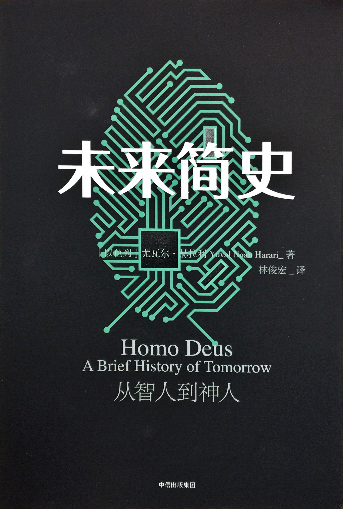
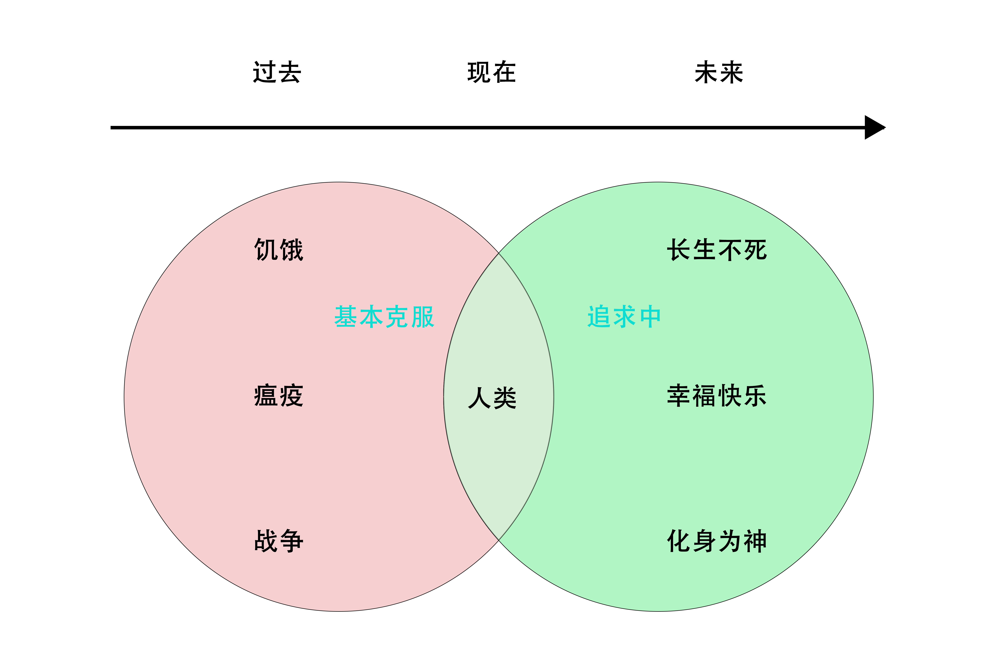

未来简史——从智人到神人
==================

### Homo Deus

#### A Brief History of Tomorrow

作者：尤瓦尔·赫拉利

第1章 人类的新议题
--------------------------

人类进入第三个千年，发现饥荒、瘟疫和战争已经基本得到了抑制，那么接下来人类将做什么？

在开始回答这个问题之前，针对饥荒、瘟疫和战争还得多说几句。

### 生物贫穷线（饥荒）

过去几百年间，随着科技、经济和政治的进步，在现在的大多数国家，真正严重的并不是饥荒，而是饮食过量。

### 看不见的舰队（瘟疫）

在过去的几十年间，流行病无论在流行程度还是影响方面都大幅降低。之所以有这项奇迹，是因为20世纪的医学达到前所未有的成就，为人类提供了疫苗、抗生素、更佳的卫生条件以及更好的医疗基础设施。

### 打破弱肉强食的“丛林法则”（战争）

核武器发明之后，超级大国之间如果还想挑起战事，无异于集体自杀的疯狂举动，于是逼着全球最强大的几个国家找出和平的替代方案来解决冲突。

同时，全球经济导向也已经从物质经济转变为知识经济。物质资产，如金矿、麦田、油井是可以抢占的，但是知识却无法霸占。

鉴于人类20世纪的成就，如果以后人类仍然遭受饥荒、瘟疫和战争之苦，就不能再怪在自然或上帝头上了。我们已经有能力把事情做得更好，并减少未来受苦的概率。

人类不可能仅满足于征服饥荒、瘟疫和战争，当它们的数量不断减少，从人类过去的记录和现有价值观来看，接下来的目标可能是长生不死、幸福快乐，以及化身为神。

### 死亡的末日（长生不死）

随着基因工程、再生医学和纳米科技的发展，长生不死的预言也越来越乐观。这里的长生不死不是像神一样绝对不死，他们仍有可能死于车祸等意外。

因为现在人终有一死，所以他们愿意冒风险去尝试冒险，但是如果人知道自己长生不死，就可能不愿意冒风险去做危险的事。

如果我们把目标定得温和一点，先将寿命翻倍，即便如此，也会有诸多新的问题。

首先是婚姻，因为寿命翻倍了，所以家庭结构、婚姻和亲子关系将大为改观。

其次是职业生涯，可能到了90岁还必须每天学习新知识。

然后是政治，那些朝代更迭的速度将大幅变慢，那些世袭的朝代可能连孩子都无法继承王位。

事实上，虽然在过去我们将平均寿命进行了翻倍，但是那些只是通过控制疾病，让人类免于死亡，但是智人的自然寿命本来也有这么长。

但是人类追求长生不死的事业仍将继续，因为它被巨大的商业利益驱使着。

### 幸福快乐的权利（幸福快乐）

由于对来世概念有所怀疑，让人不只想追求长生不死，也想追求俗世间的快乐。

人类的进化是伴随着追求快乐的过程产生的。单纯地讨论幸福快乐，可以用生化系统来控制，就像使用兴奋剂，但这样的快乐对进化没有太大的意义。未来科技甚至可以直接使用电信号刺激脑部神经来产生快乐。

佛教和生物学对快乐的看法有很多共同之处，两者都认为快乐来得快去得也快，但是生物学致力于提供无止尽的快乐，而佛教建议训练心灵让它看淡快乐。

### 地球的神（化身为神）

随着生物科技的发展，人类可以改变DNA，无法想象被重新调整过DNA的人类和现在的人类有什么区别，就像我们已经和直立人的差异一样巨大。

半机械人工程让人类离开了有机领域，打造出了无机的生命。生命或许终于能够离开地球。

几千年来，科技、经济、社会和政治一直都在发生着巨变，但有一件事始终未变：人类本身。

一旦科技让我们能够重新打造人类的心灵，智人就会消失，人类的历史就会告一段落，另一个全新的过程将要开始。

在21世纪，人类的第三大议题就是为人类取得神一般的创造力及毁灭力，将“智人”进化为“神人”。这里的神，不是指全能神，而是像印度教中的神一样。

### 可以请哪位踩个刹车吗？

很多人害怕遇到神出现的那一天，因为对未知事物的恐惧，但是我们不能踩刹车，因为：

首先，没有人知道刹车在那里。专家各有所长在各自的领域内研究，没有人能真正把所有的点都串联起来，看到完整的全貌。

其次，踩刹车会让经济崩盘。

而所有这些不同领域的升级，都会使进化向前推进。

### 知识的悖论

第一，不是所有人直接参与“长生不死、快乐和神性”这件事中去，大多数人根本不会直接参与。

第二，这只是历史预测，不是政治目标。

第三，追寻并不代表能够得到。

第四，提出这项预测，不是为了提出预言，而是让我们讨论现有的选择。

知识如果不能改变行为，就没有用处。但知识一旦改变了行为，本身就立刻失去了意义。我们拥有越多数据，对历史了解越深入，历史的轨迹就改变地越快，我们的知识也过时得越快。

### 一段关于草坪的历史

历史学家研究过去不是为了重复过去，而是为了从中获得解放。

草坪的历史告诉我们它只是权利和地位的象征，你只有了解了这段历史，才能在装修自家庭院的时候作出不是人云亦云的选择，即便你最终仍有可能选择草坪。

### 第一幕中出现的一把枪

人文主义（也就是对人类的崇拜）的兴起，同时也播下其灭亡的种子。在人类追求不死、快乐和神性的同时，只要一接近达成这些目标，所造成的动荡就有可能使我们偏离，走向完全不同的目的地。

第一部分 智人征服世界
--------------------------

第2章 人类世
--------------------------

过去的7万年称为“人类世”，也就是人类的时代。原因在于，在这几万年间，人类已经成为全球生态变化唯一最重要的因素。

人类第一次将生命形式从有机领域延伸到无机领域。智人突破了地球上各个生态区之间的阻碍。

### 蛇的孩子

《圣经》中夏娃其实就是蛇的意思，隐藏着泛灵论（认为人是动物进化而来的）的神话：蛇非但不是我们的敌人，还是我们的祖先。

《创世纪》里，人不是蛇的后代，而是由耶和华用地上的尘土这种无生命物质创造的。泛灵论只把人类看成另一种动物，但《圣经》则认为人类是上帝独特的创造，要说人也是动物，等于否认上帝的能力和权威。

### 祖先的需求

人类开始农耕畜牧之后，导致新一波的生物大灭绝，但更重要的是创造出另一种全新的生命形式：家畜。

以母猪为力，远古时代的母猪需要社会化的活动、分工，并保持和小猪之间的情感互动，但工业化之后，母猪被圈养，一切需求都由人类提供，但是它们的精神需求却没有得到满足。

几千世代以前形成的需求，就算已经不再是今日生存和繁衍所需，仍然会留存在主观感受中。可悲的是，农业革命让人类有了确保家畜生存和繁衍的能力，却忽视了家畜的主观需求。

### 生物也是算法

算法指的是进行计算、解决问题、做出决定的一套有条理的步骤。

控制人类的算法，则是通过感觉、情感和思想来运作的。至于猪、狒狒、水獭和鸡，用的也是同一种算法。

虽然无法认为所有的情感都是一致的，但是所有哺乳动物都共有的“母婴连结”的特点，是共通的。

### 农业交易

泛灵论认为人和动物平等，并共享世界。

有神论宗教，强调神和人，而所有的动物，都成了配角，这一切使得农业经济体制合理化。

有神论宗教中的神要负责解释人为什么能够占主导地位，同时要在人和生态系统之间进行调解。

人类借助宗教，将自己和动物的地位进行了区分。于是，农场也就形成了新的社会的原型，有着目空一切的农场主人，比较低等而可以剥削利用的其他动物，可以消灭的外部野兽，以及在一切之上有位伟大的神，对这一切安排给予祝福。

### 五百年孤寂

到了科学革命，连诸神的台词也被删去。现在，整个世界已经成了独角戏。一切都不是神的创造，而是自然规律，而牛顿成为了这个“创世纪”的神。随着生物科技、纳米科技和其他科技的果实成熟，智人就会得到神的力量，科学家让人类都进化升级为神。

有神论崇拜的是神，人文主义者则是崇拜人。如果人对其他动物有特殊之处，那么是否计算机对人也有特殊之处，有一天，计算机也会像人类对待动物一样地对待人类？

第3章 人的特殊之处
--------------------------

最新的科学发现和一神论的神话相抵触。科学确实证明了动物没有灵魂，但也无法证明人类有灵魂。

### 谁怕达尔文？

进化论让人没有了灵魂。进化就是变化，进化无法产生永恒不变的实体。从进化角度来看，我们最接近人类本质的就是我们的DNA，但DNA分子承载的绝非永恒，而是突变。

### 为什么股票交易所没有意识？

心灵（Mind）和灵魂不同，各种体验集合起来产生了意识流，愤怒、高兴都是客观存在无法否认的。

科学已经发现了大脑某区域的电磁活动特别活跃代表了一种情绪，但即便是这些电子信号的传递为什么会变成某种具象的主观体验，现代科学还解释不了。

### 生命的等式

科学家并不知道大脑中电子信号的集合究竟是怎么创造出主观体验的。

主观体验之所以对人类生存至关重要，是因为如果我们不会感到饥饿或恐惧，根本就懒得再去追兔子或躲狮子了。主观体验解释了人类的行为。

后来科学家又使用神经元、电信号等解释了主观体验。

当我们越能清晰描述这个过程，越解释不清什么是心灵和意识。甚至可以认为，如果生物学解释了这些感觉，如疼痛等无非是一种信号，那么心灵的概念可能就不再有用。

人们习惯用时下最先进的技术来解释，在过去用蒸汽机来解释事物规律，现在用计算机来类比。

如果人类的所有意识都是脑波构成，那么理论上可以模拟出一个完全无法与“真实”世界分辨的虚拟世界。

### 实验室大鼠的抑郁生活

各种证据均指出，非人类动物拥有构成意识所需的神经结构、神经化学及神经生理基础物质，并且能展现出有意图的行为。

制药公司利用大鼠来进行实验寻找抗抑郁药物，抑郁是一种意识，这证明了他们假定大鼠拥有和人类类似的意识。

### 有自我意识的黑猩猩

一些观点认为其他动物虽然有意识，但是没有“自我意识”。

更复杂的版本则认为，意识分不同程度，只有人类能够借助语言等特性，拥有过去和未来的意识，而其他动物只有活在当下。

虽然人类借助语言拥有了对过去和未来的意识，但是语言可能并不是必要条件，因为即便人类自己也经常在梦境中意识到过去和未来。

### 聪明的马

聪明的马汉斯通过观察人类的肢体语言完成了简单的数学题，但即便如此聪明，马也没能统治世界。说明智人还具有什么其他独特的能力。

有研究认为是智力和制作工具，如果仅靠这两个工具，两万年前的智人可能比现代人更强。

有人提出是因为合作，而蜜蜂等动物早于人类几百万年就学会了集体合作。

只有智人能够与无数陌生个体进行非常灵活的合作。正是这种实际具体的能力，决定了为何目前主宰地球的是人类，而不是什么永恒的灵魂或是独有的意识。

### 革命万岁！

不仅是人和动物的竞争，人和人的竞争也说明了灵活合作的重要性。那些军事将领之所以能够获得胜利，普通民众不可以，一方面，他们的合作高于群众；另一方面，比起顽固的竞争对手（旧政权），他们也展现了更大的灵活性。（灵活性越高的合作，比灵活性越低的合作更具有优势）

### 在色情和暴力之外

人类像不同种类的猩猩一样，有时候有权力阶级的社交方式，有时候也靠性来社交，但光靠这种方式的合作，是无法形成现在的人类的。

有理论认为是因为智人学会公平地合作，虽然有实验认为同种类的动物之间也非常重视公平，但绝大多数的社会，并不公平。

在不公平的社会阶级中，人们之所以还能够互相合作，是因为人们总是基于想象的秩序。

### 意义的网

现实有三个层次，主观现实、客观现实和互为主体（intersubjective）。

- 主观现实：多指自己的感受。

- 客观现实：客观存在的事物。

- 互为主体：依靠许多人的沟通互动而存在。如美元，只有当大家都相信了才有价值。还有神、国家等概念都是典型。

大家一起编织出共同的故事网的那一刻，意义就产生了。有的意义的网也可能随时崩塌，但也会有另一张意义的网取而代之。

### 大同世界

只有智人能编织出意义的网。虚构想象有可能成为世界上最强大的力量，甚至超越自然选择。

因此，如果我们想了解人类的未来，只是破译基因组、处理各种数据数字还远远不够，我们还必须破解种种赋予世界意义的虚构想象。

第二部分 智人为世界赋予意义
--------------------------

第4章 说书人
--------------------------

智人的世界还有各种关于金钱、神、国家和公司的虚构故事。这些虚构故事越来越强大，它们推动了历史，让我们从石器时代走到了硅时代。

法老，并不是指生物的法老，而是大家共同想象的法老，它是一个虚构的神，在古埃及，正是所有人共同的想象支撑起了伟大的文明，促成了大规模的合作。法老的概念和现代公司的品牌概念一样。

在文字出现之前，故事受限于人类大脑的能力，不能讲得太复杂，否则就没人能记得。但文字出现之后，忽然人类可以开始创造长篇复杂的故事，不再单靠人类大脑，而能记在黏土板、莎草纸上。

正因为如此，文字能够以算法的方式组织整个社会。医院的流程就是这样一种算法，使得看病这件事不依附于某个智人。人类诸多伟大的工程，金字塔、核弹、三峡大坝、自动驾驶汽车，无一不是依靠这种想象的规则创造出来的。

### 纸上的生活

文字带来了强大的虚构实体，组织了数百万人。纸上的任何事情都至少与树木、耕牛和人类一样真实。

有时候人们宁愿相信文字也不愿相信现实。文字记录的神圣性通常也会造成许多负面影响。没有人在意真相，表格上写的反而才更加重要。

### 神圣的经文

随着官僚体系掌握的权力越来越多，他们变得即使犯错也无动于衷。这时，他们不再改变故事以符合现实，反而通过改变现实来符合他们笔下的故事。

欧中强权对非洲土地的人为划分无视山川河流、部落种族等，当他们到了实地发现不对的时候，仍然愿意坚持原协议，成立殖民地。

现代教育系统也有许多现实向文字低头的例子，从启发和教育学生到追求高分，就是对分数体系的低头。

人类合作网络的力量就是依赖于真实与虚构之间的微妙平衡。太过扭曲现实，力量就会被削弱，而一定要坚持百分之百的现实也没有太多的立足之地。

古埃及的辉煌历史、货币的发行、教育系统的评判标准、各种宗教经典印证了虚构的力量。当人们回到现实发现绝大多数人都遵从虚构的力量，聪明人也会继续追随这个虚构的力量前进，然后推动虚构的力量更加强大。

虽然有些文化对历史的看法明显更为正确，比如希腊历史学家以及中国历史学家，但是当他们的观点一旦发生冲突，人们就更愿意相信圣经所提供的虚构的世界。

### 但这就是有用

虚构故事能让人类更容易合作，但代价在于，这些虚构故事同时也会决定我们合作的目标。因此，我们可能拥有非常复杂的合作制度。却只是为了服务于虚构的目标和利益。这样一来，虽然整个制度看起来运转良好，但出发点可能只是这个制度的标准。

想评估人类合作网络究竟是好时坏，一切都取决于用什么标准和观点。人类合作网络评价自我时，常常用的就是自己发明的标准，屡获好评也就毫不意外。

在21世纪，我们还会创造出比以往更强大的虚构概念以及更极权的宗教。在生物科技和算法的协助下，这些宗教不但会控制我们每分每秒的存在，甚至将塑造我们的身体、大脑和心智，创造出完整的虚拟世界。真要如此，再区分虚构与真实、宗教与科学将会变得更加困难，但又比以往更加重要。

第5章 一对冤家
--------------------------

现代科学确实改变了游戏规则，但并不是“以事实代替神话”如此简单。神话仍然主宰人类，科学只是让神话更为强大。

### 细菌和恶魔

对于科学和宗教的误解，多半是由于对宗教的错误定义。宗教并不等于迷信，因为大多数人都不可能把自己最相信的事称为迷信。

宗教的定义应该在于其社会功能，而不在于神是否存在。任何无所不包的故事，只要能够为人类的法律、规范和价值观赋予高于一般人的合法性，就应该算是宗教。宗教能够为人类社会结构找出理由，就是这些结构反映了高于一般人的法则。

所以，天主教是宗教，共产主义也是宗教。

### 如果遇见佛陀

宗教对世界提出一套完整的描述，并提供一份定义清晰且载明各项预定目标的契约。

> 二元论相信有两个神，一善一恶，善神创造了纯洁而永恒的灵魂，住在一个灵性而充满幸福的世界; 恶神 (有时称为撒旦) 则创造了另一个由物质构成的世界。撒旦不知道怎样才能让自己创造的事物永续，因此在物质的世界里，一切终将腐败瓦解。为了将自己创造的瑕疵品赋予生命，撒旦就会诱惑来自纯洁灵性世界的灵魂，再将灵魂关在物质的身体里，这就成了人：一个美好而灵性的灵魂，被困在邪恶而物质的身体里。而由于灵魂的监狱 (也就是身体) 会衰老死亡，撒旦就必须不断用各种肉体的欢愉来诱惑灵魂，其中最重要的就是食物、性和权力。等到身体终于回归尘土、让灵魂有机会逃回灵性世界时，对肉体欢愉的渴望就会诱惑它再次回到另一具物质的身体里。于是，灵魂就这样从一具身体转移到另一具身体，虚耗光阴，追求食物、性和权力。

这种追求灵性的旅程与宗教有根本的差异，因为宗教要巩固世俗秩序，但灵性要逃离世俗秩序。所以推动新教徒反抗天主教会权威的，并非坚持享乐主义的无神论者，而是一个虔诚而苦修的修士——马丁路德。路德对于生命有许多存在主义的疑惑，希望得到解答，而且他拒绝接受教会用各种礼仪、仪式和契约得出的答案。

但是随着他们推倒了旧的宗教，新的宗教又会随之重新建立。

### 伪造上帝

一种观点认为科学与宗教誓不两立，以三峡大坝修建为例，科学方法可以决定如何修建大坝，但是是否修建大坝以及大坝对生态环境的影响还需要一些传统价值观或意识形态才行。

还有一种观点认为科学负责研究事实，宗教就是讨论价值观，两者井水不犯河水，老死不相往来。虽然科学确实只管事实，但是宗教并非只管判断。宗教想发挥任何实际的引导作用，就要提出一些事实上的要求，这时候就可能和科学有所冲突。

许多激烈的宗教辩论，或是科学和宗教之间的冲突，都是源于这种关于事实的主张声明（如：“上帝确实存在”、“教皇永远是对的”），而不是来自伦理判断（如：杀生不对）。

宗教故事几乎总是包括三个部分：

1. 伦理判断，例如，“人命神圣”。
2. 事实声明，例如，“人命始于受孕那一刻”。
3. 伦理判断与事实声明相结合，给出具体的指示，例如，“就算受孕才刚一天，也不得堕胎”。

科学方法不能证明伦理判断，但是可以证实或证伪事实声明。

### 神圣教条

宗教有种麻烦的倾向，即喜欢将事实声明转化为伦理判断，使得原本应该很简单的争议变得混乱而模糊。例如：原本只该是事实声明的“圣经由上帝所著”，变成了道德指令“你应该相信圣经是由上帝所著”，于是怀疑这项声明则成了罪过。

哈里斯认为，所有人的终极价值都是相同的——将痛苦最小化、快乐最大化。

但是快乐本身是不能度量的，所以无法争论什么才是伦理上更对的。

### 猎巫行动

宗教最在乎的其实是秩序，宗教的目的就是创造和维持社会结构；而科学最在乎的则是力量，科学的目的是通过研究得到力量，以治疗疾病、征伐作战、生产食物。因此两者一拍即合。

因此，对于现代历史更准确的一种看法，其实是科学与特定宗教（也就是人文主义）达成协议的过程。现代社会相信人文主义教条，而科学的用途不是为了质疑这些教条，而是为了实现它们。

第6章 与“现代”的契约
--------------------------

前现代人相信自己是某个伟大计划的一部分。现代人放弃了意义，并选择了力量，他们认为一切都只是技术问题。

现代生活就是在一个没有意义的宇宙里不断追求更多的力量。

### 银行家与吸血蝙蝠有何不同？

前现代国家，大家对于经济的增长没有预期，因为这一想法违反直觉、进化经验和世界运作的方式。

信贷的出现，打破了这个恶性循环。

### 奇迹般的大饼

现代政治和经济笃信增长的必要性有三个原因：

1. 生产越多，消费就越多，越能提高生活水平，越能享受到所谓的更快乐的生活。
2. 只要人类继续繁衍壮大，仅仅为了维持现状，经济增长就已经很有必要了。
3. 就算人口停止增长，那些穷人想要过的好一点，就得从富人那里得到，这一定会造成困难的选择。

因此我们需要一块更大的饼。任何阻碍经济增长的事情都被认为是不对的。

当资本主义让人不再将经济视为零和博弈，而是一种双赢局面，这一转变确实是全球和平的重要推手。

### 方舟综合症

传统观念把世界看成一块大小固定的饼，隐藏的假设就是世界上只有两种资源：原材料和能源。但事实上，资源有三种：原材料、能源和知识。

原材料和能源取之有尽，用得越多，剩下的就越少；但知识却是不断增长的，用得越多，反而拥有越多。

经济的增长导致了生态遭受破坏，甚至可能毁了人类自己，但是政治家们认为只要经济增长，未来的科学家就一定能解决这些新面临的问题，而穷人呢，只有经济增长才能切实改善他们的生活，因此他们也不会支持停止经济的增长。

### 毫无意义的竞赛追逐

就算人类动作够快，能够同时应付经济和生态崩溃的危机，但这场竞赛本身也是大有问题。就个人而言，这将造成极度的紧张和巨大的压力。

第7章 人文主义革命
--------------------------

### 向内心探寻

现代性推动的主要宗教革命并不是对神失去信息，而是对人类有了信心。

人们的思想从遵循《圣经》的旨意，转变为追求内心的真实想法，如果内心觉得是对的，就应该这么做。

艺术的本源已经变成了有人觉得是艺术，那就是艺术。教育制度的转变则是从顺从、背诵经文、研读古老传统到教会学生如何思考，这就是人文主义教育的目标。人们改为全民公投的方式，而不是遵循“神的旨意”，也是符合这一逻辑。

### 踏上绿野仙踪的黄砖路

中世纪的欧洲，获得知识的主要公式：`知识=经文*逻辑`，可以同时解决伦理问题。

科学革命，获得知识的主要共识：`知识=实证数据*数学`，不能同时解决伦理问题。

科学革命后，如何解决伦理问题？

- 方案1：`知识=实证数据*数学`公式+经文；
- 方案2：`知识=实证数据*数学`公式+伦理知识公式`知识=体验*敏感性`

19世纪初，建构现代教育系统的重要人物威廉·冯·洪堡（Wilhelm von Humboldt）曾说，存在的目的就是“在生命最广泛的体验中，提炼出智慧”。他还写道：“生命只有一座要征服的高峰——设法体验一切身为人的感觉”。

### 战争的真相

“知识=体验*敏感性”甚至改变了我们对“战争”的看法。在过去的绘画作品中，画家重点强调的是将领的英勇、战术的高明，而现代作品中更多的体现的是每一个士兵在在战场上的真实感受，他们眼中的战争。

### 人文主义的分裂

人文主义有三大分支：

- 自由人文主义：完全从每个人的内心出发
- 社会人文主义：同样认同人的体验，但是它指出不同的人有不同的体验，如何解决不同人之间的体验冲突。解决方案是：听从社会主义政党的，听从工会的（社会主义国家）
- 进化人文主义：只有特定国家（或社团）是人类进步的引擎，认定这些国家必须教训甚至消灭任何阻碍他们的人。（纳粹主义是进化人文主义的一个极端版本）

### 贝多芬比查克·贝里更高级吗？

像文化比较这样的雷区，自由主义会小心绕开，以免做出政治不正确的失态举动。

社会主义是一切交给政党来处理，要找出通过雷区的正确路途。

进化人文主义则会认为人也是有阶级层次之分的，贝多芬就是比查克贝里更高级，人就是比狼更有优越性。

### 宗教的人文战争

不论哪个人文主义教派，都与基督教、伊斯兰教或印度教有巨大的差异。不同的人文主义教派之间的差别微不足道，但随着人文主义征服世界，原本的内部分裂逐渐扩大，骤然引发史上死伤最惨重的一场宗教战争。

一开始进化人文主义（德国纳粹）向传统自由主义挑战，并获得了胜利，是社会主义（苏联）的加入才平息了这场战争。同时社会主义指出自由主义只是打着自由的旗号，捍卫“财富”本身，随后社会主义占了全球的绝大多数国家，直到原子弹的出现才停止了这场争斗，保留了西方世界继续享受着性、摇滚乐以及洗衣机、电视和冰箱。但最后自由主义从历史的垃圾箱里爬了出来，是物资充盈的超市的力量战胜了古拉格劳改营，并将自由主义重新占领了世界，并成为了我们唯一的选项。

### 电力、基因学、伊斯兰激进主义

随着科技的发展，传统的宗教开始无法解释一些新时代由科技带来的新问题。

社会主义非常重视科技带来的力量，列宁用一句话来定义共产主义：共产主义就是苏维埃政权加全国电气化。20世纪下半叶，生产方式成了热议的主题，让人类忘了自己的存在。即使是最严词批评马克思和列宁的人，也接受了他们对历史和社会的基本态度，更仔细地思考科技和生产，而上帝和天堂就显得没那么重要了。

即便自由主义战胜了其他人文主义，但这也不代表自由主义就能安享荣耀、高枕无忧。它成功的时候，可能也已经播下了败亡的种子。获胜的自由主义理想正在推动人类走向长生不死、快乐幸福并化身为神。

为了满足人文主义长期崇拜人类的生命、情感及欲望的梦想，将会出现后人文（post-humanist）科技，从根本上颠覆人文主义。

第三部分 智人失去控制权
--------------------------

第8章 实验室里的定时炸弹
--------------------------

随着科技的发展，自由主义也遭到了挑战。挑战的理由就在于“自由选择”这件事，看似是从人的“自由意志”出发，但实际上从生命科学的角度看，这种“自由”只是生命的一个生物电化学反应，并没有“自由意志”，因此挑战了自由主义根基。

### 我是谁

实验证明人体内至少有两种自我：体验自我（experiencing self）及叙事自我（narrating self）。

体验自我，是我们每时每刻的意识。

叙事自我，则通常遵循峰终定律，也就是在不考虑时间的前提下，人们只会在意整件事在峰值时候的感觉和终结时候的感觉，并将二者进行平均。

大多数人认同的都是自己的叙事自我。我们口中的“我”，讲的是我们脑中的故事，而不是身体持续感觉到的当下体验。

### 生命的意义

追求自我的生命，并非是完全真实的。每个人都有一个复杂的系统，会丢下我们大部分的体验，只精挑细选留下几样，再与我们看过的电影、读过的小说、听过的演讲、做过的白日梦全部混合在一起，编织出一个看似一致连贯的故事，告诉我们自己是谁、来自哪里、要去哪里。

在第三个千年的起点，自由主义受到的威胁不再是“没有自由个人”这种哲学问题，而是来自实实在在的科技挑战。我们即将拥有各种超级实用的设备
工具和制度，但这些设备、工具和制度并不允许个人自由意志的存在。民主、自由市场和人权这些概念，是否真能在这场洪水中保存下来？

第9章 大分离
--------------------------

第10章 意识的海洋
--------------------------

第11章 信数据得永生
--------------------------