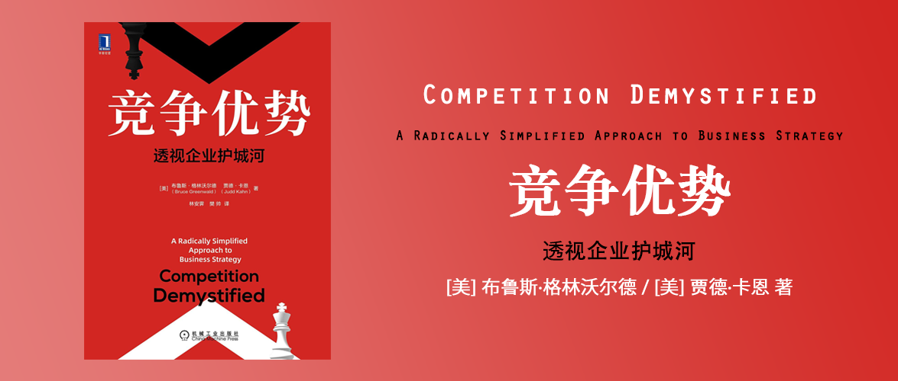

# 竞争优势：透视企业护城河

Competition Demystified：A Radically Simplified Approach to Business Strategy

[美] 布鲁斯·格林沃尔德 / [美] 贾德·卡恩 著

林安霁 / 樊帅 译

## 推荐序

参考“赞誉与推荐”

## 赞誉与推荐

> 本书是目前最好的战略书籍，与波特的《竞争战略》相比，本书的分析框架更简洁和实用。投资者必须能够识别企业竞争优势的来源，评估企业如何维护和加强其竞争优势与护城河，因为可持续的竞争优势是增长可以为股东不断创造价值的必要条件。本书可谓是写给投资者的战略分析必读著作，帮助我们评估企业未来面临的各种竞争挑战。——保罗·约翰逊资深投资人、哥伦比亚大学商学院客座教授、《证券分析师进阶指南》作者

本节与“推荐序”有诸多相似之处，甚至是同名作者在相同观点上不同文字的描述。作者人脉广泛，有很多校友的推荐，大致都是“好、好、好”。

但是谈到《竞争优势》这样一个中文翻译的名字，你能看到两本书，另一本是[迈克尔·波特的《竞争优势》](https://book.douban.com/subject/25947541/)，但他们的英文名不一样：

- 本书：Competition Demystified：A Radically Simplified Approach to Business Strategy
- 迈克尔·波特：Competitive Strategy：Techniques for Analyzing Industries and Competitors

其实我是在搜索迈克尔·波特的《竞争优势》的时候看到了这本书，因为波特的那本名气更大，它提出了五力模型。我没有看过那本，因为豆瓣网友评价“翻译太烂”了，然后这本书以9.1的高分出现，引起了我的好奇，评论里大家都觉得不错，至少没有被翻译烂。

因此在众多推荐的文字里，仍然是这条对比波特的文字让我更印象深刻。果然参照物很重要，别的评价不论文字多么优美，我一个字都没有记住。

## 译者序

译者是作者的学生，因此译者怀着感恩做的翻译，质量自然是竭尽全力了（当然师生一起骗人的比比皆是）。

从译者的描述中可以看出，作者是价值投资者，就是巴菲特特别推崇的投资理念，巴菲特也是对作者赞誉有加。

## 中文版前言

这是一本关于商业战略的书。

与现存或潜在竞争对手竞争：要么靠勤奋精细运营；要么靠独一无二占据优势。

规模、网络效应、成本、品牌粘性、细分市场等都是企业战略的一部分。

## 英文版前言

战略是那些专门关注企业竞争对手行动与反应的规划。战略并不是简单等同于能够赚钱的规划。

> 战略思考的核心是创造、保护和利用竞争优势。在一个公平竞争的环境中，在一个对所有竞争者平等开放的市场中，竞争将把所有参与者的回报降低到同样的最低限度。因此，要想获得超过这一最低限度的利润，企业必须能够做一些其竞争对手做不到的事情。换句话说，企业必须从竞争优势中获益。任何战略分析的恰当出发点都是针对企业所处市场的状况，仔细评估那些竞争对手无法复制或者只有极少数竞争对手能够模仿的竞争优势。
>
> ……
>
> 高效运营只是战术，而不是战略。它专注于企业内部的制度、结构、人员和惯例等。而战略，顾名思义，是着眼于企业外部的市场和竞争者的行动。

关注企业内部的结构以提升运营效率只是战术，而战略则是面向外部市场环境的。——这个观点和[彼得·德鲁克《卓有成效的管理者》](../彼得德鲁克-卓有成效的管理者/)的观点一致，绩效总在企业外部。

## 第1章 战略、市场与竞争

### 何为战略

> 与战术选择不同，战略决策关乎组织的长期投入，需要分配大量的资源。战略决策由高层管理者制定，意味着它需要严谨的研究与会议讨论。改变战略就像改变一艘航空母舰的方向一样，既无法快速改变，也不能立竿见影。

战略是关于做什么的决策。

> 战略是那些结果取决于其他经济主体行动和反应的决策。战术可以在独立的状态下制定，而且在很大程度上取决于能否有效执行。理解这一区别是制定有效战略的关键。

战略的结果是由其他经济主体行动和反应导致的。

### 决定竞争优势的唯一力量

在承认与波特的五力模型的重要性的基础上，本书认为五力模型的五个方面并非都一样重要，进入壁垒（新进入者的威胁）是其中最重要的。

波特的五力模型：

1. 替代品的威胁；
2. 供应商的议价能力；
3. 新进入者的威胁；★
4. 购买者的议价能力；
5. 同业竞争者的竞争程度；

### 局部霸主

局部是一个容易被忽略的因素。

虽然全球化正在加剧，但是沃尔玛通过地理上不断取得区域优势地位再一点点扩张，微软在操作系统和相关软件，英特尔在设计与生产CPU这样的局部领域取得优势。

而大多数服务业天然具有本地化的特点，由本地提供本地消费，因此它也具有本节所提及的局部优势。

### 何种竞争优势

常见的竞争优势无外乎几种（前三种比较常见）：

1. 供给侧，成本优势：低成本原材料、新技术的专利壁垒等；
2. 需求侧，需求优势：本质是客户锁定（离不开你），消费习惯、转换成本过高、寻找替代品难度大、成本高。
3. 规模优势：通过规模降低固定成本。
4. 政府保护；
5. 信息优势；

> 大多数能够保持增长且实现高利润率的企业都是通过上述三种竞争优势之一来实现的。它们像可口可乐一样，在各个市场复制自己的局部竞争优势；像英特尔一样，持续聚焦于自己的产品与行业；像沃尔玛和微软一样，从已获得主导地位的市场的边缘逐步扩展生意。

### 战略分析的程序

所有市场会被分成存在竞争优势和不存在竞争优势的两部分，前者靠“管理竞争优势”而后者靠“运营效率”，这二者之间会随着竞争优势的消失，而直接从前者变成后者，而不存在竞争优势的企业，拼命努力也只能获得平均水平。

### 竞争格局

在市场中如果有一家独大的企业占主导地位，其他的蚂蚁企业则应该理性地退出。而主导企业应该管理器竞争优势，充分认识其竞争优势的来源与局限性。

战略分析的三个工具：

1. 博弈论：
    - 关于价格与品质，可以借助囚徒困境的博弈论工具来分析。
    - 关于数量与产能竞争的动态，可以借助进入/先占博弈的博弈论工具来分析。
2. 模拟
    - 让一些人或小组扮演各个竞争者的角色，提供可供选择的行动方案及背后的考虑与动机，然后进行多次博弈。
3. 合作分析
    - 假设竞争者之间可以进行合作，取得双赢，借此进行战略设计。但是这种合作的场景非常罕见，即便如此，也要设想合作的可能。

### 本书章节安排

简要概述了后续章节的写作框架。可以说全书以“竞争优势”这种市场参与者之间的这种差异为抓手，不断探索战略的要义。

## 第2章 竞争优势：供给与需求

### 差异化迷思

差异化并不能避免产品变成大路货，利润会随着竞争的加剧而变得越来越微博，因此本质并不是没有差异化，而是没有进入壁垒。

在差异化的行业里，运营效率就是成功的关键。

即便是奔驰和凯迪拉克这样的品牌，本质上也没有因为这些闪闪发光的LOGO形成竞争优势，他们与其他后来者（捷豹、宝马、雷克萨斯）之间仍然陷入了竞争。

### 进入壁垒与竞争优势

进入壁垒是新进入企业无法做到的那些事情。竞争优势属于在位企业。

> 真正的竞争优势只有少数几种类型。竞争优势可能源于先进的生产技术、取得独特资源的权利（供给侧竞争优势），也可能源于消费者的偏好（需求侧竞争优势），或者是规模经济与某种程度消费者偏好的组合（关于供给侧与需求侧竞争优势的相互作用，我们将在第3章中讨论）。以效力和持续性来衡量，生产优势是最弱的进入壁垒，与客户锁定叠加的规模经济是最强的进入壁垒。

### 供给侧竞争优势：有竞争力的成本

> **真正意义上的专有技术必须在企业内部开发**。由咨询公司或供应商来负责绝大多数产品和流程创新的市场不可能存在明显的、基于技术的成本优势，因为任何企业只要愿意付费就能获得这种“优势”，如NCR公司为零售企业提供销售点终端、自动柜员机、条码阅读器等设备。

能够买到的技术，别人付钱就能拥有，因此不是竞争优势。所以“信息技术将成为竞争优势的来源”这句话是具有误导性的，因为大家都可以通过花钱来获得这样的优势。

> **获得便宜的资本或雄厚的资金支持则是另一个虚幻的优势**。互联网泡沫给我们的教训之一就是：即使募集资金非常容易，也并不代表这就是所谓的竞争优势。

拥有资金也不是竞争优势。

拥有资源（如石油）也不是竞争优势。

拥有特殊人才（如明星）也不是竞争优势。

### 需求侧竞争优势：客户锁定

客户锁定的原因通常有3个：

1. 习惯：吸烟、可口可乐等会产生习惯；啤酒、汽车品牌、电脑品牌则弱一点；习惯只会在局部，比如人们会习惯于使用佳洁士的牙膏，但不会同时爱上汰渍洗衣粉。
2. 转换成本：软件就是一种转换成本很高的产品。重写代码要花钱，培训用户要花时间，网络效应还会增加软件额外的成本。
    > 只要供应商必须花费很多时间和精力理解新客户需求的方方面面，那么对于客户而言就一定存在转换成本。
    ——因此，做定制软件实际上是有转换成本的，因为定制软件的需求除了客户和软件公司，其他人一概不知。同理，将现成独门软件变成客户的运营工具，也会让客户增加转换成本（离不开你）。
3. 搜寻成本：寻找替代方案的成本，比如房屋代理可能选项过多，而保险公司的产品差异不大，搜寻替代品的成本很高，人们除了对现有产品极其不满，通常不会更换保险公司。律师事务所这种靠人和人沟通产生价值的行业，更是如此，改进现有的产品通常比更换一个产品更有可行性。

## 第3章 竞争优势：规模经济效益与战略

### 规模经济效益与客户锁定

> 举例来说，服装企业每生产一件产品都需要同样数量的布料和人工，但并不需要用到太复杂的机器，所以可变成本与固定成本之比很高。相反，对于软件企业而言，其成本大部分是固定成本，即开发软件花费的编写程序与测试软件的成本。一旦软件开发完成，生产一个新拷贝的成本就可以忽略不计。因此，无论软件企业的客户数量有多少，总成本都增长得相对较慢。随着企业的规模增长，固定成本被分摊在更多的产品上，而单位可变成本不变，于是产品的平均单位成本就下降了。

*个人思考：从上述观点出发，物联网产品中，如果硬件的售价无限接近于成本价，那么硬件部分就产生了大量的可变成本、而软件部分产生了大量的固定成本，二者在一套产品中的售价比例，则影响了规模化复制的过程中，成本下降的斜率，也就是如果硬件占比很少，那么整个产品就更接近于软件产品，就能够享受到规模化带来的优势，反之则总成本下降速度太慢。但是如果硬件的利润很高，也就是说通常它是一些原材料成本较低但是自主知识产权占比较高的硬件产品，而且生产它的规模优势很明显（也就是这种产品常见到成本极低），那么这样的产品再规模化对于物联网产品的总利润影响就很明显。举个例子：安防摄像头是个自身规模化程度很高的产品，且随着充分竞争，它成本很低，但是你可以在市场上找到无限接近于成本的可替代品，也就是杂牌摄像机，你把它组合到你的最终产品中，比如配合你的AI识别软件变成一个智慧眼系统。如果你的最终整体报价中，硬件的成本接近99%，那么你要卖很多很多最终产品才能摊回成本。但如果你选择了“海康大华”这样的知名品牌，因为它的摄像头单价会更高（给自己留出了利润）却挤占了你有限的最终利润，因此你将雪上加霜。破解方法：在你的最终产品中不断降低硬件成本（可变成本）的占比，让软件成本（固定成本）占比努力接近100%，然后再通过规模化最终客户实现盈利。*

只有将规模经济效益和客户锁定相结合，才能发挥在位企业的竞争优势，在位企业可以通过降价让新进入者无利可图，所以在位企业只要竭尽全力维护自己的优势地位，新进入者将难以进入。

### 捍卫规模经济效益

> 对于享有规模经济效益的在位企业，最好的战略是与新进入者挑衅的做法保持一致，以降价对抗降价，以新产品对抗新产品，以细分市场对抗细分市场。

用相同的打法，就可以借助规模经济效益和客户锁定来阻止竞争者进入。

> 最后，对于源自规模经济效益的竞争优势而言，一般而言市场规模增长会削弱竞争优势，而不是增强竞争优势。这种竞争优势的强度与固定成本的重要性直接相关。当一个市场快速增长时，固定成本在一定程度上是保持不变的，然而可变成本至少和市场增速一样增加。于是，不可避免的结果是固定成本占总成本的比例随着市场规模增长而下降。

规模经济效益的优势来自于将固定成本分摊到比竞争对手更多的产品上，固定成本对于不同企业又大致相同，那么在市场规模增长后，固定成本所占额总成本比例下降，将减弱在位企业的竞争优势。

*个人思考：对于网购生鲜类产品而言，存量的购物习惯从线下市场转移到线上电商，线上电商就是个新增空白市场，也就是个市场规模不断扩大的市场，而固定成本是类似网店设立、直播带货等基础动作，可变成本是营销费用等支出项，将可变成本转移到企业外部，第一层是生产、第二层是品牌、第三层是营销推广，就可以让第二层的利润逐步趋于稳定扩大。这一点也很像燃油车市场向新能源车市场转换的这个市场空间。*

- 推论1：市场规模越大，新进入者就可以用比较小的市场份额抵消掉在位企业的规模竞争优势。
- 推论2：如果市场规模持续扩大的市场，后来者就可以考虑进入该市场，并计算目标市场份额，并预估达成业绩的可能性。

### 供给侧或需求侧的竞争优势与相关的战略

1. 没有竞争优势的，靠高效运营，关注内部绩效；
2. 有竞争优势的，靠巩固竞争优势；

### 规模经济效益与相关战略

规模经济效益，是最重要的竞争优势，因此要竭尽全力维持其竞争优势。

与创建竞争优势相关的战略：

1. 在局部创建竞争优势，并向外延伸，局部地理区域、特定产品；
2. 在局部建立“规模经济效益”，这将带来可持续竞争优势：当有新进入者的时候，可以用规模经济效益（降价等方式）让新进入者知难而退。
3. 识别有吸引力的细分市场。以下是有吸引力细分市场的特征：
    - 能够被“锁定”的客户；
    - 相对于固定成本而言，市场的整体规模较小；
    - 没有占支配地位且警惕敏感的竞争对手；
    - 具备一定的可扩展性，企业能够从此出发逐步拓展生意；

### 竞争优势、战略规划与局域性机会

不是所有的市场都有相同的竞争格局，有的市场只能拼高效运营，有的市场在位者努力维护竞争优势，有的市场在位者没有保护好自己的竞争优势而被淘汰。

但是竞争优势通常可以在局部性的机会中找到，也是战略分析的聚焦点。

## 第4章 评估竞争优势

### 三个步骤

要分析一个市场是否存在竞争优势，可以遵循三个步骤：

1. 制作行业地图，分析有哪些细分市场，以及每一个细分市场的在位企业是哪个。
2. 分析是否存在竞争优势，通常有两种判断的方式：
    - 所在细分市场的竞争企业市场份额是否稳定，而且企业越少越有可能存在竞争优势，企业太多说明进入门槛太低。
    - 这些企业的盈利水平是否高，如果盈利水平不高说明不具备竞争优势。
3. 如果存在竞争优势，则寻找竞争优势的来源是什么，如果不存在竞争优势，那么这样的企业就得靠高效运营来打败对手。

### 竞争优势评估的实战演练：对苹果未来发展的分析

通过拆解苹果公司的业务，来进行竞争优势分析，在苹果所涉足的主要领域，CPU、操作系统、个人计算机整机制造三个细分市场举例。

- CPU市场英特尔享有绝对的竞争优势，投资回报率稳定。——有竞争优势。
- 操作系统市场，围绕享有的竞争优势明显，而苹果的市场份额始终很小。——有竞争优势。
- 在个人计算机整机制造市场，因为大家都是从不同供应商那里采购货源，更多是靠高效运营来实现盈利，而且盈利水平有限。——没有竞争优势的市场靠运营。

通过先抓住主要的细分市场，再看看苹果还有没有其他涉足的细分市场：

- iPod：客户锁定，市场份额高，利润率高。
- 图形图像计算机市场：苹果始终被认为是该领域用户的首选。
- 教育领域市场：苹果投入较大占有率也高，但是下降也很明显。

通过各种细分市场的分析，虽然苹果有卓越的用户体验、高质量的产品、忠诚的用户群体，但是仍然难以在各个细分市场中占据竞争优势。

### 结论

本章的重点是一步一步进行推导，在一开始的时候不必引入太多的复杂度，只有在必要的时候引入复杂性。

## 第5章 在地利之处壮大：沃尔玛、库尔斯与局部规模经济效益

### 沃尔玛：新的世界冠军

沃尔玛的成功是商业史上必须研究的经典案例，本章将对它进行分析。

> 首先，我们要确认一个前提，那就是沃尔玛究竟是真的成功，还是存在某些被我们忽略的缺陷。其次，我们要进一步探索沃尔玛做了什么其他零售商没能做到的，这样我们能找到沃尔玛在保持和实现卓越业绩增长时遵循的战略选择。最后，我们将继续探寻沃尔玛的成功对于其他企业来说有什么借鉴意义。

看到上面这段话有点感触，在面对成功的时候，我们还应该不断探究其“究竟是真的成功”吗？

### 行业分析1

沃尔玛的成功有很多存在争议的解释，但很多显然是有错的：

1. 沃尔玛通过压榨供应商实现更高的盈利：错，因为根据数据分析，可能沃尔玛定价更低，但是这是定价的问题，其他数据综合来看，不同零售商的采购价格大体相同，沃尔玛并不特殊。
2. 沃尔玛是小镇垄断者：不完全正确，因为沃尔玛在独占小镇里确实定价比其他门店要高一点，但是在有多家竞争者的局部市场里，沃尔玛遵循天天低价的策略以至于抵消了局部垄断的利润，对拉动整体利润略有贡献，但不是决定因素。
3. 更好的管理水平和制度：不完全正确，沃尔玛有更好的人力资源管理，管理层和员工为达成业绩共同奋斗，沃尔玛还引入新技术，但是前者作用有限，后者容易被快速模仿。
4. 南方更有利于经营：错，南方房地产税比较低、南方工人不用加入工会等制度确实可以减少成本支出，这些都显著提高了沃尔玛的利润，但随着门店扩张，沃尔玛在北方区域开设的门店数量已经超过南方。
5. 区域性统治的强大优势：沃尔玛在区域内享有规模经济效益和客户锁定，但这些优势也仅在它密集开店的区域，而不是全国性或者全球性的。因为集中在某个区域内开多家门店，所以带来了至少以下三种成本优势：
    - 进货后勤：因为同一区域有多家门店，所以一辆卡车可以给所有门店送货同时还能给配送站把货拉回去。
    - 广告：在同一个区域投放广告只需要投一份，但是因为门店多，所以相对成本就低。
    - 管理监督：因为同一个区域有很多门店，所以管理人员可以在多个门店走访。

在区域性统治的强大优势作用下，降低的成本（约4%），作为天天低价的让利空间（3%），不仅能够给消费者更低的价格吸引更多的顾客，同时还降低了自身成本。

沃尔玛的这种相似的优势要同时具备“规模经济效益”和“客户锁定”，两者的结合就可以很好地阻止竞争对手的进入。

而规模经济效益，要求固定成本占总成本的比例要尽可能高，这要求市场规模**不能太大**，因为无限大的市场，会让竞争对手用相同的固定成本与你竞争，即便你的固定成本比他低一点，但是因为规模大，所以优势就不明显了。

而随着沃尔玛的全球扩张，并非所有的区域都能够复制早期每个局部市场的“密集开店”带来的区域性优势，所以整体上看，沃尔玛自身的利润率也从顶峰时期有所下降。

从沃尔玛的案例中学习到：**地理位置的集中，不仅适用于零售业，也适用于服务业（在局部提供服务的），密集开店可以降低运营成本以提高竞争力**。

### 库尔斯的全国扩张

库尔斯是一家美国的啤酒厂，其规模不大不小，但是有自己的独特的口味，这种口味得到了一些名人的推崇以至于在市场上别具一格。

库尔斯早期仅在几个州发展，利用一个啤酒生产厂来为这几个州提供服务，这一点和早期的沃尔玛很像，利用区域性统治的强大优势，积累了竞争优势：规模经济效益和客户锁定。

但是库尔斯产品的一些特点以及其盲目的扩张策略导致了其营业利润率下降：

1. 只提供鲜啤，甚至不进行巴氏消毒，这样在扩大经营范围的时候，就会增加保鲜的成本。
2. 它和沃尔玛不太一样的是，沃尔玛是沿着地理边界扩张，而库尔斯是直接跳到不同的地理空间去扩张，在新的地理空间市场中，库尔斯属于新进入者，它所面临的环境与大本营不同，因此用相同的策略，并不能更好地应对新的市场环境。
3. 同样受到地理位置扩张的影响：管理费用、广告费用、定价、不同区域的竞争差异都影响到库尔斯的实际营业利润率。

### 线下与网上：互联网与竞争优势

*也许这本书成书的时候，互联网或者说电子商务还没有像现在这么发达和成熟，所以作者并没有讨论太多，短短的篇幅。以下观点来自原书，值得思考。*

> 竞争优势的主要来源是客户锁定、生产优势和规模经济效益，尤其在局部层面。

1. 客户锁定层面：比价、比服务容易，甚至有网站直接提供相应服务。
2. 规模经济效益：所有竞争者几乎都不可能从互联网获得规模经济效益的好处。
    - 规模经济效益的前提就是高额固定成本能够被分摊到较大的客户基数上。如果不需要什么投资，那么在位企业没有什么优势可言（门槛太低，任何人都可以参与进来）。
    - 在互联网里，没有局部边界来界定企业经营的范围。

## 第6章 细分市场优势与增长困境：个人计算机行业里的康柏与苹果

### 一项颠覆性的技术

> 首先，为了加速行业发展，IBM的个人计算机采用了开放式架构，从其他企业购买现成的组件，并且不申请专利保护。这种做法意味着一旦首批IBM个人计算机上市，任何人都可以自己购买CPU、内存条、电源、主板、磁盘驱动器、机箱、操作系统和第一代个人计算机所需的其他部件来复制一台同样的个人计算机。其次，IBM个人计算机最重要同时也是利润最为丰厚的两个组成部分——CPU和操作系统，是其他企业的专有产品。由于选择了英特尔和微软分别作为CPU和操作系统的供应商，IBM为这两家企业的股东和雇员创造了巨大财富。很难想象商业史上还有哪个决策像IBM的这一决策一样如此慷慨。

*这段话让我想到了“当你的产品所有的部件都可以买来，或者都是肉眼可见可以抄袭的话，IBM是个你可以研究的商业案例”。*

### 设计一家新企业

在像个人计算机这样市场规模快速增长的行业，且在位企业不存在竞争优势的情况下，很多大量看到新机会的公司加入并成立新企业，康柏以质量和移动性为卖点、惠普虽然有很多优秀工程师但因经营不善做的不太好，戴尔组装计算机进行直销、其他一些企业如昙花一现，整个行业优胜劣汰。

### 行业分析2

个人计算机市场是由很多个细分市场组成的，在所有的细分市场中，只有CPU和系统软件的市场（*现在看应该也包括GPU*）拥有竞争优势，即产品范围内的规模经济效益和客户锁定优势，这两个细分市场的参与者也很少，在位企业对行业垄断地位明显。而整机制造商细分市场中，则毫无进入门槛，竞争激烈。

### 康柏的优势

康柏早期的优势是为高端用户提供高品质的产品。但是随着市场规模的扩大，各细分市场的产品质量越来越高，整机制造商很难在产品竞争差异中获得基于“工程技术”带来的高品质优势，也就是高品质的边际效应越来越小了，因此康柏在行业发展成熟后，很难获得自己的竞争优势——客户锁定被突破了。

> 增长对于利润率而言是把双刃剑。获得增长总是要求企业追加投资，而这些投资能否获得高于资本成本的回报则取决于企业在行业中所处的地位。对于那些享有竞争优势并且能够随着市场扩张继续保持竞争优势的企业而言，增长显然是好事。但随着市场规模的扩大，竞争对手将能够获得可观的规模经济效益，这就降低了一个主要的进入壁垒。没有进入壁垒的保护，企业不可能获得超额回报率。

### 苹果的案例

> 综上所述，斯卡利确实有理由对苹果的未来担忧。但是，从斯卡利采取的行动及他为苹果勾画的愿景来看，他并没有真正看清苹果面临的宏大且结构性的局面，所以也无法对症下药。个人计算机行业最重要的经济特征是：在CPU和系统软件这两个细分市场存在着强大的竞争优势，分别被英特尔和微软享有。这种竞争优势基于规模经济效益，并伴随着客户锁定和一些专有的生产技术。个人计算机行业里的其他细分市场都是高度竞争性的。苹果正处于竞争激烈的整机制造细分市场。在这个细分市场中，苹果没有任何竞争优势，坚持自行设计和制造个人计算机部件使其处于竞争劣势之中。苹果耗费巨资开发和维护操作系统，但在这方面还是处于竞争劣势。苹果依靠摩托罗拉提供CPU，但与这一细分市场的巨头英特尔相比，摩托罗拉也处于竞争劣势。微软还开发了基于Mac操作系统的应用软件，尤其是Excel表格软件和Word文字处理软件，这两款软件的普及度高于苹果自行开发的任何软件。

苹果的问题在于它所处的行业及细分市场中，苹果并不享有竞争优势。

> 斯卡利采取了一些措施来改善苹果在整机制造这一核心业务上的状况，主要目的是大幅削减成本：减少员工岗位；取消部分原来使得苹果工作环境舒适愉快的福利；将部分工作岗位挪出物价较高的硅谷；砍掉一些经济回报不佳的项目与活动；破除企业里对于“非我发明”的相关生产制造流程的歧视，尽可能采用外部供应商。这次削减成本的行动使得苹果能够提供价格接近IBM兼容个人计算机的产品，但是斯卡利并没有让苹果退出应用软件细分市场，也没有解决企业面临的两大竞争劣势。

提高内部运营效率可以短期内提高营业利润水平，但是难以取代细分市场的竞争劣势。

## 第7章 制造优势丧失：光盘、数据交换与烤面包机

### 飞利浦开发光盘的案例

在飞利浦即将进入的“光盘”领域，飞利浦面临着竞争激烈、难以锁定客户、无法享受规模经济效益等诸多劣势，即便通过学习曲线获得早期投资的优势，但也承担着巨大的风险。因此光盘行业并非一个享有竞争优势的行业。

### 思科的网络业务

思科早期的成功在于“企业内建设网络”需求以及思科研发的产品具有很高的固定成本优势，思科在这个局部享有规模经济效益并有客户锁定优势。

但是随着市场份额饱和，思科进入的“运营商级”的市场里，竞争对手强大，思科的整体营业利润率开始下降，思科难以在这个领域获得竞争优势。

### 烤面包机的命运

> 那么复杂昂贵的网络设备（如路由器、智能集线器和局域网交换机）与烤面包机有多大差别？一开始可能差别非常大，但是最终没有什么区别。思科最初在路由器业务上的成功吸引了新进入者，但它们大都无法在前15年对思科的业绩造成任何影响。如果没有强大的技术支持与维护服务，思科的客户无法保证设备高效运转。它们在设备的使用方面显然不像千万个家庭使用家用电器那样顺手。与此同时，不断开发新一代软件与硬件的需求使得固定成本占总成本很大比例，成了规模经济效益的来源。相反，在光盘制造这个生意里，厂房设备都是一次性投资。规模经济效益在年产量达到200万张时就到顶了。所有这些因素都为思科创造了竞争优势，给企业级业务带来了进入壁垒。

烤面包机代表了一类进入壁垒很低的行业，它于思科路由器的差异在于，思科路由器会继续投入软件研发和服务成本，这些固定成本占比会比较高以产生竞争优势，而烤面包机和光盘业务，则固定成本随着市场规模扩大而不断减小，进而竞争优势变小，竞争变充分了，利润就变少了。

## 第8章 企业间的博弈：竞争战略的结构化方法（第一部分：囚徒困境）

多个企业在一个领域可能都享有竞争优势，这时候取胜取决于相互之间如何互动，而相互之间的互动实际上是一种博弈。

### 价格竞争与囚徒困境

多家企业如果都能够定高价就能将行业利润率保持在较高的水平，但是通常企业可以通过降价的方式获得更大的市场份额进而获得更大的利润空间，这样的话，任何一家处于上述均衡的企业都有可能首先打破平衡开始降价，而其他企业的利润就会下降，因此也会选择降价，然后整个行业的利润率就会变得比较低。

### 克服困境

克服这种博弈局面的方法（避免价格战的方法）：

1. 结构性调整：
    - 让每家企业都进入不同的互不交叉的细分市场。
    - 客户忠诚度计划。
    - 限制产能。
    - 限制价格：
        - 统一定价。
        - 将采购和定价限制在特定狭窄时间窗口的协议。
        - 社会谴责，用一种隐性的行业规范来约束。因为决策者通常都相互认识。
        - 企业内部的奖励制度，不应该鼓励相对市场份额，不然容易造成价格竞争。
2. 战术反应
    - 如果有人单方面降价，你要第一时间降价进行回击，这样对方就无法从降价中获得好处，如果识趣，应该及时恢复价格。
    - 释放维持高价的信号。一些公开演讲，或者在对方大本营涨价，就是常用的涨价信号。

## 第9章 野蛮的可乐大战：可口可乐与百事可乐的囚徒困境

### 百事可乐的挑战

百事可乐在超市对消费者进行盲测，证明百事可乐比可口可乐更受欢迎，因此提高了销量。百事可乐是挑战者，而可口可乐是在位企业。

### 可乐简史

百事可乐通过超市渠道销售、通过向还未形成口味习惯的年轻一代销售，以从可口可乐手中夺取市场份额。

与此同时，可口可乐选择无视，这一行为给可口可乐带来了损失。

### 行业分析3

通过对软饮料行业分析作为起点，下游是终端销售的最后一公里，有超市、餐饮、零售商、无人售货机等。紧密合作的，有灌装厂。其中灌装厂是资本密集型的企业，需要投入厂房、设备等，高度专业化。

### 竞争格局分析

软饮料行业同时享有客户锁定和规模经济效益。

- 客户锁定：可乐无可替代且有品牌忠诚度，可口可乐的用户不太会去更换成别的品牌。而啤酒受限于饮用餐馆的不同可能会有所变化。
- 规模经济效益：可乐需要灌装后运输，水很重所以运输很贵，而体量越大的公司，分摊的运输和灌装厂的成本就越低，进入门槛就越高。

### 可乐之战：软饮料制造商的囚徒困境

百事可乐和可口可乐之战，进入了囚徒困境，在最初可口可乐的无视后，百事可乐没有受到降价带来的“惩罚”，于是变本加厉。当可口可乐决定还击的时候，却频出昏招：

1. 昏招1：在敌弱我强的区域打价格战，因为自身的市占率更高，因此每一次降价自己的实际损失更大。关键是最终并没有挽回市场份额，造成两败俱伤。
2. 昏招2：更换新口味，将原来“客户锁定”的核心给换掉了。但还好很快受到了公众的反馈，并及时地进行了挽回。

在这些战役之后，可口可乐才彻底明白自己在消费者心目中的真正价值，于是围绕自身的竞争优势进行业务调整。

这场囚徒困境的最终结束，是在双方长期战斗后，一方开始发出终战信号开始。自此，双方营业利润率开始回升，实现了双赢。

### 文化决定命运

追求利润可以让企业得到实实在在的利益，瞄准收入和市场份额则容易让行业陷入囚徒困境最终无人获利。

> 强调增长、打压和驱逐对手，或至少大幅削减其市场份额，一直是拥有竞争优势的企业长期业绩不佳的原因。进取的个性驱动着管理者不断奋进直至登上企业的最高层，但也促使他们不惜一切代价参与竞争。不能指望这些人中的大多数瞬间由战士变成政治家，但制定一套基于利润而非收入或销量的激励制度确实有利于帮助管理层将精力集中在对股东和债权人都有益的事情上。

*这句话让我想起了郎咸平的一些观点，他认为中国企业好大喜功喜欢做大做强，似乎这是企业经营的核心目的。*

## 第10章 狐入鸡笼：福克斯进军电视网

### 福克斯广播公司

福克斯广播公司拥有内容渠道和内容生产企业，并期望能够在二者之间产生协同效应。

### 广播行业

广播行业的市场份额稳定、回报率高，而且经验证明之前试图进入这个行业的新进入者都失败了。

竞争优势

1. 技术，唯一一个与进入壁垒无关的优势。
2. 观众忠诚度，虽然有，但是和节目相关，而观众也会变。
3. 政府管制。
4. 规模经济效益，仍然是最重要的进入壁垒。
    - 成本固定：
        - 节目成本固定
        - 网络传输成本固定
        - 区域传输成本固定
        - 地区性节目（如新闻）制作成本相对固定
        - 广告成本固定

所以综合以上分析，广播行业是一个进入壁垒很高的行业。

### 君子之争

广播行业由三大电视网霸占，相互之间已经形成了和平相处的氛围，绝不在价格上竞争。

1. 广告业务：绝不对广告时段打折，限制黄金时段的广告时长。
2. 节目采购：采购节目时段仅给节目制作企业留出2周，而且绝不从别的电视网那里抢节目。
3. 附属电视台：受监管限制，各家也只能在每个给定市场拥有一家附属电视台，这也限制了竞争。

### 还有新进入者的位置吗

福克斯作为新进入者，姿态摆的很低，选择了囚徒困境中共同收益最高的那一格，不断传递遵守潜规则、不打价格战的信号。

- 从在位者那里用高溢价收购6家电视台。
- 不抢节目、不扩大广告时段供给、主要签约别家过气的明星、覆盖收视率不高的区域等。

### 业务转型

电视网受到了来自新技术发展的威胁，有线电视网、卫星传输技术、遥控器、录像带等的出现让行业的好日子没那么好过，同时福克斯的羽翼日益丰满，也在下行的产业空间里对在位企业发起了不可避免的战争，好日子一去不复返。

### 协同效应是否存在

协同效应并不存在。协同效应是福克斯的战略设想的重要组成部分，但是纵观其不同子产业的行业特征，并不会产生太多的协同效应。

> 默多克作为一位媒体大亨，如果能够整合他所有的资产，理应会产生一定的协同效应。但在实践中，协同效应更取决于进入壁垒。如果供应链上的各个环节都处在无进入壁垒的市场当中，那么集中所有权本身并不会带来超额利润。

### 福克斯的启示

综述整个历史，福克斯已经是特别明智的新进入者，它受行业利润的吸引，以高超的技巧在不引发在位企业反感的情况下进入了这个行业，但是仍然无法避免行业下行带来的压力，而所设想的以自己传媒集团业务众多能产生协同效应的想法，实际上取决于各产业的进入壁垒，而不是相互之间是否有更低的合作成本。

## 第11章 企业间的博弈：竞争战略的结构化方法（第二部分：进入/先占博弈）

### 量的竞争

价和量是市场竞争中的两个基本变量。

- 价的竞争：容易发起、容易结束、代价较小、容易反击。
- 量的竞争：难以发起、不易结束、代价巨大、难以反击。

这些都源自量的竞争受限于产能扩大的本质。

### 新进入者的战略

新进入者可以采用树状图来分析行业现状，并选择自己的策略。

为了避免引起在位企业的激烈反击，核心在于：新进入者必须找到一种战略，使得在位企业接受的成本低于抵抗。

通常的原则是：示弱、低调、避开核心领域、分散领域、释放友好的进入信号。

### 在位企业的平衡之术

在位企业的策略通常有两方面：

- 释放各种信号防止新进入者跃跃欲试
- 如果新进入者执意进入
    - 在对手的后院（优势领域）进行反攻
    - 或者选择接受它的出现（尽量避免价格战）

### 新地盘的战略

而对于进入一个新的领域（无在位企业），不同的企业也要更加谨慎，因为一旦有人进入，就要预测其他企业的反应，特别是一些大象型的企业可能会被动进入已防止潜在的竞争威胁。

### 分析竞争性互动的原则

先判断是否是价格博弈（囚徒困境）或者量的博弈（先占博弈），然后可以套用这些成熟的分析方法，如果不适用于可能是其他未提及的方法。可以用矩阵、树状图、模拟博弈等方法来推演。

## 第12章 插翅难飞：几维航空的崛起与坠落

### 航空业：投资者及其回报的黑洞

### 蹉跎岁月：政府管制下的航空业

### 群雄逐鹿：管制解除

### 1990年的航空业

### 几维航空起飞

### 几维航空坠落

## 第13章 无速成之功：柯达挑战宝丽来

### 门前巨象

### 兰德之梦：宝丽来的使命

### 越过山丘：柯达高调入场

### 尾声

## 第14章 精诚合作：把饼做大，公平分食

### 合作的视角

### 结果优先

### 优化行业以最大化联合收益

### 公平分配以维持合作

### 纯属假设吗

## 第15章 合作：规范与禁忌

### 良性循环的终结：任天堂的游戏

### “点铅成金”：铅基汽油添加剂行业的合作

### 保持距离：苏富比与佳士得真被困为囚徒

## 第16章 战略视角下的价值评估：改进投资决策

### 战略与价值

### 净现值法的价值

### 价值评估的战略性方法

### 价值评估的总结

### 从企业估值到项目估值

## 第17章 企业发展与战略：并购、风险投资与品牌拓展

### 并购

### 风险投资

### 品牌拓展

## 第18章 平等竞技场：在竞争性环境中兴旺发达

### 管理水平举足轻重

### 生产力边界

### 管理层与企业业绩

## 附录 资源或投资的回报率的衡量方法

## 作者简介

## 译者简介
