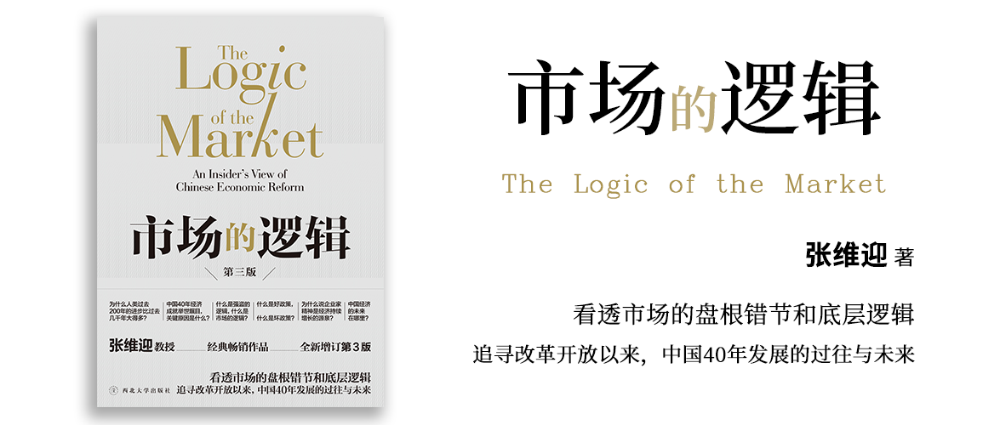

# 市场的逻辑 第三版

张维迎 著

原书初版2010年7月，第一次修订（增订版序）2012年1月，第二次修订（新版序）2019年7月21日。

## 献词

无

## 新版序

第18章是第三版新增的章节。

主要讲述第18章的主要内容：中国经济将从套利转向创新，因此，也呼吁制度改革以此为导向。

## 增订版序

《导论：市场的逻辑和中国的改革》、第6章 好政策与坏政策、第7章 市场与道德伦理这三章是第二版新增的。

> 市场是人类应对无知和约束无耻，特别是减少由于多数人的无知和少数人的无耻相结合导致的灾难性错误的最有效的制度安排。

作者也表示了本书的目的，强调和捍卫市场经济的重要性。

## 前言

市场的基本逻辑：

1. 利己先利人：企业家为雇员创造工资待遇、承担连带责任。雇员为客户创造客户愿意购买的产品。
2. 市场竞争，本质上是为他人创造价值的竞争。

市场起到的两个重要作用：

1. 看不见的手：指引人们做正确的事。——防止出错。
2. 看不见的眼：监督人们把事情做好，建立良好的声誉。——鼓励竞争、促进分工、推动合作。

市场的基本制度：

1. 私有产权；
2. 自由价格；
3. 企业；
4. 企业家；
5. 利润；

市场失灵，通常情况下并非市场真的失灵，而是现实中的市场是不完美的，有一些反市场的力量，比如：既得利益者、政府干扰（包括政府救助等）。

全书按四编来描述：

1. 第一编 解读市场经济：介绍理论；
2. 第二编 思考中国改革：讲怎么改；
3. 第三编 理解金融危机：讲成因（政府政策）和解药（市场自发调节），以及常见的错误治疗方案（凯恩斯主义）；
4. 第四编 把脉未来发展：讲未来发展。

## 导论：市场的逻辑和中国的改革

亚当·斯密《国富论》认为：

财富的创造来自**生产力的提高**，生产力的提高来自**技术的进步和创新**，技术的进步和创新来自**劳动分工和专业化程度**，劳动分工来自**市场规模的大小**，当市场规模扩大后又反向推动生产力提高，进入良性循环。

人们追求幸福有两种方式：

1. 强盗逻辑：把别人的财富拿到自己手里。例如：罗马帝国的崛起、第二次世界大战的德国和日本。
2. 市场逻辑：通过使别人幸福让自己也幸福，比如创造别人需要的产品并获得报酬、老板通过让员工获得工资员工为企业创造利润。例如：丝绸之路、二战后重建的德国和日本。

而之所以**市场逻辑**能够生效，也就是“通过使别人幸福让自己也幸福”，前提条件是“自由和产权”，也就是人们可以有自由来决定自己要什么以及在产权的保护下自由交换的权力。

但是有个例外，就是“政府收税”，这个合法的收税过程，实际上是强制性的，因此人们并不容易评估政府收税的金额和其所提供的服务之间是否等价。所以，在西方民主制度建立的过程中，如何约束政府征税的权力，变成一个非常重要的问题。

制度的安排受到管理范围、通信水平的影响，但是达到的目的是相似的：

1. 古代：连坐制：一个人犯罪，整个乡村都受到牵连，因此皇帝的管理成本就变低了。
2. 现代：连带责任：
    - 一个人在公司里其实同时为其他同事负责，否则公司可能就产不出好产品。
    - 社会通过“合同”相互约束，这样就确保了交易双方的利益。
    - 企业所有权和利润：老板为企业担责，通过管理员工来避免风险，员工按岗位要求完成工作，企业利润则作为企业这个整体的奖励，也代表了其所承担责任的大小。

现代市场中的企业，必定是由不同的企业像金字塔一样堆叠起来而不是平铺开的，因为同类的企业最终只会有少数几个，其他企业为这些企业提供服务。比如沃尔玛只有一个，而不是任何企业都可以是沃尔玛，沃尔玛之所以是沃尔玛恰恰是因为它做的足够好。

[源文件：国有经济和私有经济的关键差别.drawio](contents/2024-02-14_国有经济和私有经济的关键差别.drawio)

三代企业家：

1. 第一代企业家：农村走出来的。它们因为“户口”的身份问题，没有办法进政府，靠“投机倒把”做了私有企业。
2. 第二代企业家：随着“私有企业”合法化，一部分城市人、政府官员才开始下海，成为第二代企业家。
3. 第三代企业家：海外优秀人才回归，如李彦宏、张朝阳等，成为第三代企业家。

政府的存在是为了“保护自由和产权”，确保市场逻辑可以运行。但是现在的政府占有了太多的资源，导致了个人自由和财产不仅得不到有效保护，反而受到严重威胁。

—— 解决方法：法治建设和政治民主化。

所以，改革就是减少政府的权力。

## 第一编 解读市场经济

### 第1章 理解和捍卫市场经济

经济学家存在的作用就是捍卫市场经济，如果你不需要市场经济，你就不需要经济学家。

但是有一些人总是反对市场经济，他们通常是：

1. 既得利益者和特权阶级：市场经济与他们的利益冲突。
2. 无知者：他们无法看到市场经济带来的好处。
3. 以批评市场经济博得掌声：人们喜欢免费的午餐，而市场经济说天下没有免费的午餐。

下面这些行为都是反市场经济的：兰州拉面限价、经济适用房或限价房、劳动合同法刻意保护劳动者限制企业自由裁定、反垄断法中缺乏对政府权力的限制。

市场经济的基本特征：

1. 竞争为他人创造价值：好坏由别人说了算，利润的多少代表企业创造了多少剩余价值。——有一只看不见的手，使你在追求自己利益的时候，为别人创造的价值，比你主观上想着为社会作贡献时创造的价值更大。这就是市场经济的奇妙之处。
2. 陌生人之间的分工合作：陌生人通过企业形成大规模的分工协作，通过建立声誉、建立信用来促进自身发展。——隐形的眼睛。

市场经济是一个责任制度，利润是一种考核方式，通过企业、利润、企业家形成市场，企业家管理企业，创造并享受利润。

中国企业家和外国企业家的相同之处在于都是承担不确定性，并通过克服不确定性创造价值，但是不同之处在于，外国企业家的大量精力用于思考消费者需要什么，而中国企业家有大半的精力不得不放在政策的不确定性上。在中国，政策干预越少的地方发展的就越好，比如产品市场、劳动力市场，干预越多的地方发展就越不好，比如资本市场、土地市场，一些需要监管参与但是没有做好的比如知识产权市场，导致了中国的技术市场发展不好，具体表现在国内企业专利少，自主创新的能力就受到了限制。

为了完善市场，政府应该做什么？就是很好地界定产权、保护产权。要有制度确保资产能够向资本转变，这样拥有资产的穷人就可以通过获得资本而参与市场竞争。

很多时候人们认为市场不灵，但原因并非市场不灵而是那些领域是政策限制进入或者需要特权才能进入，这样做的后果还导致了贫富差距的扩大，有权的人能够将权力变成财富，而没有权力的人则无法参与市场竞争。

### 第2章 正确解读利润与企业社会责任

一些典型的想法和行为是错误的，比如，直接强调“企业要为利益相关者（员工、供应商等）负责”、“企业要做慈善”、“企业要建立良好的公共形象”、“企业应该无偿或低价为社会提供产品”等，把这些作为企业存在的理由，会导致企业“目标不清晰”。

这些论调都来自于我们希望企业去承担“社会责任”，而公共舆论又导向让企业这么做，企业有时候不得不应付这些需求，但有时候企业错误地把这些事项当作自己的目标之一。

企业获得利润就是企业承担社会责任的最好的标志。利润的产生就是因为有人愿意购买企业提供的服务，说明企业为社会创造了价值。

利润来源于三个方面：

1. 不确定性，因为冒险精神和远见卓识，企业家承担了对应的风险。
2. 创新，通过更低的成本，或者相同成本创造更高的收入来获得利润。
3. 企业对市场秩序的维护，也就是让社会对你产生的信任，具体而言就是“品牌”。

真正要强调社会责任的不应该是企业，应该是：

1. 政府：它不用考核利润，所以应该被“鼓励”为人民服务。
2. 非营利机构：大学、研究所等，难以用利润来衡量。
3. 垄断机构：你占了资源，但又不是靠自身贡献来获利，所以需要主动承担社会责任。

所以要想强调社会责任，不是光呼吁，要把产权制度搞好，把价格制度搞对，把激励机制搞活。

### 第3章 国有制与市场经济相容吗

国有企业与市场经济共存，会带来下面这些问题：

1. 在国有经济中，“充分竞争”必然是过度竞争。就社会效率而言，国有企业的竞争行为可能非常具有破坏性。过度竞争：国有企业经常以低于成本的价格进行销售，从而破坏了市场的公平。在非垄断市场中很难见到如此大规模的恶性竞争行为。国有企业的这种行为，是因为国有企业的所有权模糊，归全民所有等于无人问津。而对于国有企业经理人的激励机制通常以“收入”为主要考核标准，而在国有制的基础上，经理人惯常会企图将对应的成本从账目上做小，以实现盈利，但与之对应的私有制同行则无法做到如此低的成本，从而国有制和私有制的竞争中国有制以剥夺股东（全民）利益的方式实现盈利。使得`γ=β/α`中`γ≠1`，且产生重大偏离（越接近`γ=1`，越合理）。（关于公式，请查阅原文）
2. 国有制下的竞争可能导致过度准入。过度准入或者重复建设：企业产生两种回报现金流（利润，按所有权结构分配）和控制权收益（依附于职位的在职消费、裙带关系、社会声望等）。在国有经济中，现金流属于“全民”，经理人只能享受控制权收益。政府的官僚和国企经理人做投资决策，它们倾向于设立更多的企业，以安排对应的岗位。通俗地讲，就是一个行业可能本来只需要5个企业，而在国有制情况下，可能会成立50家企业。如果在私有制经济下，当企业超过5个的时候，可能会产生一些兼并行为，而被兼并的企业相关人员可以通过获得所有权收入来平衡损失掉的控制权收益，但是在国有企业中，经理人是靠岗位活着的，被兼并意味着失去岗位，从而失去控制权收益，从而导致国有企业一旦设立，再想关闭或退出就变得特别困难。
3. 市场经济中的声誉机制在国有制下不起作用。声誉机制的缺失：声誉机制是市场经济的重要的机制，通过声誉机制可以奖励那些做的好的企业，惩罚那些做的不好的企业。要让声誉机制有效，需要满足以下三点：企业得有所有人（因为声誉是无形资产，声誉的形成和累积，所有人会因此受益，所有人有动力去捍卫声誉）、企业的名称在市场中可以交易（比如麦当劳可以授权其品牌，因此麦当劳可以通过品牌授权受益）、市场中必须有自由准入与退出（声誉不好的企业要被清理出局作为惩罚）。而国有企业的所有权归全民，等于没有“所有人”（因为这个虚拟的“所有人”没有动力去维护声誉）、国有企业的名称也无法用于交易或者也无法正确定价、如前所述，国有企业还难以退出市场，因此声誉机制遇到国有企业就失灵了。
4. 国有企业在市场竞争下无法长期生存，竞争最终将导致国有企业的民营化。竞争驱动的民营化：中国不愿意放弃国有制，而国有企业是国有制的代表。但是中国承认竞争的价值，在引入竞争的过程中，希望通过分权来实现竞争，但最终却不得不将全部或部分的剩余股份民营化。

中国希望以国有制的基础上充分引入竞争，承认竞争的价值。但是在产权问题上，中国政府坚持社会主义的观点，国有制就是其始终坚守的底线。企业是市场运行的主体，而企业的所有权如果是国有制，将会带来以上所论述的各种问题。

### 第4章 反垄断法的隐忧

根据经济学理论，企业有三种定义：

1. 生产函数：输入生产资料，输出产品。
2. 创新函数：创造新技术、新产品、新市场、新商业模式、新生产方式的专门组织。
3. 信誉载体：企业的存在和运作，使市场经济中的信任得以建立，并促成陌生人之间的广泛合作。

其中《反垄断法》重点关注“生产函数”，认为市场份额高度集中是导致价格竞争不够充分的原因（产业中的市场份额越集中，企业的产量就越小，价格就越高）。但是这与现实情况不符，大部分行业都是由少数大企业主导，且大企业维护着这个行业的秩序。消费者只需要认识这些大企业就可以建立信任，而不需要了解整个行业，产品和服务出了问题就找这些大企业就可以。

垄断与竞争的真正界限在于，是否限制新的企业进入某个行业。而事实上很多造成这种进入限制的原因都是因为政府限制进入，导致的行业垄断。而那些允许自由进入的行业，大企业也一日不敢怠慢，而且要始终保持为客户创造价值的责任，否则就会有新入局者发起挑战。

### 第5章 让商业活动更自由

营商环境的好坏关乎到一个地区是否易于创办企业，而企业的活力则直接影响该地区的创新水平。而影响的主要因素就是政策和制度，根据世界银行《[全球商业环境报告](https://archive.doingbusiness.org/zh/reports)》的数据，中国还是有很多需要改善的地方，在中国开办企业、报税、获得行业准入等都需要大量的和政府打交道，而这又进一步滋生了腐败，这些都是不利于企业经营的。

### 第6章 好政策与坏政策

好政策和坏政策，在普通人眼里和经济学家眼里，通常有所区别。这里主要区别在于看待政策的两个方面：目标和结果。

目标是指一个政策想要解决的问题。在这一点上经济学家通常和大多数人持有相同的看法，或者说也无法用自己的价值观告诉别人哪个政策好，哪个政策不好。但是通常冠冕堂皇的政策，目标看起来都是挺好的。普通人通常被目标的好坏迷惑，因此觉得一些政策是好的，只是执行除了问题。

而如果是个经济学家就不能单看目标的好坏，而要看这个政策的执行结果是否与制定者希望达到的目标一致，而且即便达到相同的目标是否有成本更低、效率更高的替代方案，另外，政府的政策是否与“[消费者主权 Human Action](https://zh.wikipedia.org/wiki/%E8%B7%AF%E5%BE%B7%E7%B6%AD%E5%B8%8C%C2%B7%E9%A6%AE%C2%B7%E7%B1%B3%E5%A1%9E%E6%96%AF)”相一致。

1. 目标好，结果事与愿违：
    1. 最低工资和限制雇工自由的政策。导致雇员成为实际受害者，减少了就业。
    2. 高税收政策。抑制了创业和创新。
    3. 扩张性货币政策。诱导企业进行产业决策。
    4. 计划经济。不具有可行性。——因为“无知”导致的。
2. 成本高、效率低的政策：
    1. 北京市限制汽车保有量。导致真正需要车的人没有车用。
3. 与“消费者主权”不一致（即不是以消费者意愿为最终导向）：
    1. 产业政策。如新能源政策。因为决策依据不是消费者。

导致目标好，但是结果事与愿违的原因：政策不满足激励相容约束。导致“执行不力”的原因，其实是因为政策根本就不是“执行”的。

> 每个人在追求自己利益的时候都在主动而理性地“利用”政策，而不是被动地“执行”政策。而我们的政策制定者假定，受政策影响的人是被动的，只要有了政策他们就会按照政策制定者的意图去做。

好政策应该是：自由放任的、没有政府强制干预的政策应该是最好的政策。基于这个原则，所以以下都是不好的政策。

1. 任何限制自由竞争、维护政府和国有部门垄断的政策，特别是像我们国家许多限制民营企业自由进入的政策，都不是好政策。
2. 任何做大做强国有企业的政策都不是好政策，因为大量的国有企业不是在创造价值而是在耗费价值，它们赚的很多利润是来自财政的补贴，或者是经济学上讲的消费者剩余的转移。
3. 任何诱导企业家寻租的政策都不是好政策。产业政策就是诱导企业家寻租的政策。
4. 任何增加政府控制能力，包括财政的能力、资源的能力、土地的能力等的政策，其实都不是好的政策。
5. 任何变化无常的政策都不是好政策。企业家的决策基于对未来的预测，政策的多变性必然导致企业家预期的紊乱、投资行为的短期化和资源的掠夺性开发、创新精神的萎缩，导致企业不重视声誉，造成假冒伪劣泛滥和坑蒙拐骗盛行。

导致制定出坏政策的原因，主要是由于“无知”和“利益”。

1. 由于“无知”制定的坏政策：
    1. 计划经济。
2. 由于“利益”制定的坏政策：
    1. 贸易保护政策。贸易主义保护政策就是让众多的消费者补贴少数的生产者（以及这些企业的工人）。
3. 同时由于“无知”和“利益”制定的坏政策：
    1. 计划生育政策。
    2. 新劳动合同法。
    3. 凯恩斯主义。

关于“凯恩斯主义”的批评，原文比较精彩，引述如下：

> 凯恩斯主义本来是研究短期经济波动的理论（尽管不正确），现在竟变成了经济发展和转型的理论，中国现在“十二五规划”制定的理论依据很多就是凯恩斯主义的公式。按照这个公式，经济增长来自消费、投资、净出口“三驾马车”。政府花的钱越多，GDP增加得越快。本来我们创造GDP是为了消费，但现在我们是为了GDP而创造消费；投资本来是为了提高效率，增加未来的供给，但现在投资是为了增加总需求，有没有效率没关系；贸易本来是为了提高全世界的幸福水平，在全球范围的分工下所有国家都得到好处，现在贸易变成了只有出口大于进口才提高GDP，所以贸易保护主义政策就在这里找到了理论依据。
>
> 凯恩斯主义政策的利益驱动在哪里？首先，为什么政治家喜欢凯恩斯主义？这里有两个原因：第一，凯恩斯主义政策使政府可以大把地花钱，花钱总是令政府官员惬意的事情；第二，政治家通常只关注短期目标，因为我们知道，不像过去皇帝要考虑子子孙孙的江山社稷，在现在的民主体制下，当政者只考虑本届政府任期内的事情，凯恩斯主义为政府追求短期利益提供了借口。其次，企业家为什么喜欢凯恩斯主义？因为很多企业家自己犯了错以后不愿意忍受痛苦，希望政府降低利率、多发票子把自己从破产的边缘解救出来。企业家总是喜欢宽松的货币政策，不喜欢紧缩的货币政策。再次，经济学家为什么喜欢凯恩斯主义？因为凯恩斯主义为劣质经济学创造了很多就业机会，使政府成为消费劣质经济学的巨大市场。另外，普通大众为什么喜欢凯恩斯主义？因为普通大众喜欢吃免费午餐，以为政府用信贷支付工资和福利是没有成本的。凯恩斯主义告诉人们市场失败了，需要政府纠正市场的失败，很合大众口味！

### 第7章 市场与道德伦理

市场和宗教的差别在于，前者约束人的行为不改变人心人心本来咋样就咋样，后者希望能够改变人心。

而人心，也就是人的本性，是以自我为中心（Self-centered）的，这一点不论是亚当斯密、孔子、亚里士多德，都是认同的。人们做很多事情都是从自己的角度出发，由近及远地感同身受。

在以自我为中心的基础上，人类社会相互之间又需要合作，目的是为了“使得自己变幸福”。变幸福的方法归纳下来有两种，一种是“强盗逻辑”，通过让别人不幸福而使自己幸福，一种是“市场逻辑”，通过让别人幸福使自己变得幸福。

判断一个人是不是恶人，不应该看他有没有恶心（怎么想的），而要看他有没有恶行（怎么做的），这也是宗教和市场的基本差别。

通过以下市场机制，市场才能有效运行：

1. 利润：因为市场是通过使别人变得幸福而幸福，所以提供服务的人越多获得的收益就越大，比如发明iPad和iPhone可以让每个人都用上，当保姆就只能服务一两个人，前者就获得更大的收益。利润是用来奖励那些提供服务的，而服务的人越多，利润就越大。
2. 声誉：只有着眼于长远利益的人，才能够真正赚钱。
3. 私有财产制度：交易双方应该有权决定是否交易，任何一方不能强买强卖。这样大家就可以基于平衡的利益，以协商的方式完成交易。

维持市场机制的有效性，需要靠制度而不是说教，这也是政府的职责所在。政府应该维持市场的秩序，而市场的秩序应该是自由竞争。因此那些有碍竞争的行为也就会破坏市场。

## 第二编 思考中国改革

### 第8章 理性思考中国改革

理性思考包含四方面内容：

1. 换位思考：要抛开自己的位置，多站在其他立场上看问题。
2. 切实可行：不能拿着理想主义但不可行的方案去抨击切实可行但不太完美的方案。
3. 有理有据：必须摆事实，讲道理，实证数据和逻辑分析相结合，而不能以感觉代替事实，用直觉判断代替逻辑推理。
4. 大步向前：要向前看而不能向后看，过去可能有很多不对的地方不能抓着不放，要立足当下放眼未来。

中国改革面临三个约束条件：

1. 权力机构约束：因为各部门间权力分割，上下级之间权力分割，导致很多改革措施利益纠葛过多，无法达成一致。
2. 意识形态约束：因为不能将改革问题搬上台面，很多问题就只能干不能说，也没有充分讨论集思广益，还很容易被戴帽子，导致改革困难。
3. 知识约束：没有市场经济的实战经验，导致得摸着石头过河，过程中就免不了一些人以此为由谋求自身利益。

改革不是革命，革命是零和博弈强制重新分配，改革是帕累托改进把盘子做大，大家的收益都有提升。改革是希望大家的绝对利益都增大，减少贫富差距。

所以，改革中要考虑利益补偿的问题。要做到补偿，就要承认过去的利益格局、过去的制度事实，对过去的既得利益者在改革过程中的受损部分予以一次性补偿。

发展是消灭贫困和缩小收入差距的硬道理。在提出“[效率第一，兼顾公平](http://ie.cssn.cn/academics/economic_trends/201712/t20171204_3766393.html)”观念的时候，这里对“公平”概念的理解，既可以是机会公平也可以是结果公平，但首先得是机会公平，因为结果公平不太可行，会影响把整个蛋糕做大。所以大体思路是“先将蛋糕做大，再说分配的问题”，这样的话还可以同时解决“绝对贫困”的问题。

影响贫富差距的因素有：城市和农村、因受教育程度不同带来的人和人的差异、地区间的差异，这些差异都使得“让一部分人先富起来”，但这与“共同富裕”并不冲突，这些差异都是“做大蛋糕”过程中必然会遇到的问题。然后才是考虑如何分配：中央的转移支付、改善受教育的机会公平，都可以间接改善分配的问题。但是调整分配机制的时候，要充分考虑“全球化”的大背景，因为全球化导致了高端人才与国际接轨，低端制造业工人可能还维持低成本竞争优势，贸然调整分配问题，可能导致中国的全球化竞争优势“低成本”消失。

在诸多收入差距的因素中，人们往往难以容忍因腐败带来的收入差距不平等。而造成腐败的根源就是“权力”，因此而产生了各种腐败现象。所以要减少这一类的收入不平等问题，不能光治标不治本，而这里的治本就是要减少政府部门的权力。正是因为有了权力，才有了寻租的空间，才有了企业和政府之间的“你来我往”，才有了腐败问题。

### 第9章 中国渐进式改革的历史视角

根据“前言”描述，这篇是写于1993年。

中国渐进式改革，被邓小平称为“摸着石头过河”。这种小步迭代的思路符合中国广阔的市场空间，各地区差异较大应该因地制宜的基本特征，也是验证新政策的科学精神。因此，以下特点也是在这样的指导思想下所形成的中国特色。这些特点不仅在20世纪90年代成立，在现在看来也是（部分）成立的：

1. 中国经济改革没有严格意义上连续不变的改革目标
2. 中国的经济改革进程没有一个事先规划好的蓝图
3. 中国经济改革是按照“从简单到复杂”的顺序模式来进行的
4. 中国经济改革是通过双轨制改革进行的
5. 中国经济改革没有剥夺任何主要利益团体的既得利益，而是改变了既得利益的实现方式
6. 中国经济改革被地方政府所主导
7. 中国经济改革显示出巨大的地域差异
8. 中国经济改革是一个试验的过程
9. 中国经济改革是一个走走停停的变革过程

随机行走：中国是怎样选择渐进式改革的？

1. 没有时间等待：穷疯了必须得改革了。
2. 没有人知道路在何方：计划经济的惯性还很大，也没有人告诉你什么就是对的。
3. 没有人知道如何去改革：有知识没经验，有想法没信心。
4. 没有人有权力和权威去贯彻设计好的改革进程：改革就会有利益分配问题，分散的权力结构带来改革的阻力。
5. 没有人愿意冒大的风险：改革不仅是经济的问题，也事关政治与事业和前途。
6. 让民众习惯市场经济需要时间：选择市场经济就带来自负盈亏，这和习惯相左。——这一点和[彼得·德鲁克-管理的实践](../彼得德鲁克-管理的实践/README.md)一文中提到的“如果是新计划应该大刀阔斧，如果是改变习惯则应该小步前进。”思想是一致的。

市场经济在双轨制运行的过程中，因为效率更高而取得了最终的成功，这并非最初设计的结果。设计者们的初衷是为了“通过刺激人们的积极性，来完善已存在的以公有制为基础的计划经济。”但也正是因为有了这样的竞争，才导致了市场经济有机会胜出。

### 第10章 产权变革、企业家兴起与中国经济发展

优秀的人才总是稀缺的，因此当一个国家优秀的人才在什么行业，就将会促进这些行业的发展，同时抑制其他行业的发展。比如过去的中国是职权为主，那么人才就会倾向于政府的工作。但是政府的工作是基于税收的，从事的是再分配的职责，也就是这个社会真正从事生产的人，在能力上总体是逊色于从政的人员。改革的过程中，将职权向财产权转变的时候，因为产权制度逐渐清晰，优秀的企业家可以通过发现“需求”而“创造”商品，通过“交易”的形式创造利润，因此，优秀的人才就会慢慢转向工商业。当一个社会优秀的人才更多地从事工商业，那么所创造的消费者剩余就会逐渐增多，因此整个社会的物质就会逐渐变多，整体经济就会往良性发展。

随着中国对于“生产力”的追求不断增强（不能一起挨饿），从最初的成立集体所有制的乡镇企业到私有制转型，农民成为了第一代企业家，随着邓小平南巡鼓励私有企业再外加“下海”潮迫使/吸引了一部分有企业家潜质的公职人员创办私营企业成为了第二代企业家，伴随中国海龟科技人才的增加，催生了第三代以科技为主的企业家。而且三代企业家的演进，也伴随着受教育程度越来越高的特点。

因为中国的职权经济和财产权经济是长期并存的，所以寻租也是不可避免的。但是一些寻租行为是为了获得政府垄断的生产资料，而从国有企业与私有企业对相同资料的应用上，私有企业创造了更多的剩余价值（黑市价格比政府定价要高）。因此我们不能一杆子打死认为不能有任何的寻租空间，而是要看这样的寻租是否产生了真正的价值，当然更好的趋势是进一步推动财产权以减少寻租空间。寻租带来的另一个问题是，这让我们的营商环境变得不尽如人意，我国的企业家更多的时间和精力放在政策的变化上，而西方的企业家则可以更聚焦于需求和新技术。

### 第11章 中国经济改革30年

> 本章主要内容与第10章基本一样。

中国改革开放是从计划经济向市场经济的转变，其中包含了妥协和折返。

价格改革，从最初的计划价格，到双轨制并行既有计划价格也有市场价格，黑市随之出现，倒买倒卖乱象重生，期间不得不暂停改革，直到1992年邓小平南巡后全面转向单轨制市场价格体系。

企业制度改革，可划分为两大阶段：第一阶段是1992年之前，即在改革的前15年，主要是非国有部门，包括乡镇企业和私人经济的发展，使得整个经济中的国有比重降低，同时仍然保持国有部门的增长。第二阶段，从1993年开始，中国才真正触及国有企业本身的产权问题，即国有企业的非国有化问题。

在改革的30年后，价格改革和企业制度改革的整体框架基本已经成型，剩下的更多的是技术问题。作者预测未来的30年（成稿于2008年11月5日），也会分为两个15年，第一个15年是加强法治社会的建设，政府的权力会得到进一步缩减，按规则办事，而没有太多的裁判权，如果政府违规了，还可以通过法院告政府。第二个15年就是要建立以中产为基础的民主选举制度。以上两项只是作者的推测。

### 第12章 中国的价格改革

> 本章主要内容与第10章、第11章基本一样。

中国的价格改革，主要是通过双轨制，小步前进，逐步推进。有一些是歪打正着，一些是顺势而为。

### 附录 以价格体制改革为中心带动整个经济体制改革

根据“前言”描述，这篇是写于1984年。

价格是选择的标准，是把经济效益和综合平衡统一起来的工具，它的基本功能就在于协调供求关系。价格又是一种信号，它传递情报，引导资源按经济合理的原则进行转移，以保证经济结构的动态合理化和经济效益的极大化。

在改革之前的价格体系：

1. 错误的价格信号使得经济核算失真，企业按这种价格做出的效益最大化选择必然破坏宏观计划平衡。
2. 价格失真，使综合平衡失去了客观依据，因为计划者心目中的“核算价格”毕竟是没有客观标准的想象。
3. 价格的歪曲使得实物指标和价值指标相对立，宏观评价和微观评价相对立。
4. 歪曲而僵化的价格体系使得经济结构无法合理演化，造成经济结构的畸形，使国民经济出现周期性的比例失调，每次失调都使经济濒临崩溃的境地。

而价格体系的问题只是表象，价格制度才是根本问题，寄希望于“改进调整价格的水平”是缘木求鱼的想法。

针对改革价格制度，要在原有计划经济制度的基础上，采用逐步放开，逐步承认黑市灰市上的一些做法把它纳入合法范围，逐步取消计划体制。

因为价格制度的改善会首先优化资源配置，提高整体生产率，所以财政问题不用担心，总是比原来要好的，在收到的钱更多的情况下，再谈分配就更有可能了。而且在经济总量上涨的情况下，很多原本需要财政补贴的部分就不用再财政补贴了。总体而言是收入增加，支出减少，对于财政的收支，也是利好的。

一些功能不健全可能会成为障碍：

1. 大量自给性生产的存在，资源缺少流动性，信贷制度不发达，统计系统不健全，税务管理不严，信息传递不灵，司法制度不完善，人们的法治观念淡薄，等等。
2. 社会还缺乏“企业家”，能够具有获取新情报、发现新的投资机会、筹集资金、组织生产、引进新技术和开拓新市场的能力。这就要求企业家必须具备开拓精神和冒险精神的一群人。
3. 缺乏会搞经济管理的部门。
4. 错误地把道德标准用来衡量经济活动的习惯。

### 第13章 市场化改革与收入分配

分配的问题包括了资源的分配和收入的分配，截至目前为止，政府仍在资源的分配中起着非常重要的作用，而市场则在收入的分配方面起着重要的作用。

随着市场经济的推行，从数据上可以看出，在GDP比较高的地区，收入差距反而更小。大家认为国有企业的分配更平均，但事实上国有企业占比较高的区域收入差距反而更大。政府支出大的地方，收入差距也更大。利润收入占比（靠钱生钱）更大的区域收入差距更小。市场化程度越高的地区，收入差距反而越小。

以上对于收入差距数据的观察可以看出，市场经济对减小收入差距的重要作用。而更重要的发现是，市场经济受政策导致的营商环境的好坏影响非常明显，政策不确定性越高的地区市场经济水平越差，政府垄断越多的地区市场经济水平越差。导致想要办企业，就得有政府资源、政府关系。而要减少政府对于市场经济的干预，司法独立则是必须的。政府还应该加大对教育的投入，数据说明教育对人的收入提升有直接关系。

## 第三编 理解金融危机

### 第14章 危机中的选择

### 第15章 经济不是单一的产品

### 第16章 金融危机与经济学的发展

## 第四编 把脉未来发展

### 第17章 把脉未来中国经济增长和制度变革

### 第18章 从套利到创新

这一章是第三版新增的章节。

套利和创新，是经济发展两个阶段的重点，过去的重点是套利，把成熟市场的技术、模式、产品、服务搬到中国来，进而产生市场经济。但是随着套利空间不断变小，创新的重要性就变得越来越重要了。

如果需要创新成功，过去适用于套利的政策、制度就要调整，要适应创新。创新是个投入大、不确定大的事，而套利则不确定小，容易见效，我们要靠新一代的企业家来完成创新的使命。

创新不是搞发明，搞发明顶多是创新的第一步，创新将发明的成果转化成真正的市场需求，从技术、成本、质量、服务等方面进行创新。

以下事项都会阻碍创新：

1. 政府监管：政府经常打着保护消费者的幌子保护既得利益集团，例如：发布一些针对网约车的政策，增加了行业进入门槛。而更好的做法应该是鼓励竞争。
2. 反垄断法：只要进入是自由的，哪怕有一家企业也不叫垄断。反之，如果进入不自由，比如政府规定以后不能再有新的网约车公司，哪怕现在有十家也依然是垄断。滴滴打车不是垄断，因为行业里还有很多新的竞争对手跃跃欲试，相反，传统出租车利用政府政策，限制了竞争。
3. 产业政策：有产业政策，就有各种门槛和限制，那些擅长搞关系的企业就会比真正创新的企业更容易获得产业政策的支持。
4. 国有企业：国有企业不仅自己没有积极性创新，而且阻碍着民营企业的创新。
5. 宏观经济政策：一些要倒闭的企业就是因为技术落后才被淘汰的，根据熊彼特的商业周期理论：经济的发展一定是新产品、新技术、新企业淘汰老产品、老技术、老企业的过程，创新周期决定了商业周期。

> 本书提及的“套利和创新”的概念在《[经济学的思维方式 第7.9节](../保罗海恩-经济学的思维方式/README.md)》中也有描述，但是意思略有不同，请跳转链接后查阅说明文字，这里不再赘述。
