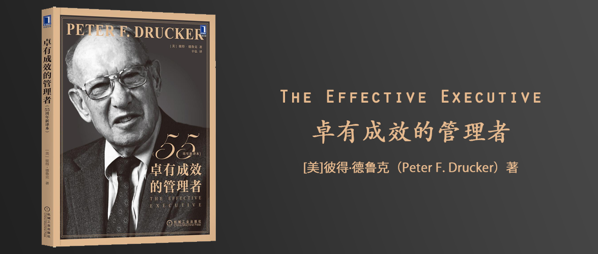

# 卓有成效的管理者

The Effective Executive

彼得·德鲁克（Peter F. Drucker） 著

## 推荐序（吉姆·柯林斯）

## 前言

## 引　言　有效管理者是由什么造就的

## 获得必需的知识

### 制订行动计划

### 行动

### 用“我们”来思考和说话

## 第1章　有效是可以学会的

### 为何需要有效管理者

### 谁是管理者

### 管理者面对的现实

### 有效带来的希望

### 有效真的可以学会吗

## 第2章　认识你的时间

### 管理者面对的时间需求

### 时间诊断

### 精简浪费时间的活动

### 集中“可自由支配的时间”

## 第3章　我能做出什么贡献

### 管理者自己的追求

### 如何让专才有效

### 正确的人际关系

### 有效的会议

## 第4章　让长处富有成效

### 用人所长

### 管理上级

### 让自己有效

## 第5章　要事优先

### 抛弃昨天

### 优先任务与延迟任务

## 第6章　决策的要素

### 两个决策案例

### 决策过程的要素

## 第7章　有效的决策

### 决策与计算机

## 第8章　结语：有效是必须学会的

### 跋 不要告诉我这次见面很愉快（扎卡里·菲尔斯特）

### 译者后记 人人都可以成为美好社会的创造者（辛弘）
