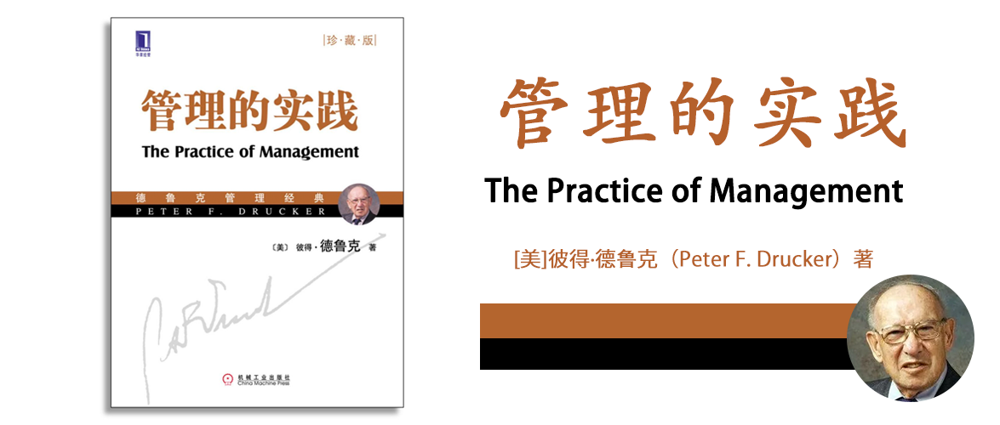

# 管理的实践

The Practice of Management

彼得·德鲁克（Peter F. Drucker） 著

## 图书梗概

这章非常简短，但是概括了这本书的整体思路，通过研究企业、管理者、员工和工作等不同维度来建立一个管理企业的整体框架，这既是管理的框架也是本书的框架。

## 关于作者

略，这章介绍了德鲁克先生，他对社会学和经济学的影响深远，他的著作架起了从工业时代到知识时代的桥梁。

## 权威推荐

这章引用了很多名人的推荐说明。这里就转述一下德鲁克先生自己的本意：

让普通人也能够掌握管理这门实践的技术。

德鲁克先生始终坚信从工业时代向知识时代转型后，社会会需要非常多的管理者，这些管理者不同于工厂里管理流水线工人的管理者，而是管理知识管理者的那种管理者。而成书的目的就是为了提供一套成为合格管理者的方法。

## 推荐序一(邵明路)

德鲁克先生通过著书立说的方法来推广管理学，不仅系统性地提出了管理学，而且他认为管理学不是少数人的学问，而是社会高效运转的关键之一。

> 他对我说：“中国固然需要大公司和领导它们的精英人才，但中国像任何国家一样，90%的组织将是中小型的和地方性的，它们必须发挥作用，单靠大公司，不能提供一个健康社会所需要的各方面功能。中国最大的弱点是作为一个大国，没有足够的受过高等教育的人，但你们有一大批能干的人，这些人在实际磨练中学会了怎样在极其困难的条件下生存并取得了成效。他们可能只受过普通教育，也不是特别聪明和优秀，但却知道如何精巧地处理事情。这样的人可能有几百万，他们可以领导那些中型、小型和地方性的组织，他们将建设一个发达的中国。”

## 推荐序二(赵曙明)

这段推荐序里，回答了一个关键的问题（如下）。

> 德鲁克先生几乎不假思索地回答：“我希望大家看看《管理的实践》和《[卓有成效的管理者](/docs/book/彼得德鲁克-卓有成效的管理者/)》”。

## 推荐序三(那国毅)

> 1954年11月6日是管理学中一个划时代的日子，彼得·德鲁克在这一天出版了他的《管理的实践》一书。

这本书出版距今已经70年了，虽然写下这句话的时候我还没有阅读这本书，但是我相信德鲁克的思想是穿越周期历久弥新的，不论商业模式发生多少迭代和变化，企业、社会、人的协作这些内容都还在相同的框架下，德鲁克依靠他的远见卓识早早就洞察了这一规律，并且用简洁的语言一语道破。

## 推荐序四(詹文明)

> 管理是观念而非技术，自由而非控制。管理是实务而非理论，绩效而非潜能。管理是责任而非权力，贡献而非升迁。管理是机会而非问题，简单而非复杂。

## 彼得·德鲁克自序

> 撰写本书的初衷：我希望提供曾经在客户公司中与我共事过的管理者工作上所必须知道的一切，协助他们为高层管理职位预做准备，同时书中的内容又必须好读而易懂，即使是忙碌的企业人都能在有限时间内抽空读完。

在德鲁克自己看来，这本书不是第一本讲管理的书，但是第一本完整讲管理的书，他希望通过简短的语言将管理这件事说透。

## 概论管理的本质

### 第1章 管理层的角色

现代工业体系必须将生产力资源——人和物质交给现代企业。而管理则将这些资源系统地组织起来产生经济效益，这就依赖管理者的能力、技能和职责。

### 第2章 管理层的职责

管理层的首要职责是产生经济效益，通过管理企业、管理管理者、管理员工和工作来达成，管理者不仅要做出对于当前有效的决策，还要兼顾企业的未来。

### 第3章 管理层面临的挑战

在一轮以“自动化”为主题的工业革命中，一些趋势是这样的：

1. 流程：新科技强调流程的重要性，流程能够适应不同的需求，并以最小的代价满足需求。
2. 自动化既适用于销售组织和行政作业，也同样适用于工业生产。——因为自动化不是一个“技术”，而是一种理念。
3. 自动化不会导致人全部被替代，而是要求新技能的技术工人、管理者。
4. 新技术一定是分权的（而不是集权的），不论是社会还是企业，集权都是非常危险的。

对于管理者的要求：

> 无论在任何阶层，对于管理者的责任和能力、他的愿景、他在不同风险中抉择的能力、他的经济知识和技能、他的管理管理者及管理员工和工作的能力，以及他的决断力等各方面的要求将会越来越高。

## 第一部分 管理企业

### 第4章 西尔斯公司的故事

西尔斯是一家真正意义上的现代企业，他的发展离不开管理者：

1. 西尔斯最初发现了农民的需求：农村信息闭塞，购买商品不方便，并提供了解决方法：邮购目录。做出这项决策本身是管理者的重要职责。
2. 为了系统性地解决这个问题，西尔斯公司需要整合供应链、确定自己的角色定位职责、提供全套的服务、建立起长期的客户信任关系。而这一切都依赖于管理者对于各个环节流程的定义和思考。
3. 公司的发展面临着市场环境的变化，昔日的农村市场信息闭塞，但慢慢地随着城市化的推进信息变得通畅，中产崛起，过去的经营方式不再适应新的环境，西尔斯公司必须对此作出战略性的调整，这也依赖于管理者的卓识和洞见。

西尔斯公司的成功离不开管理者不断地思考、决策、提出系统性的解决方案、调整业务流程以适应不断变化的市场。

### 第5章 企业是什么

企业的目的是创造顾客。

企业的两个基本功能是营销和创新。

利润不是企业经营的原因，而是结果，是限制性因素，是衡量企业经营绩效的指标。

创新可以表现在：更低的价格、更好的产品、旧产品的新用途、销售渠道的创新……。因此，创新不只局限于技术层面的创新，也包括经济层面的创新。

创新和营销应该贯穿在企业的各个环节，而非只是生产部门和销售部门的职能。

评估生产力不只包含投入和产出，还包含一些无形的因素：时间、产品组合、流程组合、组织结构。

企业管理是理性活动，靠绩效来检验成果，企业必须设定目标，在此基础上考虑如何自我调整，以面对可能的状况。管理层因此必须决定企业所从事的是什么样的事业，或究竟应该从事什么样的事业。

### 第6章 我们的事业是什么，我们的事业应该是什么

韦尔回答“我们的事业是服务”的例子在《[卓有成效的管理者](../彼得德鲁克-卓有成效的管理者/README.md)》，第六章“决策的要素/两个决策案例”中也有描述。

我们的事业是什么？——关注当下

1. 谁是顾客？我们的顾客是谁？谁是我们真正的顾客？谁又是我们潜在的顾客？这些顾客在哪里？他们如何购买？如何才能接触到这些顾客？
2. 在顾客心目中，价值是什么？顾客采购时究竟在寻找什么？
    - 人们很容易用“价格”来回答这个问题，但实际上不同的顾客对不同的产品有不同的考虑因素，比如能解决什么问题、售后服务便利性等。

我们的事业将是什么？——关注未来

1. 市场潜力和市场趋势：在环境不变的情况下，讨论天花板在哪里。
2. 外部环境的变化所带来的影响：经济发展、流行趋势和品味的变化，或竞争对手的动作，分别会导致市场结构发生什么样的改变？
3. 顾客对于价值的看法，是否受到哪些创新因素的影响？
4. 哪些顾客需求还没有被很好地满足？

我们的事业应该是什么？——关注正确与否

1. 应该从市场地位、创新、生产力等角度，来看企业是否应跨入新领域。
2. 企业的管理者需要设定正确的目标，并获得企业必要的最低利润。

### 第7章 企业的目标

企业的目标应该是什么呢？只有一个答案：任何一个其绩效和结果对企业的生存和兴旺有着直接和举足轻重影响的领域，都需要有目标。

这些关键领域的目标应该能做到五点：

1. 能用简洁易懂的语言说明所有的企业现象；
2. 在实践中接受检验；
3. 能预测行为；
4. 在决策制定过程中，就能加以评估；
5. 能让实际经营者分析自己的实践，并因此改善经营绩效。

正因为追求最大利润的传统定理无法通过这样的检验，因此势必遭到淘汰。

企业应该设定绩效和成果目标的领域共有8个：

1. 市场地位：首先要确认是哪个市场，顾客是谁，然后设定自己合理的市场份额，市场份额太高可能会损害创新，也有可能是因为是个衰弱的无人问津的行业，市场份额太低即便是销售额增长，长期看也是不利于企业发展的。
2. 创新
    每家公司都有两种形态的创新：产品与服务的创新，以及提供产品与服务所需的各种技能和活动的创新。

    以下是一般典型企业设定的创新目标：

    1. 全新的：为了达到营销目标所需的新产品或新服务。
    2. 改良的：由于技术改变，导致现有产品落伍，需要的新产品与新服务。
    3. 迭代的：为了达到市场目标，同时顺应其中的技术改变，需要进行的产品改进。
    4. 降成本：达到市场目标需要的新流程，以及在旧流程上有所改进──举例来说，改善生产流程，以便达到价格目标。
    5. 优化管理：在企业所有重要活动领域的创新和改善──无论在会计或设计、办公室管理或劳资关系方面──以跟上知识与技能的新发展。

3. 生产力
    生产力涵盖了企业投入的一切努力，排除了企业无法掌控的任何东西。

    我们要知道生产力是多少，就要有能力量化，量化的方法就是通过“贡献值”（所谓“贡献值”是指营业毛收入（公司销售产品或服务的所得）和支出（公司购买原料和供应商提供的服务所花的费用）之间的差距。），所以根据贡献值的定义，就要做到两点：

    1. 贡献值要越高越好，也就是收入越多成本越低越好。
    2. 提高贡献值保留为利润的比例。也就是说，企业必须提高自有资源的生产力。

4. 实物和财力资源
    要未雨绸缪地准备好设备、零部件、厂房、资金等，因为这些内容都不会凭空出现。

5. 获利能力
    获利能力，或者说是“利润”有三个目的：衡量效益；维持事业；吸引投资。所以这里所指的利润是指“最小利润”，也就是你定个目标，这个目标是你今年必须结余多少利润（扣除了维持事业所需的成本，以及资金成本），也就是当你具备这么多利润的时候，有人愿意投资你，而且这个利润应该是穿越周期的，在好年景和差年景之前取得平衡后，还要有人愿意投资你。而之所以有人愿意投资你，那么投资你的利润率就不能低于人家拿钱去市场上投资其他项目的利润率。
6. 管理者绩效和培养管理者：会在后面章节单独讨论，但很难量化。
7. 员工绩效和工作态度：会在后面章节单独讨论，但很难量化。
8. 社会责任：会在后面章节单独讨论，但很难量化。

目标的时间幅度：会因不同的公司性质、业务特点而有所不同，但切记不要一惊一乍随意变化。

企业还要在这些复杂的目标之间权衡利弊，这也是因业务而不同。预算可以用来体现这种管理的权衡，但是预算本身并不是目标，而且做出这种规划本身也反映了管理者对于未来预期的能力。

### 第8章 今天的决策，明天的成果

经济周期固然存在，但是如果基于经济周期做经营预测，可能难以实施，下面三种工具可以实施，用于经营预测：

1. 边界分析法：基于历史找到这件事最坏和最好的情况是什么，利用历史的数据就可以做出未来的预测，可推算出合理的“最小利润率”。
2. 基本要素分析法：过去已经发生的哪些事情会对未来产生确定性的影响。比如婴儿出生率在未来某一天会转化成住房购买率，如果在未来经济好，那么可能就有大批商品房，如果未来经济不好，可能这些房子就会变成由政府主导的保障房，但通常婴儿出生率和住房需求是长期相关的，但是这里有两个不确定性，一个是未来这件事也可能受政策影响而没有发生，一个是你并不知道到底是在哪一年具体发生，因此这个方法单独使用也还是存在很大缺陷，需要结合“趋势分析法”一起使用。
3. 趋势分析法：找出10~15年以上的周期，比如家庭用电将成为长期趋势、购买寿险所占家庭开支的比例将成为长期趋势。它应该结合基本要素分析法来使用。

除了有看似正确的“经营决策”，还需要有能够将这些决策转化成实实在在成就的人，因为人是成事儿的主角。当下的管理者必须要能够为未来的管理者系统性地做出正确的经营决策，而且要能够在未来的某一个时刻让未来的管理者能够理解今天为何做出这样的决策，当环境发生变化的时候可以进行合理的调整来应对未来的不确定性。

### 第9章 生产的原则

生产系统的差异，对应的是不同的管理原则，因此不同的生产系统有不同的管理原则。——简而言之就是制度要根据技术而进行调整。

生产系统可以大致分为三种：

1. 单件产品的生产系统：把生产一件产品的流程拆成多个同质的阶段，为每个阶段培养工人，实现进度规划。
2. 大规模生产系统
    1. 旧式大规模生产系统（生产单一产品）：以亨利·福特生产汽车的理念来举例，他认为的大规模生产系统是批量化生产同一种产品，这样可以降低成本。但是当应对顾客想要不同颜色的汽车时，这种方式将难以满足，因为不同的颜色会挑战这种生产系统的一致性。
    2. 新式大规模生产系统（制造同一种零件但却组装成不同产品）：如果需要多样性的产品时，可以通过将不同产品拆解成零件，然后会发现不同产品之间共性的部分，比如大部分的零件是可以复用的，这样就不是以订单的多少来规划零件的产能，而是根据存货的多少来规划产能，因此既可以应用大规模生产系统的优势，也可以组装出多样性的产品，降低成本的同时还能更好地服务顾客。
3. 流程式生产系统：流程决定了最终产品是什么，因此倒推回去就需要提前规划流程。

以上三种生产方式，从上往下越来越先进。每一种生产方式产生了不同的管理要求，以钢铁业为例，它可能是应用“单件产品的生产系统”，因此它就要求“整批生产流程”，就要求“维持大量而稳定的业务”，就要求“提早进行投资规划”，但是这些限制都是因为“单件产品的生产系统”的特点所决定的。但是如果能够突破“单件产品的生产系统”进化到“流程式生产系统”，这些限制就可以解除，钢铁业就能受益于更先进系统带来的更高的生产力。

为了适应不同的生产系统，对生产人员和管理者都提出了不同的要求：

1. 对生产人员：要适应不同的生产系统，就要了解不同系统对生产人员的要求是什么，否则可能无法达到先进系统降低成本的目的。比如一些生产环节是技能性的，无法标准化，个性化很强，它可能很难套用大规模生产系统，也达不到降低成本的要求，但如果像服装厂一样将不同的衬衫都统一成不同的零部件，针对不同的尺寸的衣服，仅仅将多余的面料剪去扔掉，也是更明智的。
2. 对管理者：了解不同生产系统的特点，进而搞定关键环节：
    - 单件产品的生产系统：搞定大量的源源不断的订单。
    - 大规模生产系统：产品种类多，因此要有能够销售不同种类产品的销售能力，而不是追求单一产品的销售订单。
    - 流程式生产系统：可能会创造出意想不到的产品，因此要有能力把这些新的产品销售出去。

不同的生产系统对人的要求也不一样：

1. 单件产品的生产系统：要身怀绝技的人才。
2. 大规模生产系统：必须受过分析思考、生产进度安排和规划的训练。
3. 流程式生产系统：管理者在整合观念和制定决策时，都必须能视企业为整体。

不同的生产系统对组织架构的设计要求也不一样：

1. 单件产品的生产系统：销售、设计、工程和生产部门可能各自分立，只有在制定公司决策时才需聚集一堂。
2. 大规模生产系统：
    1. 旧式大规模生产系统（生产单一产品）：如果能够将决策和整合的功能下放，将会获得较佳的绩效。因为在这种生产系统下，设计产品的工程师和制造产品的工人、营销产品的业务人员之间需要密切的协调。
    2. 新式大规模生产系统（制造同一种零件但却组装成不同产品）：因为所有的部门在每个生产阶段中都必须密切合作，因此必须由各部门代表组成小组，同时处理有关设计、生产、营销和组织的问题。
3. 流程式生产系统：与新式相同，且要求更高。

不同的生产系统对员工管理也不一样：

1. 单件产品的生产系统：对员工技能要求低，可能会受经济周期波动影响，随时招聘或解散初级员工。
2. 大规模生产系统：对员工技能要求高，不能随时开除，开除后不仅难以随时找到新的替代者，而且前期的培训等投资都会付诸东流。
3. 流程式生产系统：同大规模生产系统。

大规模生产和流程式生产还很容易自动化，而不断应用先进的生产系统和自动化技术，将抵抗未来劳动力资源不足的问题。

## 第二部分 管理管理者

### 第10章 福特的故事

包括秩序、结构、激励和领导力等企业的基本问题都必须通过管理管理者来解决。管理者是企业最基本的资源，也是最稀有的资源。

管理者所担心的与上司的关系，包括：与顶头上司的关系，上司对他的期望，难以将自己的看法传达给上司，无法让上司接受他的计划，重视他的活动，还有与其他部门和幕僚单位的关系等──这些问题全都和管理管理者有关。

> 为什么福特公司会陷入如此严重的危机呢？我们已经听过很多遍老福特治理不当的故事，知道许多不见得正确的恐怖细节。美国管理界也很熟悉老福特秘密警察式的管理和唯我独尊的独裁统治。然而大家不了解的是，这些事情并不只是病态的偏差行为或老糊涂所致，尽管两者或多或少有些影响。老福特失败的根本原因在于，他在经营10亿美元的庞大事业时，有系统且刻意地排除管理者的角色。他派遣秘密警察监视公司所有主管，每当主管企图自作主张时，秘密警察就向老福特打小报告。每当主管打算行使他们在管理上的权责时，就会被炒鱿鱼。而老福特的秘密警察头子贝内特（Harry Bennett）在这段期间扶摇直上，成为公司权力最大的主管，主要原因就是，他完全缺乏管理者所需的经验和能力，成不了气候，只能任凭老福特差遣。

亨利福特的独裁作风，让公司的各级管理者无法履行自己的职责，沦为了执行的工具。福特二世（亨利福特的孙子）继承了福特公司后，第一件要事就是决定从公司外部招募新人，并充分授权，让公司内部的信息足够透明以支持管理者的工作，这套做法是源自竞争对手通用公司。在重建了组织架构后，福特公司从谷底稳步回升。

在本质上，管理层的功能和责任永远因其任务来决定，而不是通过雇主的授权来决定。没错，管理最初确实源自于小公司老板在公司不断成长的情况下，将自己无法负荷的工作授权给助手来完成。但是当事业成长到一定规模，也就是发生量变之后，管理就必须产生质变。小生意一旦发展为企业，就不能单从企业所有者授权的角度来定义管理的功能，而是因为企业客观的需求而产生管理的功能。否定或贬低管理的功能就是毁灭整个企业。

管理管理者的几个要求：

1. 目标管理与自我控制：每一个管理者都应该为一个目标而奋斗。
2. 为管理者的职务建立适当的结构：设定工作内容时，必须以能达到最大的绩效为前提。
3. 创造正确的组织精神：确保组织是否奖励卓越的表现，还是沦为平庸者的避风港，愿景、实践、态度和行为。
4. 为管理组织建立健全的结构性原则：通过结构可以确定最终决策机制、评估机制、为组织的未来培养管理者等。

随后的几章将展开讨论。

### 第11章 目标管理与自我控制

目标管理和自我控制将企业的客观需求转变为个人的目标，因此能确保经营绩效。目标管理和自我控制也代表了真正的自由，合法的自由。

管理者确实需要提高自身专业技能，这是专业分工后的职责所在，也正因此管理者应该首先关注自己的目标，并通过专业技能来达成该目标。是否达成目标才是评价管理者是否合格的标准，而专业技能是否完美则要让位于绩效达成。

管理者的上司有义务让下属明确他所需要达成的目标，而要尽力避免自己的言行误导下属，因为很多时候，他们可能会“揣摩”圣意，不仅可能理解有偏差，而且会占用大量的时间和成本。

一些优秀的企业不仅会让下属明确自己的目标，而且还会将不同部门的目标进行协同以确保整个公司的目标可以最终达成。

靠压力进行管理是常见的一种管理方式，但是它是错误的，它反映了上层管理者的无能，好的目标管理，不是通过控制别人而达成目标，而是需要将目标分解到每一个管理者，让他们为自己所负责的目标全力以赴，并负100%的责任。

管理者在明确了自己所要达成的目标后，还需要时刻有工具来掌握达成目标所相关的数据，这些数据可能是各种报表，但切忌不要增加一些毫无价值的报告和程序（因为要花去大量的时间），而且不要把报告和程序作为考核的手段（因为这会导致大量的粉饰报表的行为），最后报告和程序不仅会占用了大量的成本，还会导致整个团队风气不正。

### 第12章 管理者必须管理

管理者必须能够指着企业最终成果说：“这部分就是我的贡献。”

企业把目标通过不同层级的管理者进行分解，每一级的管理者为各自的目标服务。一些任务超出个体能完成的则由团队来完成，团队成员之间是通过“知识”而不是“阶级”来分配职权的。

管理**不是**上级“监督”或者“控制”下级完成的，而是通过各自明确各自的目标来完成的。第一线的管理者负责产出最终的产品，他应该有他所在岗位的权力，而他的上级应该起到协助的作用。

管理者的上司和管理者的关系应该是这样的：

1. 下级为上级的目标服务：这是他的首要工作，也由此来明确管理者自身的工作目标。
2. 下级对企业的责任：他必须分析自己单位的任务，清楚界定需要采取哪些行动，才能达到目标。
3. 对于下属应付的责任：协助自己的下属设定目标，并达成目标。因此他必须负责让下属获得必需的工具、人员和信息，提出建议和忠告，并在必要的时候，教导他们如何表现得更出色。

### 第13章 组织的精神

良好的组织精神，是在于能否让所有人在一起能够共同达成绩效。

管理需要具体、有形而清楚的实践。在实际做法上必须强调优点，而非缺点；必须激发卓越的表现；必须说明组织的精神根植于道德，因此必须建立在诚实正直的品格上。企业必须通过五方面的实践，才能确保正确的精神贯彻于整个管理组织中：

1.必须建立很高的绩效标准，不能宽容差的或平庸的表现，而且必须根据绩效，给予奖励。
2.每个管理职位本身必须有其价值，而不只是升迁的踏板。
3.必须建立合理而公平的升迁制度。
4.管理章程中必须清楚说明谁有权制定事关管理者命运的重要决定，管理者必须有向高层申诉的途径。
5.在任命管理者的时候，必须很清楚诚实正直的品格是对管理者的绝对要求，是管理者原本就需具备的特质，不能期待他升上管理职位后才开始培养这种特质。

高绩效很重要，能力平平的人应该被调离岗位甚至解雇，犯错不应该成为惩罚的标准，因为创新总是伴随着犯错。

应该基于员工的绩效来进行评估，而且评估应该是管理者的工作而不是专门聘请一些专家来做，而且不应该以员工的缺点来差评员工，不应该因为他没有犯什么错而奖励他，而要看他达成绩效的成果。

明确奖励的标准很重要，有一些企业鼓励员工进行长期技术创新，但奖励的时候又以收入指标作为奖励依据，那些创新人才因无法获得奖励而失去动力甚至愤而离职。

不要克扣员工的奖励或薪资，这样做会导致一些人其实想离职但是因为没质押的奖金而留下来，但是他却不再为公司创造价值甚至带坏了组织精神。

不要过度强调升迁的奖励，因为毕竟能够升迁的只是少数人，这些人才会因为没有得到升迁的机会而减弱积极性。一种缓解的方式是给予那些人员以直接的现金回报，齐平甚至超过上一、二级薪资员工的薪酬水平，另一种缓解方式是让他们获得同行的声望和荣誉。

要有完善的升迁制度，并且要能够从外部引入人才来胜任富有调整的工作，以保证人才的多样性，防止近亲繁殖带来的危害。企业必须持续引进外部人才──而不是碰到危机才寻求外援，才能避免危机，或未雨绸缪。

关于人员的升迁、解雇、降级，应该有比直接领导更高一级以上的领导的决策和审批，这会防止一些低水平的决策以及假公济私的行为。

以下特质的管理者不应该被升迁：

1. 关注人的弱点。弱点只应该被视为工作安排上的局限性。
2. 强调“谁是正确的”而不是“什么是正确的”的人。
3. 将“才智”看得比“品德”更重要的人。
4. 害怕其下属强过自己的人。

领导力非常重要，领导力是无可替代的，但同时我们无法创造或提倡领导力，也无法教导或学习领导力。

领导力很重要，但是它太稀缺了，所以将它作为建设组织精神的要点，将难有成效。真正的领导力能够提升个人愿景到更高的境界，提升个人绩效到更高的标准，锻炼一个人的性格，让他超越原来的限制。与其一味强调领导力，不如强调“实践”。实践不需要天分，只需要行动；重要的是做事，而不是讨论。

### 第14章 首席执行官与董事会

很多公司的首席执行官都是一个人，导致这个人根本无暇将时间用在真正重要的事情上。事实上，除了创业之初的公司之外，都要尽可能避免首席执行官只是一个人，首席执行官应该是一个团队，这个团队的人数必须大于等于2人，且越少越好。作为一个团队，团队成员之间是相互平等的，各司其职在各自的领域里独立做决策不受其他人的影响，他们既可以是相互独立的角色，也可以是独立但可以互补的角色，这样的组合确保所有到达这个团队的重要工作都可以经过充分的思考和决策，而不是像首席执行官只有一个人的情况，这个人被动执行着公司的各种决策，而这些决策是由一些没有职权但是实际上一手遮天的私人智囊团代为决策。

在公司的最高管理层中，董事会通常也是一群人构成，他们虽然在法律意义上是公司的唯一法定机构。但在公司内部，他们应该“不参与日常管理”，他们应该总能从外部视角，给管理团队提出不一样的声音，这样才能保证董事会发挥最大的价值。之所以如此，一个重要的原因是，很多董事会其实已经只是财务意义上的投资人，而现在企业的经营复杂度也已经超出了他们的能力范围，但是必须是企业审核、评估、申诉的机制，只有在企业面临危机时，董事会才能变成行动的机构──撤换失败的现任主管或填补离职、退休或过世主管的空缺。一旦新人上任，董事会就再度恢复到原本的角色。

### 第15章 培养管理者

企业需要提早培养后续的管理者，这个不仅是企业自己的事，也关乎企业作为一个社会有机体，承担的社会责任，为它找到合适的接班人，是需要成为非常重要的一项工作。

但是作为一项长期计划，我们很难预估一个人在未来5-10年甚至更长的时间里的能力变化，而且他也可能随时离开企业，如果按照这个筛选方法，那么继任者将在少数的3-5个人之见产生，而这个事情，其实随着长期的人事任命，在很早的时候就已经做出了。但是企业接班人应该是面向未来业务的，所以，不应只培养那些“值得升迁”的人，而是要进行全员培养，而且要筛选符合未来业务发展需要的人才而不是执行昨日任务的执行者。

如果使用轮岗的方式来增加候选人的全局能力，这是不妥的，因为即便把一个工程师放到财务部去挂职半年，他也只能一知半解，企业真的需要他的那些有限技能吗？只有视企业为整体，才能提升一个人的视野。

一个分权的企业不需要额外的动作，就可以实现全员培养的目的。而一个一言堂的企业则难以实现全员培养，那些品德不高的企业也难以培养出合格的继任者。所以分权不仅是把绩效分散成每个人需要全力以赴的职责，还是组织能够良性发展，不会后继无人的重要手段。

## 第三部分 管理的结构

### 第16章 企业需要哪一种结构

企业的组织机构不是生搬硬套，应该是在因时因地而成的，具体讲，需要经过充分的分析，包含主要三种：

1. 活动分析：需要明确为了达成业绩企业需要哪些活动，而且要确定不同活动的重要程度，比如女装行业，设计就是一个非常重要的活动，需要一个单独的部门。
2. 决策分析：就是指不同层级不同角色应该负责什么样的决策。经常性决策应该尽可能形成规章制度，在最低层级执行就可以。以下四个基本特性决定了企业决策的本质（*此处建议阅读原文，结合示例进行阅读*）（*以下内容部分引述了第28章，内容一致，前后一致*）：
    1. 决策的未来性（企业采取行动所承诺的时间长短，以及决策会多快改变）。
    2. 决策对于其他领域和其他部门的影响。这个决策对公司其他职能、其他领域或企业整体的影响有多大。
    3. 决策品质的考虑。决策的性质是由其中包含多少质的因素来决定：例如基本行为准则、伦理价值、社会和政治信念等。
    4. 决策的独特性或周期性。我们可以根据究竟这是经常性决策，还是偶尔为之的特殊决策来归类。
3. 关系分析：负责某项活动的管理者必须和谁合作，他必须对负责其他活动的管理者有什么贡献，反之，这些管理者又必须对他有什么贡献？在设置组织机构的时候，需要清楚是否有横向或者纵向的关系需要通过组织机构来进行联动，这样在一些跨部门活动的时候，相互之间可以更好地协同。

### 第17章 建立管理结构

组织结构必须越精简越好：

> 组织结构必须尽可能包含最少的管理层级，设计最便捷的指挥链。每增加一个管理层级，组织成员就更难建立共同的方向感和增进彼此了解。每个新增的层级都可能扭曲目标，误导注意力。指挥链中的每个连接点都会带来压力，成为引发怠惰、冲突和松懈的另一个源头。
>
> 更重要的是，管理层级越多，就越难培养出未来的管理者，因为有潜力的管理人才从基层脱颖而出的时间拉长了，而且在指挥链中往上爬的过程中，往往造就的是专才，而非管理人才。对大企业而言，这个问题尤其严重。

如果没有适当的组织原则，企业层级就会像年轮一样逐级增加：因为一些人要升迁，而会因此新设岗位，随着新岗位由虚坐实，就成了新的层级。

在培养和选择后备干部，找到企业接班人的时候，需要：

1. 在他还在基层的时候，就给他当担正职的职责。在副职、助理、专业岗待久了会限制他的视野。
2. 要选择一些即便犯错也不会对公司有严重影响的业务上锻炼他。
3. 通过唯一充分的检验标准——他们实际的经营绩效，来检验未来的管理者。

拆解公司组织机构的常见方式有两种：联邦分权制和职能分权制。在这两者中，能采用联邦分权制就优先采用，不得已才用职能分权制。

- 联邦分权制（优选），就是讲企业活动分解成不同的业务单元（事业部），每个业务单元有尽可能完整的职能（工程、营销、财务等），将对应的业绩目标设定为可以类似金钱这样可以量化的业绩指标，并且独立面对自己的客户（包括企业内部的上下游部门以及外部市场）。联邦分权制的原理还是在于一个事业部能够有独立的决策权力以专注于所在领域的目标。但要实施这个组织架构，有一些前提，这个业务单元不能太小，要做到麻雀虽小五脏俱全，否则它太弱小了无法运转；不适合只有一个业务的小公司，这种小公司天然就是这样一个事业部；需要理顺和上级以及平行事业部的关系，前者尽量少插手，后者尽量按市场的规矩办事；需要有独立的任务、市场和产品，彼此竞争。采用联邦分权制还有利于培养企业的继任者，因为这些独立的管理者需要长期采用经营的视角来审视。
- 职能分权制（次选），其实就是将不同的职能分解成不同的部门。如果大公司用这种组织机构，各个部门就会以各自的职能为目标，技能会越来越专业，但是整个公司没有人为绩效负责。但是即便是组织良好的联邦分权制的某个事业部里，也会按照职能来划分。因此在职能分权制中，越扁平越好，各个职能的主管应该提供“服务”，以服务整体业绩。各事业单位主管由总经理亲自任命，因此直接向总经理报告，也只有总经理有权撤换。

自动化、信息化或数字化的作用：

任何公司的生产组织如果采取了自动化的物料处理或回馈控制系统，就必须在非常低的层级建立一系列的信息和决策中心，并且达到高度的整合。*——也就是通过提供信息化的工具，让基层的管理者能够依据信息作出决策，而不是通过冗长的组织机构来传递信息并完成决策。——* 任何企业假如采用新科技来大规模生产零件，再组合成各种不同的产品，或是采取流程生产方式，那么就必须在生产组织之外，建立类似的信息和决策中心。因为设计产品已经不再是工程部门设计、然后工厂制造、销售部门推销，而是团队共同的努力，营销人员、生产人员和工程师从一开始就通力合作，这又是“任务小组”的概念。因此，必须以分权制的组织来取代中央集权的职能性运作方式，自主管理的单位掌握了最多的信息和最大的决策权，同时也有最宽广的施展空间。

组织不健全的特点：

1. 管理层级不断增加──显示缺乏目标或目标混乱；
2. 不能撤换表现不佳的员工；
3. 过度中央集权；
4. 或缺乏适当的活动分析；
5. 当企业面临“间接费用”的压力时，例如必须增加协调者或助理的人力，这些员工本身没有明确的工作责任，只负责协助上司完成工作──也显现出组织不良的问题。
6. 同样明显的迹象是，员工喜欢“通过渠道沟通”，而不直接去找掌握了信息、有想法或应该被告知目前状况的人沟通。——通常出现在“职能型组织”。
7. 组织结构各层级年龄问题。比起年老者掌权，更严重的问题是太多的年轻者掌权。这会让优秀的人不愿意进入公司，从长远看，当这一批年轻掌权者退休后，就无人能胜任新的管理角色。管理层的年龄结构就好像人体的新陈代谢作用一样；如果新陈代谢失衡，那么人就会生病。

### 第18章 大企业、小企业和成长中的企业

公司的规模大小，不是依据员工的人数多少来判断的，很多人数不多的公司可能具备“大公司”的组织机构（比如咨询公司），而很多人数众多的公司可能只是个“小公司”（比如自来水公司）。

> 但是所有这些因素都要归结到管理结构、管理的不同机制所要求的行为，以及管理层必须通过规划和思考来管理，而不是借着“实际作业”来管理。因此，衡量企业规模惟一可靠的标准是管理结构，尤其是高层管理结构。公司需要的管理结构有多大，公司就有多大。

企业规模从小到大可以按下面的分法：

1. 一人独资企业：最高主管直接管理员工。
    - 如果公司是由两人合伙经营，一人主管销售，另外一人主管生产，那么仍然算独资创业的形态。
    - 如果工厂里有几个工头，扮演组长或技师的角色，那么也还是独资经营的形态。
2. 小企业：小企业的最高主管和员工之间隔着一个管理层级。无论是最高主管职务中的具体行动或目标设定，都不是全职工作。小企业老板可能一方面要经营公司，一方面还要负责某个部门，例如销售或制造部门。不过，这类小企业已经需要某种管理组织了。
    - 如果公司还需要其他主管、财务主管、销售经理等，那么就是小企业了。
3. 中型企业：第一，负责企业运营的工作已经变成全职工作，而且企业整体目标也不再由最高主管一人决定。在中型企业中，联邦式的组织原则不但可行，而且好处颇多。第二，在中型企业中，我们头一次碰到组织技术专家的问题。
4. 大企业：最高主管的一项主要职能必须以团队方式运作，不管是高层的运营职能或设定整体目标，工作内容都太庞大，无法由一人独立承担，必须由不同的人分担。有时候，某项工作会变成一个人的全职工作，以及其他几个人的兼职工作。大企业通常比较适合采用联邦式的管理组织原则。在大多数的大企业中，这也是唯一令人满意的组织原则，但高层经营团队与联邦自治单位管理者之间的关系将形成问题。
5. 超大企业：最后一个企业规模的阶段是超大型企业。超大型企业的第一个特色是高层主管的企业运营和目标设定工作都必须以团队方式进行。每一项工作都必须由好几位高层主管全职负责。其次，超大型企业只能采用联邦式的管理结构。由于企业规模太庞大，也太复杂，根本不可能采取其他组织方式。最后，高层经营团队必须优先把全副精力放在处理最高经营阶层和运营主管之间的关系上。在这种超大型企业中，有系统地组织最高主管的工作非常困难，但也非常必要。

公司大到无法管理的一些特点：

1. 经营单位（如产品事业部）无法和总公司的高层经营团队沟通，比如中间传递政令的层级太多（如好几层副总裁）。
2. 层级太多，以至于员工难以通过正常升迁到达公司顶层。（军队有七层，但是已经太多了）。
3. 多元化经营，太多元了，目标甚至都不一样了。

规模太大和太小的问题：

1. 小企业、中型企业：因规模小，对管理层的能力要求反而更高，同时不太容易招募优秀的人才，对人才而言上升空间有限，而且公司性质可能是家族公司，高层的继任者可能是靠关系的。经常发生的现象是可能会有某某亲戚混进来，而这个人的能力恐怕又不能胜任所需的岗位。
2. 大企业、超大型企业：首席执行官应该如何工作（应该以团队的方式工作）。公司太大以至于员工视野太小，以为公司就是全世界，认识的人也仅限于公司的局部，很多员工就将公司作为终身供职的地方，最后员工既没有拼搏的野心，也没有成长的机会，容易报团取暖、故步自封。

在企业总部很容易形成“幕僚”群体，这些人只提供专业意见却不用为结果负责，而高层主管高度依赖这些幕僚，不仅没有时间用于经营（都用于管理幕僚），而且会误以为自己的成败由幕僚的专业程度决定。

企业内大部分的工作都应该是管理，生产管理、营销管理等，而不应该是幕僚这种提供服务性质的服务，如果确需专家型的人才提供建议，那么应该越少越好而且性质应该是合作性质的。幕僚的存在不应该替管理者做决定，管理者应该始终承担真正的责任和压力。

而成长问题其实主要是管理态度的问题。企业如果要成功地成长，先决条件是管理层必须能够大幅改变基本态度和行为。当公司变大之后，一些老的管理方式，一些能力没有跟上的老员工（甚至身居要职）都已经不再适用，高层管理者应该重新审视完成业绩所需的活动，并分析需要制定的决策、分析不同管理工作之间的关系，做出彻底适应于新规模的组织机构。

## 第四部分 管理员工和工作

### 第19章 IBM的故事

IBM通过以下措施维持了员工的生产力：

1. 拓展员工的职能：让他们在能力范围内，学习并承担更多的职能。员工也能从中获得更多的成就感，同时公司也能减少人员协作的成本。
2. 加强人员协同：让生产人员和技术专家一起进行详细设计，让生产人员参与到规划设计中，让他们更有获得感。
3. 员工参与业绩计算：将原本被分配任务的模式，调整为由员工和上级主管共同制定员工所需的业绩，让他们更清楚如何达成业绩。

自动化对人力资源提出了更高的要求，从不需要技术，转向半技术的操作员等，但是事情最终还是由人来完成的，因此提高人在企业中的主观能动性，是改善企业经营的关键。

### 第20章 雇佣整个人

如果把人当作一种资源，就应该了解它的长处和弱点，并据此建立最适合人力资源特性和限制的工作组织。

1. 人力资源有一种其他资源所没有的特性：具有协调、整合、判断和想像的能力。事实上，这是人力资源惟一的特殊优越性；
2. 在其他方面，无论是体力、手艺或感知能力上，机器都胜过人力。

人（管理者和员工）的基本态度，是生产力提升背后真正的原因，而不是越来越先进的机器。员工的动机决定了员工的产出。

在工作稀缺的时代，员工害怕失去工作，而生活在“恐惧”之中，但随着社会福利越来越好，员工失业还有失业金可以领取的时代，“恐惧”就慢慢失效了。这时候我们不能认为“恐惧”消失了员工的生产力就提高了，我们应该主动创造正面的诱因来取代恐惧。工作的组织方式必须设法让个人所有的长处、进取心、责任感和能力，都能对群体的绩效和优势有所贡献。

企业为了完成工作，必须对员工有什么要求？

1. 发挥主观能动性，建立积极的团队精神。人的发展，都必须得靠这个人自己的“主观能动性”来达成，管理者应该设法挑战员工以激发他们的能动性。而不要试图把他们当作机器，然后用“平均工作量”来要求他们。因此我们不能追求“平均”，换句话说，不能要求他们“公平地付出劳动力”，而要要求他们“积极奉献”，不能满足于员工“顺从”，而要“建立积极的团队精神”。
2. 员工必须愿意接受改变。除了管理者要创造这种积极的组织形式，员工也要愿意接受改变。人类总是会习惯于待在舒适区，沿用旧的经验，但是企业发展要求不断创新，因此要有系统地打破这种惰性，要有计划地学习、实践，学会抛弃过去所学的能力不断追求更新的知识是非常重要的。

员工对企业的要求是？

对企业有所要求的员工是完整的个人，而不只是个经济单位。他是基于一个人、一位公民的身份，来提出超越经济报酬的要求。他要求能够通过工作，在职位上发挥所长，建立自己的地位；他要求企业履行社会对个人的承诺──通过公平的升迁机会，实现社会正义；他要求从事有意义的严肃工作。此外，员工对企业最重要的要求还包括：建立高绩效标准、具备组织和管理工作的高度能力，以及能明确表达对于良好工作表现的关注。

> 企业生存于两种经济体系中，一种是外部体系，一种是内部体系。企业内部的经济体系能动用的总额（最重要的是支付员工薪资）取决于企业产品在外部经济体系中的收益。
>
> 然而，企业内部的经济体系却不采用市场经济模式，而采用“重新分配”模式，全体产品会按照预设的公式分配给企业成员。无论市场经济或计划经济，都是基本的经济形态，但是只有在企业中，两者的关系才如此密不可分。

企业从外部获取收益，然后到内部进行分配。管理层注意的焦点都是前者（“外部收益”），而员工的焦点则是后者（“内部分配”），而且从员工的视角看，这个“内部分配”是要稳定且增长的。因为外部“市场经济”的大环境，所以外部收益是“市场的逻辑”，而内部则采用“重新分配”，即按照“计划经济”这一套进行重新分配。

企业为了生存发展，除了收入和分配之外，还得留有“利润”，而这恰恰是管理者和员工之间利益分配不均的核心。其实无外乎哪种经济分配方式，大家都会在争夺“利润”的问题上，天然对立。而企业管理者的重要工作就是让组织机构及分配方式满足企业发展的需要。

### 第21章 人事管理是否已告彻底失败

围绕员工管理的两个通行的观念：人事管理和人际关系。但这些观念导致的结果就是错的：

1. 在人事管理方面：人力资源部门通常变成了一堆杂活儿的集合体，干着一些毫不相干的工作。而为了体现自己的存在感，又无中生有地给自己找事儿干。简而言之，除了不管人，什么都管。
2. 在人际关系方面：没有把重心放在工作上。以为把员工之间关系好，员工开心，自然就能提高工作效率了。

> 虽然人际关系理论强调人的社会性，却拒绝接受一个事实：有组织的团体不只是个人的延伸，而有其本身的关系，包括真实而健康的权力问题，还有客观的愿景和利益上的冲突，而不只是个性的冲突，换句话说，这些都涉及政治的范畴。难怪人际关系理论总是大谈“培养员工责任感”，却很少讨论他们的责任，拼命强调让员工“感到受重视”，却很少谈到如何让员工和他们的工作具有重要性。

我们还经常用“科学管理”的思想来管理人事，但是仔细想想也很荒谬。出现这些问题的原因在于，尽管科学管理非常成功，却未能成功解决管理员工和工作的问题。正如同历史上其他新观念的发展过程，科学管理的见解其实只有一半是真知灼见，其中包含了两个盲点：一个是工程上的盲点，另外一个则是哲学上的盲点。科学管理所未能见的和它所看到的一样重要，的确，如果我们不能学会看清科学管理的盲点，我们甚至可能无法受惠于科学管理的真知灼见。

1. 工程上的盲点：认为把工作分解成一个个标准动作，然后完美地执行很重要。但是分解和组合是两个完全不同的事情，只有分解是不足以完成的。（论述非常精彩，建议阅读原文，必读）。
2. 区分计划和执行：把计划和执行分开本身没错，但是把定计划的人和执行计划的人分成两拨人，就带来了很大的问题。员工缺乏参与感、荣誉感。（论述非常精彩，建议阅读原文，必读）。

面对以上两个盲点，特别是当新科技（这里指自动化）来临的时候，我们应该希望员工：擅长于做整合的工作，参与到规划中承担起更大的责任，才能避免以上两个盲点的问题。

### 第22章 创造巅峰绩效的组织

在传统的观念里，将工作逐级细分到每一个标准工作，就可以达到很高的绩效，但这个在IBM的实践中被证伪了。让每一个员工都承担一部分简单的规划、整合的工作将达到更高的生产效率，同时也能提高员工满意度、增加员工参与感。

从IBM的实践中，我们总结出来，应该将工作进行区分，哪些应该适合机器来做，要尽可能地优化成单一的动作，然后持续优化并达到效率最高。哪些适合人类来做，比如一些需要判断、规划、改变的能力的工作，应该交给人类员工来做。

组织两种不同类型的工作方式也应该有所区别。给机器做的工作，应该是“一个动作，一项工作”。给人做的工作，就要有所不同，要应用科学管理的方法来分析和组织；要改善个别动作或局部工作的绩效来提高整体工作绩效；要系统化地设计动作的顺序，根据合乎逻辑的工作流程来安排。给人的分工和给机器的不一样，不能要求履行职务的速度和步调一成不变，而且也会因人而异，要有这样的容错性，而且每个职务都应该具备某种挑战，包含不同的技巧和判断，员工在其中一定要发挥规划的作用，哪怕只是简单的规划。

在组织人完成工作的时候，需要注意：将它们组成团队，而不是毫无联系的个人，激发他们的群体力量和社会凝聚力，当它们有自我认同的凝聚力时，就会产生“1+1>2”的附加效果了。

企业对于人的绩效追求不应该停留在平均水平，而应该让他们发挥最高绩效。所以要充分了解每个人，安排他们到最适合他们的岗位上，而不是把他们当作流水线上随时可以替换的机器。

### 第23章 激励员工创造最佳绩效

如果给员工做一些关于“是否满意”的问卷调查，得到的答案无非是“满意”和“不满意”。但这样的结果难以量化，也无法了解真实的原因，也无法帮助改进员工的绩效。

要让员工达成最佳绩效，就需要有效地激励它。但是研究表明，单纯地给员工钱或者奖金，并不能达到激励作用，只有在其他动机的加持下，金钱上的奖赏才能发挥激励作用。

其他方面的动机则可以有四种方式：

1. 慎重安排员工职务：分配他高要求的职务有利于他产生自我激励。不要设定统一的最低标准，而是根据员工的个人能力，分配他们最合适的职务。应该从员工需要有什么贡献着手，而不是从员工实际上能做什么着手。——换句话说，从达成绩效的要求来衡量具体的职位需要员工做到哪些具体的事，并且严格地去要求。
2. 设定高绩效标准：不仅要给员工设定高绩效，管理者自己也得给自己设定高绩效。
3. 提供员工自我控制所需的信息：企业得了解员工为了达成他的绩效，需要哪些信息，什么时候需要。
4. 提供员工参与的机会以培养管理者的愿景：让员工能够站在管理者的视角去思考问题，让他觉得自己的工作对整个公司的业绩有至关重要的作用。只有让他负责重要的事，他才会觉得自己重要。和前面很多的做法一致，让员工参与到规划设计的环节中，有利于让他们获得参与感，进而做出更有利于公司的决策。

### 第24章 经济层面

员工与企业之间，经常处于创造利润和分配利润的二元对立中，员工经常会认为自己创造了利润，但是企业却没有把它完全分配给员工，至少留出了很大一部分用作企业利润。利润成为了企业和员工之间利益争夺的焦点。

> 因为这个决定把利润从由员工供应、但被公司夺走的东西，转变为由市场供应、且公司和员工都同样需要的东西。员工因此认识到自己与公司其实休戚相关，双方都同样需要利润。

作者在这章里没有提供具体的解决方法，但是分析了原因和解决的思路。

各自的诉求：

1. 企业：获得利润是为了企业长久经营抵御风险，持久地创造顾客，而留有利润是为了能够支持以上愿景，由此带来的好处还有当企业能够持续经营且越来越好的时候，员工就能够获得更长久的就业机会。
2. 员工：短期而言获得利润并维持生活，长期而言希望长期获得利润而维持生活。换句话说，就眼下的利益员工自然希望多拿点钱，但是员工往往忽视了如果不给企业留有利润，那么很可能因企业缺乏持续经营的抗风险能力，而导致员工会失去工作。也就是员工往往忽视了长期拥有就业机会的重要性。

> 评论：当然，员工落袋为安的思路也是一种理性的选择。因为很多企业并无法承诺为当前这位员工提供持久的就业机会，随着员工年龄增长、技术陈旧、体力不支的时候，企业更倾向于雇佣更年轻更有性价比的员工，而当前这位员工将失去工作。当企业习惯了这种操作模式之后，员工自然更倾向于将未来的不确定性换成眼下的既得收入，哪怕把它投入保险和股票市场，也比交由公司且无法获得任何有效保障显得更为明智。

不过回到作者的思路，这本书毕竟是讲企业管理的，从企业经营的角度，持续地经营是目的，持续地创造顾客是目的，留有利润，就是企业不得不做的目的，至于怎么搞定员工，作者希望提高员工的“经济学知识水平”，这个我觉得可能也是事与愿违，这个想法本身也违法“经济学的基本假设——人是以自我为中心的Self-centered”。

### 第25章 主管（The Supervisor）

现实中的“领班”、“组长”、“科长”、“项目经理”、“师傅”都是主管。

主管的职责应该是帮助管理层了解员工的需求，以创造最高绩效。员工的工作能力取决于主管的规划能力，员工的工作绩效究竟是卓越还是平庸，也要视主管在培训员工和安排职务上的表现而定。

因为主管有着深远的历史，从早期的小型的分包单位的老板，到纤夫的领队，到经验老到的师徒关系，大家对主管的定义很模糊，而主管的各项工作填补了上层管理层和基层员工之间的“其他”部分，至于具体是什么，很难有清晰的定义，这也恰恰是大部分的主管忙得不亦乐乎，但是却显得无足轻重的问题所在。

主管应该是什么？主管应该能够了解公司所需达成的绩效，并能够决定如何通过自己的规划、管理带领下层员工达成自己的绩效，他应该有权力决定下属的人选并做出人事决定，这样才能确保权责对等，否则就是有责无权，他还应该有足够的升迁空间，否则就会像大部分的主管一样觉得自己毫无前途。主管不应该将大部分的时间用于填写表格、培训员工等杂事儿上，而应该将大部分精力用在规划工作、安排进度、保持物料供应顺畅和设备状态良好等对改善业绩有关的重要事项上。

### 第26章 专业人员（The Professional Employee）

专业人员区别于普通的管理者和员工，它的绩效来自于专业程度，换句话说是来自于企业外部。

专业人员不是管理者，也不是普通的员工，最主要的原因是因为他们的绩效目标是“更专业”。但是他们又希望在价值上不逊色于管理者，他们也不屑于行政管理工作，他们更崇拜专业上精进的人，而企业在对待专业人员的时候，则要迎合这种职业特点的需求（因为你的企业想获得专业精进所带来的好处）。

要避免管理者以外行的身份来管理专业人员，专业人员应该能够决定自己应该如何达成自己的专业目标，公司可以将愿景和业绩整体目标同步给专业人员，但不能监督和指手画脚。或者说，公司会有两类问题，一类是按照已有的知识组织生产产品和服务，一类是将还没有标准答案的问题变成专业人员待解决的工作目标，他们运用自己的专业知识提供解决方案。很多时候这些问题的根源在于，公司高层不一定理解专业（或者类似专利这样的专业内容）是如何发挥商业价值的，因此他们难以评估和衡量投入产出。他们往往会按照普通员工的方式去管理专业人员。同时专业人员也漠不关心公司的业绩以及高层所承担的业绩压力，既没有人告知如何通过专业能力达成公司业绩，也无法衡量自己工作的实际价值。

专业人员和非专业人员之间不一定有明显的界限（就像公司里不一定成立专门的研究院）。很多时候一些员工也在部分承担专业人员的职能，这就让他有两层绩效，一个是公司应该达成的业绩，一个是解决待解决的问题。但是组织的经营绩效并不应该影响专业目标，而顶多影响当前的工作重心。

对于专业人员而言，只有当其他人了解他的工作成果，并且能运用他的工作成果时，他的工作才能发挥功效。

## 第五部分 当一名管理者意味着什么

### 第27章 管理者及其工作

管理者的工作中包含了五项基本活动：

1. 首先，管理者设定目标，决定目标应该是什么，也决定应该采取哪些行动，以达到目标。他将目标有效传达给部门员工，并通过这些员工来达成目标。
2. 其次，管理者从事组织的工作。他分析达成目标所需的活动、决策和关系，将工作分门别类，并且分割为可以管理的职务，将这些单位和职务组织成适当的结构，选择对的人来管理这些单位，也管理需要完成的工作。
3. 接下来，管理者还必须激励员工，和员工沟通。他通过管理，通过与下属的关系，通过奖励措施和升迁政策，以及不断地双向沟通，把负责不同职务的人变成一个团队。
4. 第四个管理工作的基本要素是衡量标准。管理者必须为工作建立衡量标准──这是关乎组织绩效和每位成员最重要的因素之一。他必须确立组织中每个人都有适用的衡量标准，并把衡量标准重心放在整个组织的绩效上，同时也放在个人工作绩效上，并协助个人达到绩效。他分析员工表现，也评估及诠释他们的表现。同时，和其他方面的工作一样，他和下属、也和上司沟通这些衡量标准的意义及衡量结果。
5. 最后，管理者必须培养人才。管理者可以通过管理方式，让员工更容易或更难以自我发展。他可能引导下属朝正确的方向发展，也可能误导他们；他可能激发他们的潜能或压抑他们的发展；他可能强化他们正直的品格，或令他们腐败。

信息，是管理者的重要工具，它以语言、文字或数据的方式来呈现，用于激励、引导、组织他人做好自己的工作。管理者如果不能通过书写和口头文字或明确的数据来激励部属，就不可能成为成功的管理者。

对于每个人，时间都是最稀有、最昂贵，也最难以掌握的资源。他们愿意先思考，再行动，花很多时间彻底思考应该设定目标的领域，花更多时间有系统地思考如何解决一再出现的老问题。下面的一些做法都是善用时间的表现：

1. 不会花大量时间修改产品的工程设计。取而代之的是：每年一度或许花几天的时间，和生产及营销部门一起坐下来讨论必须修改的基本政策、目标和规定，同时也决定修改幅度，并预先指派工程人员负责这项工作。
2. 多关注和上司沟通，因为这样更容易聚焦重要的问题，而相比之下，很多人很少和上司沟通，而是在目标绩效还没有明确的前提下就把大把时间用于和下属沟通。和下属沟通很重要，但这件事更多是在充分理解上司对自己的业绩需要的基础上，做出合理规划并向下属清晰传达的过程。所以，为了能够更好地达成业绩，应该多和上司沟通。
3. 把时间精力多用在解决上司所关注的问题上。

管理者手中掌握的“资源”比较特殊——人，人不能“被操纵”，是通过“相互关系”来“改变”的。管理者首先应该“诚实正直”，哪怕不被人“喜欢”，但是一个优秀的管理者，最后会让其下属成长为“更重要、更丰富的人，能够得以成长、发展”。他通过让下属变得更好，让企业达成了绩效。他坚持“正确”的事，而不因人而异，他建立高标准以严格要求下属和自己。他的正直和医生、律师、杂货店老板的正直最大的差异在于，他的工作决定了他所管理的员工所需完成的工作、如何完成工作、所需达成的绩效以及评估他们的下属，从企业的角度他完成了绩效，从下属的角度，变得更有前途，而能够做到这一些，就要求管理者诚实正直，这种诚实正直，就像把管理者作为员工的父母或者老师。

所以，合格的管理者：首要职责是向上负责，对企业负责，和他上司、其他管理者、下属的关系都非常重要。企业期望他发挥的独特贡献，则是赋予他人达成绩效的能力和愿景。最后，是道德责任和愿景决定了一个人究竟算不算管理者。

### 第28章 做决策

做决策很重要，但经常大家都把一些经常性的问题当作做决策。决策通常可以分为战术性决策和战略性决策，战术性的比较关注于解决问题，但是真正重要的决策，都是战略性决策，必须设法了解情势或改变情势，找出可用的资源或应该采用的资源。这些都属于管理决策。任何管理者都必须制定这类战略性决策，管理者的层级越高，则需要制定的战略性决策就越多。

做决策，首先要找对问题，然后才有可能找对答案，找错了问题，即便找到再多的答案也徒劳无功。

找到答案后还要有能力和决心把它执行到位，采取有效的行动。管理者关心的不是知识，而是绩效。最没用的做法就是找到了正确答案后，却束之高阁，或决定了正确的解决方案后，负责推动方案的人却默默抵制这项决策。决策过程中最重要的工作是确定企业中不同部门、不同层级所制定的决策必须彼此相容，都能与企业整体目标相呼应。

决策包含了五个不同的阶段：

1. 界定问题：应该运用分析的方法，找到确切的症状，不受表象的干扰。要想界定问题，必须要找到“关键要素”，在任何行动之前，必须要先改变的要素。以下两个示例：
    1. 锅具厂销量提升利润没有提升：精力用错了地方，每次都在削减成本。但问题出在产品组合上，销售人员总是推销最便宜的产品，成本每次削减后售价也同步下调。
    2. 副总裁突然死了，让公司开始审视应对方案：除了直接找个新的副总裁来。他们重新评估了副总裁过去的工作，包括优点和缺点，最后发现整个管理体系出现了问题。总裁过去不做决策以至于副总裁事实上替总裁做了很多工作导致了最高层没有发挥效能、副总裁权力过于集中导致了一人独裁、公司应该采用联邦制来达到培养未来高层主管的目标。要正确地“界定问题”，可以应用以下两个套路：
        1. 第一种方法先假定一切条件都不变，然后问：未来将发生什么状况？
        2. 第二种方法是回顾过去，然后问：当初发生这个问题的时候，如果采取了什么行动，或不曾采取什么行动，将会影响到目前的状况？
2. 分析问题：首先要分类问题（参考第16章），然后寻找事实。只有在问题已经界定清楚，完成分类后，才能开始寻找事实。在这之前，没有人知道什么是事实，每个人都只掌握了数据而已。定义和分类决定了哪些数据是与决策相关的数据，也就是事实。而且几乎不可能在掌握了所有信息之后做出精确的决定，但是仍然要知道我们欠缺哪些信息，以此判断决策的风险，以及在执行的过程中验证当前的假设。
3. 制定可行的替代方案：要尽可能发挥想象力列全所有可能的选项，而不要低估每一个选项，也不要随便列了几个就以为列全了。另外，不要遗忘了还有一个重要的选项：以不变应万变。
4. 寻找最佳的解决方案：可以依照四个标准：
    1. 风险以及与行动之间的比率；
    2. 投入的精力所达到的经济效益：要以最小的代价来完成目标；
    3. 考虑时机：这个非常依赖于敏锐的洞察力，没有标准答案。但是通常而言，如果是新计划应该大刀阔斧，如果是改变习惯则应该小步前进。
    4. 资源的限制：应该考虑合适的人选来执行决策，
5. 把决策转化为有效的行动：决策只有被执行了，才算完成。而执行通常不是由上述几项步骤的决策者来完成的，因此决策者还需要激励执行决策的人，让他们能够执行决策。为了达到这个目标也避免决策过程中产生考虑不周的情况，执行决策的人应该参与到前期的决策中，这样才会将“执行决策”变成“执行我们的决策”。

对于作出正确决策这件事，掌握以上方法是必要的。但现在也有一些新的工具和方法论，可以用来更科学地做出决策，比如“[运筹学（Operation Research）](https://zh.wikipedia.org/wiki/%E9%81%8B%E7%B1%8C%E5%AD%B8)”。但是任何工具都有其局限性：

> 以下因翻译问题“作业研究 即 Operation Research 即 运筹学”：
>
> 引进任何新工具的时候，很重要的是先说清楚新工具不能做哪些事情。作业研究和其中包含的技术──数学分析、现代符号逻辑、数学信息理论、博弈理论、数学或概率等──都无助于界定问题，无法决定正确的问题是什么，无法为解决方案设定目标，也不能建立规则。同样，新工具也无法代为决定哪个方案是最适合的解决方案，更无法独立促使决策生效。而这些都是决策过程中最重要的阶段。

同时，我还（让ChatGPT帮忙）找了一些软件工具，可用于应用运筹学：

- [ILOG CPLEX Optimization Studio](https://www.ibm.com/cn-zh/products/ilog-cplex-optimization-studio)
- [Gurobi Optimizer](https://www.gurobi.com/solutions/gurobi-optimizer/)
- [LINGO](https://www.lindo.com/index.php/products/lingo-and-optimization-modeling)
- [MATLAB Optimization Toolbox](https://ww2.mathworks.cn/products/optimization.html)
- [Excel Solver](https://www.solver.com/business-analysts)

### 第29章 未来的管理者

随着新技术的发展，未来的市场充满了新的挑战和机遇，也给未来的管理者带来了新的挑战，但是——管理者——人——它的生物能力并没有显著的提高，也就是未来的管理者不会比现在的管理者更聪明，更优秀。那么他如何来应对这些挑战呢？

答案：必须将任务简单化，系统化。

> 我们如何用同样的人才来完成崭新的任务呢？答案只有一个：必须将任务简单化。也只有一个工具能完成任务：将过去靠直觉完成的工作转换为系统化的工作方式，将凭经验行事的方法归纳为原则和概念，以合乎逻辑、协调一致的思维方式取代对事物的偶然认识。无论人类到目前为止进步了多少，完成新任务的能力增强了多少，这一切都是靠将事情有系统地简单化而达成的。

管理是一门实践的科学，他的一部分知识可以从书本上习得，比如阅读和表达的能力，但掌握了这些也只不过准备好面对一份工作而已。另一部分只有在担任管理者一段时间之后才能学会。因此大学教育是通才教育，年轻人掌握好数学、逻辑学、历史、政治等都有助于成为优秀的管理者，但唯有实践才能成为真正的管理者。

最后，将来的情况会与过去的情况不一样，在将来最起决定性作用的既不是教育，也不是技能，而是一个人诚实正直的品格。

## 结语 管理层的责任
