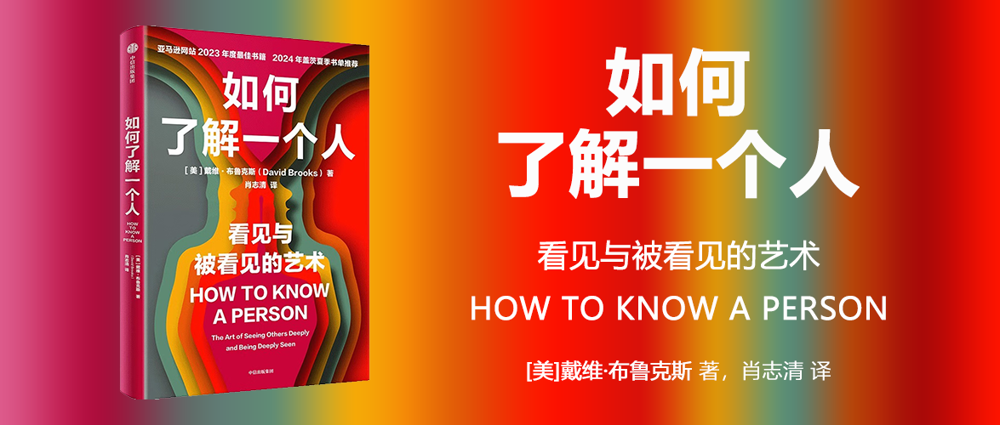

# 如何了解一个人

[美] 戴维布鲁克斯 著

肖志清 译

## 推荐序

- 她坚信，与他人建立联系是一种必须培养的技能，即便（或者说尤其是）对象是像我这样内向的孩子。

- 对话和社交技能不仅仅是与生俱来的特质——它们也可以被学习和改进。

- 书中一个强有力的观点是强调积极倾听的重要性，或者如布鲁克斯所说的“做一个积极的倾听者”。

- 甚至可以说要耗费大量的心力去倾听。”

- 当倾听一个人讲述他正在面对的困难或引以为豪的成就时，如果能带着同样的热情，倾听的结果就会发生巨大的改变。

- 人们通过与持不同观点的人争吵、谩骂他们，而不是试图理解他们，来获得满足感。

## 第1章 被看见的力量

- 家中有爱，我们只是没有表达而已。

- 说到情感的自然流露，我就像一颗卷心菜，把情感裹得严严实实。

- ，与人相处时更加坦诚，

- 年轻时，我希望自己知识渊博，但随着年岁渐长，我希望自己变得睿智。智者不仅知识渊博，还富有同情心，能够理解他人。他们对人生有着深刻的领悟。

- 年轻时，我希望自己知识渊博，但随着年岁渐长，我希望自己变得睿智。

- 社交媒体让我们的感官刺激代替了亲密关系。其结果是：处处有评判，却处处无理解。

- 人类需要得到认可，就如同需要食物和水一样。**最残酷的惩罚莫过于无视某人，让其感到自己无足轻重、可有可无。萧伯纳写道：“我们对同伴犯下的最大罪行并非对他们怀恨在心，而是冷漠待之。这便是人性丧失的本质。”这么做就等于在说：你不重要，你不存在。**

- 他们说有人发现了他们自己未曾发觉的天赋。

- 你如果想留住公司员工，就必须懂得如何让他们感受到你的赏识。

- 对于我们身上绽放的美丽和优点，往往别人比我们自己看得更清楚。被人看见也会激励个人不断成长。如果你将关注之光照在我身上，我也将绽放光彩。如果你看到了我身上的巨大潜力，我也会看到自己的巨大潜力。如果你能理解我为什么脆弱，在我生活雪上加霜时给予同情，那么我就更有可能经受住人生风雨的洗礼。

- 对于我们身上绽放的美丽和优点，往往别人比我们自己看得更清楚。

- 我开始理解你了。当然，我永远无法完全体验你所经历的世界，但我已经开始透过你的眼睛去看这个世界了。

- 每个人群都不乏贬低者（Diminishers）和照亮者（Illuminators）。贬低者让别人感到渺小和卑微，失去存在感。他们将别人视为可以利用的工具，而不是可以交心的朋友。他们抱有刻板成见，目中无人。他们过分沉湎于自我，别人都入不了他们的法眼。 	而照亮者对他人抱有持久的好奇心。他们通过培训或自学掌握了理解他人的技能。他们清楚自己期待的是什么，也懂得在合适的时机正确提问。他们用关爱照亮别人，让对方感觉自己更伟大、更深刻、更受尊重、更光彩夺目。

- 小说家E. M.福斯特的传记作者写道：“与福斯特交谈时你会被一种反向的个人魅力所吸引，一种强烈的被倾听之感让你不得不做最真实、最敏锐和最出色的自己。” 	[插图]想象一下，如果能成为那样的人该有多好。

- 也许你听说过温斯顿·丘吉尔的母亲珍妮·杰罗姆的故事。据说，她年轻时有一次与英国政治家威廉·格莱斯顿共进晚餐，离开时她觉得他是英国最聪明的人。后来，她又与格莱斯顿的劲敌本杰明·迪斯雷利共进晚餐，离开时她觉得自己是英国最聪明的人。成为像格莱斯顿那样的人固然不错，但更理想的是成为像迪斯雷利那样的人。

- 也许要真正了解另一个人，你必须对他们如何感知这个世界有所了解。要真正认识一个人，你得知道他们如何认识你。

## 第2章 视而不见

- 或许你觉得这很容易：睁开眼睛，聚焦目光，便可看见对方。但我们大多数人都有各种与生俱来的癖好，这些癖好妨碍了我们对他人的真正理解。打量后立马对他人进行评判只是贬低者的手段之一。这类人还有一些其他特征。 	自我中心主义：导致我们对他人视而不见的首要原因是我们过于以自我为中心，不愿意尝试去了解对方。我看不见你，因为我只关心我自己。我只想让你听我的想法，我只想讲我的故事来娱乐你。许多人无法跳出自己的视角，因为他们对其他人根本就不感兴趣。 	焦虑情绪：导致我们对他人视而不见的第二个原因是我们的脑海里充斥着太多的杂念，因此无法专心去思考别人在想些什么。我表现得好吗？我觉得这个人并不喜欢我。接下来我应该说些什么来显示我的聪明才智？恐惧是坦诚交流的大敌。 	天真现实主义：这一观念假设你眼前的世界是客观的，因此其他人看见的现实一定和你看到的一样。陷入天真现实主义的人会固执己见，他们无法理解其他人为何会持有截然不同的观点。你可能听过下面这个经典的故事。一个男人站在河边，对岸的女人对他喊道：“我怎么才能到河对岸去？”男人大声回答道：“你就在河对岸呀！”Epley, Mindwise, 55. 	小人物思维问题：芝加哥大学心理学家尼古拉斯·埃普利指出，我们的头脑中每天都会闪现许多想法，我们能够接触到自己所有的思想。但是，我们无法了解别人所有的想法，只能了解到他们大声表达出来的那一小部分观点。这就导致了一种信息不对称带来的错觉：我总是比别人更复杂全面，思想更深邃，性格更有趣，头脑更敏锐，眼界更长远。为了证明这一现象，埃普利问他商学院的学生为什么要经商。 	[插图]大家的回答都是“我想做有意义的事情”。当问到为什么学校里其他学生也要经商时，他们的回答变成了“为了钱”。因为在他们看来，其他人的动机和头脑都不如自己的。 	客观主义：客观是市场研究人员、民意调查人员和社会科学家所追求的。他们观察人们的行为，设计调查，收集数据。这是了解群体趋势特征的好方法，却是观察个体的糟糕方式。如果你采取这种超然、冷静、客观的立场，你很难看到对方最重要的部分，即她独特的主观能动性。她的想象力、情感、欲望、创造力、直觉、信仰、情绪和依恋构成了她独特的内心世界。 	在我的一生中，我读过数百本学术研究人员撰写的图书。他们开展了深入的研究，以更好地理解人性。这些图书给了我巨大的启发。我还阅读了数百本回忆录，并与数千人交谈过，了解他们独特的人生经历。在此，我想告诉大家，每个

- 人的独特人生远比学者和社会科学家对群体的总结更令人震惊和难以预测。你如果想了解人性，就必须关注个体的思想和情感，而不仅仅是整个群体的数据。 	本质主义：人分属不同的群体，人的自然倾向就是对自己进行概括。比如德国人井井有条，加州人悠闲自在。这些概括有时基于现实，但在某种程度上都是错误的，并且有害。由于未能认识到这一点，本质主义者倾向于依据刻板印象对大多数人进行分类。本质主义指的是某些群体实际上具有“本质”和永恒不变的性质。在本质主义者眼里，群体中的人具有比实际表现更多的相似之处。他们认为其他群体的人与“我们”之间的差异比实际差异更大。这类人常犯“堆砌”的错误，他们会基于先前的认知对对方的其他方面做出一系列假设。比如，如果某个人支持唐纳德·特朗普，那么他肯定也会有这样或那样的表现。 	静态思维：有些人对你形成了某种固定的认知，在某个时间点，这种认知甚至可能基本准确。然而，随着你的成长和巨大变化，这些人并未更新对你的认知，因此无法看到真实的你。例如，当你成年后回到父母身边居住时，你可能会发现他们仍然将你视为孩子，但你已不再是从前的那个小孩了。

## 第3章 照亮

- 在上一章中，我列举了一些对他人视而不见的原因：自我中心主义、焦虑情绪、客观主义、本质主义等等。在这一章中，我也会列举一些照亮者的特点。Frederick Buechner, The Remarkable Ordinary: How to Stop, Look, and Listen to Life (Grand Rapids, Mich.: Zondervan, 2017), 24. 	温柔关怀：如果你想看看如何照亮他人的范例，不妨回头看看罗杰斯先生过去是如何与孩子们互动的，看看电视剧《足球教练》里教练泰德·拉索是如何训练球员的，看看画家伦勃朗是如何描绘人的脸庞的。当你看着伦勃朗画的肖像画时，你看到的不仅是人物的疤痕和伤口，你也窥探到了人物的内心，看到了他们的尊严，看到了他们内心世界无法估量的复杂性。小说家弗雷德里克·布赫纳指出，伦勃朗画的并非都是令人惊艳的面孔。有时，画中人只是一位老爷爷或老太太，是那类你在路上碰到也不会多看一眼的人。但是，即使是最普通的面孔，“伦勃朗也能让我们惊奇地发现其非凡之处”。 	[插图] 	小说家奥尔加·托卡尔丘克在诺贝尔奖获奖感言中写道：“温柔是对另一个生命的深切情感关怀。它能察觉将我们联系在一起的纽带，能察觉我们之间的相似性和同一性。而文学建立在我们对任何生命的温柔之上。”看见他人亦是如此。 	乐于接纳：乐于接纳意味着你要克服不安全感和自我沉溺，向他人的经历敞开心扉。你要克制表达自己观点的冲动，不要问：“如果我站在你的角度，我会怎么想？”相反，你要耐心地做好准备，接受对方所提供的一切。正如神学家罗恩·威廉姆斯所说，我们希望我们的思想既松弛又专注，感官放松、开放、充满活力，眼睛充满柔情地注视对方。Zadie Smith, “Fascinated to Presume: In Defense of Fiction,” New York Review of Books, October 24, 2019. 	主动探索的好奇心：你要有一颗探险家的心。小说家扎迪·史密斯曾写到，当她还是小女孩的时候，她经常想如果在朋友家长大，那会是怎样的。“我进朋友家门时常常设想，如果我永远不离开这里，那会怎么样。”她写道，“也就是说，如果我是波兰人、加纳人、爱尔兰人或孟加拉人，如果我更富有或更贫穷，如果我说这些祷词或持有那些政治观点，那会怎么样。我是一个机会均等的窥探者。我想知道成为其他人是什么感觉。最重要的是，我想知道相信那些我原本不信的东西，会是什么感觉。” 	[插图]在看懂他人的艺术中训练自己的想象力，这是一种多么奇妙的方式。 	眼中有爱：我们出生在启蒙运动之后，生活在一种将理性与情感割裂开来的文化中。对我们来说，“了解”是一种智力活动。当我们想要“了解”某件事情时，我们收集相关数据，研究它、剖析它。Parker J. Palmer, To Know as We Are Known: Education as a Spiritual Journey (San Francisco: HarperCollins, 1993), 58. 	但是，许多文化和传统从未接受这种理性与情感分离的无稽之谈，因此它们从未将“了解”视为一种仅限于大脑、脱离身体的活动。例如，在《圣经》中，“了解”包括研究、发生关系、关心、立约、熟悉、理解名声等。 	[插图]上帝被描述为完美的全知者、万物的洞察者，他的眼睛不仅像科学家的一样客观，而且用带着完美的爱和恩泽的目光审视万物。 	《圣经》中人类角色的好坏往往是根据是否遵从这种有爱的认识方式来衡量的。许多人类角色往往无法真正认识对方。在“好撒玛利亚人”的寓言中，一个犹太人被强盗打劫，受了重伤，躺在路边，奄奄一息。至少有两个犹太人与他擦肩而过，其中一个还是祭司。但他们都径直走到街的另一边，没有采取任何行动去帮助他，只是冷静而理智地看着他。只有来自被憎恨的异邦民族的撒玛利亚人，真正看到了伤者。只有他深入了解了伤者的遭遇，并真正给予了他帮助。在《圣经》的许多故事中，有许多人只是眼睛看见而实际上未真正看见。这些认识的失败不是因为他们智商不够高，而是因为他们没有用心。 	不吝付出：1939年，德国犹太人路德维希·古特曼医生逃离纳粹德国来到英国，在这里的某家医院任职。这家医院治疗截瘫患者，其中大部分是在战争中受伤的士兵。古特曼刚来那会儿，医院对待这些病人的做法是注射大量镇静剂，让他们只能躺在床上。但古特曼并没有这样做。相反，他减少了镇静剂的用量，强迫病人下床活动，并向他们扔球，和他们互动，目的就是让病人活动起来。结果，古特曼被传唤到了法庭，他的方法受到了同行质疑。 	“这些都是奄奄一息的残疾人，”一位医生断言，继而问道，“你以为他们是谁？” 	古特曼回答说：“他们是最棒的人。” 	正是他的不吝付出精神改变了他对这些人的定义。古特曼继续组织截瘫患者比赛，先是在医院，然后范围扩大到全国。1960年，残奥会由此诞生。Nigel Hamilton, How to Do Biography: A Primer (Cambridge,Mass.: Harvard University Press, 2008), 39. 	看见整体：误解他人的一大原因就是只看到对方的一部分。有些医生只看到病人的身体，有些雇主只看到员工的工作效率，我们必须抵制一切以这种方式把人简化的冲动。巴勃罗·毕加索的传记作者、艺术史学家约翰·理查森曾被问及毕加索是不是一个厌恶女性的坏人。理查森绝不会让自己的研究对象被过度简化，也不会抹去他的矛盾性。因此，他回答说：“那简直是一派胡言。你说他是一个卑鄙的浑蛋，但他也是一个富有同情心、温柔可爱、天使一般的人。你说他吝啬，但他也慷慨得令人难以置信。你说他放荡不羁，但他也有传统中产阶级保守的一面。无论你如何评价他，他的另一面同样是真实存在的。我认为，毕加索就是矛盾的集合体。” 	[插图]我们不也是一样吗？ 	伟大的俄国小说家列夫·托尔斯泰曾写道：Leo Tolstoy, Resurrection, trans. Aline P. Delano (New York: Grosset & Dunlap, 1911), 59. 	最常见、最普遍接受的一种错觉是，每个人都可以用一些特定的词来描述，比如善良、邪恶、愚蠢、精力充沛、冷漠等等。然而，事实并非如此。我们可以说，一个人善良的时候多于残忍的时候，聪明的时候多于愚蠢的时候，精力充沛的时候多于麻木不仁的时候，反之亦然。但是，说一个人善良或聪明，说另一个人邪恶或愚蠢，那是绝对不正确的。然而，我们总是以这种方式对人类进行分类。这种做法大错特错。人就像河流：所有河流的水都是一样的，但每条河流总会在某些地方狭窄，在另一些地方宽阔；在这里湍急，在那里静止；在这里清澈，在那里浑浊；在这里寒冷，在那里温暖。人也是如此。每个人的身上都孕育着人类各种品质的萌芽，有时表现出这一种，有时又表现出另一种，他常常与先前的自己完全不同，但依然是同一个人。

- 我认为，强调抽象的普遍原则并无不妥，但它有些缺乏人情味，也脱离了现实语境。它没有关注到独特的个体应该如何与另一个独特的个体相遇。

- 如何了解一个人

- 皮弗认为，在治疗过程中，不必说个不停。“灵感总是悄然而至，”她写道，“它会轻轻地敲门，如果我们不开门，它便会主动离开。”

## 第4章 陪伴

- 艾斯利将这段经历写进了散文《河流的流动》（The Flow of the River）。在这篇散文里，他不仅描述了普拉特河，还描绘了自己与普拉特河融为一体的故事。他说自己意识到与所有生物、所有自然都存在联系，这是一种开放的思想。那一刻，艾斯利不是在普拉特河里游泳，也不是在调查普拉特河，而是在陪伴普拉特河。

- 你的生活有90%的时间都在完成日常琐事。或许是在开会，或许是在去超市的路上，或许是送孩子上学，顺便与其他家长闲聊。这个时候，你周围都会有其他人。然而，在这些平常的时刻，你们并不会深刻地凝视对方，也不会建立深刻紧密的关系。你们只是在一起做着这些事情，虽然没有面对面交流，但肩并肩地互相陪伴。

- 当初次相识时，不要试图立刻洞察对方的内心，最好先找一些共同话题。问问天气如何，问问对方是否喜欢泰勒·斯威夫特，是否喜欢园艺，是否喜欢电视剧《王冠》。记住，你不是在调查他，而是在适应他。通过闲聊、共同活动，你的思维会不知不觉地与他同步。渐渐地，你们会感知对方的能量、气质和行为举止。你们会适应对方的步调和情绪，然后形成微妙的默契。想要更深入地了解对方，这种默契是至关重要的。

- 在了解一个人的过程中，闲聊和轻松相处往往被严重低估。有时，观察对方与服务员的互动，比起提出深奥的人生哲学问题，更有助于你了解他。我发现，即使你已经很了解对方，如果不经常聊些琐事，你们也很难聊起一些重要的话题。

- 善于陪伴的人会放慢社交生活的节奏。我认识一对非常重视友谊的夫妇，在他们看来，朋友是让人愿意与其慢慢相处、一起消磨时光的人。他们能让你在用餐结束后，仍然想在餐桌旁坐一会儿，或者在泳池边的椅子上停留片刻，让一切自然发生，让彼此的关系逐渐加深。能够让他人愿意与自己慢慢相处，这是一种了不起的才能。

- 陪伴是了解一个人的必经阶段，因为它温和而谨慎。正如D. H.劳伦斯所言：D. H. Lawrence, Lady Chatterley’s Lover (New York: Penguin Books,2006), 323. 	无论谁渴望生命，都必须温柔地走向生命，就像轻轻地走向树下依偎在一起的母鹿和幼鹿一样。一旦出现暴力的姿态和强烈的自我主张，生命就会消失……但只要内心平静，摒弃自我主张，充分体验内在真实的自我，那么，一个人便能接近另一个人，从而体验生命的细腻之美，也就是那种心灵的“触动”。

- 陪伴的第二个特质是游戏性。

- 陪伴的第三个特质是以他者为中心。

- 我希望我也能像优秀的伴奏者一样，明白每个人都在自己的位置上，在自己的朝圣路上，而我们的工作就是遇见他们，帮助他们规划自己的路线。我希望我当时能遵循这一建议：让他人自主发展。

- 教皇保罗六世一语中的：“现代人更愿意听见证人而不是教师的话，如果他听教师的话，那是因为教师本身就是见证人。”

- 最后，善于陪伴的人懂得出现的艺术。他们会在婚礼和葬礼上出现，会在对方悲伤、被解雇、遭受挫折、蒙受羞辱的时候出现。当对方正在经历艰难时刻，你不要说些大道理，而是要陪伴在他身旁，用心感受那一刻对方正在经历的事情。

- 散文家兼诗人大卫·惠特在《慰藉之书》一书中指出，友谊的终极试金石“不是进步，既不是对方进步，也不是自己进步。友谊的终极试金石是见证，是被某人看见的特权，也是被授予看见对方本质的同等特权，是与对方同行、信任对方，有时是相互陪伴走过一段尽管短暂却无法独自走过的旅程”。

## 第5章 何为“人”？

- 如果你想更好地观察和理解他人，你就必须知道你在观察的是谁。你得搞清楚人的定义是什么。

- 如果我想了解你，我至少得了解你是如何看待这个世界的。我想看看你如何构建自己的现实，如何创造你人生的意义。至少我要走出我的视角，进入你的视角。

## 第6章 深度对话

- 有些人认为出色的交谈者一定会讲风趣幽默的故事，但那是所谓的讲故事高手，并非出色的交谈者。还有些人认为出色的交谈者能够对各种话题提出深刻独到的见解，不过那是演讲者，也不是我所说的交谈者。出色的交谈者是能够促进双向交流的大师，他们能够让人们增进对彼此的理解。

- 精彩的交谈并非简单地彼此陈述表面观点，这种肤浅的互动只能称作糟糕的交谈。精彩的交谈应该是一次共同探索的旅程：一个人提出初步想法，另一个人抓住其中核心，并进行深入挖掘和拓展，最终提出自己的见解，引发下一个人的回应。

- 或许是我性格的原因，我常常成为记者卡尔文·特里林所说的“无聊炸弹”的轰炸对象。这些人似乎将交谈视为单向灌输他们思想的机会。因此，我下定决心，如果有人在给我打电话或者请我喝咖啡时只是单向地表达自己的观点，对我的想法几乎没有任何兴趣，那么我们下次就不必再相处了。

- 做一个积极的倾听者。当他人在说话时，要积极认真地去倾听，甚至可以说要耗费大量的心力去倾听。

- 从熟悉的事物入手。你或许认为人们喜欢听到和谈论新奇陌生的事物。实则不然，人们更喜欢谈论他们熟悉的电影和比赛。社会心理学家格斯·库尼和其他学者的研究发现，我们交谈时会出现一种“新奇惩罚”现象。人们很难想象陌生的事物，也很难对其产生浓厚兴趣，相反，他们更倾向于谈论熟悉的事物。为了确保交谈顺畅，你需要挖掘对方最感兴趣的话题。

- 出色的交谈者会要求对话者讲述具体的事件或经历，然后再逐步展开。他们不仅想讨论事件的发生，还渴望了解你在那个时刻的内心感受。他们想知道，当你的老板解雇你时，你的第一反应是什么？是“我要怎么告诉家人”吗？你是感到恐惧、羞愧，还是接受了这个事实？

- 出色的交谈者会控制自己的急躁情绪，因为他知道倾听是为了学习，而不是为了回应。

- 巧用循环式反应。心理学中有一个概念叫作循环式反应，指的是重复他人说过的话语，以确保准确理解对方想要表达的意思。专家之所以推荐这种有点儿笨拙的做法，是因为人们往往会认为自己表达得比实际情况更清晰。有人可能会说“我妈妈真是个难缠的人”这样一句话，然后自以为对方完全明白她在说什么。

- 一个人面临困境或关键抉择，而另一个人则陪伴着他一起思考，共同面对。 	在这种情况下，出色的交谈者会充当起助产士的角色。助产士的职责不是亲自分娩，而是协助他人完成分娩。在对话中，助产士不会以自己的见解来主导对话，而是会接纳对方的观点，并在此基础上进一步补充完善。助产士会让对方感到安全，并鼓励对方继续深入思考。

- 正如神经科学家莉莎·费德曼·巴瑞特所言：“对朋友的经历保持好奇心比争辩对错更重要。”

- 不要成为话题王。当有人告诉你他们与十几岁的儿子相处困难时，不要马上回应：​“我完全理解你的感受。我和我的儿子史蒂文也有很大的问题。​”你可能认为你在努力建立一种共鸣，但其实你只是把注意力转移到了自己身上。你实际是在说：​“我对你的问题并不感兴趣，让我来说说我的问题吧，我觉得它更吸引人！”你如果想在情感上建立共鸣，试着在谈论自己之前先倾听对方的经历和感受。

## 第7章 提出正确的问题

- “你唯一可以确定的是，每个人都逃不过高中生活。高中时恐惧的，无论是什么，你如今依旧会恐惧。”戴维从一个人的弱点入手，试图看到这个人的全貌。

- 小孩儿不怕提出直率的问题。但在后儿童期或青春期的某个阶段，许多人开始回避亲密关系的话题。我认为其中的原因在于社会传递出的信息：我们不应该展露情绪，也不应该触及个人隐私；或者说，我们如果向世界展示真实的自我，可能就无法得到他人的喜爱。提出好问题可能会暴露我们脆弱的一面，同时等于承认自己孤陋寡闻。一个缺乏安全感、开启自我保护机制的世界是一个提出更少问题的世界。

- 正如心理学家尼古拉斯·埃普利所言，换位思考不那么可靠，倾听和接受他人的视角更为有效。如果我了解你，这并不是因为我拥有窥探你灵魂的神奇能力，而是因为我具备提问的技巧，让你有机会告诉我你是谁。

- 最糟糕的问题是那些带有评判色彩的问题，比如：你是哪所大学毕业的？你住在哪个社区？你从事什么工作？这些问题暗示着一种高高在上的态度，试图对对方进行评判。

- 封闭式问题同样不可取。

- 另一种让对话无法有效展开的方式是提出模糊的问题，比如：​“最近怎么样？​”或者“有什么事？​”这些问题根本无法得到有意义的回答，实际上表达的是：​“我在向你问好，但实际上我并不希望你真的回答。​”

- 谦逊的问题是开放式的。这些问题鼓励对方掌握主动权，将谈话引向他们希望的发展方向。

- 你一直在拖延或拒绝面对的是什么？有什么事情曾经让你深信不疑，但现在你却改变了看法？你是否还在拒绝原谅某人或某些事情？你是如何推动问题的解决的？你是否有意识地浪费或忽视自己独特的才能？

- 你生活中在哪些方面表现出色？ 	你觉得自己最有自信的是什么？ 	在5种感官中，你认为自己最灵敏的是哪一种？ 	你有没有过一人独处却不觉得孤单的时候？ 	随着年龄的增长，你对什么事情有了更清晰的认识或理解？

- 如果你恭恭敬敬地询问人们的经历，他们的回答之坦率会让你大吃一惊。斯塔兹·特克尔是一位记者，他在芝加哥的漫长职业生涯中收集了许多口述历史。他会向人们提出一些深刻的问题，然后坐下来，听他们娓娓道来。他曾经说过：“倾听、倾听、倾听。如果你这样做了，人们自然会开口。他们总会开口。为什么呢？因为在他们的一生中，从来没有人真正倾听过他们的声音，也许他们自己都从未倾听过自己的声音。”

## 第8章 “失明”盛行

- 频繁的孤独和被忽视会使人变得敏感多疑。他们可能会开始有意或无意地冒犯他人，他们害怕与他人建立亲密关系，但实际上这正是他们最需要的。自我厌恶和自我怀疑情绪不断加剧。毕竟，意识到自己不值得别人关注是非常羞耻的。

- 正如范德考克在书中所写：“被生活中重要的人看到和听到会让我们感到内心平静和安全，若被人忽视或否定，就可能触发愤怒和崩溃的情绪。”

- 因此，孤独往往会导致刻薄。俗话说，痛苦如果不被转化就会被传染。

- 健康的社会带来分配政治，即社会资源应该如何分配。不幸福的社会产生的是认同政治。如今的政治运动主要是由个人或群体因为社会不尊重、不认可他们而产生的不满情绪所推动。政治人物和媒体人的目的就是制造一些事件，让己方在情感上得到肯定，让另一方在情感上受到羞辱。实施“认同政治”的人并不是要制定国内政策，也不是要解决这样或那样的社会弊病，他只是想要确认自己的身份，获得社会地位和知名度，找到一种自我欣赏的方式。 	但政治上的认可实际上并不能让你自动融入群体，建立联系。人们虽加入党派阵营，但实际上并没有相互见面、为彼此服务、成为朋友。政治不会让你成为一个更好的人，政治关乎的是外在的煽动性，而非内在的凝聚力。政治也不会使人变得人性化。寻求通过政治来摆脱悲伤、孤独和社会反常状态，只会使人陷入一个以虐待狂式的统治为特征的世界。你可能会试图逃离一个与世隔绝、毫无道德的世界，却发现自己已身处文化战争那极具破坏力的纷争之中。 	最终，社会充斥着悲伤和非人化，这些都将演变成暴力行为，包括情感暴力和身体暴力。看看那些犯下大规模枪击案件的人，他们年纪轻轻却做出如此骇人听闻的行为。他们如同幽灵一般，在学校里，没有人了解他们。后来，记者采访他们的老师，老师也不记得他们是谁了。这些年轻人往往没有社交能力。“为什么没有人喜欢我，”正如一位研究人员所说，“他们不是孤独者，而是失败的加入者。”

- 我知道“道德培养”这个词听起来可能有些古板，但它实际上是与3件简单而实际的事情有关。第一，它有助于人们学会如何克制自私自利的行为，如何关心爱护他人。第二，它有助于人们找到目标，让生活变得稳定、有方向、有意义。第三，它教会人们基本的社交和情感技能，让人们能够善待和体贴身边的人。

- 谷歌的图书词频统计器（Ngram Viewer）可以统计一个词在出版图书中的使用频率。20世纪以来，与道德相关的词汇的使用率急剧下降：“勇敢”下降了66%，“感恩”下降了49%，“谦逊”下降了52%。

## 第9章 艰难对话

- 我的第一个重要领悟是，在展开任何艰难对话之前，我们必须先审视对话的环境和背景，然后再深入对话内容。

- 对社会主流群体或多数群体的成员来说，他人对你的看法与你对自己的看法通常相吻合。然而，对来自边缘化群体或历史上曾受压迫群体的人来说，他们对自身的认知与外界对他们的认知之间往往存在着巨大的鸿沟。因此，在展开艰难对话时，每个人都必须意识到这些动态变化。

- 我的第二个重要领悟源自《关键对话》一书的作者。他们指出，每次对话都在两个层面上展开：正式对话和实际对话。正式对话即我们口头上所表达的话语，涉及我们名义上讨论的任何主题，无论是政治、经济、职场问题，还是其他任何话题。而实际对话则发生在潜在情绪的起伏之中，这些情绪会在我们交谈时传递出来。你的每一句评论让我感觉安全或受到威胁。而我的每一句回应，都在向你传递尊重或不尊重的信息。我们的每一句评论都在揭示各自的意图：这就是我告诉你这些的原因，也是为什么这对我很重要。正是这些潜在的情绪交锋决定了对话的成败。

- 我们应该摒弃这种念头。当有人开始倾诉他们的痛苦，表达他们感受到的被排斥、背叛或冤枉的情绪时，我们应当停下脚步，倾听他们的心声。哪怕你认为他们的痛苦可能带有虚假或夸大的成分，也不应急于将对话拉回自己的框架中。此时，你的首要任务是站在对方的立场上，尝试理解他们眼中的世界。接下来，你需要鼓励他们更深入地阐述自己的观点，比如，你可以这样提问：“我想多听听你的想法，我刚才错过什么了吗？”这种好奇心可以驱使我们即使面对压力和困境也能继续探索。

- 耶路撒冷希伯来大学迈卡·古德曼教授一语中的：“精彩的对话发生在那些认为对方错了的人之间，而糟糕的对话则发生在那些认为对方有问题的人之间。”

- 这些年来，我逐渐认识到，艰难对话之所以艰难，是因为处于不同生活环境中的人构建了完全不同的现实世界。这种差异不仅仅体现在对同一世界的不同理解上，实际上他们看到的是两个截然不同的世界。

- 古罗马剧作家泰伦提乌斯所宣扬的卓越人文信条：“我是人类，凡属人类的，我皆能感同身受。”

## 第10章 如何帮助处于绝望中的朋友？

- 演员斯蒂芬·弗雷曾写道：​“如果你身边有正在与抑郁症抗争的朋友，请记住永远不要问他们为什么会陷入痛苦。在他们走出阴霾的过程中，陪在他们身边，给予支持。做抑郁症患者的朋友并非易事，但你的陪伴与支持无疑会为他们带来最温暖、最真挚的关怀。这不仅是你能为他们提供的最大帮助，也是你展现人性善良与高尚的最佳方式。​”

- 患抑郁症就像是我们用来感知现实的仪器出现了故障。

- 专家建议，你如果认识抑郁症患者，可以明确地询问他们对自杀的想法。专家强调，这样做并不是将自杀的想法强加给他们。事实上，很多时候，他们可能已经在内心深处思考过这个问题了。

- 如果再次遇到类似的情况，你不必试图劝导对方走出抑郁。表达出对他们所遭受痛苦的理解；营造一种温馨的氛围，让他们能够敞开心扉，分享自己的经历和感受；给予他们一种被理解的安慰，让他们感受到我们的关心和关注，这一切便已足够。

## 第11章 共情的艺术

- 当成年后你与某人建立了深厚的关系时，你通常能够感知到他们在成长过程中是如何被养育的，接受了怎样的教育和引导。你能从一些人当下的不安全感中看出，他们小时候一定被贬低和批评过。你能从一些人对被抛弃的恐惧中看到，他们年幼时一定体验过被抛弃的感觉。另一方面，当你遇到那些相信世界安全可靠，期待别人会对他们报以微笑的人时，你能感受到他们的童年一定充满了温暖和爱。

- 该研究的负责人一度想知道，为什么研究中的一些人在二战期间晋升为军官，而其他人却没能做到。 [插图]研究人员发现，与战时取得成功相关的首要因素并非智商、体能或社会经济背景，而是这些人家庭的整体温暖程度。那些在童年时期深受父母关爱的人，也能够关心爱护自己手下的士兵。 [插图]Vaillant, Triumphs of Experience, 134.在这项研究中，与父亲关系融洽的男性在生活中更能享受假期，更具幽默感，而且退休生活也更加幸福。相较于智商，温暖的童年环境也能更好地预测一个人成年后的社会流动性。 [插图]

- 要真正了解一个人，就必须了解他们童年的挣扎和幸福，以及相伴一生的防御机制。

- 回避情感和人际关系曾带给我伤害，所以我要尽量减少情感和人际关系。回避型的人在肤浅的对话中感到最自在。

- 他们需要朋友提醒：​“你生命中最重要的东西就在前方，而不是在身后。我为认识你感到骄傲，为你已经取得和将要取得的一切成就感到骄傲。​”他们需要能够与其共情的人。

- 共情能力至少包括3种相关技能。第一种是镜映技能（mirroring）​。这是指准确捕捉眼前人情绪状态的能力。

- 情绪向来臭名昭著。人们认为情绪是一种原始力量，会让人卷入其中，迷失自我。几个世纪以来，许多哲学家都认为理性与情绪相互独立—理性是冷静谨慎的战车驭手，而情绪是那桀骜难驯的骏马。

- 第二种共情技能是心智化（mentalizing）​。

- 第三种共情技能是关怀（caring）​。

- 如果说“心智化”是我将自己的经历投射到你身上，那么“关怀”则需要我从自己的经历中走出来，理解在那种情况下你的需求可能与我的截然不同。这并不是一件容易的事情。在这个世界上，友善的人比比皆是，真正善良的人却少之又少。

- 当你面对癌症患者时，向对方表达你为他感到难过似乎是在尽力共情。我的朋友凯特·鲍勒实际上也是一名癌症患者，她曾说，真正能表达同理心的人是那些“给予拥抱、赞美，而不会让你感觉在致悼词的人；那些送来与癌症无关的礼物的人；那些只想让你快乐，而不是试图去治愈你的人；还有那些能够让你看到今天依然美好，总是有更多乐趣等待你发现的人”​。 [插图]这才是真正的关怀。

- 情绪专家马克·布雷克特设计了一种工具来提高人的情绪颗粒度，他称之为“情绪晴雨表”​（mood meter）​。 [插图]该工具基于这样的理念：情绪可以通过两个核心维度进行划分，即能量和愉悦。布雷克特绘制了一幅包含4个象限的图表。右上象限包含高愉悦度、高能量的情绪，如幸福、快乐、兴奋。右下象限包含高愉悦度、低能量的情绪，如满足、平静、自在。左上象限包含低愉悦度、高能量的情绪，如愤怒、沮丧、恐惧。左下象限包含低愉悦度、低能量的情绪，如悲伤、冷漠。

- 最近，布雷克特又带领其团队设计出了测量不同工作场所中上司情商的方法。 [插图]结果发现，上司情商得分较低的员工表示，他们仅约有25%的时间感觉受到激励；而上司情商得分较高的员工表示，他们约有75%的时间感觉受到激励。换句话说，善于识别和表达情绪的人会对周围人产生巨大影响。

- 库克拉认识一位妇女，由于脑部受伤，她有时会走路不稳、摔倒在地。这种时候人们会争先恐后地把她扶起来。她告诉库克拉：​“我觉得人们急着把我扶起来，是因为他们看到一个成年人躺在地上，心里很不安。但我真正需要的是有人陪我一起躺在地上。​” [插图]有时候，你需要做的就是和别人一起躺在地上。

- 理性的头脑无法说服感性的身体脱离它所经历的现实，因此身体必须亲身体验不同的现实。有共情能力的人能够提供这种身体层面的陪伴。在我们的谈话中，哥伦比亚大学的医生兼研究员玛莎·韦尔奇强调了“共同调节”的力量。当两个人彼此亲近又互相信任时，他们可能只是边喝咖啡边聊天，也可能是拥抱在一起，但身体与身体之间会传递一些信息。他们能够让对方的身体平静下来，共同调节心率，让“心脏受到抚慰”​，并产生韦尔奇所说的“更高的迷走神经张力”—这是一种综合状态，当肠道和内脏都感到安全平静时就会产生这种状态。

## 第12章 你的苦难如何塑造了你？

- 那些经历了永久性创伤的人，会努力将所承受的痛苦融入现有的模式。 [插图]而那些持续成长的人，则会努力适应所发生的一切，进而塑造出全新的模式。

- 一两个月后，母亲决定带着全家人前往百慕大生活。然而，祖母并不同意他们去，坚持让他们“留下来面对现实”​。几十年后，布赫纳对于祖母的决定有了更深的理解。他写道：​“面对现实的冷酷无情，我们不能选择逃避。如果我们闭上眼睛不去正视它，黑暗的力量将会从背后乘虚而入，在我们毫无防备之时发起突然袭击。​” [插图]另一方面，他们非常喜欢百慕大，那里的环境在某种程度上确实很治愈。

- 几十年后，布赫纳深刻地领悟到：​“用坚如钢铁的心灵来抵御现实世界的残酷所带来的麻烦是，这种钢铁般的保护也可能使我们的内心变得封闭，无法接受源自生命本身的神圣力量的改变。​” [插图]

- 这个挖掘过程是如何进行的？我们如何帮助彼此回到过去，重塑我们的生活故事？我们可以一起做一些练习。第一项练习是互相提问。

- 第二项练习是尝试“这就是你的生活”这个游戏。

- 第三项练习是“填写人生年表”​，你需要与朋友一同逐年回顾他生命中的各个阶段。

- 第四项练习是“心语写作”​。

- 第五项练习，也是我最喜欢的一个环节，是暂时放下所有的自我意识，与朋友进行一场真挚的对话。

## 第13章 性格：踏入房间时，你带来何种能量？

- 在职场环境中，宜人性具有正反两面的双重属性。尽管高宜人性的人通常更受欢迎，但他们并非总能获得晋升或高薪的机会。有时候，人们会错误地认为高宜人性的人缺乏决断力，无法做出必要但可能不受欢迎的决定。事实上，那些在宜人性方面得分较低的人往往更容易被任命为首席执行官，成为高收入人士。

- 遗传学家兼精神病学家丹妮尔·迪克认为，父母了解孩子的性格特征至关重要，这是因为没有所谓的正确的育儿方式。 	[插图]唯一正确的育儿方式，是父母能够深入了解和接纳孩子的个性，同时，也要反思并调整自己的教养方式，使它与孩子的个性相契合。

## 第14章 人生任务

- 为了培养能动性，人们形成了凯根所说的至尊意识。拥有这种心态的人总是以自我为中心，认为自身的欲望和利益高于一切。他们认为全世界都围着自己转，只能体现自己的价值。这样的人可能也耽于竞争。他们渴望赢得赞美、斩获荣誉，因此无论是在体育、学业、音乐还是在其他方面，都渴望得到他人对自己价值的肯定。在约翰·诺尔斯的小说《一个人的和平》中，叙述者指出：​“在德文男子预备中学，我们之间的关系几乎都是建立在竞争之上的。​”虽然我们能够容忍青少年时期的以自我为中心，但这种至尊意识有时会一直持续到成年。如果一个成年人无法摆脱这种心态，那么生活对他而言，无异于赢得各种毫不相关的比赛。无论是在商业领域、篮球场还是在政治舞台上，他都渴望成为胜利者，他敏感的自负心态使他在面对任何不尊重时都会做出强烈的反应。

- 在人际交往中，人们很快就会形成小群体，并对彼此的社会地位进行考量。人际交往的终极问题是：你喜欢我吗？在这一点上，自我评价还不足以决定自我价值，其他人的意见仍然占据主导，舆论是一个需要努力取悦的贪婪的主人。

- 在生成性人生任务中，人们努力寻找为社会服务的途径。埃里克森认为，人要么具有创生能力，要么停滞不前。范伦特将创生能力定义为“培养和指引下一代的能力”​。 [插图]我喜欢这个定义，因为它强调了人们通常会在人生的两个不同阶段去完成生成性任务。首先，为人父为人母之时，父母往往教会孩子如何给予爱；其次，到中老年时，即父母成为孩子的人生导师时，他们会秉持一种“礼物”逻辑（​“我如何才能回馈世界”​）​，用它来取代职业巩固时期的精英逻辑。

- 生成性领导者会为下属服务，拓展他们的眼界，帮助他们成为更好的自己。

- 具有生成性思维的人往往会肩负起守护者的使命。无论是在公司、社区、学校还是家庭，他们常常担任领导者或服务者的角色，对接任的机构怀有深深的敬意。他们认为自己既然接受了重托，获得了珍贵的信任，就有责任妥善管理，使机构变得更好。这些人看重的不是从机构中得到了什么，而是为机构付出了什么。

- 拥有生成性思维的人能给予我们3种珍贵的礼物。其一是赞美，即能够看到他人的可贵之处。其二是耐心，即理解人都在不断地成长。其三是陪伴。我认识一个人，他曾在公众面前受过羞辱。在随后的两年里，他的一位朋友每周日晚都带他外出共进晚餐，这便是“生成性行为”的最佳诠释。拥有这种意识的人可能会孤独。作为“编织：社会结构项目”​（Weave: The Social Fabric Project）的联合创始人，我采访了数百名社区工作者—他们负责管理着青年项目、食物赈济处、流浪者之家等。他们因为能够帮助他人而感到满足。然而，他们经常发现，在他们自己需要帮助时，并没有人伸出援手，尤其是在他们感到虚弱和疲惫不堪的时候。在任何家庭或组织中，即使是看起来最坚强的人也会感到孤独。我还想说，这些人甚至可能比初出茅庐的年轻人还要雄心勃勃。他们经常说：​“需要我的地方很多，我不能辜负大家的期望。​”以我的经验来看，无私的人和自私的人都容易倦怠，或许前者更容易如此。

## 第15章 人生故事

- 2026/02/24发表想法

这让我想起了两件事：1、在某次上海飞往重庆的飞机上，隔壁两个陌生人（一个大叔和一个小姑娘）搭讪，这在当今社会显得非常不寻常。在他们一来一回很多次后，最终在下飞机前，小姑娘主动加了大叔的微信，友好地表示到达重庆后，可以随时和他咨询旅行计划。2、就在昨天（2026/02/22），我在回京的同一列高铁车厢内偶遇了我的小学同学，其实我们小学前后桌，关系也很好，但是毕竟几十年没有怎么交流，双方都有些拘谨，简单打了个招呼，他就去了洗手间，隔了很久（他在洗手间刷了很久手机）我去洗手间，真是特别巧，第二次我们又相遇了。我停下来没有进，他走了几步又退回来，和我站在一起，但是两人没有说什么话。他示意我赶紧去上洗手间吧，我也不知该如何回复，我也就去了洗手间。他离开了，但是在回座位的途中，我发现他的座位在离洗手间不远的位置。回到座位后，过了20分钟左右，高铁就到站了，我有一念之间想说请他在火车站简单吃个饭叙叙旧，但是我迟疑了，我站在原地，没有靠近他，但是内心里又很期待，他也留下来和我打个招呼，我暗自告诉自己，如果他停下来和我说句话，我就邀请他共进晚餐。但是遗憾的是，他匆匆离开了，似乎有点社交逃亡的感觉，他消失在茫茫人海之中。这是我们这么多年来回京，第二次在高铁上偶遇，第一次是不同的车厢，这一次是相同的。虽然大家在人生路径上已没有交集，但是作为异乡来客，其实我们也可以有很好的友谊。期待下一次偶遇，或者明年的返乡，我们相约而行……

原文：自从埃普利向我介绍了他的研究之后，我更愿意和陌生人交流了，不论是在飞机、火车上，还是在酒吧里。我因此收获了许多难忘的经历，这些经历是不会在戴着耳机的情况下发生的。在写下这些文字的几天前，我正好在从纽约肯尼迪机场飞往华盛顿特区里根机场的飞机上，坐在我旁边的是一位老先生。我没有像往常一样埋头看书，而是开始和他攀谈，问他从哪里来，接着又问了他的生活情况。

- 费尼霍指出，我们的内部言语往往由头脑中不同角色的对话构成。通过要求受访者描述他们脑海中对话角色的形象，波兰研究人员玛尔歌泽塔·普哈尔斯卡-瓦西尔发现，人们内心的声音通常由4类角色发出：忠实的朋友（指出你个人优势的人）​、矛盾的父母（提出关爱式批评的人）​、骄傲的对手（纠缠不休、逼你变得更成功的人）和无助的孩子（时常自怜自哀的人）​。 [插图]所以，当我在听某个人讲述他们的故事时，我也会问自己，这个人的脑袋里有个什么角色？这是我思考的第一个问题。他的语气是自信的、疲惫的、懊悔的，还是充满期待的？

- 我思考的第二个问题是：谁是故事里的主角？

- 当有人向我讲述他的故事时，我会自问，他塑造的是哪一种意象？这样做往往很有帮助。正如麦克亚当斯所述：​“意象表达了我们最珍视的愿望和目标。​” 

- 我思考的第三个问题是：故事的情节是什么？

- 我思考的第四个问题是：这个讲述者有多可靠？

- 神话学家约瑟夫·坎贝尔曾写道：​“描述一个人的唯一方法就是描述他的不完美之处。​” [插图]这句话同样适用于自我描述。

- 最后，我会关注叙事的灵活性。

- 最近，我去医院探望一位朋友，他身患癌症，生命只剩一周。我无须引导，因为他自己正在努力回忆他的一生。他大多数时间都在回忆人们对他的善举，而他自觉于心有愧。他告诉我，他经常在半夜醒来，想起母亲。他惊愕地感叹：​“这种亲情纽带真是强大啊。​”谈及担任要职时的经历，他懊悔不已，因为那段时间他对身边的人傲慢无情。回首过往，在每次人生转折的关键时刻他都充满感激之情。当我们怀着真诚和同情之心回顾过去，讲述自己的人生故事时，就如同神学家H.理查德·尼布尔所言：​“我们将领悟那些铭记于心的经历，记起被遗忘的生活碎片，以前看似陌生的人生场景也会变得熟悉。​”

- 你要是讲一大堆空洞的口号，我会听不进去。但如果你更为坦诚地站在我面前，展示你的缺点和才华，那么你将感受到我尊重和友善的目光，而这将促使你不断成长。每个人都有自己的人生模式，有一条贯穿始终的故事线。当有人给我们机会分享自己的经历时，我们便能发现这个故事

## 第16章 祖先印记

- 她的父母因她的坚定自信而争吵不休。母亲经常对她说：​“向着太阳跳吧。我们或许跳不到太阳上，但至少可以离开地面。​” [插图]与此同时，她的父亲则极力阻止她去更大的世界惹麻烦。​“他预言有可怕的事情会发生在我身上，​”她后来回忆说，​“白人是不会容忍我的自信的。我还没长大就会被绞死。​”

- 我们很多人都有相似的经历。在这个世界上，总有一个地方是神圣的，那便是你的故乡，那个你始终未曾真正离开的地方。每当回忆起故乡或邻里乡亲时，你便会记起那片沃土和山脉，拂过庄稼的一阵微风，或给小镇带来工业气息的工厂。在你童年的时光里，这幅小小的戏剧性全景图中的人物和场景就是你生活的全部。

- 我们至少经历过两次童年。第一次我们带着惊奇的目光度过童年；第二次，我们不得不重温童年，以理解这一切意味着什么。成年后，艺术家们往往会回到童年的家园，那里是精神养料的源泉，他们在此寻找自己会是现在这个样子的原因。

- 托妮·莫里森是这样说的：​“所有的水都有完美的记忆，永远都在试图回到原来的地方。作家也是如此：记得我们曾在哪里，穿过哪个山谷，河岸是什么样子，那里的光线以及回到原点的路线。这是情感记忆——神经和皮肤会记住的东西，也是有关它如何出现的记忆。​” [插图]

- 埃德蒙·伯克曾写道：​“忘记祖先的人，也难以对后代抱有期望。​”每个人的意识都是由其祖先所做的所有选择塑造的，这些选择可以追溯到几个世纪以前：他们与谁结婚，在哪里定居，是否加入某个特定的教会。换句话说，一个人是漫长迁移的一部分，是代际的传承，只有把他作为迁移的一部分，你才能正确地认识这个人。

- 佐拉挑战了当今人们根据群体对他人进行分类的懒惰方式。在当下的身份政治世界里，我们不断地将人们划分为不同的类别：黑人/白人、同性恋/异性恋、共和党/民主党。这是一种剥夺人性、无视个体的最佳方式。

- 如何把一个人看作其群体的一部分？同时，如何把他当作一个永不重复的独特个体，拥有自己独特的思想和观点的个体？

- 当人们告诉我他们感到被误解时，往往是因为有人未能将他们视为独特的个体，而只是把他们视为某个类别中的一员。

- 人并不是被动的容器，一味地接受文化的灌输。每个人都是文化的共同创造者，他们接纳自己文化的一部分，同时舍弃其他部分——接受过去的故事，并在自己的生活中改造它们。要更好地了解一个人，你必须将其视为文化的继承者和文化的创造者。

- 文化是什么？文化是我们用来构建现实的共同符号景观。在不同文化背景下长大的人对世界的看法存在显著差异，有时即使在最基本的层面上也大相径庭。

- 尼斯贝特引用了研究中国哲学的美国汉学家罗思文的观点：​“对早期的儒家学派来说，不可能有孤立的我存在……我是与特定的他人相关的生活角色的总和。​”因此，他认为东方人更倾向于通过审视个人思想之外的环境来解释一个人的行为。他们会关心这个人所处的环境是什么，以此来理解其行为。

- 这些古老的差异仍然影响着今天人们的行为。一项研究调查了世界各地的1.5万人，询问他们更青睐鼓励个人主动性的工作，还是更倾向于选择鼓励团队合作、避免荣誉归个人的工作。结果显示，超过90%的美国、英国、荷兰和瑞典受访者选择了强调个人主动性的工作，而仅有不到50%的日本和新加坡受访者偏好这种工作。

- 我想强调的是过去对现在的影响，以及逝者如何在我们心中留下痕迹。阿尔贝托·阿莱西纳、保拉·朱利亚诺和内森·纳恩的研究发现，从事犁耕农业的人的后代往往生活在性别角色明确的文化中，因为犁地的大多是男人。 [插图]与此相反，非犁耕农业者的后代的性别角色则不那么明确。牧羊文化的后代倾向于个人主义，因为牧羊人的工作要求他们独自完成任务。相比之下，稻作文化的后代通常表现出强烈的相互依赖，因为每个人都必须通过协作来种植和收割稻谷。

- 纵观整个美国历史，新英格兰地区各州与阿巴拉契亚各州在选举投票上往往出现相反的结果。1896年的选举地图与2020年的选举地图非常相似。在这两次选举中，民粹主义候选人在南部和中西部各州的表现都非常出色。唯一不同的是，1896年的威廉·詹宁斯·布莱恩是民主党候选人，而2020年的唐纳德·特朗普是共和党候选人。尽管两党互换了位置，但好斗的民粹主义精神依然如旧。这种行为的种子早在3个多世纪前就已播下，而今天许多遵循这种行为规律的人并不了解它们的历史渊源。

- 我一直觉得很有趣的是，现代最有影响力的3位犹太思想家——马克思、弗洛伊德和爱因斯坦——都把关注点集中在推动历史发展的力量上。对马克思来说，它们是经济力量；对弗洛伊德来说，它们是无意识；对爱因斯坦来说，它们是物理世界的无形力量。他们每个人都想探究表象之下，推动人类和事件发展的深层原因。

- 但是，你想知道我的祖先对我人生影响最深的是什么吗？几千年前，犹太人是生活在世界边缘的一个微不足道的小民族。但他们相信上帝将历史的中心聚焦在他们身上。这是一个大胆的信念！而与之相关的信念一代代传承下来，那就是：人生是一次大胆的道德之旅。它向我们提出了一个道德问题：你是否履行了契约？这又引出了更多的问题：你踏上出埃及之旅了吗？你在努力做善事、修复世界吗？这是个颇高的要求，让人倍感压力，促使人不断成长、变得更好。努力做善事、修复世界，这也是我的自我期许。

- 正如小说家罗伯特·佩恩·沃伦所言：​“你活在时间之维里，那一小段属于你的时间，但那一小段时间不仅仅是你自己的生命，也是与同期其他生命相交织的总和……你是历史的一种表达。​”

## 第17章 何为智慧？

- 有一天，她的老师对她说：​“你知道吗？你很善于思考，不会轻易表达观点。​”朋友说，这句话改变了他女儿一整年的生活。她曾经认为自己沉默寡言、不善交际，现在这些缺点却被老师视为优点。她的老师真的很了解她。

- 真正的知己是我们在遇到困难时想要求助的人，他们更像是教练，而不是哲人王。他们会倾听并认同你的故事，同时督促你明确自己真正想要的是什么，或者指出你在讲故事时未提及的心理包袱。他们会让你弄清真正困扰你的根本问题，在你寻求帮助的表面问题之下探索更深层次的问题。智者不会告诉你该怎么做，而会帮助你整理自己的思绪和情感。他们将和你共同参与创造意义的过程，随后帮助你扩展并推动这一过程。所有的选择都伴随着失去：如果你选择了这份工作，就意味着你失去了选择其他工作的机会。生活中的很多事情都需要平衡矛盾：人们想要被依赖，但也想要自由。智者会创造一个安全的空间，在这个空间中我们能够处理所面对的诸多歧义和矛盾。他们会鼓励你，引导你，直到你自己想出了清晰的解决方案。

- 真正拥有理解力和智慧的人能够避开各种陷阱，在生活中蓬勃发展，并且与他人建立广泛而深入的联系。正因为你自己经历过苦难、挣扎、友谊、亲密和欢乐，所以你能够与他人感同身受，深切体会到他们的脆弱、困惑和勇气。智者是那些过着丰富多彩的生活，并对自身经历有深刻思考的人。

- 心理治疗师洛莉·戈特利布。她曾经跟我说：​“大多数人内心都有答案，但他们需要一个向导，这样才能听到自己内心的答案。​”

- 《心灵捕手》的故事告诉我们如何带着关爱去评判他人。它讲述了如何在指出他人缺点的同时表达最大程度的支持。让我举个日常的小例子来说明为什么使用这种方式会如此有效。在写作时，有时候我会下意识地感觉某个部分没有写好。这种感觉很微妙，让我觉得有些不太对劲儿，就像离开家时，你潜意识里感觉自己忘了带一样重要的东西，你却不知道是什么。但我经常会忽略这些感觉，可能是因为懒惰或想要尽快完成工作。然而，优秀的编辑总能找出我意识到有问题但不愿修正的地方。只有当编辑替我找出问题时，我才愿意面对写作中需要修改的事实。当有人说出我们自己几乎不太了解的方面时，对他们来说，给予我们关爱的批评是最有效的。在无条件的关爱中指出他人的缺点，这种批评最有效。这种关爱意味着公正而有爱的关注，对他人的努力表达坚定的尊重。这就是朋友的意义。他们不仅带给我们快乐，还激发出我们最好的一面；朋友也如同一面镜子，让我们以不同的角度审视自己。当我们从这个角度审视自己时，我们就有机会进步，成为更好的自己。激进作家伦道夫·伯恩说过：​“几乎没有朋友的人，不能说是健全的人。他的本性中有很多方面被封锁了起来，从未表露过。他自己无法解锁和发现这些东西，只有朋友能够激发他，使他敞开心扉。​”

- 即使世界变得冷漠，他仍会保持这种广博、宽容的爱，遵循着哲人W. H.奥登诗中的忠告：​“如果世间真的没有对等的爱，那我愿意成为付出更多的那一方。​”他终于明白，定义一个人的品格的不仅仅是那些英雄主义和利他主义的壮举，还有日常生活中的为人之道。那种让他人感受到被关注和被理解的能力——虽然难以掌握却至关重要的技巧，可以帮助一个人成为备受珍视的同事、公民、恋人、配偶和朋友。

-- 来自微信读书
