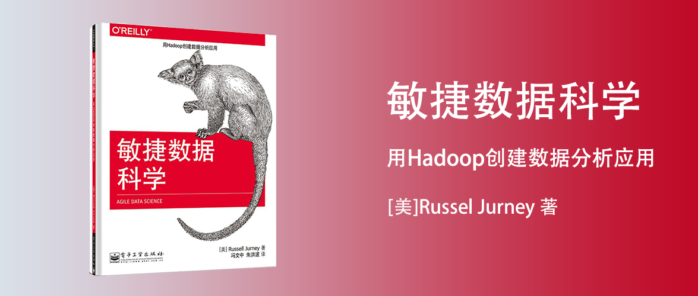

敏捷数据科学
==========================

用Hadoop创建数据分析应用

作者：[美]Russel Jurney

译者：冯文中 朱洪波

前言
--------------------------

本书的源代码是在*nix系统上面生成的，可以在[https://github.com/rjurney/Agile_Data_code](https://github.com/rjurney/Agile_Data_code)找到。

第1章 理论
--------------------------

以下几项变化能够让我们回归敏捷：

- 通才高于专才
- 小团队高于大团队
- 使用高阶工具和平台：云计算、分布式、PaaS等
- 持续、迭代地分享工作成果，即使这些工作尚未完成

### 敏捷大数据流程

传统的软件产品（特指面向CRUD数据库的应用），数据相对一致，确定性强。

数据挖掘的软件产品：需求会变、数据会变、数据很脏、数据有自己的逻辑，人对于数据的见解只是一种假设，可能是错的，所以即便做了demo，也无法完全避免数据产品不会做偏，而敏捷的方法，是先将最确定的特性先实现，再添加其他特性，让项目更有可能满足产品进化过程中最真实、最根本的需求。在数据产品中，最根本的特性会给人惊喜。假如不是这样，要么是你做错了,要么是你的数据没有太大意义。信息有它的背景，如果背景易变，就无法使用洞察进行预测。

敏捷还需要结对编程等可以互相检查的机制，开放的交流空间和专注的私人空间，还有可以展示过程的白板和海报。

第2章 数据
--------------------------

第3章 敏捷开发工具
--------------------------

第4章 在云端
--------------------------

第5章 收集和展示数据
--------------------------

第6章 使用图表可视化数据
--------------------------

第7章 利用报表探索数据
--------------------------

第8章 预测
--------------------------

第9章 驱动行动
--------------------------