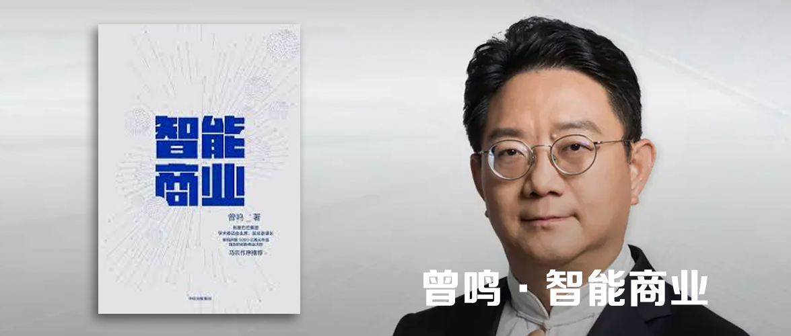

智能商业
========================================

曾鸣 著

决胜未来30年的新商业思维

智能商业 = 网络协同+数据智能

新旧商业的区别，在于“精”和“准”

企业的生死存亡，取决于你对智能商业本质的理解！

推荐序
----------------------------------------

曾鸣博士的这本著作不仅分析了阿里巴巴的成长史，更重要的是阐述了阿里巴巴开创的新的战略框架，以及这一框架对于其他创业者的意义。这本书在理论深度和实践指导上实现了难得的平衡，是数字经济时代的一本商业创新指南。

马云

自序
----------------------------------------

有价值的战略研究，一方面需要深入实践，问题驱动；另一方面，又必须有足够的前瞻性和体系化，所谓抬头看路。

随着大数据、算法、人工智能理解的深入，我终于提炼出了未来商业必须全面智能化的主线。同时，阿里巴巴集团和众多创新企业在C2B和网络协同方向不断努力，也让协同网的价值、机制，以及和生态系统的关系逐渐清晰起来。数据智能和网络协同的融合，让我意识到这就是未来商业文明DNA的“双螺旋”。

前言
----------------------------------------

中国不仅一直是一个快速变化的市场，也一直是一个发展很不平衡的市场。技术变革、政策环境经济结构变化带来的商业大变化，不仅激烈，而且迅猛，变化周期又很短。所以经常会在一个时间点出现一个发展周期的叠加。在当时的那个时间点来看，三种模式都有很不错的发展，非常难判断到底什么才是未来的趋势，也不知道如何做战略选择。我把中国这个市场的发展特殊性称作“三浪叠加”的时代，它把我们面临的挑战复杂度又提升了两个量级。

无论在哪个时间点，当3.0模式出现之后，1.0模式的企业就要非常小心了，因为发展空间看起来还在，但是很可能会突然进入断崖式的困难期。

2.0模式的企业其实没什么选择，因为眼下正是这些企业风头正劲的时候，虽然出现了一些未来挑战者的苗头，但绝大部分企业不会放弃看起来非常好的增长，而去做所谓的战略升级。

3.0模式的创业者，如果你相信这是未来，那么需要做的只有勇往直前。当3.0模式的“浪”真正打来的时候，往往只有那批专心致志、苦苦探索3.0模式的人，才能够快速奔跑起来。

智能商业本质上是对未来前瞻性判断，所以最适合的听众其实是3.0模式下进行探索和创新的创业者。

第一部分 智能商业
----------------------------------------

### 01 智能商业大变革

#### 智能商业：网络和数据时代的必然选择

那些市值排名前10的公司，在三个方向上至少把握了两个：

- 在线化：只有懂得如何将物理世界转换映射到互联网的虚拟世界中，你才会有在这个时代立足的根基。Windows和iOS是典型代表。
- 智能化：数据和算法，构成了智能的基本要素。搜索、推荐，是智能化的两款大规模商业应用。谷歌和亚马逊是典型代表。
- 网络化：构建一个生态，在在线化的基础上，做好相互协同。谷歌广告和淘宝都是这样的例子。

类似的企业还有，今日头条、滴滴、美团等。

这一批具有代表性的互联网企业统称为“智能商业”。他们具备下面这些特征：

- 低成本，实时服务海量用户：10亿级别，靠技术来提供服务
- 满足每一个用户的个性化需求：利用数据和人工智能做到个性化
- 服务自我更新与提升的速度：实现智能化后，服务的效率和服务的满意度都在快速提升

#### 双螺旋构成：网络协同+数据智能

智能商业最重要的两个组成部分分别是网络协同与数据智能。

- 网络协同：通过大规模、多角色的实时互动来解决特定问题。
- 数据智能：机器取代人直接做决策，和传统的BI（商业智能）完全不同。不再是把数据服务于高管，而是直接由机器决定运营决策。——实现这一点，还需要依靠云计算、大数据和算法。

#### 未来已来，智能商业将走向何方

在未来10年里，智能商业的发展依然要靠三条主线的突破。

- 在线化：利用IoT等设备将人的五官进行延伸，实现在线化。利用计算机视觉实现视觉感知能力的衍生。利用AR技术切换真实和虚拟。
- 智能化：人工智能的进步必然会持续不断保持高速发展，而且像谷歌和阿里云这样的公司会将获取人工智能的成本变得很低。
- 协同网络的扩张：当一个网络发展成长后，会自然地向外扩张。像淘宝这样的领域，未来会向后端发展，延伸到从制造到采购的全链路。

未来会有两个比较重要的趋势：

1. 智能生态会持续“爆炸”，多元物种会蓬勃发展。比如阿里这样的企业还会催生出很多新的企业。
2. 颠覆式的技术形成的新的黑洞。区块链、人工智能的第二次创新、AR等技术进步丝毫没有放慢的脚步。这些技术的源头还在不断发展。一定还会出现一些平台级、生态级的领先企业。

### 02 互联网的本质

#### 联：改变物理世界的底层技术革命

联就是连接，依赖于Internet的基础设施，将人连接到网络上来。它先后经历了三个时代：

- 连接1.0时代：PC互联网：连接最重要的是速度。只有信息能够同步分享，内容能够同步呈现，连接才有存在的意义。
- 连接2.0时代：移动互联网：iPhone的出现带来了第二个浪潮，移动互联网时代。连接的高速化、移动化让所有事情都变得高效起来。
- 连接3.0时代：万物互联网：二维码的应用就将原本一个相互割裂的物理世界连接到互联网上。芯片、传感器的高速发展，很小的物理器件都能联网、在线，进而通信、互动。大家期待的无人汽车，也是因为人们认为，如果连汽车都能在线化和联网化，那么很可能预示着整个社会的方方面面都可以被物联网技术改造。

#### 互：让交流沟通具备无限可能

互动，是指完成“在线化”这一阶段之后，人与人、人与物、甚至物与物之间都能够持续联动。

Web这个词同样是用来描述互联网，但是它和Internet体现的是网络基础设施不同，Web更关注“互”这个层面的问题。

Web其实也经历了三个阶段：

- 互动1.0时代：一对多的门户广播模式：雅虎、新浪、搜狐，但是几乎没有用户能够和门户主体进行互动。
- 互动2.0时代：以关注为典型代表的创新型互动：微博、推特和Instagram，你关注了某个人，当对方发出一条信息时，你能够在第一时间接收，甚至与其互动。
- 互动3.0时代：社交网络服务：Facebook和微信，群组和朋友圈都是了不起的发明，那些钱包、名片夹、地图和GPS都不用带了，带着手机即可。

#### 网：互联网给商业社会带来的颠覆性改变

顾名思义，网指的是结网，意为人类社会的分工与合作开始用网络的方式加以实现。在工业时代，流水线实现了小规模人群协作。

以淘宝为例，淘宝实现了整个零售体系在线化，相互协作。还有爱彼赢、快手、小红书、土巴兔，都在各自的领域形成了协作网络。

要想实现智能商业：

1. 在线化：让你的产品和服务核心流程在线化。
2. 互动：与你的客户真正互动，知道他们对你产品的反馈。
3. 结网：变成所在行业的协作网络。

### 03 智能商业双螺旋之一：网络协同

#### 网络协同：新经济范式革命

淘宝的发展，就是一个协同网络不断生长的过程。

淘宝给社会带来的第一个价值是使在传统商业环境下不可能开店的人成为淘宝店主。供给端的封闭结构被淘宝打开，从而大大提高了供给端的整体供给能力。同时，随着B端提供的商品丰富度越来越高，C端也聚集了越来越多的消费者，相互促进，正向循环，淘宝自然出现了生态爆炸一般的繁荣。相比于eBay，淘宝鼓励商家和消费者直接、充分地连接、互动。旺旺、评价体系、帮派论坛、支付宝等工具都促成了这一目的。

随着需求越来越强烈，越来越多的角色孕育而生，店铺装修、淘宝客、ISV、导购达人、淘女郎等，都促成了双边市场的扩张。

淘宝的第二个阶段的核心特征，就是从一个简单的双边市场演化成了一个复杂的多边市场，多元角色在其中相互协同表现得越来越充分，淘宝也越来越立体。比如，网络协同进一步扩展到了物流，菜鸟网络让所有的参与方都在上面互动沟通，而不需要中间人来计划和安排。这一生态力量进一步延伸到采购、批发，最终延展到整个供应链。

淘宝、爱彼迎、字幕组，都是开放、协同、共享、共建的网状结构，它们已经开始取代封闭、线性、管理、控制的工业时代线性结构。这就是新经济范式的革命。

一些时下火热的新概念，包括按需经济（网络协同的目标）、共享经济（网络协同的价值观）、社群经济（网络协同的有机组成模块）等，本质上都必须建立在网络协同的基础上。区块链技术由于提供了一个点对点的、建立在共识基础上的协同网络，很有可能带来网络协同的一次大飞跃。

#### 淘宝与优步：网络协同效应的胜利

毫无疑问，优步是共享经济的先行者，特别是在美国。但是优步从最初的发展速度飞快，5年内公司估值达到400亿元，到近两年，优步的发展似乎进入了瓶颈期。问题的核心在于优步并没有享受到多大的网络协同效应，它更大的价值还是源于传统的规模经济。单靠规模经济是无法实现垄断的，就像很多人手机上会有很多个打车，谁便宜、谁服务好、谁能打到车就用谁，司机也一样。规模经济的壁垒比网络协同效应的壁垒要低很多。

Facebook和微信都是非常典型的需求端网络协同，只有这种依靠网络协同效应的企业，才有机会赢家通吃。如果在需求端没有网络的协同效应，即使供给端的规模效应再强大，用户的转移成本也依然很低。

优步能够如此快速地扩张，根本原因之一是打车作为一个用户场景相对简单，从一个简单的切入点，可以带来快速发展。但因为简单也制约了优步发展出更加复杂的多边市场和更有生命力的生态潜力。这一点很重要，关系到网络协同是如何在实际应用中产生价值的。在优步平台上，不管司机还是乘客，都是相当简单和同质化的角色，这样的网络显然缺乏自主生长动力。优步在打车之外一度被寄予厚望的快递服务、送餐服务的业务扩张也并不顺利，根本原因在于这些都不是原有网络的自然延伸，而是需要靠管理者去复制在原有领域的成功。

也许可以做个判断，优步在网络协同的方向上已经不太有什么可能性了，因为它的DNA比较局限，起步于一个很单薄、很简单的用户场景——打车。这个场景本身不太具备相关扩张的可能性，于是优步把自己下一步的发展方向定位在自动驾驶上。对优步来说，自动驾驶是一个巨大的挑战，除非优步在这个领域有足够大的进展，否则它的发展，包括市场对它的估值，暂时都不会有大的突破。

### 04 智能商业双螺旋之二：数据智能

要想把数据智能融入具体商业，要做好三件事：数据化、算法化和产品化。

#### 数据化：商业创新的基础

未来智能商业的样貌，从蚂蚁小贷的业务中看，是以下三件事融会贯通、相互包含，在反馈闭环中共同演化的结果：

- 特定商业场景的数据化
- 忠实于商业逻辑的算法及其迭代优化
- 将数据智能与商业场景无缝融合的产品

在蚂蚁小贷的放贷过程中，客户的数据越来越多，数据维度越来越丰富，参数越来越准，算法模型越来越有效，风险控制的成本越来越低，信贷对象的体验越来越好，覆盖的贷款用户也越来越广。整个业务进入高速发展的正向循环。更重要的是，这是一个基于数据和算法，且自动的智能化用户体验提升过程，商业效率也得到了极大提升。

#### 算法化：智能商业的“引擎”，而非“工具”

在商业语境下，算法就是一组反映了产品逻辑和市场机制的计算指令的集合。完成了商业场景的数据化之后，算法就是提炼数据价值的思路，而DT时代的数据价值就是商业价值。

数据时代的智能商业对算法提出了全新的要求：算法的迭代方向、参数工程等，都必须与商业逻辑、机制设计，甚至价值观融合为一。当算法迭代优化时，决定其方向的不仅是数据和机器本身的特性，更包含了我们对商业本质的理解、对人性的洞察和对创造未来商业新样貌的理想。

#### 产品化：数据智能和商业场景的最终载体

真正把用户、数据和算法创造性地连接起来的是“产品”，这也是互联网时代特别强调产品重要性的根本原因。

产品设计直接影响用户体验，上传：将“端”的行为数据向“云”反馈，下达：将“云”的数据智能传递到“端”。

上传下达，双“管”齐下，数据闭环靠产品互动实现，而产品体验依赖于数据智能，数据和产品合二为一。一切的数据智能体系，都必须最终融合在功效直接、交互友好、价值明确的互联网产品傻姑娘，其智能的价值才能真正体现出来。

到今天，当客户可以通过全本实时的数据把他们的需求直接告诉商家时，当商家可以凭借敏捷迭代的算法引擎精确满足客户的需求时，当产品借助互联网的巨大能量成为数据智能和用户的端口时，我们终于可以说，我们找到了促使这个反馈闭环成本更低、效率更高，甚至自动运转的颠覆性工具。

#### 活数据：让反馈成为闭环

当大家提到大数据的时候，经常会说它大量、多样、快速、高质量。但这样只描述了它“大”和“快”，这些并不能帮助我们更好地进行商业决策。

想要让数据与现实生活无缝衔接，就需要数据在线，实时记录而不是主动采集；要不断更新，随时可用来产生洞察；需要在实际业务场景中被灵活使用，驱动下一个决策的产生。这个概念我称为“活数据”。

“活”的两层含义：

1. 数据是“活”的：始终在线，不断更新
2. 数据需要被灵活使用：不断被消化、处理，产生增值服务，同时又能产生更多的数据，形成数据回流。

“活数据”的三大重要特征：

1. 全本记录，而非样本抽查。今天我们谈论“活数据”的最大前提，一定是数据记录成本的大幅下降。这个前提如果无法得到满足，“活数据”的概念不谈也罢，因为它无法落地。
2. 先有数据，后有洞察。这样做的最大好处，是避免了事后出现新的需要调查的问题而被迫进行重复作业，这种传统方式所带来的成本是巨大的。
3. 数据就是决策。数据智能的引擎机器要能够直接做决策，而不是传统的利用数据分析来支持人的决策。如果数据仅仅被用来支持人的决策，那便无法形成真正的闭环，不具备大规模复制推广的价值。其实卖家真正需要的不是去理解这些晦涩庞杂的数据，而是让数据直接帮助他们更快更好地做出决策，让他们的运营效率产生质的飞跃。

以上三大特征结合在一起，也就形成了反馈闭环的概念。只有“活数据”，才能让整个反馈闭环顺畅运作。

企业智能化=在线化+自动化。流利说就是一款这样的应用，2012年创业时期，“流利说”恰逢移动AI、云计算和大数据三大趋势的结合，所以才会有这样一个产品的诞生。它将自己的核心业务在线化，把口语练习的功能，做成APP，也就形成了数据和用户的入口。通过将业务环节自动化，让口语录音不断得到系统的反馈，用户可以基于反馈不断优化练习。

如果将一个线下实体店和淘宝或者微信的数据打通，就能够轻松知道一个人在淘宝上的ID或者微信号是什么，可以将线下的独立个体转化成线上可以识别的人，这就是数字化的过程。这中间有硬件、互联网和算法的相互作用，但其核心是把一个线下的场景映射到一个在线的场景中。通过数字化和软件化两大步骤，将传统的服务搬到线上，这是企业智能化的第一步。

### 05 智能商业的特征：向精准升维

#### “精+准”是未来商业的核心要素

精确和准确，分别对应着网络协同和数据智能。

精准商业要建立在和用户的持续性互动关系之上，在这种持续性互动中，对产品（服务）进行迭代和优化，从而更加精准。一方面产品的价值很大一部分来源于数据智能在其中的应用，另一方面产品本身又是收集数据的渠道，形成反馈闭环、学习优化的基础。

同时，要与用户建立持续互动关系，就必须以个性化、一对一的方式来实现与用户的连接，这样双方才有可能互动起来。但是想要同时能够和海量用户进行持续互动，就必须依赖于一个协同网络，只有协同网络才能支撑这样个性化的服务体系。

简单地讲，就是：在数据智能的基础上实现产品闭环，盘活数据使之越来越准确。利用网络协同，打造一对一个性化服务体系。

#### 精确：通过网络协同，实现降维打击

精确要追求的方向，是在极度颗粒化的场景下，依然能找到具体时间点的需求，然后按需服务。

每个人在早上9点和晚上9点时的心情大相径庭；在家和在公司的需求也不一样；酒醉与清醒的不同状态下，又会产生截然不同的需求。

所以要实现精准，答案的核心是通过协同网络的不断扩张，获取一个人在不同场景、不同状态下的更多数据。

**降低准入门槛，扩大生态容量**

要想构建协同网络，首先要能够通过赋能降低门槛，让原来不存在的供给者进入，这样才能极大地扩大生态容量，才有可能改变原来的格局。

低门槛是非常重要的一个竞争手段，越大的生态越需要低的门槛，这样才能保证足够的容量。

**以协同为核心的不断演化**

新物种是不断演化的过程，是以协同为核心，让网络不断扩张的过程，这一点在中国非常特别。而在美国，因为传统商业极其发达，每个环节的效率都很高，所以电子商务很难在整体上重构美国的商业版图。

#### 准确：数据智能的背后，是商业逻辑的根本改变

未来竞争的核心，将从满足显性的标准化需求变成挖掘潜在的个性化需求。

要满足个性化需求，就需要依靠数据智能。只有用机器决策取代人力决策，才能在足够短的时间内快速学习、提升和逼近可能的潜在需求，这样得出的判断才是准确的。用工业时代的思想无法企及准确这一高度，只有用数据时代的思想，人们才能用渐进的方法来快速迭代、试探。

淘宝的经验告诉我们，要在线记录数据，而不单单是收集数据，而且要收集所有的数据，包括各种用户点击和停顿，都应该被记录下来。谁能够找到有创意的数据化方法，谁就具有重要的竞争优势，也就能真正融入未来的智能商业中去。只有实现了核心业务的自动化，才能收集到大量的数据，并且要运用机器学习的逻辑贯穿整个业务过程。

### 06 黑洞效应：智能商业胜出的秘密

“黑洞”型企业的第一个优势是网络效应，具备指数型扩张等大众已经非常熟悉的互联网天然优势。

第二个优势是学习效应，机器的算法在不断对数据的处理中提升了自己的智能水平。“黑洞”型企业越学越聪明，学得越来越好、越来越快，这就是学习效应。

数据压强会推动数据智能发展，当网络越来越复杂以后，靠人力根本无法完成如此繁重的工作。数据智能是唯一且必然的选择。

数据智能拥有网络张力，与石油和钢铁相比，二者的主要区别有以下几点：

1. 物质资源有形，数据资源无形：可以反复传播共享。
2. 物质资源传播成本高，数据资源传播成本低。数据信息的复制和使用的边际成本近乎为零。
3. 物质资源的使用是损耗过程，数据资源的使用是价值创造过程。
4. 二者的经济学原理不同。

以上四大优质DNA的重叠附加与彼此赋能，让有着“黑洞效应”的企业占据了指数级增长的竞争优势。

黑洞效应依靠以下能力，不断增强自我：

1. 智能化：AI技术将极大增强黑洞能量
2. 在线化：IoT将极大扩张智能商业的边界
3. 网络化：协同网络将急剧扩张

在智能商业的时代，想要让自己的企业获得成功，首先要问自己4个问题：

1. 我的企业能否最大限度地实现网络化？
2. 我的企业能否尽可能地引入机器的学习效应？
3. 我的企业能不能在网络扩张的过程中，尽可能地用机器决策取代人工决策？
4. 我的企业能否让自己收集的数据与更多不同类型的数据产生交换？

这4个问题，每解决一个，你就离成功更近一步。因为这4个问题代表了“黑洞效应”的4个不同优势，无论哪一个优势都能为你的企业带来巨大的发展动能，都能为你的企业创造出巨额的价值。

#### 黑洞效应的必然方向是智能商业

未来的智能世界，则需要人类在这些物理连接的基础之上，完成创造力，知识和智慧的联结。

这是一个伟大的联结过程，它氛围三大实践步骤：

1. 人脑的联结
2. 全世界机器智能的联结。
3. 人脑与机器脑直接联结的网络。

第二部分 商业模式变革
----------------------------------------

### 07 C2B：未来的核心商业模式

#### 传统三大商业模式

无论何种商业模式，它的起点一定来自用户的痛点，来自一种未被发现或满足的需求。

**B2B代表企业：阿里巴巴、中化网**

B2B指的是商家对商家，有平行和垂直两种关系。平行的典型代表是阿里巴巴，它与客户企业之间是平行关系。垂直的典型代表是中国化工网，它和客户企业之间处于同一产业链的上下游关系。

**B2C代表企业：亚马逊、天猫和京东**

B2C是指商家直接将产品或服务销售给消费者。亚马逊、天猫、京东都是这个领域的典型代表。

**C2C代表企业：易贝、淘宝**

C2C是指个人对个人，网站作为平台连接着买卖双方。淘宝为了解决中国用户人数众多、质量参差不齐的问题，孕育而生了支付宝、阿里旺旺、千人千面等产品和目标。

#### C2B：对传统工业时代的颠覆

C2B是真正客户驱动的商业。企业可以用较低的成本建立起和客户持续的互动，并在此基础上，通过不断的运营来迭代对客户的服务。C2B是指需求从C流向B并最终形成产品的过程。

C2B最明显的特征就是以用户为主导，用户从商品的被动接受者变成主动参与者，甚至是决策者。品牌与用户的关系从单向的价值传递逐渐变成了双向的价值协同。

个性化消费的潮流创造出了一个全新的个性化需求的市场，使来自各行各业的团队、公司纷纷加入C2B模式的行列中。DELL、尚品宅配、上汽MG5汽车，都是典型代表。但市面上大多数的C2B企业没有解决个性化和规模化的矛盾。天猫商城推出了一种基于数据智能的C2B模式，利用自身数据优势，指导生产制造，提供定制化解决方案。

#### 客户驱动：C2B模式的逻辑起点

要想真正做到时时、事事、处处以用户需求为基本出发点、便意味着巨大的成本。

“客户驱动，用户第一”已经成为企业运营的起点和基础。产生这样变革的原因主要有：

1. 商家和客户能够实时互动：传统工业时代，你甚至连客户是谁都不知道，更遑论用户体验和互动。但是在互联网时代，可以实现企业和客户之间的高效率、低成本的海量连接和互动。
2. 数据等于意见：大量的数据可以清晰地被挖掘成用户的需求。
3. 产品的快速迭代：机器学习具有自我优化的能力，这意味着用户在表达其需求之后，你可以实时持续地对产品和服务做出相应的优化，数据智能的引擎会在云端不断地发挥作用。要想实现这一点，需要在你的产品中加入互联网产品这一有机组成部分。

#### 转变思维，将C2B落到实处

将C2B商业模式真正落到实处，具体可以分为三大方法：

1. 收集数据：可以通过连接了用户的社交平台和工具，也可以通过自建平台，还可以购买共享、威客平台的需求收集服务。
2. 吸引数据，引领潮流：利用网红让购买变成一种“社区行为”。网红吸引的就是那些与自己志趣相投的“粉丝”，而“粉丝”一旦认可网红商品，就会自发地和朋友分享、传播。这就是网红经济产生并且迅速发展的根本原因。
3. 根据需求打造个性化产品：很多时候，这些消费者对商品的需求不再局限于功能方面，更多的是追求一种身份和自我价值的体现，希望通过拥有某一种商品，体现出自己与众不同的个性。追求个性、追求与众不同，对于他们来说已经成为一种时尚的消费观念。一方面让消费者得到了一种身份和价值感被提升的满足。另一方面，这样的参与感容易让消费者对产品产生认同，甚至对企业本身都会有一种归属感。

### 08 S2B：通往C2B模式的自然演化路径

#### S2b2c的模式创新 

S2b2c是C2B模式的一个变形，因为整个服务是通过小b和小c（客户）的紧密互动而驱动的。只是这个互动不一定完全在网上完成，同时，小b离开S的支持也无法独立完成对客户的服务。

- S：是一个重构了大的供应平台，需要大幅提升供应端的效率。
- b：指的是一个大平台接入的万级甚至更高级别的小b，帮助它们完成针对客户的服务。小b的核心价值是完成对客户实时的低成本互动。
- c：customer，客户，而不是消费者consumer

S和小b之间是赋能关系，并不是传统的加盟关系。

网红（小b）推动品牌在线化，四季青帮助供应中后台平台化（S），这两股力量的有机结合进一步对传统服装供应链带来更大的竞争压力。

#### S和小b的新型合作

1. 当小b服务c时，必须调用S提供的某种服务：S不能仅仅提供某种SaaS（软件即服务）化的工具，它必须基于对上游供应链的整合，提供某种增值服务，才能帮助b更好地服务c。
2. 对于S来说，小b服务c的过程对它必须是透明的，也就是S能参与并且能给予实时反馈，来提升S对小b的服务。

#### 赋能的五个方面

S2b2c模式最核心的是S和小b要**共同**服务c。小b服务c离不开S平台提供的种种支持，但是S也需要通过小b来服务c。

S对小b的赋能体现在以下五个方面：

1. SaaS化工具：S提供在线化的工具，把c和小b都连接进来。
2. 资源的集中采购：小b对供应链缺乏议价能力，S需要能够帮助小b实现这个能力。
3. 共同的品质保证：某种意义上，S和小b是共创的合作关系，所以可能会形成双品牌的战略等方式。小b本身掌握客户，所以可能提供个性化的服务也是必要的。同时，类似淘宝的评价体系，也可以很好地让S为小b去赋能，基于信用体系来提供担保服务。
4. 网络协同：S协同了多少上游的供应商。如：仓储配送、客服、内容、培训、IT系统等。
5. 数据智能：因为系统是在线化的，所以长期看，数据智能一定是S的巨大优势。这样就能够给小b提供更多的数据服务。

第三部分 战略变革
----------------------------------------

### 09 新战略：高效反馈闭环

#### 看十年，做一年

- 远见（vision）：基于对未来的长期思考，形成对未来变化的某种判断。显示了你对未来最有可能发生的产业终局的一种判断，这个判断是你的一个假设。远见其实也是理性和感性的一个结合，理性的一面，你要不断地挑战自己，纠正自己的判断；感性的一面，你最终依靠的还是自己对自己信念的相信。这是非常重要的辩证思考。
- 快速行动（action）：对远见的不断实践验证和挑战，然后被不断纠正的过程就是快速行动。它不是盲目行动，是有纪律的实验（disciplined experiments）。

这种新战略的核心的难点在于：一方面，远见一定要快速找到落地点，不能大而空，否则只是空想，无法落地；另一方面，不能盲目跟风，要能不断地总结思考，形成对未来的独特判断。这种“虚实结合”是很难的一种技能，需要长期训练，也需要团队配合。

#### 阿里巴巴历史上最重要的一次战略会

我们要建设一个生态系统，而生态系统的第一个核心是客户、是数据，是最底层的信息流、资金流、物流。第二个核心就是开放API。

后面淘宝的各种重组、调整都是朝着这个大的方向。我们有大的战略方向，具体行动是在不断调整的，而且是一个持续的过程。因为你有方向，越调整就越靠近你向往的那个方向，战略也变得越来越清晰。

#### 战略实验

当你看不清未来，又必须做决定的时候怎么办？对于非常关键的战略决策，可以考虑用战略实验的方法来保证跟上大趋势。

阿里巴巴在2012年将如日中天的淘宝一分为三，淘宝、天猫、一淘，让他们充分竞争以探索产业终局，这一疯狂的举动史无前例。

对于互联网企业来说，或者对于未来的竞争来说，由于整个市场变化得太快，方向又不明确，所以通过行动实验、摸索出新的方向是第一位的，为了试出这个方向，浪费一些资源是完全值得的。

千万不要拘泥于传统的计划，写下来的计划基本上一写下来就过时了。你的确要具备一种新的核心能力，就是在预判未来和当下行动之间形成非常高效的反馈闭环。这样的话，你可以让自己的预判足够优化。没有谁真的能看懂十几年以后的事，只是说你一直在看，然后在做的过程中，只要比别人快半步就够了。

### 10 新定位：点-线-面-体

#### “点-线-面-体”的定位逻辑

在新的商业大环境下，传统的战略理论框架出现了不适应之处。迈克尔·波特：成本领先，差异化和利基市场的竞争战略，是最传统的理论框架。在此基础上，作者进一步演化出了“点线面体”的理论。

- 面：平台或生态型企业，有创造新模式的可能性，广泛地连接不同的玩家。其成功的核心因素是网络效应。淘宝就是这样一个面的概念。也是“点线面体”中最重要的一个概念。
- 点：在准确的时间节点找到合适的面，并与之共同发展，实现爆发式增长。比如：淘宝上的摄影师、物流服务、模特服务等就是点的概念。
- 线：在淘宝体系中，卖家就是典型的线，连接了用户。要想做“线”的生意，你一方面要充分利用“面”带来的各方面支持，另一方面还要善于捕捉“点”带来的机会。
- 体：是由“面”发展而来的。由一个“面”衍生出另一个“面”，淘宝是一个面，云计算则是另一个，它们相互支撑起了“体”的概念。

#### 淘宝的动态演化

淘宝的发展，是点线面共同作用的结果。它的各个点，似乎在传统商业中都有，但是在长期的相互作用下，已经发生了质变。要做到这一点，其实，答案也很简单：开放，帮助“点”与“点”连接、互动，扩大网络广度，加强网络密度。

早期的淘宝创业者，包括现在已经赫赫有名、价值以亿元计算的淘品牌创立者，几乎都不具备在传统零售业中独立开店的可能性。因为无论是启动资本、客户获取，还是店铺租金等，都是巨大的负担。时至今日，他们对于淘宝最大的感念也在于此，淘宝的出现，大大降低了创业门槛，使创新成为可能。

淘宝这个面，也需要不断回应“点”的新的需求，不断改进机制。这类机制，就是对顺畅连线、良性创新的最大帮助，均为平台的基础设施。

#### 生态系统对供应链的升维打击

传统供应链不需要“面”和“体”这样繁复的网络，因为其目的是效率，如销量最大和成本最低。因此，传统商家会在整个价值链中尽其所能垂直整合上下游，以统一的标准、规格、质量，将“点”纳入其控制的价值链。互联网因其开放性，拥有高阶生态的丰富资源，无数“点”于“点”互动，迸发出的能力之大让传统、封闭的“线”望成莫及。这样的胜利，才是真正意义上的升维攻击。

以新闻业为例，报纸杂志、电视新闻等传统媒体，实际上既有生产内容的“点”的一面，也有连接用户的“线”的一面，但是很快，随着门户网站的兴起，传统媒体只能作为一个点而存在。又过了几年，随着微博的崛起，传统门户网站也仅保留了“点”的能力，然后是微信时代的兴起，天然与用户更高频的互动，让微博的风光也不如当年。

所谓升维攻击，就是在互联网技术的帮助下，新平台将不断打开过去的封闭结构，纳入越来越多的“点”，共同参与互动。在升维的“面”上，由于供应、需求以指数级别增加，“面”促进而非抑制“点”的活力，“点”连成“线”的活力也远大于传统的“线”。

#### 企业未来的发展方向

将当下互联网创业公司进行分类：

- 点：淘宝店主、苹果APP提供商、O2O服务提供者，都是“点”，它们提供了确定的商品和服务。
- 面：淘宝、安卓苹果应用市场、河狸家、爱彼迎、优步。

面只有不断适应点的需要，才能让点更好地连“线”用户。一些创业公司也是从线开始，慢慢演变成“面”的，如河狸家、爱彼迎、优步，都属于这一类。

互联网是可以与电相媲美的技术革命，其对产业，乃至人类生活的改变都刚刚开始。

第四部分 组织变革
----------------------------------------

### 11 第四次组织创新：创造力革命

在这个时代，机器不断取代能够被结构化的知识，创造力成为最稀缺的生产要素和组织中最大的竞争力，这也对组织模式提出了全新的要求。

#### 历史演变：组织创新的三次革命

- 工业革命：18世纪60年代～19世纪中期，支持工业革命的基础是知识革命。蒸汽机以及其后的发电机，所有机器都是根据通用的科学原理和技术进步的原则而被发明的。
- 生产力革命：19世纪70年代～第二次世界大战，核心是通过管理来提高人的生产效率，相应的组织创新就是出现了公司和最早的职能管理。从职能管理到M型的组织管理，再到今天大家熟悉的矩阵管理，归根结底都是提高人在生产线上和公司内的效率。
- 管理革命：到20世纪四五十年代，信息化的发展使得管理本身也变得愈加复杂。此时的管理核心不再是流水线的效率，而是公司这个组织本身的效率，其依赖于信息的流通和处理的效率。

#### 创造力革命

《[全球人才2021](https://oxfordeconomics.com/Media/Default/Thought%20Leadership/global-talent-2021.pdf)》 ：未来十年最热门的需求在于关系建立、团队合作、协作创新、文化敏感性以及管理多样化团队的能力。

人的直觉、对知识的综合升华能力，或者叫作创造力，依然是机器难以超越的。只要确定这一点，未来人类的核心价值便十分明了，那就是创造力。这可以直接表现为技术的创新，也可表现为对客户的感知力、商业的洞察力等。

在中国的传统行业快速互联网化、智能化的过程中，首先就需要提升企业家的创造力，让其能够将原来离线的场景变成在线服务。没有创造力就不要轻言转型，这种创造力需要始终贯穿于转型过程。

总而言之，人工智能将人们更彻底地推向富含创意、充满挑战，也更蕴含价值的分工。人作为创新的主体，将价值观、理论、知识甚至直觉贯彻到算法模型和产品中，通过反馈、学习和迭代提升智能、创造价值，继而重塑人的体验、认知和价值体系。创造力革命的本质是通过人工智能释放和激发人的创新力，人工智能和人类智能这两种智能在交互与碰撞中激荡增值，螺旋式地创造出具有巨大价值的智能生产力。正因为如此，人类将会成为更关键、更不可替代的时代主角，在机器智能的全面辅助下，大踏步地迈入智能时代。

### 12 新组织原则：从管理到赋能

赋能，所传达的核心观念是如何让他人有更大的能力完成他们想要完成的事。

- 领导者的目的不是管理，而是支持。
- 团队成员的驱动力不是传统的劳动报酬，而是成就感和社会价值。

表12-1 传统管理型组织与赋能型组织的重要特征比较

|                    |        管理型组织        |      赋能型组织       |
|:-------------------|:-----------------------:|:--------------------|
| 组织结构            |  树形或矩阵形             | 层级淡化，平台联网      |
| 信息流（对内）       | 自下而上收集，自上而下反馈  | 联通透明，实时同步      |
| 信息流（对外）       | 单一收集和输出通道（部门）  | 联通透明，实时同步      |
| 决策流              | 中心决策，向下分解推进     | 实时同步，在指标控制下自调适 |
| 资源分配和规划       | 集中规划，逐级分解         | 按需自取，弹性分配      |
| 内部协作机制         | 岗位定义职责，协作需要回溯汇报线；分工割裂，信息流低速 | 基于协同创新平台自组织，透明共享，协同竞争，一致迭代 |
| 价值导向            | 效益驱动                 | 创新驱动，关注成长能力 |
| 风险偏好            | 风险最小化，规避犯错；信息和数据被保守控制而没有共享 | 追求透明、速度和创新自由，强容错能力，没有创新是最大的风险 |

#### 打造全新的赋能型组织

理解“赋能”这个全新的概念，有三个原则：

1. 匹配创造者的兴趣、动力和合适的挑战。强调组织赋能员工，满足自我成就，而不是传统的仅关注物质奖励。
2. 打造环境和氛围，方便员工共同创造。不再只是自上而下地分解任务，传递知识，而要吸引志同道合的人共同创造。
3. 通过组织设计，刺激人和人之间的有效互动。搭建的是一个可以充分互动的平台，让组织为他们提供各自独立时无法得到的资源和环境，最重要的是让他们能够得到充分互动的机会，有更多自发碰撞的可能性，只有这样才能创造更大的价值。

落地这三大原则，对应运用方法：

1. 文化的营造。需要合伙人之间拥有相同的理想和愿景。
2. 人才招聘。找对人比改变人更重要。
3. 心力的大量运用。提供一个平台让创造者之间能够有更多的互动，甚至产生跨界交流，进而让整个团队拥有更为出色的创造力。

第五部分 案例分析
----------------------------------------

第六部分 关于未来
----------------------------------------
