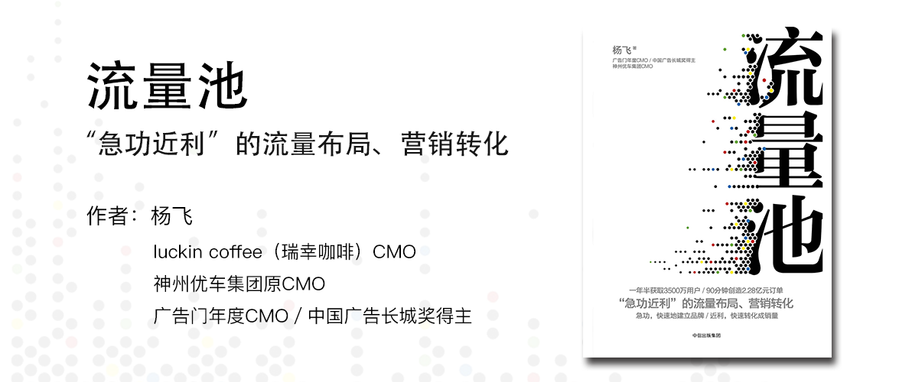

流量池
========================================

一年半获取3500万用户／90分钟创造2.28亿元订单

**“急功近利”的流量布局、营销转化**

急功，快速地建立品牌／近利，快速转化成销量

杨飞 著

luckin coffee（瑞幸咖啡）CMO

神州优车集团原CMO

广告门年度CMO／中国广告长城奖得主

> 流量池区别于流量，它把长期经营流量作为目标，而不是将其短期暴力变现，这也是一家企业的一个长期投资。相较于很多互联网公司所强调的广告模式，更多是狭义地利用流量的过程，而忽略了建立流量池这件事。虽然二者都含有“流量”二字，但有着天壤之别的思路。
>
> 如果一家企业需要流量，那么它可以买流量、造势吸引流量、制造话题等，但是如果一家企业想要有源源不断的流量，建立自己的流量池，则需要从品牌经营、产品迭代、工艺改进、建立粉丝群的思路着手。那些我们耳熟能详的企业，大都拥有自己的流量池。
>
> 但是企业想要建立流量池，并不是一件容易的事，它需要自上而下建立起长期经营的思维模式，需要避免急功近利的思维行动模式。但很多公司虽然口口声声要做百年企业，但是KPI的设定却让每个部门只能关注于短期利益，最终导致南辕北辙。
> 
> 流量池这本书，以建立流量池为目标，告诉我们如何一步一步去构建流量池。

自序
----------------------------------------

从2015年开始，中国移动互联网的流量红利就开始逐渐消失，营销人或创业者会感同身受下面几个变化：

1、流量的本质发生变化：

消费用户-->争夺用户的有限时间。

但因为微信、今日头条、王者荣耀等APP已经抢占了大量的用户时间，其他APP进而只能向垂直领域或应用场景中竞争。

2、线上获客成本升高导致其他渠道流量备受关注。

线上流量-->线下门店、传统广告、人肉地推

3、企业和品牌对实际效果要求越来越高。

追求曝光量、阅读量-->探索交易闭环达成实际交易。

4、技术与营销结合速度加快。

外部广告公司AdTech（广告技术）-->基于企业内部数据和用户标签的MarTech（营销技术）

借助移动终端的交互系统和数据收集实现MarTech（营销技术）

企业开始自己借助技术手段运营流量，带来销量和增长。而不是单纯靠投放外部广告。

流量思维和流量池思维（本书）是不同的：

1. 流量思维：获取流量-->变现流量
2. 流量池思维：获取流量-->存储、运营和挖掘获得更多流量

本书分为三个层次来讲流量池：

1. 如何获取流量
2. 流量如何更有效转化
3. 流量的运营和再发掘

第一章 流量之困
----------------------------------------

**流量盛宴结束，新品牌还有机会吗？**

| 20世纪90年代以前 | < 2014年PC流量 | > 2014年移动互联网时代  |
|:--------------:|:-------------:|:--------------------:|
| 线下门店 好地段 流量大 | 流量巨头（新闻、电商、搜索） 占了流量的80% | 手机则成了人的延伸，但流量最终还是掌握在少数巨头手上  |

> 数字：
>
> 1. 2017年“双11”全网总成交额突破2500亿元。
> 2. 2012年，企业的网上获客成本大约只需要几角钱。
> 3. PC时代少数巨头垄断了80%的流量。
> 4. 2016年，今日头条累计激活用户达6亿，1.4亿为活跃用户，日活跃用户超过6000万，头条号日均阅读量超过18亿条（人均30条），用户平均阅读时长超76分钟。
> 5. 2016年第二季度友盟数据显示，新闻类用户平均使用时长大概是26.6分钟，视频播放类的用户平均使用时长是40分钟。
> 6. 微信日活跃用户超过9亿。

**成也流量，败也流量**

面对流量，初创企业普遍面临三个问题：

1. 流量少
2. 流量贵
3. 流量陷阱

问题一：流量少

1. 流量整体增速放缓：该有手机的人都有了，该会用手机上网的也都上了。

> 数字：
>
> 1. 2017年8月，中国互联网络信息中心（CNNIC）发布的《第40次中国互联网络发展状况统计报告》显示，截至2017年6月，中国互联网的普及率已经达到54.3%，其中手机网民的规模为7.51亿，使用手机上网的网民比例达到96.3%。

2. 竞争个体成倍增长

相同内容的APP数不胜数，想要冒头越来越难。

问题二：流量贵

百度、头条、微信、自媒体流量，都越来越贵，随着流量向头部集中，流量的价格就节节攀升，连传统媒体、视频网站、分众传媒甚至短信，流量价格都在上涨。

> 数字：
>
> 1. 2015年百度广告营收640亿元。
> 2. 2016年，微博全年净营收6.558亿美元，较2015年增长37%。广告和营销营收较2015年增长42%，达到5.71亿美元，日活跃用户1.32亿。
> 3. 阿里2016年第四季度新增4300万移动月活用户数，共有4.93亿月活用户数。
> 4. 接近80%的交易额属于天猫的20万头部商家，淘宝900万中小商家瓜分剩下20%的交易额。

问题三：流量陷阱

**媒介供应链充满了黑暗和欺诈。**

> 数字：
>
> 1. 2015年，美国国家广告协会的调查显示：23%的视频广告有曝光水分，展示广告占比11%，广告主的投放损失达到63亿美元。2016年，这个数字上升到72亿美元。
> 2. 百度发布的《2015搜索推广作弊市场调研报告》指出，百度推广每天监测并过滤千万量级无效点击，其中5%为人工作弊，49%～65%为机器作弊。

**突围，互联网企业的“流量下乡”**

线上流量放缓，价格高企，大家开始寻找新的流量。阿里、小米、百度、京东都在线下展开了攻势，从乡下的刷墙广告到线下门店开设到与品牌合作甚至收购来抢占线下流量。

**流量问题之下，企业如何营销破局？**

1. 品牌营销
2. 效果营销：利用技术手段优化转化，提高销售品效合一才是效果最好的。品牌不光赔本赚吆喝，还要借助技术手段，如在移动端快速完成闭环。

**利用流量池实现“急功”和“近利”**

1. 急功：要快速建立品牌，打响知名度，切入市场获得流量。
2. 近利：在获得流量的同时，快速转化成销量，带来实际的效果。

第二章 品牌是最稳定的流量池
----------------------------------------

> 数字：
>
> 百雀羚针对淘宝店的营销公众号文章3000万+的阅读量，转化不到0.00008，约300万左右的广告费用，总销售额不到80万元。

以上数字反映了当前做广告的两个尴尬：

1. 做品牌，到底应不应该承诺效果？或者用什么样的转化周期来承诺效果？
2. 如果用同样的费用做效果广告，是不是会更有效，并且品效合一？

不能直接导向购买的营销行为都是品牌营销，即使其最终目的是导购。但是此类营销路线较长，周期较长，目标可能也会在这个过程中变得模糊。

广告费花哪去了，问题出在哪，因为缺乏数字优化也无从谈起。

随着技术进步，市场总监的工作技能要求也在发生变化：

- 过去：懂品牌营销
- 现在：懂品牌营销，用户运营知识，产品经理的技术视野、数字效果广告、社交媒体玩法等。

**时代从模糊营销过渡到精准营销**

| 时间 | 技术 | 代表 |
|:----:|:----:|:----:|
| 2012年以前 | 传统媒体 | 电视、报纸、户外灯箱 |
| 2012年 | PC互联网，追踪用户上网行为，形成用户画像 | 百度、新浪、搜狐 |
| 2014年 | 移动互联网，LBS、移动支付 | 美团、点评、滴滴 |

正因为这些数字化的手段，增加了一个闭环型动作——最终点击购买。才使得转化链更短，效率更高。把效果营销限定到必须有购买环节，是想要强化一种思维，即不浪费每一次不易获得的流量。

**品牌：流量之井**

大多数的品牌面对百度这样的流量之海而言，就像一个流量之井。

传统品牌讲求三度：知名度、美誉度、忠诚度。

1. 解决认知问题，让消费者记得品牌解决认知问题，并能和竞品区分开（心智占有）
2. 品牌解决信任问题：消费者因为放心会优先选择名牌，错选的代价低。
3. 更高级的品牌是一种文化或信仰，具有很强的韧性和生命力。

从流量池的角度看，品牌不仅是心智占有和信任背书，而且品牌本身恰恰就是巨大的流量池，品牌并没有站到流量池的对立面，品牌即流量，这些流量分为两类：

1. 关注：也就是“注意力经济”，那些网上的噱头多半是为了引起公众关注。
2. 粉丝：产品的忠实用户或喜爱者。它们是一批会主动为产品买单的人，还会帮品牌做广告。粉丝不一定是铁粉，也泛指那些被“心智占有”的人，当产品成为某个领域的主要印象，则多半就是粉丝，如提到火锅就想到海底捞，就属于这种。

如何用较低的成本迅速建立品牌流量，完成最终的效果转化，主要从定位、符号、场景三个部分予以阐述。

先从定位说起，如何做好品牌的定位是第一步，要做快速、差异、犀利化品牌。

以神州专车面对C2C打车和价格补贴局面的例子，神州作为后来者，硬拼是没有优势的，在市场中鱼龙混杂的时候，做服务品质更好的专车，定位高端人群，主打安全牌，是他们找到的核心竞争力，也正是这样才逐步在市场上存活下来。

定位，定的是用户需求。作者认为以下三种定位方式效率最高，思路最清晰。

1. 强竞争性的对立型定位，是强竞争性导向（非用户需求导向），是与对手显著差异化的定位，适合市场已经相对饱和，后发企业的品牌。它必须有对标的竞品，最好是行业内最大，知名度最高的竞品。 
找到那些人无我有，人有我强的特点，在广告语上常用“更”、“比”、“没有”、“增加”，“不是……而是……” 
举例： 
1、神州专车：“更安全的专车”，潜台词，别人不安全。 
2、瓜子：“二手车直卖网，没有中间商赚差价” 
3、农夫山泉：“我们不生产水，我们只是大自然的搬运工” 
4、特仑苏：“不是所有牛奶都叫特仑苏” 
5、百度：“百度更懂中文” 
凡是不能一句话或几个字说清楚的定位，都不能算品牌定位。

2. 主打单一功能的USP定位： 
USP（Unique Selling Proposition），即向消费者说一个“独特的销售主张”。 
实践中USP更集中强调产品具体的特殊功效和利益，是一种物理型定位。 
从表现形式来看，USP定位最容易形成的就是场景口号，即在某种场景（或问题）下，你应该选择我的产品，“……就用……”是常用句式。 
举例： 
1、斯达舒：胃痛、胃酸、胃胀，就用斯达舒。 
2、红牛：困了，累了，喝红牛。 
3、农夫山泉：农夫山泉有点甜。 
4、OPPO：充电5分钟，通话两小时。 
5、士力架：横扫饥饿，做回自己。 
6、iPod：把1000首歌装进口袋。

3. 升维定位 
适合创新品类，既然产品直接或间接创造了新的需求市场，那就没必要对标现有对手，也没必要就一个单点做USP突破，而是可以直接成为新市场的领导者和占有者。 
升维定位，也就是把自己上升到一个更高的维度去竞争。 
常见句式：“xxxx行业开创者”、“重新定义xxxxx”、“xxxx革命”。 
举例： 
1、预调果酒RIO：夜场酒的消费革命。 
2、小米、乐视：互联网电视。他们不做传统电视，基因自带互联网，强势扎根，做好用户体验，而不像传统电视厂商做互联网电视那般概念羞羞答答、不清不楚。 
升维定位并不是竞争性导向，而是用户需求导向。升维的核心目的不是为了打击对手，而是创造或引导出新的需求。

**强化品牌符号（视觉篇）**

品牌工作的本质就是：打造符合、强化符号、保护符号。

好的符号：能刺激人的感知系统（视觉、听觉、嗅觉、触觉等），让人产生强烈关联印象。

主要分为四大类：

1. LOGO：趋势：纯文本取代图形。线条扁平化，色彩单一，辨识度高。
2. 包装：特殊造型，主题色，与产品关联的视觉图形运用，有时候也叫辅助标识。如老干妈的陶华碧头像。
3. 形状：如天猫的猫头造型无处不在。
4. 人物代言：明星那么多代言那么多，怎么才能有效代言，因此需要能建立起强关联，要和明星气质吻合，也可以用创始人、员工等代言。

**强化品牌符号（听觉篇）**

主要有两个形式：口号（Slogan）和韵曲（Jingle）

举例：

1. 口号（Slogan）：
- 脑白金：送礼就送脑白金
- 网易严选：网易严选的零食好吃到哭
- 锤子手机：漂亮得不像实力派
- OPPO：充电5分钟，通话两小时
- 饿了么：饿了别叫妈，叫饿了么
- 神州专车：除了安全，什么都不会发生
- 瓜子：瓜子二手车直卖网，没有中间商赚差价。
2. 韵曲（Jingle）：吸引人又易记的，简短的韵文或歌曲
- 英特尔：灯，等灯等灯
- MOTO：Hello，MOTO
- BMW：【结尾的音乐】：x，xxx
- 滴滴：滴滴一下，马上出发
- Windows：开机背景音
- iPhone：铃声

第三章 品牌广告如何做出实效
----------------------------------------

有了品牌定位，还要“迅速”获得市场增量。这需要明确的产品支撑，准确的场景切入，实效的广告投放：

1. 要做场景营销，也就是要为产品找到对应的场景。把场景和产品功能之间建立起关联。比如：会务用车、加班用车。
2. 做好品牌接触点：产品包装、门店风格、购买流程、人员着装等。
3. 产品要为定位不断赋能：如神州专车强调安全，那么在营销和产品功能上都要反复突出这一点。
4. 要做品效合一的广告，不浪费流量，要做到这一点，就得：
    1. 明确投放场景，素材简单直接。比如今日头条的“原生广告”伪装成新闻的样子。关键信息要突出，易于快速达到目的。
    2. 传统广告也要提供互动方式：强化客服电话，放置二维码，推荐关注微信，给出百度搜索关键词。
5. 产品活动和品牌广告要相互带流量，同时也能提高转化率，纯形象广告，适合创牌阶段，待品牌有了知名度后，就可以多用产品活动带品牌。
6. 广告投放同步事件营销。可以有很好的广告创意吸引用户关注，也可以把广告打造成公关事件，公共话题，如“逃离北上广”。

第四章 裂变营销：最低成本的获客之道
----------------------------------------

移动互联网时代最贵的是用户关系和关系链，流量只是结果。关系链成本是锁定用户行为和忠诚度的一个指标，如果没有社交关系的绑定，很多功能强大的产品就很容易被用户放弃，而注入了社交因素的产品，使用频次会明显增多。口碑推荐会提高用户信任，消费购买完毕，朋友间还可以相互比较。用户放弃产品的成本也会提高。

低成本社交流量的获取关键就在于社交关系链的打通。企业应输出有趣的内容，将用户转为粉丝，再传播品牌或产品信息。

**AARRR：从拉新到裂变**

AARRR：
- 获取用户（acquistion）：流量入口
- 提高活跃度（activation）：惊喜时刻
- 提高留存率（retention）：产品价值
- 收入获取变现（revenue）：单位价值
- 自传播（refer）：放大传播效应

针对AARRR模型，以下三点尤为重要：

1. 种子用户
2. 提高留存：可以用A/B测试，MVT（最小化测试），以及社交关系链提高留存。
3. 裂变：老用户通过新技术手段带新。

无论是传统市场部门还是增长黑客技术部门，必然的趋势都是：企业要想实现流量获取和变现，就必须从自身流量出发寻找控制变量的方法。以存量找增量，以精细化运营获取更多的增长结果。

传统营销成本，包含创意成本和媒体投放成本两部分，裂变营销强调分享，通过社交网络传播。后付奖励，降低了企业的广告投放风险。

增长黑客的主要工作就是提高分享率。

广告费从创意和投放转移给了用户奖励。对于很多高频低客单价的行业是一种性价比非常高的拉新推广手段。

**裂变技巧一：APP裂变**

玩法主要有：

1. 拉新奖励
2. 裂变红包：美团、饿了么的红包玩法等
3. IP裂变：和IP互惠互利，利用IP人气带流量
4. 储值裂变：将储值金的使用拓展到亲情账户场景
5. 个体福利裂变：付费内容免费，来实现低成本传播
6. 团购裂变：拼多多模式，通过熟人的信任和分享，让被分享的人更愿意参与进来。

**裂变技巧二：微信裂变**

微信有天然的流量优势，而且有自身独特的平台特点，裂变形式主要有四种：

1. 分销裂变：利用分销的复利形式，如海报+二维码
2. 众筹裂变：利用朋友关系链，人多福利大
3. 微信卡券：利用朋友共享优惠券，传播信息
4. 微信礼品卡：星巴克礼品卡，切入礼品场景

**裂变技巧三：线下裂变**

1. 包装裂变：包装增加互动内容，如拼字瓶等或者自带话题属性
2. O2O积分或现金红包：二维码引导给优惠
3. 产品设计社交化：产品包装可以作文章，提供额外价值或者可以提供有趣的技术交互，如AR等好玩的方式。

第五章 如何玩好裂变营销
----------------------------------------

裂变成功的三个成功因素：

1. 种子用户的选择：影响力高，活跃度高，质量比数量重要。
2. 裂变诱饵的投放：好创意，创新情景，有趣的玩法。
3. 分享趣味的满足：提供互动谈资，塑造个人形象（如分享朋友圈：连续打卡多少天）

游戏化思维：如何让老用户越来越信赖你（留存、提频）。定义流失用户，了解他们保持和核心用户沟通。适当推送合适的内容来提频。用活跃用户带沉睡用户。用PBL游戏化思维，让用户自己打怪升级。（Points：点数，Badges：徽章，Leaderboards：排行榜）。

**流量裂变系统的技术部署**

流量裂变 = 

平台：找类似微信这样有社交属性的平台

\+

创意：病毒创意 或 IP创意

\+

福利：有品质福利，复利等福利

\+

技术：建立系统化的裂变技术

**存量找增量，高频带低频**

存量找增量：即利用已有的用户去发展新增用户。

高频带低频：利用高频场景，如出行、外卖、社交、直播、热门游戏、大电商平台，再辅以小福利就可以带出高频来。如果产品本身不高频，那么可以找高频的流量来带。如保险本属低频，利用场景化的免费赠险达到高频。

第六章 微信社会化营销的流量改造
----------------------------------------

微信服务号相比订阅号可以实现更多互动，而且可以不被消息折叠，是比较好的选择。利用微信服务号要把产品基本功能，客服功能都加上，流量大了后还要把广告信息也加进去。

利用创意+技术+福利的方式来运营，首先要有好创意带动流量，然后辅以福利快速转化。

要想做好社会营销，有两方面技巧：

1. 轻、快、有网感：

利用H5等技术，快速紧随热点，热点来得快，去得也快，要及时。

要有同理心，说人话，不要太严肃，太摆架子。

2. 用话题与事件引爆社会化营销

善于制造事件或利用事件。

一图流，凭借简单、快速、二维码等方式广受欢迎。

利用微信模板提升微信流量转化。

注册提醒，会员卡绑定提醒，积分变动提醒，卡券赠送提醒，用户消费提醒，商品配送提醒，卡券到期提醒，售后服务提醒等都可以提升进一步流量转化。

利用微信小程序，做好线下流量。线下场景是流量的必要条件。

第七章 事件营销：“轻快爆”的流量爆发
----------------------------------------

事件营销能够迅速打开知名度，还能以小搏大，节约大量媒体投放费用，获取流量的性价比较高。但随着移动互联网发展，用户关注事件的时效性越来越短，对刷屏级事件的要求越来越高。所以效果也经常很难达到预期。

事件营销讲求“轻快爆”：

- 轻：内容轻、媒介轻
- 快：传播速度快、发力速度快
- 爆：爆点要强而有力

打造热点很难，但可以紧随热点，在关键词和传播符号上要有爆点，卖点要和产品卖点匹配。也可以设计槽点引起观众吐槽，最后要能够控制住节点节奏。

但事件营销经常的结果是事件火了，但营销目的未达到，为了提升效果，应把火力集中在品牌本身或者核心卖点上，才能让流量和销量挂钩，即使会牺牲一些创意的趣味性，也比事件火了但品牌没人知道带来的尴尬要好。

第八章 数字广告（上）：怎样投放数字广告更有效
----------------------------------------

数字广告相比传统广告，可以实现基于数据、标签的精准投放，但事实上目前技术上也并未做到严格意义上的精确，更多地还只是在做“高相关性营销”。

数字广告的计费方式，一般分为以下几种：

- CPM，即以每千人次浏览计费
- CPC，即以每点击一次计费
- CPA，即以每一个有效行为（比如下载、注册）计费
- CPL，即以每一条客户留资信息计费
- CPS，即以每一件实际销售产品计费

数字广告流量作弊问题严重，不仅严重浪费广告主的预算，还影响到对媒介投放是否有效的衡量与评估。

只有当用户使用、交易的行为越界，作弊的难度才会越大。

为应对流量作弊，企业应制定合理KPI，同时建立全程数据监控。前者避免被刷单，后者要求打通“三端六环”（三端：媒体数据、网站流量数据、订单数据，六环：展现量、点击量、留资量、潜客量、订单量、成交量）

在广告投放上原生广告相比硬广告，更贴合场景，效果也就更好，投放时要注意卖点、标题、配图，像微信朋友圈广告，虽然价格高，但容易做到品效合一，建议可以投放。

线下零售因涉及到地理位置，采用LBS投放可以更为精准。

与之对应的排期广告可以做较粗粒度的大规模投放，但转化效果就会差一些，所以更适合品牌曝光。

DSP平台是一个为广告主提供广告服务的投放方式，但因为号称精准，但最终投放对于广告主不容易追踪，只能靠报告等形式来体现投放结果，所以也是容易产生猫腻的投放方式，实际效果也不太理想。

企业DMP，通过整合第一方和第三方数据，可以实现更好的投放效果，但对技术、资金、实施周期等都有较高要求，不一定适合每一个广告主。

DMP可以提供以下优势：

1. 用户分析和定向投放：也就是基于数据的精准投放。
2. 效果分析和价值判断：可以横向比较各渠道的投放效果，调整投放策略。
3. 创意指导和效果优化：因为有了数据，对用户更了解了，也就能更有针对性优化了。

实施DMP的建议：

1. 高层发起，内部共识
2. 建立团队，长期运维
3. 保证数据源源不断地输入和输出

第九章 数字广告（中）：搜索入口的大流量获取
----------------------------------------

SEO是从网站结构、内容建设方案、用户互动传播等角度进行合理规划，使网站更适合搜索引擎的检索原则的行为。

SEO比起SEM，有免费的优势，不怕被刷。SEO可以从结构（网站层级等）、内容、内链、外链等角度进行优化。

ASO（应用商店优化）则多指对苹果AppStore的排名优化，Android平台本身商业化程度较高。

电商流量可以从搜索、活动、付费推广等纬度入手。

1. 搜索可以关注：产品标题、数据（如为了提高人气权重，则需要提升销量、转化率、销量增长率、转化率的稳定性等指标）、大方向（如平台主推移动端，那么就补贴移动端）、定位（找准一个优化方向先做深，再铺开）。
2. 参与电商平台的活动也能带来流量，如双11、618等。
3. 付费推广也有多种模式：
    - 直通车（CPC计费模式）：选对关键词，精准投放人群，利用大数据标签，都可以提高投放效率
    - 钻石展位（CPM计费模式）：素材、投放群体、落地页，都需要高度优化
    - 淘宝客（CPS计费模式）。

第十章 数字广告（下）：落地页是第一生产力
----------------------------------------

如果光有点击却没有转化，那么点击所付的成本就100%被浪费掉了。

落地页不是创意稿，一定要从产品和营销的整体策略出发去考虑。在设计落地页时要将“尽可能收集有效的用户信息”作为第一要义。这么做的目的是便于在后期的运营活动中激活或者召回用户，让用户持续与你保持联络。

落地页通常分为两种：

- 点击型落地页：承接流量，为其他页面做分发和转化。
- 线索生成型落地页：收集用户信息

落地页逻辑架构的六大要素：

1. 梳理出核心卖点和品牌、活动信息
2. 品牌的整体印象与产品口碑
3. 消费者益处：你的产品能够给我提供什么服务，或者提供什么不同的奖励刺激
4. 权威认证：对一些新产品或新品牌，提供权威信息作为信用担保
5. 用户留资
6. 索取有效信息：重点在于有效二字，获取无效信息的同时，用户会对企业的规范程度产生怀疑

除了落地页本身，落地页的外部素材也至关重要，像今日头条的原生广告的图片和文字等。

<table>
    <tr>
        <td colspan="3">分类</td>
        <td>反面示例</td>
        <td>正面示例</td>
    </tr>
    <tr>
        <td rowspan="10">外部素材</td>
        <td rowspan="3">图片</td>
        <td>场景式</td>
        <td>太广告、商业感太强</td>
        <td>利用真实拍摄、真实截图、强化产品的使用、体验、传播和推广场景</td>
    </tr>
    <tr>
        <td>福利式</td>
        <td>含糊不清，没有把福利信息传达出来</td>
        <td>素材中会出现折扣、降价、优惠、返现、红包等直接的福利性刺激</td>
    </tr>
    <tr>
        <td>告知式</td>
        <td>-</td>
        <td>助攻消费者的理性诉求，一般来说广告性很硬，会直接出现品牌LOGO、产品图、消费者好评记录、销售截图、证言等经常出现的画面素材。</td>
    </tr>
    <tr>
        <td rowspan="7">文字</td>
        <td>一条文案一个卖点，避免堆关键字</td>
        <td>小户型这样定制家具，为家多出不止20m2，还送免费设计！</td>
        <td>定制家具后的小户型，住成豪宅？这么设计就对了！</td>
    </tr>
    <tr>
        <td>简单易懂快速理解</td>
        <td>韩式半永久培训，正规职业证书，评委教学，包食宿，终身升级复训，学费分期免利息。</td>
        <td>像这样的美容培训，正规机构，毕业后实现年赚20万，还等什么？</td>
    </tr>
    <tr>
        <td>使用与用户相关的信息</td>
        <td>A：xx（地域）的朋友：火车票也能在线选座，用这个App就再也不用去火车站排队啦！ 
        B：仅限xx（日期），北上广的朋友下载App注册成为新会员即可享受首单半价优惠！</td>
        <td>A：据说，很多xx（地域）朋友都爱去这里玩，好玩儿又不贵！ B：25岁的女孩子注意了！护肤做到这几点，想冻龄不是难事！</td>
    </tr>
    <tr>
        <td>激发主观动机</td>
        <td>-</td>
        <td>场景一(情感绑架）：你坐在一家鞋店里试鞋，店员特别热情，态度十分友好，不厌其烦地给你介绍各种鞋子，翻遍仓库挑合适的鞋码，跪在地上帮你试鞋。在这种情况下，即使没有特别心仪的鞋子，你也会因为不好意思而买下一双相对合适的。 场景二（产品本身吸引）：你逛街的时候，路过一个玻璃橱窗，看到展品中的一双鞋子。那一瞬间，你就在脑海中幻想很多你穿着它的画面，想好了把它买回家要配什么样的衣服和什么样的包，那双鞋子上就写着你的名字。但是，当你准备购买的时候，店员告知你没有合适的号码，需要交押金订货。这个时候，不管有多少阻碍，你也一定会想把它买回去。</td>
    </tr>
    <tr>
        <td>平等交流拉近关系</td>
        <td>高额度贷款，10分钟到账！</td>
        <td>简单借款急用钱怎么办？只需身份证，高额度贷款放款速度快，10分钟即可到账！</td>
    </tr>
    <tr>
        <td>用兴趣提升专注感</td>
        <td>在一堆政治新闻标题，比如G20峰会……的附近植入了“雅思考试不用愁，xx机构，11年口碑，一线名师授课”</td>
        <td>更合适的植入标题为“2017雅思考试将面临重大改革，还不赶紧了解”</td>
    </tr>
    <tr>
        <td>事实吸引，不讲原因</td>
        <td>女人过了20岁要保持精致！不穿便宜货，这里的大牌不贵！</td>
        <td>女人过了20岁这样穿，才能保持精致！</td>
    </tr>
</table>

第十一章 直播营销的流量掘金
----------------------------------------

直播营销现在还处于初级阶段，很多时候只做到了品牌曝光，但销量转化未知。

直播营销经历了3个阶段：

1. 1.0 - 秀场模式：YY，9158，六间房
2. 2.0 - 电竞游戏直播：虎牙，战旗，斗鱼，龙珠
3. 3.0 - 泛娱乐移动直播：映客，花椒，一直播；垂直：淘宝，天猫，陌陌，脉脉

直播的优势：快速制造话题，流量大，传播快

劣势：碎片化，周期短，用户兴趣下降快

这些与社交平台类似。

数据：

> 2016年6月：
> 
> 网络直播用户规模：3.25亿（占网民数45.8%），90后为主。
>
> 26～30岁直播打赏主力
>
> 21～25岁关注直播的主力人群。
>
> 打赏人群中，收入稳定的男性白领占70%

结论：直播营销应向年轻化、趣味性、爆点密集方向发展。

直播平台分类：

1. 综合型直播平台
2. 垂直类直播平台
3. 电商类直播平台

流量获取方式：

1. 微博：可以话题造声量后，再直播
2. 微信：作为微博的有效补充，借朋友圈流量提升直播曝光率
3. 直播平台自身推广资源

直播的玩法并不简单，在一些成功案例中，直播都是精心策划的结果。下面的方法是成功的关键：

1. 电商直播为主，综合直播为辅，可以多平台联动进行
2. 综艺节目规格打造直播内容，精心策划每一个环节
3. 福利刺激达成销量转化
4. 明星主导，网红助推

IMBT：电商直播的4个关键

- I：idea&IP（创意和IP）
    - 直播的脚本规则和互动设计
    - 跨平台直播事件，现场的调度控场很重要
- M：media（媒介）
    - 直播平台充分利用自身资源
    - 多直播平台同步直播
    - 跨媒介平台合作传播
- B：benifit（福利）
    - 要有制定直播中互动福利规则的意识
    - 要提前准备直播中的互动福利物料
- T：technology（技术）
    - 直播现场的拍摄、录制、灯光、连麦、音箱设备的调试，还有导播、客服、交互屏幕的操作，网络带宽，视频服务器，直播屏幕中的画面，弹幕浮层特效等。

这是移动营销公司氢互动率先提出的。

所以基于IMBT方法论：当品牌在做直播时，必须以内容创意为爆破点，以媒介平台为载体，以福利为驱动，以技术手段为保障，才有可能达成品效合一，实现流量转化变现。

第十二章 跨界营销的流量巧用
----------------------------------------

BD跨界营销，既可以为企业和消费者带来全新的视角，也能让双方获得“1+1>2”的效果收益。

跨界合作的好处：

1. 丰富品牌内涵
2. 低成本的流量获得
3. 达成品牌传播和销售的双赢

如果从流量池的角度看，BD的目标就是为实现流量互洗。

一般情况下BD合作会有4个不同阶段：

1. 联合创意
2. 内容·平台合作
3. 产品·技术合作
4. 订单交易合作

找到合适的合作资源，要注重场景强相关，同时要重视娱乐和金融资源：

1. 通过娱乐资源减少产品宣传成本
2. 通过金融资源增加销售收益

在寻找合适资源时，企业要做到“知彼”、“知己”。

- 知彼：找到品牌同盟军，实力相当，受众相近，因此，合作初期就得分析数据。
- 知己：了解企业可交换的流量在哪儿，App、官网、微信、微博、裂变红包……

BD跨界合作的小贴士：

1. 结合用户数据画像，找到系统性的品牌同盟军
2. 要拿出自己优质的流量资源，和其他品牌真诚合作
3. 如果想和顶级品牌合作，还需要提供更好的跨界创意策划
4. BD传播要高调，要调动双方合作的积极性和更多资源的支持