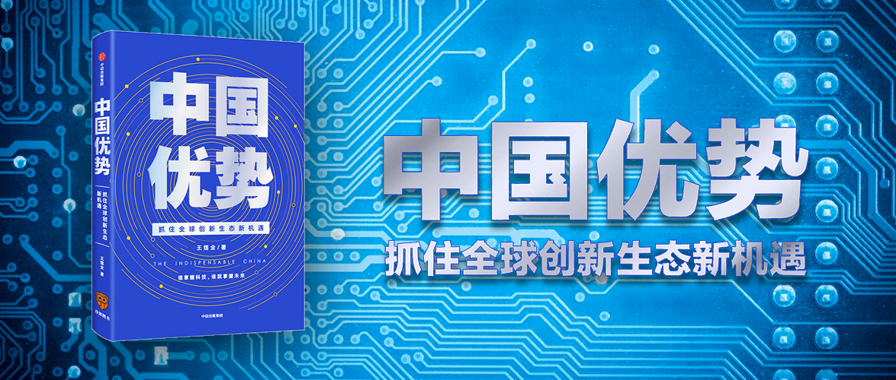

中国优势
==========================

> 

作者：王煜全

序
--------------------------

前言
--------------------------

第一章 今天的科技创新
--------------------------

第二章 科技创新是一条产业链
--------------------------

第三章 创新生态的其他参与者
--------------------------

第四章 中国决定全球创新的未来
--------------------------

后记：行动清单
--------------------------
