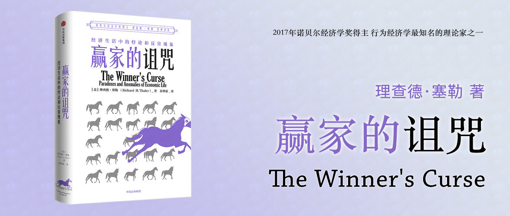

赢家的诅咒
========================================

经济生活中的悖论和反常现象

The Winner's Curse

Paradoxes and Anomalies of Economic Life

[理查德·塞勒（Richard H.Thaler）](https://zh.wikipedia.org/wiki/%E7%90%86%E6%9F%A5%E5%BE%B7%C2%B7%E5%A1%9E%E5%8B%92) 著

高翠霜 译

推荐序一 [梁小民](https://zh.wikipedia.org/zh-hans/%E6%A2%81%E5%B0%8F%E6%B0%91)
----------------------------------------

主流经济学强调理性人和自私，用萨缪尔森把数学推导带进了经济学。但现实中的经济学，并非所有人在所有时候都是理性的，很多因素都可以让最终的行为无法用主流经济学解释。

行为经济学来自于观察现实和实验经济学，对主流经济学中的一些失误进行了补充和发展，使经济学更贴近现实、更接地气。

赢者的诅咒是从作者的13篇专栏中脱胎而来，主要分析经济中的反常现象，与主流经济学的分析和预测不一致的现象，但在现实经济中普遍存在。

推荐序中还介绍了作者的另外两本书《助推》和《“错误”的行为》，《助推》讲的是通过不同的，可以引导人们行为的方法，叫做助推。而《“错误”的行为》，则是回顾了整个行为经济学的发展史，整合了不同学者的观点和发展历程。

推荐序二 [何帆](https://baike.baidu.com/item/%E4%BD%95%E5%B8%86/24172)
----------------------------------------

理查德·塞勒获得诺贝尔经济学奖，这个奖既是颁发给他的，也是颁发给他所在的领域——行为经济学的。

他的三部重要的著作：

- 《“错误”的行为》，反映了理查德·塞勒在学习主流经济学的时候，观察和总结出了诸多“不理性”和“不自私”行为的理论，它从很大程度上对主流经济学的基础提出了质疑。
- 《赢家的诅咒》，讲述了赢家往往变成输家背后的逻辑。
- 《助推》，则提供了一种平衡专制主义和自由主义之间的方法，利用像家长教育孩子的思路，助推某些想要鼓励的行为，从而达到目的。

前言
----------------------------------------

在有许多人竞标的项目中，中标人常常是输家。可见，避免赢家的诅咒的关键因素就是投标人越多，出价要越保守。虽然这看起来可能违背常理，但这才是理性的。然而，大多数人提高了出价。

主流经济学强调人是“理性”且“自私”的。然而，很多时候，人们无法像经济学家一样做到完全理性，像西蒙说的“有限理性”更加普遍。而人们也不一定是自私的，他们在会懂得协作，捐献善款，保持环境卫生，偷税漏税，保险造假等。

在类似，你可以转让的比赛门票的问题时，当你处于卖家/买家不同的立场时，常见的回答是作为卖家的你的出价会比作为买家的你出价高出不少，而按照主流经济学的理论，你的出价应该是基本相等的。

本书对主流经济学的一些批评，是从主流经济学的一些理论上得来的：

1. 米尔顿·弗里德曼认为，即使假设是错误的，只要能够依据理论做很好的预测，也是无关紧要的。也就是说，人们对结果的假设，不会影响理论对结果的预测，如果理论A觉得结果是A，那么不过行为人是如何假设的，结果仍然是A。

而作者发现，撇开假设谈理论的预测准确性是站不住脚的。

2. 人们确实会犯错，但是在解释整体行为时，这些个人错误不是问题，只要这些错误的影响会彼此抵消。

但这个解释也是站不住脚，因为大家观察到的许多背离理性的选择是系统性的——错误偏向同一个方向。

3. 在人们有很强的动机做最优选择的市场中（例如金融市场），“非理性”或“利他主义”都不会对市场产生影响。

而作者发现，金融市场也充满了反常现象。

这本书，当13个反常聚在一起的时候，可能就不是一种偶然，而可能反映了一种模式。

01 合作
----------------------------------------

文章以银行家和福特的对话为开始，银行家代表了理性与自私，而福特代表了福利机构，在这段对话中，极具理性的银行家否认了募捐这种行为的存在，而福特则代表了另外一类人的行为。

许多经济分析——其实是所有的博弈理论——都是从一项假设开始的，就是假设人们兼具理性与自私。著名的囚徒困境和公共产品（搭便车）案例，都是在这个基础上推导出来的。

但是像电视募捐、餐厅付小费、选票，这些案例都证明了人们可能会用合作来替代自私。

本章及下一章，将检视实验所显示的证据，来了解人们何时以及为何会合作。

### 单次博弈的公共产品实验

根据[帕累托最优配置](https://baike.baidu.com/item/%E5%B8%95%E7%B4%AF%E6%89%98%E6%9C%80%E4%BC%98)，假设有n个人，参加公共投资，每个有x元钱，他可以选择投，也可以选择不投，最终公共投资的部分会乘以一个系数k（1 < k < n），然后将这笔钱平均分给n个人。

用帕累托最优配置，则要求，所有人都将所有钱参与投资，因为k大于1，所以最终实现每个人的利益最大化，用公式表示每个人的最终收益：

> `M0 = (x * n) * k / n = k * x `

假设 `x = 5美元`，`k = 2`，`n = 4`，则每个人可以得到`M0 = 10美元`，所有人的总钱数等于`10 * 4 = 40美元`。

现在假设1个人不参与投资，则用公式表示每个人的最终收益：

> 参与投资的（n-1）个人：`M1 = (x * (n-1)) * k / n`
> 
> 不参与投资的1个人：`M2 = x + M1`

假设 `x = 5美元`，`k = 2`，`n = 4`，则`M1 = 7.5美元`，`M2 = 5 + 7.5 = 12.5 美元`，总钱数为`7.5 * 3 + 12.5 = 35美元`（比之前少了5美元），但是不参与投资的人则比参与的时候，要多得`M2 - M0 = 2.5美元`。

而这种情况在经济学上称作[搭便车](https://baike.baidu.com/item/%E6%90%AD%E4%BE%BF%E8%BD%A6%E9%97%AE%E9%A2%98)。

这种搭便车有两种假说：

- 强搭便车假说：所有人都搭便车，也就是没有人参与投资公共品。
- 弱搭便车假说：部分人会搭便车，也就是不是所有人都参与投资公共品。

根据马韦尔和埃姆斯多项实验的结果是，通常公共产品都会达到最优水平的40%～60%效果，而唯一的例外是受试者全部是经济学学生时。

### 重复博弈

上面是单次博弈的结论，如果重复几次呢，就成为重复博弈。有经济学家也进行了实验，在实验一开始，得到了53%的贡献率，和之前的实验结论基本一致，但是在后续的重复博弈中，公共贡献率只剩下16%，也就是大幅下降了。

一个可能的解释是受试者逐渐明白了搭便车的占优策略，所以贡献率逐渐下降，但是这条被证实是错误的。因为实验在引入了有经验的受试者（假设他们已知规律）、明确告知规则、直接相同受试者相同人员组合重复多次重复博弈，**得出的结论都是重复博弈中，贡献率逐渐下降**。

### 互惠式利他主义

本节的结论：互惠式利他主义的逻辑确实可以推导出来，但人们也天然更倾向于合作。

互惠式利他主义，是观察到人们有互惠的倾向（仁慈对待仁慈，合作对待合作，敌意对待敌意，背叛对待背叛），推导出当考虑到其他人对自己的合作或背叛将来可能做出的回应时，搭便车可能在实际上是收益较少的策略。合作的做法本身（或是身为一个合作者的名声）比较有可能获得他人互惠式的合作回应，因此符合合作者的最终利益。

“一报还一报”策略，是基于互惠式利他主义原则最系统性的策略。它证明了互惠型比非互惠型更有利。

互惠式利他主义的内涵之一是，当你的对手在未来没有互惠回馈的可能性时，例如在匿名或是只玩一次的互动状态下，个人在两难的情况下是无法合作的。以下几个实验，都反驳了这一点：

- 单次博弈中，也观察到50%的合作率。
- 基于互惠式利他主义推导出：假设最后一次合作，基于理性应该选择不合作，那么N-1次博弈就应该不合作，依次类推，一开始就不应该合作。——但是实验结果证明，合作率从未降到零。
- 安德列奥尼的实验中，两组实验，一组是固定人员重复5次，一组是不固定人员重复5次，后一组的合作率高于前者。

因此，人们有合作的倾向，除非经验告诉他们互动对象在占他们的便宜，合作才会停止。

### 利他主义

利他主义有纯粹和不纯粹之分，纯粹是指“以他人之乐为乐”的行为，而不纯粹是指“做对的事（好事、有荣誉的事）”，它常被描述为良心的满足，或满足非工具性的道德命令。

在研究搭便车的动机的时候，有因为“恐惧”搭便车的，也有因为“贪婪”搭便车的。恐惧是指如果不搭便车，会遭受损失。而贪婪是指如果搭便车能够获得额外的好处。在实验中，贪婪比恐惧更容易促使搭便车。

如果在实验中引入“讨论”的环节，则将结果引导向“合作”的方向。**群体认同在避免采用占优策略上，显然是一项关键性因素**。研究还表明，只有群体成员全部做出承诺，承诺才和合作有关联，如果只是部分成员承诺，则承诺和合作关联不大。

### 评论

我们既不能假设所有人都有自愿做贡献的倾向，也不能只考虑强搭便车行为，因为不是每个人每次都会选择搭便车。

02 最后通牒博弈
----------------------------------------

### 简单最后通牒博弈

按照最后通牒博弈理论推导，也就是“在A有一笔钱并且可以给B分配一部分，B可以选择保留并两个人都分钱，也可以选择拒绝两个人都没钱”。如果B是一个理性人，只要给的钱大于0，他都应该接受，毕竟这比一分钱都没有强。但是实验的结果反复证明，并非如此，现实中的B可能会因为追求“公平”而选择两败俱伤，同样作为A，也可能为了“害怕失去”而“选择公平”。

### 两阶段议价博弈

两阶段议价博弈，是指AB两个人，A先作为分配者，分配总金额为c的一部分资金（出价）给B，如果B拒绝，则进入第二阶段，简单最后通牒博弈，AB交换角色，总资金由原来的c调整为δc（ 0 < δ < 1 ），即B作为分配者。

根据博弈论理性推导的结论，A的利益最大化出价方案是δc，因为当出价大于δc，则B都会接受，但是越是偏离δc，A所剩余的资金越少，如果A的出价小于δc，则B都可以选择拒绝并拥有分配权，这样就可以分配无限接近于δc的金额，而A将得到无限小的金额。δx这个值也称为精炼均衡。

第一个试验，总资金是100便士，系数δ是0.25也就是第二阶段分配总资金是25便士。实验的结果并不接近理性，经过多次实验，并通过反转AB顺序、提前提示规则等方式，实验结果更接近于精炼均衡点。这可能说明“一旦参与者完全了解博弈的架构后，公平性的考虑很容易被策略利益的计算取代”，也就是，一开始很多受试者都不知道原来还可以通过计算锁定利益最大值，而是习惯性地采用更公平的50%分配方式，但是当他们清楚了规则后，则更倾向于利用策略让利益最大化。

但是这个实验结果很快在其他实验中遭到挑战，当告知规则的方式、设定分配者的方式、以及调整δ的大小（比如0.1或0.9），都会影响到实验的结果。

### 多阶段博弈

在多阶段博弈的实验中（五次/十次），博弈论和实际的出价并没有相关性，或者说，人们并没有按照博弈论进行出价。

实验还证明了，受试者的效用函数中有金钱以外的参数（类似那种“两败俱伤”宁可不拿钱或者少拿钱，也要拒绝）。

实验还证明了，那些平均要价最高的参与者，其平均收益是“最低的”。

### 市场上的最后通牒博弈

人们抵制他们认为不公平分配的意愿，在经济学上有超越议价理论的启示。

- 过低的工资；
- 消费者剩余被压缩到最小：几乎等于愿意支付的最高价格；
- 相同商品在不同价格均衡值时候的成交表现：高档酒店/杂货铺卖同样一瓶啤酒，价格均衡值不太一样，但是成交价却不同；

每当卖方与买方有持续关系存在且市场出清价格（全部卖出）被认为是不公平的高时，卖方会有动机将价格降到均衡价格之下，以保住未来的生意。也就是卖方出价太高，就卖不出去了，于是就不断降价，直到刚好卖出去，这时候就达到均衡价值。但是售价如果过低，低于均衡价格，需求就会大于供给，因此出现黑市，黑市的价格会反映出均衡价格。

### 评论

- 标准化理论：告诉我们，一个理性的主体应该会做什么。
- 描述性理论：告诉我们，经济个体实际上是如何去做的。
- 指示性理论：在我们面对自己认知上或是其他方面的限制时，建议我们要如何做。

传统的博弈论是“标准化理论”，假定人们都是自私理性的，而且都能算明白所有的逻辑，并且只关注收益最大化。

但是事实上，实际的结果是，除了收益，人们也关注公平、也可能算不明白博弈规则、也可能受到贪婪的影响，还有很多其他我们可能无法一一列举的因素，包括进行博弈的场景变化，都可能会影响到博弈的结果，而这些都是“标准化理论”没有办法解释的。

03 跨行业工资差异
----------------------------------------

一价定理告诉我们，如果市场运作良好，且没有很大的交易成本或运输成本，同样的物品无法以两种不同的价格出售，因为所有的买方都会到价格较低的市场去购买，而所有的卖方都会到较高的市场出售。很快地，不同的价格必会趋向一致。

但是在劳动力市场，同一个人到不同行业、不同职位、相同职位不同公司等都有较大的工资差异，这是违反一价定理的，但是却普遍存在。

### 事实

通过对“[当前人口普查（CPS）](https://en.wikipedia.org/wiki/Current_Population_Survey)”数据的大数据分析，发现历史上，跨行业的工资相关系数很高，也就是，某些行业工资就是高，某些行业工资就是低，同时对于不同的职位在不同行业中，也明显地受行业的影响，比如同样是秘书，矿业的就比皮革业的秘书要贵。

### 可能的辩解

辩解1：雇主愿意支付更高的工资来补偿相同岗位的员工维持付出的更多，所以工资更高，比如矿业的员工工资高于均值，反驳理由如下：
- 在原有回归方程中增加了一些数据纬度，像工作时长、危险程度等，结果并没有什么影响。说明矿业的秘书并不是因为危险而享受更高的待遇。
- 高薪行业的跳槽率更低：说明他们跳槽的机会成本更高

辩解2：高薪行业所雇用相同职位的人员素质更高，所以工资更高。反驳理由如下：
- 在原有回归方程中增加代表素质的变量，如教育、工龄和年龄等，产业工资差异的标准差仅下降1%。当然除了这些可代表素质的可测量指标外，可能还有一些不可测量的软实力没有被统计进来。
- 为了确认不可测量的软实力对于工资的影响，多项实验尝试用转行业的员工数据来分析，为了降低“选择性偏差（主动跳槽）”，还尝试用了“非自愿离职（被动跳槽）”的数据来修正偏差，这些实验的结果是，行业对工资的影响较为明显。但是另一项相似的实验中，只有1/3的数据支持这个观点。因此这些互相矛盾的研究，无法证明“不可测量素质”对于行业工资差异的影响。但是另一项关于智商和工资之间的调查研究结果表明二者之间存在负关系，也就是智商高的工资不一定高，倒是反证了不可测量素质（这里指智商）与产业工资之间没有明确的关系。

### 哪些行业工资高？为什么？

研究人员找到四项似乎可以与薪酬水平相关的产业特征：
- 公司规模；
- 支付能力：即企业的市场力量（这里用“四企业集中率”）或是获利能力（盈利能力）；
- 利润及市场垄断势力；
- 资本密度：高资本劳动比率的产业倾向于支付较高的工资；
- 工会密度：即产业内员工属于工会成员的百分比；

但是以上这些更多是相关性，而不一定是因果关系。

### 理论上的解释

1. 企业选择放弃利润最大化：也许是代理理论作祟，经理人放弃股东利益而选择给员工发放高工资。
2. 高工资企业发现降低工资会造成利润减少，这种被称为“效率工资模型”有四种类型：
    - 偷懒模型：工资高，偷懒少，因为可以监督、开除、剥夺经济租
    - 人员流动模型：同偷懒模型，工资高，流动性差
    - 逆选择模型：工资高，员工素质高，反之亦然
    - 公平工资模型：和员工分享经济租，有利于让员工相信这是公平的，进而员工会更努力
3. 集体行动的威胁：工会密度高的企业，可能会产生工会威胁。但研究表明，这条并非决定因素。

### 评论

在之前提到的各项可能的原因中，都有难以证明的部分，缺乏实证基础或者无法检验。

结论：产业工资模型是很难理解的，除非我们假设企业在设定工资时，关注到了员工对公平的感受，而这是一个只有经济学家才会发现其争议性的假设。

04 赢家的诅咒
----------------------------------------

在多人投标的场景中，往往会出现赢家的诅咒现象，要么中标物价值低于中标金额，要么中标者所中标物所带来的利润不及预期。

### 实验证据

通过多项实验室实验，证明赢家的诅咒总是存在。

当投标方增多的时候，更容易产生赢家的诅咒。

通过反复实验，受试者中极少人会进行学习来避免诅咒，至少证明了通过学习是很困难的。

另外通过将受试者身份从学生换成有投标经验的工程师，也难以避免，一种可能是因为实验场景和真实场景不同，在真实场景中，很多经验可以帮助他们避免诅咒（比如说特定的行业）。

### 实地资料

通过复盘历史资料，对离岸石油及天然气租赁以及企业并购的数据进行分析，前者的大量数据证明收购方通常无法赚回其支付的成本，而企业并购中，收购方即便有获利的情况下，也获利极少。

### 评论

理性人是经济学中的一个假设，而非事实，因此实际情况中我们不能排除人们犯错和已知某种理论。

即便是投标人已经知道了赢家的诅咒，他们为了赢得投标可能也不得不按之前的方法投标，否则他可能根本无法中标。为了既能中标也能获得足够的利润，更有效的方法可能是将这些新的理论分享给竞标对手，让大家避免陷入价格恶性竞争中。

以卡彭等人的话为本章做总结：“对一块他认为值得投资的土地来投标，长期而言，这个人将会损失惨重”。

05 禀赋效应、损失规避及现状偏见
----------------------------------------

禀赋效应（塞勒）：人们在出售一样东西时的要价常常会远高于他们获得此物时所支付的价格。

现状偏见（萨缪尔森和泽克豪斯）：对现状的偏好。

损失规避（卡尼曼和特沃斯基）：放弃一项物品的效用损失大于得到它所获得的效用。

### 禀赋效应

克内齐和辛顿的实验，显示出拥有者不愿意放弃他们的东西（以他们拥有成本的标价），而不是买方不愿意放弃他们的现金进行交易。

### 交叉的无差异曲线

两条无差异曲线是不会相交的，无差异曲线是可逆的。无差异曲线大致的意思就是你可以用x来换y，也可以用y来换x，这二者之间没有差异。但是如果损失规避出现，从x换成y的过程中，就出现了“愿意”这样的变量，同一个x换成y就会出现两条相交的曲线。

实验证明了，一开始先拿到x的受试者更不愿意放弃x，但是用调查的方式并不能发现它们更喜欢x，它表现为不是在强化拥有的物品的吸引力，只是强化了放弃它的痛苦。换句话说，就是当你拥有了x，即便你不一定很喜欢，但是你也不愿意失去它。

### 现状偏见

个人有强烈的维持现状的倾向，因为失去现状的弊大于利。多项实验都证明了这一点。

### 损失规避

风险性选择研究的一个中心结论就是，对这些选择的最佳解释是假设效用的重要载体并不是财富或福利状况，而是对于中性参照点的变化。另一个重要结果是，这些变化所带来的损失比现状的改善或所带来的收益更大。

而且损失规避通常不会出现在所有的交易中，而只会出现在那些原本想要买来使用的人身上，如果你本来就是经销某种商品，只要价格合适通常不会产生损失规避。

### 强化的损失规避

有些买价与卖价之间的不对称性实在是太大了，我们无法用普通的损失规避来解释。

比如一些风险涉及到死亡、环境彻底破坏、以及一些原则性问题上，甚至有很大一部分人会要求支付“非常大或无限大的补偿金”，甚至直接拒绝进行交易。

### 对公平与公正的判断

禀赋效应的一个含义是，人们看待机会成本不同于“从口袋中掏钱”的成本。比起感受到的损失，你放弃掉的收益所造成的痛苦还比较少。

额外收费（顾客可能认为是一种损失）被认为比取消折扣（利益的减少）更不公平。这种区别解释了为什么那些向付现金的顾客收取一种价格，而对刷信用卡的顾客收取较高价格的公司总把现金价说成折扣，而不是把信用卡价格作为额外收费。

### 评论

必须要放弃“偏好次序是稳定的”这个重要观念，将次序改为支持决定于目前的参考水平的偏好次序“。

在评估结果时决定参照点的因素很容易理解：现状的角色以及权利和预期的角色，必须要建立起来，使得这些因素可以在做特定分析时，用来确定相关参照水平。

06 偏好反转
----------------------------------------

> 百度百科：偏好反转(Preference Reversal)是由心理学家Lichtenstein 和 Slovic于1971年发现的风险决策中一种奇怪而普遍的现象，即在期望值大体相等的一对博弈中，人们往往选择概率高而损益值小的博弈(称为安全博弈)，却对概率低而损益值大的博弈(称为风险博弈)定高价，也就是说人们在选择与定价中表现出偏好的不一致现象。大量的实验证明偏好反转广泛存在于人们的经济行为中。

特沃斯基、斯洛维克和卡尼曼的研究可以总结如下：

1. 不可传递性本身只占了偏好反转模式的一小部分。
2. 偏好反转不太会受到报酬计划的影响，因此不应归责于预期效用理论的失败。
3. 偏好反转最主要的原因是程序不变性的失败，更准确地说，是对赌局L（概率较低但是收益更大的赌局）的定价过高。也就是说，与赌局L有关的最低出售价格（与赌局H无关），相较于赌局与现金数量之间的选择太高了。

### 相容性假说

“刺激-反应相容性”的观念，是由研究直觉与运动神经功能的学者提出的。例如，排列成四方形的四个燃气灶上的燃烧器，其控制钮如果排成和燃烧器一样的四方形，将会比排成一排更容易操控。斯洛维克、格里芬和特沃斯基延伸了这个概念，并提出刺激因素在判断或选择上的权重，会因其“反应尺度”相容性而提高。它包含两个方面：

1. 如果刺激与反应无法搭配，就需要额外的心理操作让两者能对应上。这样会增加工作量及错误，且可能会降低刺激方案的影响。
2. 反应模式倾向于将注意力集中在刺激方案可以相容的特性上。

基于这个理论人们进行了各项测试，并发现了“内容”权重对于“选择”的关系。

- 选择：人们会根据重要性排序，来决定选哪个，比如“人类生命”显然很重要。
- 定价：人们会根据等价现金值进行排序，而对于小概率事件的定价过高，会导致偏好反转的发生。

### 评论

偏好反转不能单单归因于不可传递性或违反预期效用理论的独立性公理。它似乎产生于选择与定价之间的不一致，而这种不一致则是由度量尺度的相容性诱发的。

本章所提到的实验结果显示上述两种情况都不成立：

1. 人们不是对所有的状况都有一套预先确定的偏好。其实，偏好是在做选择或判断的过程中建立起来的。
2. 做选择或判断时的情境及程序，会影响偏好反应。

这意味着，行为可能会因情况而不同。偏好是依赖不同情境逐步建构起来的。

偏好反转说明了，人们不可能完全按照理性人的行为模式去运行，因此传统经济学的很多推导可能在现实中并不成立，人们的行为、价值偏好，在不同的情况下都可能不太一样。

07 跨期选择
----------------------------------------

对那些涉及不同时期的现金流（收入及支出）的选择，经济学理论做了精确且可以检验的预测，及（对于边际收入及支出）人们应该以（税后的）市场利率（r）贴现现金流。

但是有很多社会现象却是违反这条理论的，比如：

- 套利现象，如收益率12%，可以借10%利率来套那2%，那么只要有人肯借，理论上就不会再出现<10%的利率出现了，可事实上，什么利率都有。
- 政府通过调整税率（降低税点），实行退税，实际上这个行为等于无息向民众借款。——贴现率是负数
- 教师更多选择按12个月领取工资而不是9个月（总数一样），正常情况下多出的3个月贴现率为负数。（消费活动倾向于随着时间的推移而增加）
- 学生会因为政府强制吊销驾照而选择不辍学，但是却对辍学拿不到毕业证熟视无睹。拿到毕业证显然应该是贴现率更高的事情，但是学生却选择了贴现率更低的事情作为决策依据。
- 晒太阳容易增大皮肤癌对于患者来说不太关心，但是如果告知他们晒太阳会使毛孔变粗，他们却会很紧张，前者显然贴现率更高，但是人们更倾向于在意后者。
- 使用低效率的电器，比如节能等级较低的电器，从实际的理论推演上显得更不经济，但是实际上选择不节能的电器的用户更多一些。这也是违反理论依据的行为。

在实验室及实地决策环境中观察到的贴现率，都取决于以下因素：

- 被贴现金额的大小（强度）与正负值（收益或损失）
- 时间延迟
- 必须立刻做选择还是可以延迟
- 所设计的选择方法
- 未来的收益或成本会带来享受或是恐惧

### 个人贴现率的变化

通过实验控制三个最关心的变量：等待的时间长度，结果的强度，结果是收益或是损失。得出下面三种贴现率变动模式（实验贴现率是固定的情况下）：

- 动态的不一致性：随着时间的长短不同，贴现率所感受到的效用是不一样的。出现这种现象的原因可能是，人们感受上贴现率随着时间出现了递减，导致两条效用函数相交。
- 强度效应：隐含的贴现率均随着购买金额增加而大幅下降。例如人们会愿意为了100块钱半年后给150块钱而等待半年，但是却不会原因为10块钱半年后变成15块钱而等待半年，即便二者理论上的贴现率都是一样的。可能的原因是：
    - 人们不止对变化率有感觉，还对绝对值有感觉。
    - 人们可能把不同的金额大小放进了不同心理账户，比如一个是消费账户一个是理财账户，而因此而放弃的机会成本等于是“做了一次消费”或者“损失了一次利息”，如果受试者对后者更敏感，就会出现上述现象。
- 符号效应：收益的贴现率大于损失的贴现率。也就是如果受试者尝试投资，如果要半年时间拿到收益，他们会希望能拿到较多的收益，因此要求贴现率较高。但是如果是缴纳罚款这样的损失场景，即便等待一段时间（假设是半年）需要缴纳滞纳金，哪怕只有一点点，人们也倾向于尽快缴纳，因此要求贴现率较低（滞纳金较少）。

### 参照点

决策者并不像期望效用理论所设想的那样，把最终结果整合进他们的财富或既有的消费水平中来考虑（贴现率思维）。反倒是，相对于自然参照点，个体似乎将事件当成一种变化来做出反应（从某个参照点出发预估未来）。

基于实验得出两个原因用来解释“人们偏好逐渐增加的消费模式”：

1. 损失规避：损失规避会导致对特定消费模式的偏好。当过去的消费水平成为未来消费的参照点时，在这种情况下，个人可能偏好逐渐增加的消费模式。以下例子说明了这一点：
    - 人们倾向于把好吃的放在后面，先吃不太好吃的。（法国餐和希腊餐的问卷）
    - 工资随着年龄增加而上涨，但是生产率并没有同步提高。原因在于人们更偏好这种模式。就像理论上在总工资不变的情况下，递减的工资实际上优于递增的工资，但是人们总是偏好于递增的工资。
2. 成本较高的自我控制：也就是人们希望借用这种未来比现在贴现率递增的收益，将收益放在不可预期的未来，以实现自我控制，就像是一次性把钱都给你可能你就花完了。
    - 他们不能指望自己从固定（或逐渐降低）的收入模式中积累足够的储蓄，去支付想要的渐增式消费模式。

### 享受与恐惧

标准的贴现效用模型假设贴现率是固定值且通常是正的。而实验证明，人们偏好延迟实现收益或是提前实现损失。我们用“享受”（savoring）这个词来代表从预期未来喜悦的结果所产生的正效用，而“恐惧”（dread）则代表未来不悦所产生的负期望。

这可能来自于：

- 享受：不是立刻马上，而是稍等片刻，是为了享受那份期待。
- 恐惧：让恐惧来的更早点把，省的遭受长期的焦虑煎熬。

### 评论

在宏观层面，跨期选择的心理学使得原本就很复杂的社会贴现率的选择问题，更加复杂。这种复杂性来自于人们对于时间上的贴现率的估计是变化的。

决策心理学的研究，可以成为传统经济学的补充，用来修正传统的效用函数，让它可以符合一些事实上的规律，是有建设性的。

08 储蓄、可替代性及心理账户
----------------------------------------

在经济学里，标准的储蓄模型称为“生命周期理论”，它回答“假设一个人不打算留下任何遗产，且认为每一段时期的消费，价值都相同。这样的一个人在某个特定的一年中，应该要消费多少？”。

答案：在任何一年，计算金融财富的现值，包括目前的收入、净资产、未来收入的预期价值，算出可以购买的平均年金，然后年消费量就是以这笔年金获得的收入。

但是与之相反的实证证据大致分为两类：

1. 消费对收入似乎过分敏感。整个生命周期，年轻人和老年人看起来都消费得太少，中年人则消费得太多。
2. 同样地，消费的年增率与收入的关联太高，与模型不符合。其次，不同形式的财富看起来不像模型所主张的有那么高的替代性。尤其是，家庭单位的养老金或是房屋净值的“边际消费倾向”与其他资产相较是非常低的。

实证与理论模型预测不一致的问题，有几个可能的解释：

1. 人们没有足够的理性来计算现值及养老金收入。
2. 过分理性或是利他主义，把继承人的财富也纳入计算。
3. 流动性的限制使得人们无法达成生命周期计划。

“可替代性”假设可用来解释我们观察到的许多储蓄的反常现象。

可替代性的观念是说金钱没有标记。

在生命周期理论的概念中，可替代性假设使得财富的所有组成成分都可以整合为一个数字。也就是说你通过赌博或者股票赚来的相同数量的钱，消费倾向是一样的。

产生偏误的第一种原因可能是：人们通常有一套“心理账户系统”。一个简单的样子是：

1. 目前收入账户C：边际消费倾向接近于1
2. 资产账户A：边际消费倾向为0～1之间
3. 未来收入账户F：边际消费倾向为0

产生偏误的第二种原因可能是：（跨期选择中）短期贴现率超过利率，导致自我控制力失控，而生命周期理论假设人们执行计划的时候意志力超强。一种方式就是采取无法反转的行动，比如加入养老金计划、或购买终身保险。另一种方式就是强制自己的行为，如强制自己储蓄。

总而言之，上述家庭单位可以被想成是遵循以下审慎法则：

1. 量入为出：不从F或A账户借钱来增加目前的消费。
2. 保留收入的某部分以备不时之需。
3. 以不需太多自制力的方式来储蓄退休金。

### 目前收入账户：消费取决于收入

消费水平对于目前的收入太敏感了，以致不符合持久收入假说。

无论研究的是所谓的低频决策（因而形成了终生消费曲线），或是高频决策（每年消费水平的平滑线）。

### 终生消费曲线

生命周期理论：

- 一个小丘形状的年龄——储蓄曲线。收入低于持久收入的年轻人，会借钱来消费；中年人会为退休做储蓄；老年人则是负储蓄的，靠过去的储蓄来消费。
- 持久收入水平不变时，消费曲线的形状应该与收入曲线的形状无关。

然而以上两项都有反例。实验证明，消费曲线和收入曲线关系密切。

一个国家的消费增长率主要决定于利率水平。

### 短期储蓄

生命周期理论及持久收入假说都意指，逐年的收入变化会被平滑化，以致消费会占持久收入的一个固定比例，而非目前收入的固定比例。

而实际上实验证明了下面情况是存在的：

- 年消费对目前收入似乎是极度敏感的
- （某项数据揭示）只有当收入到账后才会对消费产生影响，而不是当收入预期发生的时候就影响消费。

### 收入、奖金及意外之财的来源

如果奖金及意外之财占收入的比例较小，边际消费倾向通常比较高。反之，如果占比较大，而且是整钱形式给的话，则边际消费倾向通常比较低，也就是更可能用于储蓄。这一点用传统经济学视角推导不出来，它来自于心理账户模型，前者会被放入收入账户，用于消费，后者会被放入资产账户，用于储蓄。

### 财富是可替代的吗？

对于大多数的家庭而言，财富包括三种组成：未来收入、养老金及社会保障财富、房屋净值。

### 养老金财富

养老金和其他储蓄类的财富并不是替代关系，并不是养老金越多，其他储蓄就越少，实际上，养老金越多，其他储蓄也会越多。

同样的情况也发生在个人退休账户上，个人退休账户可以获得政府一部分的退休减免，如果它和其他储蓄资产之间有替代关系，那么总储蓄应该是不变的。但是实际上总储蓄是增加的。一种可能是购买退休账户是为了避税，同时因为退休账户如果提前动用要额外交税，所以它变成了一个“禁区”，因此人们还会增加其他方面的储蓄，进而导致总储蓄值的增加。

### 房产

在标准生命周期模型中，房屋净值是可替代的。按照这套理论，房屋净值越高，其他储蓄可能就越少。但是实际情况却相反，数据显示拥有房屋的家庭的储蓄更高。

另一个评价可替代性问题的方式，是对房屋财富的边际消费倾向做估计。研究显示出系数接近于0，也就是房屋净值的高低与有是否消费关系不大。（你家房子贵不贵和你是否决定去消费关系不大）

一种可能的解释是如果住房价格上涨，大家为了能够让孩子能够买得起房，而选择性储蓄。但是这样的行事风格和有没有房其实关系不大，如果住房价格上涨，为了代际传承，大家都会选择多储蓄。

另一个反常现象是老年人的储蓄消耗的不太快。这个一部分原因来自于他们的收入决定了消费倾向，理论上他们可以通过降低他们的房屋净值（比如卖掉贵的房产换成便宜的房产）进行消费，但事实上他们并没有这么做。最后的结论是，典型的老年人家庭并不想要降低他们的房屋净值。

### 流动性限制或是债务规避？

房屋抵押贷款的利用率并不高，人们不倾向于将房屋抵押出去获得贷款用于消费，与此类似的还有终身人寿保险，它们通常可以被用作抵押贷款，而且利率比国库券的短期利率还要低，看起来这里有套利空间，但实际上利用率低于10%。

人们可能受银行等资本市场的流动性限制，但也有可能是因为人们并不想因此陷入债务。

### 评论

即便理论经济学可以完整描绘储蓄的科学做法，但是消费者仍是普通人，它们没有因此而变得更理性，它们仍然有诸多用理性经济学无法解释的行为。

09 博彩市场
----------------------------------------

10 股票市场的日历效应
----------------------------------------

11 华尔街股市上的均值回归
----------------------------------------

12 封闭式共同基金
----------------------------------------

13 外汇
----------------------------------------
