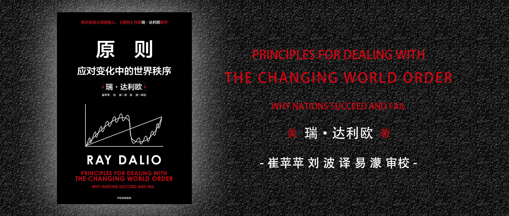

# 原则：应对变化中的世界秩序

作者：瑞·达利欧

## 引言

## 第一部分 世界是如何运转的

### 1 大周期简述

### 2 决定因素

### 3 货币、信贷、债务和经济活动的大周期

### 4 货币价值的演变

### 5 内部秩序和混乱大周期

### 6 外部秩序和混乱大周期

### 7 从大周期的角度思考投资

## 第二部分 500年世界发展史

### 8 过去500年简述

### 9 荷兰帝国与荷兰盾的大周期兴衰

### 10 大英帝国和英镑的大周期兴衰

### 11 美国和美元的大周期兴衰

### 12 中国和人民币的大周期兴衰

### 13 中美关系和战争

## 第三部分 未来

### 14 未来
