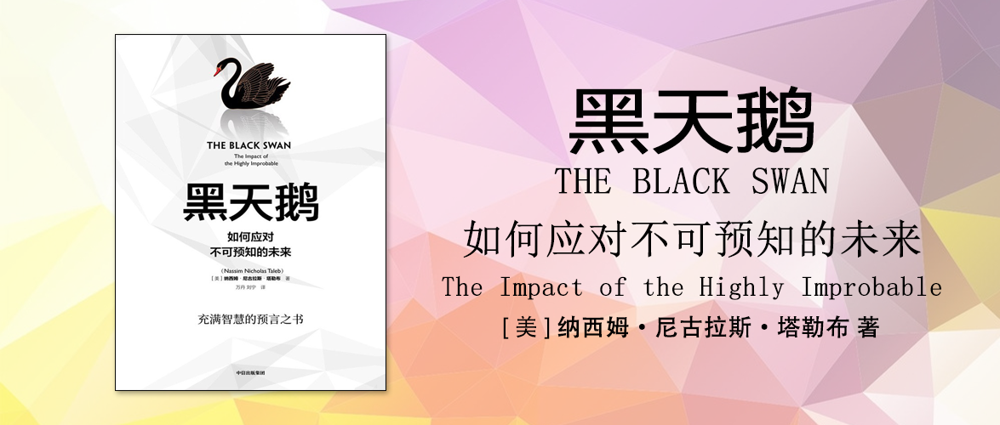

黑天鹅
========================================
The Black Swan

如何应对不可预知的未来

[美]纳西姆·尼古拉斯·塔勒布（Nassim Nicholas Taleb） 著

万丹、刘宁 译

序言
------------------------------------------------------

我们的世界是由极端、未知和非常不可能发生的（以我们现有的知识而言非常不可能发生的）事物所主导的，而我们却一直把时间花在讨论琐碎的事情上，只关注已知和重复发生的事物。这意味着我们必须把极端事件当作起点，而不是把它当作意外事件置之不理。即使我们取得了知识上的进步和成长（或者正是因为这种进步和成长），未来仍会越来越不可预测，而人性和社会“科学”联合起来向我们隐藏了这一点。

第一部分 极端斯坦与黑天鹅现象
------------------------------------------------------

第一章 自我欺骗的人类
------------------------------------------------------

> 历史和社会不是缓慢爬行的，而是在一步步地跳跃。它们从一个断层跃上另一个断层，其间极少有波折。而我们（以及历史学家）喜欢相信那些我们能够预测的小的逐步演变。我们只是一台擅长回头看的机器。

关于战争人们总是有着自己的各种预判，但事后看来很多预判都是错的，相比于那些描写历史的文章，那些日志类的文章更多还原了历史现场的情况，对比事前和事后，我们可以看到很多时候人们总是高估自己对于未来的判断。面对金融危机也是一样的，人们总是无法预知下一秒会发生什么，然后很多历史性的时刻就出现了。

第二章 出版业中的黑天鹅
------------------------------------------------------

> 曾被断言只能卖出10本的书，却销售了数百万册、被翻译成40种语言。

叶夫根尼娅，用自己特立独行的写作风格完成了一本编辑不看好的书。后来得到了一个小出版社的发现，后来她写的书销量超百万册，并且写作风格自成一派。她的书自身就是一只黑天鹅。

第三章 极端斯坦与平均斯坦
------------------------------------------------------

> 在理想的平均斯坦，特定事件的单独影响很小，只有群体影响才大；在极端斯坦，个体能够对整体产生不成比例的影响。极端斯坦能够制造黑天鹅现象，少数事件已经对历史产生了巨大影响。

平均斯坦的最高法则：当你的样本量足够大时，任何个例都不会对整体产生重大影响。最大的观察值虽然令人吃惊，但对整体而言最终微不足道。

平均斯坦里，随机抽取100个样本，可能就可以了解到整体的情况，但是在极端斯坦里，则不可以，单一样本对于整体的影响太大。

平均斯坦受到这些事件的统治：

- 集体事件
- 常规事件
- 已知事件
- 已预测到的事件

举例：高度、重量、卡路里摄入量、面包师、小餐馆老板和牙医的收入、赌博收入（假设在特殊的情况下，某人去赌场只赌固定的筹码）、车祸、死亡率、智商（测出来的）、

极端斯坦受到这些事件的统治：

- 单个事件
- 意外事件
- 未知事件
- 未预测到的事件

举例：财富、收入、单个作者图书销量、名人知名度、谷歌搜索量、城市人口、词汇表中某个单词的使用量、每种语言的使用人数、地震造成的损失、战争死亡人数、恐怖事件死亡人数、行星大小、公司规模、股票持有量、物种之间的高度差异（比如大象和老鼠）、金融市场、商品价格、通货膨胀率、经济数据。

第四章 1001天——如何避免成为失败者
------------------------------------------------------

> 某件事情前1000天的历史不会告诉你第1001天的任何信息。

一只火鸡在被饲养的前1000天都按点进食，进食的天数越多，基于归纳法它所获得的确定性和安全感越强，知道第1001天被宰了。对于火鸡而言，这一天没有来送食物就是它的黑天鹅，但是对于主人而言这一天是计划内的，因此黑天鹅也是笨人的问题。

古代怀疑主义者对火鸡问题也有相似的一些观点。

黑天鹅的问题在于，把现有信息一般化的困难，或者说从过去、已知和已观察到的东西中学习的困难。而我们又不是生活在平均斯坦之中，我们不可避免会遇到黑天鹅，因此我们不能把问题藏起来，我们应当对其进行更深入的挖掘。

第五章 不能只靠过去的经验来判断
------------------------------------------------------

> 我们的环境比我们意识到的更为复杂。为什么？现代世界是极端斯坦，它被不经常发生及很少发生的事件所左右。它会在无数白天鹅之后抛出一只黑天鹅。

过去的经验会不自觉地让我们形成一种认知，把经验错误地当作知识。人们还经常犯把“所有天鹅都是和白色的”等价成“非白色的事物都不是天鹅”的错误。而且我们继承了人类起源地生存的足够本能，但这些本能显然不适应当前全新的复杂的、高度信息化的环境。

第六章 叙述谬误
------------------------------------------------------

> 我们习惯于在一个黑天鹅现象发生之后，立即忘记所有黑天鹅现象的存在，因为它们太抽象了，相反，我们只注意到容易进入我们思维的精确而生动的具体事件。

叙述谬误指的是我们无法在不编造理由或者强加一种逻辑关系的情况下观察一系列事实。对事实的解释会与事实混在一起，使事实变得更容易被记住、更符合道理。这种倾向的坏处在于它使我们以为对事物有了更好的理解。

人们为事实找原因做归纳，其实是个生理行为，受到多巴胺水平的影响。像新闻记者这样的行业在写作的时候多巴胺水平越高，可能附加的“归纳原因”越多，越容易不自觉地为事实找原因。

10万个字的随机文章，和由一句话重复到10万字的文章比起来，前者信息量极大且难以记忆，而后者则比较简单，记住那句话就行了，而后者就是使用了模式。信息越具有随机性，事物就越复杂，因而越难以概括。你越概括，让事物越有条理，随机性就越低。因此，正是我们的简化行为使我们以为世界的随机性比实际上小。而黑天鹅现象是我们不去简化的事物。

叙述的定义和功能：容易记住，并可以把它告诉别人。一本好的侦探小说的评判方法，可以是给谁是凶手估计概率，而加总后的概率可能会高于100%，加总后的概率之和越高，说明小说写得越好，但这也说明了叙述会影响人们对概率的错误估计。

人们的记忆并不是一成不变的，而总是倾向于记住最近发生的事情，并修改过去的回忆。对于一件事的不同的叙述方式，会影响我们对这件事的理解，并做出不同的解释。而这些解释相互之间可能是矛盾的。要避免叙述谬误，可以通过提出假设和进行检验的方法来做到。

人们还喜欢把毫不相干的两件事，解释成因果关系。比如萨达姆·侯赛因被捕，彭博新闻社发了头条《美国国债价格上涨；萨达姆被捕可能不会抑制恐怖主义》，而后美国国债价格下跌，又改口《美国国债价格下跌；萨达姆被捕激发了风险资产的吸引力》。而实际上的原因只是美国国债价格本来就是全天不断波动的。这种情况总在发生：人们提出一个好原因，好让你接受一则新闻。当你没有充分了解一个人的情况下，可能这个人的国籍等信息会成为你判断它的主要标准，而实际上，可能这个人的性别比他的国籍对它的影响会更显著，而你仍倾向于用国籍来描述。

人们对于一件事的不同的叙述，会带来对于概率的不同的错误估计，人们总是高估了叙述中的黑天鹅现象，低估了无人提及的黑天鹅现象。比如跌落井底的孩子牵动全球关注，而另一边的战争带来的死亡却无人问津。中央公园死过人的叙述让你不愿意踏入，而实际上这是个极小的概率。你知道骑摩托车危险但是你身边的朋友都在骑摩托车并没有发生事故，因此你并没有感到过分担忧。

用系统1（经验模式）和系统2（认知模式）来解释，是因为我们不得不使用系统1来做出大量的判断，但它是偏情绪化的，因此容易出现偏差。

避免叙述谬误的办法就是强调实验而非讲故事，强调体验而非历史，强调客观知识而非理论，另一个方法是预测并记录预测的结果。

第七章 活在希望的小屋里
------------------------------------------------------

> 世界上有两类人，有的人就像火鸡，面临巨大的灾难却不知情；有的人正好相反，他们等待着让别人大吃一惊的黑天鹅事件发生。

人们习惯于采用线性思维，比如每天坚持学习就希望能够持续获得回报，但事实是经常很长时间没有什么进展。每天做学术研究，就希望能够有重大发现，但这一天也许大概率永远都不会出现。

在面对人们的这种期望时，确定性的小反馈比一次来个大惊喜要让人觉得更有幸福感。同时，人们对成功的渴望不如对失败的恐惧，人们更容易记住那些失败的。在一个短暂的时期里经历全部痛苦胜过在很长的时间里慢慢体会这些痛苦。

在《鞑靼人的沙漠》中，主角德罗戈本可以只去要塞驻守边疆4个月就可以申请返回都市，但是在4个月到来的时候，他选择了留下继续驻守。它开始幻想敌人出现后成为英雄的那一刻，但直到濒死都没有等到那一天。这个故事大概也表现出了人们等待黑天鹅的过程，以及黑天鹅的罕见。使得德罗戈坚持下去的理由之一是有一群和他志同道合的人，因此，如果你从事一个依赖于黑天鹅事件的职业，那么加入一个群体是更好的选择。

证券交易就是一个类似的行业。你在很长一段时间里每天损失一点点，直到某个事件发生，使你获得不成比例的高回报。没有哪个单独的事件能够使你惨败，另一方面，某些变化却能够为你带来足以弥补几年、几十年甚至几百年的小损失的巨大回报。当然，有可能这个巨大的回报和本章的标题一样，只是存在于希望之中。

第八章 永不消失的运气——沉默的证据
------------------------------------------------------

> 进化是一系列侥幸的成功，有好的，但许多是不好的。你只看到了好的，然而在短期内，那些真正对你好的并不明显，当你处在会产生黑天鹅现象的极端斯坦环境下时尤其如此。

沉默的证据问题，是指在我们看到现在幸存的样本的时候以为这些样本就是事情的全貌，而忽略了那些已经消失的样本。历史上的失败者（相对于成功的名人）、淹死的拜神者（相对于幸存者）都是很好的例子。

腓尼基人的文字因为失传而导致人们认为腓尼基人没有文化，那些被出版的作品也不过是侥幸获得了出版，甚至那些名作，也可能只是因为最初有人出版了它慢慢地得到了大家的认可，至于是不是真的有那么好，其实也说不清楚。

使那些成功者区分于失败者的，不是那些成功的品质，如勇敢、富有冒险精神、乐观等，因为失败者也有，真正使两者不同的最主要因素只有一个：运气。

那些我们对于罪犯的描述也都习惯于将绳之于法的罪犯进行画像，却忽略了那些没有被抓的。对于不同类型运动员身材的描述，也容易错误地颠倒因果，是因为身材适合于某项运动，才显得更具特征，而不是因为从事某项运动而改变了身材。

一些慈善形式可能看起来比较令人感动，但实际上比这些慈善行动更需要帮助的人比这些还需要帮助，只是因为这些有了更多的媒体报道、社会效应等。一些药物存在副作用，而被禁止使用，也是相同的道理，救活一个人只是统计数字，伤害一个人则是奇闻逸事。统计结果常被人忽略，奇闻逸事则显而易见。同样，黑天鹅事件的风险常被人忽略。

一些人总是会高估自己化险为夷的能力，但殊不知其实只是因为一群人总有人会赢得最终的胜利，人类存活至今不是因为人类有什么特殊的神明庇护，而是因为一连串随机事件。人们倾向于给最终的幸存找到原因，但却忽略了大部分幸存不过只是偶然事件，人们也常常将这种错误的认知用于职业的选择认为既然自己是天选之子，那么自己去创业可能会有超能的力量。

我们是寻找原因的动物，习惯于认为一切事情都有确定的原因，并且把最明显的那一个当作最终解释。但实际上可能并没有可供选择的原因。沉默的证据掩盖了这一事实。每当我们涉及我们的幸存时，原因就被严重削弱了。幸存的条件消灭了所有可能的解释。

第九章 游戏谬误——愚人的不确定性
------------------------------------------------------

> 如果你是一个钟表修理匠、脑外科医生或棋手，注意力集中是一个好品质。但对待不确定性问题时，你最不需要做的就是“集中”（你应该让不确定性集中，而不是集中注意力）。

游戏谬误是指我们有时候会将生活错误地简化成游戏，并用一些规则来描述这场游戏，并把它近似地当作生活的全部，而事实上，游戏的概率是可预测的，但是生活的概率则是不可预测的。想象一下平均扔100次硬币（假设正反两面完全一致），那么理论上讲，扔99次都是正面，扔第100次仍然也是50%的概率正面朝上，但是如果把它放到现实生活中，则可能不是，因为前面的99次可能也意味着硬币被人动过手脚。同样的道理，赌场在设计的时候，基于赌场规则进行了大量的设计确保自己在安全的游戏规则内经营，但是大部分的概率都来自于对于赌场规则的设计，以及对防止作弊这样容易预见的情况，但是仍然存在完全未知的黑天鹅，随时可能成为赌场需要面对的新问题。

第二部分 我们难以预测
------------------------------------------------------

第十章 预测之耻
------------------------------------------------------

> 即使我们生活在大事件很少发生的平均斯坦，我们仍然会低估极端事件发生的概率，我们会认为它们离我们很遥远。

本章有两个主题。

1. 我们在自以为拥有的知识方面非常自大。我们有一种内在倾向：以为我们比实际上知道的多一点，正是这一点会不时招致严重的麻烦。
2. 我们会讨论这种自大对包括预测在内的所有行为的影响。

我们的知识在增长，我们的疑惑、无知和自负同时也在增长。

认知自大有双重影响：我们高估自己的知识和低估不确定性（也就是低估未知事物的范围）。也就是人类有低估意外事件，即黑天鹅现象发生概率的固有倾向。

更多的信息对知识是有害的，实验证明，给更多的信息，受试者可能会做出更多的假设，思维是有惯性的：一旦形成一个观点，我们就很难改变，所以情况对那些推迟形成观点的人更有利。

由于叙述谬误的存在，我们更容易理解刺猬（只知道一件事情），他们的观点听起来很不错。名人中有大量刺猬存在，因此名人比其他人的平均预测能力更差。

年龄属于平均斯坦的变量，所以年龄越高，我们认为它预期剩余寿命越短，比如你90岁，那么预计你再继续活的年龄的长度会比你只有80岁，要短。但是在计划排期中，属于极端斯坦的突破性变量，如果预计在79天完成，如果还未完成，你会预期他还有25天完成，但在90天还没有完成，你会预期他还有58天完成，你等待的时间越长，你预期还要继续等待的时间就越长。而这是我们错误理解商业预测的关键。

人们对于较远的未来（比如20年）进行预测的时候，可能会“不考虑错误率”，这显示出三种谬误，它们都来自对不确定本质的错误理解：

1. 可变性问题。第一个错误在于太看重预测，而不关心它的准确性。但对于计划的目的而言，预测的准确性比预测本身重要得多。——也就是不能光说结果，还要说结果的可能性有多少。
2. 没有考虑随着预测期限的加长，预测效力会降低。
3. 对被预测变量随机性的错误认识。由于黑天鹅现象，这些变量可能会引发比所预测的乐观得多或悲观得多的结果。

作为专家事实上是很难实施预测的，或者说即使预测也不一定会比其他人更准。预测的固有局限性，它与人性没有多大关系，而是来源于信息本身的特性。

第十一章 怎样寻找鸟粪
------------------------------------------------------

> 不论对我们，还是对那些我们能找到的工具，预测过程本身都太复杂了。有些黑天鹅现象仍将逃过我们的眼睛，使我们的预测失效。

我们无法用计划来发明新的事物，因为我们无法预知未来，关于计划总会有很多意外事件出现并影响计划的达成。基于相同的原理，很多新技术最终的应用方向都不是最初所期望的，因为我们无法预测新技术的未来。

即便人们无法准确预测未来并无法预估黑天鹅的出现，但是人类也喜欢做计划，这可能和人类的本性相关，比如意识。同时，我们明知专家也无法预测，但是我们仍然想要听专家的，可能是因为社会分工的存在，人们不会因为你健康问题立刻去学医。

第十二章 认知斯坦——一个梦
------------------------------------------------------

> 认知自大程度较低的人不一定缺乏自信，他可能只是对自己的知识持怀疑态度。我将这种人称为“认知者”，将念念不忘人类认识错误的境界称为“认知斯坦”。

我们无法推测未来，因为未来存在一定的随机性。历史学家对于历史的描述容易犯叙述谬误的错误，导致历史并不能推测现在和未来。我们对于未来的推测很难，我们对于历史的回溯其实也是在我们自己的想象中，同样很难（而不是很容易），因此我们很有可能寄希望于从错误的对历史的认知中去推导未来。

第十三章 假如你不会预测怎么办
------------------------------------------------------

> 假如你抛弃完全准确地预测未来的想法，你就有很多事情可以做，只要你记住预测的局限性。知道你无法预测，并不意味着你不能从未来的不可预测性中获益。

哲学并不能用来解决预测的问题。知道人类可能有认知自大的毛病，并承认人类无法进行有效预测。虽然如此，但也不必害怕，我们认识到了预测的缺陷，所以我们反倒可以利用这一点来获益。

1. 正面意外：通过小的随机意外来前进，并将其中好的部分保留下来并放大。不要害怕失败，要鼓励失败。
2. 杠铃策略：不要把全部投资用来购买中等风险的产品，而要一部分买绝对安全的产品一部分购买高投机性的产品，通过正面黑天鹅事件获得超额回报。
3. 区分正面意外和负面意外：不同的行业可能有天然的正面意外和负面意外的属性，比如军事、巨灾保险等行业就是典型的负面意外行业。要将正面黑天鹅事件的影响最大化的同时，保持对负面黑天鹅事件的警惕。
4. 不要寻找精确和局部的东西：要努力工作，并让意外进入你的生活。
5. 抓住一切机会，或者任何像机会的东西：正面黑天鹅现象有一个前提：你必须把自己置于它的影响之下。
6. 当心政府的精确计划：这些公仆的利益在于生存和自保，而不是接近真理。
7. 不要浪费时间与预测者、证券分析师、经济学家和社会学家争论，除非是拿他们取笑。不要试图去解释预测是不可能的，他们本就是靠预测谋生的群体。

所有这些建议都有一个共同点：非对称性。请把你自己放入一个好结果比坏结果的影响大得多的条件下。

第三部分 极端斯坦的灰天鹅
------------------------------------------------------

第十四章 从平均斯坦到极端斯坦，再回到平均斯坦
------------------------------------------------------

> 在极端斯坦，没有人是安全的。反过来也一样：没人受到完全失败的威胁。我们现在的环境允许小人物在成功的希望前等待时机——活着就有希望。

我们所生活的环境正在从平均斯坦向极端斯坦转移，这种变化是因为马太效应的存在，使得有“累积优势”和“累积劣势”，而这里很重要的因素是“运气”。

英语中常用词遵守齐普夫定律，用的越多越容易被用到。城市的聚集也是，越早开始聚集的越多人会把它当作聚集的目的地。

互联网的出现导致了长尾现象，让一些头部企业获得了无限流量的聚集，比如谷歌。

全球化也让金融机构趋于同质化，难以想象一旦这样的金融结构发生金融危机所带来的影响会比原来更严重。

第十五章 钟形曲线——智力大骗局
------------------------------------------------------

> 由于钟形曲线的不确定性计量方法忽视了跳跃性或者不断连续变化发生的可能性及影响，因此无法适用于极端斯坦。使用它们，就好像只看见小草，而看不见参天大树。虽然发生不可预测的大离差的可能性很小，但我们不能把它们当作意外而置之不理，因为它们的累积影响非常强大。

高斯钟型曲线都受到一种阻力影响，因而偏离平均值的概率下降得越来越快，突破性分布或者曼德尔布罗特分布则不受这种限制。

在平均斯坦的世界里，个体不可能对总体产生影响。随着总体规模的增加，这一特点越来越强。平均值会越来越稳定，所有样本都是相似的。

偏离平均值时可能性下降的速度。意外变得越来越不可能发生，你可以安全地忽略它们。

高斯分布存在两个核心假设，二者缺一不可：一个是每次抛硬币是独立的。一个是没有“疯狂”的跳跃。有任何一条不满足，累积结果就不会得到钟形曲线。因此高斯钟形曲线在实际生活中并不普遍存在，而只存在于统计学家的头脑中。

第十六章 随机的美学
------------------------------------------------------

> 灰天鹅是可以模型化的极端事件，而黑天鹅是未知的未知。

曼德尔布罗特的一个贡献是发现了分形几何学，用这个方法它解构了构成大自然的复杂的几何图形。

把小的高斯不确定性加起来就得到确定性：这就是大数定理。

分形理论不能解决黑天鹅问题，也不能把所有的黑天鹅现象变为可预测事件，但它极大地淡化了黑天鹅问题，因为它使这些大事件更易于理解。

分形理论让我们知道了哪怕小概率事件出现的概率会非常小，但是它仍然是会出现的，因此它会从原来的黑天鹅变成灰天鹅，当它真的出现的时候，你也不会感到意外。

第十七章 洛克的疯子——在错误的地方出现的钟形曲线
------------------------------------------------------

> 人们不明白一个根本的非对称性：只要一个反例就能够推翻高斯分布（正态分布），但上百万次观察也不能完全证明高斯分布的适用性。为什么？因为高斯钟形曲线不允许出现大的离差。

传统的经济学（古典经济学）强调基于假设来进行证明，由此推导出来的结论，通常无法考虑极端斯坦的小概率事件，然而作为一名实践者，必须要正视黑天鹅的客观存在。

第十八章 骗子的不确定性
------------------------------------------------------

> 我对黑天鹅的应对办法是避免让我的思想被同化。但在避免上当之外，这种态度受制于一种行为方式（不是思维方式）：如何将知识转化为行动，并从中找出那些有价值的知识。

一种只关注小的而不是大的随机性的方法有一个后果严重的应用，就是较大不确定性原则（greater uncertainty principle）。政治、社会和天气和量子物理中的不确定性不同，我们无法用亚原子粒子来类比更大维度的不确定性，而忽视了摆在眼前的现实问题。

哲学家容易犯抓小放大的错误，还容易就哲学讨论哲学而忽略了哲学要讨论的问题实际上是哲学以外的。

避免受大多数专家影响，上当受骗的方法：如何将知识转化为行动，并找出哪些知识是有价值的。

结语 一半对一半——如何与黑天鹅打成平手
------------------------------------------------------

> 当我受到正面黑天鹅事件的影响时，我会非常冒险，这时失败只有很小的影响；当我有可能受到负面黑天鹅事件的袭击时，我会非常保守。

一个小小的决策法则：当我能够受到正面黑天鹅事件影响时，我会非常冒险，这时失败只有很小的影响；当我有可能受到负面黑天鹅事件的袭击时，我会非常保守。当某个模型中的错误对我有好处时，我会非常冒险；当错误对我有害时，我会非常多疑。这可能并不十分有趣，但这正是别人没有做到的。

从黑天鹅的角度讲，这意味着只有你让小概率事件控制自己的时候，你才会受到它的影响。你应当掌控自己的生活，把这当成你的目标吧。

后记1 从白天鹅到黑天鹅
------------------------------------------------------

后记2 强大与脆弱——更深层次的哲学与经验的反思
------------------------------------------------------