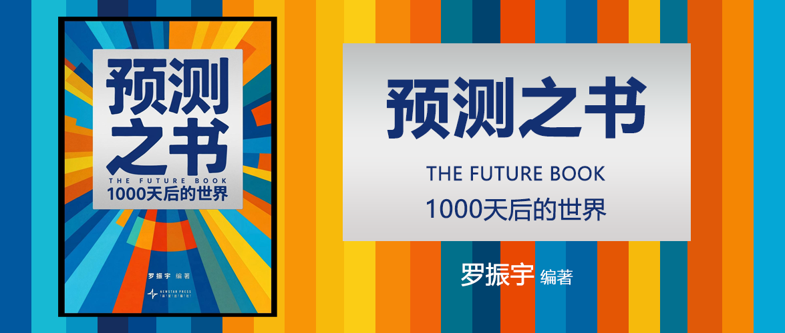

# 预测之书2：1000天后的世界

罗振宇 编著

## 第五幕 生活与服务

### 27_高展眼中1000天后的世界_当机器人迎来它的奥运时刻

这篇文章，这段话值得记录：“我们生活的这个世界，已经在不知不觉中被打造成了最适合人类生活的样子。要让机器人真正走进人类社会，与我们协同工作，它们中的绝大多数就要以“人的样子”，在“为人设计”的环境中行动”。 —— 之所以我记录这段话，是因为之前我理解“人形机器人”我总觉得很多“专用非人行机器人”可以解决更多“专业的事项”，包括之前在听清华张钹院士聊AI产业的时候，他也强调“请大家不要非人形不可”，但是这句话给了我另一个认知，因为环境决定我们需要人形。

### 28_刘元眼中1000天后的世界_当我们第一次拥有一件不像工具的工具

“智能体能够围绕目标自主运转，知道下一步该做什么，也知道怎样把事情做得更好”。

用户最核心的资产是“上下文”：豆包这样的聊天大模型，它每一次对话都是在一个特定的上下文里面，换一个窗口就得重新同步信息。而智能体能够持续以人为中心，去了解他做过的所有的事情和决策，然后跨不同任务去替用户做决策做任务。而智能体的设计里就要突破这样的“上下文”的限制，来充分发挥大模型的能力。

人未来要充分信任智能体，它需要从人类那里获得三类从易到难的权限：
- 读取权：访问你的数据（邮件、日历、文档等）
- 行动权：代表你执行任务（发邮件、填表、预约等）
- 决策权：涉及金钱或法律责任的操作（支付、签约、投资等）

用户的信任就是在这种长期稳定、持续安全的使用体验中慢慢建立起来的。

围绕大模型，有两类公司：
- 补丁型创业：模型暂时没有做好的能力，通过工程能力把它做好。——这个问题就在于当模型变强之后，你就不需要了。
- 模型越强你越强：比如把模型的强项封装成顺畅、稳定的用户体验，每一次底层模型能力的提升，都会顺带把你的产品整体推高一层。【推荐】

未来真正的赢家，大概率会是那些把大模型长板持续转化为独特体验和高效工作流的团队，而不是那些把主要精力画在弥补模型短板上的人。

### 29_王碧豪眼中1000天后的世界_当AI从游戏搭子变成你的数字伙伴

王碧豪正在研发的产品是[逗逗游戏伙伴](https://www.doudou.fun/)——一款以游戏为起点以陪伴为目标的AI伙伴。

搜索讲究“即用即走”，用户获得答案就离开，时长越短越好；陪伴正好相反——它依赖时间积累，时长越长，价值越大。

陪伴类的产品通常有三种：

1. 沉浸式陪伴：常见的数字人，可以选择不同的角色，你直接和他对话/情感交流。
2. 效率型陪伴：本质上是生产力工具，它主要以大模型的能力为核心，解决工作场景。——例如豆包。
3. 情感陪伴：以嵌入的方式，集成在用户的上下文中，比如在屏幕上悬浮一个悬浮球，并读取界面，让用户从一个人使用系统，变成两个人一起使用系统。
    - 不抢占时间，而是共享时间，陪在用户身边。

情感陪伴的核心：感知、记忆、理解。

1. 感知：在[逗逗游戏伙伴](https://www.doudou.fun/)中，这主要是读取屏幕内容，听用户说什么，看用户做什么。
2. 记忆：得有长期记忆，而不是仅对某一次短暂的工作记忆。
3. 理解：让AI不只是知道你是谁、你在做什么，还要理解你为什么这么做。

成为真正懂你的数字伙伴，以“陪伴”的姿态在你身边：
- 心理学研究揭示，安全感的形成往往来自一种稳定而可预期的回应。
- 拟社会互动理论认为，AI的即时反馈会让人产生“被理解、被看见”的感受；
- 依恋理论指出，一个始终在场、不批判、值得信赖的存在，能成为人类情感上的“安全基地”；
- 情感代偿机制的研究显示，当现实关系暂时无法满足时，稳定、耐心的互动可以在一定程度上弥补这种情感缺口。

### 30_黄碧云眼中1000天后的世界_当AI员工走进每一家小店

P445~P457

- AI小模型解决可以标准化的（封闭式的）问题：
    - 如替代店长监督员工戴口罩、换手套；
    - 餐桌是否及时清理；
    - 物品摆放规范；
    - 地面垃圾；
    - 水渍未及时清理；
    - 老鼠出没等行为；
- AI大模型解决难以标准化的（开放式的）问题：
    - 如数据分析师分析商品什么时候清仓最合适？折扣打多少才合理？（利润可提升30%）
    - 如AI订货员可以管理库存：系统分析历史数据，学习每个单品，尤其是那些吸引客流的核心商品的补货规律。还可以结合动态的天气因素等来预测单品的销售变化。（损失可减少20%以上）
    - 如AI辅助营销：
        - 将优惠券一刀切的现象变成结合顾客消费习惯精准推荐；
        - 结合商品配料表信息推荐商品组织话术；
        - 结合历史数据优化选品；
        - 结合网络关键词优化商品组合与线下陈列位置；
        - 分析热销商品的特性来研究顾客消费喜好。
        - 监测顾客拿起又放下商品（可能因为顾客不认识这个商品）

开放式问题与封闭式问题相比，开放式问题的最大难点在于定义场景，因此要在向大模型提问的时候，将场景的信息尽可能完整地告诉大模型。例如：我在旅游城市的高铁站开特产店，主打本地熏鸭。用什么话术和方法，能将商品最快卖给候车返程的游客？

### 31_徐卫国眼中1000天后的世界_当3D打印建筑走进农村

3D打印技术已经可以打印房子（国外用龙门架打印机又大又重，清华用机械臂加移动车，轻巧方便）、桥等各种建筑。它在效率和成本上都比传统方式要便宜。而且这项技术未来不再需要工地工人，将会极大改变建筑行业的生产方式，从而带来新的建筑革命。

## 第六幕 产业与趋势

### 32_马江博眼中1000天后的世界_这些城市会在AI产业竞争中脱颖而出

P475~P487

决定一座城市产业崛起的关键因素是什么？
1. 体现当下发展水平的产业规模、企业规模和人才规模。
2. 决定未来发展动力的资本投入、人才引进和企业优势。

因此，以下数据可以用来支持论点：

1. 《北京市人工智能产业白皮书》
2. 人工智能投资基金
3. 人才引进的政策和配套资金的力度

所以结论是：北京、上海、深圳、杭州、苏州、成都、合肥。

### 33_黄汉城眼中1000天后的世界_半只脚跨入工业科技大国行列

- 制造业看齐德国模式：
    - 工业大国能避免卡脖子问题，因此人才培养的侧重也要从精英教育转向大众教育，培养更多适应工业的高技能人才；
    - 同时产业发展从侧重金融、互联网，转向高端制造；
- 房地产学习新加坡模式：
    - 商品回归商品属性，保障回归保障属性。
    - 让年轻人不被购房压力拖累，释放资金用于消费；
- 往内需驱动的经济体转型
    - 提供各种保障和兜底，为了让人们敢消费；
    - 发展高端制造能对外输出；
    - 内需驱动的经济体，能获得全球定价权，能推动人民币国际化；

### 34_林雪萍眼中1000天后的世界_成为制造强国的惊险一跃

首先中国企业在规模以外，还在很多细分领域实现了超越，实现质的飞跃。

随着海外封锁的加剧，同时还关注了核心技术的自主可控和国产替代。

中国企业也通过智能化、电动化、材新化、场景化，实现了品牌化，不少新品牌创造出了新的细分品类，在全球竞争中，没有对手。

从过去的出口企业转向全球化企业，在海外建工厂、招员工、建设销售网络。同时还在矿产能源领域，与全球巨头同台竞争，实现国际卡位。

所以未来的1000天，这些趋势还会继续，和美国的差距还在缩小。

### 35_何刚眼中1000天后的世界_AI时代必将出现的两场财富革命

目前正处于第五轮康波周期，即信息革命中，随着生成式人工智能的技术突破，现在是智能化驱动的新阶段。

AI芯片的需求量是非常确定性的增长，同时，在金融细分行业中，普通人学习金融知识、利用AI辅助投资的门槛也降低了，因此这一轮的技术革命也会彻底改变金融市场的参与逻辑。

### 36_卓克眼中1000天后的世界_未来1000天，没有AGI

虽然目前的AI能力看起来已经非常强，但是它依然不能像牛顿、爱因斯坦一样自我驱动完成科学突破，原因在于：

1. 它所采用的强化学习只能不断反馈“有规则”的问题，而无法解决更复杂的现实问题，例如数学难题。
2. 大语言模型本身，是统计层面的胜利，是依靠堆砌算力来掌握全人类知识的结果，并非拥有真正的智能。

因此，即便它再强，也只是统计学层面的胜利。

但是这不妨碍它已经具备了全人类的知识，可以强大到超过绝大多数人，而每个人会在AI的帮助下变得更强大，因此它会平稳嵌入经济增长中。它更像是集成电路革命，因为它嵌入的是一个之后必将繁荣的信息服务领域，而技术突破会对经济增长起到长期推动作用。
