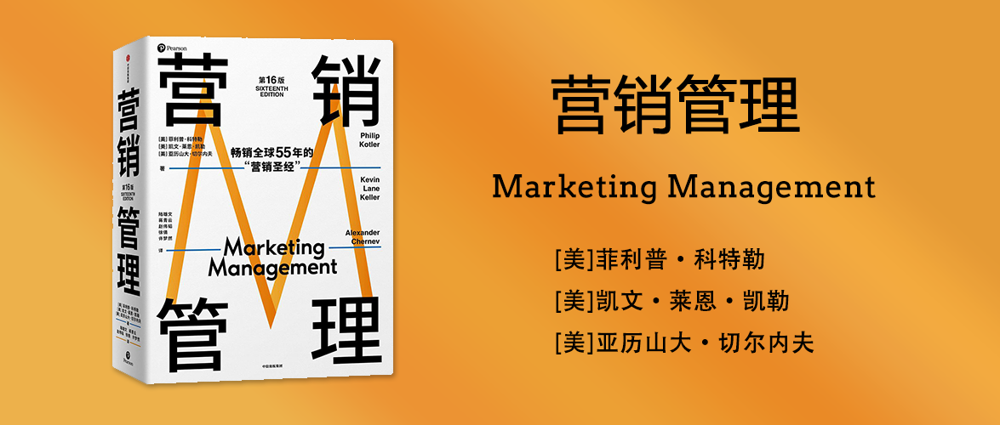

营销管理（第16版）
========================================
Marketing Management

[美]菲利普·科特勒 著

[美]凯文·莱恩·凯勒 著

[美]亚历山大·切尔内夫 著

陆雄文、蒋青云、赵伟韬、徐倩、许梦然 译

第一部分 营销管理的基本原理
------------------------------------------------------

1 为新现实定义营销
------------------------------------------------------

市场营销（Marketing）是指以与组织目标相一致的方式识别并满足人类与社会的需求。美国市场营销协会提供了以下正式的定义：市场营销是创造、沟通、传递和交换对顾客、客户、合作伙伴和整个社会有价值的产品的一种活动、制度和过程。

营销通常涵盖10个不同的领域：产品、服务、事件、体验、人物、地点、财产、组织、信息和观念。

企业必须不断前进。若企业对客户和竞争对手疏于监控，因而未能持续改进其产品价值和营销策略，也没能在这个过程中令其员工、股东、供应商和渠道合作伙伴干到满意，那么企业将面临巨大的风险。

营销中的创新是至关重要的。富有想象力的战略构想存在于企业内部的很多地方。高级管理层应当识别并鼓励三个经常被忽视的群体的新想法：具有年轻化或多样化视角的员工，离公司总部较远的员工，以及刚入行的员工。这些群体往往能够挑战公司的正统观念，并激发新的创意。

四大主要市场力量：

1. 技术：新技术的出现让小公司也能够获得新的生产力。
2. 全球化：全球化使得不同地方的人可以低成本地协作，而且可以跨市场复制经验。
3. 物理环境：气候变化和全球健康状况变化，都会导致各类商业活动的变化，包括农作物产量、分布情况、海平面上升、流行病等。
4. 社会责任：贫困、污染、水资源短缺、气候变化、社会不公、财富集中，都需要我们的关注，很多企业也把社会责任作为竞争的手段。

三大关键市场结果：

1. 消费者的新能力：消费者可以利用在线平台、搜索引擎、社交媒体、广告订阅等各种方式来获得产品、服务以及反馈。
2. 公司的新能力：公司也可以通过互联网建立信息和销售渠道、获取顾客需求、利用社交媒体和移动营销推送广告、改善企业内外部沟通流程、控制成本效率的新方法等。
3. 新的竞争环境：政府在放松管制、增加私有化等方面都在不断努力，零售业从产品目录向体验型转型，传统公司融合电商能力取消中间商，自有品牌（商店自有品牌）和超级品牌（苹果、三星这类产品全面的品牌）随之诞生。

全方位营销：

1. 关系营销：注重建立关系而非产生交易的关系营销。关系营销的目的是与关键成员（客户、员工、营销伙伴（渠道、供应商、分销商、经销商、代理商）、金融圈成员（股东、投资者、分析师））建立相互满意的长期关系，已获得和维持企业业务。
2. 整合营销：注重自动化和创造性而非人工管理零散的营销行动的整合营销。将商店布局、包装设计、产品功能、员工培训、运输物流等各个方面都要保持企业整体的一致性。
3. 内部营销：注重体现强大企业文化而非脱离员工的内部营销。只有所有部门都为实现客户目标共同努力时，营销才会成功，因此内部营销注重对企业内部的各个部门之间达成一致行动。
4. 绩效营销：注重以科学而非直觉为导向的绩效营销。建立除了财务指标以外的指标，如市场份额、客户流失率、顾客满意度、产品质量及其他指标。

市场营销哲学的演进史：

1. 生产观念（production concept）：关注企业生产什么产品。
2. 产品观念（product concept）：关注产品好能解决特定问题。
3. 推销观念（selling concept）：关注将产品（可能是过剩的）卖给顾客。
4. 营销观念（marketing concept）：关注为顾客定制他们想要的产品，与顾客共创。
5. 市场-价值观念（market-value concept）：关注满足顾客的底层需求而非基于产品所在行业认知的产品，比如关注出行而非自行车。

市场营销部门可能有多种不同的组织形式：职能型组织、地域型组织、产品或品牌型组织、市场管理型组织、矩阵型组织等。

一家以顾客为中心的公司必须以市场而不是产品为导向；必须以满足顾客个体的需求而不是大众市场的需求为目标；必须努力使竞争变得无关紧要，而不只是对竞争对手的行动做出反应。为了取得成功，公司应该专注于通过使自身和合作者受益的方式为目标顾客传递卓越价值。

2 营销计划与管理
------------------------------------------------------

任何成功营销战略的核心都是开发持久的价值主张，以满足真正的顾客需要。

营销人员必须优先考虑三个关键领域的战略计划：

1. 将公司业务作为投资组合进行管理；
2. 评估市场增长率和公司在该市场中的地位；
3. 开发可行的商业模式。

使命（mission）是关于组织因何而存在的一个清晰、简明和持久的声明。公司使命通常被作为公司的核心目标，是为公司员工和管理层提供共同目标、方向和机会的长期目标。

为了界定使命，公司必须回答：

- 我们的业务是什么？
- 我们的顾客是谁？
- 什么对顾客有价值？
- 我们的业务将是什么？
- 我们的业务应该是什么？

企业文化（corporate culture）是刻画组织特色的共享的经验、故事、信仰和规范。

战略业务单元（strategic business unit，SBU）每个业务单元都需要自己的战略，具有三个特征：它是可以与公司其他业务分离的一项单一业务或一组相关业务的集合；它有自己的竞争者；它有负责战略计划和利润绩效的管理者，它们控制着大部分影响利润的因素。

专业化组合（specialized portfolio）是指由一条或几条产品线组成的种类较为集中的战略业务单元。

多元化组合（diversified portfolio）是指拥有多条产品线且种类较为广泛的战略业务单元。

战略（strategy）包括选择一个明确的市场，公司将在其中竞争，并决定其试图在这个市场创造的价值。

战术（tactics）也称为营销组合，使公司的战略变得具象：它们定义了为在特定市场创造价值而开发的供应品的关键方面。

5C框架可以用来识别目标市场：顾客、竞争者、合作者、开发和管理产品或服务的公司、环境。5C框架个根据顾客需要而不是公司竞争的行业来定义市场。

五力框架用来判断行业竞争力：供应商的议价能力、买方的议价能力、新进入者的威胁、替代品的威胁、现有竞争对手之间的竞争，是从行业角度分析市场竞争。

战略：在为市场交易中的相关主体开发市场供应品时，公司需要考虑所有三种类型的价值：顾客价值、合作者价值、公司价值。

战术：营销管理者在应对开发创造市场价值的市场供应品（market offering）时有7种战术（7T框架）：产品、服务、品牌、价格、激励、沟通和分销，这7个属性（也指战术）也被称为营销组合（marketing mix），代表了将市场供应品战略转变为现实所需的活动的结合。

4P框架（产品、价格、促销、地点）与当代商业环境的相关性明显不足，它的局限性之一是：无法区分供应品是产品还是服务，这在当今服务导向的商业环境中是一个主要缺陷。另一个不足是：它对“促销”一词的界定，它同时包含了激励和沟通两层意思，但二者其实还是有比较大的差别的。7T是4P的精细化版本。

为了能够为目标顾客、公司及合作者创造卓越的价值，公司需要有能力开发成功的市场供应品，制定此类行动计划的过程被概况为：G-STIC框架。行动计划的制定有5项关键活动来引导，包括：设定目标、制定战略、设计战术、制定执行计划，以及确定一组控制指标以衡量拟议行动的成功与否。G-STIC框架包括：

1. 目标
2. 战略
3. 战术
4. 执行
5. 控制

制定的营销计划不是一成不变的，需要被不断更新以保持相关性。

为确保营销计划得到充分执行，公司必须定期进行营销审计，对供应品营销或公司营销部门工作的全面审查。它意图识别被忽视的机会和问题领域，并提出改善公司绩效的行动计划。

第二部分 认识市场
------------------------------------------------------

3 分析消费者市场
------------------------------------------------------

营销者必须对消费者的所思、所想和所为有一个全面的了解，并针对每一个目标消费者提供明确的价值。理解消费者需要是设计价值主张，从而创造顾客价值的关键。

消费者行为受到三种因素的影响：文化、社会、个人特征。研究这些因素可以帮助公司更有效地接触和服务消费者。其中，文化因素对人们的感知和愿望以及如何满足他们的需要和欲望产生了最广泛和最深刻的影响。

影响消费者行为的四个主要心理过程：动机、感知、学习和记忆。

消费者做出购买决策的过程及其购后行为通常被称为消费者决策旅程（consumer decision journey）。这个过程经历问题识别→信息搜索→方案评估→购买决策→购后行为，并且每个步骤之间并非是线性的，也并非都是必须的。

人们会受到不同的内外部刺激产生购买动机。

消费者的信息来源可以分为四类：

1. 个人的：家人、朋友、邻居、熟人；
2. 商业的：广告、网站、电子邮件、销售人员、经销商、包装、展示；
3. 公共的：大众媒体、社交媒体、消费者评级组织；
4. 经验的：处理、检查、使用产品。

其中个人、经验或独立权威的公共来源效果比商业的通常更有效。

营销者需要识别指导消费者决策的属性层次。识别此属性层次的过程被称为市场划分：

> 多年前，大多数汽车购买者首先决定制造商，再决定其汽车类型，其属性层次为品牌主导型层次（brand-dominant hierarchy）。例如，购买者可能偏爱通用汽车，并在这个集合中选择雪佛兰车型。
>
> 如今，许多购买者首先决定他们想要购买哪个国家的汽车，其属性层次为国家主导型层次（nation-dominant hierarchy）。例如，购买者可能首先决定他们想买一辆德国车，再选择奥迪，最后锁定奥迪A6。

一般情况下，公司最好使其产品适应消费者的现有态度，而不是试图去改变其态度。然而，如果消费者的信念和态度过于消极，公司就有必要采取更为积极的措施。

更多的选择似乎是件好事，但并非总是如此——特别是当消费者没有明显的偏好，或当他们的知晓集或考虑集中并不存在占优选项时。各个选项间细微的差异以及时间限制都会使得决策更加复杂。此外，消费者所花费的脑力、时间和精力仅取决于决策任务的重要性。精明的营销者必须了解什么时候通过在总集合中增加一个占优选项、减少顾客必须筛选的信息量、提出有助于决策的相关问题，以及减少打折销售或特别优惠的时间限制等，来减少选择过多（和被强加的认知努力）的问题。

购买结束之后，消费者可能会因为注意到某些令人不安的产品特点，或听到有关其他品牌的优点而经历认知失调，并会对那些支持其决定的信息保持警惕。

4 分析企业市场
------------------------------------------------------

任何为产品提供组件的公司都属于B2B市场。

鉴于B2B营销的激烈竞争，营销者的最大敌人是大众化，即顾客认为不同公司的产品提供了相同的价值。

因此企业间营销的一个关键步骤是创造并传播与竞争对手间的相关差异。

B2B营销的三个最大障碍：

1. 整合销售和营销部门；
2. 管理创新；
3. 收集和利用顾客和市场洞察力；

企业市场区别于消费者市场：

1. 买家数量少，但规模大；
2. 供应商与客户的关系更为密切；
3. 采购专业性强；
4. 采购的影响因素多；
5. 关注点更多；
6. 需求缺乏弹性；
7. 波动的需求；
8. 买家地域集中；
9. 直接采购；

企业采购情况分为三种类型：

1. 直接重购：定期重新订购；
2. 调整重购：改变原有采购要求；
3. 全新采购：首次采购某类产品或服务。

企业家并不只是购买产品，他们购买的其实是两个问题的解决方案：组织的经济和战略问题以及他们自身对成就和奖励的需要。

采购流程包括：问题识别→需求描述→产品规格→供应商搜寻→提案征集→供应商选择→合同谈判→绩效评估。

企业营销团队应根据企业采购流程制定有效的企业营销方案：从提供产品到提供解决方案的转变，增加服务作为卖点，建立B2B品牌，帮助客户克服价格的压力，借鉴B2C的经验改善网络上的形象。

企业营销团队应与客户建立牢固的连接和关系，建立信任，取决于感知的公司竞争力、正直、诚信和友善。

5 开展营销调研
------------------------------------------------------

营销调研可以来自：

1. 营销调研公司：
    1. 综合服务研究公司；
    2. 定制化营销调研公司；
    3. 专业线营销调研公司；
2. 图书馆、大学、商会；
3. 观察竞争对手；
4. 挖掘员工的知识和经验；

营销调研通常遵循以下步骤：

1. 界定问题：不宜过于宽泛和狭隘。
2. 编制调研计划：
    1. 数据来源
    2. 调研方法：观察法、民族志研究、焦点小组研究法、调查法、行为研究；
    3. 调研工具：问卷、定性测量、测量设备；
3. 收集信息：
    4. 抽样计划
    5. 联系方式
    6. 数据挖掘
4. 分析信息并制定决策

阿尔伯特·爱因斯坦（Albert Einstein）指出，信息不是知识。同样，市场数据本身通常也不是很有用，除非这些市场数据能提供洞见，加深管理者对问题的理解，提高他们行动的成本效益。因此，解释数据并将这些数据与实际问题相结合，在管理决策中起着关键作用。

需求衡量的主要概念包括：市场需求、公司需求、公司销售预测、总市场潜量以及公司销售潜量。

预测市场需求：

所有的预测都以如下三种信息之一为基础：

1. 人们说什么
2. 人们做什么
3. 人们已经做了什么

评估营销活动的效率和效果的方法：

1. 营销绩效指标
    企业可以把营销业绩的评估分为两部分：

    1. 短期结果：通常是通过营业额、股东价值或者两者组合来反映盈亏情况；
    2. 品牌资产：顾客意识、顾客态度、顾客行为、市场份额、相对溢价、顾客投诉量、分销和供应、顾客总数、感知质量、顾客忠诚度和留存率的测量。

2. 营销组合模型：评估因果关系并衡量营销活动如何影响绩效的营销组合模型；
3. 营销仪表板：将基于以上两种方法汇集起来的洞见进行传播的一种结构化方式。
    营销仪表板可以被正式定义为：组织内可以共同观看的一套简明的相互关联的绩效驱动因素。公司对仪表板的投入应包括两个基于市场的关键评分卡：一个反映业绩、一个尽早发出预警。

四种常见的测量路径：

1. 客户指标路径：潜客如何变为客户；
2. 单位指标路径：单位产品或服务的销售数量；
3. 现金流指标路径：营销支出如何实现短期回报；
4. 品牌指标路径：测量品牌估值跟踪营销的长期影响。

从客户那里汲取新创意的六种方法：

1. 观察客户是如何使用你的产品的；
2. 向客户询问他们认为产品存在的问题；
3. 向客户询问他们梦想中的产品；
4. 积极征求客户的反馈意见；
5. 形成一个由产品爱好者组成的品牌社区；
6. 鼓励或向客户发出挑战，来改变或改进产品；

IDEO的七个核心价值观：

1. 少说话多做事；
2. 让别人成功；
3. 从失败中学习；
4. 接受模糊性；
5. 乐观；
6. 合作；
7. 成为主人翁。

第三部分 营销战略规划
------------------------------------------------------

6 识别细分市场和目标客户
------------------------------------------------------

7 打造顾客价值主张和定位
------------------------------------------------------

第四部分 设计价值
------------------------------------------------------

8 产品设计与管理
------------------------------------------------------

9 服务的设计和管理
------------------------------------------------------

10 建设强势品牌
------------------------------------------------------

11 管理价格和促销活动
------------------------------------------------------

第五部分 沟通价值
------------------------------------------------------

12 营销管理沟通
------------------------------------------------------

13 在数字时代设计整合营销
------------------------------------------------------

14 人员销售与直接营销
------------------------------------------------------

第六部分 渠道价值
------------------------------------------------------

15 设计和管理分销渠道
------------------------------------------------------

16 管理零售
------------------------------------------------------

第七部分 管理增长
------------------------------------------------------

17 驱动公司在竞争性市场的增长
------------------------------------------------------

18 开发新的市场供应品
------------------------------------------------------

19 建立顾客忠诚
------------------------------------------------------

20 进军全球市场
------------------------------------------------------

21 社会责任营销
------------------------------------------------------
