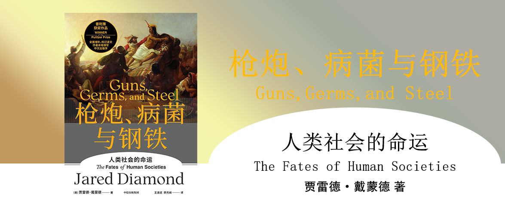

枪炮、病菌与钢铁
========================================
Guns,Germs,and Steel

人类社会的命运

[美]贾雷德·戴蒙德 著

王道还、廖月娟 译

致我敬爱的中国读者
------------------------------------------------------

作者出生于1937年，是生物学家、鸟类观察家、作家，他自述了已经完成的[8部作品](https://book.douban.com/author/1716549/books)的概述，并举例了书中会讨论到的11个有趣的问题。

其中8部问题是：

1. 《第三种猩猩》，1991
2. 《枪炮、病菌与钢铁》，1997
3. 《性趣何来？》，1997
4. 《崩溃》，2005
5. 《历史的自然实验》，2010
6. 《昨日之前的世界》，2012
7. 《为什么有的国家富裕，有的国家贫穷》，2014
8. 《剧变》，2019

前言
------------------------------------------------------

一般的历史书的写法，大多仅关注欧亚大陆西部的历史，对于世界上的其他区域的文字较少，如果只是站在现代看历史，是很难透彻地理解真实的历史，有很多问题无法解释，把世界历史看成洋葱，现代世界是最外面的那一层，在寻求理解历史的过程中要把洋葱一层一层地剥开。

开场白
------------------------------------------------------

亚力（Yali）一个新几内亚的首领，在和他的交谈过程中，抛出了这样一个问题：黑人和欧洲白种人之间有什么差异，为什么现代文明是由欧洲白人发明的，而不是黑人。这个看似简单的问题，就是本书要重点回答的。有观点认为是智力差异、环境选择、河流导致新修水利后中央集权政治的出现，或者是欧洲人征服其他族裔的直接原因（近因）：枪炮、病菌、钢铁等，但终极因是什么呢？这本书会回顾1.3万年的历史来找寻答案。

第一部分 从伊甸园到卡哈马卡
------------------------------------------------------

第1章 人类社会的起跑线
------------------------------------------------------

11000年前，人类从非洲走出并逐渐占领了各大洲，每个大洲有各自不同的环境因素，虽然人类达到时间有先后，但是不足以证明各大洲人类之间存在差异，也没有所谓的先发优势。

第2章 历史的自然实验
------------------------------------------------------

波利尼西亚群岛之间，在很早以前就分别有人到达，并且从那时起就开始分化不同的社会现象，因为各岛资源情况不同，有依靠狩猎采集的部落、有依靠农业生产的部落，有的社会群体政治结构简单，首领和部落成员之间相对平等，有的则和欧亚大陆的集权水平相当，这相当于提供了一次基于历史事实的自然实验。基于历史的观察，只有食物丰富到有所富余的地方，才有可能供养除解决食物短缺问题的社会分工，如首领、官僚、神职人员、士兵等。

第3章 卡哈马卡的冲突
------------------------------------------------------

西班牙军队以168名士兵取胜印加帝国的8万士兵，依靠的是“骑兵、病菌、海事技术、政治组织、文字”等技术，而印加帝国的阿塔瓦尔帕则从未听闻印加帝国以外的战事，对入侵的西班牙人毫无防备，8万士兵虽人数众多，武器落后，在骑兵、枪炮的震慑之下全军覆没。

第二部分 食物生产的兴起与扩散
------------------------------------------------------

第4章 农民的力量
------------------------------------------------------

食物生产对枪炮、病菌与钢铁的发展而言，是间接的前提条件。作物和牲畜为人类带来了更多的食物，人口密度因而大为增加。食物盈余，加上（一些地区）可运送盈余食物的驮畜的出现，发展出定居、集权、社会分层、经济复杂、技术创新的社会的条件就具备了。作物和牲畜的有无，从根本上解释了为何帝国、文字、钢铁武器最早在欧亚大陆出现，而在其他地方较晚甚至没有出现。再加上马匹和骆驼在军事上的作用，以及源自动物的病菌的杀伤力，食物生产和征服之间的主要链条就完整了。

第5章 历史上的有与无
------------------------------------------------------

人类只有摆脱狩猎-采集才能定居，定居就需要驯化农作物、动物，才能积累多余的粮食并发展出复杂的政治。因此追踪食物的历史轨迹，就可以找到历史上不同的食物驯化时间，并揭秘征服者的先后顺序。

世界上只有少数几个地区独立发展出食物生产手段，各地区的进度差距很大。在那些核心地区的四周，有些狩猎-采集族群掌握了生产食物的技能，还有一些地区，原本的族群则被来自核心地区的农民连根拔起并取而代之，这些农民是征服者，他们征服的时间也很不一致。最后，有些族群虽然生活在生态条件良好的地区，但是既没有在史前时代发展出食物生产手段，也没有从外地采借过这样的手段，千百年来他们一直过着狩猎-采集的生活，直到现代世界将他们抛弃。在食物生产方面取得先机的族群，在迈向枪炮、病菌和钢铁的路途上，领先群雄，其结果就是历史上一连串“有”与“无”的冲突。

第6章 下田好，还是打猎好？
------------------------------------------------------

食物生产在漫长的历史演化中，要优于狩猎采集，哪些因素让食物生产显得有利，使其他的生计类型都失色？有以下5个因素：

1. 可获得的野生食物越来越少。
2. 随着可驯化的野生植物变多，驯化植物的回报越来越多，这和猎物变少让狩猎变得日益困难是一个道理。
3. 生产食物的技术（例如采收、处理和储藏）不断改进。
4. 人口密度上升与食物生产兴起的双向关联。
5. 食物生产者社群的人口密度很高，凭数量优势就足以驱逐或消灭狩猎-采集者，更别提其他优势了（包括技术、病菌和职业军人）。

第7章 杏仁的前世今生
------------------------------------------------------

早期的农民根据植物的外在特点挑选，如果实大小、不苦涩的杏仁等，然后一代一代持续循环，形成了最初的驯化。

除了通过外在性质，还有一些其他的筛选方式：

1. 种子的传播机制：人类的出现让原来一些自然条件下无法传播的种子得以传播，比如豆荚、麦子，野生植株成熟后会落到土里，而人类则选择那些留在枝干上的发育不良的进行育种。
2. 发芽的抑制：植物的一年生特性发生改变，一年生植物为了应对气候变化，会有抑制发芽的机制，比如厚实的外层，但是人类的出现让那些没有厚实外层的突变种更早地进入良田，慢慢地改变了原本的生存特性。
3. 生殖生物学：植物的繁殖特点发生变化，如一些植物的突变种，繁殖方式从雌雄同株、雌雄异株、无性繁殖等各种繁殖方式中发生变化，被人类通过块茎等方式进行繁殖，就培育了无籽香蕉、无籽葡萄、无籽橘子、无籽菠萝、桃树、李树、杏树、苹果树、樱桃树。

人类在野地里，从许多变异个体中选择中意的，就创造了“驯化”的情境，在人类园圃里，个体之间向农户竞争，受到选拔的个体与在野地里受天择青睐的不同。

第8章 是苹果的问题，还是印第安人的问题？
------------------------------------------------------

肥沃新月地带是一连串发展最早出现的地方，包括城市、文字、帝国以及所谓的文明（不管是好是坏）。这些发展的前提是稠密的人口、可储存的盈余食物、受供养而不事农耕的手艺专家，而这种种都得仰赖食物生产，也就是作物栽培和家畜豢养。食物生产是肥沃新月地带出现的第一个重大发明。

肥沃新月地带的优势：

1. 气候：地中海气候，冬季温和、潮湿，夏季漫长、炎热而干燥。
2. 植物的始祖繁盛而多产，遍野丛生，举目皆是，狩猎-采集者不可能视而不见。
3. 雌雄同株自花传粉的植物比例很高，这些植物偶尔也行异花传粉。要想保持突变种的特性，雌雄同株自花传粉/无性生殖比其他类型的繁殖方式要简单得多。

相比同样是地中海气候的其他几个地区：加利福尼亚、智利、澳大利亚西南部、非洲南部，肥沃新月地带的优势有：

1. 面积最大，导致动植物的物种丰富得多。
2. 气候最为多变，每一季、每一年的差异都很大，益于植物群的演化，特别是一年生植物。
3. 海拔高度和地形多样。
4. 生物环境多样。
5. 狩猎-采集生活形态相形之下竞争力较弱。

新几内亚有4万年的人类生存史，比西欧定居时间还长，有更长的时间可以演化出食物，但是并没有，存在以下限制：

1. 没有驯化出谷物，因为这里野草的种子都比较小，而驯化出谷物的地区则拥有野草种子比较大而且排名靠前的植物，比如小麦等。
2. 没有可驯化的大型哺乳动物。这也导致他们存在严重缺乏蛋白质的问题，新几内亚高地的儿童肚皮无不鼓胀，老老少少经常以老鼠、蜘蛛、青蛙等为食，还有吃人肉的习俗。
3. 新几内亚以块根类作物为主，当地作物提供的蛋白质少，生长缓慢。

新几内亚的食物生产业无法宏图大展，和当地族群无关，问题出在当地的生物区系和环境上。

美国东部的情况和新几内亚一样，本土粮食生产的局限不是当地土著的错，完全是生物区系和环境造成的。

北美土著不能驯化苹果，问题在于北美整个野生动植物的组合。这个组合的发展潜力有限，也是北美食物生产起步晚的主因。

第9章 斑马、不幸福的婚姻与安娜·卡列尼娜原则
------------------------------------------------------

能驯化的动物都是相似的，驯化不成的动物各有各的原因。对于成功，我们总想找一个只涉及单一因素的简单原则。然而，对大部分事物来说，要获得成功，实际上必须避免失败，只是可能造成失败的因素有许多，而且彼此互不相关。

驯化动物有两种方法：

1. 人类只选有用的个体出来繁殖，并不是所有的个体都有繁殖的机会；
2. 物种对人择压力做出了演化反应，也就是朝着人类期盼的方向演化。

欧亚大陆（含北非）则是目前最常见的14种驯化动物的野生始祖分布最多的地区，多达13种。野生始祖的分布不均就是欧亚大陆的族群得以拥抱枪炮、病菌和钢铁的重要原因。

那些没有驯化出家畜的地区，人们并不是因为文化上的禁忌而不驯化，历史证明在他们有机会获得外来家畜的时候，很快就能识别并进行批量养殖，并加以利用。

目前为止，全世界有148种大型陆栖野生食草哺乳动物曾有希望成为家畜，但只有14种通过了考验，那些没有成功被驯化的原因主要有6个：

1. 饮食习性。因为食物链的每一级之间大约10%的转化率，比如1万磅的玉米可以养1000磅的牛，而1000磅的食肉动物需要1万磅的肉，依次计算。因此，大多数情况下人们主要宰杀食草动物。
2. 生长速度。比如大猩猩和大象，需要15年才能长大，这一类的动物没有人愿意去驯养。
3. 人工环境中繁殖的困难。猎豹、骆马等就无法在圈养环境下繁衍。
4. 性情凶残。比如灰熊、非洲水牛、河马、斑马、中亚野驴。
5. 容易恐慌的性情。比如瞪羚，遇到危险会落荒而逃，直接撞死在栏杆上。
6. 社群结构。几乎所有被驯化的大型哺乳动物，其野生始祖都有三种社群特色：群居；群体中有明确的层级统制结构；群体的生活范围有重合，并不占地盘、分彼此。

第10章 大陆轴线——历史的伏笔
------------------------------------------------------

根据同一种食物是否被独立驯化，可以观察出大陆轴线传播食物的速度。

东西向的传播，比南北向的传播要快。

1. 纬度问题，相同的纬度适合特定的植物生长，在相同纬度带上的植物，传播就比较容易，不同纬度（即南北向）则会引起较大的气候变化，导致植物的传播变得困难。
2. 地形和生态障碍，造成局部传播的困难。

食物传播的特点如此，轮子、文字、冶金、技术和帝国的传播也是如此。

第三部分 从食物到枪炮、病菌与钢铁
------------------------------------------------------

第11章 牲畜的致命礼物
------------------------------------------------------

从人类观点来看，生殖器溃烂、腹泻和咳嗽都是“病症”，但从病菌的角度看则不同，这是应对传播需要的演化策略。这也就是病菌“使人生病”的原因。

发烧导致“体温升高”事实上是为了把病菌“烤死”。

另一种反应就是动员免疫系统。白细胞等努力作战、歼灭外来的微生物。在抵御那些微生物的同时，身体也渐渐产生抗体，痊愈后就比较不会再度感染。

有一些微生物比较狡猾，会不断改变抗原，让抗体认不出来。比如流感、疟疾和嗜睡症有快速改变抗原的能耐。

成为流行病的传染性疾病有几个特征：

1. 传播速度惊人。
2. 以“急症”的面貌出现，很快就可以置人于死地，但若大难不死，则没多久就可康复。
3. 痊愈的幸运者能产生抗体，之后很长一段时间不再复发，也许终其一生不会再受到感染。
4. 这些疾病往往只在人类社群中发展，致病的微生物无法在土壤或其他生物身上存活。

一些传染病是慢性病，在小型的社群中传播，但是会导致大部分都得这些病。这些发生在小型且孤立的人类社群中的疾病，必定是最古老的人类疾病。在人类演化初期的数百万年间，人类社群规模很小且零星分布，这些疾病随着人类一起演化至今。人类的野生亲戚（非洲类人猿）会得类似的病。相形之下，群聚疾病只有在大而密集的社群才发展得起来。发展始于约1万年前农业的滥觞，几千年前城市兴起后，群聚疾病的发展加速了。（狩猎-采集的部落则很难得群聚疾病）

之所以病菌没有从美洲传到欧洲，原因是因为美洲可豢养的家畜少得可怜，而很多病菌的传播是经由家畜传染到人身上的。所以即便美洲早期也有人口稠密的时期（据推算有2000万人），但也没有像欧洲那样病菌丰富多样。

第12章 蓝本和借来的字母
------------------------------------------------------

文字和武器、微生物、中央集权的政治组织一道，成为现代征服战争的利器。

建立文字系统的基本策略有三种：

1. 文字符号所指涉的语言单元的大小。
2. 利用语标，也就是用一个文字符号来代表一个完整的词。
3. 用一个符号来代表一个音节。

独立创造文字可不简单，历史上，自己发明文字的族群，没有争议的包括：

1. 略早于公元前3000年美索不达米亚的苏美尔人；
2. 公元前600年的墨西哥印第安人；
3. 公元前3000年的埃及；
4. 公元前1300年的中国。

其他族群的文字，多半是借用或改造自其他文字，或者受到现成的文字系统的启发而发展出自己的文字。

文字发展的先决条件是：这个人类社群必须认为文字有用，而且能供养造字专家。

文字的传播有两种方法，这两种方法也适用于技术和思想的传播：

1. 蓝本复制：直接照单全收或略加修改后拿来运用。
2. 理念传播：通过基本概念自行研发细节。

早期的文字是少数人的权力，多是用于宫廷记账、宗教和政治的宣传、国王生辰、登基和丰功伟业、祭司的天象观察、朝廷大事的占卜等。正如人类学家克劳德·列维-斯特劳斯所言，古代文字的主要目的就是“为奴役他人提供便利”。

所有可能独立发明文字系统（如苏美尔、墨西哥、中国和埃及）和早期采借这些文字的地区（如克里特岛、伊朗、土耳其、印度河流域和玛雅）的共同特点是：社会阶层分明，有复杂的中央集权政治制度，这和食物生产必然有关。

第13章 发明为需求之母
------------------------------------------------------

通常的观点认为先有了需求，才有了与之匹配的发明。但事实上很多我们熟知的发明家，如瓦特、莱特兄弟、爱迪生等，所谓的发明也都是在基于前人的基础上改良而来，之所以为人所熟知，可能是因为他们为产品的商业化做出了重大的贡献。很多发明在产生之时根本没有具体的用途，或者后来得到真正有价值应用的用途和最初发明已经相去甚远。

讨论这一点，是希望了解：世界史的基本模式，会不会因某些天才没有在某事某地出生而发生有意义的变化？答案是否定的。

两个主要的结论：

1. 技术的发展是累积式的，而不是英雄凭空创造的。
2. 技术发明了之后，才产生用途的问题，而不是先有需求，再有发明。

**影响社会对新技术的接受程度，通常有四个因素：**

1. 比起既有的技术，新技术有较高的经济利益。
2. 社会价值与声望，这个因素足以凌驾今年国际礼仪。
3. 与及的利益的兼容程度。
4. 新技术的优势是否容易看到？

一个区域只要面积够大（例如一整个洲），必然有一定比例的当地社会可能出现创新。

创新既可以是原创，也可以是借鉴来的，既可以是直接复制使用，也可以是见到后原创。技术也不总是一路向前，有一些地方也有技术退化的情况，比如日本曾经接受了荷兰传入的火绳枪，并且改良成世界第一，但是后来受武士阶层的影响，最终被日本社会遗弃，这样的过程通常发生在封闭的社会，如果在竞争激烈的地方，抛弃技术可能的后果就是被拥有先进技术的社群打败。

新技术通常是在旧的技术上发展而来的，一些新技术还靠组合了多项新技术而来。

食物生产出现的年代、传播的障碍、人口数量，都是影响技术产生和传播的主要因素。人口越多、发明家越多、相互竞争的社会也越多。所以新技术的产生并不是因为欧亚族群智力，而是一系列原因造成的。

第14章 从人人平等到盗贼统治
------------------------------------------------------

如果统治者既想要锦衣玉食，又希望得到普通百姓的支持，他们有四点需要做：

1. 解除平民的武装，武装掌权者。
2. 多分点贡品给农民，皆大欢喜。
3. 使用垄断的武力来保障人民的幸福，包括维持公共秩序并制止暴力。
4. 利用意识形态或宗教给人民洗脑。

在面对比较简单的政体时，国家的优势主要表现在：先进的武器、技术和众多的人口。但国家和酋邦还有两个相同的潜在优势：第一，决策的权力集中，可集中调动军队和资源。第二，利用官方宗教和爱国情操使军人愿意为国捐躯。

国家这种复杂的政治形态的形成，不是天然就有的（亚里士多德）、不是基于个人利益理性的决策（卢梭）、也不是兴修水利的需要，而是因为人口数量的增加，一地的人口数量、人口密度或人口压力对国家的形成起到了关键的作用。

食物生产至少从三方面塑造了复杂社会的特征：

1. 食物生产可以季节性地为复杂社会提供劳力。
2. 食物生产带来的盈余食物使经济专业化和社会分层成为可能。
3. 食物生产使人们可以过上定居的生活，或者说，定居生活是食物生产所必须的。

大型社会都有复杂的集权组织，这种现象的原因：

1. 陌生人间冲突的问题。
2. 人口规模越大，众人共同决策的难度就越高。
3. 和经济有关。小社会的交换体系无法满足需要，大社会可以将物品上交至中央实现再分配。
4. 和人口密度有关。

战争往往在人口密集的地方促成社会合并，而在人口稀少的地方则少有这种功效，原因是：

1. 人口密度非常低，失败者躲就行了。
2. 人口密度不太低，但是也不太密集，并没有办法生产太多的食物，顶多增加一点人。
3. 人口密度非常高，战败者不必杀掉，要么充当独立，要么利用他们生产食物的能力作为纳贡者。

第四部分 环游世界
------------------------------------------------------

第15章 亚力的族人
------------------------------------------------------

大澳大利亚大陆（澳大利亚、新几内亚、俾斯麦群岛、所罗门群岛等）上的人类遗迹可能比其他洲的还要早，而新几内亚没有发展出复杂的社会形态，原因可能有：

1. 新几内亚高地上发展出来食物生产农业，却没有生产出多少蛋白质。当地主要是块根类植物、动物只有猪与鸡，无法提供畜力。
2. 高地上耕种的面积有限。
3. 新几内亚适于集约农耕的土地仅限于中海拔地带。

所以传统新几内亚的人口从未超过100万。

澳大利亚则土地贫瘠、气候没有规律、可供驯化的植物少得可怜，澳大利亚没有好的食物生产基础，就只能一直过着狩猎-采集的生活。而澳大利亚距离新几内亚有2000英里，无法学习到一些农业知识和其他的技术，也无法改善生产力。澳大利亚土著的故事反映了：地理在文化与技术传播过程中无所不在的影响力。

过去的大澳大利亚，因为地理的因素没有发展出复杂的社会形态、先进的技术，随着欧洲人的殖民，发生着改变。新几内亚至今仍以土著为主，而澳大利亚则以白人为主。之所以这样，原因在于，新几内亚从3500年前就有印度尼西亚人往来，相对而言外来病菌没有那么容易侵害，加上地形复杂，低地有大量的疟疾等疾病导致欧洲人无法久居，而海拔较高的地方则由土著占领，而后欧洲殖民者也放弃了土地占领的策略，因此现在的新几内亚分成“巴布新几内亚”和“印度尼西亚伊里安查亚省”。而澳大利亚因为没有疟疾这一类的病菌和复杂的地形，有适合外迁的动植物生长的环境，所以澳大利亚很快就发展成为了以白人为主的国家。

第16章 中国——东亚之光
------------------------------------------------------

第17章 开往波利尼西亚的快船
------------------------------------------------------

第18章 两个半球的碰撞
------------------------------------------------------

第19章 非洲是怎么变成黑人的非洲的？
------------------------------------------------------

第20章 日本人是什么人？
------------------------------------------------------