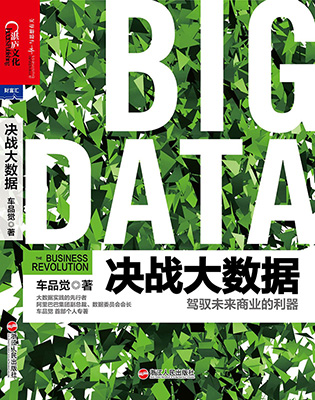

决战大数据
=========

作者：车品觉

第一部分 从数据化运营到运营数据
--------------------------

### 第一节 大数据，为什么很多人只会谈，不会做

### 第二节 大数据的本质就是还原用户的真实需求

### 第三节 “活”的数据才是大数据

### 第四节 无线数据，大数据的颠覆者

用户使用互联网的多场景问题正在将整个数据变成“噪音”。如果没有类似用户体系这样一种在多场景标识同一个用户的能力，就无法通过大数据很好地还原用户的真实场景。

面对无线数据，要解决的主要问题有两个：一是做到高效准确的收集；二是培养数据分析师的多屏思维。

从运营数据的角度来看，端是传感器，云是“储存＋管理”，而“多屏＋移动端口”就是未来数据创新的孵化器。

### 第五节 数据分类与数据价值，什么才是你的核心数据

### 第六节 从用数据到养数据

### 第七节 数据的盲点，负面数据的力量

第二部分 阿里巴巴的大数据秘密
------------------------

### 第一节 阿里巴巴的大数据实践

### 第二节 混、通、晒，阿里巴巴数据化运营的内三板斧

### 第三节 存、管、用，阿里巴巴运营数据的外三板斧

### 第四节 大数据，未来商业的利器

