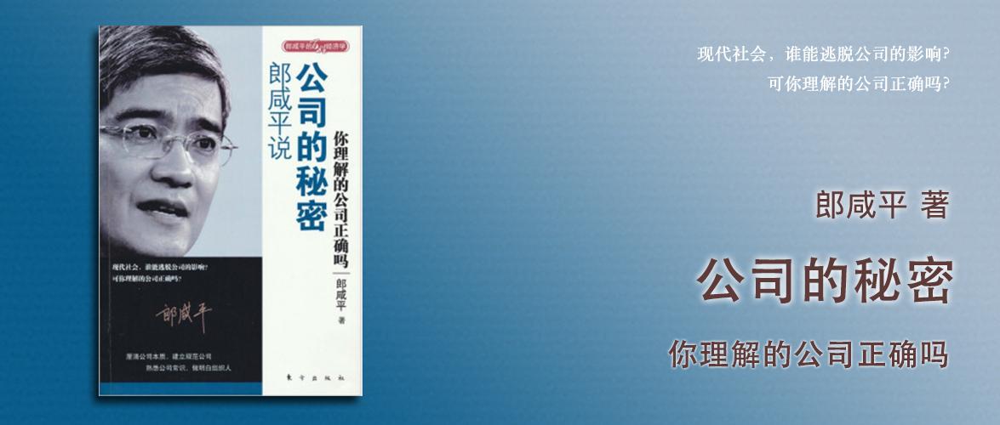

郎咸平说 公司的秘密
========================================

你理解的公司正确吗

郎咸平 著

前言
----------------------------------------

股份制是源于教会神职人员不能经营企业、不能结婚生子没有继承人，导致需要聘请职业经理人来管理，导致所有权和经营权分离，才产生的股份制。

有限责任公司是防止职业经理人借了钱不还，怕债权人到教会闹事，才产生的有限责任。

信托责任是源于对上帝的信托责任，凭着上帝所托要经营好企业。

股份制离不开严刑峻法是因为历史上产生了大量的贪腐，直到美国出现了严刑峻法股份制才得以良好运转。

作为职业经理人，怎样运作公司才能真正对股东负责，为股东创造价值？大多数人谈论的企业成功，都是指必要条件，如资金、技术、人才等，但充分条件是“行业本质”，三个核心：外在的行业本质——品牌广告和内在的行业本质——产业链。

在产业链中，生产制造的比重非常低，以芭比娃娃为例，劳动成本仅占了2.5%。因此任何想要靠廉价劳动力出海的企业都注定失败。重要的不是劳动成本，而是**通过产业链的高效整合大幅降低成本**。

公司治理必须要有五个方面的坚实基础，这样股份制才能良好运作，股东和债权人才能通过股份制实现其所有权带来的利益最大化和持久化，它们分别是：

1. 普通法公平概念的引入。
2. 信托责任。
3. 严刑峻法以保障公平。
4. 严刑峻法保证信托责任的推行。
5. 社会主义式的民主制度。

第一章 我不反对股份制
----------------------------------------

股份制的起源是教会聘请职业经理人，有限责任的起源是避免到教会闹事，马镫带来了骑马可以释放双手因此骑兵出现，有了骑兵就有人雇佣骑兵于是有了城堡，有了城堡就有了国家就有了税收在当时也就是保护费，有了税收就有分配不均（除了养军队以外的税收）因此第一批造反的就是骑士贵族也就有了上议院和国王分享剩余的税收，但是国王不想收个税还要经过上议院同意于是就想通过侵略其他国家获得财富，于是各个国家都成立了东印度公司去抢别的国家的财富，而后老百姓不干了想凭什么我们牺牲去给你国王抢钱供你消费，于是成立了下议院，成立了不同的利益团体即政党（party）。

从16世纪开始的侵略战争导致了国家没钱，各国政府开始筹措资金，于是发行了债券，但是债券到期要还，还不上就打白条，白条又到期了还是要还，于是就把白条包装成“未来现金流（东印度公司侵略所得）”的概念放到“白条（股票）交易市场”上去卖，只要有人相信未来现金流能兑现，就有人买白条。

因为股票市场里面很多股份有限公司造假，导致让老百姓血本无归，所以如果没有法律的约束，股份有限公司是非常危险的，因为它缺乏了存在的基础——良心。直到1929年美国发生股票市场大崩盘，随后美国推出了《反垄断法》——它的本质是反信托基金法——信托基金的持有人是大家族，因此反垄断法就是反大家族，让大家族在股票市场以高市盈率套现，然后把股份让给老百姓。通过这套机制，实现财富再分配。

而股份有限公司到了香港、大陆，因为缺乏了严刑峻法的制约，就变得无效了。而这里有文化方面的制约，以《三国演义》为例，整本书都在讲投机取巧、小概率事件，而看不起有必胜把握的。这个是不对的，应该鼓励稳扎稳打、脚踏实地的大概率事件。中华文化博大精深，把社会的悲叹、特定现象、集体认知，藏在这些章回体小说里，它有两点本质：第一点是浮躁；第二点是投机取巧。

第二章 品牌背后的故事
----------------------------------------

中国制造业的利润太少，随着人民币升值，我们的制造业本来就很稀薄的利润就进一步压缩了，而消费不足内需不足，逼迫人民币升值转回来又影响我们的利润，形成恶性循环，越到最后，我们的制造业就越难以为继，这就是中国各地制造业为什么纷纷陷入萧条现状的原因。

我们今天不能以制造业为满足，我们需要制造业以外的所有产业链高度整合，高效率的整合，来节省大量的成本，提高利润率。我们真正面临的国际环境是产业链的竞争。

品牌是一种产品的精神，是针对不同人群的，因此品牌商不断地打广告、寻找代言人，就是为了强调自己的产品精神。不管是初级产品也好，或者是一些低层次的制造业也好，只要面对终端消费者，就一定要赋予产品某种精神，而这种赋予产品的精神，就是品牌战略成功的保证。

中国的制造业之所以很难走出去，一个原因就是中国的大部分产品，缺乏品牌。

第三章 广告的是与非
----------------------------------------

分众传媒一开始能成功，是因为它只覆盖了写字楼、办公区，这些白领很忙且是高消费客群，而传统的媒体：电视、报纸、杂志、网站的主要受众都是高中生、老年人，实际上消费能力有限。但是像白领这样的人群日常又没有时间去看传统的媒体，这时候分众传媒就找到了电梯这样一个场景，在这个片刻的时间，人们非常无聊，但又不能做打电话、闭眼睛，能做的事情就是“无聊”，这时候，看着电梯门不如去看广告，因此大部分都会选择去看广告。所以分众传媒的成功在于做到了两件事，“分”和“无聊”。除了分众传媒，做纸质的电梯广告商框架传媒也是踩对了相同的逻辑。

但是当它把业务拓展到了大卖场、马路边、学校、医院，它就失去了“分”和“无聊”两个重要的特点，客群既不是高消费客群，路过广告的时候也并不“无聊”，因此看广告的人就少了。而这时候使用电子屏，实际上和纸质灯箱比，并没有本质上的差异，反而新增了成本。因此是否使用液晶电视来投放广告，并不是成功的关键。

而广告主之所以做广告，大多数人认为都是为了推广企业知名度或者产品知名度，但事实上并非如此。

恒源祥，使用洗脑式的广告语，来推广产品和品牌的知名度，这种做法，只会越来越差。国外的品牌进入中国后都不用中国的广告商，因为中国的广告商不懂广告的行业本质。耐克、阿迪、宝洁等公司，都在不断营造不同的产品精神。

以宝洁为例，其产品线主要包含，化妆品、洗发水、牙膏、洗衣粉，从前往后对于消费者而言，“感觉”是越来次要的，越靠前越强调个性化，越靠后越强调功能性。以洗衣粉为例，宝洁的洗衣粉是汰渍，而中国市场销量第一的是雕牌，在这个强调功能性的细分领域，中国品牌以低价优势强调自己洗的干净、用量省，而宝洁的品牌不容易为这类产品背书，或者说这类产品的消费群体不太在意具体是哪个品牌，更注重价格低，因此汰渍为了赢得竞争甚至去掉了一些关键成分导致洗涤效果甚至被暴不过关。但是在洗发水领域，海飞丝这样的品牌几乎和去屑划上了等号，宝洁用明星做代言而且每年一换，就是为了不让明星和品牌划上等号，让消费者尽可能只记住品牌和去屑的直接关联。

中国的手机市场，18%的高端手机份额几乎被国外手机占据，剩下的是中低端市场。如果从赚钱的角度讲，中低端市场规模大，利润高固然没错，但是如果回到行业本质，要做好手机品牌，就要像国外企业一样，用感性的述求拉高手机的形象，达到最高端，只能从最高端切入，然后在最高端保留包年以上，不能马上降价，然后积累势能，当势能越来越充足，才有充足的力量向下席卷中低端市场。想要一上来以功能丰富等特性直接进入中低端市场，是很难达到目的的。诺基亚就是用类似的策略，继续使用七八年前发布的1100手机，在印度、非洲等地实现继续盈利的。

做好一个企业，就要了解所处行业的行业本质，这是企业成功的充分条件，用行业本质来指导自己的资金、技术、人才。

第四章 回顾公司治理的历史
----------------------------------------

连年战争让政府陷入了经济危机，进而诞生了债券和股票市场，在不规范的市场中，带来了大量的官商勾结。亚当斯密写《国富论》希望政府不要干预经济利益的再分配，用看不见的手隐喻政府在经济运行中应该发挥的作用。另一方面随着工业革命的到来，使得英国北部的工业城镇快速兴起，进而威胁到了地主的政治空间，一个关键事件是《谷物法》限制从美国进口食品，导致食品价格上升，资本家不得不为工人支付更高的工资，进而降低了利润，这就导致资产阶级必须在议会中不断削弱地主们的政治权力。他们通过政治改革达到了这一目的，这为后来资产阶级主导立法奠定了基础。

马克思的《资本论》所谓的“共产”，目的就是追求公平。它对公平的追求影响了欧美国家此后数十年法制系统的改变。马克思所描绘的原始资本主义实际上已经灭亡了。

第五章 公司治理的五大基础
----------------------------------------

### 基础一：普通法的公平概念被引入

《普通法》所追求的，是把一个社会的平等观念，加入到法案里面。所以普通法系的国家，在判案的时候，采用陪审团制度，就是要求所有陪审的人员凭一个简单、普通的理念，能够判断是否有罪，把全社会老百姓所认知的价值标准，当成一个社会的公平标准。而在大陆法系则需要现有法条才能判案。

### 基础二：信托责任

伦敦商人在寻找中国的过程中，无意间发现了俄国，当船长带着船员出海后，股东立刻就失去了对其的控制，这时候只有船长具备信托责任，才能够确保股东利益。当船员带着战利品返航并回报股东的之后，后面如果这个船长还需要出行，那么他的信托责任就会为其背书，更多人就更愿意将钱借给他。

### 基础三：严刑峻法以保障公平

罗斯福新政旨在加强政府干预，这一点与普通法的政府不干预相冲突，但这段特殊的历史却造就了美国独一无二的普通法制度和政府监管的制度合力保护小股民。

一个国家想要长治久安，必定要以民为本，更具体地说就是必须以藏富于民来化解劳资冲突。而藏富于民的结果便造就了今天的美国。

美国政府提出了股票市场的正确思维：所谓股票市场就是全社会集资，把资金交给最有能力的职业经理人经营。社会大众怎样知道他最有能力呢？职业经理人就必须披露正确的信息，这个时候政府所扮演的角色就非常重要了。政府必须确保职业经理人所披露的信息是真实的，而且必须确保这个人有一种责任感，即信托责任。就是说你一旦成为职业经理人，你就有责任要把工作做好，你就要替股东创造财富。

### 基础四：法治化保证信托责任的推行

美国的股票市场肩负着一个社会主义的功用——财富的重新分配，是严刑峻法让职业经理人不敢违背信托责任，必须要对股民负责，因此老百姓才愿意把钱投入股市。

### 基础五：社会主义式的民主制度

信托责任慢慢影响到到欧陆各国，英国强调小股东利益，美国强调个人主义的发挥也就是个人主义的民主制度，欧洲大陆则强调劳工福利，逐渐进入了社会主义的民主制度。不同的制度安排导致不同的代理成本，塑造了股权分散和股权集中的不同形态。

欧洲大陆的上市企业董事会一半由劳工代表参加，因此股东大会更偏向于形式主义，而将大股东会在日常经营过程中影响职业经理人进行决策以保护股东利益，进而造成了股权集中。美国的代理成本较低，通过制度安排让职业经理人追求股东利益最大化。亚洲国家因为制度落后，企业更多是家族企业掌权，亚洲企业上市后通常还是为了大股东的利益，与欧美的信托责任是截然不同的。日本与其他地区或国家不同，但本质上更接近欧洲大陆，强调劳工的利益，因此也造成了代理成本很高。

相比之下，中国的国情下，不具备基础一、二的历史背景，因此不太适用，但是可以关注基础三、四、五的实际应用。

### 六、伯利和米恩斯：开创公司治理先河

伯利和米恩斯1932年合写了一本关于美国股权结构的书，将资本家和劳工之间的紧张关系转换为股东和职业经理人之间的关系，将矛盾转移了，并得到了美国政府的支持。当时的研究观点是基于美国的上市公司基本都是大众持股型公司。但实际上当时的200家样本公司中仅44家是大众持股公司。也就是说，当时的目的可能是为了转移公众视线。但是现在重新评判，它的作用仍然是通过一系列“公司治理”措施，最终把股东和职业经理人之间的紧张关系化解掉了。这个转移很重要，这是“公司治理”这一伟大课题的开始。

第六章 小股民、大股东与债权人
----------------------------------------

激励合同将小股民和职业经理人的利益联系起来，只要一项公司政策能迫使经理人好好地为股东而经营，那就是激励合同。但以一些案例来看，如：激励期权通常在公司的好消息发布以前认购或者在坏消息发布之后认购、金色降落伞由股民出资请职业经理人接受他人收购而离开等也都说明了，激励合同并不能非常有效地解决二者之间的利益问题。

除了英国和爱尔兰，较多的大众持股公司，西欧（英国、爱尔兰除外）和东亚（日本除外）较多由家族控股。其中西欧多以复式投票权的方式，而东亚则多以金字塔结构进行控股。金字塔结构通过A→B→C→D的控股方式，实现所有权和控制权的分离，只要家族在ABCD中都占有控制权，A公司对D公司所需要的所有权的资金就比较少，比如家族对D公司的所有权仅7%（51%×51%×51%×50%=6.6%），但A却对D有控制权，同时还可以通过在D公司安排自己的亲戚担任经理人员，进一步强化对上市公司的控制权。这种分离无法分散股权集中所带来的风险，因此他们肯定要从小股民那里掠夺利益，因而会导致大股东和小股民之间冲突的发生。

金字塔结构带来的是第一大股东和第二大股东可能联合起来坑害小股东，他们在D公司上从小股民身上掠夺100元，实际上自身的损失仅7元，仍可以得利93元。但相比之下欧洲的复式投票权制度，第二股东则承担了保护小股民利益的责任，因此欧洲的小股民仍可以从经营中获得股利。

债权人不论大小都比股东要拥有更多的权利来保护自身的财产安全，各国法律对此也有明确的规定。

在美国，经理人和债权人均可宣布公司进入《破产法》保护或简称宣告破产，但是和中国的倒闭关门不同，在美国是指在破产法庭的保护下继续营业，中国人所谓的倒闭关门，在美国被称为清算。

因为债权人维护自身权益的方式和股东不同，债权人和股东对于公司经营的态度也是不一样的，债权人倾向于风险可控的交易，而股东则可能倾向于高风险高收益的项目，这一点在公司破产阶段更为明显。

德意志银行集团的公司之间交叉持股的行为比较多，这种行为让股东之间形成了相互制衡，导致大家需要通过收买经理人来做出对自己有利的决策。而日本富士银行集团内部的交叉持股现象却不多，但是集团内的银行对集团内的公司收取的利息比对集团外公司收取的利息更高，一些高净值的公司进而选择了举债，而不是从集团内部银行借钱。

对于亚洲而言，债务不但不能为小股民谋福利，反而是一种大家族对小股民或债权人进行极度剥削的一种工具。家族通过关联银行进行担保，再利用担保向外资银行借债，把钱洗进家族手中，当无法还债的时候，关联银行就倒闭，政府为了获得大家族的支持，不敢得罪大家族，反而通过增加税收等方式，向外资银行还债，进而剥削了老百姓。

第七章 如何建立一套保护债权人的公司治理机制
----------------------------------------

LBO，即购入公司在外流通的股票，如果是经理人买入，则称之为MBO。实施LBO通常买入时候是要溢价的（以高于公司市值的金额买入），要求这些公司能在短期内实现盈利，赚钱还给债权人。

世界上大多数的国家都有国有银行，而统计显示，越是国有银行集中度越高、政府效率越低。改革国有银行体制的前提是债权人的利益必须先得到确保，也就是我们需要建立起一套保护公司债权人的治理机制。而且提到保护债权人，首先要做到的就是要加强银行监管。但是事实上，对国有银行实施监管通常事与愿违，且目前几乎没有成功案例。

美国、英国对于债权人的保护是到位的，因此起到了良性循环。欧洲大陆国家和日本次之，但也还是对债权人有所保护。但是亚洲国家因为家族企业和关联银行的原因，对债权人保护是不到位的。