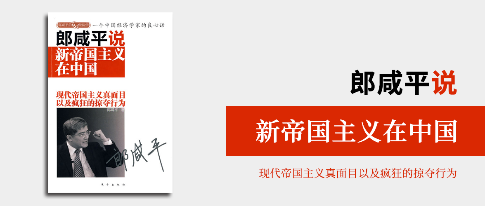

# 郎咸平说 新帝国主义在中国

现代帝国主义真面目以及疯狂的掠夺行为

郎咸平 著

## 序 新帝国主义在中国

本章以列宁对帝国主义的定义为开篇，按目录顺序讲述了全书各章节的主要内容。

## 第一部分 现代琦善的故事

### 第一章 轮胎特保案答辩：为什么惨败于美国

美国工会起诉中国轮胎出口扰乱了美国的轮胎市场，导致工人失业。虽然他们所举证的数据是事实，但是这个数据并不能推导出结论，但是中国的回复不专业，既不提供证据来证明错误，而且协助游说的都是像帮助中国轮胎销售的美国经销商，还指责美国国际贸易委员会（即本案向总统提供数据的部门）。最后的结果可想而知，中国败诉。在败诉后，中国橡胶工业协会会长还无端提出要在农产品和汽车进口方面对美国采取措施（如果算账的话，中国是亏的，而且是不符合这两个行业的利益的）。

而这件事真正的问题并不是因为中国橡胶进口导致美国工人失业，跨国企业才是幕后的真凶，大量的中国橡胶实际上是跨国企业在华投资，占用了中国廉价劳动力和工人，而美国工人失业正是因为这些跨国企业觉得他们太贵了，不想用他们了。

### 第二章 水价合同谈判：为什么惨败于法国

法国威立雅公司收购兰州水务公司，合同约定了他们可以按居民收入和物价水平调整水价，却没有规定他们应该投资官网升级等，这种不对等的条约导致了当收购完成后，他们什么都没有做，就抬高了水价。水价是民生，是刚需，是战略物资，这种不对等条约的签订，让中国老百姓蒙受重大损失。

### 第三章 力拓铁矿石谈判：为什么惨败于美澳日

中国在国际铁矿石谈判中，钢厂独自为战和铁矿石巨头谈判价格。铁矿石的价格实际上并非由铁矿石巨头决定的，而是由华尔街决定的。

而日本企业通过将钢铁生产企业和钢铁销售企业的分离，加上钢铁企业生产高质量钢材的核心技术，当铁矿石涨价的时候，它们会从上游让一部分利给钢厂，不会让钢厂亏损，再将成品涨价后转嫁给中国的企业，如果铁矿石价格下跌，钢铁企业赚钱，商社损失，那怎么办呢？由钢铁企业来补贴商社。

我们呢？我们的钢协代表大钢厂，另外还有几十家小钢厂各自为战。钢厂负责谈判，钢厂负责销售，负责谈判的不懂游戏规则，不知道铁矿石价格是怎么决定的，甚至不知道美国是背后最大的控制者。所以谈不下来，铁矿石涨价，我们钢厂的成本上升，而我们生产的钢大多是中低级钢，没有什么技术含量，也就没有议价能力，对下游的销售很难提价，所 以到最后遭受了损失。

## 第二部分 现代东印度公司：孟山都+四大粮商+华尔街

### 第四章 大豆大战：我们为什么惨败

孟山都通过窃取中国大豆种子，进行研究并抢注专利，让出油率高的大豆成为了孟山都的产品，中国企业要想有市场竞争力，就不得不购买进口大豆。大豆大战中，美国政府宣布大豆减产，华尔街抬高大豆价格，待中国企业在价格高点购入大豆原材料的时候，再宣布大豆增产，华尔街再做空大豆价格，中国企业直接面临亏损。四大粮商趁机入股或收购中国粮油企业。

四大粮商在全球建立起了完整的产业链，通过产品研发、运输、销售等各个环节，垄断了全球的粮食价格。

### 第五章 玉米大战：难逃惨败的厄运

### 第六章 棉花大战：毒手已开始操纵

## 第三部分 揭开新帝国主义的“画皮”

### 第七章 从汇源谈起：外资收购中国企业的真面目

### 第八章 从沃尔玛谈起：外资整合中国产业链的真面目

## 第四部分 新帝国主义的真面目

### 第九章 看现代欧美帝国主义如何掠夺非洲：索马里海盗的真正原因

### 第十章 看现代欧美帝国主义如何掠夺非洲：外媒批评中国非洲战略的真正原因之一

### 第十一章 看现代欧美帝国主义如何掠夺非洲：外媒批评中国非洲战略的真正原因之二

## 第五部分 美国到底在干什么

### 第十二章 要了解美国，就要先了解奥巴马：我们应该怎么看他

### 第十三章 欧洲人怎么看他：诺贝尔和平奖，怎么就是奥巴马？

### 第十四章 奥巴马如何对付中国：解读奥巴马访华的三个礼物
