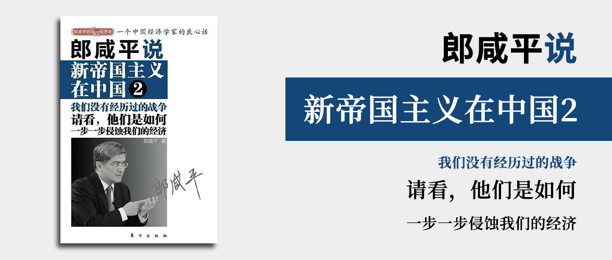

# 郎咸平说 新帝国主义在中国2

我们没有经历过的战争

请看，他们是如何一步一步侵蚀我们的经济

郎咸平 著

## 序言

《新帝国主义在中国2》在《[新帝国主义在中国](../郎咸平说-新帝国主义在中国/README.md)》的基础上，增加了案例分析，以揭示美国的帝国主义企图。

## 第一章 中美汇率大战烽烟起：我的预言从未爽约

中国的低价产品导致了美国的失业率居高不下。为了降低美国失业率，美国希望中国调高汇率，如果不调高，他们就对中国出口商品全部加收27.5%关税，也就是你不调汇率，我就直接给你加27.5%。而中国的低价商品的利润率才3%，汇率上升3%将导致工厂毫无利润被迫关门。这是美国发起汇率大战，将导致的我们经济所面临的危机。

## 第二章 亚洲泡沫大战：美国如何制造泡沫绑架新兴市场

美国通过制造泡沫的方式，从新兴市场套利，泰国、越南、香港、日本都遭遇了相同的境遇。

1. 泰国：通过控制汇率，让泰国出口制造业不赚钱，炒作股市楼市让虚拟资产泡沫化，然后抛售资产让泡沫破裂，股票楼市崩盘，然后金融炒家从股票中获利，套现离场。
2. 越南：与泰国的方式相似。
3. 香港：因为香港采用联系汇率，也就是港币实际上等于美元，因此国际炒家无法控制港币汇率。但是索罗斯做空港币让港府进入圈套，香港市场为了不让索罗斯做空，从市场上大量抛售美元买入港币，让港币一夜之间利率暴涨，利率暴涨的结果是股价大跌，而索罗斯早就做空了股价，于是索罗斯赚的盆满钵满，再次狙击成功。
4. 日本：日本人酷爱实业，泡沫化无从谈起。但是美国人还是想到了办法来制造泡沫，要逼着日本人去炒股。于是通过发行“日经指数看跌期权”，然后在纽约市场做空日经指数，利用全世界的资本来打压日本，让日本股市大跌。

## 第三章 汇率大战：美国的真实目的是什么

美国在多方面强调中国的汇率应该升值，是醉翁之意不在酒，可以参考日本的案例，看看美国人是如何击溃日本经济的。

美国要逼迫日本开放金融市场，这样就可以通过对冲股指期权来利用全世界的资本打压日本股市、楼市。为了让日本开放金融市场，美国人先要求日本开放农业和服务业，美国人明知日本农业和服务业受日本体制影响，无法实现开放，因此日本人无法开放，美国人就要求日本人以开放金融市场来替代。日本人自信地认为自己的金融市场的基本盘是财阀，股指是不会暴跌的，所以当摩根士丹利提出了股指期货，日本就同意了。但是美国投行转头就在国际市场上对冲掉这笔风险，只要不断扩大交易规模，就能从双方的手续费中获利。再通过在海外发行日经股指看跌期权，利用全球资本来打压日本。随着看跌期权热卖，日本股市大跌，随后楼市大跌，最后日本经济崩溃。这里有几个要素至关重要：日本市场应允许融资融券（可以卖空，一旦触发卖空将带来雪球效应导致大跌），股指期货/期权（允许把股指涨跌用来赌），华尔街获准进入日本操作（允许华尔街做多泡沫，再把泡沫击穿）。

而美国对中国市场也在如法炮制，中国的GDP构成中，以基建为主，而基建带来了连锁产业的产能过剩。这些产能过剩导致中国过度依赖出口，因此汇率对出口的影响很大。美国人要求人民币升值的结果就是导致出口及对应企业会出现利润空间被进一步挤压直到大面积破产——而这个动作其实类似于美国逼迫日本开放农业和服务业。美国人希望以此作为交换条件，逼迫中国市场开放金融市场。目前的各项政策已经逐步趋于此了，这是非常危险的。

## 第四章 另类泡沫大战：迪拜危机的真相

迪拜是阿拉伯酋长国的第二大省，阿布扎比是第一大，在阿布扎比发现的油田价值巨大。迪拜世界（一家公司）的收入只有30亿/年，利润只有2亿美元，却敢大举借债200亿美元，而欧美可以借这么多钱，是因为欧美看上了阿布扎比的油田，如果你还不上钱，就拿油田作抵押。所以欧美的醉翁之意不在酒，目标还是价值不菲的油田。

## 第五章 丰田大战：美国版《潜伏》

美国的失业率居高不下，而美国的汽车工业是就业大户，美国人把日本商品视为竞争对手，而丰田又是排头兵。美国想要打击丰田汽车，这样就可以提升福特、通用的销售，从而降低失业率。要想让美国人不买日本车，去买美国车，这个很难，所以美国人想了一招，就是要让美国人认为日本车质量不行。所以就策划了一系列计划，让丰田车出现召回事件，通过安排间谍窃取丰田的内部资料，然后通过媒体宣传、政府听证等方式，让日本汽车的问题被放大，日本汽车的问题是事实上比美国汽车少得多，但是面对美国的咄咄逼人，日本车的销量开始下滑，而美国人的阴谋达成。

## 第六章 气候大战：一个惊天大谎言

## 第七章 低碳美元大战：美国绑架全球经济的碳计划

## 第八章 新能源大战：我们的新能源经济为谁绽放

## 第九章 新能源汽车大战：我们真的领先世界吗

## 第十章 金融资本大战：一个华尔街的幽灵——高盛

## 第十一章 产业资本大战：世界很小，必和必拓很大

## 第十二章 转基因大战：来势汹汹的产业资本孟山都

## 第十三章 焦炭大战：“焦炭出手，打击矿石”的幻象

## 第十四章 文化大战：当孔子遭遇阿凡达
