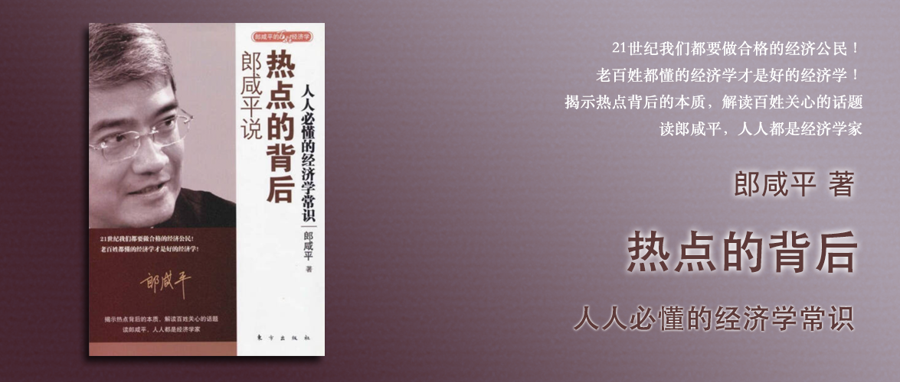

郎咸平说 热点的背后
========================================

人人必懂的经济学常识

郎咸平 著

自序 挺立在时代潮头
----------------------------------------

第一章 财经热词
----------------------------------------

CPI无法反映具体的民生食品鸡鸭鱼肉的价格，因为CPI是所有消费品的增长，要想知道鸡鸭鱼肉的增长，就只能单个去看。

货币政策包括：提高利率、提高存款准备金、政府发行公债。作用就是让你手里的钱不要乱花了，因为你的钱去买任何商品，商品就涨价。

手上钱的实际利率 = 利率 - 通货膨胀率。因此负利率时代，老百姓买房是很正常的投资渠道，炒股炒楼还有可能赚钱，放在银行一定赔钱。买黄金也是一样的道理。

利率一上升，国际热钱大量涌入中国，用人民币可以赚更多利息。相反，利率一下降，汇率就会降低。因为中国手握超过1.4万亿的外汇储备，因此人民币升值在所难免（来自百度百科：外汇储备增多，本国央行持有过多外国的流动资产但不用于流通，外国需要保持收支平衡和流动性需要，需要引发更多货币，导致外国货币贬值，导致本国货币相对升值。因此，外汇储备增多，本国货币汇率升高。）。但因为中国是外汇管制国家，所以利率对汇率的影响较小。除此以外，人们对人民币升值的预期也是决定汇率升高的因素之一。

用货币政策做宏观调控，可能导致过热部门更热，过冷部门更冷，甚至导致过冷部门的资金流向过热部门。

面对人民币不断升值，要做的就是持有人民币，或者用人民币购买更多的资产。

第二章 房地产关键词
----------------------------------------

用于投资房地产的资金有四项：

- 第一项：投资其他行业或是还没有进行投资的钱。
- 第二项：官员贪污腐败的钱。
- 第三项：国际热钱。
- 第四项：老百姓的储蓄款。

目前（2007年）国家宏观调控的指向是“流动性过剩”，因此推出的政策都是针对第三、四项的，而真正影响房价的，实际上是第一项。宏观政策调高利率反而进一步恶化了营商环境，导致第一项资金流向了过热部门（建筑相关）。房价上涨，但是装修、家具等行业没有上涨也反映了这个问题。

政府对土地采用公开竞价导致的问题有：

- 有交易就计入GDP，导致很多GDP是由卖地构成的，去掉之后，中国经济增长就没有10%了。
- 卖地后拿到的钱除了少量（20%）进入经济适用房或廉租房，剩下的用于修桥铺路，这导致的问题就是房价上去了，老百姓更买不起了。

拉动GDP是政治行为不是经济行为，而卖地可以拉动GDP，所以中央银行调高利率不会导致借钱的不再借钱，该借的照样借，然后继续买地。与之相反，过冷的部门（制造业）因为利率上调反而更加困难，原本用于投资制造业的资金也会很快流入到过热的部门（房地产）。

房价和股价不一样，房价不容易下跌，原因在于如果下跌太严重而大家都是加杠杆买的，会引发断贷的金融危机。

2007年房地产的四个关键词分别是：上涨、上调、上手段、上市。

- 上涨：因为投资经商环境没有改善，导致房价一旦下调、虚拟资金再进入、再下跌、再抬高，形成波浪形上涨。
- 上调：中国人民银行调高利率、调高银行存款准备金、收缩信用的政策应该是不会变的。这种政策会使得房价稳定下滑，但是解决不了房价反复波动的问题，无法避免房价产生波浪形的上涨。
- 上手段：廉租房和经济适用房的政策是从香港和新加坡学来的，但是还要加强分配过程的干净、公平、公正。
- 上市：不只是地产公司上市，而是所有公司都挤着上市。上市有个规律，股市好的时候大家都抢着上市能多募集到资金。

第三章 透过数字看股市
----------------------------------------

美国出台反垄断法是要美国的大家族退出美国的历史舞台，把大家族手上的股票用高市盈率卖掉，卖给中小股民，从此以后退出。

美国股市有完善的机制和惩罚手段，让美国公司不敢乱搞，职业经理人不敢违背信托责任，中小股民才敢投资股市，通过股市获得美国经济增长带来的收益。

美国的证券包括保险、基金、退休金之所以能够成功，基础都是美国的股票市场。他们所获得的回报基本就是股市的平均回报。在西方，政府公债也好，公司的债券也好，它基本商是股票的代替品，或者叫股票的组合。

要做到藏富于民，可以通过股票市场，将好项目用股市来筹集资金，进而起到藏富于民的效果。

在股票市场健康成长的过程中，政府所担负的唯一任务应该是加强监管。监管的目的不是打压股市，而是保护中小股民的利益。

第四章 最“牛”散户的背后
----------------------------------------

在美国对内幕交易的惩罚是非常重的，所以人们不敢做内幕交易。实际的例子中，假设今天下午3点钟某家公司宣布一个好消息，股票价格上涨，那么在3点钟以前，所有带动股价上涨的交易全部都是内幕交易。美国抓内幕交易，是需要自证无罪的，因此是非常困难的。

也正因为有了这样的严厉制度，美国股市的内幕交易才非常收敛，相反在中国股市没有这个制度，因此中国总是能出现最“牛”散户。

中国应该加强内幕交易的制度建设，而不是将精力放在打击股市泡沫，在美国政府是不会干预股市泡沫的，美国证券交易委员会不具备这个职责，它们的主要职责是确保股票市场公平公正。

第五章 揭秘金融大鳄
----------------------------------------

中国的金融和美国的差距就像二者在医学上的差异，是七八十年的差距，即便是相对发达的香港也有大概十年的差距。

国际金融大鳄不是一个一个的个人，而是一个一个的利益集团，他们精通游戏规则，手段高明，在全球进行金融操作实现获利。

要想对国际市场开放，就要健全法律制度，这样才能保护金融市场。

第六章 次级债刺激了什么
----------------------------------------

美国的次级债危机，是因为财务公司信托责任缺失，让一些原本信用评级不够的人也能获得贷款，最后因为偿还能力不行，而导致金融危机。美国的银行间相互买卖次级债导致了涉及面非常广，相比之下中国的金融体系不发达，虽然有坏账但是都控制在银行体系内，银行体系是政府把控的，相比之下风险要小很多。

美国的次级债虽然是美国的房地产问题，但是当美国经济萧条后，减少了从中国进口，间接导致了中国经济的萧条。

第七章 人民币升值让你更富裕了吗
----------------------------------------

一个人一年赚了多少钱，这个人的GDP就是多少钱，换成国家也一样，一个国家一年赚了多少钱，这个国家的GDP就是多少钱。

人民币升值是由于我们大量积累了血淋淋的必然贬值的外汇，而原因在于我们国家整体经济的发展策略是投资推动型，所以我们固定资产投资是美国的的2倍，我们正常消费是美国的一半，我们是消费力严重不足的国家，而其原因是因为社会保障体系不足。而政府推动社会保障，就会大力推动消费。

人民币升值，对出口不利，对进口有利，出口的企业卖1美元的产品过去能赚8元，现在只能赚7元。相反，进口的企业过去花8块钱买1美元的产品，现在只需要7元钱。但是升值的幅度不足，还不足以抵消国外通货膨胀的影响。

国际炒家看中国政府想买什么产品，他们在期货市场先买入，把价格炒得老高，然后再把产品卖给我们中国政府。然后给中国造成通货膨胀，而我们人民币升值幅度又不够抵消通货膨胀带来的影响。这就是为什么我们人民币汇率越升值，通货膨胀越严重。

人民币升值，导致大量出口企业倒闭，广东省以出口制造型企业为主，企业倒闭，房价就上涨，企业家把钱用来炒楼导致的。同样一些资金也流入了台湾，导致台北也上涨30%～40%。

面对人民币升值，香港2004年的自由行、台湾2008年与大陆的三通，会给台湾经济打一剂强心针，让台湾经济迅速上升。这个时候，在人民币汇率不断上升的过程中，我们对香港和台湾直接投资都是很有利的，而这种直接投资不一定投资工厂，不一定投资房地产。也可以投资他们的外币定存，以香港恒生银行为例，恒生推出两种货币的定期存款，加入我存一年期，我今天存100块，一年过后我可以选择两种货币，到最后哪种货币的升值幅度高，他就用哪种货币的升值幅度付给你利息，这时候要找到一个投资组合，一个是相对于港币稳定上升的货币，一个是相对于港币大幅波动的货币，这样的投资组合风险最小，前者可以选人民币，后者可以选日元。

第八章 《士兵突击》的经济学
----------------------------------------

从士兵突击、超女现象可以看出当代人的心声：

1. 应该像许三多一样，有信托责任。
2. 不论你是普通人还是特别优秀，这个社会让人成功的机会太少。

在今天，不懈努力虽然是你该做的事，也是你唯一能做的事，但是你能不能成功，还要取决于别人给不给你机会。如果别人不给你机会，那么我们只能做自己该做的事——等待。最后，我希望在座的每一个人，一步一个脚印地把你该做的事做好，“不抛弃、不放弃”，珍惜自己每一次的付出，热爱自己过去的经历。

第九章 拐点真的存在吗
----------------------------------------

宏观调控理论中两个重要的概念一个是利率一个是存款准备金，这两者对一元经济有效，而中国是二元经济。

什么叫一元经济？那就是经济萧条的时候全国萧条，经济过热的时候全国过热。这种现象只发生在一元经济环境里，诸如美国、欧盟、日本等地。我们中国不同，我们是二元经济环境，是过热跟过冷同时存在。

过热的是建筑相关的部门，过冷的是其他行业。

用利率调节和存款准备金调节的宏观经济政策，药效过猛，而基础没有打牢，用这个方式会存在很大的问题。可以从需求面和供给面来改善会温和得多。

- 需求面：要改善民营企业家面临的恶劣的投资经商环境，让资金回归，鼓励他们从事应该从事的制造生产行业。
- 供给面：要把土地公开竞价的卖地款用来建廉租房或者经济适用房，并解决分配过程中的公平问题。

第十章 从奥巴马与希拉里之争看美国
----------------------------------------

美国是一个纪律严明，以法治化为基础的资本主义国家，而且它整个国际战略、国家分工非常精确。这对其他国家的打击是你不可想象的。

奥巴马代表黑人，希拉里代表女人，在美国文化中，黑人的地位其实比女人要高的，而又是二选一。奥巴马在竞选时没有刻意偏袒黑人，这反而赢得了美国白人的好感。

第十一章 不要走马观花看香港
----------------------------------------

香港和内地的一个很大区别就是香港特别强调法治化，即便是交通管理，也是严格执行法治的思路。民主是发达国家成功的结果，而不是成功的原因，法治才是。

第十二章 大学生为什么找不到工作
----------------------------------------

第十三章 赴港求学，你了解多少
----------------------------------------