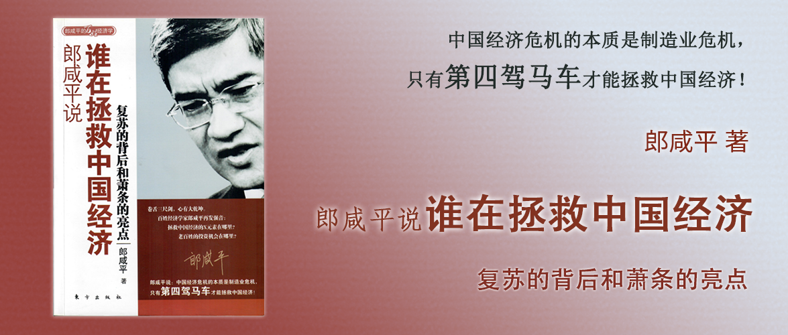

# 郎咸平说 谁在拯救中国经济

复苏的背后和萧条的亮点

郎咸平 著

## 前言

中国经济的危机来自于制造业危机，一个是投资经营环境的恶化，一个是产能过剩。在经济不景气的时候，口红效应明显，但是中国奢侈品逆势增长，也是因为制造业资金没有投资渠道就进入了奢侈品和房产等地方。要想改善制造业危机，我们可以指望第四驾马车，产业链高效整合。

## 第一章 中国真正的危机不是金融危机

制造业的投资环境恶化导致了制造业资金跑到楼市、股市里，造成了资产泡沫，这一点从生产企业用电量下降但GDP仍继续增长能看出来。

因为没有找对病因，所以推出的一些政策不仅可能无效，从长期来看可能会带来更大的问题，比如：

1. 农业改革
2. 医疗改革
3. 4万亿救市
4. 十大产业振兴计划
5. 汽车家电下乡
6. 银行信贷

## 第二章 金融海啸导致美国泡沫消费爆破

国际金融炒家（华尔街，高盛这些投行的管理层等）如何利用规则为自己谋利：

1. 美联储关注两个指标：通货膨胀率和劳动力价格指数，基于此调整利率。
2. 美国的劳动力价格指数很大程度由劳动力成本决定的。
3. 如果工人要求涨工资，劳动力成本就上升，于是就把相应产能转到中国去。——美国的劳动力成本就不会上升了。
4. 产业链里6+1的6仍然在美国，仅把1放在中国，因此美国人始终掌握了定价权，中国制造成本如果上升，我就不买了，导致中国只能控制劳动力成本，压缩利润，在贸易的过程中，中国人累积了大量的外汇储备。
5. 中国（也包括其他国家）用手里的外汇储备，去买美国国债。
6. 美联储将国债带来的钱通过银行借给美国老百姓去消费，产生了消费泡沫。
7. 美国银行也将债权打包给国际金融炒家，由它们分销给投资人，然后拿到钱之后又贷给美国老百姓去消费，产生了消费泡沫。
8. 国际金融炒家在整个过程中，收取大量的手续费，赚的盆满钵满。

## 第三章 股市、楼市和车市的回暖

股市、楼市、车市之所以上涨，是因为银行信贷和避险资金的投入，根本上是因为制造业投资环境恶化，产能已经严重过剩了，需求端又疲软。

## 第四章 中国内地、香港、台湾和美国股市的亮点

中国内地、香港、台湾和美国股市的表现虽然趋势相同，但是原因各不相同：

- 中国内地：上证A股指数，与台湾走势一致，根据第三章论述，是银行信贷和避险资金的投入，根本原因是制造业投资环境恶化。
- 香港：恒生指数，与美国走势一致，国际金融炒家唱好香港股市，是希望借助卖空机制，拉高再卖空，赚取暴利。
- 台湾：台湾加权指数，与中国内地走势一致，大量国际热钱进入台湾，根本原因是台湾和大陆关系趋好，引来国际热钱的投资。
- 美国：道琼斯指数，与香港走势一致，和香港涨跌的原因一致，也是因为国际金融炒家的资金策略。

## 第五章 黄金与美元价格走势背后的玄机

通常情况下，黄金和美元的价格走势上，都是相反的，因此也建议在投资的时候，将二者做对冲，这样可以确保不会赔钱。之所以会有如此规律，是因为美国政府的操纵，因为只有这样才能维持美元的强势地位，避免其他货币对到黄金。

如何操纵？美国政府通过国际金融炒家，在期货市场大量卖空黄金，而大家就会选择抛售黄金买入美元，这样美元就涨了。最后需要交割的时候，欧洲银行还会抛售34吨黄金。

2008年底到2009年，出现了罕见的美元和黄金同涨的现象。具体是因为美国的救市计划要7000亿美元，除了印钞票，还有一种方式就是借债。借债就需要让美元变得值钱，这样就可以少借一点。因为全球金融恐慌，黄金会涨，要打压价格难度很大，于是它们就在期货市场买黄金，这样更多资金会买黄金，而买黄金必须用美元，各国货币都得先兑换成美元才能买黄金，因此各国货币跌、美元涨、黄金涨。

国际金融炒家如何赚钱。它们通过游说美国和欧盟，抛售欧元，让欧元贬值，这样可以利好欧盟的出口。当欧元跌倒一定程度后一定会反弹，国际金融炒家再抄底欧元，等涨回来的时候大赚一笔。

## 第六章 萧条时期的“娱乐经济学”

在经济萧条的时期，人们没事可做，没有那么忙了，每天下班时间早了，不需要应酬了，也有更多时间陪孩子了。因此，虽然是经济萧条，但是从历史来看，每一次经济萧条都带来了文化产业的繁荣，像美国的好莱坞大片，很多经典的都出自萧条时期，除了需求端，人们有时间看了，也和供给端有关，投资人更谨慎了，制片品质也变高了（否则很难拿到投资）。类似的事件也发生在像“小沈阳蹿红”，因为反映生活的接地气的内容才是文化。也包括日韩娱乐文化的输出，也是在其经济不景气的时期成长起来的。

## 第七章 危机中的“口红效应”

在经济萧条时期，会出现“口红效应”。这种高端品牌下跌而中低端品牌逆市上涨的现象就叫做口红现象。

人们在经济萧条时期会更倾向于购买高性价比的产品。过去我们认为的性价比公式是`性价比1 = (外观+性能)/价格`，而这是不够的，这无法解释逆势情况下奢侈品销售不降反增，我们可以用这个公式来理解`性价比2 = (外观+性能+行业本质)/价格`。

以白酒为例，白酒不仅仅是酒精和香料的结合，更是历史的传承，只有茅台镇生产的茅台才能是茅台。各行各业也有自己的“行业本质”，它是超出“外观+性能”以外的那些东西。

## 第八章 广告提高产品性价比

性价比2中，比较难解释的是行业本质，大多数中国品牌都没有理解行业本质。做广告的目的是给产品注入你想要赋予它的精神。

金六福和浏阳河都是让五粮液给自己做的代工，按理来说品质上是一样的。但是金六福的广告连接消费者的时候主打“福”字，用金六福连接亲情、友谊等有福的场景，而浏阳河请超女做代言则达不到这个效果，虽然是扩大了知名度，但是和消费者之间难以产生共鸣。

耐克这样的企业之所以比国内运动鞋做的好，就是因为它懂行业本质，他们主打运动精神，把发挥潜能和它的客群建立起精神联系，让人们在使用它的产品的时候就能联想起这个精神，这就是行业本质。

有了行业本质，品牌就有了溢价，有了溢价就可以有足够的价格空间来抵御经济下行周期，像没有品牌溢价的企业，一旦遇到危机就很艰难。

## 第九章 餐饮广告中的行业本质

餐饮行业的性价比，不止是我们理解的(口味+品牌+服务)÷价格，而是(口味+品牌+服务+行业本质)÷价格，餐饮行业的行业本质就是“无形体验”，以麦当劳为例，这种无形体验就是“幸福家庭的感觉”。

## 第十章 奢侈品的品牌：广告的独特定位

奢侈品的行业本质就是每个品牌所代表的人群细分，普拉达是个不需要男人的女人所拥有的，安娜苏则是代表了每个女人心中的公主梦，简单地靠资本收购品牌而不了解行业本质，这种行为只能是投机取巧做不好的。

## 第十一章 奢侈品的极致：历史镌刻的记忆

和意大利服装品牌不同，珠宝类奢侈品的行业本质还包括了制作工艺也是历史积累的记忆。女士戴的不是表，而是珠宝；男士戴的也不是表，而是体现自己对于力与美的品味。这些顶级的奢侈品牌，都把自己与一段刻骨铭心的记忆、人物、传奇联系在一起，让它的消费者获得同样的精神需要。

## 第十二章 奢侈品回暖背后的产业升级之辩

奢侈品回暖的现象是：一线品牌上涨，二三线品牌反而下跌，原因可能是因为制造业的资金用于购买奢侈品。与此相关的数据是进出口数据的下跌，也就是那些采购原材料和设备加工再销售的需求下降。而目前制造业主要是纯制造业，也就是六加一环节中的一。所以即便是个别专家呼吁的因为现在生产毛绒玩具利润率太低，应该生产利润率更高的芯片行业，如果没有改变中国制造业只做六加一环节中的一，芯片行业的未来回重蹈玩具业的覆辙，而且可能相比之下，制造毛绒玩具还能吸纳更多的就业，而芯片则不需要那么多人，同时芯片相关的行业都是手机这一类相对可有可无的行业，而不是更底层的服装、水饺这一类产业即便是经济波动也不得不消费的领域，所以真正要转变的不是更换行业，而是要做全产业链才能赚取更多的利润。

而中国企业喜欢招聘人才而不是招聘螺丝钉，因为招聘人才的企业没有系统工程的思维，就像一家餐馆，手艺好坏全靠大厨师，所以你离了大厨师就不转了，但是真正做大的企业都需要靠系统工程，将每一个环节固化下来，弱化每个人的影响，这样才能摆脱人才的依赖。

## 第十三章 拉动中国经济的“第四驾马车”：产业链高效整合

ZARA的成功就是依靠产业链的高效整合，从产品设计环节求快求多复刻一线大牌的设计灵感，运输环节用200公里隧道，跨国用飞机，销售环节利用多样式小批量刺激消费者多买等各种手段将整个周转时间压缩到了平均12天，而普通的企业要到180天，因此这些就是高效整合产业链之后带来的好处，也是ZARA成功的秘密。中国制造业的未来，应该是靠产业链高效整合不断提升利润率。
