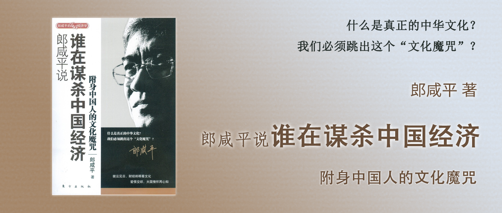

# 郎咸平说 谁在谋杀中国经济

附身中国人的文化魔咒

郎咸平 著

## 前言 谋杀中国经济的文化魔咒

中国人底层的文化是投机取巧和浮躁的，投机取巧就是相信小概率事件，比如诸葛亮的各种小聪明，浮躁就是看事物只流于表面，相信失败是成功之母却不研究失败的理由。

中外文化差异也带来了中国人看世界和世界看中国人，互相看不懂，大家的思维模型是不一样的。

在文化差异的背景下重新看中国古代的商帮，很多原来对这些商帮的传统印象，可能就是错的，而正是这些传承下来的文化理念，对中国的现代企业也产生了很多根深蒂固的影响。

## 第一部分 中华文化劣根性对企业的魔咒

### 第一章 诸葛亮能成为优秀的企业家吗

底层文化的一些劣根性：

1. 投机取巧：三国演义里诸葛亮受人追捧，本质上是大家崇拜这种投机取巧的风格，认为四两拨千斤。但是在西方文化里，更注重流程、优化、迭代等科学方法。
2. 浮躁：崇拜悲剧英雄却淡化其失败的原因，这让我们在现代企业运行中，很少反思自己的问题，通过失败不断优化自身。

一些案例：

1. 负面的例子：联想想成为500强，通过投机取巧的方法收购IBM PC业务，却没有像IBM那样看到行业的本质是垄断中间件。
2. 正面的例子：华为借助IBM设计的流程，进入大流通领域，慢慢找对了行业的本质和方向。

### 第二章 中国高科技的文化魔咒

中国企业特别看重目标，追求“不管白猫黑猫能抓住老鼠就是好猫”的思想，因此联想想要进军已经没落的大型计算机市场，而忽略了云计算的兴起，曙光追求世界第一的算力服务器却没有配套的软件体系支撑，都反映了中国企业希望有个“第一”的目标。

在过度关注目标的同时看不到过程管理的重要性和价值。西方的科学精神是讲求在前人的基础上传承和发扬，而我们希望凭空创造，填补空白，创造奇迹，所以我们忽略过程管理，认为只要拿得出结果就可以。但是结果很容易变化，就像大厨师炒菜，科学的过程管理会把每个步骤拆开并形成流程和工序，这样一旦目标发生了变化，只需要调整过程就可以了，这是可以迭代的，但是如果只靠大厨师炒菜，只有目标管理而没有过程管理，这样大厨师跑了这个饭店就再也没有积累了。企业运营也一样，不重视过程管理，也就积累不下什么，对应的产品也就很难持续迭代变得更好。

## 第二部分 中华文化的四大茫然

### 第三章 茫然之一：就知道赚钱

这一章讲的是“信托责任”，在西方，信托责任经历过3个阶段：

1. 10~13世纪：职业经理人对上帝的信托责任。
2. 14世纪起：信托责任的缺失，有钱人只想着自己奢侈享受。
3. 19~20世纪起：通过法律手段强制的信托责任。

而中国人的传统文化中，既没有“上帝”这个信仰的阶段，也没有“法制”的阶段，导致我们的企业家认为自己的钱理所当然是自己的，而缺乏了对社会的信托责任。

延伸阅读：[郎咸平说 谁都逃不掉的金融危机](../郎咸平说-谁都逃不掉的金融危机/README.md)

### 第四章 茫然之二：不了解世界（一）

奥运会所拉动的基础设施建设和历来所做的基础设施建设一样，而且只是在北京投资和其他城市没有关系，因此股价该怎样还怎样，楼价该怎样还怎样。

奥运会希望能够向世界展示一个怎样的中华文化呢，在传播古典文学方面，我们的《三国演义》、《孙子兵法》、《红楼梦》都是讲“术”的奇技淫巧，我们传达的文化让西方人觉得产生了恐惧和误解，我们不仅强大，还有很多“小心思”。

我们其实是个有大爱的民族，在“汶川大地震”之后被全世界看到了，也正因此西方世界对中国人的“大爱”有了新的认识。

在西方世界的眼里，过去的中国，很大很神秘，而且动不动就要崛起，容易给世界上的其他民族产生“威胁”，所以人家不想和你合作，或者担心你崛起。

### 第五章 茫然之二：不了解世界（二）

整个希腊的文化就是展现在奥林匹克里面的力与美，而中华文化，它的力是不对称的大规模厮杀，它的美是红颜祸水、红颜薄命式的美。因此我们无法孕育出现代运动精神，现代运动精神基本上是一种力与美的结合，更重要的是它必须是一个对称性的“公平”竞争，而这一点往往被我们大家忽略了。

奥运会强调“力与美”，强调“公平”，而这是奥运会所追求的。但是在我们的宣传中，却把注意力都放到每个人要讲文明，忽略了宣传“公平”的重要性。

中国唐朝的兴盛，是源于鲜卑族和汉族通婚，融合带来了文化上的繁荣。

### 第六章 茫然之二：不了解世界（三）

中国和美国在礼仪上有各自的差异，导致了互相不理解，导致它们会认为我们的一些行为很无礼。但一些行为本身并无对错好坏之分，只是习惯罢了，比如开门是自己先走还是让别人先走。

所以，奥运会到来了，我们不应该去迎合别人的礼仪，而是应该借此机会把我们的礼仪告诉外国人，这样以后外国人就会认为我们的文化里本来就不是这么做的。奥运会是让各民族多元文化的汇集，相互包容、相互理解才是礼仪背后的真谛。

### 第七章 茫然之三：不了解别人为什么那么看你（一）

过去外国人对中国人的看法是不同的，认为我们是没有爱的民族，是专制的民族。在他们的文化里，《[失落的地平线](https://movie.douban.com/subject/1293244/) 1937年》，描述的是西藏人和欧洲人是同源的。

但是到了汶川地震发生后，西方看到了中国人在灾后救助方面的努力，才发现我们是一个有大爱的民族。

### 第八章 茫然之三：不了解别人为什么那么看你（二）

中国人在汶川救灾表现出来的大爱感动了世界，让他们重新认识了我们，我们没有像美国一样非常完善的社会保障制度，但是我们在大灾大难面前，中国政府竭尽全力救助灾区的行为，却展示出了大爱。而且我们在外敌当前时候表现出来的高度凝聚和统一对外，让外国人更加惧怕我们，这是我们值得鼓励的精神。

### 第九章 茫然之四：不了解自己的缺点

美国人拍的电影《功夫熊猫》表现了美国人对中国人的理解：

从整部影片：

1. 自私和冷酷，大龙为了自己得到武功秘籍要杀死师傅；
2. 为达目的不择手段，大龙一切都是为了获得武功秘籍；
3. 爱面子导致自私和无情，大龙认为别人都认为它很厉害所以它如果拿不到武功秘籍会很没有面子，为了这个面子宁可杀死师傅；

从熊猫阿宝身上：

1. 没念过书，没文化；
2. 想着不劳而获，入了师门还不想练功；
3. 希望走捷径，练功不用功；
4. 执行力差，像熊猫阿宝害怕大龙，临阵脱逃；

还隐藏的另一面：

1. 中国父亲对儿子的爱，是一种隐式的爱，平时不说出来。导致大多数人成功之后最渴望的就是父亲能够表达对自己成功的肯定。——但电影里之所以这么表现，是因为美式电影的结尾一贯如此，却不代表美国人是这么理解中国人的。——这种美式风格，也代表了他们认可“爱”的价值观。
2. 而汶川地震把中国人的大爱精神表达出来后，反倒是让外国人感受到中国人来自底层的爱。中国人是有爱的。
3. 所以当我们有机会向世界展示自我的时候，更应该去渲染我们是一个有爱的民族，这才是我们应该弘扬的文化和价值观。

## 第三部分 中华文化下的四大商帮

### 第十章 晋商

明朝，晋商依靠地理位置的优越性，通过运粮换取盐引（盐票），合法经营盐而赚钱。

清朝，通过南北方贸易，将通过铁锅等工艺品换成貂皮等草原特产，赚了很多钱。之后又通过贩卖茶叶赚钱。

随着大清朝的衰落，缺乏贸易保护，而且国门被俄国踢开，导致商业竞争上没有优势。

山西人开创了最早的票号，因为有很强的信托责任而赚得富可敌国，后来不仅卷入了政府的官商勾结，还拒绝向现代银行转型，导致最终的衰落。

晋商，最值得推崇的就是信托责任，也是现代资本主义的灵魂，在这一点上，晋商在古代就已经做得很好了。

### 第十一章 徽商

徽商的起家也是源于盐巴生意，他们通过倒卖盐引，赚了很多钱。他们把钱用于奢侈享乐，没有用于投资生产，导致最后当政策变化后，毫无应对之力。徽商的成功很大一部分是靠官商勾结带来的。

延伸知识：

1. 徽州，即现在的安徽黄山，名字是宋徽宗赐的。
2. 马子，女朋友的意思，在古代是瘦马的意思，是一些人贩子到乡下偏远的地方买卖人口送进城里做妓女，对于这些收来的女的，称为“瘦马”。

### 第十二章 浙商之一：湖商

湖州帮依靠其丝绸生意打开局面，在上海滩赚到了很多钱，但是湖州帮赚到钱后也没有用于扩大生产，甚至投资了盐的生意。而后又在上海购买来很多房地产，随着经济崩盘，导致一文不值。

### 第十三章 浙商之二：宁波帮

宁波帮早期发展靠海上贸易，日本铜生意起家积累了原始资本。宁波帮的壮大靠的是无限信托责任，创办了保险公司、真材实料的药行、银行等。宁波帮还很勤奋，对各种生意不论大小都兴致勃勃。他们也是当时唯一有产融思路的，靠金融筹集资本投资航运业，靠相互抱团共同发展。产业设置上讲求互补。业务上也积极创新，用人唯贤，发明了邮局、广告、代销制度（加盟模式）等。

### 第十四章 粤商之一：广州帮

广州帮随着清朝特许广州为唯一通商口岸而兴起，成立了广州十三行。但是随着大清连年战事，很多军事开支都摊到广州十三行。而且皇室的奢侈品也从他们身上榨取。面对英国东印度公司的竞争，十三行不仅没有获得相同的军事保护，反而被清朝打压。十三行中的也各不相同，除了伍秉鉴不仅赚了很多钱，还投资了美国股票、铁路等，其他商行把赚来的钱都用于奢侈享乐、房产、高利贷等，没有向产业资本转化。最终随着鸦片战争，广州也失去了港口垄断地位，最终走向没落。

### 第十五章 粤商之二：潮州帮

潮州帮最初靠海上走私、偷渡出海等方式营生，后来帮大清围剿太平军，得到了鸦片独家经营权，靠鸦片经营赚了第一桶金。但是随着鸦片被禁止，潮州帮没有就此消亡，而是快速转型到纺织业，进入了现代工商业体系，就此完成了工业化。潮州帮和其他商帮的最大不同就在于，它将资本用于投资生产环节。除此之外，他们还非常注重多元化经营，以李嘉诚的和记黄埔为例，7个行业，平均利润率-5%~20%，也就是风险小，收益稳定，它们的多元化在于相互之间的风险互补关系。所以，从潮州帮的经营理念上看，什么是最杰出的企业家，不是在经济好的时候你能赚多少钱，而是在经济差的时候你能够不倒闭，这也就是粤商的本质。
