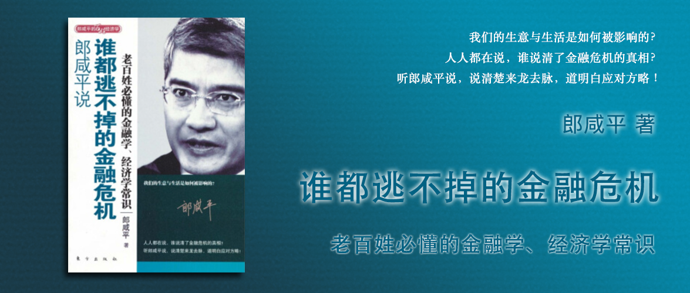

郎咸平说 谁都逃不掉的金融危机
========================================

老百姓必懂的金融学、经济学常识

郎咸平 著

序 你的未来不是梦？
----------------------------------------

美国次贷危机对我们的冲击到目前为止是有限的，还没有真正开始，真正的开始会是什么时候？就是美国的防火墙破裂之后。美国的防火墙一旦破裂，冲击到美国的消费市场，由于美国进口的减少，使我们的出口受到影响，从而打击到我们经济的基本面。

### 解梦一：“鬼压身”——什么是次级债？为什么次级债的“传染性”这么强？

次级债，就是将贷款发放给那些原本没有能力还款的人，然后再将贷款用金融衍生品的形式转嫁给外国政府或者百姓。

它之所以传染性强，是因为它赚钱速度快，不受监管。

### 解梦二：痴人说梦——信贷挂钩票据怎么被说成了债券？

信贷挂钩票据，发行时，把这笔钱交给发行人，发行人再把钱借给雷曼，雷曼拿些东西来交给发行人作为抵押；到期时，如果雷曼按期足额还钱，那么发行人就按照承诺的利率付给投资者利息，并返还本金，但是如果雷曼倒闭了，那么投资者就成了雷曼的直接债权人，能收回多少钱就要看雷曼的抵押品值多少钱了。

而实际发行的过程中，大家用“迷你债券”来给这个产品命名，连财务顾问也说不清其中的信贷风险，而这样的事情之所以会发生，也是监管不到位的体现。

### 解梦三：雷曼噩梦——为什么不救雷曼兄弟？

在英国的巴克莱银行想出资17亿美元，收购已经亏损20亿美元的雷曼兄弟公司，雷曼的8名高级主管要求对方支付给他们25亿美元的红利。理由是，金色降落伞协议。

> 金色降落伞（Golden Parachute，又译黄金降落伞），是按照聘用合同中公司控制权变动条款对高层管理人员进行补偿的规定，最早产生在美国。 “金色”意指补偿丰厚，“降落伞”意指高管可规避公司控制权变动带来的冲击而实现平稳过渡。 这种让收购者“大出血”的策略，属于反收购的“毒丸计划”之一。

第一章 当美国遭遇危机
----------------------------------------

### 一、华尔街的贪婪

在华尔街传统的银行业，工资从几万美元到十几万美元已经很不错了，但是投行的高管们可以拿几百万甚至上千万的年薪。这些钱都是把未来的财富通过金融市场拿到了今天，然后拿出一部分来给高管们发工资。但即便如此，他们还是不够，还发明了次级债。

### 二、次级债惹的祸

次级债就是为那些本来没有资格申请住房贷款的人创造一个市场，使这些信用不足的人或者贷款记录不良的人也可以来贷款，而这个市场就以我们今天的金融危机为代价。

### 三、美国政府救市背后的玄机

今天的世界已经进入一个前所未有的工商链条时代。

例如：中国股市大跌→股民买不起房→房价下跌→信心下降→消费减少→生产减少→失业增加→消费更少……

美国政府救市背后的玄机，就是斩断工商联条的恶性传播，

### 四、保尔森和伯南克能否力挽狂澜

《[格拉斯——斯蒂格尔法案](https://baike.baidu.com/item/%E6%A0%BC%E6%8B%89%E6%96%AF-%E6%96%AF%E8%92%82%E6%A0%BC%E5%B0%94%E6%B3%95%E6%A1%88)》把一般商业银行和投资银行分开，避免银行把储户的钱用作高风险投资。从那之后就有了单独的投资银行。但是投资银行发明了各种金融衍生工具造成了次贷危机。

现在的做法是，将二者再度合并，但是需要同时受美国证券交易委员会和美联储的管制。

### 五、金融危机对中国的冲击还没有真正开始

因为A股市场是比较封闭的市场，所以受到的美国次贷危机的直接影响还相对小。真正的开始会在美国的防火墙破裂之后。美国的防火墙一旦破裂，冲击到美国的消费市场，由于美国进口的减少，使我们的出口受到影响，从而打击到我们经济的基本面。

第二章 国际金融危机的本质
----------------------------------------

### 一、资本主义的灵魂

资本主义的灵魂，是信托责任，就是每个人内心深处，对国家、对民族、对百姓，以及对我们所在公司的股东——也就是中小股民，要存有一份责任感。这种责任感是很难说清楚的，是无法定量分析的，它就是你的良心。

#### 1.“请向我们收税”

小布什政府想要减免富人的遗产税，但是却遭到了既得利益者，美国120个最有钱的富豪的反对。

反对的理由是，如果把钱留给自己的子女，这些子女不一定是这个社会最优秀的人，由他们来掌管这些财产对国家是有害的。

他们愿意把钱拿出来，让美国政府由更多的经费发展教育事业，让社会上最有能力的人来继承这笔财富，这才是美国未来的立国之道。

#### 2.中国国企改革为何不尽如人意

同样是因为信托责任，我们的很多领导缺乏信托责任，而他们的员工也缺乏信托责任。我们不能以工资不够高就不把事情做好，不能以公司不是自己的就不把事情做好，因为即便公司是你的，但公司也仍然不是员工的，那么用相同的逻辑，如果员工不把工作做好，那公司可能好吗？

### 二、美国垃圾债券风波

美国的债券是评级的，只有投资级的债券才推荐购买，除此以外的都是垃圾债券，垃圾债券承销手续费高，就会由人铤而走险，1990年德崇证券（DrexelBurn-ham）就专门找BB、B、C这种信用不好的公司，帮它们发行公司债券，把这些债券卖给储蓄银行，造成储蓄银行大量倒闭。后来因为美国政府对10万美元以下存款有保障，由政府来买单，最终没有造成金融危机。

### 三、次级债的链条

垃圾债通过欺骗收入证明等方式，将没有资格贷款的人引入到金融体系中，而且将他们的贷款再通过金融衍生工具，分割成房地产抵押债券卖出去，同时引入保险公司来给这些债券做担保，进而形成了次级债的链条。

### 四、美国金融系统遭遇“三聚氰胺”

次级债进入金融体系就像是三聚氰胺混入了牛奶，它让整个金融市场产生了信心危机。当这些贷款无法偿还的时候，就会最终通过次级债链条传导到保险公司，而这种大面积的保险兑付事件就是系统性风险，而保险公司一旦无法兑付将面临倒闭，一旦倒闭，将引发整个金融市场的信心崩塌。所以美国政府必须救助AIG，就是为了切断链条，防止更严重的信心崩塌。

### 五、美国政府为何不救雷曼兄弟

雷曼兄弟的高管们将公司经营到一文不值的时候，在面临被收购的时候，还要求执行金色降落伞条约，这要求收购公司额外支持出25亿美元，而实际的收购费只有17亿美元，最终导致收购失败。而这样的行为激起了民愤，政府也不敢违反民意，因为这可能会违反选票，最终导致美国政府没有救雷曼兄弟。

### 六、工商链条时代

美国和中国都进入了前所未有的工商链条时代，一个部门出现危机会蔓延到另一个部门。

华尔街缺乏信托责任，你不救他，AIG倒闭，雷曼倒闭，美林倒闭，全部倒闭，然后会引发失业率上升，老百姓信心丧失，消费减少，生产减少，破产增加，失业增加……进入恶性循环。

因此不能让这些金融机构倒闭，引发多米诺骨牌倒下。

### 七、资本主义遭遇信心危机

美国提出7000亿美元救市方案，欧洲提出20000亿美元救市方案，但是股市的反馈却是暴跌。

这里面的问题出在，银行拿到救济款后，不敢放贷了，因此，虽然有救市方案，但是市面上却没有流动性。

### 八、全球社会主义化

英国政府的办法是利用政府信用来背书，你们拿了钱之后放贷，如果还不上，政府兜底。结果股市大涨，信心恢复。

原理就是，当市场的信心不足的时候，用政府信用来补充信心不足。

### 九、大衰退会持续多久

但虽然是暂时止血了，但就像是刚抢救过来的病人，要恢复，需要很长的时间。

### 十、大衰退前夕的投资策略

在这样的时代背景下，大家不要太指望投资能赚钱，能不赔钱就不错了。

黄金受美国政府控制，波动没有规律。外汇汇率波动，建议美元和外币对冲，但是这只能抵御外汇波动的风险，无法抵御通货膨胀的风险，可以考虑拿这些对冲后的现金与可以抵御通货膨胀的资产做对冲。在韩国、日本、中国台湾等地方，地产可以在10年以上的长时间内抵御通货膨胀，如果内地的地产也可以的话，可以考虑地产。

第三章 金融危机对实体经济的冲击
----------------------------------------

### 一、泡沫的本质——制造业的回光返照

国外的股价大涨3天中国大涨1天，国外的股价大跌1天中国大跌3天，这只能说明我们的问题比别人严重。问题在于中国比起国外还有“制造业危机”，我们的基本面是70%制造业，制造业很多资金没有用于生产而是流入了股市楼市，导致最终的股市楼市泡沫。

### 二、中国救市必须斩断工商链条

中国是由制造业危机引发的楼市泡沫和股市泡沫，导致楼价和股价大跌，失业严重，使得断供现象发生，造成金融危机，金融危机又跟美国挂钩。因此我们是制造业危机加上金融危机，还有国外的金融危机。这就是我们的股市表现如此之差的原因所在，因为我们的危险比美国多得多。

### 三、真正的冲击来自消费形态的改变

中国的GDP70%来自制造业，35%的产能是由国内消耗的，而35%的产能则由欧美消耗掉。他们的消费观念过去是负债消费，95%的负债消费，金融危机过后，如果他们改变消费观念，调整为量力而行，那将严重影响到我国的出口贸易，影响我国的制造业。

### 四、会做风险管理的公司才是好公司

中国的企业资本负债率在100%～300%，而李嘉诚的资本负债率在20%，因为中国的企业家没有经历过大衰退，而多是个人艰辛的奋斗历程。在大衰退的时候要做好风险管理才是好公司。

第四章 股神也逃不过金融危机
----------------------------------------

### 一、巴菲特亏损163亿美元

巴菲特亏损排名第三，但是和亏损排名第一的赌王、第五的比尔·盖茨、第四的谷歌、第二的沃尔顿家族不太一样，他们都是因为持有公司亏损而亏损的，只有巴菲特是作为投资人，亏损的163亿美元。而索罗斯，是因为2008年第二季度投资了雷曼兄弟亏损了1.2亿美元。

### 二、不要相信金融高科技

巴菲特的投资逻辑是用MBA课堂的数学模型计算一家公司的真实价值，当股价低于这个价值的时候才出手买入，否则宁可不买。

他不相信对冲基金、互联网、投资银行，因为这个些数学模型算不了这些金融高科技公司，只能计算传统行业。所以他也只投资传统行业。

### 三、巴菲特能否战胜中国股市的市盈率

巴菲特只有在价格合理的时候才会买入自己觉得有把握的公司，像IT、投行、对冲基金，概念太新、太不稳定，所以他不买。高盛在转为传统银行后，他才买入。

巴菲特也不追求一定要在最低价的时候买入，但是他坚持长期主义，在合适的价格买入，并长期持有。

### 奥巴马和麦凯恩为何看好巴菲特

因为巴菲特可以给美国人民以信任和信心，他以身作则拒绝为富人减税，随时捐款，感恩社会带给他的培养。

### 花221万美元与巴菲特共进午餐

中国人（包括香港）连续3年高价中标和巴菲特共进午餐。

### 罗杰斯是资本主义的代言人吗

罗杰斯是索罗斯的结拜兄弟，但是他在政府应不应该救市的问题上，和索罗斯恰好相反，他觉得美国救市是错误的，而索罗斯则呼吁救市而且抱怨救市太晚太慢力度不够。

### 问答

#### 1. 巴菲特是个好人

美国人和中国人对于好人的定义不太一样，你个人好不好并不重要，比如你是不是长得帅，是不是事业有成不重要，而是你比较谦逊、低调，你就是一个好人。

#### 2. 巴菲特也有扛不住的时候

巴菲特虽然在股灾中损失惨重，但是从长线看他赚的很多，而且他买入的时候价格也不高，这不代表他的投资策略有问题。

#### 3. 我们该不该帮美国

在要不要动用外汇储备去帮美国的问题上，不是愿意与否的问题，而是强权政治下的不得不这么做的问题，而且帮助美国的同时也能缓解对我国的实体经济的冲击。

#### 4. 政府和老百姓该怎么做

在中国人民不敢高消费是因为没有良好的社会保障体系，因此大家不敢乱消费。虽然看似经济在以10%的增速增长，但是大部分人的工资减去通胀可能都不及10%增速，人民没有钱也无法谈消费。而且当钱都用来修桥修路，GDP增速增长越快，老百姓可能越穷。

中国市场和美国市场不同，巴菲特的法则在美国市场可以成立的原因是因为美国市场可以保持长期8%的增长率，但是中国市场不可以，所以包括美国的养老金、保险金都是在这样的股市背景下才得以正常运转。在中国，不仅是投资股票无法复用巴菲特的法则，我们的养老金和保险金都有问题，要想赚钱只有当泡沫出现的时候可以赚钱。

#### 5. 危机之中有良机

你们（2008年的大学生）在20岁的时候，就遭遇了中国改革开放30年以来的第一次大衰退。这将是一个人才辈出的时代。

#### 6. 我们不需要金融学家

保险，中国内地最大的问题有两个：一个是缺乏平稳的股票市场，所以保险的风险非常大，甚至有可能全线崩溃，像香港地区一页；第二个问题是保险公司过多，因此违反大数法则。这两大风险要改善都很难。

第五章 全球金融危机中的中国经济
----------------------------------------

第六章 股市的信托责任
----------------------------------------

第七章 一百年前的中国股市
----------------------------------------

第八章 股市涨跌谁做主
----------------------------------------

第九章 房地产商惹谁了
----------------------------------------

第十章 谁狙击了越南
----------------------------------------

