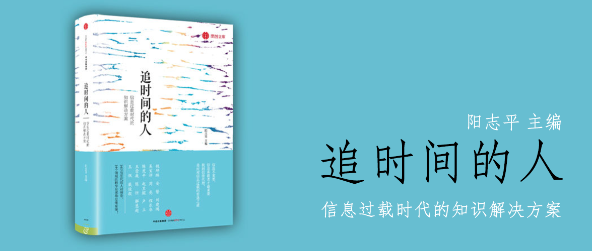

追时间的人
========================================

信息过载时代的知识解决方案

阳志平 主编

序言 追时间的人 阳志平
----------------------------------------

这是集合了不同领域专家思想的一本书。

第一讲 思维模式与积极教养 刘建鸿
----------------------------------------

> 当你认为世界将一成不变，智力不可提升，那么你可能一成不变。当你认为智力可以提升，思维模式能够改变，那么你可能拥有更大的世界。思维模式的不同，同样将影响你对孩子的养育。

僵固型思维模式相信命运，认为天赋更重要。成长型思维模式相信努力，认为过程更重要。前者容易陷入自我否定，更加封闭，而后者更适应于积极面对新的挑战，更加开放。

第二讲 人类的择偶权衡 吴宝沛
----------------------------------------

> 你的时间和精力都非常有限，当你在一个选项中投入得多，就意味着在另一个选项中投入得少。择偶同样如此，是在长相、性格与资源三者中权衡，其中，性格为王。

人类的择偶是在性别、长相、资源等方面做出权衡的结果，人们可能抄袭别人的择偶路径也许这么做能够避免犯错，好的择偶策略可能是跟着感觉走但保持观察，不要一开始就陷得太深。

第三讲 神经迷思 周亮
----------------------------------------

> 你的大脑只被开发了10%吗？你是左脑型人，还是右脑型人？你的脑门那么大，一定很聪明吗？这些从小听到大的话，是对还是错？

神经迷思是那些关于神经科学的传言。

- 大脑只利用了10%吗：假的，大脑的每个位置都是有用的，只是历史的测量手段和方法存在局限，从目前的观点来看，大部分的脑区都是有作用的。
- 左右脑的迷思：假的，左右脑确实存在不同的侧重，但大部分的事项都是左右脑共同完成的，并非简单粗暴地将左右脑分为感性和理性。
- 脑门越大越聪明吗？：假的，脑门尺寸、大脑重量、脑和体重的比例，都不能够反映智力水平，目前脑化指数可能有点相似，但仍然不完整，未来基于大脑折叠的程度（表面积）、突触数量、突触复杂性、突触上特定蛋白数量、大脑组织结构、动物的社交行为等做新的算法。即便是人类，脑体积与智力水平之间的相关性是0.3，是弱相关性，而且头大未必脑大。目前的研究会细化到具体的脑区，如额叶的体积、灰质或白质的体积、皮层的厚度等。

神经迷思之所以能够流传开，可能是一种夸张的形容，仅仅是强调人脑有待开发的潜力还很大，至于是不是90%，并没有严格限定。

教育神经学，因为需求量大，无疑是非常有前途的。

智商测试是个颇具争议的话题，传统的测试存在不同的侧重点，而且人的智力随着年龄会发生变化。

发展的关键期（critical period）是确实存在的，一旦错过确实不好弥补，但是随着科学的进步应该是可以解决的。

大脑默认模式网络，就像是走神时候的状态，比如洗澡和躺着的时候，这时候没有刻意去思考什么。

第四讲 可供性 程乐华
----------------------------------------

> 设计创新产品，多数人遵从的是可用性：你可以让产品为用户做一些什么。然而，除此之外，还有一条通往伟大创新的林荫小道——可供性，在人——物对话中，发现物原本存在的对人的意义。

可供性（affordance）是物品提供给人或动物的行为可能性。很多时候设计都是围绕可用性展开的，新科技更新速度非常快，按照可用性不断更新，但很多时候真正能留下来的东西，其实是遵循可供性预示的规律留下来的。

可供性就像人们看到某个东西之后潜意识想要去使用的功能，不同的人和不同的物之间会产生不同的可供性，多数人如果有同一种可供性，那么这种可供性就可以演化成新功能。

可供性是不局限于物品的，是在人和物品交互的过程中产生的一种属性。可供性不是物品自身属性，而是一种在人与物品互动时生发的属性，因此，它容易因人而异，因情景而异。

可供性和可用性的关系，就像是基因和生命体一样，可供性是基因库，而可用性就是表达出来的性状。

要想提高可供性的感知能力，可以归纳几条：1、从历史上看哪些能长久保留下来。2、观察和互动：观察人-物-情景之间互动的过程。3、掌握理论。4、扩大自己的经验范畴，融入另一个领域并达到基础概念层面理解的水平。

第五讲 我知道，你知道，她知道 陈虎平
----------------------------------------

> 我知道：我知道你知道；我知道你知道他知道。在理解他人与社会时，你会遵从层次结构。同样的，人类的社会生活会映射到你的语言与写作中。

阅读技巧可以区分为：自然阅读法和多层结构法，自然阅读法是人类自然习得的，它有以下特点：

- 对不懂的词汇更敏感
- 对最后阅读到的词汇更敏感
- 对与自己关联的词汇更敏感

自然阅读法是遵循人的自然认知习惯，随机取词；多层结构法是基于人类后天发明的各个层次的逻辑体系，取各层结构的重点词。一个是纯天然原生态，一个是后天人为。自然阅读法会将人的注意力集中到一些事实上并不重要的位置，比如生词，但是在结构阅读法下，就是找论点、论据与论点核心词对应的过程。

从前提能够推出结论的，或者说前提蕴含结论的，为**演绎推理**。这时，从内容上看，前提为总，结论为分。

从前提不能推出结论的，或者说前提并不蕴含结论，为**归纳推理**。这时，从内容上看，前提为分，结论为总，前提是特殊的命题，结论却是一般的命题。

论证的主要类型：对比与因果，对比结构的阅读技巧是：对比找反义，反义在宾语。因果关系，则需要抓住收尾环节、略读中间环节，再加上首句论点。

要想提高阅读和写作技巧，一个是要训练逻辑思维，从亚里士多德、洛克、达尔文的著作来，而不是看小说和分析作品。读完一本书要经常总结，可以克服这个问题。写作的时候，一定要注意句子内部的从句层次，不要太多。

第六讲 好人会武术，神仙挡不住 赵昱鲲
----------------------------------------

> 在人际交往中，有三种人：给予者、索取者与互利者。你可以做一名理性给予者，避免因病态利他而导致自我枯竭，同时不要给索取者可乘之机。

从后果来考虑，助人行为是否达到“利他”的效果，要兼顾好自己的利益、感受和目标。把利己和利人这两个目标结合起来，才能最好地助人。光利人不利己，就容易坠入倦怠甚至病态利他。

像东郭先生一样助人的行为是有害的，不提倡，这叫病态利他。很多利他是基于利益的考量，可以用博弈论的理论来分析，为此，对于“坏人”得罚，这里建议用以牙还牙的方式对待他人是一种最优策略。但是统计上看，最好和最差的都是给予者，也就是助人这件事还是得做的，但是要有策略，要有度，要符合自己内心的选择同时要不要强迫其他人助人。

有几种助人的动机需要注意：

1. 自恋的需要。助人其实代表了一种权力，我比受我帮助的人优越，我有能力影响别人的生活。为了满足这种“我很重要”的自恋需要，有很多人就开始“强行助人”，显然这种助人本质上是为了自己而不是别人。
2. 讨好的需要。低自尊的人在成长过程中产生出这样的观点：我只有对别人有用，别人才会喜欢我。所以他们会不顾自己的真实感受，无原则地助人，就为了让自己在别人眼里显得有用。这其实是一种讨好。
3. 强买强卖。有些助人者常常有这样的期待：我对你好，那么你也得对我好；我助你了，你得还我。他们的助人更像是投资要回报，全然不顾对方是否需要。这像是强买强卖，恋爱中的男女更容易因此变成恋爱恐怖主义者。

给予和索取也是可以共存的，它们因不同的情景而存在，比如同一个人可能对家里人表现出索取，但是对外人表现出给予（这种行为叫做“自我的扩大”），也有相反的案例。

第七讲 2014年诺贝尔奖得主莫泽夫妻谈
----------------------------------------

> 2014年诺贝尔生理学或医学奖颁发给三位神经科学家，他们最核心的发现是揭秘大脑GPS（位置导航）定位细胞。且听师从诺奖大师的学生带你认识大脑，认识大师。

网格细胞（2005年发现）跟位置细胞都是跟空间导航有关的细胞，两者类似但又有区别。位置细胞（20世纪70年代发现）主要存在于海马当中，当动物到了特定的位置才放电。在告诉动物本身到了某个特定的位置的同时，位置细胞也能表达一些额外的信息，比如颜色和味道等。而网格细胞，主要存在于内嗅皮层里，也是动物到了特定的位置才放电，和位置细胞的区别在于，网格细胞放电的位置多而且有规律，形成一个规则的六角形，并且覆盖了动物所到过的所有地方，相当于为整个空间提供了坐标。另外一个区别在于，网格细胞似乎不能表达除了空间之外的信息。一般认为，位置细胞的空间信息来源于网格细胞。

内嗅皮层是阿兹海默病最早发病的脑区之一，而目前网格细胞也主要是在那里发现的。空间定位能力丧失是阿兹海默病的重要特征之一。因此这项研究对阿兹海默病的研究有重要的作用。

第八讲 谈判基础与技巧 王崇巍
----------------------------------------

> 谈判能力是领导力的核心。它有五个基础概念：渴望、底线、谈判区间、协议区间和开价。明智的谈判能将渴望代替期望；同时，谈判最关键的是，创造性地让原先的分配谈判转变为双赢整合谈判。

在谈判中，初次报价建议要依据自己的渴望，而不需要考虑对方的接受程度，也就是不管对方是谁能接受多少，对自己要有个渴望值。

正面情绪让谈判者和对手都更加合作，更少争执，增加共同收益，更愿意执行谈判的结果。负面情绪让谈判者和对手更加强硬，更多争执，减少共同收益，不愿意和对方建立长期关系。愤怒让谈判者觉得竞争性目标更重要；而同情让他们觉得合作性目标更重要。另外，一个平时不容易发怒的人谈判的时候发怒会很有效果。发怒的谈判者会迫使对方做出让步，有优势的人发怒有效果，处于劣势的会适得其反。

大人与小孩谈判，其实只是你不理解他的逻辑和需求，理解了之后就非常简单了。夫妻谈判属于嵌入在关系里的谈判，经常是关系大于利益。这种情况下理解对方比简单地评价对方不理性更有建设性。

总结谈判技巧如下：

1. 用渴望代替期望。
2. 坚守底线，在底线上方选择可替代方案。
3. 明确谈判区间与协议区间，预测谈判结果可能是哪种。
4. 谈判结果追求不到最优也没关系。
5. 尽量保持积极情绪，用谈判的附加值，如关系等去打动对方，很少发怒的人偶尔发怒效果也不错。
6. 尽量按照渴望首先报价。
7. 最关键的一条，通过创造性策略，引入新选项以及兴趣一类，将原本的分配谈判变为双赢整合谈判。

第九讲 让小朋友学会情绪调整 陈忻
----------------------------------------

> 孩子可爱的时候真想抱起来亲亲，可发起脾气来真想啪啪揍他屁股！如何引导孩子学习情绪调整呢？如何帮孩子应对挫折状态下的情绪困扰？请和孩子一起面向未来，和孩子一起解决问题。

- 误区一：认为孩子负面情绪的表达就是他的坏性格。
- 误区二：认为孩子负面情绪的表达是做父母的失败。
- 误区三：认为孩子负面情绪的表达是对自己的挑战。
- 误区四：希望我的孩子幸福快乐，时时刻刻都快乐。
- 误区五：父母过度保护孩子，千方百计去取悦孩子。

这些误区是父母没有认识到，情绪是一种客观存在，不会因为你不喜欢它就消失了，情绪还是一种主观体验，我们只有体验它，疏导它，而不可能想把它压制住就能压制住。不要把孩子的情绪表达和性格、动机挂钩。

在孩子情绪不好的时候，要通过他的行动（比如摔东西、大喊大叫）去观察它背后的情绪，可以先接受孩子的情绪，告诉它其他人遇到类似的情况的时候也会和他相似，对它不好的情绪表达方式应予以引导，最终达到解决行为问题的目的。

情绪引导的大致步骤：

1. 首先要认同确认孩子的情绪，平复孩子的心情。
2. 然后引导孩子去思考，想办法解决问题。

父母第一需要有观察能力，第二需要整合能力，整合起来才能灵活运用，应对突发情况，而不是照搬教科书。

父母要认同孩子的情绪，认同和接纳还不一样，认同不仅仅是接纳，还让孩子感觉到情绪有合理性。要让孩子明白，情绪没有好坏，但是表达情绪的方式有好坏。

父母不要光处理孩子的负面情绪，正面情绪也要让他意识到。

很多时候只要我们对孩子的情绪表示理解和认同，他们就能平静下来。但也有些时候，仅仅进行情绪认同还不够。我们需要启发孩子思考，尝试通过解决问题来疏导孩子的情绪。如果你的认同不能让他冷静，那就要想一想，你的认同是不是恰当。不要试图帮孩子归因，只需要认同就可以。

第十讲 实施科学与特殊教育 解慧超
----------------------------------------

> 教育学波澜不惊地承袭古典浪漫主义教育观，将教育视为艺术、祖传秘方或某种不可量化的神秘魔法，拒绝或不重视科学。现在，实施科学粉墨登场。

拒绝或不重视科学的教育学，不良后果包括以下几点：

1. 教育成效全凭运气，无从测量，无从控制。到底是学生好还是学校好，各说各话。
2. 教育投资达不到最佳效益，反而大兴腐败。因为无法判断改善教育的因素，所以如何分配预算全凭一张嘴。
3. 教师承担所有无法独立承担的重压。不从系统层面提出改进方案，总是把压力转嫁给教师。

教育学的研究方法包括行动研究和实施研究，行动研究相对简单，是帮助时间工作者在日常一线教学中，对自己的教学实践系统地评价与决策的工具，关注的是具体应用情境下的效果。实施研究是一种循证研究，需要有控制组、对照组等，并且可以得出普世教研成果的方法，但要通过这类研究的评审，难度太高，简单地说，就是研究怎么把EBP（教育中的循证实践）落实到教师每天的实践中去，就是怎么兜售已证实有效的教学方法。

套用医学领域推广EBP的例子，主要分成四步：

1. 发布和传播。技术报告、论文、讲座、培训等宣传。
2. 采用。将理论成果转化成产品，纸笔版、网络版、手机App、用户软件等。
3. 实施。收集理论及产品推广后的反馈，使用情况等。
4. 持续应用。各种资源保障要到位，确保长期有效地应用。

吉伯特的理论告诉我们，要在实践中推行一个改变，要考虑这六个因素：

1. Data（数据）：关键目标是什么、应该怎么做、预期效果如何，这些信息是否每个人都清楚。
2. Instruments（设施）：用于辅助实施以及测量效果的各种工具材料是否到位、给力。
3. Consequences（结果）：制度中是否明确了工作人员的哪些行为会得到哪些后果？奖惩是否合理自然，还是过于人为、不公平。
4. Knowledge/skills（知识/技术）：工作人员是否掌握了所需的知识和技术，水平有多高。
5. Capacity（能力）：包括工作人员内在的工作态度如何，智力水平如何，具有哪些个人特点。
6. Motivation&preferences（动机和偏爱）：工作人员对奖惩有多在乎，对奖惩制度接受程度如何。

教育的目的不是改变大脑结构，即使可能会有这样的效果。教育是帮助每个个体发挥潜能，解决实际生活中的问题，满足自己的生存发展需求。

利用AEPS教育测量工具，测量孩子对新兴技能的兴趣程度，当孩子开始对某些技能感兴趣了，就说明孩子“准备好了”，这时候最适合开展教育活动，最能事半功倍。

第十一讲 信息捕食者的选择 安替
----------------------------------------

> 一个心比天高又出生在小成普通家庭的男生，如何能跟随自己的理想，让自己和他人吃惊？请站在时间源头，不断试错，不断创造。

从安替的经历，可以总结出他成功的经验：

1. 对人深刻的爱。把爱作为对各项追求的源动力。
2. 文科和理工科思维的联合使用。用理工科的方法去破解文科。
3. 面对全国、全球市场。保持信息的开放，并及时获得市场的反馈。
4. 同侪压力，和一帮精英为伍。

传统媒体的没落反映之一就是现在它不赚钱了，也就无法为产生高质量的内容而付费。媒体的未来应该在于帮助大家在信息洪流中找到有效信息，但这不是传统媒体人能做到的事情。

如何判断自己要做的事情不是错的？来自安替老师的一个原则是：一直在往信息最前端走，在信息源头的任性，有很大可能不是冒傻气。你如果在信息末端，还觉得自己是创造世界文明的人，才极大可能是犯傻。也就是利用信息差获得进步。其实，媒体人本来就是走在时间前面贩卖时间优势的人。现在不行的原因，是因为他们无法掌握比网友更快的时间信息。时间的源头如何获取呢，时间的源头主要是地理（如波士顿、北京）、人群（专业人士、内部人士和开智微信群）。

要有未来导向，即看做一件事未来的价值，未来能够产生最有效工具的产业，就是最暴利的行业。

第十二讲 好中文的样子 [王佩](https://wangpei.me/)
----------------------------------------

> 美好的中文什么样？一起回到源头，看白话文百年演变，赏析经典著作《共产党宣言》不同译本。不薄今人爱古人，清词丽句必为邻。

要比较白话文和文言文的不同，最好是比较同一种语言翻译过来的不同译文。文言文与白话文区分的核心是虚词。

《[共产党宣言]( https://news.12371.cn/2018/04/24/ARTI1524553638408468.shtml)》节选：

> 当厂主对工人的剥削告一段落，工人领到了用现钱支付的工资的时候，马上就有资产阶级中的另一部分人——房东、小店主、当铺老板等等向他们扑来。

一些官腔体，实际上也是继承了文言的底蕴：

> 干别人想干不敢干的事，干别人敢干不会干的事。白加黑、五加二，星期六一定不休息、星期天休息不一定。以拼命干解决大问题，以拼命干克服大困难，以拼命干实现大发展。破釜沉舟、背水一战、壮士断腕、刮骨疗毒，不获全胜绝不收兵。

白话文在1949年之后的发展，以及站在历史的高度，思考了“文言合一”的可能性。可以说，我们看到了好中文的一条脉络，那就是蕴藏在文言文中，也蕴藏在当代白话文里。

没有外来翻译，汉语就是另外一种样子，大概还是只能表现一点农业社会的小事。有了佛经、西学、《圣经》、马列、西方科学的翻译，中国才变成一个思想上现代的国家。

要想文字卖个好价钱，就到西方汉译经典文本中求，读古典，读原创白话，那都是白费蜡。中文传统的武器库里没办法提供大场面、戏剧性、音乐性、思辨性统一于一体的武器。只有汉译西方经典里有。

第十三讲 运动控制 魏坤琳
----------------------------------------

> 人工智能能够轻易击败国际象棋大师，然而，目前最先进的机器人的身体灵活性却连三岁小孩都比不上。与感知、记忆、决策等人们比较熟悉的认知科学领域比较，运动控制比你想象的还要重要。

简单把人脑看作是个计算机器，它大致包含三个功能：感知（输入）、思维（对中间层的基于各种表征的运算）、运动控制（输出）。

如果在虚拟现实中，你主动产生动作，动作的后果能和你得到的反馈一致，你就会有极强的真实感。

精英运动员更擅长过滤掉无关信息，表现在选择性注意力好。当然不是说他们的一般注意力比较好，而是特定的、和运动相关的注意力。无关的脑区激活少，比如杏仁核等与情绪和意识有关的脑区，即他们运动时比较冷静。这个选择性注意能力的提高很重要，运动情景可以很复杂，好的运动员只会注意最重要的环节。

在高级认知功能方面，人不是最优的，比如我们的理性思维很差、决策能力很差。但是在低级运动控制或者感觉、知觉上，我们是最优的。

第十四讲 时间与决策 戴俊毅
----------------------------------------

> 同样的结果，在不同时刻出现，你会拥有不同感受。对这些不同时刻出现的结果进行权衡与取舍，这就是跨时决策。它与日常生活息息相关，如拖延，如投资。

跨时决策（Intertemporal decision）涉及的是人们在不同时刻显现的结果之间如何进行权衡和取舍这一问题。它概括了人们在现实生活中会遇到的大量决策情境，比如教育决策、就业决策，以及投资决策。

一个拖延的决定，就是一个跨时决策，即选择现在就做还是在未来某个时间做。

在大多数经济学家眼里，跨时决策都是一个效用最大化的问题。心理学家在此基础上从实际的角度进行了分析，并且研究一个跨时决策是如何被执行的。经济学家主要考虑的是效用最大化的问题和理性问题；心理学家主要考虑的是如何从心理因素的角度解释实证研究得到的数据，以及人们如何能够成功地执行等待的决定；而神经科学家关注的则是跨时决策的神经基础。

接下来介绍一下影响跨时决策的五个重要因素：

1. 注意焦点：指的是人们把注意力集中在哪个选项上面。有时候拖延症就是因为注意力一直集中在眼前的事情，才导致对其他事情的拖延，比如玩游戏玩的流连忘返，导致熬夜。
2. 对当前和未来事件的不同认知方式：大量心理学研究表明，当人们在评价近期事件时会更多关注这些事件较为具体和非目的性的方面，而在评价未来事件时会更多关注这些事件更为抽象和目的性的方面。比如考试复习，具体做什么：复习内容、笔记、做习题，复习的目的：获得更好的成绩。当人们考虑现在就要复习的时候，更多是考虑前者，意味着要投入时间和精力，并克服各种困难。而如果考虑一周后复习，更多考虑的是目的性。而前者通常会比较负面，后者会比较正面。
3. 对未来时间稀缺性的认识：心理学研究发现，同眼前的情形相比，人们往往会更高地估计自己在未来所拥有的时间资源。也就是说，人们在决定要不要现在就开始做一件事的时候，常常能想到很多其他也需要做的事情。相反，当设想未来的情景时，却不容易想到太多需要做的别的事情，所以觉得以后自己会有更多的时间可用。
4. 对自身拖延倾向的认识：很多人对自身的拖延情况有所认识，会设定一个最终截止时间来强迫自己完成。在这一点上还需要注重计划的可执行性。
5. 时间知觉：不同的人对一段相同时间的长短感受是不一样的，同时，个体的时间知觉同对应的客观时间长度之间的函数关系如果是非线性的，就不难解释，从今天开始数1周和从1个月后开始数1周给人体感上的差异也是不同的。

番外篇 时空选择论 开智群群友
----------------------------------------