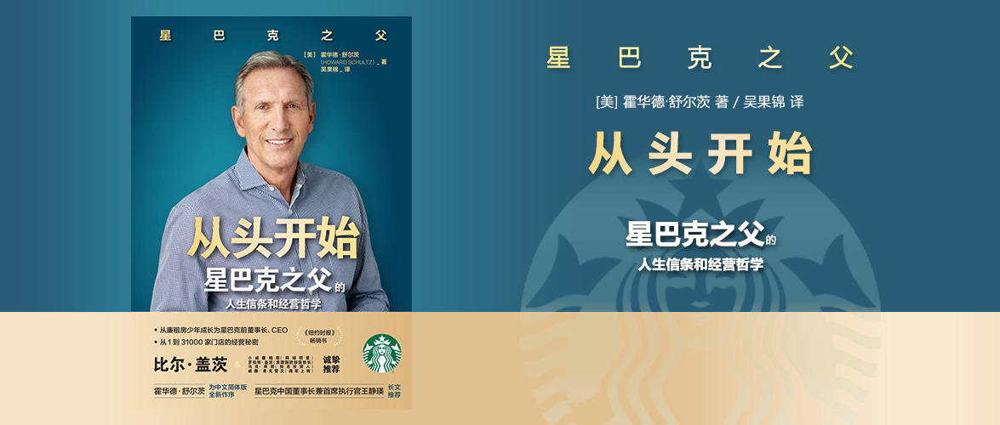

# 从头开始

星巴克之父的人生信条与经营哲学

[美]霍华德·舒尔茨 著

吴果锦 译

ISBN: 9787559642974

## 第一部分 梦想开始的地方

### 第一章 在艰难中成长

父母都是低收入群体，家里还被外祖母用作经营赌场，从小家庭就没有给霍华德留下好印象。

### 第二章 咖啡里的连接感

童年廉租公寓的运动场让我能获得自信和快乐，在那里能找到自己存在的价值。

最初的星巴克只卖全豆咖啡，但以阿拉比卡重度烘焙为主，霍华德出差意大利后才知道了意式浓缩、拿铁等，回到美国后他希望引入这种意式咖啡的形式，但并未得到当时星巴克老板们的支持。

### 第三章 “异类”星巴克

筹钱（无数次地被拒绝）到招人（要招聘有能力、亲切感的人），为全员提供医保，为全员平等发行优先认股权。星巴克从诞生之初就希望为伙伴创造更好的生活，员工在这里获得了尊重和经济回报。

### 第四章 如何穿越泥泞

星巴克在2008年遭受了利润下滑并陷入了危机，重新审视企业的价值观并与全员一起扭转局面，最终走出了泥潭，即便在公司最危急的时刻，也没有削减全员医保等员工福利。

### 第五章 无能为力是改变的开始

母亲有抑郁症，但是我却无能为力，加上生活在贫民区，让我立志要摆脱这种无助的境况。

### 第六章 在变局中不做旁观者

美国政治的两派相争，我不做旁观者，两派人士更多只在乎自身利益却无法代表人民做出利民的政策，我希望通过自己的力量做出一点贡献，我先后写了三封公开信，号召星巴克咖啡师在饮品上写“团结起来”，组织伙伴和顾客写下请愿书并送至国会，作为企业公民，我不能袖手旁观。

## 第二部分 星巴克的重塑和使命

### 第七章 工作的尊严必不可少

在星巴克我遇到了一位失业者，我立志要为大量的失业者做点什么，在经过大家的头脑风暴后，决定利用众筹的方式，借助非营利机构的渠道为这些心怀梦想的失业人员提供援助。

这一经历的背后是早年收购星巴克时的经历，当时为了完成收购四处筹钱，后来得到了老比尔盖茨的帮助，他让我明白了一个道理，**陌生人也可以帮助陌生人**。

### 第八章 当星巴克遇见善良天使

星巴克借助CDFIs发放了贷款并向需要钱的小微企业提供了贷款，为美国创造就业岗位项目是在践行企业价值观。

### 第九章 我们的义务

从我个人而言，我并不希望入伍当兵，但即便如此我仍敬重军人，特别是他们为国而战死负伤。

### 第十章 招聘不是慈善活动

从最初被误解歧视军人群体，到后来免费为军人提供咖啡、在部队附近开设门店、为他们提供就业机会，也是在践行星巴克“成为社区的积极力量”的使命。

### 第十一章 磨难是人生的“意外”

军人不论是出于爱国还是其他原因，平民很难了解到他们的经历，不论是身体上受的伤还是心灵上受的伤，他们可能在战争中面对生命的脆弱和无助，星巴克应该为退伍军人做点什么。

### 第十二章 为他人铺路的责任

丽莉雅妮是星巴克总部的一名咖啡师，她的童年经历过种族大屠杀，她的家人几乎无一幸免，悲痛和死亡与她如影随形。在她聊天后，我帮她实现了进入公共事务部的愿望，丽莉雅妮是通过看奥普拉的节目，增强了自己的信心，让她变得坚强，在奥普拉到访时我帮助她们相见。

小时候父亲欠了债，写了借条让我去借钱。当年的借条直到父亲去世的葬礼上再次出现，我感到无地自容。

一次偶然的机会，我获得了西雅图市的超音速队的股权，但因为它入不敷出，我又无法说服市政府新修场馆，所以最后我不得不将它卖了，但新的买家也未能说服政府，最后它被搬到了外地，这个城市从此不再有这支球队，这让无数市民将这一责任归咎于我。

### 第十三章 我相信应许之地

让退伍军人获得足够的尊重和荣耀，让全民相信应许之地，而不仅仅只是说声谢谢，这是对军人事业更深层次的思考。

### 第十四章 教育是最好的承诺

除了全员医保，我们还应让伙伴有更好的福利，特别是当医疗费有所下降后，而在我们的伙伴中72%的伙伴没有学士学位，能否让大家有机会上大学呢？

### 第十五章 像星巴克那样为你投资

为了让那些未上大学的人改善自己的收入，完成大学，星巴克与亚利桑那州立大学建立了合作，并圆了那些伙伴的梦。

## 第三部分 让星巴克成为纽带

### 第十六章 咖啡馆里的讨论会

从一个黑人被经常无端致死（[乔治·弗洛伊德之死](https://zh.wikipedia.org/zh/%E4%B9%94%E6%B2%BB%C2%B7%E5%BC%97%E6%B4%9B%E4%BC%8A%E5%BE%B7%E4%B9%8B%E6%AD%BB)），我开始思考种族问题，并在公司里组织公开讨论会，后来这个讨论会扩展到全国，引发了大家的思考和共鸣。

### 第十七章 第三空间的热点议题

我曾发起关于种族的讨论并希望通过门店派发小册子，并在咖啡杯上写下种族团结的口号，但此举引来了大量的负面新闻，但我坚持认为这是变好的开始。

### 第十八章 重新思考人生的可能性

大学毕业后我加入了[施乐](https://en.wikipedia.org/wiki/Xerox)公司，成为了一名销售。这个职业鱼龙混杂，既有常青藤毕业生也有普通人，这个岗位靠业绩说话，也因此我获得了稳定的财务收入，从此改变了自己的命运，因此给年轻人一份工作是能改变他们命运的方法，为此我和基金会一起筹办一场招聘会，让那些没有办法找到工作的年轻人有机会获得一份收入。

### 第十九章 给“机会青年”一个新开始

在招聘会的现场35家公司招聘了700多人，这些工作给这些机会青年一个新的开始 也可能是他们全家新的希望。企业在享受美国创新机会的同时，只有让更多年轻人有收入有工作，这样良好的创新环境才能维持得下去。

### 第二十章 帮助那些没有“毯子”的人

在阿巴拉契亚山区的例子让我对就业、吸毒有了更深的认识，这是一个以煤矿业为主的区域，而产业衰退带来的影响巨大，以此为生的居民不得不离乡去外地谋生。许多雇主无法兑现医疗保险，将企业一关了之，当地的医疗部门则滥开[阿片类药物](https://www.who.int/zh/news-room/fact-sheets/detail/opioid-overdose)，导致患者药物成瘾，最终导致该区域高失业率和高吸毒率，受此影响的不仅是受这个经济链条所困的年轻人，也包括他们的下一代。

### 第二十一章 在进取中探索未知

布兰登收购了西弗吉尼亚州的一个废弃工厂，改造成了一个非营利公司，为当地人提供就业岗位，他最初也是看到了当地人有谋生技能但当地的经济不行导致这些技能没有用处。通过提供就业，当地人在传统煤矿产业之外又找到了新的谋生手段。

### 第二十二章 中国星巴克的“伙伴家庭论坛”

我的父亲60岁得了肺癌，而我不得不离开纽约去西雅图工作。

方容，一名中国星巴克门店经理的母亲，被怀疑得了癌症。母亲在柳州，但自己工作生活在武汉，相隔20小时的火车车程。

刘新芳的父亲是位农民，连小学都没有毕业，刘新芳上大学期间兼职做星巴克咖啡调配师，毕业后拒绝了大学任教的机会而选择了全职加入星巴克，他希望给父亲买医保。

郭文君18岁时妈妈生病了，自己突然就成了家里的顶梁柱。母亲已经得了6年癌症，父亲被迫辞掉了出租车司机的工作照料妻子。

王海迪也把家庭作为了唯一的幸福快乐之源。他的父亲也不敢相信普通员工以及家人可以和公司老总平等对话。

家庭在中国人的观念中如此地重要。

肖惠玲的母亲重病住院，医生要求支付3万元重症救治费用，而她已经债务缠身，星巴克通过星基金为他快速筹集了5万元资金帮她度过难关。

在之后的日子里，我和很多的中国高层见面，并宣传我们的理念和价值观，也获得了高层的认可。

### 第二十三章 星巴克欢迎你

美国从建国起就是个移民国家，但是时至今日特朗普政府发布的穆斯林禁令却与这一初衷背道而驰，它们不是我们的敌人，他们同样需要帮助。星巴克愿意为难民提供1万个就业岗位。

### 第二十四章 我们的角色和责任

在一个下午两名非裔美国人在费城的星巴克门店因没有消费也没有离开而被星巴克店员报警让警察带走。这件事在社交媒体迅速发酵并产生了大量舆论。星巴克一贯宣扬种族平等备受质疑。这次公共事件的发生也给星巴克一次改良自我的机会。

### 第二十五章 告别星巴克，成为更好的我们

在费城事件后，我们给全员做了培训，但我知道这是微不足道的。为了能给更多人搭建机遇和桥梁，我选择了突破星巴克董事长兼CEO的角色定位，退休并重新出发。回到了卡纳西看了上学出发的地铁、小学、公租公寓……

## 后记 勇敢攀登

我和雪莉去了诺曼底登陆的海滩，是曾经的美国人牺牲自己换取他人的幸福生活。而当今的美国政治精英们却做得不如当时。我们努力为子孙后代创造更少分歧的社会，让他们拥有教育、就业、医疗的机会公平，实现真正的人人平等。

## Kindle MyClippings

### -HighlightLoc.172-75|AddedonFriday,January02,2023,06:07AM

父母塑造了我们的价值观和信念，培养了我们的欲望和行为模式。每当我回顾童年，想在“过去”和“现在”之间连点成线时，一幕幕场景就会浮现在我的眼前，又寒心又温馨。我看到的，是我几乎不了解的两个人，他们却影响了我对自己、对亲人和爱人、对星巴克所做的种种决定。

---

### -HighlightLoc.353-56|AddedonFriday,January02,2023,06:47AM

他矫捷地磨好咖啡粉，量出分量，再将其放进闪闪发光的铬合金机器上的一个短柄过滤器里，机器咯咯作响，他拉了一下控制杆，一缕琥珀色的液体就注入下面白色的瓷杯里。在闪展腾挪之间，他还用意大利语跟吧台前面并肩而立的三位顾客聊着天，语速极快。

---

### -HighlightLoc.363-65|AddedonFriday,January02,2023,06:49AM

当时我是西雅图一家小型咖啡豆烘焙商的营销主管兼零售商，其商标是一条袒胸露乳的美人鱼。公司的名字来自赫尔曼·麦尔维尔的小说《大白鲸》(8)。小说主人公亚哈船长的大副名叫星巴克。

---

### -HighlightLoc.455-58|AddedonFriday,January02,2023,11:22AM

宏大的世界观、聪明才智、强烈的家庭价值观。她爱冒险，却非常理性；静时悠闲，动时活力四射。她野心勃勃，却不独断专行，我对她的自信尤其钦佩。她很固执，只要认定正确的事就不会退步。她比我认识的其他同龄女性更成熟，却不会把自己太当回事。跟我一样，她对人生有更宏大的设想，尽管尚不知道未来的人生将会怎样。

---

### -HighlightLoc.491|AddedonFriday,January02,2023,11:28AM

努力、有责任心、有创业精神的楷模，这是我从父亲身上学不到的优点。

---

### -HighlightLoc.497-98|AddedonFriday,January02,2023,11:29AM

我的商业模式的基础是，“天天咖啡”和意式咖啡吧将会成为西雅图大众的日常消费，并最终扩展到其他城市。

---

### -HighlightLoc.540-41|AddedonFriday,January02,2023,11:45AM

创业者而言，“继续前进”和“半途而废”之间的界限是如此模糊，仅在一念之间而已。更何况，连我的岳父都看不下去了，在12月的那个寒冷的傍晚，

---

### -HighlightLoc.562-64|AddedonFriday,January02,2023,11:49AM

首先是招人。我寻找有能力、有亲切感的人，就像我在意大利见到的咖啡调配师一样。我要招的人，要享受这份工作，愿意为喜欢的公司供职。我曾向每位投资者说过，我的商业计划之一，就是创办一个工作

---

### -HighlightLoc.574-78|AddedonFriday,January02,2023,12:02PM

我们要在盈利和社会道德之间达成一种平衡。我们的价值观就是人的价值观。高尚、正直、分享、支持、合作、关怀、尊重、忠诚，这都是我在早期的公司宗旨中囊括的理念。我还想在其中加入一种热切的同志情谊：“我们要设立宏大的目标，竭尽全力将其实现，”宗旨里如此写道，“这是一次冒险，我们同舟共济。”

---

### -HighlightLoc.601-3|AddedonFriday,January02,2023,12:05PM

而言，若是一位咖啡调配师辞职了，再招到并培训出一位替代者，需要大约3000美元。而为一位咖啡调配师提供医保，一年只需要大约1500美元，是换人成本的一半。此外，很多顾客都是常客，咖啡调配师熟悉他

---

### -HighlightLoc.659-62|AddedonFriday,January02,2023,12:13PM

身为企业家，不仅要开发新产品、为顾客带来新的体验，为了公司的伙伴，在幕后也必须有所创新。创新举措要想维持下去，就得反映且推动企业的价值理念，而非仅仅追求利润。创业之初，我们并非事事顺利，所以，我们依赖诸多伙伴，让他们告诉我们做何改进。比如说，为

---

### -HighlightLoc.668-69|AddedonFriday,January02,2023,12:14PM

身为企业家，意味着总有失败，但只须聆听大家的反馈，再做出调整即可。

---

### -HighlightLoc.671-80|AddedonFriday,January02,2023,12:16PM

尽管在某些人看来，这样做显得过于慷慨，也有悖于“利润最大化”的经营理念，但事实上，它们都是使我们的商业模式行之有效的发动机。星巴克的成功，其根源是我们的基本产品：咖啡和顾客在店内的体验，亦即在一个温馨、吸引人、便于交际的零售业环境里制作并提供高档咖啡饮品。为了达到这一目的，我们需要这样的伙伴：致力并自豪于他们的工作，乐于到店里上班，乐于学习咖啡知识，乐于为顾客服务。给我们的伙伴更多福利，让他们享受公司成功的果实，能让他们更加投入到公司发展中。从更广泛意义上来讲，我在创业之初得到一些人的帮助，医保和“咖啡豆股”是我对他们的回报方式。对这些与我同行的人，我想给予他们这样的资助，向他们展现我对他们有同样的信任和信念。把员工福利从一星半点提高到合理标准，甚至慷慨到出乎预料，通过此举，我希望我们的伙伴明白—公司就是你们的后盾。

---

### -HighlightLoc.687-89|AddedonFriday,January02,2023,12:17PM

随着时间的过去，星巴克的饮品口味将达到逾17万种。随着每一家分店的开设，每一种口味饮品的开发，星巴克在社交和文化方面改变着美国。这是当初我在意大利那段神奇日子里所梦想却从未预料到的。

---

### -HighlightLoc.704-7|AddedonFriday,January02,2023,12:28PM

星巴克的流行，恰好赶上了当时的潮流。20世纪90年代，互联网和远程办公兴起，越来越多的人成了个体经营者或在家办公，也就是说，他们不必固定在办公室里上班。在星巴克，他们独处却能体验到某种集体感。与连锁快餐店不同，星巴克不追求快速消费。与餐馆不同，星巴

---

### -HighlightLoc.716-18|AddedonFriday,January02,2023,12:30PM

1996年，星巴克在日本开办了首个北美之外的分店。开业当天，柜台外排起了长队。接着我们又把店开到了新加坡、菲律宾、新西兰、马来西亚、英国。1999年，中国大陆也有了星巴克。

---

### -HighlightLoc.728-32|AddedonFriday,January02,2023,12:32PM

同样有价值的是，他在星巴克的企业文化中烙上了坦诚的力量和实事求是的重要性。他教给我这个少年时一心想要维护家庭和平的人—争议并不意味着不尊重，无须躲避激烈的争执。霍华德若是有什么意见，就会大声表达出来，他还鼓励大家也这样做。他从不避讳与人争执，对我尤其如此。通过他的领导风格，我明白了一个道理：坦诚交流，哪怕伤到感情，也是积极解决问题的起点。

---

### -HighlightLoc.747-49|AddedonFriday,January02,2023,12:34PM

我在最初制定的公司宗旨里写下了如下志向：“我们希望，在我们业务所及的地方，都能成为当地社区的经济、知识、社会的一分子。”在奥林的领导下，这一宗旨得到了实现。在他的任期内，星巴克

---

### -HighlightLoc.755-56|AddedonFriday,January02,2023,12:41PM

他的领导风格友善和蔼，大家都喜欢为他出力。在吉姆的领导下，公司持续成

---

### -HighlightLoc.824-32|AddedonFriday,January02,2023,12:51PM

零售业经营状况的一个衡量标准是“可比店面销售额”，即现有门店利润的同比增减率。在过去近二十年里，每天早晨，我都会早早起床，泡上咖啡，坐到电脑跟前，查看前一天的可比店面销售额。那时，数据还是很乐观的。在我职业生涯大部分时间里，可比店面销售额一直是我的快乐之源。在过去的十六年里，星巴克的可比店面销售额达到了5%甚至更多，这在零售界是个了不起的业绩。然而，2007年秋，坐在电脑前的我开始失望地摇头。可比店面销售额在不断下降，其含义令我焦躁不安。销量不佳不仅表现在屏幕的数据上，它还会影响人们的生活。以前担任星巴克的CEO时，我每天都揣着这份责任心。现在，身为公司的董事长，我觉得自己就像一位前任船长，眼睁睁地看着爱船慢慢沉没却无能为力。

---

### -HighlightLoc.835-39|AddedonFriday,January02,2023,12:52PM

除了我们加于自身的问题之外，我们面对的问题还有：顾客消费行为的巨变，连锁快餐店及自营咖啡店日益激烈的竞争，还有一场近在眼前的经济危机。这场危机最终演化成全球经济衰退，将对个人财产造成数万亿美元损失，导致信贷危机、房地产危机、高失业率，使美国经济数年内难以重振。

---

### -HighlightLoc.866-71|AddedonFriday,January02,2023,01:03PM

我常说，只要能在门店内、社区里、办公室里养成良好的人际关系，星巴克就处于良好的运营状态。要实现这一无形的目标，需要很多细节：友好而专业的咖啡调配师，新鲜却熟悉的门店装饰风格，反映顾客五花八门生活方式的饮品，既能管理团队又通晓财务的门店经理，精神和经济上都满足的伙伴……以上几个因素中，很少有能直接给公司带来利润的，但结合起来，它们就形成了我们内部所谓的“星巴克式体验”。

---

### -HighlightLoc.889-94|AddedonFriday,January02,2023,01:06PM

在随后两年时间里，星巴克推出了一些新产品，如VIA速溶咖啡。我们升级了店内设计，以展现咖啡之美，强化店内的集体感；我们在店内墙上挂上咖啡种植园的美丽照片或当地美术家的作品。很多门店放了长桌，以供多人使用。我们还升级了店内软件，以便高效记录顾客点单。我们将原有的意式咖啡机更换为矮一点的更好看的型号。我们开始在社交媒体上与顾客互动。我们加大了对全球咖啡种植园的支持。终于，新烘咖啡的香气再次在星巴克店内弥漫。

---

### -HighlightLoc.899-902|AddedonFriday,January02,2023,01:07PM

做生意，不可眼高手低，那样只会血本无归。做生意，要从细节处着手，面面俱到。在星巴克历史上这段风雨飘摇的日子里，我们要扎根于细节。星巴克的领导层，包括我在内，都必须放低身段，不再把自己当成身家100亿美元的业界巨鳄，而是像个个体商人一样。

---

### -HighlightLoc.953-61|AddedonFriday,January02,2023,01:17PM

精诚所至，金石为开。会场里的这些人，有能力扭转公司的颓势，我怎能对他们有所遮掩？他们需要真实的信息，这样才能各司其职。我还相信，告诉他们真相，能强化他们对公司的信任，能激励他们奉献。我相信，他们会团结一致、心怀希望，为了共同的目标奋斗，而非因害怕而临阵脱逃。“我们聚集在这里，是为了庆祝公司的传统，也为了借这个机会坦诚而直率地交流身为领导层的责任。”我走上台去，如此说道，“星巴克不是一家完美的公司。每一天我们都会犯错误。”我对大家解释说，我们或许正面临着自“大萧条”(3)以来最严重的经济危机。“这是真的，很严重。”我还解释说，老百姓已不再像以前那样有钱，而星巴克并不是生活必需品。

---

### -HighlightLoc.953-77|AddedonFriday,January02,2023,01:19PM

精诚所至，金石为开。会场里的这些人，有能力扭转公司的颓势，我怎能对他们有所遮掩？他们需要真实的信息，这样才能各司其职。我还相信，告诉他们真相，能强化他们对公司的信任，能激励他们奉献。我相信，他们会团结一致、心怀希望，为了共同的目标奋斗，而非因害怕而临阵脱逃。“我们聚集在这里，是为了庆祝公司的传统，也为了借这个机会坦诚而直率地交流身为领导层的责任。”我走上台去，如此说道，“星巴克不是一家完美的公司。每一天我们都会犯错误。”我对大家解释说，我们或许正面临着自“大萧条”(3)以来最严重的经济危机。“这是真的，很严重。”我还解释说，老百姓已不再像以前那样有钱，而星巴克并不是生活必需品。我们的伙伴需要明白，他们如何做才能为解决困难出力。“怎么做才叫责无旁贷？”我问在场的每一位与会者，“当你知道，你递给顾客的那杯咖啡达不到一杯意式浓咖啡的标准，那意味着什么？对我们观察到的、体验到的、学到的每一件事，我们每一个人都有责任、有义务。”如果他们制作的拿铁不合标准，我允许他们倒掉重做。我让门店经理选择—怎样做，对顾客而言才是正确之举。如此一来，我就给了他们“决策人”的角色。我还让他们做到责无旁贷，让他们明白自己肩上的责任，对彼此的责任，对家人的责任，以及对有赖于我们将“星巴克式体验”发扬光大的公司前辈的责任。我强调，我们过去所取得的成功并非“铁帽子”。我们要靠每一天的工作、每一杯咖啡去维持它。最后，我要求大家不要只盯着增加销量这一件事。如果星巴克不能盈利，我们就会慢慢消亡。如果星巴克消亡了，我们就不能继续创造人际连线，不能继续追逐公司的核心目标。这个目标，过去是，并将一直是—在盈利和社会责任之间谋求平衡。每名顾客都有权享用完美的饮料，有权在这个世态炎凉的世界受到礼待。此番在新奥尔良组织的会议及活动，其意图就是使我们的伙伴记住这两点。“星巴克这个品牌的能量，不在公司之外，”我做结语道，“而在你们诸位身上。”会后，数千位来自五湖四海的门店经理回到各自分店，带回去的不仅是新的专业知识。他们中很多人相信，自己拥有使公司东山再起的潜力，也有决心这样做。

---

### -HighlightLoc.980-1012|AddedonFriday,January02,2023,01:24PM

2006年的巅峰大降80%。在那个时期，我接到一位股东的电话，他在一家大金融机构负责理财，他很焦虑。“霍华德，我们持有这只股票很久了。我们知道你们目前压力很大，我们深信，你们现在应该砍掉公司的医保福利。”多年以来，星巴克在伙伴的医保上支付的钱，比投在咖啡上的钱还多。从2000年到2009年，每位伙伴的医保金增长了近50%。“大家都会理解你的，这是没法子的事。”他如此劝道。我们这番通话并不长。我们当然能这么做。是的，砍掉或缩减伙伴的医保，能立刻增加公司收益。华尔街一定会欢呼雀跃。可对数千位伙伴及其家人来说，这样就太不公平、近乎于残忍了。这样做，还会伤了士气，失去信任。那样一来，公司就万劫不复了。作为一家上市公司，我们对投资人有受托责任。我始终相信，为了给投资人谋求长远利益，公司首先应该为伙伴和顾客创造价值。可惜的是，华尔街并不这样认为。他们往往把全员医保或新奥尔良会议这样的投资视作有损收益之举。这种短视会影响公司的价值。华尔街不明白经常性支出的长远益处，恨不得每个季度都能见到收益。这种短视心态是现代资本主义的一个系统性症结。要想保持成功态势，公司要有必需的投资、冒险，还不可避免地会犯错误，但是他们对此却缺乏耐心和容忍。很多公司与华尔街沆瀣一气，也害怕短期的改造、改变甚至失败的代价难以经受时间的考验。然而，我也知道，星巴克的决策并非件件都得人心。有时候，企业的存活需要以个人或企业自身的牺牲和损失为代价。要使星巴克转危为安，需要改正很多错误，这是很痛苦的。比如说，星巴克前期开设的门店太多，所以被迫关掉其中600个效益不好的店。因为西雅图总部机构臃肿，我们不得不裁员。要想恢复赢利，维持公司运行，这些举措都是必需的。为此我很难过，但更难过的，是那些被解雇的伙伴以及目睹被解雇的同事收拾办公桌或交回绿围裙(4)的伙伴。我收到一些伙伴的电子邮件。他们觉得公司背叛了他们，质疑我们是否秉持公司的价值理念。其中有封信如此写道：“提供一种令人振奋的体验，使人们每一天都丰富多彩。你是不是忘了这句话曾经的意义？我没忘。”我要确保公司的成功能够延续下去，我从未感到如此责无旁贷。所以，尽管那位股东打电话来建议我砍掉伙伴的医保，但我并不考虑这样做。尽管我们迫切需要盈利，但我们所做的决策并非只盯着钱。2011年开始，星巴克连续30个财季实现了创纪录的收入和盈利。2007年，一份外泄的备忘录非正式地开启了星巴克的转型之路，随着星巴克扭亏为盈，逐渐转向增长模式，这一转变成为了星巴克历史的一部分。对我而言，星巴克的转型期令我大开眼界。我亲眼看到大家伙儿齐心协力的威力。我们将灭亡的阴影一挥而散，东山再起。安然渡劫之后，我振奋精神，还浮起一个念头：或许，星巴克的作用要远超我最初的设想。如此发展下去，或许我们能把公司发扬光大，实现出人预料的大抱负。这个想法终会变得势在必行。

---

### -HighlightLoc.1039-45|AddedonFriday,January02,2023,01:37PM

“我不是说人人才智平等，”肯尼迪对支持者们如此说道，“我要说的是，每个人都应该有机会平等地施展才智。”我和母亲站得离他很远，我记得，母亲伸长了脖子看着肯尼迪。她竟然在微笑，这并不常见。母亲身高5英尺4英寸(2)，她的身架子很小，一头黑发，穿着朴素。那天她热情洋溢。“如果我能当选总统，在我任期结束时，我想听到的评价是：在我的任期里，每一个美国人都机会平等，每一个美国人都平等地各施才智。这是我们仅有的目标，也是每一个美国人仅有的要求。”我仍记

---

### -HighlightLoc.1157-60|AddedonFriday,January02,2023,04:02PM

我渐渐意识到，在看到有人遭遇危难和体系崩溃之时，不可袖手旁观。假如两种困境俱在—人的苦难是因他人推卸责任或者对人有失尊重所造成的—那就是不公正。对我来说，不公正会令我不安，我会利用现有的工具和资源与之斗争。小时候，我能陪着母亲坐着，别人却做不到。长大后，我能把一半

---

### -HighlightLoc.1463-69|AddedonFriday,January02,2023,05:08PM

“我发现你每天都在，感谢你光顾星巴克。”我伸出手与他握手。握手过后，他把我叫到一边。他认识我。“先生，我每天都来，是因为我无处可去。”他不是无家可归。他说他有家，可他已经失业很久了。他找不到新工作，他说道。几分钟后，他哭了起来。我拍了拍他的肩膀以示安慰。在他脸上，我看到了父亲的影子。我知道，失业的破坏力很大，不仅仅影响到经济层面。有工作时，我们得到的不仅是收入。工作、工作的场所，都是快乐、自尊抑或耻辱的源头。干得好，使人心生自豪和目标感。工作不好或没有工作，会使人失去活力。

---

### -HighlightLoc.1474-75|AddedonFriday,January02,2023,05:10PM

维护人的尊严是星巴克的核心宗旨，包含在公司的使命中。

---

### -HighlightLoc.1626-27|AddedonFriday,January02,2023,05:55PM

为企业塑造价值理念、营造企业文化，就跟养育孩子是一样的，要趁早养成其行为模式和理念信仰。“天天咖啡”仿佛一个婴儿，

---

### -HighlightLoc.1668-74|AddedonFriday,January02,2023,06:01PM

老比尔·盖茨所做的并非是为我投资而已。他让我明白了，一个陌生人也能改变另一个陌生人的人生。这是个人生启迪。在我认识并娶了雪莉为妻之前，我总觉得是在孤军奋战，我不仅要谋生，还要出人头地。后来我为杰瑞和戈登工作，他们帮助我孕育了梦想。现在，一个我几乎不认识的人从天而降，保住了我的梦想。在我觉得除了妻子之外再无支撑时，老比尔·盖茨拉了我一把。他的义举我铭刻于心。我明白，我有责任保障他的投资，给他回报，还要感恩他一辈子。

---

### -HighlightLoc.1790-94|AddedonFriday,January02,2023,06:33PM

小企业是美国劳动力的支柱。小企业的发展，决定着就业岗位的增加。我们有办法帮助小企业发展。只须在星巴克的门店里或在CreatJobsforUSA.org网站向‘为美国创造就业机会基金’捐赠5美元，这笔钱将全部用于遍布美国各个社区的小企业的岗位维持和新设。您将得到一条腕带以示贡献。‘星巴克基金’将捐赠500万美元以示支持。大家齐心协力，不离不弃。

---

### -HighlightLoc.2060-62|AddedonFriday,January02,2023,07:41PM

我讲的都是跟他们有关的方面，如：信念要坚定；顺风顺水时领导工作就格外简单，逆境中却是相反；做生意时，往往要在信息不充分的前提下做出决策。我跟他们说，这些道理在战场上同样适用。

---

### -HighlightLoc.2706-7|AddedonSaturday,January03,2023,08:36AM

像天使一样善良，也像狮子一样坚强。虽然如此，但是直到有一天她坐在我办公

---

### -HighlightLoc.2846-50|AddedonSaturday,January03,2023,09:12AM

没有钱，并非仅仅指的是银行账户上的数字很小，它还会摧毁你的身心。没有钱，意味着缺少安全感，难有机遇，机动性差，健康难以保障，难以获取信息，没有时间，没有尊严，就像那时我们家—住在卡纳西的廉租房里，父母因手头拮据而焦虑羞耻—的气氛一样，如陷泥潭，令人窒息。

---

### -HighlightLoc.2873|AddedonSaturday,January03,2023,09:15AM

我把球队的所有权视作公众对我的信任。然而，说实

---

### -HighlightLoc.2888-90|AddedonSaturday,January03,2023,09:18AM

体育能为一个城市带来很多价值，如财政收入，如凝聚人心。我认为，他对这些价值都视若无睹。回想此事，我能明白，他认为纳税人的钱有更重要的用处。

---

### -HighlightLoc.2960-69|AddedonSaturday,January03,2023,10:02AM

当晚，在我们家里，雪莉宣布，舒尔茨家族基金会将首批投入3000万美元，用来解决退伍军人及其家人在向平民生活过渡过程中所面临的三大难题：就业、健康、家庭重组。第一，基金会将拿出时间，投入资源，以制定“特制的”职业培训和岗位设置项目，为退伍军人得到成功而持续的事业而搭桥铺路。第二，基金会将向慈善机构（如“OneMindforResearch”，以完成彼得·基亚雷利将军当初的请求）拨款，以深入了解及评估创伤后应激障碍和创伤性脑损伤的研究和替代疗法。第三，我们将为退伍军人及其家人制定综合的过渡项目。军人配偶同样做出了巨大的牺牲，因为要随军四处调动，常常要放弃自己的学业和事业。基金会将帮助军人家庭在离开部队之后顺利过渡到平民世界。我们将要和各种退伍军人帮扶项目携手，共同做成这些事。

---

### -HighlightLoc.2994-95|AddedonSaturday,January03,2023,10:06AM

人性之美的织锦，闪耀着勇气、刚毅、意志、荣耀、无私、战友情谊、对国家的义务……

---

### -HighlightLoc.3034-39|AddedonSaturday,January03,2023,10:14AM

我不知道，那些收看此次活动的观众是否考虑到一个更深层次的道理。除了在道德和经济方面至关重要之外，关怀退伍军人还有国家安全层面的意义。对任何一个社会来说，志愿兵都是举足轻重的。我们如果想继续吸引优秀人才志愿保家卫国，就得给予老兵应有的荣耀。不是简单的一句“谢谢”，而是一流的医疗护理和就业保障。我们的子孙后代必须深信—因为这是事实—脱下军装时，迎接他们的是富足荣耀的平民生活。保证这一点，是我们每个人庄严的责任。

---

### -HighlightLoc.3399-3403|AddedonSaturday,January03,2023,05:37PM

迈克尔·克劳有很多口头禅，但有一句话他重复得特别多：“我评判的标准是创造力，而非挑错的本事。”他引用的是古罗马哲学家西塞罗的话。我和迈克尔都认为，解决办法胜过花言巧语—这个道理并未得到充分贯彻，在首都华盛顿的政客那里尤其如此。在那里，指手画脚多过创造。

---

### -HighlightLoc.3712-15|AddedonSaturday,January03,2023,07:44PM

一位岁数较大且和蔼的咖啡调配师最后发言。他说：“解决问题的唯一办法，就是先把它摆到台面上讨论。谁知道呢？或许能从别人那里学到些什么，有些话题原本不想说，但是，如果每个人都说一点，或许这些问题就不会发生了。”

---

### -HighlightLoc.3723-25|AddedonSaturday,January03,2023,07:46PM

我开办星巴克，并非只卖咖啡，还想为人们提供一个交流集会的场所。在这里，大家都有归属，都能和睦相处，都能像我小时候在廉租区的电梯里一样彼此尊重地并肩而立。

---

### -HighlightLoc.3866-81|AddedonSunday,January04,2023,06:17AM

2013年召开的年度股东大会上，一位反对星巴克立场的股东在问答环节向我发难。“去年1月之前，我们公司还没把同性恋婚姻列入核心价值观，”当着全场股东、记者、伙伴们的面，他对着麦克风说道，“上次年度大会上，我曾问你，为了极少数人的私人生活而拿着所有股东的经济利益冒险，拿着所有伙伴的岗位冒险，是否是明智之举。”他声称那次抵制运动已经影响了星巴克的销售业绩（其实没有）。他说完了，大家都紧张地看着我。我站在台上，听他发言，我不想对他有失尊重。“像去年一样，我欢迎你踊跃发问。”我说道，“因为并非所有决策都只图盈利。”他妄言我们的生意因为支持同性恋婚姻而受到了损失，我就先从这里下手。我只须列出一个数字，就能打消他的忧虑。在2012财年，星巴克的业绩相当好。“我不知道你做过多少调查，”我说道，“但我认为，没有太多东西、公司、产品、投资……能在过去12个月里有38%的回报率。”对我而言，支持同性恋婚姻并非为了挣钱。我告诉他，“我们这项决策，是出于伙伴们的考虑。我们公司有20多万名伙伴，我们要接受多样性，各种多样性。恕我直言，去年你投资的回报率是38%，如果你觉得能拿到比这更高的回报，你有这个自由，完全可以卖掉星巴克的股份另投别家，非常感谢。”只有坚持核心价值观，星巴克才会兴旺发达。如若不然，就不会有今天的样子。

---

### -HighlightLoc.3918-19|AddedonSunday,January04,2023,06:26AM

“从百万个不同的角落里聚集起彼此的能量和胆量，这些微弱的希望汇成一股洪流，能够冲垮最坚固的压迫和阻挡的围墙。”在公司的会

---

### -HighlightLoc.4044-45|AddedonMonday,January05,2023,04:51PM

她解释道：“美国青年建筑团没有塑造我，而是帮我找回了自己。”

---

### -HighlightLoc.4075-83|AddedonMonday,January05,2023,04:55PM

在当时而言，施乐就是现在的苹果公司。毫不夸张地说，施乐的创始人开创了一个产业—大批量复印。一键复印大量文档，其革命性相当于20世纪80年代的个人电脑、20世纪90年代的因特网、本世纪前十年里的智能手机。20世纪60年代，施乐支配着整个复印产业，但到20世纪70年代末，这家公司慢慢被一种“流行病”所压垮。这种病症的出现频率出乎预料，且往往发生在成功的企业身上，那就是：傲慢。多年的快速发展，使得施乐内部产生了过分自信的情绪，管理层也出现了官僚主义的层级制度，失去了与市场的联系，而后者不断被价格低廉的竞争者渗透。除此之外，施乐不愿投资新产品以保持领先优势。它最大的优势在于拥有一支训练有素且进取心强的销售队伍。

---

### -HighlightLoc.4098-4104|AddedonMonday,January05,2023,04:58PM

我的工作是每天至少打50个推销电话。我通过两个途径获得潜在买家的名字。一是查询黄页，亦即今天的谷歌，有时候我会拨打某家公司的主机，然后要求与购置办公设备的负责人通电话。只要没人挂我电话，通常我都能敲下购买意向。但是，我更多的是走出办公室去逐家推销，我向前台和经理自我介绍，而后者对我所来何事毫无头绪。我的目的是获知有权购买办公设备的负责人的名字。回到位于市中心的施乐总部，我把信息汇报给一位业务熟练的销售员，后者会跟进并完成订单。我一边看，一边学习。有时

---

### -HighlightLoc.4108-9|AddedonMonday,January05,2023,04:59PM

宏伟的纽约公共图书馆。两头大理石狮子，分别叫“耐心”和“毅力”，永远地守护着图书馆的前门。

---

### -HighlightLoc.4128-32|AddedonMonday,January05,2023,05:59PM

我的好奇心令我的销售技巧如虎添翼。“你们公司哪年创办的？你们卖什么样的保险？你们在北美有几家工厂？在俄亥俄州就有两家？我女朋友是利马人！”我擅长销售，一部分原因是我工作勤奋，一部分原因是我善于快速与人建立联系。我的交流风格是少说多听。我一直比很多同事卖出更多施乐复印机。我还有一两次撞了大运，其中一次，我从一家法律事务所

---

### -HighlightLoc.4458-72|AddedonTuesday,January06,2023,11:18AM

在美国创办、拥有、领导一家公司，是一份非同寻常的特权。美国创造了无与伦比的好环境，使得创业者的创意能转变为赚钱的项目，使公司有望获得无限的增长和繁荣。但是，这一美国生活的独特之处能否经受住时间的考验，没有人可以保证。我们的经济无法长久发展下去，除非有更多人走上自给自足—而不仅仅是少数人先富起来—的道路。可是按照现在情况来说，有太多美国人想要奋斗，却苦于没有机遇。没有人教他们打领带，没有人帮他们树立基本的自尊，没有多少路能让他们走向更好的生活。我深信，美国的私营企业能代表国家做得更多，不仅仅是推出政府项目的替代品，而是在政府的角色之外想办法。商业能刺激创新，能辅助改造和解决问题，能利用他们的资源帮助公民和顾客接受更多教育，提高技能，信息更充分，效率更高，自给自足。他们不是孤立或自负成本，而是与政府部门和非营利机构创新合作。公共部门和私营企业是共同体。在新的公私合作关系中，我们能重构途径，帮助贫困人口脱贫，能重新思考美国人该如何接受教育和培训，以及雇主该如何发掘员工的潜力。我们能加深公众对企业的理解，能使公共实体部门掌握商业成功的原则—责任、创新、财务责任，使各种规模的公司都能更好地平衡社会道德和盈利的关系。

---

### -HighlightLoc.4560-75|AddedonTuesday,January06,2023,12:00PM

能告诉我，大屠杀(3)的教训是什么？”我们大吃一惊，聚精会神地听着。他叫起两个人回答问题，但对其答案不甚满意。“先生们，让我来告诉你们人文精神的真谛和精髓吧。”他回忆道，“二战”期间，纳粹像对待牲畜一样把数百万人关进火车车厢，再把他们运往集中营处死。无论老幼，都站在车厢里，挤得几乎没有落脚之地。车厢里没有食物，没有卫生间，没有暖气。“在毫无人道的畜栏里押送了很久之后，”他说道，车厢门突然打开。外面的光刺得眼睛什么都看不见。男女分开，母女分开，父子分开，然后都被赶到地堡里睡觉。地堡里，每六个人中只有一个人被分了一条毯子。“拿到毯子的人在睡觉时不得不做出选择，”拉比说道，“我是让其余五个没有毯子的人跟我一起盖，还是为了更暖和一点而自己盖着？”芬克尔拉比的身子仍然在抖，他环视桌子。“就是在这种关键时刻，我们学到了人文精神。”他说，集中营里的犯人都共用毯子。拉比站起身来，看着我们的眼睛，“拿着你们的毯子。拿回美国，跟其他五个人共用。”说完他就离开了。我曾无数次思考拉比的指引。它比我最初想的复杂得多。这个暗喻有无限内涵，恰逢“有毯子的人”与“没有毯子的人”之间的差异越来越大的时代，这一暗喻尤其令人深思。“分享”的意思是什么？昔日的“毯子”在今天对应的是什么？

---

### -HighlightLoc.4591-94|AddedonTuesday,January06,2023,12:03PM

美国人在帮助美国人，而我们只是将其事迹广而告之。2015年秋，《杰出人士》第一季上映。十部原创短片，可在星巴克网站、数字App、脸书上观看，全部免费。迄今为止，第一季和第二季—在亚马逊的视频服务也能看到—的观看人数已超1.5亿。

---

### -HighlightLoc.4743-45|AddedonTuesday,January06,2023,12:20PM

晚饭期间，我又听到了那句熟悉的话：“有个办法能帮助解决这个问题，那就是经济，好的工作。”在全国各个州里，西弗吉尼亚州是劳动参与率最低的。失业导致的绝望和厌倦，以及雇主罕为员工购买医保，都加剧了非法药物的滥用。

---

### -HighlightLoc.4781-85|AddedonTuesday,January06,2023,12:25PM

“舒尔茨先生，我只想让外界知道一件事。我们不是傻瓜。我们不是一群愚蠢的土包子，不要对我们有误解。我们想要工作，我们想要机遇，但我们的机遇被剥夺了。”乔伊对煤矿业、对政府、对国家体制有怨恨。西弗吉尼亚州大片土地产权被外州人占据，他们不向本州纳税。“要是他们纳税的话，”乔伊说道，“我们的日子就好过多了。”

---

### -HighlightLoc.4781-86|AddedonTuesday,January06,2023,12:26PM

“舒尔茨先生，我只想让外界知道一件事。我们不是傻瓜。我们不是一群愚蠢的土包子，不要对我们有误解。我们想要工作，我们想要机遇，但我们的机遇被剥夺了。”乔伊对煤矿业、对政府、对国家体制有怨恨。西弗吉尼亚州大片土地产权被外州人占据，他们不向本州纳税。“要是他们纳税的话，”乔伊说道，“我们的日子就好过多了。”西弗吉尼亚州人要的不是施舍，他们需要的，他们想赢得的，是第二次机会。

---

### -HighlightLoc.4874-89|AddedonTuesday,January06,2023,05:51PM

“要是煤矿又开了呢？你们会欢迎吗？”很多员工点头表示肯定。起初我无法相信。据我听到的那些故事，大多数煤炭公司对给他们挣钱的员工没有或少有尊重。他们的所作所为与我们星巴克的理念南辕北辙。在阿巴拉契亚山区，煤炭公司视人命如草芥，缺乏责任心，缺乏同情心，很不道德。可即便如此，这些年轻人还说愿意去挖煤。布兰登的一位同事注意到了我的困惑。他解释道：“如果一件事几乎是你生命的全部，除了它你一无所知，那么，哪怕它把你的生命置于危险之中，你也很难跟它分离。”他们甘于现状的心态与我活跃的创新精神大不相同。年轻时，我乐于横跨美国，开始新的生活。可这些与我同坐在废弃制衣厂里的人不愿离开故乡。他们和煤矿、和阿巴拉契亚山区紧密相连。离开这里，纽带就断了，也找不到自我了。即便是搬到繁华之地，也不是很多矿工的意愿。在父辈、祖父辈谋生的地方生活、死去，踏着前人的足迹，传承他们的传统和文化，对一些人来说就是人生的尊严。在他们眼中，被迫离开家乡，像候鸟一样断了根，不仅仅是危险、令人望而生畏，还是走下坡路。对很多美国人而言，地理和产业与身份复杂交织在一起。我认为，这种扎根精神，和探索精神一样，都是美国精神的本质。国家的体系—商界和政界—要为人民提供可行的选择，以满足这两种需求：或者安居乐业，逐渐发展、适应；或者探索变化、未知的外界。

---

### -HighlightLoc.4874-89|AddedonWednesday,January07,2023,06:31AM

“要是煤矿又开了呢？你们会欢迎吗？”很多员工点头表示肯定。起初我无法相信。据我听到的那些故事，大多数煤炭公司对给他们挣钱的员工没有或少有尊重。他们的所作所为与我们星巴克的理念南辕北辙。在阿巴拉契亚山区，煤炭公司视人命如草芥，缺乏责任心，缺乏同情心，很不道德。可即便如此，这些年轻人还说愿意去挖煤。布兰登的一位同事注意到了我的困惑。他解释道：“如果一件事几乎是你生命的全部，除了它你一无所知，那么，哪怕它把你的生命置于危险之中，你也很难跟它分离。”他们甘于现状的心态与我活跃的创新精神大不相同。年轻时，我乐于横跨美国，开始新的生活。可这些与我同坐在废弃制衣厂里的人不愿离开故乡。他们和煤矿、和阿巴拉契亚山区紧密相连。离开这里，纽带就断了，也找不到自我了。即便是搬到繁华之地，也不是很多矿工的意愿。在父辈、祖父辈谋生的地方生活、死去，踏着前人的足迹，传承他们的传统和文化，对一些人来说就是人生的尊严。在他们眼中，被迫离开家乡，像候鸟一样断了根，不仅仅是危险、令人望而生畏，还是走下坡路。对很多美国人而言，地理和产业与身份复杂交织在一起。我认为，这种扎根精神，和探索精神一样，都是美国精神的本质。国家的体系—商界和政界—要为人民提供可行的选择，以满足这两种需求：或者安居乐业，逐渐发展、适应；或者探索变化、未知的外界。

---

### -HighlightLoc.4963-70|AddedonThursday,February23,2023,01:01PM

星巴克中国董事长兼首席执行官王静瑛多年来一直向我教导其含义：“中国的儿女将孝道视作责任—让父母过上舒心的生活，不仅仅是物质方面，更有情感方面。”王静瑛还解释说，中国社会正在发生天翻地覆的变化，孝道也变得越发复杂。中国每年有700万年轻人从大学毕业，很多人都选择在离家乡千里之外的大城市里工作生活，因为那里的工作机会更多，工资更高。对这一代人来说，挣钱非常重要，他们大多数人都是独生子女，也是唯一能给父母养老送终的人。对很多年轻人来说，谋生不仅意味着自给自足、实现个人目标，还意味着供养家庭。我多多少少能理解一些。

---

### -HighlightLoc.5039-41|AddedonThursday,February23,2023,01:11PM

我的口音已经变了，但比利说话时还是布鲁克林口音。他劝我想开一点。“要是你爸爸是个成功人士，或许你就不会有那么大的动力了。”他如此说道。

---

### -HighlightLoc.5044-46|AddedonThursday,February23,2023,01:12PM

在我这一辈子里，我一直给人提供机会，给他们我当初需要的东西，让他们发掘出全部潜力，借此走出阴影。不论是出身贫困还是自力更生，或者二者兼有，我们都应该获得从黑暗走入光明的机遇。我

---

### -HighlightLoc.5072-84|AddedonThursday,February23,2023,01:21PM

《中国日报》（ChinaDaily）—中国国家英文日报—的一位记者问我，为什么公司要花钱帮助伙伴的父母。我回答说有两个原因。第一，并非星巴克所做的每一个商业决策都会立刻收到或可衡量的经济回报。我为什么这么说呢？因为对公司来说，为伙伴的父母买重疾保险是一笔很大的开支，而这个福利远远超出伙伴们对用人单位的预期。而我们的福利超过伙伴的预期时，就会增加他们的忠诚度和自豪感，继而促使他们对顾客热情服务，愿意留任。第二，我对记者说，这份给伙伴的父母的福利也是我个人的愿望。我跟他说了我父亲受伤失业没有任何资助的事。“每个人的童年经历都会影响其一生。”我解释道。王静瑛从另一个角度解释了这项福利：“有了这项新的投资，我们可以重新定义在中国经营的跨国公司的角色和责任。”三年前我曾公开提出的问题—对一家以盈利为目的的公司而言，其角色和责任是什么？—不仅仅局限于美国，而是任何星巴克有业务的地方。王静瑛站在自己的角度回答了问题。而在她所在的国家，星巴克费了九牛二虎之力才获得成功。

---

### -HighlightLoc.5125-27|AddedonThursday,February23,2023,01:26PM

王静瑛是个富有同情心的人，但是，她从未放低自己的高期望值或害怕对抗，尤其是对我。多年来，我们俩经常本着互相尊重的原则坦诚交流不同意见。

---

### -HighlightLoc.5147-53|AddedonThursday,February23,2023,01:31PM

在美国之外的国家做生意，我认为，星巴克不会像在美国一样能影响所在国的社会，但是，我们能通过业务去践行公司的价值观，并将这种价值观分享给其他领域的领导者，向他们展示“盈利”与“社会道德”二者兼得的可行性。星巴克中国宣布为伙伴的父母提供重疾保险的福利之后，第二天，王静瑛给我写信：“我们在中国保险业及很多公司引发了一场风暴。”很多企业的主管给她打电话，想要了解更多情况。“我们为别的公司树立了优秀的榜样，启发他们为员工多谋福利。”很多媒体报道了星巴克的良心和价值观。

---

### -HighlightLoc.5175-78|AddedonThursday,February23,2023,01:37PM

就像马云暗指的那样，咖啡只是星巴克体验的一部分，另一部分体验是集体感。在每一个国家，我们都设法以对当地社会有意义的方式把公司的价值观分享出去。星巴克不仅仅是要影响中国的咖啡文化，还在践行我们的领导风格。

---

### -HighlightLoc.5231-34|AddedonThursday,February23,2023,03:42PM

她发现，“难民”是一个法律术语，指的是那些因战争、政治迫害、自然灾害逃离祖国的人。国际法规定，难民有权在其逃难的国家受到保护，大多数难民都会选择邻国作为逃难地，因为容易到达。可是，全球

---

### -HighlightLoc.5254-66|AddedonThursday,February23,2023,03:45PM

自由女神像牌匾上的铭文节选自爱玛·拉扎露丝(1)的名诗《新巨人》（TheNewColossus），诗歌表达了美国对数代英国移民的欢迎：不似希腊伟岸铜塑雕像，拥有征服疆域的臂膀；红霞落波之门你巍然屹立，高举灯盏喷薄光芒。您凝聚流光的名字—放逐者之母，高举灯盏把广袤大地照亮。凝视中宽柔洒满长桥、海港。“扼守你们旷古虚华的土地与功勋吧！”她呼喊。战栗着缄默双唇：“把你，那劳瘁贫贱的流民，那向往自由呼吸，又被无情抛弃，那拥挤于彼岸悲惨哀吟，那骤风暴雨中翻覆的惊魂，全都给我，我高举灯盏伫立金门！”诗中表达出的宽广胸怀和慷慨大义已经传唱多年，说的是美国的独特优势：我们是一个由移民、难民、流放者、流动居民、俘虏、土著居民组成的国家，现在已经成为世界豪强。而难民禁令与此背道而驰，它在国内煽动毫无根据的恐怖，在全世界眼中变成一个言行不一的国家。

---

### -HighlightLoc.5354-55|AddedonThursday,February23,2023,03:57PM

仇恨会逐渐破坏民主。仇恨会侵蚀维护民主的人的心灵。仇恨还会影响我们的经济。仇恨不能正常化。

---

### -HighlightLoc.5362-82|AddedonThursday,February23,2023,04:04PM

我手拿一块无花果大小的红色三角形石块。我让大家传看一下。我对大家说，70年前，我跟一个朋友去了奥斯维辛(2)。奥斯维辛集中营是纳粹德国设立的最大的集中和灭绝营。我们去的那天，是个寒冷的阴天。我们走在营地里，经过一排排两层的砖房。在这里，数万名囚犯被关押在拥挤的营房中，晚上只能侧着身子睡觉。我们走过蜿蜒的铁轨，这上面曾经驶过一列列封闭无窗的运送牲畜的专列，里面装的却是来自欧洲各地的人。在这里，他们劳动，死去。他们别无罪过，只因为他们是犹太人、同性恋，或是因为与纳粹当局持不同政见或者是种族不同。我们从窗户向内看去，那原是一个个为大规模灭绝而设的毒气室。我们仰头看向毒气室的屋顶，那里的烟囱曾腾腾地冒着燃烧人体残骸的浓烟。我无法理解所站的地方曾经发生如此惨无人性的暴行。仅仅在奥斯维辛一个集中营里，就有110万男女老幼被杀。到“二战”结束、盟军解放欧洲时，共有600多万犹太人被杀。数年时间里，几代人就这样灭绝。在奥斯维辛参观的几个小时，让我看到了人性的邪恶。当代怎会发生如此系统性的恐怖事件？我当时这样想道。它是怎么开始的？又是怎么结束的？走出集中营，我俯身从泥土和沙粒中拿起一块石头。从那时起，它就一直摆在我的办公桌上。把它摆在眼前，为的是时刻提醒我，不仅是曾经的恐怖暴行，还有战胜邪恶所需的勇气和意志。我把参观奥斯维辛的经过及石头的来历讲给大家，接着环视四周。“在你们面前的，是个美国人，是个犹太人，是个为人父、为人祖父的人，是星巴克近四十年的伙伴。”我如此说道。接着，我表达了对夏洛茨维尔市抗议活动的深深担忧，担心它会影响我们的子孙后代。我说：“他们会铭记这些配不上美利坚合众国这一称呼的行为表现。”

---

### -HighlightLoc.5407-21|AddedonThursday,February23,2023,04:08PM

美国是世界上少有的几个由各国移民组成的国家之一。我个人认为，美国之所以与众不同，不是因为我们是个移民国家，而是因为我们为什么会有移民。为什么人们愿意移民到美国？他们是奔着一个理念而来。这个理念是如此强大、如此人道，能够打破时间和地理的边界。这个理念就是：所有人生来平等，有生命权、自由权和追求幸福的权利。其实，“人人平等”并非《独立宣言》最初的含义。当初美国的国父们写下“人人生而平等”时，指的是妇女、黑奴、印第安人。美国历史上的每一代人都为宣言的意义而斗争过。有些为了扩展其含义，有些为了限制其含义甚至缩减其含义。日久天长的努力下，宣言的含义变得更加宽广包容。但时至今日，“人人平等”仍然是一个需要践行的理念。每一代人都要继续奋斗，使其中的文字变成现实，恪守这一250年的理念，以其为人普遍接受的魅力继续吸引移民到来。我是移民的“产物”，是祖先勇气、运气、汗水的“产物”，是祖先犯的错误、自身缺点、经历的失败的“产物”，是美国理念的“产物”。我以浪漫主义的眼光看待历史，却以实用主义的眼光看待现在。美国当然不能撤销边界。我们需要一个清晰、可持续的移民政策，能更好地管理流入国内的，既无威胁又能为我们的经济和文化做出贡献的人。只要吸引这么多人前来且留下的理念还在，移民法就能做到合情合理。

---

### -HighlightLoc.5434-37|AddedonThursday,February23,2023,04:09PM

“领袖不是在蜜罐里长大的，也不是从宙斯的一根肋骨变出来的。”她在台上踱着步子，“领袖是后天塑造的，他们让自己接受塑造，参与到自身的塑造中去……你走的路，其实是你能上的最好的课。”她说，领袖会把经验化为智慧。

---

### -HighlightLoc.5456-58|AddedonThursday,February23,2023,04:14PM

历史证明沉默是不可原谅的，因为那会使偏执变本加厉。如果用温婉的话语假扮成道德勇气，就会被理解为毫不在乎，人性的恶将会肆无忌惮。

---

### -HighlightLoc.5543-46|AddedonThursday,February23,2023,04:38PM

星巴克成功转型之后，我就经常思考继任者的事。星巴克的下一任掌门人必须理解公司的价值观。我希望这个人不把领导岗位视作应得之物，而是凭能力挣来的权力。没有这些核心特质，星巴克不会走得远。

---

### -HighlightLoc.5566-85|AddedonThursday,February23,2023,04:42PM

“星巴克臻选烘焙工坊”（StarbucksReserveRoastery）绝非大号的星巴克门店。它们是我十多年梦想的一个化身。咖啡市场日益拥挤，消费文化也在改变—越来越多的人选择网上购物而非在实体店购物，星巴克必须设法把品牌和地点分离。“臻选烘焙工坊”是对人们相聚于咖啡的重新设想。我将其设想为沉浸式的第三空间。“咖啡界的威利·旺卡”(3)是我写在日记中的对它的设想，也是对总设计师丽兹·穆勒（LizMuller）的要求。丽兹是个创意天才，她立刻领悟到我所说的高级到店体验，也明白这对星巴克品牌的战略意义。她最终将“臻选烘焙工坊”变成了现实。2014年，全球第一家“星巴克臻选烘焙工坊”在西雅图开业。这家店位于一栋有着百年历史的老楼里，原先是一家汽车经销商的店铺。多层且不规则延伸的店内，其中心位置是一个功能齐全的咖啡烘焙工坊，包括一个巨大的、闪闪发亮的铜筒仓。来自埃塞俄比亚、印度尼西亚、哥斯达黎加及其他遥远地区的稀有的咖啡豆用麻袋运来这里。顾客可以看着咖啡豆被专业人士烘焙、冷却，再通过连贯地面到屋顶的蜿蜒的透明充气管道运送到各处。芳香的咖啡豆经过漏斗，或是抵达包装流水线，装包后运往世界各地，或是抵达咖啡台，随后被舀出，碾碎，冲制成咖啡。吧台之后，咖啡调配师一边用各种各样的冲制方式向顾客演示他们的卓越技巧，一边与顾客交流各种咖啡的起源。“臻选烘焙工坊”还有一份品尝菜单，顾客可以品尝各种风味的咖啡；还有一个品鉴吧台，各种新烘制的咖啡豆按盎司(4)售卖。就像我小时候见过的自动售卖餐厅一样，“星巴克臻选烘焙工坊”旨在呈现魔法般的感官体验。但咖啡豆从麻袋到杯子的全过程全部公开，没有墙壁遮挡。所有一切都呈现在顾客面前。2017年12月，全球第二家“星巴克臻选烘焙工坊”在上海开业。

---

### -HighlightLoc.5689-5703|AddedonThursday,February23,2023,04:57PM

当盖尔问我星巴克发生的事件是否属于种族形象定性，我认为她问的其实是—种族歧视是否非故意地、不知不觉地潜伏在人们的意识里。我的答案只能是“Yes”。我对人性中必然存在的无意识偏见已经了解太多，无法否认其感染程度。“我认为，毫无疑问，门店经理之所以报警，是因为那两个人是非裔美国人。”对此我感到羞耻，并认为自己也有责任。星巴克是个有机组织，从始至终基于一个理念在发展，说是理念，其实是个理想。顾客到店里来喝咖啡，我们的公司得以发展，与伙伴、与服务的社区分享成功。我们想做好事，想为股东谋利益。“人性驱动业绩”，这是我在描述公司的经营之道时常说的一句话。但人性是不完美的。不论是个人还是集体，虽然都有同情心、同理心、宽宏大量，但人类社会还是问题不断。虽然意图是好的，有时候是有意为之，但人及其创造的体系根本上还是不完美的，我们是有缺陷的。我们不断探索，要过上完美的生活，要组建完美的家庭，要经营完美的公司，要结成完美的联合，但却达不到，会犯错，有时候还会互相伤害。即便是亲人，也是如此。期望—比如说，人人生而平等—越高，摔得越重，但其成长的潜力也越大。“或许上帝是有意让这件事发生在星巴克。”

---

### -HighlightLoc.5778|AddedonThursday,February23,2023,05:10PM

《杰出人士》。

---

### -HighlightLoc.5788-90|AddedonThursday,February23,2023,05:11PM

“你们公司的基础是优秀的咖啡馆传统，”基思给我写邮件道，“排外，对任何第三空间来说，都是个致命的错误。”

---

### -HighlightLoc.5843-45|AddedonThursday,February23,2023,05:21PM

2018年3月29日，我们关停了美国数千家门店。每家门店门口都挂出一张告示，请顾客明天再来：星巴克自豪于成为您的第三空间，让每个人在家与工作之间找到归属感。

---

### -HighlightLoc.5893-5912|AddedonThursday,February23,2023,05:28PM

要描述“美国梦”，有一种办法是将其解释为“承诺”—人人都有生命权、自由权和追求幸福的权利。要追求幸福，我认为，就要获得相关的机遇，如教育、好工作、医保、所有权、家人及朋友的支持、陌生人的宽容。从表面上看，机遇像是好运，但同样存在于社会、政府、企业的体系里。多年来我曾走过很多地方，见过很多人，从中看到了“美国的承诺”在很多人身上难以实现的原因。他们的生活里不存在机遇，或被排斥在机遇之外。退伍军人—战争的摧残、政府组织的无能、无知而冷漠的平民，使他们无法顺利过渡到新的事业和健康的生活。学生—高昂的学费、沉重的助学贷款、缺少个人支持，使他们难以完成大学学业。机会青年—地域的隔离、缺少榜样，使他们无法找到人生第一份工作，无法进入职场。像洛根市及东利物浦市这种小城镇的居民—产业衰败、贪婪的煤矿公司、受医生影响的阿片类药物成瘾、妥协的政客，种种原因使该地区勤奋的人民难以养家，难以发挥技能，难以学习新技能，难以过上得体的生活。难民—错误的信息、恐吓策略、成见，使他们无法重建被战争和暴行摧毁的生活。有色人种—对真正平等的封锁，像偏执一样丑陋，像无意的偏见一样无形。多年以来，星巴克为更多人搭建机遇桥梁，其成果已远超我最初的设想。尽管如此，2018年，看到国内的情形，我还是一阵阵心痛。宏观经济趋势向好，股市一路上扬。但这只是冰山一角。我曾实地聆听人民的心声，他们有太多人仍然生活在阴影之中，尊严难具，机遇难求。我一次次问自己，我是否能够或应该突破公司董事长兼CEO的角色，促成积极的改变。要找到答案，只有一个办法。

---

### -HighlightLoc.5930-37|AddedonThursday,February23,2023,05:31PM

我发自内心地说：“在星巴克近五十年的历史上，我们面对和克服了太多困难和挑战，那时很多人都怀疑公司的竞争力，怀疑我们是否有能力闯过难关。”我说道，“我们的韧劲，就在于明白如何打造品牌资产。”我接着解释说，星巴克的品牌资产，就在于第三空间的亲密体验，在于我们与顾客、与同事建立的相互信任。过去几周时间里，星巴克的完整性受到冲击。我们能从不幸的时刻破壁而出，是因为那些爱着公司的人和那些对公司感到失望的人团结协作，由衷希望我们能变得更好。在我离开之时，作为离别礼物，除了一个众志成城的、对第三空间的重新构想—这个理念曾抚育、挽救、塑造了我的人生—之外，我别无他求。

---

### -HighlightLoc.6031-49|AddedonThursday,February23,2023,05:45PM

我转向雪莉，问道：“我们想让孙子、外孙生活在一个什么样的国家？”公墓里的这些烈士，为了别人有权选择在怎样的国家生活而战死，身在他们的墓前，我如此问道。我想让我的孙子、外孙生活在一个这样的国家，在这里，数百万人都有机会安稳地负担得起自己和家人的吃住和教育。除此之外，每个人因为真正有机会学习、工作而实现自己的成功，所有人都有平等的机会成为鸡窝里飞出的凤凰，就像找到了美国青年建筑团的卡门·威廉姆斯，在亚利桑那州立大学实现大学梦的玛赛尔·卡洛姆-赫比森，在星巴克找到工作的塞维尔·麦克尔拉斯-贝。我和雪莉正要上车离开诺曼底，这时我听到一个美国人说话的声音。一位男士和一位女士刚刚进入公墓。我走上前去打招呼，说我们是西雅图来的。这对夫妇来自巴尔的摩。妻子是位护士，丈夫是位律师。他们说，他们是来巴黎度假的。“你们为什么要来诺曼底？”我问道。从巴黎到这里需要开三个小时的车。“不想有什么遗憾。”那位女士答道，“我们到这里来，是要提醒自己—以前的美国人是什么样子。”她的话犹如一把匕首扎进我的心里。以前的美国人是什么样子。我听出了她话里的悲情，因为我曾经也有这种感受；但现在没有了，因为过去几年里我所目睹到的，尤其是本书中记录的一些经历，都使我相信—我们的国家不比以前差多少。美国还不是个完美的国家，但一直有人具备一些优秀品质—就是这位从巴尔的摩远道而来的护士所追悼的优秀品质。想一想本书中陆军上士勒罗伊·佩特里、军士长塞德里克·金的英勇和慷慨，比尔·克里索夫医生的责任感，大家就能明白了。

---

### -HighlightLoc.6063-6100|AddedonThursday,February23,2023,05:51PM

在本书中，我想通过很多人的事迹详述我们现有的对抗机能失调的潜力，如马克·平斯基的合作精神，迈克尔·克劳的创新精神，布兰登·丹尼森的创业气概，达科塔·凯斯校长对学生、对自己的坚定不移的信任。他们的事迹能提醒我们，特朗普总统及其政府那些错位的优先顺序，不代表美国大多数人的优先顺序。虽然担任公职的不乏正义之士，但是现在，共和与民主两党之中，都有人对多年来困扰我们的政治体系破碎的信任难辞其咎。事实上我认为，作为一个整体，美国人民比现有的政治阶层要好很多。作为一个商界领袖，我的任务一直是履行星巴克以往的价值观，其方式是让这些价值观在当代获得新生。为了达到这个目的，我一直努力学习，还鼓励别人开拓思路解决紧迫的社会问题。其间有磕绊，也有成就，我从中得知成功并非从天而降的馅饼。就美国人珍视的生活方式而言，也是如此：自由是争取来的。最近这些天，我总在问自己，也问别人，“争取”到底是什么意思；还有，我们前面的那些人—或者是自愿或被迫远离故土的祖先，或是自愿或被抽中征兵保家卫国的军人—对他们的奉献和牺牲，我们该如何继承发扬他们的遗志。我们是否有责任帮助美国的下一代实现梦想？是。眼下，我们每个人该如何为国奋斗、建设祖国？作为一个公民，我们的新角色、新责任是什么？我从心底里知道，现在这个存在偏见、不平等、故障的制度是错的、危险的。作为美国人，这些当政者令我们太多人感到愤怒和羞耻。就个人而言，看着社会千疮百孔，我不能安逸地坐在沙发上看新闻，或无所牵挂地经营公司，或安享退休生活。袖手旁观，不是大多数人的选择。我们必须看到时事背后的情况。我们必须重新构思“美国的承诺”。怎么做呢？用同理心去理解别人，提高嗓音谴责黑暗，通过投票选择领导层，一个我们想让孙儿辈受他们管理的领导层。但与此同时，我们必须用好自己的技能和资源，为自己、为邻人、为共同站在这片土地上的人打造一个更好的现实。我们可以抗议，也能有所计划。寻求真相，将它们广而告之。聆听别人的意见，集思广益。既要批评，也要创造。现在，是时候为一个更深层的共享的责任而努力了，为邻人，为陌生人，也为自己。美国人将一直存在不同，因为这是我们创造的共和制的本质。但我们欠子孙后代一个分歧较少的美国，就像祖辈为我们奋争了一个比他们那时分歧更少的美国一样。现在是时候全力以赴了。现在，是时候攀登、夺回高地了。要达到这个目的，我们必须做出选择，一个先前做过的选择。这个选择关乎国家的复兴还是衰退。美国历史上，我们国家曾屡次在面临衰退时绝处逢生，但我们同样知道，重振国家的荣耀不是一个被摒弃的结局。未来，不会因为我们是美国人就偏向我们。我们得亲自动手，争取未来，推动未来。时时刻刻，我们都要做出选择，用仁慈代替卑鄙，用大气代替小气，用爱代替恨，用和解代替僵局，用创造性的解决方案代替埋怨。作为一个国家，我们必须坚强，但不能以牺牲彼此的利益为代价。所以，我们要支持和赞美那些优秀的人—我们之中的杰出人士—因为有太多人，他们日常的意图和行为不逊色于过去的英雄事迹，他们为当代的诚实和正直而奋斗，他们早已开始重新构想“美国的承诺”，他们愿意在此后的岁月里为之努力。总而言之，让我们选择相信彼此，因为，从现在到永远，我们同舟共济。
