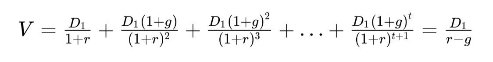

钱从哪里来
==========================

> 罗辑思维在2020年的跨年晚会上，引入了这本《钱从哪里来》。这是一本结合中国经济形式对现代金融进行分析的作品。这是一本追踪中国人财富轨迹，替普通的中国人寻找每年的财富逻辑的一本书。

作者：香帅

序 你的朋友，你的罗盘
--------------------------

- 2020年，经济增速会下滑吗？
- 中美贸易摩擦会造成大面积失业吗？
- 哪几个行业会异军突起？
- 哪些行业会逐渐消亡？
- 哪些城市在不可避免地走向衰落？
- 哪些城市有更好的明天？
- 哪些资产更有保值增值的潜力？
- 哪些人群的资产配置在发生变化？

提供一份中国百姓的财富解决方案，记录和解析中国人财富的下一段历史，做普通中国人代际财富增长过程中的伴侣。

第一章 高垂之果
--------------------------

### 引子

2011年，美国乔治梅森大学教授泰勒·考恩（Tyler Cowen）出版了一本叫《大停滞？》（The Great Stagnation）的书。书里写道：

> “美国陷入彷徨之中，经济状况令民众失望……中位数薪资就比1970年代增长了那么一丁点儿……”

美国人曾引以为豪的“中产社会”正在遭遇巨大的困境：1980年，全美最富的1%和10%的人群分别拥有整个社会20%和60%的财富；到了2014年，这两个数字变成了40%和73%。而50%的中下层及底层美国人，拥有的财富都不到全部社会财富的1%，在2008年金融危机期间甚至一度为负数。

考恩在这本书里对这些困境给出了自己的答案：因为那些容易摘取的“低垂之果”，比如廉价的资源、巨大的移民劳动力以及科技进步带来的快速经济增长，都在逐渐消失。

### 老梁的困惑和华小钟的苦恼

- 老梁是中型企业的老板，他纠结：该进还是该退？是留人民币还是美元？如果买资产，买什么？
- 华小钟是育儿嫂，她纠结：到底要不要买房。自己女儿成绩一般，是不是像健身教练、美容师、化妆师这些90/95后年轻人借鉴职业规划？

### 从低垂之果到高垂之果

2013年之前，中国的高速增长来自两种力量：“城镇化”和“全球化下的工业化”。但2012年到2013年，工业部门的就业人数达到峰值，按照历史经验，社会将向服务型社会转变。

2013年，房地产价格出现了分流了，结束了大中小城市普涨的局面。

从2012年到2013年，中国财富累积的两股驱动力都进入了过渡变化的时代——房产价值普涨的时代结束，分化分层涨跌波动将成为常态。收入的增长则不再仅依靠工业，而是会来自不同的行业和部门。

### 2019——2020年：中国进入万元美金社会

万元美金社会是一个国家或地区财富陨落和跃升的分界点：日本、韩国、中国香港上升，墨西哥、土耳其、阿根廷下降。万元美金意味着中产社会，中国的人口也加速向大城（都）市聚集。

与这种趋势相一致的是：职业选择、城市兴衰、房价分化，都呈现出和前工业化时代完全不同的面孔。

后面的章节将从不同的角度来展开论述。

第二章 林间有两条路
--------------------------

2019年，“裁员”是中国职场随时可能掉下来的达摩克利斯之剑。经济转型，人工智能，中美贸易摩擦……2019年一连串让人困惑的大词背后是普通中国人职业选择的分水岭。

- 裁员：河南富士康iPhone生产线、长安福特重庆装配厂、甲骨文中国区研发中心、三星惠州手机工厂
- 即将失业：省界高速公路收费员
- 逆势招人：苏宁“智慧零售”扩招、华为员工不降反升

### 职业与财富

在现代社会，人力资本的积累最重要的来源就是职业。职业选择不仅决定一个人职业生涯的长度和高度，更决定了其财富水平甚至家庭财富的代际传承。

对于绝大多数无法拼爹，也无法祈求运气的普通人来说，职业上“滚雪球”抑或“推石头”的选择，几乎是决定一生命运的事情。

### 金融视角下的“滚雪球型”职业和“推石头型”职业

每个人都可以被看作一个资产。这个资产的“基本价值”，就是其未来创造的所有价值的总和。如果一个资产未来每年创造的价值的增速很高，折旧率又很低，这个资产的基本价值自然就会高。

从“生理性人力资本”的角度看，每个人都面临着岁月的折旧，职场上的年龄歧视本质上是对生理性折旧的自然反应。但是“技能型人力资本”不一样，它折旧率低，甚至会增值。所以这种职业就是我们要找的“滚雪球型”的职业。

而这种职业并不单针对高学历，像健身教练就属于滚雪球型的职业。

在2019到2020这个拐点上，“人工智能”和“万元美金社会”都让职业选择变得更晦暗也更光明。

### 2020年：人工智能改造职业的“创世纪之年”

人工智能是一场技术革命，它正在改变各行各业。就像当年柯达的胶卷被数码相机取代，美国的制冰业被电冰箱取代一样。2019－2020年的时间节点上，人工智能对“可编码型”职业的冲击逐渐成为现实。

但并不仅仅是蓝领的流水线工作被人工智能冲击，许多曾经让人觉得光鲜亮丽的白领、金领也面临同样的窘境。比如：银行业的许多岗位、保险分销、承保、定价和理赔、投行分析员。

人工智能引领的技术革命和过去不同，过去只是入侵人类的体力劳动，而如今却入侵人类的脑力劳动。

但世界并非总是非黑即白的，在各个行业中，不同的岗位被人工智能取代的概率并不一样。与材料、数据打交道的信贷分析师、信贷审核员被人工智能替代的概率高达90%以上，但服务客户的信贷顾问被替代的概率仅为4%。

而且一些多行业的复合型人才需求正在加大。以金融行业为例，那些统计学、数学和计算机专业的博士，在他们眼里，所有的公司都只是一串串波动的数字符号而已，他们在数据的波动中寻找细微的规律，进行套利。

按照牛津大学经济学家弗雷（Frey）和奥斯本（Osborne）的说法，难以被人工智能取代的技能主要有3类：

- 社交智慧：社交洞察力、谈判能力、同情心等社交和情感能力
- 创造力：原创力和艺术审美能力
- 感知和操作能力：手指灵敏度、协调操作能力、应付复杂工作环境的能力

美容美发师、软件应用开发工程师、医护人员、小学教师，都属于不容易被人工智能替代的“滚雪球型”的职业。但这些工作中，也有很多环境是可以被人工智能替代的，比如，医生写病历，就属于此类，借助人工智能，这些行业只会如虎添翼。

人工智能有两副面孔：对于“推石头型”职业来说，它是摧古拉朽的秋风；而对于“滚雪球型”职业来说，它却是润物细无声的喜雨。

### 2020年：万元美金社会的职业新赛道

2019－2020年，中国进入了一个“怕死、爱美、孤独”的万元美金社会。这3种全民性的感受将逐渐成为社会的常态。这几个关键词所创造的需求和供给，都将是下一代职业选择的风口。

#### “怕死”的职业风口

由于食物的丰裕和医疗技术的进步，人类社会第一次出现了“老龄化”的概念，也带来了新的市场机会。社区养老、上门护理、陪伴看护、病后康复等医疗服务需求将快速增长。很多人可能都没有意识到，自己对医生、医疗行业的情绪和看法都在经历着缓慢却显著的变化。随着进入万元美金社会，人们往往会变得愿意为无形的知识、技术、服务付费。收入上升意味着消费从注重数量转向注重质量，从“使用”转向“服务”，从“有形”转向“无形”，人们对生命质量的要求自然也上了新的台阶。

同样是医生这个行业，同样是滚雪球型的职业，在一线城市三甲医院的医生和三线城市的普通医生，增长的潜力也是完全不一样的。

#### “爱美”的新世界

2014年“颜值经济”爆发的前夜，河狸家已布下美业的棋局，建立了覆盖美甲、美睫、美容、美发、化妆、健身等美业业务的互联网平台。

这个行业可能并不需要高学历，但仍然是“滚雪球型”职业，通过技能培训等上岗后，通过对护肤、美容、产品使用心得的掌握，也能够实现月入2万甚至更多。

类似的行业还有健身行业。移动互联网普及这样的技术变革，更给美甲、健身等手艺人加了杠杆。移动互联网平台建立了一个消除时间与空间限制、可以无限延伸的市场。

#### “孤独”的二次元

随着社会分工越来越细，人们可以不依赖家庭或集体提供的互助功能。大规模的城市化也为独居人群提供了完美的巢穴——餐馆、酒吧、超市、住宅区的各种生活设施，一个人可以生活得很滋润。

在很多人变得孤独后，“心理咨询”和“宠物行业”有了长足的发展。很多人或多或少都出现了心理问题，也有很多人依靠宠物来排解孤独。

### 每一颗种子都能找到自己的土壤

高学历，985/211这样的硬件优质条件不再是当下改善收入的唯一途径，新的趋势下，不同的人群都可以从中找到自己的机会。你可以根据自身优势禀赋选择自己的“滚雪球”赛道。一个萝卜一个坑，条条大路通财富。

第三章 位置决定命运
--------------------------

### 城市与财富：被忽略的选择题

#### 城市创造的奇迹

孙玲，一个从偏远农村来到深圳的高中生，大专文凭，上了华强北培训班，当上了软件工程师，到深圳大学完成了专升本，通过留学机构赴美，在美国为纽交所上市公司EPAM——谷歌云业务的重要合作商工作。

华为，一家从1987年做HAX代理商，乘着改革开放的春风，成就了一个万亿商业帝国。

#### 人类的财富创造从来都和城市紧密相连

扎克伯格从波士顿搬到了鬼谷，在彼得蒂尔第一笔启动资金的支持下，背靠斯坦福大学大批的技术人才，成就了Facebook。

马云在杭州，背靠长三角轻工业民营小企业，为他们解决信息不对称，高效交易匹配，成就了阿里巴巴。

#### 不同的城市带来不同的财富创造力

1992年，北京和广西南宁的双职工家庭收入相差无几，但到了2019年，年净收入能相差一倍，还没有算上房产增值的部分。

城市决定着你财富的上限，也决定着你财富的下限。

#### 城市选择指引人类的财富之路：微观原理

人无法选择先天的禀赋，就像一颗种子不能选择自己的基因和种属一样。但人可以选择城市，犹如蒲公英可以选择落地的土壤——同样的种子，在肥沃的土壤、温润的季候风中结出的果实和在贫瘠的土地上结出的果实是不一样的。

在顶级经济学期刊《政治经济学杂志》（Journal of Political Economy）中，普林斯顿大学的教授埃斯特班·罗西－汉斯伯格（Esteban Rossi-Hansberg）等人总结道：“一个人所站的位置，决定了他的生产效率、收入以及福祉。”

### 位置决定收入

在河南出生的李华，如果在户口的限制下，以种地为生，7口人的平均月收入是179元，6亩地净收入是15000元，李华外出去了广州制衣厂打工，1999年一个月的收入是800元。

在美国，城市人口比重从1800年的6%上涨到1950年的60%多，用了150年的时间。在此期间，人均收入增长了近8倍。在我们国家，从村镇走向城市的人口持续增加，城市人口比重比1950年的11%上升到1996年的30%，再到现在的60%，仅用了近70年的时间。在此期间，人均收入增长了近20倍。

### 2020年，万元美金社会与城市再选择

多个纬度的测算表明，中国当前的大城市集聚程度还很有限。

2006年世界平均的人口集聚程度是52。其中美国是72.3，日本是92.9，韩国是89.6，英国是84.7，中国是36.2。

2019年，中国常住人口最多的前30位大城市的人口数量占全国人口的比重才达到25%，远远低于同期美国46%的比例。

每平方公里的产出，北上广深是2亿~3亿美元/平方公里，新加坡、首尔是5亿美元，东京为7亿美元，纽约接近10亿美元。这些国际化大都市在单位面积上的高经济产出，均由人口规模支撑。

所以，“聚集”仍然是中国城市人口的发展趋势。

### 网络人口：中国人的迁徙和分布

2019年的网络人口分布情况告诉我们：

城市选择中的马太效应正在不断增加，从小城汇聚到大城市的城市选择拐点正在到来。

在这种群体流动中，人们的选择并不是随机的。通过分析数据我们发现，2019年中国人的城市选择主要基于“就近”和“经济”两个原则——人们就近聚集，选择离家最近的经济发达的城市。

>在人口流出的城市中，作为传统直辖市的天津是个令人惊奇的存在：户籍人口1050万，常住人口1557万，而这座城市的活跃网络人口只有1402万。也就是说，人们的脚步在选择离开天津，去往北京、上海、深圳、石家庄、郑州及天津周边的廊坊、唐山。究其原因，是因为天津的第二产业占比高达43%，其经济体内部没能演化出很好的支柱型服务业，所以人们的脚步会转向服务业更发达、生产效率更高的其他“火焰之城”。

### 规模、规模、规模——大城市的胜利

北上广深的人每天挤着拥挤的地铁上下班，无独有偶，东京也是一样的情况。

为什么大城市有这么致命的吸引力呢？原因很简单，因为这些城市里隐藏着财富的“规模溢价”。不同规模的城市给居民带来的财富创造能力迥然不同。

规模越大的城市，学历和工作经验的溢价越高。程序员就是这样一个行业。人口规模越大的城市，程序员的学历溢价越高、工作经验的溢价越高、年均工资增速越快。

#### 城市规模的知识外溢效应

更直白地说，大城市支付给我们的高薪酬，不是因为房价和生活成本更高，而是因为我们的人力资本成长更快。

人口规模撬动的知识外溢效应还体现在“创新”上。文明创造和城市密不可分。当人们因为知识、贸易而集聚在一起的时候，新的智慧就产生了。

北上广深加上有1766万人口的杭州，孕育了计算机硬件行业84.2%的获投企业份额，通信行业81.2%的获投企业份额。在高端工业制造和电子制造行业，80%以上的获投的初创公司，都位于人口规模在1000万以上的大城市。

当前中国的创新版图，其实和美国硅谷、波士顿128号公路科技长廊非常类似，它们都指向一个逻辑：具有一定人口规模的中心大城市，是最好、最强的知识聚集地，自带很强的向心力。很多需要知识外溢效应的行业，比如互联网、金融、软件等，根本离不开大城市的怀抱。

#### 城市规模的专业化溢价

人口规模还拥有一种魔力——巨大的市场容纳度可以让每个人找到自己的位置，获得“专业化溢价”。

北上广深四城市人口规模占全国1/14，吸纳1/4的餐饮业就业人口，再大城市，将餐饮外包的机会成本相对比较小，这背后的逻辑就是城市规模的专业化溢价。

### 大城市和小城镇的合作博弈：规模溢出效应

一般认知中，大城市的胜利意味着小城镇的失败。但2019年的中国出现了一个新趋势。许多蒙尘的小城镇忽然释放了光芒。

从亚马逊选择第二总部的过程来看，它们都是大城市规模效应外溢的受益者。

企业考虑选址时，有三个重要因素：成本、劳动力和知识外溢。

2019－2020年是我国大城市规模溢出效应凸显的时期。背后的逻辑是，人们向大城市集聚。大城市规模效应不断强化的同时，发展工业的成本也在不断攀升。2013年是我们国家极其重要的拐点。在这之前，工业主导与服务业主导的城市在GDP增长率和人口增长率方面平分秋色。2013年之后，工业主导的城市增速——无论是人口增长率还是GDP增长率，都被服务业主导的城市远远地超越。当前一批服务业主导的“火焰之城”在持续吸引人口集聚、推升单位面积经济产出的同时，也使得单位面积发展工业的机会成本大幅增加。这就给了很多小城镇发展工业以及其他非人力资本密集型产业的机会。

#### 技术重构：接入大城市规模的小城镇

当前最大的技术变革来自移动互联网技术——它是终端技术、通信硬件技术、互联网技术等多项技术进步的结晶，人们用一部智能手机就可以实现个体间，以及个体衣、食、住、行等行为间的交互、互联。

如果把100万人口以下，同时经济实力较弱的区县定义为“小城镇”，那么我国有2445个小城镇，占总城镇量的85.52%，聚集8亿网络人口。而移动互联网衍生出来的平台企业，让少部分小城镇有机会接入到城市的网络中。

盒马鲜生就是这样一家企业，它左手是零星散落在全球的供应点，右手则连着大城市巨大的消费市场。甘孜藏族自治州丹巴县八科村，黄金荚农作物的案例就很好地说明了，在移动互联网精准掌握个体需求的情况下，向八科村采购黄金荚，实现了农超对接，改变了八科村的财富机遇。

第四章 遇见房产拐角
--------------------------

### 不同的城市，相似的命运

英国古典经济学家威廉·配第说：“劳动是财富之父，土地是财富之母”。两个国家（中美），两座城市（中国·鹤岗、美国·底特律），在不同时间隧道里的经历，多少有点类似，都是城市增长停滞，房价雪崩式下滑，居民财富大幅缩水。

2019年4月网上盛传，鹤岗，这个曾经是黑龙江省四大煤城之一的资源型城市，在煤炭资源枯竭后，房子总价16000元，300元/平米.

2013年，美国底特律惊现“1美元，买走一套房”的广告。

### 房地产：增长与财富

从发达国家的历史经验来看，伴随国家的经济增长，房地产都出色地完成了分享增长红利、抵抗通货膨胀的任务。

从全球范围看，房地产在居民总财富中的占比：美国26%，英国35%，德国42%，意大利50%，西班牙60%，印度77%，中国54%。

### 中国不一样？

房子的价格反映的是房子所在土地的价值。而土地的价值来自这片土地上经济的增长潜力，即大家对这片土地未来可以创造多少财富的预期。

2000年以来的近20年，可以说是中国房地产的黄金年代，几乎所有的城市的房价都在上涨。随便买一套房子，就可以战胜几乎所有的理财产品。而这反映的正是中国过去20年超高的经济增长速度。

另外，中国的高房价和我国信用市场的特殊性也存在一定的关系。在现代经济中，财富和信用紧密相连。中国国家信用强大，民间信用薄弱。自1998年开始，政府将土地作为类似股权融资的工具，为城市建设提供源源不断动力，作为土地价值的载体，我国的房地产市场拥有的是“王的信用”，具有强大的资金筹集能力。相比之下，股票、债券等市场缺乏强大的各级政府的信用背书，信用相对薄弱，吸纳资金的能力就要差很多。

### 2019-2020年：这次不一样？

房地产这个词在2019年却显得格外冷。实际上，中国这一轮对房地产市场的调控从2016年下半年就已经开始了。政府采取了各种政策限制房屋买卖，包括限购、限贷、限价、限售、限商。2017年4月，央行开始实施金融去杠杆，收紧货币政策，尤其收紧对房产行业的信贷。

但是房地产未来的走势怎么样呢，两个方面看：

第一，房地产财富的内在价值取决于中国的长期增长趋势，而房地产财富的价格波动则会受到宏观经济政策的影响。如果对中国未来经济的增长保持乐观，就基本可以对中国未来的房价保持乐观。

第二，虽然中国房价增长的长期趋势不会改变，但是增长的模式却在发生结构性的改变。正如第三章所说，在这样的关口，人口的流动方向由从农村到城市变成了从小城市到大城市。中国人口流动趋势的变化，直接映射了楼市的分化。城市的房价正从普涨时代，逐渐进入分化时代。

我们即将告别那个“闭眼买房，躺着赚钱”的年代，只有买到真正有价值的房子，才能保证投资的回报。

中国的房产财富，从人人都可以摘到的低垂之果，变成了高垂之果。

### 戈登模型：替房地产定价

一个资产的价格就应该等于它未来创造的现金之和的现值。美国城市经济学宗师格雷泽借鉴了金融学里著名的戈登模型，给房地产定价。这个模型不复杂，就是未来一年的房租贴现到今天的现值的总和，公式表达如下：

在这个公式中，V是房地产的价值，D1是下一年的租金，r是贴现率，g是租金的增速。

### 诺奖得主错在哪？

2013年诺贝尔经济学奖得主罗伯特·希勒（Robert Shiller）就曾用“房价收入比”指出中国房价有泡沫：“美国加利福尼亚州房价与收入之比为8～10，而在中国的深圳、上海等大城市，房价收入比达到36，这令人担忧。”但后来房价反而又增长了不止一倍，房价收入比也从之前的30多，涨到了40多。

其实，秘密都隐藏在租金增速g中。中国大城市的房价收入比之所以远远高于其他国家，是因为这些大城市未来的收入增速要高于其他国家。在未来一段时间内，中国经济增速预期还将保持在5%以上，而世界其他发达经济体都在1%～3%。再看一下前面的戈登公式，我们不能简单地将房价和收入做比较，而是应该结合收入增速一起考虑。因此，希勒提出的房价收入比，错就错在了静态地看待房价。

### 寻找2020年房产的g

- 时间溢价：随着收入的提高，人们的时间变得越来越贵；太远的房子则不如比较近的房子增速快。
- 阳光溢价：随着财富的积累，人们愿意为舒适付出的溢价在增加；不舒适的房子，比如东北的房子，就没有江南的房子增速快。
- 代际跃迁的溢价：随着自身财富的增加，财富“代际转移”的意愿增强，对子女的金钱投入会越来越高。有学区的房子，就会比没有学区的房子增速快。

这些因需求改变而可能产生的溢价，就是房地产的投资机会。

但是，房屋的供给仍然可能会带来房价的巨大波动。在1929～1930年的曼哈顿，随着技术进步，人们在市中心建起了摩天大楼，房屋的供给突然开始增多，导致了房价下跌。在1994年，大批的海景房炒作，让面朝大海春暖花开的意想推动了房价，但事实证明，这些远离市区的房子，并没有想象中的那么好，因为供大于求，房子的价格基本没有变化。

经济学家们制造了一个看起来非常高端的词来刻画房子的供给属性，这个词叫作“供给弹性”，直白点说就是建造新房屋的难易程度。当一个地区的房价或者房租上升，就有更多人有建造新房屋的动机。建造新房屋越容易，则增额地方的供给弹性越大。只有供给弹性小、复制成本高的房子，才有最大的投资价值。

“物以稀为贵”是经济学亘古不变的原理。即使条件再好的房子，一旦不再稀缺，其价值都会大打折扣。

第五章 在恐惧中贪婪
--------------------------

尾声 上坡路和下坡路不是同一条路
--------------------------

如果将财富分解成人力资本和资金资本的增值，职业和城市的选择是人力资本增值的载体和土壤，房产和其他金融资产的短期配置则是资金资本增值的决定性因素。

- 决定职业未来的是关于“推石头”（可编码的重复性工作）和“滚雪球”（创造性或者个体化的技能性工作）的选择；
- 决定城市附加值的是关于规模、知识外溢和专业化外溢的选择；
- 决定房产价值的是关于气候、时间成本和附加值的选择；
- 决定资产配置优化路径的是有关贪婪和恐惧的选择。

每一种选择通向不同的财富之路。
