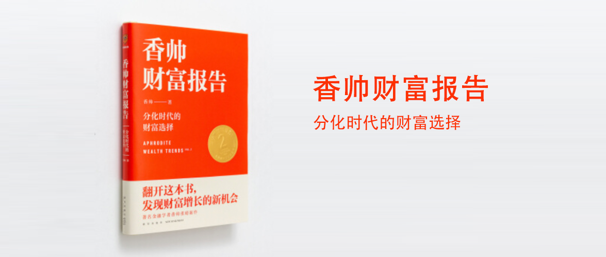

香帅财富报告2-2021-分化时代的财富选择
==========================

作者：香帅

前言
--------------------------

增长和分配从来都是人类社会最重要的两大议题，只不过在不同历史阶段，这两大议题会有不同的权重而已：普遍高增长时期，增长占据主导；而经济越停滞缓慢，分配越成为社会的关注焦点。

信息化和数字化是更具“马太效应”的技术进步，它们改变了企业的组织模式和增长路径，也改变了劳动力市场结构，收入和财富都更加快速地向精英层倾斜，代表传统“中产”的技术蓝领和普通白领则普遍受损。再加上这个阶段的社会思潮普遍更关注效率，税收、反垄断、最低工资、医疗服务等政策领域都倾向于强者，助推了分化的力度和速度。此外，随着利率下行趋势的确立，全球经济的全面金融化，巨大的资金杠杆效应将“钱生钱”的逻辑发挥到极致——城市、国家和增长的头部化，生活环境、职业尊严、代际阶层的极化，开始日益成为这个时代隐藏的伤口。

但是繁荣的低垂之果越来越少，社会的分配机制将更多决定财富增长，所以这本书将从“分化”入手，一直写到“选择”。

第一章 历史的加速器
--------------------------

第二章 当冰山浮出水面
--------------------------

第三章 数字摩登时代
--------------------------

第四章 推开世界的门
--------------------------

第五章 特斯拉叙事
--------------------------

第六章 基金是白衣骑士吗？
--------------------------

尾声 敬你
--------------------------

后记 穿越幽暗峡谷
--------------------------