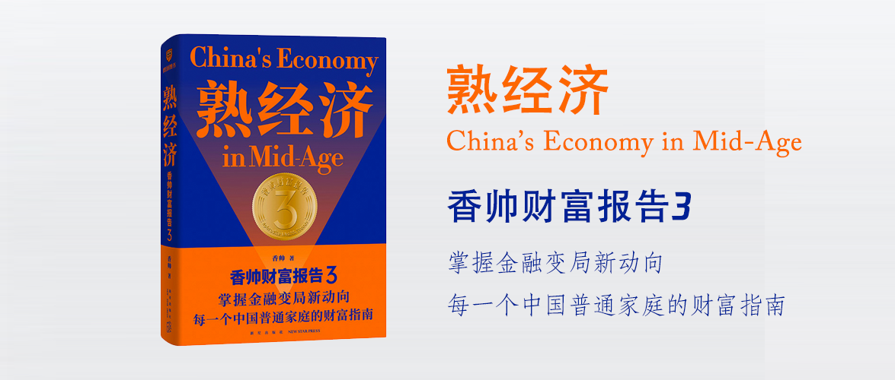

香帅财富报告3-2022-熟经济
==========================

作者：香帅

前言
--------------------------

2021年，中国家庭的财富版图似乎还没长大，成长的烦恼却接踵而至。

上卷 今夕是何年——那些席卷过我们的财富浪潮
--------------------------

两个变量：一是自2018年开始，中美贸易摩擦加剧，中国在硬科技方面被“卡脖子”，如果不尽快补短板，中国在下一阶段的博弈中将会非常被动。二是2020年新冠肺炎疫情大暴发，全球线上化、数字化渗透进程加速。数字平台的边界突破更加快速，在社会财富创造、财富分配、公共治理，甚至发展模式中都越来越具有举足轻重的地位。

这两个变量是2020年中国各项事件背后的原动力。

在美国，同样事件频发，特斯拉暴涨、特朗普支持者大闹国会山、Facebook&Twitter封禁特朗普账号。

2021年初，中美两国（占全球70个最大数字平台90%的市值），以风格迥异的方式开启了关于限制平台权利／权力的讨论和行动。这可能是巧合，也可能是历史演进中的必然。

第一章 风起青蘋之末
--------------------------

第二章 生活因你而火热
--------------------------

第三章 乍暖还寒时候，最难将息
--------------------------

第四章 一切都在变化中
--------------------------

第五章 夏天的最后一朵玫瑰
--------------------------

第六章 塞下秋来风景异
--------------------------

下卷 未来地平线——那些即将影响我们的财富变量
--------------------------

第七章 通胀篇：大缓和还是大转折？
--------------------------

第八章 二级市场篇：没那么简单
--------------------------

第九章 一级市场篇：冰火两重天
--------------------------

第十章 数字货币篇：向着那未知的世界去远行
--------------------------

第十一章 数字平台篇：你别无选择
--------------------------