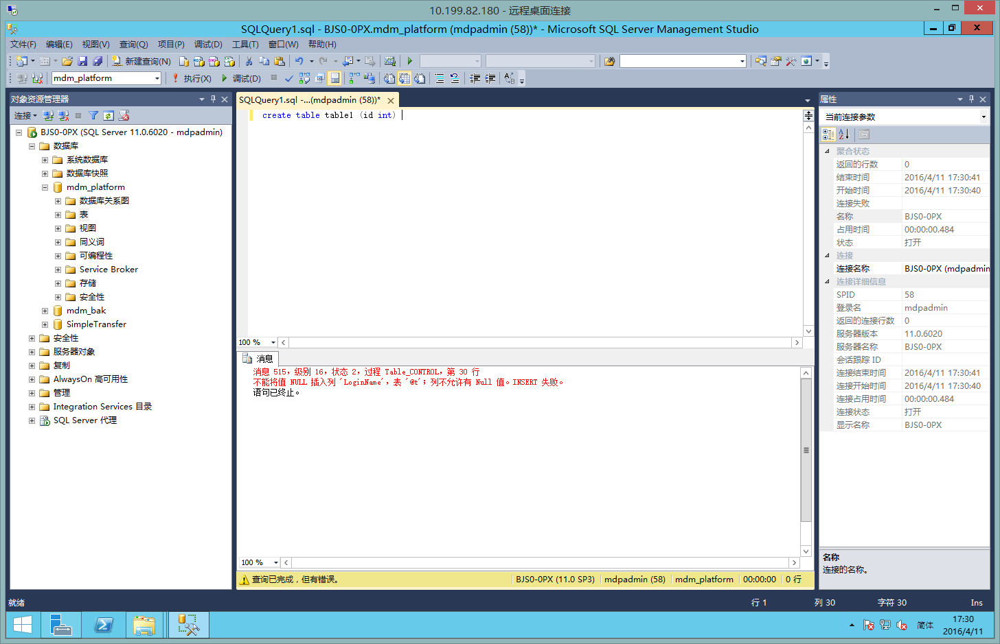

如何部署一套主数据平台
=====================

> 主数据平台2.0版本 安装及网站部署说明

> 创建时间：2016-04-11


准备工作
-------


拷贝部署所需文件，服务器路径： `\\10.199.82.179\C$\mdp_installer\`

__安装文件说明__

名称                 | 说明
-------------------- | ----------------------------------------
0.1DbBak             | 数据库备份(新服务器数据库还原,完全覆盖)
0.2ODBC              | Oracle 客户端 + MySQL ODBC + PostgreSQL ODBC + Office Access Data
0.3OpenPortal        | 主数据主站点
0.4WebSite2.0        | 主数据副站点(运维人员维护站点)
0.5ProjectDbBak      | ETL运行备份库


__安装环境说明__


名称                         | 说明
---------------------------- | ----------------------------------------
Windows Server 2008/2012 R2  | 
IIS                          | 7.0 以上版本，开启ASP.NET相关功能
.Net Framework 4.0           | 4.0 以上版本
SQLSERVER 2012               | 数据库要求安装SSDT工具包
Oracle客户端                  | 使用命令行免安装版本，11.2.3版本
MySQL 5 ODBC                 | 5.2.5-x64
PostgreSQL ODBC              | 09_01_0200-x64


安装步骤
--------

###步骤1. 在新数据库服务器上还原

名称                            | 说明
------------------------------- | ----------------------------------------
0.1DbBak\mdm_platform.bak       | 基础库
0.1DbBak\mdm_bak.bak            | 模板库
0.1DbBak\SimpleTransfer.bak     | 用于大数据传输的基础实例


> __注意：__

> 还原数据库后，建议沿用原有的数据库用户名mdpadmin。

> 在还原数据库后，如果沿用原有用户名，默认情况下会出现无法创建表的问题。

> 尝试在还原的数据库上创建表`create table table1 (id int)`，将收到错误信息：

> ```
> 消息 515，级别 16，状态 2，过程 Table_CONTROL，第 30 行
> 不能将值 NULL 插入列 'LoginName'，表 '@t'；列不允许有 Null 值。INSERT 失败。
> ```

> 

> __解决方法__：删除每个库（3个库需要操作3次）的用户后，重新添加该用户，并设置为db_owner。

> 以`mdm_platform`为例：

> 1. SQLServer Management Studio打开mdm_platform数据库 -> 安全性 -> 用户

> 2. 删除用户mdpadmin。

> 3. 右键“用户”->新建用户

>       - 常规 -> 用户类型 -> 选择“带登录名的 SQL 用户”

>       - 用户名：mdpadmin  登录名：mdpadmin  架构：dbo

>       - 成员身份：db_owner

> 4. 测试，分三步执行下面的SQL语句

>``` 
> create table table1 (id int) 
> select * from table1
> drop table table1
>```

###步骤2. 安装`mdp_installer\0.2ODBC\`对应驱动

> 注意，Oracle使用命令行方式install.bat安装。安装完成后，必须将Oracle路径加到系统环境变量PATH中。

> 本例中，需要将C:\Oracle\;C:\Oracle\bin\;添加到PATH中。（此步骤必须重启）

###步骤3. 启用SQLSERVER数据库配置选项

> 请确保ODBC相应的Provider已安装，否则可能测试不通过。

为了能正常使用OPENROWSET函数以及启用自定义函数（CLR函数），需要修改SQLServer默认设置。

```
USE master;
GO

/*
启用 "clr enabled" 配置选项
启用 "Ad Hoc Distributed Queries" 配置选项
*/

EXEC sp_configure 'show advanced options', 1;
reconfigure;
GO

EXEC sp_configure 'clr enabled', 1
reconfigure;
GO

EXEC sp_configure 'Ad Hoc Distributed Queries',1
reconfigure
GO
```

参考链接：https://msdn.microsoft.com/en-us/library/ms187569.aspx

执行结果：
```
配置选项 'show advanced options' 已从 1 更改为 1。请运行 RECONFIGURE 语句进行安装。
配置选项 'clr enabled' 已从 0 更改为 1。请运行 RECONFIGURE 语句进行安装。
配置选项 'Ad Hoc Distributed Queries' 已从 0 更改为 1。请运行 RECONFIGURE 语句进行安装。

```

为了使用`OPENROWSET('OraOLEDB.Oracle'`访问，还需要设置“允许进程内”。

具体步骤：“链接服务器”->“访问接口”->“OraOLEDB.Oracle”，右键属性，勾选“允许进程内”。（此步骤无须重启）
    
测试步骤：

```
SELECT * FROM OPENROWSET('OraOLEDB.Oracle','(DESCRIPTION =(ADDRESS = (PROTOCOL = TCP)(HOST = 10.199.80.99)(PORT = 1521))(CONNECT_DATA =(SID = SID)(SERVER = DEDICATED)(SERVICE_NAME = wderp)))';'mdp_nc';'mdp_nc_2012Qty', 'SELECT * FROM WDERP.GL_ACCOUNTBALANCE WHERE GSBM=''WY027'' ORDER BY NET ASC')
```
    
部署主站点（OpenPortal）
------------------------

复制OpenPortal相关文件
```
$ mkdir D:\mdp
$ mkdir D:\mdp\OpenPortal\
$ xcopy /E /Y C:\mdp_installer\0.3OpenPortal D:\mdp\OpenPortal\
```

- http端口：8080
- .net 4.0 集成模式
- 


部署辅助站点（WebSite2.0）
------------------------

复制ITWebSite相关文件
```
$ mkdir D:\mdp
$ mkdir D:\mdp\ITWebSite\
$ xcopy /E /Y C:\mdp_installer\0.4WebSite2.0 D:\mdp\ITWebSite\
```

- http端口：80
- .net 4.0 集成模式
- 
