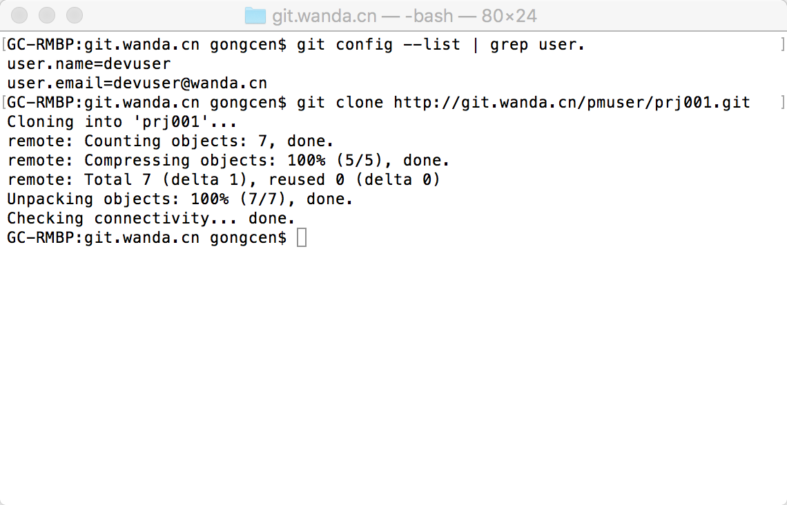
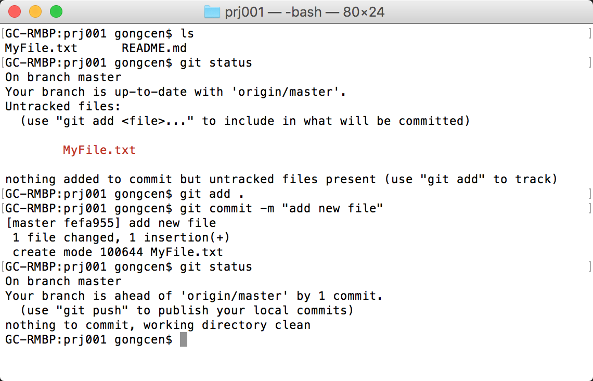
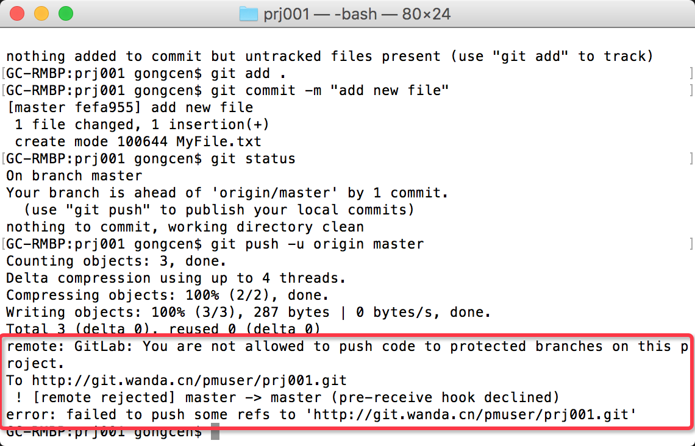
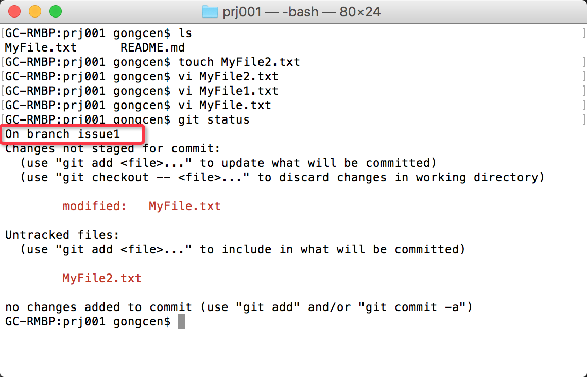
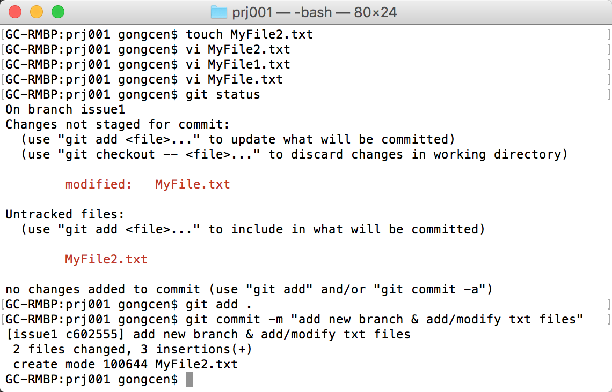
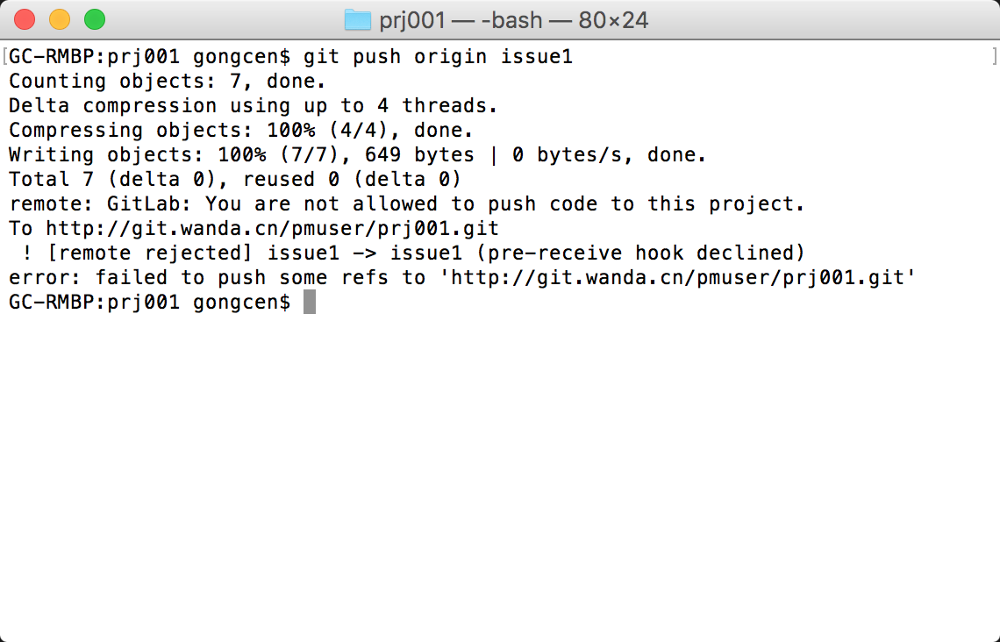
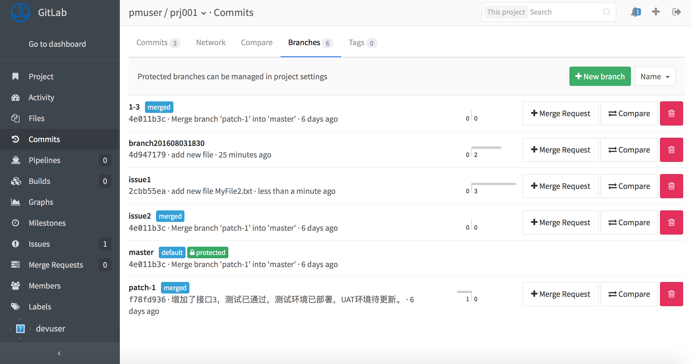
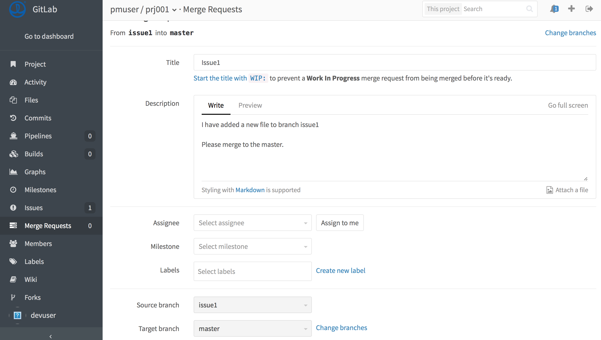
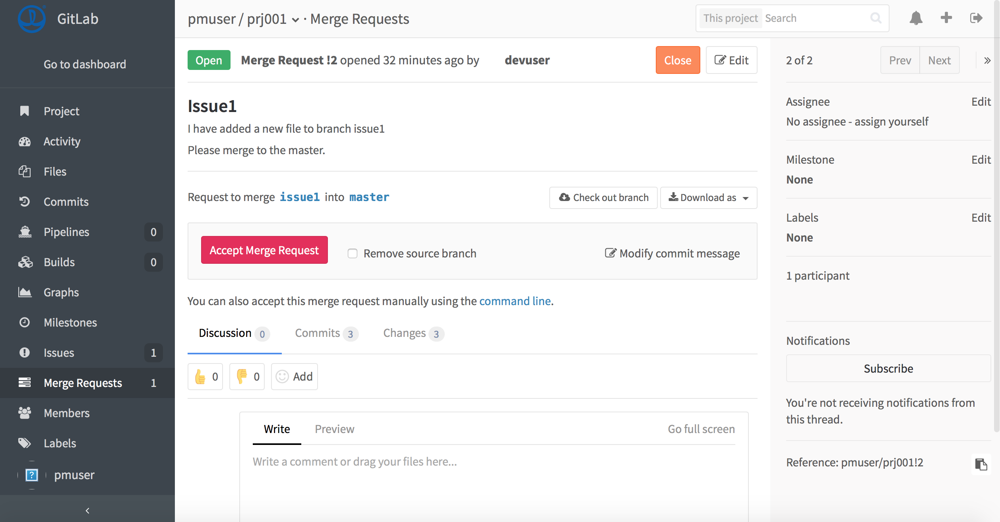

GitLab - 项目成员如何参与到项目中
============================

场景说明
-------

1. 项目已经由（ @pmuser ）建立，并将用户（ @devuser ）添加至项目（ prj001 ）中。

2. 项目（ prj001 ）采用默认方式配置。也就是，master分支默认为Developers can push = false

3. 本文假定用户使用shell脚本进行本地操作。

工作步骤（ Developer ）
------------------------

1. 建立本地工作目录

    使用`git clone`命令从服务器克隆到本地。

    

2. 修改本地目录文件（模拟用户实际操作一次，并计划更新）

    ```
    touch MyFile.txt

    vi MyFile.txt
    ```

3. 操作本地工作目录

    > 每个工作任务作为一次单独的提交（`git commit`），而不要将多次任务混在一起提交。

    > 每次做提交的时候，不会影响远程服务器的版本。

    ```
    git add .

    git commit -m "add new file"
    ```

    

4. 尝试推送到远程服务器

    ```
    git push -u origin master
    ```

    

    此处将得到一个错误。原因是因为master分支被设置为protected。

    处理此问题，可以在服务器端修改master分支为Developers can push = true。但是本文将换一种方式来支持这样的变更。

5. 新建分支

    使用如下两个命令中的任何一个，新建并切换到分支

    ```
    git branch issue1

    git checkout issue1
    ```

    或

    ```
    git checkout -b issue1
    ```

    本例子中，尝试修改MyFile.txt文件并且新增了一个MyFile2.txt文件。请重复步骤3完成本地提交（ `git commit` ）（具体如图）

    

    

6. 提交新分支到服务器

    使用以下命令推送。

    ```
    git push -u origin issue1
    ```

    如果遇到错误，则需要添加ssh key，具体方法参考：[SSH文档](https://gitlab.com/help/ssh/README)，并使用ssh的git clone规则重新clone后才能使用。

    

    以上的内容将会添加到新的分支上，并在服务器上添加新分支。

7. 发送合并请求（Merge Request）

    假设步骤6已经成功，那么登录gitlab站点。选择Projects，选择Branches，找到刚刚提交的分支。

    

    选择对应分支右侧`Merge Request`，填写对应说明，并提交。

    

    到此，作为一名开发者的工作就结束了。


工作步骤（ Master ）
------------------------

作为一名Master，如果在Developer完成了以上工作内容之后，它的内容仅添加在了分支中，此时需要Master人工审核后，才能合并到主分支。

1. 检查提交的请求

    查看所有的分支

    ```
    git branch -a
    ```

    获取并切换到远程分支

    ```
    git checkout remotes/origin/issue1
    ```

    检查通过后，可以登录gitlab网站进行处理。

2. 接受请求

    