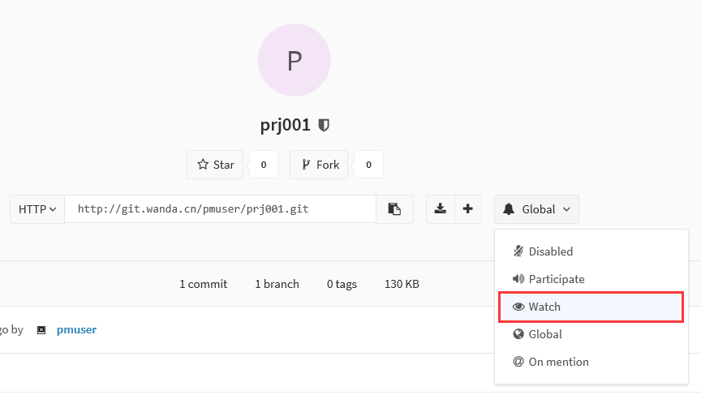

GitLab - 项目团队如何共享文档
===========================

场景说明
-------

适合于多个团队之间需要相互暴露接口、协议、文档等。

角色要求
-------

|    角色名        |     说明                                          |      举例      |
|:---------------:|:-------------------------------------------------:|:--------------:|
|  项目经理        |  负责创建项目、分支合并、发布等工作。                          |   pmuser      |
|  开发人员        |  通常由具体接口开发人员负责。                        |   devuser      |
|  粉丝            |  需要关注文档变化的人员。                           |   watcher      |

场景模拟
-------

项目经理（ @pmuser ）

1. 创建项目，建立`Internal`和`Public`的项目才可以被粉丝（ @watcher ）关注到。

    

2. 编辑或新建文件，并确定文档目录结构等，如直接在README.md中修改内容。

    

    

3. 添加项目成员

    

粉丝（ @watcher ）

1. 关注项目

    

2. 修改通知类型

在个人设置中点击“Profile Settings”中设置“Notifications”

开发人员（ @devuser ）

1. 修改文档内容

    

    > 修改文档并提交的过程，实际上涉及到Git及中央仓库的三个概念：

    > 1. 分支，每个features都应该在分支上完成，并在测试通过后，汇入主分支。

    > 2. Merge Requests，提交分支的用户，需要向项目的master发起并入分支的请求，只有该请求被并入特定分支后，该分支才可能被看到。

    > 3. Merge / PATCH，合并分支的过程实际上是打补丁的过程。

    > 详细内容请查阅GIT参考资料。

2. 提交文档修改内容。

    > 要求描述清晰，内容准确。

    默认情况下，通过用户界面，补丁的名字会自动按顺序标记。

    

项目经理（ @pmuser ）

1. 在Merge Requests中，看到已经提交的补丁信息。表示，开发者已经根据要求提交了了合并请求的分支。

    

2. 合并补丁（patch-1）到分支（默认为master）

    

邮件通知
-------

1. 每个角色的用户，都能收到对应的邮件通知。但仍然建议，每个项目，在更新信息后，将对应的项目链接及修改的位置，通过即时通讯工具分享给项目组其他成员。

评论功能
-------

1. 用户可以针对不同的提交内容等，提出BUG等，促进修改。

    点击Commits，选择对应的Commit，进行评论即可。

    

问题反馈（Issues）
--------------

1. 针对该项目`New Issues`

    

2. 开发团队可以针对这些`Issues`进行跟踪管理，并进行关闭。

    

3. 项目经理（ @pmuser ）还可以在右侧功能区域对这个问题进行分配。同时，被分配的用户会收到一个待办。

    

